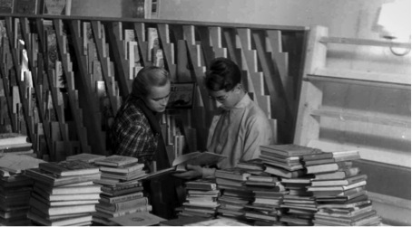
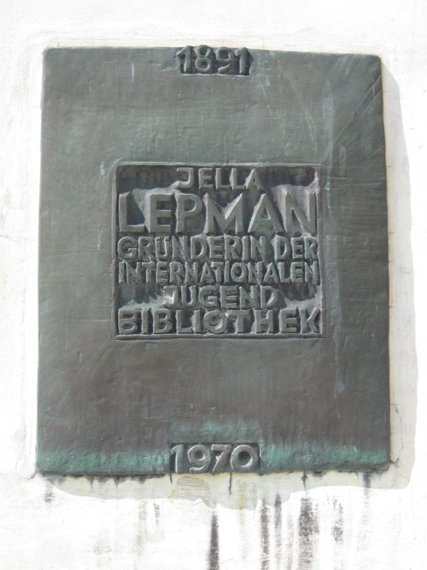
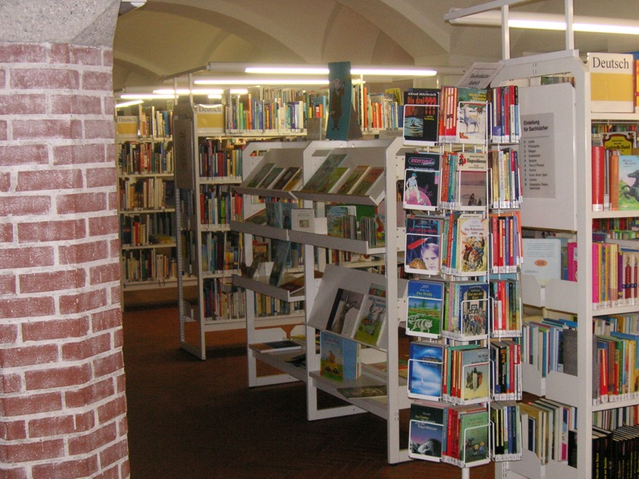

Es gibt ein Buch, das vor fünfzig Jahren geschrieben wurde und jeden,
der es in die Hände bekommt, in seinen Bann zieht. Es heißt *Die
Kinderbuchbrücke* und liest sich wie ein Abenteuerroman. Dessen Heldin
ist eine außerordentliche Frau, der viel mehr Ruhm hätte zustehen sollen
als eigentlich der Fall gewesen ist. 

Was sie praktisch im Alleingang geleistet hat, kennt keinen Vergleich.
Ihre Ideen haben die Welt verändert und auf bahnbrechende Weise zur
Völkerverständigung beigetragen. Mehr als andere Persönlichkeiten hätte
sie den Friedensnobelpreis verdient, und doch ist ihr autobiographisches
Buch fast in Vergessenheit geraten und ihr Name den Wenigsten geläufig.

Wer war Jella Lepman?

### 1. Vorgeschichte

Geboren wurde sie am 15. Mai 1891 in Stuttgart als älteste von drei
Töchtern des wohlhabenden jüdischen Textilfabrikanten Joseph Lehmann und
seiner Frau Flora. Ihr Cousin war der Philosoph Max Horkheimer, der
zusammen mit Theodor W. Adorno die Frankfurter Schule begründete.

Sie wuchs in einem liberalen Haus auf. Ihr Vater war ein Demokrat
Uhlandscher Prägung und bald entwickelte Jella ein großes soziales
Engagement. Bereits mit 17 Jahren gründete sie in ihrer Heimatstadt eine
"Internationale Lesestube" für die Kinder der ausländischen Arbeiter der
berühmten Waldorf-Astoria-Zigarettenfabrik – ein Ort, übrigens, der für
die deutsche Pädagogik prägend werden sollte, denn in dieser Fabrik
entstand 1919 nach Rudolf Steiners Prinzipien auch die erste
Waldorf-Schule. 

1913 heiratete sie den Deutsch-Amerikaner Gustave Horace Lepman, der aus
dem Ersten Weltkrieg als Invalide zurückkehrte. Er starb 1922 an einem
Herzinfarkt und ließ seine knapp 30-jährige Frau mit zwei kleinen
Kindern zurück.

Bravourös fing Jella Lepman an, sich im Leben durchzukämpfen und fand
bald eine Anstellung als erste weibliche Redakteurin beim "Stuttgarter
Neuen Tagblatt", womit sie ihren Kindern ein bürgerliches Dasein sichern
konnte. 

1929 kandidierte sie mit Theodor Heuss, dem späteren Bundespräsidenten,
als Vorsitzende der Deutschen Demokratischen Partei Württembergs für den
Reichstag. Doch dann kam "die nie zu begreifende Katastrophe", wie Jella
Lepman die Machtergreifung Hitlers bezeichnete (J.W. Goethe-Universität,
10), und die politische Lage in Deutschland nahm eine tragische Wende.
Lepmans demokratische Ansichten und ihre jüdische Herkunft führten bald
zu ihrer Entlassung. So beschloss sie 1936 kurzerhand mit ihren beiden
Kindern über Florenz nach England zu emigrieren. 

Die zehn Exiljahre in London waren nicht einfach. Erst musste sie mit
gelegentlichen Brotverdienstarbeiten vorliebnehmen. Nach zwei Jahren
wurde sie jedoch von der Universität Cambridge mit der Durchsicht des
geretteten Nachlasses von Arthur Schnitzler beauftragt. Später nahm man
sie in den Foreign Office der BBC und daraufhin in die "American
Broadcasting Station in Europe" auf, von wo aus sie zusammen mit Golo
Mann Beiträge nach Deutschland sendete. Kurz vor Kriegsende wurde sie
schließlich zur Botschaft der Vereinigten Staaten in London versetzt, um
eine europäische Nachkriegsillustrierte, "VOIR", zu gründen. 

### 2. Von der Internationalen Jugendbuchausstellung zur Gründung der
Internationalen Jugendbibliothek

Als der Krieg zu Ende war und Amerika eine der vier Besatzungsmächte im
besiegten Deutschland wurde, startete man das *Reeducation Program* mit
dem Ziel einer umfassenden Entnazifizierung und bat Jella Lepman als
"Beraterin für die kulturellen und erzieherischen Belange der Frauen und
Kinder" (*Special Adviser for Women’s and Youth Affairs* ) nach
Deutschland zurückzukehren.

Sie musste zuerst gegen ihren inneren Widerstand kämpfen, um ihre Heimat
wieder zu betreten, und ließ sich lediglich dazu überreden, weil ihr die
deutschen Kinder am Herzen lagen. Was genau ihre Aufgabe sein sollte,
war ihr dennoch nicht ganz klar.

Im Hauptquartier in Bad Homburg nach einem abenteuerlichen Flug mit
einem Militärflugzeug angekommen, beantragte Jella Lepman eine
mehrwöchige Informationsreise durch das Land, um sich ein Bild von der
Situation und den Bedürfnissen der deutschen Kinder und Frauen zu
machen.

Von einem jungen, amerikanischen "Hinterwäldler" (Lepman 1964, 31 f.)
namens Joe, der nie sein Nest im Mittleren Westen verlassen hatte und
sich nun wie auf dem Mars fühlte, wurde Jella Lepman mit einem Jeep
durch ganz Deutschland kutschiert. 

Sie schaute sich die zerbombten Städte an und holte Rat bei einigen
ihrer ehemaligen Freunde und Bekannten, unter anderem Alfred Weber,
Marianne Weber, Elly Heuss-Knapp und Theodor Heuss. Noch mehr als die
körperliche war Jella Lepmann die geistige Verarmung der Kinder
aufgefallen und so kam sie bald zur Erkenntnis, dass man Frauen und
Kindern nicht nur Brot und Kleidung, sondern auch "Nahrung für den
Geist" geben sollte (Lepman 1964, 48). 

Zurück im Hauptquartier schlug Jella Lepman General McClure und seinem
Stab als Hauptmaßnahme eine Wanderausstellung der besten Kinder- und
Jugendbücher verschiedener Nationen vor. "Lassen Sie uns bei den Kindern
anfangen, um diese gänzlich verwirrte Welt langsam wieder ins Lot zu
bringen. Die Kinder werden den Erwachsenen den Weg zeigen", versicherte
sie (Lepman 1964, 47). Doch im Etat gab es keinen Posten für
Kinderbücher.

Jella Lepman ließ nicht locker und nahm sich vor, die Ausstellung durch
Spenden zu verwirklichen. Mit unermüdlichem Elan schrieb sie zwanzig
Länder an und bat um Unterstützung bei der Realisierung ihres Projekts:

> "Wir suchen nach Wegen, um die Kinder in Deutschland mit den
Kinderbüchern anderer Nationen bekannt zu machen. Die deutschen Kinder
haben so gut wie keine Bücher mehr, nachdem die Kinder- und
Jugendliteratur der Hitlerzeit ausgeschaltet wurde. Auch die Pädagogen
und Verleger brauchen zu ihrer Orientierung Bücher aus der freien Welt.
Die Kinder tragen keine Schuld an diesem Krieg, deshalb sollen Ihre
Bücher die ersten Boten des Friedens sein! Sie sollen zu einer
Ausstellung zusammengestellt werden, die zuerst Deutschland, später
vielleicht auch andere Länder bereist. Zur Überwindung fremdsprachlicher
Schwierigkeiten bitten wir vor allem um Bilderbücher und illustrierte
Bücher. Aber auch die gute erzählende Literatur soll den Kindern in
Gruppenarbeit erschlossen werden. Wir hoffen, dass die deutschen
Verleger sich die Übersetzungsrechte vieler dieser Bücher erwerben
können.
Wir bitten Ihr Land auch um Kinderzeichnungen und Kindermalereien. Diese
Bilder sprechen eine internationale Sprache und werden die Kinder
beglücken." (Lepman 1964, 51 f.)

Die Aktion zeigte Erfolg und neunzehn Länder signalisierten ihre
"rückhaltlose Zustimmung". Nur Belgien schien seine Feindseligkeit gegen
Deutschland nicht ablegen zu wollen, aber Jella Lepman wusste auch
dieses von den Deutschen zweimal überfallene Land zu überreden: *"Steht
es nicht besonders in Ihrem Interesse, eine Generation junger Deutscher
mit heranzubilden, die dafür bürgt, dass ein dritter Überfall nicht zu
fürchten ist?"* Damit überzeugte sie schließlich auch Belgien, das
schließlich mit einer der schönsten Buchsendungen zur Ausstellung
beitrug (Lepman 1964, 62 f.).

Als ersten Ausstellungsort wählte man München, das trotz seiner jüngsten
schwarzen Vergangenheit – war es doch die Wiege der nazistischen
Bewegung gewesen – zum geistigen Zentrum der Bundesrepublik auserkoren
war. Ein Gebäude war von den Bomben verschont worden: das Haus der
Kunst. Dieses erste Monumentalgebäude des nationalsozialistischen
Regimes im Stile eines griechischen Tempels wurde als "Haus der
Deutschen Kunst" zum Sinnbild von der Unterdrückung von Künstlern, deren
Kunstwerke als "entartet" diffamiert und von der "Großen Deutschen
Kunstausstellung", die während der Nazi-Zeit dort einmal im Jahr
stattfand, entfernt wurden. Inzwischen diente das Haus als
amerikanisches Offizierskasino. Als sie die großen Räume für die möglich
Nutzung als Ausstellungsraum besichtigte, war sich Jella Lepman aber
sicher: das wird es sein, das Schicksal hatte es so gewollt. Dieses
Gebäude war unversehrt geblieben, damit "die internationalen
Kinderbücher in diesen Heidentempel einziehen und ihre guten Geister die
schlimmen verjagen!" (Lepman 1964, 64)

Im Frühling 1946 hatte dann Jella Lepman eine entscheidende Begegnung.
Eleanor Roosevelt, die Witwe des Präsidenten, besuchte die amerikanische
Besatzungszone und Jella Lepman setzte sich in den Kopf, sie als
Verbündete zu gewinnen. Es gelang ihr und danach setzte sich Eleanor
Roosevelt mehrfach ein, um die deutsche Journalistin bei der
Verwirklichung ihrer Vision zu unterstützen. Beide Frauen verstanden
sich von Anfang an hervorragend und Jella Lepman hätte das berühmte
Motto der amerikanischen Präsidentenwitwe selber formulieren können:
"The future belongs to those who believe in the beauty of their dreams".

Am 3. Juli 1946 war es endlich soweit: die Internationale
Jugendbuchausstellung wurde eröffnet.

In einem begeisterten Artikel beschrieb Erich Kästner in der "Neuen
Zeitung", welche Gesellschaft sich dort zusammengefunden hatte:

> "Es sind unter anderem gekommen: die Herren Eulenspiegel, Baron
Münchhausen, Däumling und Rattenfänger aus Norddeutschland, Herr
Rübezahl aus Schlesien, Monsieur Jean Bart aus Frankreich, Lord
Fauntleroy und die Mister Robin Hood, Robinson, Gulliver, Copperfield
und Twist aus England, Sahib Kim aus Indien, der Indianer Mohawk und der
Neger Onkel Tom gleichfalls aus den Vereinigten Staaten, ein standhafter
Zinnsoldat aus Dänemark sowie andere namhafte Persönlichkeiten. Außer
diesen Herrschaften haben sich auch eine Reihe berühmter Tiere
eingefunden, ein gestiefelter Kater, ein kleiner Stier namens Ferdinand,
die Maus Micky, der zahme Bär Pooh, der Fuchs Reineke und Spiegel das
Kätzchen. Alle Prinzen, Könige, Feen, Köhler, Schatzgräber, Hexen,
Kapitäne, Helden und Zauberer, die der Eröffnung beiwohnten, mit vollem
Namen und Geburtsort aufzuführen, reichte die Zeitung nicht aus, und so
sei ihrer nur summarisch gedacht. Wer sie aufsuchen will, kann das tun.
Ihre Adresse lautet: München, Haus der Kunst. Empfang täglich von 9 bis
11 und von 14 bis 17 Uhr. Anzug nach Belieben. Erwachsene dürfen
mitgebracht werden" (Lepman 1964, 76 f.).

Der deutsche Teil der Ausstellung bestand aus zur Verfügung gestellten
privaten Sammlungen antiquarischer Kinderbücher. Die Bücher der Nazizeit
wurden aussortiert. Kästner hätte sie trotzdem in einem separaten
Kabinett "nur für Erwachsene" gezeigt, aber Jella Lepman fand zu Recht,
dass sie nicht zu einer Ausstellung passten, die doch Kindern Bücher als
Friedensboten präsentieren wollte.

Die Ausstellung stellte die erste internationale, kulturelle
Veranstaltung im Nachkriegsdeutschland dar und erlaubte den vielen
Besuchern aller Altersstufen und Bevölkerungsschichten durch
Kinderbücher die Welt zu erkunden. Später tourte die Ausstellung durch
das ganze Land. 

Auf München folgte Stuttgart. Um die Schau hier zu beherbergen, wurden
zur Freude des Direktors Dr. Wilhelm Hoffmann die ersten Räume der
zerstörten Württembergischen Landesbibliothek wieder aufgebaut. Ähnlich
verlief es mit dem Städel Museum in Frankfurt. Anschließend kam die
Ausstellung nach Berlin, wo sie im US-Information-Center in Schöneberg
gezeigt wurde. In den Jahren 1947 und 1948 kam sie noch nach Hannover,
Braunschweig und Hamburg. Schließlich wurden die Bücher wieder in Kisten
verpackt. Sie waren Eigentum des offiziellen Veranstalters, der
US-Militärregierung, und gingen später an den "Verein Internationale
Jugendbibliothek" über.

Der Erfolg der Ausstellung gab den Impuls für weitere literarische
Unternehmungen. Zu Weihnachten 1946 hatte Jella Lepman nur einen Wunsch:
den Kindern ein Buch zu schenken. Sie übersetzte das pazifistische
Bilderbuch von Munroe Leaf und Robert Lawson, *Ferdinand the Bull*, ins
Deutsche, ließ es als Sonderdruck in 30.000 Exemplaren auf
Zeitungspapier herstellen und an Berliner Kinder verteilen. Sie bat
außerdem Erich Kästner, die Weihnachtsverse *It was the Night before Christmas* von Clement Clarke Moore zu übersetzen und veröffentlichte
sie in einer farbigen, den deutschen Kindern gewidmeten
Weihnachtsausgabe von "Heute". 

Inzwischen war Jella Lepman im Oktober 1946 nach München versetzt
worden, wo sie zur stellvertretenden Chefredakteurin der Illustrierten
"Heute" ernannt wurde. Die Zeitschrift "Heute" und die "Neue Zeitung"
hatten die Aufgabe, die deutschen Leser über aktuelle Ereignisse zu
informieren und ihnen dabei die Vereinigten Staaten als vorbildliche
Demokratie vorzustellen. Natürlich war die Intention der Umerziehung
deutlich zu spüren, doch den Redakteuren blieb ein großes Maß an
Freiheit. 

Als Journalistin versuchte Jella Lepman immer wieder, das Anliegen der
Kinder zu verteidigen. Später kam Jella Lepman auf die Idee,
Gutenacht-Geschichten zu sammeln. Einem Aufruf in der "Neuen Zeitung"
folgten 20.000 Einsendungen, von denen die überzeugendsten in der
Zeitung veröffentlicht wurden. Mit diesem Material gab Jella Lepman
später drei Geschichtensammlungen beim Züricher Europa-Verlag heraus. 

Aber ihr wichtigster literarischer Beitrag war, dass sie ihren Freund
Erich Kästner zum Buch *Die Konferenz der Tiere* inspirierte. Kaum war
die eine Schreckenszeit zu Ende, schon stand wieder Kriegsgefahr in der
Welt. Es war der Anfang des Kalten Krieges. Friedenskonferenzen
scheiterten und die Menschen bewiesen ihre Unvernunft. Dabei brachten
sie immer wieder die Kinder in Gefahr. "Vielleicht", dachte sich Jella
Lepman, "war es besser, einmal die Tiere zum Zug kommen zu lassen, ihren
Instinkt der menschlichen Ratio entgegenzusetzen". Mit dieser Idee
überredete sie Erich Kästner, gemeinsam ein Buch zu schreiben, das "sich
über die Kinder hin an die Erwachsenen" richten, in möglichst vielen
Sprachen erscheinen und eine Lanze für die Völkerverständigung brechen
sollte. Und so kam es auch. Als dritten im Bund gewann Kästner seinen
Freund und Illustrator Walter Trier, der mittlerweile in Kanada lebte.
Dies sollte ihr letztes gemeinsames Werk werden, denn Trier starb bald
darauf (Lepman 1964, 107 ff.).

In der Zwischenzeit ging die Tour der Jugendbuchausstellung dem Ende zu.
Von Anfang an hatte Jella Lepman an die Möglichkeit einer Umwandlung der
Ausstellung in eine internationale Jugendbibliothek als Dauereinrichtung
gedacht. Aber zunächst fand sie bei den amerikanischen Offizieren kein
offenes Ohr dafür. Doch im Spätsommer 1947 wurde sie von der
amerikanischen Militärregierung für vier Tage nach Paris geschickt, um
bei der UNESCO für ihr Projekt zu werben. Die UNESCO erklärte sich für
nicht zuständig innerhalb Deutschlands und den Vorschlag, die Bibliothek
außerhalb Deutschlands zu gründen, lehnte Jella Lepman strikt ab.
Allerdings versprach man ihr, Professor Robert Havinghurst von der
Rockefeller- Foundation, der ebenfalls ein Büro in Paris hatte, auf
ihren Plan aufmerksam zu machen. Jella Lepman träumte von einem
Institut, das von vielen Ländern gemeinsam finanziert werden sollte.
Dies wurde leider nie erreicht, aber sie ließ bei der UNESCO nicht
locker, vor allem als 1950 drei UNESCO-Institute in Deutschland eröffnet
wurden. Am Ende erreichte Jella Lepman wenigstens, dass die
Internationale Jugendbibliothek (IJB) als "Associated Project of UNESCO"
anerkannt wurde.

Im Frühherbst 1947 meldeten sich schließlich tatsächlich Abgesandte der
Rockefeller-Foundation bei Jella Lepman und zeigten Interesse für ihr
Bibliotheksprojekt. Einer von ihnen war Professor Havinghurst. Im
darauffolgenden Frühling lud er Jella Lepman zu einer Erkundungsreise in
die Vereinigten Staaten ein, um einerseits Unterstützung für ihr Projekt
einzuwerben und sie andererseits mit der Arbeitsweise der amerikanischen
Jugendbibliotheken vertraut zu machen. Die Reise wurde bestens
vorbereitet, Briefe an Bibliotheken, Verleger und bedeutende
Persönlichkeiten wurden vorab verschickt. Vor allem nahm man Kontakt mit
der American Library Association (ALA) in Chicago und mit Mildred
Batchelder auf, die dort die Children’s Library Section leitete.

Nach dieser erfolgreichen Reise kam sehr viel Unterstützung von Seiten
der ALA, die sich zunächst in Form einer Spende von Tausenden von
Büchern konkretisierte.

Bald musste Jella Lepman jedoch erkennen, dass ihr Plan ohne deutsche
Hilfe zum Scheitern verurteilt war. So kam es zu einer ersten
Kontaktaufnahme mit dem bayerischen Kultusministerium und dann vorerst
zur Gründung  des Vereins der Freunde der IJB e. V. als Träger der
zukünftigen Bibliothek. Die IJB wurde zwar durch amerikanische  Gelder
und Spenden ermöglicht, aber sie ist ein eingetragener deutscher Verein
und wurde vorwiegend mit deutschen Mitteln finanziert, in staatlichen
Gebäuden untergebracht und hatte überwiegend deutsche Mitarbeiter, wie
Eva-Maria Ledig, die Assistentin von Jella Lepman in den
Gründungsjahren, schreibt: "Ihre Existenz verdankt die Internationale
Jugendbibliothek in erster Linie dem Freistaat Bayern und der Stadt
München, denen sich in den 50er Jahren die Bundesregierung angeschlossen
hat" (Ledig, 55).

Heute wird die IJB zu unterschiedlichen Anteilen aus Mitteln des
Bundesministeriums für Familie, Senioren, Frauen und Jugend, des
Bayerischen Staatsministeriums für Bildung und Kultus, Wissenschaft und
Kunst und des Kulturreferats der Landeshauptstadt München institutionell
gefördert. Außerdem gründete die Verlegerin Christa Spangenberg 1996 die
Stiftung Internationale Jugendbibliothek, welche seitdem die
Trägerschaft der IJB inne hat.

Endlich fand man einen möglichen Sitz der Bibliothek in der
Kaulbachstraße 11a.

Es war eine zweigeschossige Villa im Neobarockstil hinter der
Bayerischen Staatsbibliothek, gesäumt von Ruinen, aber mit einem großen
Garten.

In der alten Gartenvilla, die inzwischen vom modernen Anbau der
Staatsbibliothek eingezwängt ist, befindet sich heutzutage die
Bibliotheksakademie Bayern, die für die Aus- und Fortbildung der
Bibliothekare in Bayern zuständig ist.

Am 14. September 1949 war es soweit und die IJB öffnete ihre Tore. Erich
Kästner verkündete den Kindern aller Welt in einem Brief, der in seiner
Abwesenheit während der Eröffnung verlesen wurde: "Ihr seid Hausbesitzer
geworden!" Und Jella Lepman erklärte in ihrer Ansprache: "Die
Internationale Jugendbibliothek will in Wort und Schrift, in Führungen
und Vorträgen, in Rundgesprächen und Ausstellungen das Verständnis 
zwischen Kindern und jungen Menschen aller Nationen fördern. Sie will
den Eltern, Pädagogen, Schriftstellern, Illustratoren neue Möglichkeiten
der Information und Zusammenarbeit eröffnen, sie will den Verlegern
Deutschlands und der ganzen Welt Hinweise und Anregungen für die
Buchproduktion geben. Ganz neue Wege sollen dabei eingeschlagen werden,
und die Kinder selbst werden unsere ersten und besten Mitarbeiter sein."
(Ledig, 78).

### 3. Die IJB: eine Revolution im deutschen Bibliothekswesen

Es wurden wahrlich neue Wege eingeschlagen. Jella Lepman legte von
Anfang an großen Wert darauf, dass die Bibliothek sich nicht auf
"Massenbetrieb" einstellte und dass jedes Kind und jeder Jugendliche
individuell behandelt wurde. Sofort verlieh sie den Jungen
Bibliotheksbenutzern Mitverantwortung, indem sie ein Jugendkomitee
bilden ließ. Die jungen Leser waren Mitgestalter in Diskussionsgruppen
und in der Theatergruppe. Ihre Buchbesprechungen wurden sogar vom
Bayerischen Rundfunk übertragen. Ein fortschrittliches Experiment wurde
gewagt: in der Jugend-UN für 10- bis 14jährige wählten sich die Kinder
ein Land um es zu vertreten und darüber vor den anderen "Delegierten" zu
referieren. Diskussionsthemen in dieser UN-Simulation waren: Was können
wir gegen die Atombombe tun? Wie können wir die internationale
Verständigung fördern? Wie sollte eine Charta der Kinderrechte aussehen?

Der umkämpfte Glanzpunkt der Bibliothek war das Malatelier, das viele
Jahre lang vom Künstler Ferdinand Steidle geleitet wurde. Dieses
Kinderatelier war Bibliothekaren und bundesministeriellen
Verwaltungsbeamten stets ein Dorn im Auge, die kein Verständnis für ein
Malstudio in einer Bibliothek aufbringen konnten oder wollten.

Als eine Finanzierung verweigert wurde, musste man einen Beitrag von den
Kindern verlangen und auf Dauer ließ sich diese Aktivität nicht
aufrechterhalten. Später fand man aber in der Blutenburg, im jetzigen
Sitz der IJB, wieder Raum für ein Malstudio und so konnte diese Idee von
Jella Lepman wieder auferstehen.

Jella Lepman war der enge Zusammenhang zwischen Bild und Buch von Anfang
an sehr klar. Während ihrer Reise nach Amerika war sie mit der dort
schon etablierten Bilderbuchkultur in Berührung gekommen und hatte
festgestellt, dass "die erste Stufe des Kinderbuches […] in allen
Ländern nur eine Sprache [aufweist]: die Bildersprache" und dass "sobald
die Wortsprache die Bildersprache abzulösen beginnt, […] die Mauern auch
zwischen den Kindern" wachsen (Ledig, 78). Daraus erwuchs ihre
Aufmerksamkeit für die Illustration und für Kinderzeichnungen, die sie
bis an ihr Lebensende sammelte, in ihrer Wohnung aufhängte und mit denen
sie mehrere Ausstellungen gestaltete: eine zur Eröffnung der
Internationalen Jugendbuchausstellung und eine zur Eröffnung der IJB und
später eine mit Selbstportraits und eine zum Thema Hochzeit. Auch ihr
letztes publizistisches Unternehmen, dessen Veröffentlichung sie nicht
mehr miterlebte, war eine Sammlung von Kinderzeichnungen und -texten aus
35 Ländern (Lepman 1971). In der IJB wurde den Bilderbüchern ein eigenes
Zimmer gewidmet. 

Diese Vorliebe für die Illustration stieß oft auf Unverständnis. So
äußerte sich einmal der berühmte Autor der *Roten Zora* Kurt Held in
einem Brief an die Gründerin der niederländischen Sektion des
International Board on Books for Young People (IBBY) mit etwas
Verachtung über Jella Lepman: "Vielleicht setzt J.L. da auch ihren Kopf
durch und verleiht [den ersten Deutschen Jugendliteraturpreis] einem
Bilderbuch. Sie findet ja ‚den gutmütigen Löwen’ so gut. Ich finde ihn
eine cabarettistische Angelegenheit und unwahr im Fond. Der Löwe bleibt
ein Raubtier und es verfälscht im Kleinkind die Begriffe. Es ist eine
Sache für Erwachsene" (Brief an Johanna Wolff vom 7. April 1956, IJB -
Jella Lepman Archiv). Die Rede ist vom amerikanischen Bilderbuch *Der glückliche Löwe* von Louise Fatio und Roger Duvoisin, das gerade dieses
Jahr sechzig geworden ist und nichts von seinem Charme verloren hat.
Tatsächlich bekam es den ersten Deutschen Jugendliteraturpreis, der
damals noch Deutscher Jugendbuchpreis hieß, und gilt inzwischen als
absoluter Bilderbuchklassiker. Dass Bilderbücher dieselbe Beachtung wie
erzählende Werke verdienen, hatte Jella Lepman, die auch *Babar* von Jean
de Brunhoff und *Wo die wilden Kerle wohnen* von Maurice Sendak
leidenschaftlich liebte, sehr früh erkannt. Sie war so sehr davon
überzeugt, dass sie zahllose Persönlichkeiten mit Bilderbüchern und
Kinderzeichnungen beschenkte. Ein wenig schmunzeln lässt ein Brief an
Thomas Mann zu dessen achtzigsten Geburtstag: 

> "Die Internationale Jugendbibliothek sendet Ihnen hier das Buch "Der
glückliche Löwe", das aus dem Amerikanischen übersetzt wurde. Ich
glaube, ich habe Ihnen bei meinem Zusammensein bei Emmie Oprecht [der
Frau des Schweizer Verlegers Emil Oprecht] von diesem ganz entzückenden
und für meine Begriffe besten Buch der ganzen internationalen
Kinderbuchproduktion des letzten Jahres erzählt. Vielleicht macht es
Ihnen ein wenig Freude" (Brief an Thomas Mann vom 2. Juni 1955, IJB –
Jella Lepman Archiv). 

Ähnlich ergeht es einem angesichts der Tatsache, dass Jella Lepman
Winston Churchill zum Geburtstag ein Album mit Kinderselbstportraits und
dem Philosophen Martin Buber, der einmal auch die Bibliothek besuchte,
eine Auswahl von Kinderzeichnungen zu Weihnachten nach Israel schicken
ließ. 

Das Thema Bilderbuch beschäftigte Jella Lepman sehr und auf der
IBBY-Tagung über "Buch und Bild" (Wien 21. – 23.9.1955) hielt sie auch
einen Vortrag darüber.

Jella Lepman war ihrer Zeit voraus, aber sie war auch eine Visionärin,
die bis zu jenem Zeitpunkt der Bibliothekswelt fremd gewesen war. Es
wundert also nicht, dass sie viel Widerstand erlebte, vor allem von
Seiten der traditionell ausgebildeten deutschen Bibliothekare, denen das
bunte Treiben in der IJB wie ein "Zirkus" erschien (Lepman 1964, 150).
Mit ihrem resoluten und hartnäckigen Charakter erntete Jella Lepman
zudem nicht immer Sympathie. Ihr wurde oft vorgeworfen, dass sie keine
professionelle Bibliothekarin sei. Tatsächlich erschienen ihr die
organisatorischen Aspekte der Bibliotheksarbeit völlig nebensächlich,
vor allem was die Dokumentenerschließung betraf. Die praktischen
Probleme ihres beinahe utopischen Unterfangens wollte sie einfach nicht
wahrhaben. 

Die Fülle der Aktivitäten hätte viel mehr Personal benötigt als die zur
Verfügung stehenden Mittel erlaubten, so dass die Mitarbeiter ständig
überfordert waren und es auch zu Auseinandersetzungen kam. Darunter litt
vor allem die Katalogisierung. Die Bibliothekare fühlten sich von ihrer
"eigentlichen Arbeit" abgezogen und einige empfanden Widerstand gegen
die Programmarbeit, "die so gar nicht den Vorstellungen der damaligen
Bibliothekare entsprach" (Ledig, 95) 

Die Ausleihbibliothek wurde von Anfang an als Freihandbibliothek
konzipiert, was damals von den meisten professionellen Bibliothekaren
abgelehnt wurde. Später wurde das Freihandsystem, das Jella Lepman
sozusagen aus Amerika importiert hatte, auch in den deutschen
Bibliotheken eingeführt und heute erscheint uns unglaublich, dass eine
solche Diskussion für so viel Aufregung sorgen konnte.

Bezüglich der Katalogisierung gab es die größten Probleme. In ihrem
Idealismus hatte Jella Lepman die damit verbundenen Schwierigkeiten
völlig unterschätzt. Wer sollte denn die Bücher aus den fremden Ländern
und Sprachen entziffern, um sie zu katalogisieren? War eine
Formalkatalogisierung in den meisten Fällen noch machbar, so erschien
dagegen eine Sachkatalogisierung oft unmöglich. Doch Jella Lepman selbst
machte keinen Hehl aus ihrer manchmal naiven Unwissenheit: "Nicht jeder
nämlich, der Bücher katalogisiert, liebt und liest sie, dieses Phänomen
wurde mir erst später klar" (Lepman 1964, 145). Man fing mit dem
Einrichten eines Titelkatalogs an, bei dem es – wie Lepman beschönigend
sagte – "nur die Sprachklippen zu umschiffen gab" (ebd.).

Schon vor der Eröffnung der IJB hatte man mit der Erschließung der
Bücher nach bibliothekarischen Gesichtspunkten begonnen. Die American
Library Association schickte als Beraterin Margaret Scoggin, eine
Spezialistin im Kinder- und Jugendbuchbereich. Sie sollte den Katalog
anlegen und entschloss sich für folgende standortgebundene
Signaturgebung:

* Herkunftsland des Buches (Internationale Länderkennzeichen)

* Erste drei Buchstaben des Verfassers (bei erzählender Literatur) oder
des Titels (bei Sachliteratur)

* Sachliteratur nach dem Dewey-Dezimalsystem aufgeschlüsselt (1952 nach
einer für die IJB vereinfachten Systematik)

Später wurde die Aufschlüsselung der Sachbücher nach Dewey unter der
Leitung Walter Scherfs wegen der steigenden Zahl der Buchzugänge mehr
und mehr differenziert. Die beiden bestehenden Kataloge wurden
abgebrochen und neue Kataloge wurden angelegt:

1. Alphabetischer Katalog

2. Länderkatalog

3. Sachkatalog nach dem Dewey-Dezimalsystem

4. Titelkatalog (ab 1959)

5. Illustratorenkatalog

6. Chronologischer Katalog (ab 1978 auch für die historischen Bestände vor
1951 geführt)

Damals war man nicht nur gegen die Einrichtung vom Kinderleseraum und
vom Bilderbuchzimmer als Freihandbibliothek, sondern auch gegen die
Einführung des Dewey-Dezimalsystems. Die deutschen Fachleute waren für
die Anwendung der Preußischen Bibliotheksordnung. "Ich ahnte […] nicht,
daß dieser Katalog mich im Lauf meiner Karriere in die Gefahr der
Beruhigungspillensucht bringen würde", schreibt Jella Lepman nicht ohne
Ironie in ihren Memoiren (Lepman 1964, 144).

Marion Horton, eine andere ALA-Beraterin, betonte noch 1954 in einem
Brief:

> "The friendly atmosphere of the IYL with its flowers, open shelves and
book exhibits is an innovation in a country where most libraries have
closed shelves and often charge a fee for each book taken from the
library" (Ledig, 74).

Auch unter den Mitarbeitern gab es heftige Diskussionen, aber Jella
Lepman ließ sich nicht von ihren Vorstellungen abbringen. Heute ist das
Freihandmodell auch aus den deutschen Bibliotheken nicht mehr
wegzudenken, aber man muss wirklich sagen, dass die IJB hier wie auf dem
Gebiet der Programmgestaltung der Jugendbibliotheken eine bahnbrechende
Rolle gespielt hat.

Jella Lepman dachte immer im Großen und immer international. So war sie
tief enttäuscht, als mit amerikanischen Mitteln ein Fahrbüchereifahrzeug
(Bookmobil) gekauft wurde, aber seine Nutzung nicht nach ihren Plänen
laufen konnte. Die fahrbare Bücherei hätte in den Hauptstädten
Deutschlands und anderer Länder eine internationale Musterbibliothek und
ihre modernen Methoden vorführen sollen. Stattdessen tourte sie nur kurz
durch die Dörfer des Bayerischen Waldes, um dann wegen Benzinmangels und
eines fehlenden zusätzlichen Bibliothekarspostens in einer Blechbaracke
in den Winterschlaf zu gehen. Danach wurde das Bookmobil von der UNESCO
in ein anderes Land geschickt.

Jella Lepman ging es immer um die Verwirklichung ihrer großen Vision:
Sie wollte die Kinder zu aufgeschlossenen Weltbürgern machen und durch
die Verbreitung der internationalen Kinderliteratur zur
Völkerverständigung und zum Frieden beitragen. Im Mittelpunkt ihres
Projekts standen immer die Kinder. Aus diesem Grund verfolgte sie, wie
wir sehen werden, die spätere Entwicklung der Internationalen
Jugendbibliothek nach ihrem Ausscheiden als Leiterin 1957 teilweise mit
Missbilligung.

### 4. Die Gründung von IBBY und das UNESCO-Projekt in den Entwicklungsländern

Jella Lepman glaubte so fest an ihre Vision, dass sie diese nicht nur in
München, sondern weltweit verwirklichen wollte. Sie gründete also 1953
das International Board on Books for Young People (IBBY), eine
Weltorganisation, die inzwischen Sektionen in vierundsiebzig Ländern hat
und der Verbreitung der Ideale ihrer Gründerin gewidmet ist. Ihre Ziele
sind nicht nur die Förderung der internationalen Verständigung durch
Kinderliteratur dank der Schaffung der Voraussetzungen für die
Veröffentlichung und Verbreitung hochwertiger Kinderbücher – vor allem
in benachteiligten Ländern – , sondern auch die Unterstützung und
Weiterbildung für alle an Kinder- und Jugendliteratur Interessierten.
IBBY stellt die größte internationale Plattform von Experten dar, die
sich wissenschaftlich mit Kinderliteratur befassen. Zwei wichtige
Literaturpreise im Zeichen der Internationalität sind auf IBBY
zurückzuführen: der Hans-Christian-Andersen-Preis, der alle zwei Jahren
an jeweils eine/n KinderbuchautorIn (seit 1956) und eine/n IllustratorIn
(seit 1966) während des Internationalen IBBY-Kongresses vergeben wird
sowie der Deutsche Jugendliteraturpreis für die besten Kinder- und
Jugendbücher auf dem deutschen Markt, der von der deutschen
IBBY-Sektion, dem Arbeitskreis Jugendliteratur, jedes Jahr auf der
Frankfurter Buchmesse verliehen wird. Immer wieder musste dieser Preis
Kritik einstecken, zuletzt 2013 durch eine Unterschriftensammlung
deutschsprachiger Autorinnen und Autoren und Illustratorinnen und
Illustratoren, welche die Internationalität des Preises beanstandeten.
Diese Kritik verkennt aber den Ursprung des Deutschen
Jugendliteraturpreis, der von Jella Lepman 1956 gerade zur Förderung
einer solchen Internationalität auf dem deutschen Buchmarkt ins Leben
gerufen wurde. Ohne Zweifel ist es ihr Verdienst, wenn nach der dunklen
Nazizeit Deutschland zu einem der weltoffensten Kinder- und
Jugendbuchmärkte überhaupt geworden ist. 

Unermüdlich hat sie nach Möglichkeiten der weltweiten Etablierung der
Kinderbuchkultur gesucht. Erwähnt seien hier noch die Gründung der
IBBY-Zeitschrift "Bookbird" Ende der 1950er Jahre und die des
"Internationalen Kinderbuchtages", der am 2. April, dem Geburtstag von
Hans Christian Andersen, weltweit gefeiert wird.

Als Jella Lepman 1957 die Leitung der IJB aufgab, bekam sie einen
letzten Auftrag der Rockefeller Foundation, um ein Spezialprogramm der
IJB für die Förderung der Jugendliteratur in Asien, Afrika und
Lateinamerika durchzuführen. Sie reiste nach Istanbul, Beirut und
Teheran und knüpfte neue Kontakte. Im Oktober 1958 nahm sie endgültig
Abschied von München und zog nach Zürich, wo sie ihren Lebensabend
verbrachte und am 4. Oktober 1970 starb. 

Zur großen Feier zu ihren Ehren, die für ihren achtzigsten Geburtstag
geplant war, kam es leider nicht mehr. Doch hatte eine frühe
Mitstreiterin bei der Gründung der IJB, die später in der FDP politisch
Karriere machen sollte, 1969 eine Ehrung besonderer Art für Jella Lepman
veranlasst. 

Hildegard Hamm-Brücher, heute die Grande Dame der FDP, hatte Jella
Lepman in der Redaktion der "Neuen Zeitung" kennengelernt und bei der
Gründung der IJB mit großer Begeisterung mitgeholfen. Auch als sie
Staatssekretärin im Hessischen Kultusministerium wurde, blieb sie
weiterhin in Kontakt mit Jella Lepman, die "so eine mütterliche
Zuneigung" zu ihr hatte und ihr "hin und wieder […] ihr Herz"
ausschüttete (Betten, 23). Am 3. Juli 1969 gelang es der Politikerin, in
Zusammenarbeit mit dem Frankfurter Institut für Jugendbuchforschung,
eine Feierstunde in der Johann-Wolfgang-Goethe-Universität in Frankfurt
zu organisieren. Hildegard Hamm-Brücher überreichte Jella Lepman die
Goethe-Plakette des Hessischen Kultusministeriums und Erich Kästner
hielt die Laudatio. Er schlug vor, diese Frau, *"die auf ungewöhnliche
Weise Ungewöhnliches geleistet und zustande gebracht hat"*, mit einer
Variante einer altrömischen Formel zum Ausdruck des höchsten Grades
öffentlicher Anerkennung auszuzeichnen: Statt ‚Sie hat sich ums
Vaterland verdient gemacht’, sollte es "*Jella Lepman hat sich verdient
gemacht ums – Kinderland!*" heißen (Reusch, 75 f.).

### 5. Die Entwicklung der IJB nach der Ära Lepman

Jella Lepmans wegweisende Arbeit hatte die Leseförderungskultur in
Deutschland eingeführt und die Gründung neuer Kinder-, Jugend- und
Schulbibliotheken veranlasst. Mit der Zeit eröffneten in München immer
mehr Stadtteilbibliotheken mit Kinder- und Jugendabteilungen, so dass in
der IJB *"die Arbeit mit dem Buch […] Vorrang vor der Arbeit mit dem
Kind"* gewann (Ledig, 117). Diese unvermeidbare Entwicklung verfolgte
Jella Lepman mit Besorgnis, wobei es für sie schon schwer genug gewesen
war, ihr Lebenswerk, "ihr Kind", in andere Hände zu geben, denn niemand
erschien ihr passend. Nur widerwillig akzeptierte sie Walter Scherf als
Nachfolger. Vielleicht hätte "ihre feministische Seite" eine Frau
vorgezogen. Scherf gab sich jedoch seinerseits viel Mühe um mit ihr gut
auszukommen, aber *"die beiden waren wie Feuer und Wasser, zwei völlig
verschiedene Naturen"* (Betten, 33, 44).

Für Jella Lepman kamen die Kinder an erster Stelle, weil für sie die
Bibliothek geschaffen wurde. Walter Scherf sah dagegen die
wissenschaftliche Arbeit und den Kontakt mit den Verlagen als zukünftige
Hauptaufgabe der IJB. Er baute den Katalog und die Studienbibliothek
aus, widmete sich dem Ankauf von Sekundärliteratur und historischen
Büchern, erweiterte den Mitarbeiterstab und vor allem das Lektorenteam.
Wie jede Bibliothek litt auch die IJB an akutem Platzmangel und so
begann man, sich nach einen neuen Sitz umzuschauen. Nach langem Suchen
und Überlegen stimmte man überein, trotz des Risikos eines
Publikumsschwunds, das Stadtzentrum zu verlassen und nach Obermenzing in
das Schloss Blutenburg zu ziehen, das allerdings erst umgebaut und
renoviert werden musste. Die größte Baumaßnahme war die Unterkellerung
des Hofes, um dort den Buchbestand unterzubringen. Dieses Magazin wurde
in eine 70 cm starke Betonwanne gelegt, um die Bücher vor Feuchtigkeit
zu schützen, und dann mit einem platzsparenden Rollregalsystem
eingerichtet.

Der neue Sitz der IJB wurde am 16. Juni 1983 eröffnet. Bald merkte man,
dass die Vorteile dieser Unterkunft die fehlende unmittelbare Nähe zum
Stadtzentrum überwogen. Im neuen zauberhaften Rahmen blühte die
Programmarbeit der Bibliothek wieder auf. Zugleich führte man die von
Scherf initiierte Ausrichtung der IJB als internationales
Forschungszentrum weiter. Es kam zu einer auch räumlichen Trennung
zwischen dem Forschungsbereich (Spezialbibliothek) und dem Kinder- und
Jugendbereich (Junge Bibliothek), wobei der Fokus der Bibliotheksarbeit
vorwiegend auf ersteren gelegt wurde.

### 6. Die IJB heute

Seit über dreißig Jahren ist nun die IJB am westlichen Stadtrand
Münchens im idyllischen Schloss Blutenburg untergebracht. Mit ihren zwei
Weihern, in denen Enten und Schwäne schwimmen, dem schönen Restaurant
und der spätmittelalterlichen Kapelle, die zu den Kunstjuwelen der Stadt
zählt, ist die Burg ein beliebtes Ausflugsziel, das nicht nur
Buchliebhaber lockt. 

Die Bibliothek hätte sich kein charmanteres Heim wünschen können. An
ihre Gründerin Jella Lepman erinnert heute eine Bronzetafel im Hof,
sowie der große nach ihr benannte Festsaal oberhalb der
Ausleihbibliothek.

Heutzutage gilt die IJB als die weltweit bedeutendste Bibliothek für
Kinder- und Jugendliteratur mit über 600.000 Medien in mehr als 130
Sprachen und einem jährlichen Bestandszuwachs von ca. 10.000 Medien. Die
Sekundärliteratur wird durch Kauf erworben, während die Primärliteratur
aus Spenden von internationalen Verlagen und von Privaten besteht. Zur
Verwaltung dieses Schatzes wurde das Lektorenprinzip immer weiter
ausgebaut: einige große Sprachen (Englisch, Französisch, Spanisch,
Portugiesisch, slawische und skandinavische Sprachen) werden von
internen, andere von externen Lektoren betreut. 

Von großer Relevanz ist auch der historische Bestand. Seine Grundlage
bildet die sogenannte Genfer Sammlung, die seit Mitte der 1920er Jahre
vom Bureau International d’Éducation des ehemaligen Völkerbundes
aufgebaut wurde und annähernd 30.000 Bücher aus 58 Ländern (vorwiegend
erzählende Literatur und Bilderbücher der 1910er bis 1960er Jahre, aber
auch ältere Titel ab Erscheinungsjahr 1835) umfasst und der IJB 1969 von
der UNESCO übergeben wurde.

Später kamen andere private, kostbare Schenkungen hinzu. So zum Beispiel
die Sammlung des Hamburger Arztes Karl-Heinz Schulz (1913-1982) mit
ihren 11.400 Bänden historischer Kinder- und Jugendliteratur,
überwiegend aus dem Bereich Abenteuerliteratur (verschiedene Ausgaben
von Daniel Defoes "Robinson Crusoe" und Robinsonaden und eine der besten
und umfangreichsten Karl-May-Sammlungen in Deutschland). Aus dieser
Sammlung stammen auch zahlreiche historische Märchen- und Sagenausgaben,
die zusammen mit den übrigen internationalen Märchenausgaben die
Märchensammlung der Internationalen Jugendbibliothek zu einer der
größten in Deutschland machen, sowie das älteste Buch der IJB, eine
lateinische "Reineke Fuchs"-Ausgabe aus dem Jahre 1575. 

Auch der Hamburger Pädagoge und Sammler Horst Mischke hinterließ der IJB
seine etwa 7.000, nach pädagogischen Gesichtspunkten gesammelten,
illustrierten Kinder- und Jugendbücher des 18. bis frühen 20.
Jahrhunderts (vor allem ABC-Bücher und Fibeln, Bilderbücher,
Kinderlieder und Kinderzeitschriften). 

Besondere Bedeutung hat die Sammlung nationalsozialistischer und
militaristischer Jugendliteratur von Barbara Murken, die um Bestände aus
Bad Godesberger Bibliotheken erweitert werden konnte, die nach 1945 auf
Anweisung der amerikanischen Militärregierung ausgesondert und separiert
worden waren. Den Schwerpunkt der Sammlung bilden die Gattungen der
Kriegs- und Soldatenbücher, Abenteuerbücher, Mädchenbücher, Bücher für
die Hitler-Jugend, Volksmärchen und Sagen, Historische Romane,
Anthologien und Sachbücher, die in ihrer ideologischen Ausrichtung die
Jugend auf die NS-Ideologie einschwören und auf den Krieg vorbereiten
sollten. Mit der Aufnahme dieser Sammlung in den historischen Bestand
der IJB wurde auch jene Lücke geschlossen, die Erich Kästner und einige
Besucher in der Internationalen Buchausstellung 1946 erkannt hatten. In
gewissem Sinne wurde auch nachträglich der schon erwähnten Empfehlung
Kästners gefolgt, diese Art von Literatur "in einem Kabinett ‚Nur für
Erwachsene’" unterzubringen. "Damit die ‚Großen’ unter den Besuchern
schon durch bloße Anschauung hätten erkennen können, wie weit sich das
Dritte Reich vom Wege der übrigen Menschheit entfernt hatte!" (Lepman
1964, S. 77 f.). 

In der Tat werden alle diese Bücher in einem nahen Büchermagazin
aufbewahrt und können im wissenschaftlichen Lesesaal für Studienzwecke
eingesehen werden. Aus aller Welt kommen Forscher in das Bücherschloss,
viele im Rahmen des Stipendiatenprogramms, das vom Auswärtigen Amt der
Bundesrepublik Deutschland finanziert wird. Mittlerweile verbringen
jedes Jahr 10 bis 15 internationale Stipendiaten sechs Wochen bis drei
Monate in der IJB, wo sie im großen Lesesaal freien Zugang zu
Nachschlagewerken und Sekundärliteratur haben, an eigenen Arbeitsplätzen
mit Internet-Anschluss arbeiten und von Bibliothekaren und Lektoren
betreut werden. Die IJB ist eine internationale Forschungsstätte
geworden, die optimale Arbeitsbedingungen für all jene bietet, die sich
professionell mit Kinder- und Jugendliteratur beschäftigen. 

Die Arbeit mit dem Kind, die Jella Lepman so sehr am Herzen lag, ist
heute sicher nicht mehr vergleichbar mit jener der Anfangszeit und
bildet nicht mehr den Kern der Bibliotheksarbeit. Man bemüht sich
dennoch, sie weiter im Blick zu behalten und versucht konstant, Familien
und Schulklassen zu involvieren. Über das ganze Jahr kommen Kinder und
Jugendliche mit ihren Eltern oder mit den Lehrerinnen und Lehrern ins
Schloss Blutenburg, um Ausstellungen zu besuchen und an den damit
verbundenen Aktivitäten teilzunehmen. Die Kinder der Umgebung nutzen die
Ausleihbibliothek, aber für viele Kinder, die in München leben und gerne
vom internationalen Angebot der Ausleihbibliothek Gebrauch machen
würden, ist der weite Weg nach Obermenzing, den sie nicht ohne
erwachsene Begleitung zurücklegen können, ein Hindernis. 

Die Ausleihbibliothek ist mit knapp 30.000 aktuellen Kinder- und
Jugendbüchern sowie DVDs und CDs in über 20 Sprachen nachmittags
geöffnet. Dort gibt es laufend Programme wie den Büchertreff für
Vorschulkinder, Erzähl- und Aktionsnachmittage. Außerdem werden Sprach-
und Malkurse und eine Werkstatt für junge Nachwuchsautorinnen und
-autoren angeboten.

Die IJB dient auch als Literaturhaus für Kinder und Jugendliche, sowie
für Lehrerinnen und Lehrer, Bibliothekarinnen und Bibliothekare,
Autorinnen und Autoren, Illustratorinnen und Illustratoren, in dem
Ausstellungen, Lesungen, Theateraufführungen, Workshops, Familienfeste,
Fachforen und Vorträge stattfinden. 

Kommenden Juli, vom 19. bis zum 24., wird zum Beispiel zum dritten Mal
das Internationale "White Ravens Festival" stattfinden, eine
einzigartige Gelegenheit um eine Woche lang Kinder- und
Jugendbuchautorinnen und –autoren, Illustratorinnen und Illustratoren
aus der ganzen Welt zu treffen. 

Große Namen sind dabei (diesmal u. a. Herrmann Schulz und Axel Scheffler
aus Deutschland, Christine Nöstlinger aus Österreich, Fabio Geda aus
Italien, Jean-Claude Mourlevat aus Frankreich, Bart Moeyaert aus
Flandern), aber auch Autoren aus Ländern außerhalb Europas (Tamta
Melaschwili aus Georgien, Francisco Montaňa Ibaňez aus Kolumbien
oder Kagiso Lesego Molope aus Südafrika), welche die Veranstaltung zu
einer der buntesten und aufregendsten im Bereich der Kinder- und
Jugendliteratur überhaupt machen, eine, die im Sinne Jella Lepmans einen
wahren Brückenschlag zwischen den Kulturen schafft. Sechs Tage lang
werden in der IJB Lesungen, Workshops, Schreibwerkstätten und
Podiumsgespräche angeboten. Die eingeladenen Autorinnen und Autoren,
Illustratorinnen und Illustratoren touren in diesen Tagen darüber hinaus
auch bayernweit durch Jugend- und Kulturzentren, Schulen und
Bibliotheken.

"White Ravens" ist für die Bibliothek seit vielen Jahren ein Synonym für
außergewöhnliche und innovative Kinder- und Jugendliteratur. So heißt
auch der jährlich erscheinende, englischsprachige Empfehlungskatalog, in
dem das Lektorenteam der IJB 250 Neuerscheinungen aus etwa 50 Ländern in
mehr als 30 Sprachen vorstellt. Der Katalog erscheint zur Frankfurter
Buchmesse und im Folgejahr werden auf der Kinderbuchmesse in Bologna am
Stand der IJB die aufgelisteten Titel präsentiert. Diese Auswahl dient
internationalen Buchhandlungen und Bibliotheken als Grundlage für die
Buchbeschaffung und wird gerne auch von Verlagen im In- und Ausland
benutzt, um sich ein Bild von der internationalen Kinder- und
Jugendbuchproduktion zu machen.

Eine andere erfolgreiche Publikation der IJB ist der seit 2010 im Arche
Kalender Verlag erscheinende Arche Kinder Kalender. Für ihn wählen die
Lektorinnen und Lektoren der IJB 53 illustrierte Gedichte aus ca. 30
Ländern aus, die dann in der Originalsprache und in deutscher
Übersetzung zusammen mit der Originalillustration ein Kalenderblatt
füllen.

Einige international ausgerichteten Kooperationen wurden in den letzten
Jahren verstärkt gepflegt, wie zum Beispiel mit dem schwedischen
Kulturrat und dem Astrid Lindgren Memorial Award (ALMA), dessen
Empfänger seit 2009 vor der Zeremonie in Stockholm der IJB einen Besuch
abstatten, oder mit der Robert Bosch Stiftung, die das Förderungsprojekt
für Kinder und Jugendliteratur aus Mittel- und Osteuropa ViVaVostock
zusammen mit der IJB gestaltet und seit 2011 regelmäßig zwei- bis
vierwöchige Arbeitsstipendien für Übersetzer deutscher Kinder- und
Jugendbücher in der IJB finanziert.

Die Bibliothek beherbergt Dauerausstellungen zu drei der großen
Kinderklassikern Deutschlands. Im Torturm können die Besucher das
Erich-Kästner-Zimmer mit etwa 500 internationalen Erstausgaben des
Autors in 60 Sprachen bestaunen.

Im James-Krüss-Turm findet man zahlreiche internationale Erstausgaben
der Kinderbücher des Helgoländer Autors sowie Sammelstücke aus seinem
Besitz. Seinen gesamten schriftstellerischen Nachlass hat die
Erbengemeinschaft der IJB übergeben und er wird seit 2013 mit Mitteln
der Deutschen Forschungsgemeinschaft erschlossen.

Im Dachgeschoss befindet sich ein literarisches Museum zu Leben und Werk
von Michael Ende, dessen Teilnachlass die Bibliothek besitzt. Nicht nur
sämtliche internationale Ausgaben seiner Bücher, sondern auch
Typoskripte, Zeichnungen, Briefe und Fotos, Illustrationen und eine
Reihe persönlicher Gegenstände, Möbel, sowie seine Arbeitsbibliothek
können dort besichtigt werden. 

Zu erwähnen ist schließlich das Binette-Schroeder-Kabinett im
Museumsdach. Dort sind in einem zauberhaften Ambiente, gestaltet vom
britischen Architekten Andrew Howcroft, das Gesamtwerk der Künstlerin,
ihre eigene umfassende internationale Bilderbuchsammlung und viele
originelle Sammelstücke aufbewahrt. Glanzstück ist ein historisch
anmutendes mechanisches Theater mit vertrauten Figuren aus den
Bilderbüchern der Künstlerin.

Neben diesen Dauerausstellungen bietet die IJB jedes Jahr wechselnde
Ausstellungen zu verschiedenen Themen. Die erfolgreichsten davon werden
dann zu ausleihbaren Wanderausstellungen.

Natürlich zählt die Leseförderung weiterhin zu den Aufgaben der IJB.
Dies wird einerseits mit gezielten Schulprogrammen und andererseits mit
festlichen Familienprogrammen verfolgt. Die Herausforderung besteht laut
der jetzigen Direktorin, Dr. Christiane Raabe, darin, "in einer Zeit, in
der die digitalen Medien zunehmend das Lesen zurückdrängen, bei Kindern
und Jugendlichen mit nachhaltigen Konzepten für das Buch und die Lust am
Lesen zu werben" (Raabe, 10). Spätestens seit dem letzten White Ravens
Festival passiert das auch mit kreativem Einsatz neuer Medien. So wird
das Festival von Aktivitäten in sozialen Netzwerken begleitet und
dokumentiert. Es gibt eine Festival Facebook-Seite sowie einen
Twitter-Account und einen Jugendblog. Junge Gastblogger können über
Veranstaltungen, Autoren oder Bücher schreiben. Ein weiteres Beispiel
ist der neue Workshop "Buch auf – Film ab", der in der Kinderbibliothek
angeboten wird und in dem Kinder ab zehn Jahren am Tablet-PC zu
bekannten oder selbst erfundenen Geschichten kleine Filme machen können.

Wie aus dieser Fülle von Tätigkeiten ersichtlich ist, haben sich zwar
*"das Profil und die Aufgaben der Internationalen Jugendbibliothek in den letzten 60 Jahren stark verändert"*, aber *"die Mitarbeiter und Mitarbeiterinnen [sind] dem Erbe Jella Lepmans bis heute verpflichtet. Ihre Ideale und Ziele sind nach wie vor aktuell"* (Raabe, 8). Alle
Veranstaltungen und Publikationen fördern den interkulturellen Dialog,
bauen weitere Brücken, die zur Völkerverständigung, zur Toleranz und zum
Frieden beitragen wollen.

Jella Lepman war eine außerordentliche Frau, der wir so Vieles zu
verdanken haben: die Gründung der Internationalen Jugendbibliothek,
einer einzigartigen Institution, die weltbekannt ist und keinen
Vergleich kennt, die Etablierung der Kinderliteratur in der
Kulturdebatte und die Förderung der Kinderbuchkultur weltweit sowie die
Idee einer Friedenserziehung durch Kinderbücher. Für ihren intensiven
Einsatz für die Völkerverständigung und den Weltfrieden hätte sie den
Friedensnobelpreis verdient. 

Alle, die heutzutage etwas mit Kinderliteratur zu tun haben - Lehrer,
Bibliothekare, Autoren, Illustratoren, Übersetzer, Verleger – sind ihr
zu Dank verpflichtet und deswegen sollte man die Lebensleistung von
Jella Lepman einer breiten Öffentlichkeit bekannt machen, ihre Ideale
aufrechterhalten und immer weiter verbreiten.

 

### Literatur

Bamberger, Richard; Binder, Lucia; Hürlimann, Bettina (Hrsg.) (1973)/
*20 Years of the International Board on Books for Young People*.
Czechoslovakia: IBBY, 1973.

Betten, Lioba (Hrsg.) (1992)/ *Mrs. Lepman. Gebt uns Bücher. Gebt uns Flügel*. München: Roman Kovar Verlag, 1992.

Hürlimann, Bettina (1976)/*Sieben Häuser. Aufzeichnungen einer Bücherfrau*. Zürich und München: Artemis Verlag, 1976.

Johann Wolfgang Goethe-Universität Abteilung für
Erziehungswissenschaften (Hrsg.) (1969)/ *Dank an Jella Lepman*.
Frankfurt, 1969.

Ledig, Eva-Maria (1988)/ *Eine Idee für die Kinder. Die Internationale Jugendbibliothek in München*. München: Erasmus-Grasser-Verlag GmbH,
1988.

Lepman, Jella (1964)/ *Die Kinderbuchbrücke*. Frankfurt a. M.: S.
Fischer Verlag, 1964.(Sonderausgabe der Arbeitsgemeinschaft von
Jugendbuchverlagen e. V. anlässlich des 100. Geburtstag von Jella Lepman
1991)

Lepman, Jella (Hrsg.) (1971)/ *Kinder sehen unsere Welt. Texte und Zeichnungen aus 35 Ländern*, gestaltet von Dietmar Meyer. Berlin:
Ullstein, 1971.

Raabe, Christiane (2009)/ *Ein Bücherschloss für die Kinder- und Jugendliteratur der Welt*, in "Bibliotheksforum Bayern", 3. Jg. (2009),
Heft 3, S. 6-11.

Reusch, Jutta (2010)/ *Jella Lepman und Erich Kästner in Briefen*, in
"Das Bücherschloss. Mitteilungen aus der Internationalen
Jugendbibliothek", Ausgabe 2009, S. 69-76