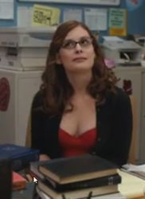
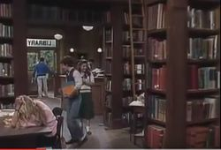
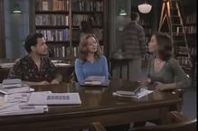

*"Was haben Sie denn gegen das Lachen? Kann man denn auch nicht lachend
sehr ernsthaft sein? […] das Lachen erhält uns vernünftiger als der
Verdruß."* (aus: Gotthold Ephraim Lessing (1763): Minna von Barnhelm, 4.
Akt)

Dieser Artikel beschäftigt sich mit Fernseh-Bildern[^1] von Bibliotheken
und Bibliothekaren[^2] mit dem Schwerpunkt auf den humoristischen Genres
Comedy und Komödie. Die Leitfrage, welches vorherrschende Verständnis in
ausgewählten Fernsehsendungen dieser Genres zugrunde liegt, wird anhand
einer standardisierten, quantitativen Inhaltsanalyse analysiert. Diese
betrachtet unter anderem die Dimensionen Erscheinungsbild, Stereotypen
und Nutzungsmotive von Bibliotheken. Ebenso wird der Frage nachgegangen,
ob Bibliotheken und Bibliothekare Objekte des Witzes sind.

### Comedy, Komödie, Humor und das Fernsehen

Comedy,[^3] Komödie, Humor im Allgemeinen kann man verstehen als eine
besondere Form von Kommunikation, die sich mit fast allen Themen und
Gegenständen der Gesellschaft befassen kann. Humoristisches im Fernsehen
hat in erster Linie die Funktion, die Zuschauer zu erheitern. Komödien
haben in der Regel eine dramaturgische Handlung, die gut und glücklich
für alle Protagonisten endet. Doch neben der Unterhaltung der Zuschauer
kann Humor auch kritisch sein. Humor reflektiert Konventionen. Eine
Analyse des Humors kann daher bestimmte Strukturen gesellschaftlicher
Phänomene ans Licht bringen.[^4] Gerade fernsehspezifische Populärkultur
wie Seifenopern, Sitcoms, Komödien bedienen sich oft klischeehafter
Rollenbilder. Ein näherer Blick auf das Witzige mag vermuten, dass
gerade dort, wo Klischees vermehrt anzutreffen sind, eine Idee von
Bibliothek und des Bibliothekar besonders deutlich werden kann.

Die leitenden Fragen dieser Untersuchung lauten daher: Gibt es
stereotype Darstellungen von Bibliothekaren und Bibliotheken in den
humoristischen Genres und wenn ja, welche sind vorherrschend und
bestimmend? Was wird den Zuschauern in Bezug auf Bibliotheken
vermittelt? Wie werden Bibliotheken und Bibliothekare in humoristischen
Fernsehsendungen dargestellt? Welche Aufgabenzuweisung gibt es? Worüber
wird in Bezug auf Bibliotheken gelacht? Sind Bibliotheken und
Bibliothekare Objekt des Witzes?

Dies soll jedoch nicht dazu verleiten, im Medium Fernsehen die Wahrheit
im Sinne eines wahren Abbildes der Realität finden zu wollen. "Medien
können keine außermediale Wirklichkeit abbilden, sondern nur eigene
Wirklichkeiten herstellen und darstellen – eben
Medienwirklichkeiten."[^5] Fernsehen schafft zudem auch eigene
Realitäten, insbesondere wenn die Grenzen zwischen Fiktion und Fakten
verschwimmen. Man denke an sogenannte "Scripted Reality Formate", die
den Zuschauern eine objektive Dokumentation vorgaukeln, aber dennoch
nach Drehbuch produziert werden und zumeist völlig frei erfunden sind.
Fernsehen als Medium ist Teil der Lebenswirklichkeit vieler Menschen.
Das Massenmedium hat Einfluss auf Themen und Diskussionen in der
Gesellschaft.[^6] Die Zuschauer nehmen dabei die Programme als Angebot
wahr, die sie unterschiedlich interpretieren, was Teil ihrer Realität
werden kann. Fernsehinhalte oder auch Formate können zum Gesprächsstoff
werden, bis hin zu Fankreisen und Subkulturen, die sich ausprägen
können.[^7] Fernsehen bietet Angebote, die von Zuschauern genutzt werden
können, indem sie sich auf eine Interaktion einlassen.[^8] Doch wie die
Zuschauer diese Angebote nutzen ist sehr unterschiedlich. Keppler
spricht von einem realistischen Konstruktivismus: "Die Inszenierungen
des Fernsehens erzeugen nicht die Realität jenseits ihrer Bilder, aber
sie generieren Verständnisse, die, wenn sie intersubjektiv und
öffentlich wirksam werden, die Realität durchaus modifizieren." [^9]

Fernsehen als Massenmedium ist gleichzeitig ein Einwegmedium,[^10] die
produzierten Inhalte werden von einem Produzenten (Sender) an einen
Zuschauer (Rezipienten) gesendet, der diese auf unterschiedliche Arten
empfängt oder konsumiert. Monokausale Wirkungsannahmen, wie ein
"Stimulus-Response-Modell", dass diese Sendungen beim Empfänger quasi
automatisch eine Wirkung auslösen, sind mittlerweile überholt.[^11] Das
Gesendete wird nicht einfach gesehen, aufgenommen und verarbeitet. Es
ist vielmehr mit einer Rezeption "ein hohes Maß an Selektivität, an
eigenständigem Umgang mit dem Fernsehtext verbunden […], was in der
Tradition der "Cultural Studies" als ,Aneignung' konzeptualisiert worden
ist. Dabei ist vorausgesetzt, dass jeder Text grundsätzlich mehrdeutig
und damit offen ist, so dass unterschiedliche Lesarten zum Tragen kommen
können."[^12] Kurzum, als Massenmedium spiegelt Fernsehen
gesellschaftliche Themen und ist gleichwohl Teil von Diskussionen. Das
Reizvolle am Medium Fernsehen ist für viele Menschen immer noch

> "professionell gemachte, überraschende und unterhaltsame Inhalte […],
> die ihnen unaufwändigen Konsum ermöglichen. […] Und mit rund 95
> Prozent der deutschen Haushalte, die einen Fernsehanschluss haben,
> liegt es immer noch fast 20 Prozent oberhalb der Quote für einen aktiv
> genutzten Online-Zugang."[^13]

Im Schnitt empfängt jeder deutsche Haushalt derzeit 80 Sender. Fast alle
diese Sender strahlen rund um die Uhr (etwa 8700 Stunden im Jahr) ein
Programm aus. Der Fernsehkonsum ist, trotz Internetnutzung und anderer
Medien immer noch relativ hoch. Jeder oder jede Deutsche schaut
statistisch im Schnitt etwa drei Stunden (221 Minuten) täglich
fern.[^14]

### Methode

Um eine erwartete größere Anzahl von Sendungen quantitativ auf eine
bestimmte Fragestellung und ein Erkenntnisinteresse hin zu untersuchen,
eignet sich die empirische Methode der Inhaltsanalyse. Das Material wird
anhand vorab definierter Merkmale (Kategorien) analysiert. Nachteil
dieser Methode bleibt jedoch, dass sie sich nicht mit allen
Bedeutungsebenen oder sich mit der Ästhetik einzelner Werke befassen
kann.

> "Die Inhaltsanalyse ist eine empirische Methode zur systematischen,
> intersubjektiv nachvollziehbaren Beschreibung inhaltlicher und
> formaler Merkmale von Mitteilungen, meist mit dem Ziel einer darauf
> gestützten interpretativen Inferenz auf mittelungsexterne
> Sachverhalte."[^15]

Dabei wird bei der Kategorienbildung sowohl theoriegeleitet (aus den
Forschungsfragen sowie aus Erkenntnissen, die gegebenenfalls aus anderen
Untersuchungen vorliegen) als auch empiriegeleitet (aus dem Material
selbst, ersten Stichprobenanalysen) vorgegangen. Aus einem angenommenen
Stereotyp "Brille, Dutt, zurückhaltend, grau" ergeben sich die zu
untersuchenden Dimensionen Erscheinungsbild und Charaktereigenschaften
für die Figur von Bibliothekaren. Als Klischee der Bibliothek
"verstaubt, unmodern" wären die Dimensionen Darstellung, Atmosphäre,
sowie Nutzungsmotive von Interesse. Bei einigen Aspekten wird dabei mit
offenen Kategorien gearbeitet, zum Beispiel bei der Frage "worin besteht
der Witz"? Zudem wurden konkrete Aussagen oder Off-Kommentare
transkribiert und diese in der Analyse nachträglich nach Kategorien
geclustert, um Aspekte erfassen zu können, die im Vorfeld nicht bedacht
werden konnten.

Das relevante Quellenmaterial wurde über eine bewusste Auswahl anhand
einer Recherche in Online-TV-Zeitschriften zusammengestellt. Über einen
längeren Zeitraum von 5 1/2 Jahren wurden über eine inhaltliche Suche
nach den Begriffen "Bibliothek\*" und entsprechender Synonyme in den
Sendungsinhalten, Hintergrundinformationen oder Rollenbeschreibungen
relevante Sendungen ermittelt. Ein Sampling-Verfahren der sogenannten
künstlichen Woche, in welcher Sendungen verschiedener Wochentage über
einen bestimmten Zeitraum ausgewählt werden, so dass jeder Wochentag in
gleicher Anzahl vorkommt, oder eine Stichprobenziehung bei der
Gesamteinheit aller Komödien und Comedysendungen, die ausgestrahlt
werden, wäre noch zeitaufwändiger gewesen, um an relevantes
Quellenmaterial zu gelangen und daher nicht umgesetzt. Die
Auswahleinheiten wurden zudem nur von frei zu empfangenden
Fernsehsendern bezogen, Pay-TV und reine Lokalsender wurden
ausgeschlossen, ebenso ausländische Sender, auch, wenn diese ein
deutschsprachiges Programm anbieten. Aufgrund der Flüchtigkeit des
Mediums Fernsehen war es notwendig, alle Sendungen aufzuzeichnen. Der
Vorteil liegt jedoch darin, dass das Material für eine Analyse dauerhaft
vorliegt. Der betrachtete Zeitraum bezog sich auf Januar 2010 bis Juli
2015.

Aus diesen Auswahleinheiten wurden dann die tatsächlichen
Analyseeinheiten selektiert. Nur Sendungen, in welchen tatsächlich eine
Handlung in einer Bibliothek stattfindet und / oder eine Rolle als
Bibliothekar vorkommt und die den Genres Komödie, Comedy, Sitcom
zuzuordnen sind, wurden analysiert. Als Definition des
Untersuchungsgegenstandes wurden alle Fernsehsendungen betrachtet, die
beabsichtigen, beim Zuschauer unterhaltend zu wirken, insbesondere
fiktionale Formate mit dem Schwerpunkt auf Humor für die Zielgruppe
Jugendliche bis Erwachsene. Kindersendungen und andere Formate mit teils
humoristischen Elementen wurden ausgeschlossen.

Als Analyseeinheiten wurden in dem gewählten Zeitraum insgesamt 51
einzelne Sendungen identifiziert. Wiederholungen wurden nicht erfasst.
Aus den Sendedaten erkennbar war jedoch, dass insbesondere aktuellere
Produktionen eine auffällig hohe Wiederholungsfrequenz haben. Eine
Stichprobe bei den zwei aktuellsten Sendungen ergaben sich
Wiederholungsraten von 18 beziehungsweise 30 Mal seit der
Erstausstrahlung bezogen auf einen Sender.[^16] Diese
Stichprobenergebnisse der zahlreichen kurzfristigen Wiederholungen wird
gestützt durch den Blick in die aktuelle Programmanalyse der deutschen
Hauptsender (RTL, RTLII, vox, Sat1, Pro7, Kabel1, ARD, ZDF). Über 25
Prozent des Programms (sechs bis sieben Stunden pro Tag) privater Sender
besteht aus sogenannten kurzfristigen Wiederholungen, bei den
öffentlich-rechtlichen Sendern (ARD/ZDF) sind es deutlich weniger mit
drei bis vier Stunden pro Tag.[^17]

### Formale Ergebnisse

Die Analyse ergab, dass allein 42 der 51 Sendungen von Privatsendern
ausgestrahlt wurden. Dieser hohe Anteil liegt nicht darin begründet,
dass öffentlich-rechtliche Sender weniger Unterhaltungssendungen zeigen
würden, sondern an einem relativ hohen Anteil an Fremdproduktionen bei
den Privatsendern, wie weiter unten näher erläutert wird.

ARD und ZDF liegen mit ihrem Anteil an Informationssendungen zwar
deutlich vor den Privatsendern, der Anteil fiktionaler Sendungen des
Programms liegt jedoch bei den öffentlich-rechtlichen Sendern direkt an
zweiter Stelle. Die aktuellen Programmanalysen zeigen,[^18] dass ARD und
ZDF mit 36 % beziehungsweise 32 % sogar mehr fiktionale Sendungen
ausstrahlen als RTL (rund 20 %) und Sat1 (rund 28 %). Pro7 sticht
allerdings mit einem hohen Fiktionsanteil von 61 % heraus. Pro7 hat bei
den ermittelten 51 Sendungen einen Anteil von 9 %, wobei eine weitere
Interpretation hier zur Verzerrung führen würde, da die Sendungen auch
in ihren Wiederholungen von unterschiedlichen Sendern gezeigt werden.

> "Das größte Gewicht unter den Fictionformen hatten weiterhin bei allen
> Sendern die Fernsehserien. Dabei behauptete sich ProSieben (46,9 %)
> mit nochmals gestiegenem Angebot und wachsendem Abstand zu den übrigen
> Sendern wieder als größter Serienanbieter. Unter den vier anderen
> Sendern rangierte das ZDF (20,5 %) vor der ARD (18,2 %), gefolgt von
> Sat.1 (16,2 %) und RTL (13,7 %)."[^19]

Nur zwölf der 51 Sendungen wurden in Deutschland produziert, der
überwiegende Teil stammt aus US-Produktionen. Schaut man genauer auf die
allgemeinen Programmanalysen der Sender und dort insbesondere auf die
Verteilung von Eigen- und Fremdproduktionen, fällt auf, dass bei den
Privatsendern die Anzahl an eingekauften Fremdproduktionen relativ hoch
ist, insbesondere bei Fernsehserien und Sitcoms. ARD und ZDF liegen mit
zehn beziehungsweise 13 Prozent bei einem relativ geringen Anteil von
US-Importen. RTL (51 %), Sat.1 (79 %) und vor allem Pro7 (93 %)
bestreiten ihr Fiktionsprogramm zum Großteil aus US-Importen.[^20] Dies
lässt den Rückschluss zu, dass das Bild der Bibliotheken und
Bibliothekare in den Genres Comedy und Komödie vor allem ein
US-amerikanisch geprägtes Bild ist.

Bei den analysierten 36 Sendungen handelt es sich um einzelne Folgen aus
Serien, daneben wurden 15 Filmkomödien mit Bibliotheksbezug
ausgestrahlt. Die knapp 50 verschiedenen Sendungen lassen sich auf
verschiedene Sub-Genres aufteilen (Sitcoms (19), Comedyserien (3),
Sketchshows (8), Zeichentrickserien (5), Filmkomödien (16)). Zunächst
sind die Sitcoms zu nennen. Sitcoms sind Comedyserien mit festen
Rollencharakteren, bei welchen der Humor aus Alltagssituationen
(Situationskomödie) generiert wird, "die geprägt sind von
Missverständnissen, Konfusionen, Verwechslungen, Stereotypen."[^21]
Entstanden sind die Sitcoms in den USA. "Die gesamte Inszenierung ist
theaternah, was durch die Einblendung von fingierten Publikumsreaktionen
("canned audience") noch verstärkt wird."[^22] Um sie von deutschen
Sendungen zu unterscheiden, die in ihrer Produktion und Ausstattung
abweichen, ist bei deutschen Sendern der Begriff Comedyserie üblich.
Davon finden sich unter den 51 Analyseeinheiten nur zwei Sendungen
("Nikola", "Mein Leben und ich"), sowie eine in Großbritannien
produzierte Serie ("Suburban shootout").

Neben den Sitcoms und Comedyserien findet sich ein weiteres
humoristisches Subgenre mit der Sketchshow. Als Sketchshow gelten eher
"gespielte Witze" in lockerer Aneinanderreihung. Es kann auch hier
wiederkehrende Rollencharaktere geben (beispielsweise Little Britain),
aber eine durchgehende Handlung ist nicht üblich. Als weiteres Subgenre
können satirisch-komische Zeichentrickserien gelten. Bei fünf Sendungen
handelt es sich um Folgen der "Simpsons", eine Zeichentrickserie, die
auf satirisch-komische Art das Alltagsleben der US-Gesellschaft
darstellt. Bei den 16 Filmkomödien, darunter auch eine
Zeichentrickkomödie, ergeben sich jeweils abgeschlossene dramaturgische
Handlungen, die glücklich enden. Eine unterhaltende Grundstimmung soll
oft durch Missverständnisse, die sich im Nachhinein auflösen, oder
übertriebene Darstellungen menschlicher Schwächen entstehen.

Kabarett als humoristisches Subgenre wurden nicht gefunden. Zum einen
kann es daran liegen, dass fiktionale Figuren in diesem Genre seltener
anzutreffen sind oder das Motiv Bibliothek weniger attraktiv für
Kabarettisten ist. Vermutlich ist die Erschließung durch
Online-Zeitschriften nicht ausreichend. Zumindest ein Fall einer Figur
im Kabarett ist bekannt.[^23]

Die Produktionsjahre der 51 Sendungen weisen eine erhebliche Streuung
auf. 47 Sendungen wurden vor dem betrachteten Zeitraum 2010-2015
produziert.[^24] , davon wurden 37 Sendungen bereits vor 2005
produziert. Bei den ältesten zwei Sendungen handelt es sich um zwei
deutsche Spielfilme aus den Jahren 1956 und 1957. Vierzehn Sendungen
wurden in den 1980er und 1990er produziert und ab 2000 wurden 19
Sendungen gedreht. Ein Peak liegt auf dem Produktionsjahr 2003, hier
liefen gleich zehn einzelne Folgen mit Bibliotheksbezug in den
Sketchshows "Die dreisten Drei" und "Little Britain". Daraus lässt sich
schließen, dass die Comedy- und Komödiensendungen mit Bibliotheksbezug
vor allem aus sogenannten Konserven bestehen (Wiederholungen). Wie
bereits erwähnt werden dabei die aktuelleren Sendungen deutlich häufiger
wiederholt als die älteren.

### Die Figur des Bibliothekars

In 32 Sendungen findet sich die Figur der Bibliothekarin beziehungsweise
des Bibliothekars. Dabei treten in sieben Sendungen gleich zwei Figuren
auf, so dass es insgesamt 39 Figuren gibt, die für die Analyse relevant
sind. Bibliothekare , die nicht am Arbeitsort Bibliothek gezeigt wurden,
gibt es in fünf Sendungen. In den überwiegenden Fällen handelt es sich
um kurze Szenen, in welchen Bibliothekare eine Rolle spielen. In fünf
Filmen ist die Figur gleichzeitig Protagonist.

Für alle Figuren wurde ein wertender Gesamteindruck betrachtet. Dabei
lag eine einfache Skala mit mittlerer Ausprägung zugrunde
(positiv/neutral/negativ), sowie eine Auffangkategorie bei nicht
wertbaren Szenen, wenn zum, Beispiel die Rolle zu kurz gestaltet war
(Statisten). Die Kriterien wurden vorab im Rahmen der Inhaltsanalyse
festgelegt, beschrieben und anhand von mindestens einem Ankerbeispiel
erläutert.

Die meisten Figuren werden positiv dargestellt, überwiegend freundlich,
hilfsbereit, lächelnd und den anderen Figuren entgegenkommend. Sieben
Figuren sind negativ dargestellt, hier gibt es unterschiedliche
Charaktereigenschaften wie sehr streng und zurückweisend, oder chaotisch
und verwirrt oder sehr introvertiert und nicht entgegenkommend. Bei neun
Figuren sind sowohl positive als auch negative Kriterien
Charaktereigenschaften feststellbar, oder die Figuren sind nicht so
deutlich ausgestaltet, so dass sie als neutral gewertet wurden. Bei fünf
Sendungen sind die Szenen so kurz, dass sie nicht bewertet werden
können. Ein geschlechtsspezifischer Unterschied in der Gesamtbewertung
nach Charaktereigenschaften lässt sich nicht feststellen.

Das Erscheinungsbild der Bibliothekar-Figuren weist in den überwiegenden
Fällen einen konservativeren Kleidungsstil auf. In Relation zu den
anderen Figuren ist der Kleidungsstil eher konservativ oder
zurückhaltend, hochgeschlossen, mit gedeckten Farben. Ein Dutt bei
Frauen ist bis auf zwei Sendungen nicht anzutreffen. Ein Stereotyp einer
strengen Bibliothekarin mit Dutt und Brille, die mit einem "Shh" zur
Ruhe mahnt, war gar nur in einem Fall der 51 Sendungen anzutreffen. Bei
den weiblichen Figuren ist auffallend, dass hier eine Tendenz in den
aktuelleren Produktionen erkennbar ist, in welchen die Figuren weniger
hochgeschlossen und mit kräftigeren Farben gekleidet waren. Man könnte
diese Figuren mit dem Attribut "attraktiver" belegen. Auffällig ist
hier, dass es sich um Rollen handelt, die im Rahmen der dramaturgischen
Handlung in einer Beziehungsebene mit anderen Figuren stehen. Vermutet
werden kann, dass sich das "Geschlechterstereotyp Frau" als attraktive
Partnerin überlagert. Bei den männlichen Figuren ist im Vergleich zu den
anderen Figuren der untersuchten Serien der konservative, zurückhaltende
Kleidungsstil zu beobachten: hochgeschlossen, Hemd, Krawatte, Pullunder
oder Anzug und Weste. Eine Tendenz zum legeren Kleidungsstil ist nicht
festzustellen, allerdings taucht nach dem Produktionsjahr 2006 keine
männliche Figur mehr in den Sendungen auf.

Ein zeitlicher Wandel ist im Vergleich der Produktionen durchaus
erkennbar. Am deutlichsten fällt dies beim Vergleich auf, vergleicht man
die der Figuren aus der ältesten Sendung aus 1956 ("Wenn wir alle Engel
wären") mit der jüngsten Sendung aus 2011 ("Community, Folge Liverpool
gegen Manchester") auf. 1956 treffen wir auf die Form der
Thekenbücherei, hier sucht der Bibliothekar die Lektüre für seine Leser
aus. Sein Leitspruch ist "Ordnung, Sauberkeit und Pflichtbewusstsein".

Im Vergleich zu den anderen Figuren ist das äußere Erscheinungsbild
konservativer und die anfangs dargestellte Charaktereigenschaft auch
eher mit "steif" zu beschreiben. 2011 treffen wir auf eine Bibliothek,
die räumlich nicht genau zu erfassen ist. Es gibt einen zentralen
multifunktionalen Gruppenarbeitsraum mit Multifunktionalität. Die
Tätigkeiten der Figur der Bibliothekarin werden zwar durch ein
"Bücherordnen" dargestellt, sie empfiehlt jedoch nichts, selbst gegen
von Nutzern mitgebrachtes Essen hat die Figur nichts einzuwenden. Diese
Figur ist deutlich moderner und fällt im Vergleich zu den anderen
Figuren der Sendung nicht als "anti-konform" auf. Dennoch wird sie durch
die anderen Figuren mit den Funktionen "Wissen bewahren" und "Ordnung
herstellen" beschrieben: "Sie hütet das Wissen. Sie hat die Antwort auf
all' unsere Fragen" - "Vielleicht schimpft sie mit uns, wenn wir laut
sind?"

Eine Besonderheit stellen die Bibliotheksfiguren dar, die in
Filmkomödien gleichzeitig Protagonisten sind. Häufig typisch für die
Dramaturgie eines Films ist der klassische Dreiakte aus
Theaterinszenierungen mit den Bestandteilen Exposition, Konflikt und
Lösung des Konflikts (in Komödien in komischer Weise)-.[^25] "Jede
erfahrene Dramaturgie wird dafür plädieren, dass die Hauptfiguren eine
Art Wandlung durchlaufen, so dass sie am Ende nicht mehr dieselben sind
wie zu Beginn."[^26] In den fünf Filmen, in welchen die Protagonisten
gleichzeitig Bibliothekare sind, wird in der Exposition eine Eigenschaft
als Bibliothekar deutlich herausgestellt, wobei dies in den Sendungen
unterschiedliche Eigenschaften sind. Der Protagonist vollzieht
beispielsweise im Film "Wenn wir alle Engel wären" eine Wandlung vom
strengen, auf Ordnung bedachten "Herrn Stadtbibliothekar" zum eher
gelasseneren Mann, der gelernt hat, dass niemand perfekt ist und man
auch mal Fehler machen kann. Ein weiteres Beispiel findet sich im Film
"Idiocracy", in welcher welchem der Bibliothekar anfangs als faul und
verantwortungsscheu dargestellt wird (Off-Kommentar: "Er ist der
durchschnittlichste Durchschnittsmensch."). Am Ende der Handlung ist er
zum mutigen und verantwortungsvollen Mann geworden, der schließlich
Präsident wird.

### Darstellung von Bibliotheken

In den untersuchten Sendungen werden unterschiedliche Bibliothekstypen
sichtbar. Die häufigste anzutreffende Form ist die Öffentliche
Bibliothek. In den deutschen Produktionen tauchen Öffentliche
Bibliotheken kaum auf oder es ist nicht erkennbar, um welchen Typus es
sich handelt, wie in elf weiteren Fällen, in denen der Typus nicht
erwähnt wird oder auch keine Einstellung des Gebäudes von außen gezeigt
wird. In 16 Fällen handelt es sich um Universitäts-, College- oder
Highschool-Bibliotheken. Da die Sendungen überwiegend in den USA
produziert wurden (33 Sendungen US-Importe), handelt es sich auch um
amerikanische Bibliothekstypen.

In den USA gibt es nicht nur eine höhere Bibliotheksdichte, Bibliotheken
sind in der US-Gesellschaft auch fester verankert als in
Deutschland,[^27] und sie zeichnen sich deutlicher durch Bürgernähe und
Service aus. [^28] Bürger der USA zählen ihre Bibliotheken mit einer
hohen Selbstverständlichkeit zu einem Teil ihres Lebens.[^29] Auch kommt
den Schulbibliotheken eine wichtige Rolle zu.[^30] Daher ist es auch
nicht verwunderlich, dass Bibliotheken in den Medienrealitäten der
US-Produktionen häufig vorkommen. Dem Umstand, dass deutsche
Privatsender einen hohen Anteil an US-Produktionen senden, "verdanken"
wir es, dass die Bibliotheken im Fernsehen häufiger zu sehen sind.

Die Darstellung der Bibliotheken ist insbesondere in den
US-amerikanischen Sitcoms durch wiederkehrende Ausstattungsmerkmale
anzutreffen. Regalreihen an den Wänden, zumeist dunkle Holzregale und
mittig im Raum stehende Tische und Stühle als Lesebereich werden
überwiegend als Hintergrund gezeigt.

 

Man könnte meinen, die Produktion aus 2012 hätte dieselbe Ausstattung
aus 1987 verwenden können. Diese typisch für Sitcoms verwendete Szenerie
liegt darin begründet, dass die Handlungen, die überwiegend
sprachbasiert sind und durch Dialoge vorangetrieben werden, auch für den
Zuschauer deutlich im Bild sein müssen. Die Bibliothek als Raum wird zu
Beginn einer Szene oft in einer Totalen (Kameraeinstellung) dargestellt,
damit der Zuschauer sich orientieren kann. Dann wird sich in einer
Halbnah-Einstellung (Hüfte-Kopf) wieder den Figuren und ihren Dialogen
zugewendet. Die Ausstattung gleicht einer Kulisse aus dem Theater, was
wiederum typisch für Sitcoms ist, die sich aus Theaterkomödien
entwickelt haben, überwiegend in Studios als an realen Orten gedreht
werden und daher auch nur wenige Schauplätze ("Settings") aufweisen. Die
Atmosphäre in der Bühnenausstattung der Sitcoms ist eher dunkel (es gibt
in Sitcoms auch keine Fenster), aber nicht verstaubt oder muffig,
sondern überwiegend einladend und gemütlich. Dies trifft auf die
überwiegende Zahl der anderen Sendeformate ebenfalls zu. Auf die aktuell
im Bibliotheksbereich diskutierte Aufenthaltsqualität und den
Wohlfühlort nimmt man in den produzierten Sendungen keine Rücksicht. Es
gibt keine Sofas, keine Lounge und überhaupt wenig Variationen in der
Ausstattung. Die Vermutung liegt nahe, dass der TV-Zuschauer sonst
Schwierigkeiten hätte, die Szenerie als Bibliothek zu erkennen. Um eine
Szene für Zuschauer eindeutig werden zu lassen, gilt als ein Kriterium
für den Arbeitsprozess von Drehbuchautoren zum Beispiel die Frage "Wird
das Publikum diese Ausstattung, die es erst einmal und dazu nachts
gesehen hat, wiedererkennen?"[^31] Ist also eine Bibliothek ohne eine
"Büchertapetenkulisse" nicht als solche erkennbar?

Ein Computer in diesen 51 Sendungen taucht zum ersten Mal in einer
europäischen Spielfilm-Produktion von 2002 auf ("Der Typ vom Grab
nebenan", Schweden). Dies bleibt ein äußerst seltenes Bild. Für den Ort
Bibliothek in humoristischen Fernsehgenres sind eindeutig Bücher das
konstitutive Merkmal. In Spielfilmen ist die dargestellte Ausstattung
durchaus vielfältiger, wenn längere Szenen in realen Bibliotheken
gedreht wurden. Hierbei werden variationsreichere Einstellungen gezeigt
(Personen zwischen den Regalen, vor Katalogen, beim Lesen), wenngleich
das Bücherregal auch hier vorherrschendes Ausstattungsmerkmal ist. Die
Atmosphäre wirkt heller als in den Sitcoms. Das Szenenbild in der Sitcom
"Community "(2011) weicht allerdings deutlich von anderen Produktionen
ab. Hier treten die Regale in den Hintergrund, zu sehen sind nur noch
kleinere Bücherwagen in einem Multifunktionsraum, der als
Gruppenarbeitsraum mit Scanner, Flipchart und Tafel ausgestattet ist.

Drehbuchautoren bedienen sich oft vorgegebenen genrespezifischen
Mustern, wie zum Beispiel einer Schießerei in einem Western oder einer
Verfolgungsjagd in einem Actionfilm. Zudem bedingen auch typische
Standardsituationen ihrerseits typische Handlungsabläufe und
Ablaufschemata in einer Dramaturgie, wie etwa Begrüßungs- oder
Abschiedsrituale, ein Essen, ein Streit oder die "Rettung in letzter
Sekunde".[^32]

> "Der dramaturgische Vorteil der Verwendung von Standardsituationen
> liegt auf der Hand. Das Publikum erkennt die Situation wieder und kann
> kennerhaft auf die spezifische Nuance reagieren. Vordem schon hat das
> Team, das den Film dreht (Regie, Kamera, Schauspieler und so weiter),
> die Chance erkannt, ein Stereotyp in je eigener Weise zu modellieren
> und damit auch die abstrakte Formel zu verbergen, die sich für die
> Analyse hinter jeder Standardsituation verbirgt."[^33]

Spezifische Handlungsabläufe können auch an bestimmten Orten
stattfinden, wie in einem Restaurant, in einem Altersheim oder in einer
Bibliothek. Diese Orte bestimmen zwar nicht den typischen Ablauf, aber
sie werden mit ihren Spezifika Teil der typischen Standardsituation.
Bestimmte Verhaltensregeln sind für einen bestimmten Ort konstitutiv und
kennzeichnend.[^34] Für eine Bibliotheksszene bedeutet dies, dass die
Bibliothek als Schauplatz mit ihren eigenen Charakteristika, die die
Drehbuchautoren als solche bestimmen, diese Standardsituationen
mitformen. Für eine "Begrüßung" oder ein "Kennlernen" bedeutet dies zum
Beispiel, dass man zwischen Regalen steht oder sich leise unterhält,
oder von anderen Figuren zur Ruhe ermahnt wird. Humoristische Subgenres
erlauben als Drehbuchautor oder Produzent eine kreativere Umgangsweise
mit diesen Charakteristika.

### Witz und Bibliothek

Vorherrschendes Paradigma in der Humorforschung ist der Ansatz der
Inkongruenz-Theorie. Humor ist oft dadurch bedingt, dass Situationen
oder Themen in unterschiedlichen oder gegensätzlichen
Wahrnehmungsbezügen betrachtet werden.[^35]

> "Nicht jede Inkongruenz verursacht Lachen, aber die ist
> wahrscheinlicher je stärker von einer spezifischen Erwartung
> abgewichen wird […] dies [gilt] nur in Fällen […], in denen der
> Überraschungseffekt als nicht bedrohlich empfunden wird. Der Humor […]
> wird vielmehr so präsentiert, dass charakteristische Hinweise gegeben
> werden, dass die Situation nicht ernst zu nehmen ist."[^36]

In einer Szene in der Sketchshow "Die Dreisten Drei" liegt das
Humoristische darin, dass man als Zuschauer in einer Bibliothek im
Allgemeinen Ruhe erwartet, was auch für das Verhalten des Personals
gilt, das in Bibliotheken arbeitet. Der Zuschauer sieht und hört jedoch
einen Bibliotheksmitarbeiter bei einer Führung durch ein Megafon rufen
"bitte absolute Ruhe", wobei der Mitarbeiter derjenige ist, der die Ruhe
stört. Solche Durchbrechungen von Erwartungen finden sich in Sketchshows
häufiger als in Sitcoms oder Filmkomödien. In letzteren Genres basiert
der Humor eher auf unterschiedlichen Alltagssituationen
(Situationskomik) oder der Schaffung und Auflösung von
Missverständnissen. Liegt der Humor an der Grenze des sogenannten
"schwarzen Humors" oder der Satire, die in unterhaltsamer Form auch eher
auf eine Kritik zielt, liegt es oft im Auge des Betrachters, ob eine
Szene humorvoll gesehen wird. In einer Folge der englischen Sketchshow
"Little Britain" beispielsweise, kümmern sich zwei Therapeuten um die
Figur Anne. Anne ist ein Mann, der in Frauenkleidung auftritt und dem
ersten Anschein nach eine geistige Behinderung hat. Durch verschiedene
Maßnahmen soll Anne therapiert werden, was jedoch nie Erfolg hat. In
einem Sketch ist die Rolle der Anne eine Aushilfskraft in einer
Bibliothek. Anne beißt ein Buch, um es auszuleihen und stempelt den
Menschen. Die Figur bricht jedoch für einen kurzen Moment aus ihrer
Rolle aus und spricht und agiert "normal" während eines Telefonates und
stellt damit die Figuren der Therapeuten bloß. Man weiß als Zuschauer
nicht genau, wie man es einsortieren soll, es wird hier zur Frage des
individuellen Humors.[^37]

In die Form der Satire reihen sich ebenso die Folgen der "Simpsons" ein,
wenn zum Beispiel die Bibliothekarin in einer Bibliothek ohne Bücher
sagt: "Bücher? Die sind was für Spießer – die Bibliothek ist ein
Multimedialernzentrum für Kinder allen Alters – und für Penner." In
keiner der 51 Sendungen ist jedoch die Figur des Bibliothekars Objekt
des Witzes. Der Humor wird wie oben beschrieben eher aus den
Alltagssituationen heraus, im Zusammenspiel mit den Bibliothekar-Figuren
generiert, oder es liegt in den inkongruenten Handlungen und Situationen
begründet.

### Nutzungsmotive

In den meisten Fällen, in denen Menschen Bibliotheken aufsuchen, tun sie
dies, weil sie dort lernen oder lesen möchten. Die Ausleihe oder
Rückgabe von Büchern steht dabei an zweiter Stelle. Die Rückgabe von
Medien ist oft mit einer Gebührenüberziehung verbunden. Mit
Überziehungsgebühren und drohenden Strafen wird insbesondere in älteren
Produktionen gescherzt. Beispielsweise gibt es in der Sendung "Seinfeld"
dazu eine spezielle Figur des Gebühreneintreibers, einen sogenannten
"Library Cop".

Die Bibliotheken gelten in den Sendungen auch als Wissensort, hier
recherchiert man nach Informationen. Ein wichtigeres Motiv ist jedoch
die Bibliothek als Kommunikationsort. Dies liegt natürlich zum Einen im
Genre Komödie und insbesondere Sitcom verankert. Da dies
dialogorientierte Formen sind, in denen viel kommuniziert wird, bildet
die Bibliothek als Szenerie dabei keine Ausnahme. Vielfach lernen die
Protagonisten in der Bibliothek andere Figuren kennen, in vier Fällen
ist die Bibliothek auch der Ort eines "Dates" (US-Produktionen). Eine
weitere Funktionszuschreibung liegt bei der Darstellung der Bibliothek
als Rückzugsort. In vier Fällen wird die Bibliothek von den
Protagonisten oder anderen Figuren bewusst aufgesucht, um Ruhe zu
finden. Die Funktion des "Ruhebewahrers" wird in den 51 Sendungen dabei
häufiger bei Nutzer-Figuren festgestellt als bei Bibliothekar-Figuren.
Der Aspekt Ruhe ist dabei eine Situation, mit der gespielt wird
(Beispiel: die oben erwähnte Sketchshow mit Megafon).

Dass die Bibliotheken Orte des Wissens und der Ruhe sind, kann man auch
durch zahlreiche Aussagen der Nutzerfiguren stützen:

-   "Das ist das Fort Knox der Bücher." (aus: "Eine starke Familie",
    1994)

-   "Ich hab‘ im Internet nichts gefunden, deshalb probieren wir es auf
    die alte Art und Weise." (aus: "Beethoven auf Schatzsuche", 2003)

-   "Die Bibliothek ist der Schlüssel für eine gute Ausbildung." (aus:
    "Hör mal wer da hämmert", 1994)

-   "Hier halte ich mich am liebsten auf." (aus: "Gilmore Girls", 2004)

-   "Ich muss mir ein ruhiges Plätzchen suchen." (aus: "Eine schrecklich
    nette Familie", 1995)

Auch die Funktion der Bibliothek als Kommunikationsort und Ort des
Kennenlernens wird unterstrichen:

-   "Da steht ein Super-Typ bei den Kopierern." (aus: "Eine starke
    Familie", 1994)

-   "Ich habe uns einen Tisch in der Ecke reserviert, da sind wir
    allein." (aus: "Wer ist hier der Boss", 1987)

-   "Ich hab‘ Dich richtig gern." (American Pie präsentiert: Das Buch
    der Liebe, 2009)

-   "Wow! – Tut mir Leid, das ist mir einfach rausgerutscht. Ich hab‘
    Sie einfach hübsch gefunden." (aus: "Two and a Half Men", 2012)

-   "Oh, wir essen hier?! […] Wir haben ein schriftliches Date." (aus:
    "Big Bang Theory", 2013)

Die Bibliothek als Informationsvermittler ist keine
Funktionszuschreibung in den analysierten Sendungen. Auch die in den
letzten Jahrzehnten wichtigen Aufgaben wie die
Informationskompetenzunterstützung oder Leseförderung sind kein Thema
innerhalb der analysierten Fernsehsendungen.

### Schlussbetrachtung

Die Figur des Bibliothekars wird zwar vom äußeren Erscheinungsbild im
Vergleich zu anderen Figuren konservativer dargestellt, jedoch ist als
Tendenz in den aktuelleren Produktionen festzustellen, dass die
Darstellungsweise von eher klischeehaften zurückhaltenden Figuren
verblasst und sich anderen Figuren der jeweiligen Sendung angleicht. Die
Gesamtbewertung der Figuren ist überwiegend positiv.
Funktionszuschreibungen der Rollen sind oft als Metapher für Ordnung zu
verstehen, nicht nur als Wissensordnung, sondern auch im Sinne von
konsequenten Regeln des Miteinanders wie zum Beispiel "Sauberkeit". Die
Figuren sind in den überwiegenden Fällen der analysierten Sendungen
nicht Gegenstand beziehungsweise Objekt des Witzes. Es ist auch nicht
das Objekt Bibliothek, das eine Reaktion hervorruft, sondern das
Interagieren des Protagonisten in einer Situation.

Die Bibliothek als Ort ist, ausgenommen bei Sketchshows, überwiegend
Teil typischer Standardsituationen des Alltagslebens. Die Bibliothek
wird, je nachdem welchem Subsystem (Wissenschaft, Kommune, Schule) sie
angehört, durch das dort vorherrschende "Setting" bestimmt. An der
Hochschule und in der Schule ist sie Lernort wie auch Treffpunkt, in der
kommunalen Bibliothek kommt die Funktion Informationssuche hinzu.
Bedingt durch den hohen Anteil an US-Produktionen wird in den
humoristischen Sendungen im deutschen Fernsehen ein US-Alltagleben
gezeigt. Dies ist dem deutschen oder europäischen zwar nicht unähnlich,
weicht in einigen Bereichen doch ab. Beispielsweise ist in US-Sitcoms
die Funktion des Kennenlernens bis hin zum "First Date" in der
Bibliothek anzutreffen. Man könnte hier annehmen, dass die
"Standardsituation" eines First Dates aufgrund geringerer sozialer
Normen, die in Deutschland in diesem gesellschaftlichen Zusammenleben
gelten, auch weniger häufig in einem medialen Bezug vorkommt.

Auffällig in den analysierten Sendungen ist die Nutzung des
Bibliotheksraums als gesellschaftlicher Raum. Neben der Bereitstellung
von Information erfährt Bibliothek in humoristischen Sendungen vor allem
die Funktionen "Lernen ermöglichen" und "Begegnungen ermöglichen". In
vielen Produktionen ist die Bibliothek nicht nur ein Ort, an dem
Menschen ausleihen oder lesen, sondern in Gesellschaft lernen, sich
kennenlernen, sich verabreden, sich verlieben. Die Bibliothek in den
humoristischen Fernsehgenres ist ein gesellschaftlicher Ort mit hoher
sozialer Interaktion, dies nicht nur in den aktuelleren Produktionen,
sondern bereits seit den 1980er Jahren, beeinflusst durch die hohen
US-Importe von Sitcoms.

Über alle humoristischen Subgenres feststellbar ist, dass das
konstitutive Element, um eine Bibliothek in einer Fernsehsendung
darzustellen, das Bücherregal ist. Moderne Medien oder Computer sieht
man selten. Bücher bestimmen zwar das Bild der Gesamterscheinung, sie
dienen jedoch eher als Kulisse und werden kaum im Rahmen der Handlungen
einbezogen. Wie auch immer die jeweilige Funktionszuschreibung in einer
Sendung ist, fast allen Darstellungen gemein ist, dass Bibliotheken
dabei nicht als verstaubt und muffig dargestellt werden.

Ob sich der Bibliotheksraum weiterhin als Kommunikationsort entwickelt
und ob und wie lange eine "Büchertapete" als Kulisse in humoristischen
Fernsehsendungen bestehen bleibt, müssen zukünftige Analysen zeigen. Zu
betrachten wäre, ob sich die Tendenz bewahrheitet, dass
Bibliothekar-Figuren weniger konservativ im Erscheinungsbild werden und
gleichzeitig weiterhin als Wissensbewahrer und für Ordnung stehen.
Stereotypen können sich wandeln, vielleicht sehen wir hier schon die
ersten Anzeichen dazu. Da die vorliegende Untersuchung sich nur auf
humoristische Fernsehgenres bezieht, steht noch aus, die Analyse auf
andere Fernsehformate und -genres auszuweiten. Es ist eher
unwahrscheinlich, dass Fernsehzuschauer sich nur auf ein bestimmtes
Fernsehgenre einschränken, sondern auch Nachrichten, Dokumentationen,
Unterhaltungsshows oder andere Spielfilme wie Krimis, Western, Science
Fiction konsumieren. Wie es in diesen Genres mit dem Bild der
Bibliotheken und Bibliothekare bestellt ist, muss eine umfangreichere
Analyse zeigen.

[^1]: Zum Thema "die Bibliothek in der Literatur" gibt es zahlreiche
    Veröffentlichungen, hingewiesen sei an dieser Stelle auf die
    Bibliographie von Monika Bargmann, online unter:
    http://library-mistress.net/berufsbild/belletristik-film/sekundaerliteratur/Sowie
    auf die Kategorie "Bibliothek in der Literatur" im Libreas-Blog:
    <https://libreas.wordpress.com/category/sonstiges/die-bibliothek-in-der-literatur/>.

    Zum Thema "Bibliotheken im Film" sei exemplarisch auf den Artikel
    von Martin Hermann hingewiesen: Hermann, Martin (2012):
    Bibliotheksdarstellungen im Film. Ein Analysemodell und vier
    Fallbeispiele. In: Perspektive Bibliothek, 1 (2012), online
    verfügbar unter:
    <http://journals.ub.uni-heidelberg.de/index.php/bibliothek/article/view/9399>

[^2]: In diesem Artikel wird für die Berufsbezeichnung Bibliothekar die
    männliche Form gewählt.

[^3]: Der Begriff Comedy ist vielfach besetzt, im allgemeinen deutschen
    Sprachgebrauch ist für Bühnenstücke oder Fernsehfilme eher der
    Begriff Komödie gebräuchlich. Comedy wird in Zusammenhang mit
    "Stand-up-Comedy" (Bühnenshows einzelner oder mehrerer Künstler)
    verwendet.

[^4]: Gottwald, Claudia (2009): Lachen über das Andere. Eine historische
    Analyse komischer Repräsentationen von Behinderung. Bielefeld :
    transcript-Verlag. "Die Analyse des Komischen als soziales,
    kulturelles oder psychologisches Phänomen ermöglicht gleichzeitig
    auch die Analyse bestimmter gesellschaftlicher Strukturen, nämlich
    jener, die im Komischen thematisiert werden."(S. 17)

[^5]: Schmidt, Siegfried J. (2005): Objektivität als Medienritual. In:
    cover 5 (2005), S. 84

[^6]: Groebel, Jo (2014): Das neue Fernsehen. Mediennutzung, Typologie,
    Verhalten. Wiesbaden: Springer, S. 7

[^7]: Holly, Werner (2004): Fernsehen. Tübingen: Niemeyer, S. 81

[^8]: vgl. Mikos, Lothar (2003): Film- und Fernsehanalyse. Konstanz:
    UVK-Verlags-Gesellschaft, S. 21

[^9]: Keppler, Angela (2006): Mediale Gegenwart: eine Theorie des
    Fernsehens am Beispiel der Darstellung von Gewalt. Frankfurt a.M.:
    Suhrkamp, S. 10

[^10]: Holly (2004), S. 8

[^11]: Holly (2004), S. 76

[^12]: Holly (2004), S. 78

[^13]: Groebel (2014), S.9

[^14]: Zubayr, Camille; Gerhard, Heinz (2014): Tendenzen im
    Zuschauerverhalten. Fernsehgewohnheiten und Fernsehreichweiten im
    Jahr 2014. In: Media Perspektiven. 3 (2015), S. 114. Online
    verfügbar unter:
    <http://www.ard-werbung.de/media-perspektiven/publikationen/fachzeitschrift/2015/heft-3/>
    (letzter Zugriff: 12.10.2015)

[^15]: Früh, Werner (2015): Inhaltsanalyse. Theorie und Praxis. 8.,
    überarb. Aufl. Konstanz: UVK Verlagsges., S. 29

[^16]: Die Folge "die Menschenflüsterin" aus der Sitcom "Two and a half
    men" lief seit der Erstausstrahlung im Februar 2013 auf Pro7 dort 18
    Mal bis Mitte Juli 2015. Die Folge "Prinzessinnen der Wissenschaft"
    aus der Sitcom "Big Bang Theory" lief 30 mal seit Erstausstrahlung
    vor zwei Jahren auf Pro7 bis Juli 2015.

[^17]: Programmbericht 2014 (2015). Fernsehen in Deutschland.
    Programmforschung und Programmdiskurs. Hrsg.: die Medienanstalten,
    ALM GbR. Leipzig: vistas, S. 49 Online verfügbar unter:
    <http://www.die-medienanstalten.de/publikationen/programmbericht.html>
    (letzter Zugriff: 10.10.2015)

[^18]: Die Programmstruktur der fünf größten deutschen Sender (ARD, ZDF,
    RTL, Sat1, Pro7) wird regelmäßig analysiert. S. Krüger, Udo Michael
    (2015): Profile deutscher Fernsehprogramme. Tendenzen in der
    Angebotsentwicklung. In: Media Perspektiven. 3 (2015), S. S. 146

[^19]: Krüger (2015), S. 153

[^20]: vgl. Krüger (2015), S. 161/162

[^21]: Faulstich, Werner (2008): Grundkurs Fernsehanalyse. Paderborn:
    Fink, S. 58

[^22]: Holly (2004), S. 65

[^23]: "Quo vadis Mensch? : In "Der kaltwütige Herr Schüttlöffel"
    spielt Kabarettist ThomasFreitag einen Bibliothekar und beklagt sich
    über zunehmenden Kulturverfall", In: BuB Jg. 67, 1 (2015), S. 69

[^24]: 37 Sendungen wurden vor 2005 produziert und sind damit älter als
    Libreas :-)

[^25]: Vgl. Koebner, Thomas (Hrsg.) (2007): Reclams Sachlexikon des
    Films, 2. aktualisierte und erw. Aufl. Stuttgart: Philipp Reclam
    jun., S. 158

[^26]: Koebner (2007), S. 160

[^27]: Bibliothek 2007 – Internationale Best-Practice-Recherche (2004).
    Hrsg.: Bertelsmann Stiftung, Bundesvereinigung Deutscher
    Bibliotheksverbände e.V. Gütersloh: Bertelsmann Stiftung, S. 7

[^28]: US-Bibliotheken verstehen sich als Teil der Gesellschaft, "sie
    sind Teil des sozialen Umfelds. "Angebot und Image sind von
    Einwohnern der Kommune geprägt." Courzakis, Irini (2006): "Der
    "American way of Library" : US-Bibliotheken als Treffpunkt,
    Servicecenter und Bildungsstätte", In: BuB 58 (2006) 11/12, S. 760

[^29]: Simon, Elisabeth (1988): Bibliothekswesen in den USA. München:
    Saur, S. 31

[^30]: Bibliothek 2007 – Internationale Best-Practice-Recherche (2004),
    S. 48

[^31]: Koebner (2007), S. 160

[^32]: Vgl. Koebner (2007), S. 156/S. 157

[^33]: Koebner (2007), S. 157

[^34]: Koebner (2007), S. 160

[^35]: Räwel, Jörg (2005): Humor als Kommunikationsmedium. Konstanz: UVK
    Verl.ges., S. 15

[^36]: Räwel (2005), S. 16

[^37]: als "[…] Mittel der Kritik am Paternalismus wird Behinderung
    heute als komisch inszeniert. […] In der mitteleuropäischen und der
    amerikanischen Gesellschaft stellt die komische Darstellung von
    Behinderung jedenfalls kein Tabu mehr dar." Aus: Gottwald, Claudia
    (2009): Lachen über das Andere. Eine historische Analyse komischer
    Repräsentation von Behinderung. Bielefeld: transcript-Verl., S. 296
