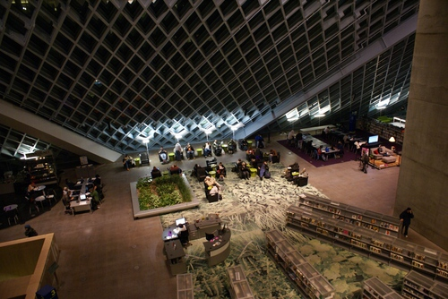
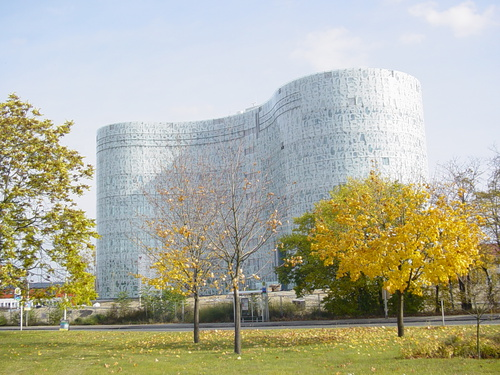
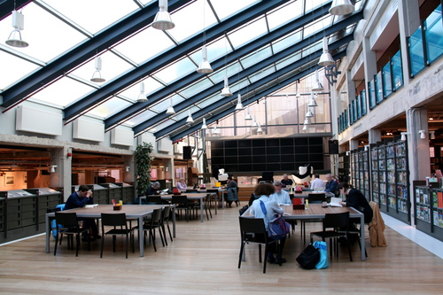

Es gibt wenige große Denker, die sich mit der Bibliothek als Idee
beschäftigt haben. Die meisten unter ihnen wie Leibniz, Lessing oder
Goethe waren selber Bibliothekare und deshalb eher mit praktischen
Dingen beschäftigt oder von ihr geblendet (wie Borges). Es scheint als
wäre sie ein solches Faszinosum, das sie, wie bei der Heisenbergschen
Unschärferelation, weder an ihrem Ort noch an ihrer Aktivität (das heißt
Bewegung) dingfest gemacht werden kann. Zu den wenigen "Großen", die
sich substantiell zum Phänomen Bibliothek geäußert haben, gehören Michel
Foucault zur Bibliothek als Ort und Bruno Latour zum "Akteur-Netzwerk"
des Sammelns. Diese beiden Perspektiven sollen im Folgenden
zusammengeführt werden.

Lange Zeit war die Normbeschreibung der Bibliothek die einer "speziellen
Informationseinrichtung",[^1] ohne dass hinterfragt wurde, ob diese
Verortung ihr gut tut. In den letzten Jahren hat jedoch nicht nur die
Informationswissenschaft, auf die sich ja die Bibliothekswissenschaft
lange Zeit als Mutterdisziplin bezog, eine kopernikanische Wende
vollzogen: Vom IT-lastigen Systemparadigma zum sozio-kognitiven Ansatz
und zur Anerkennung der Komplexität des Informationsverhaltens realer
Nutzer mit Körper und in einem sozialen Kontext.[^2] Eine solche Wende
scheint sich in der Sicht auf Bibliotheken nicht nur aufzudrängen,
sondern auch durchzusetzen. Einer der ersten, der eindringlich auf die
blinden Flecke der Bibliothekswissenschaft hingewiesen hat, war Wayne
Wiegand in einem oft referenzierten Artikel in *Library Quarterly.*[^3]
Er wies in Zeiten der Umbenennung der Library Schools in die späteren
iSchools darauf hin, dass wir dem komplexen Phänomen Bibliothek mit dem
IT-System-Paradigma nicht gerecht werden. Seine Analyse war, dass wir
zwei blinde Flecke im Blick auf Bibliotheken haben: Wir kümmer(te)n uns
zu wenig um den Ort des Nutzerkontaktes, und wir können nicht
einschätzen, was das ist, was die meisten Nutzer in Bibliotheken machen:
Nämlich Lesen.

Der Ort ist mittlerweile stark ins Zentrum der
bibliothekswissenschaftlichen Argumentation gerückt. Bibliothek als
"Dritter Ort" ist fast schon ein Gemeinplatz. Immer noch nicht im Blick
ist das, was die Nutzer eigentlich in der Bibliothek machen. Das öffnet
natürlich auch Türen für Experimente wie Makerspaces, bei denen man
merkt, dass auch mit solchen Aktivitäten in Bibliotheken die "richtigen"
Dinge passieren und das sie dem "Phänomen Bibliothek" irgendwie gerecht
werden.[^4]

Aus verschiedenen Diskursen[^5] kann man unabhängig vom
Informationsparadigma folgende Grundfunktionen für Bibliotheken
postulieren. Sie sind:

-   Kultisch-herrschaftlicher, hegemonialer Knoten im Netz der
    Machtstruktur

-   Instanz für das kulturelle Gedächtnis (=Funktionsgedächtnis)

-   Werkstatt / Instrument zur Beförderung menschlicher Erkenntnis.

Der aktuelle Beleg für die erste Funktion kommt Mitte der 1990er Jahre
aus Dänemark, wo Jens Thorhauge im Auftrag der EU das berühmte
Whitepaper zu "Bibliotheken in der Informationsgesellschaft" verfasst
hatte.[^6] Neben der (aktiven!) Hegemonialfunktion der Bibliothek in der
Demokratie wird aber schon außerordentlich stark der Ort der Bibliothek
betont, wenn sie als "Hauptakteur bei der lokalen Implementation der
Informationsgesellschaft" bezeichnet wird und ihr folgende Aufgaben
zugeschrieben werden:

-   Partner für Demokratie und Informationsfreiheit

-   Ort für Bildung und Lernen; Lieferant des Rohstoffes für Wissen

-   Informationstechnikzentrum

-   Kultureller Ort: "*a good social spot*"

15 Jahre später kommt wieder aus Dänemark die genauere Beschreibung für
Ort und Raum der Bibliothek und ihrer Funktion bei der Stadtentwicklung:
Das "Four Spaces Model"[^7] der Kopenhagener Informationswissenschaftler
Hvenegaard, Jochumsen und Skot-Hansen, die die vier Räume der
Öffentlichen Bibliothek so beschreiben:

-   Inspirationsraum

-   Lernraum

-   Treffpunkt

-   Performativer Raum[^8]

und die Bibliothek in ihrer Rolle in der Stadtentwicklung gleichzeitig
als

-   Place (Icon, Placemaker, Catalyst)

-   Space (open minded meeting place, public domain, experience-space)

-   Relationship (partnership and creative alliances, hybrid cultural
    arenas, creative entrepreneurs)[^9]

kennzeichnen.

Dass Bibliotheken mittlerweile ikonische Qualität im Stadtbild, aber
auch auf einem Wissenschafts-Campus haben, bezeugen Beispiele wie die
"Wissenspyramide" in Ulm, die Public Libraries in Seattle oder in
Birmingham bzw. der Konus der TU Delft, die Amöbe der BTU Cottbus oder
"The Brain" der FU Berlin. Die Inszenierung der Bibliothek als
Erfahrungsraum hat schon eine lange Tradition. Nicht nur traditionelle
Lesesäle, sondern auch neue Angebote und Funktionen wie Cafés,
Restaurants, "Salons" oder hyperaktive Musikbibliotheken wie "Kirjasto
10" in Helsinki, Multimedia Experimentierflächen wie in Dokk1 – im
"Urban Media Space" – in Aarhus oder wie bei vielen Makerspaces nicht
nur in Stadtbibliotheken zeugen davon.

An dieser Stelle kann man einen der wenigen großen Denker, die die
Bibliothek thematisiert haben, erwähnen. Michel Foucault[^10] ordnet sie
explizit den Heterotopien zu, den anderen Räumen, die eben nicht
utopisch sind, aber doch anders, anderswo, divers oder herausgehoben.
Interessanterweise ist einer der "fünf Grundsätze", die Foucault
Heterotopien zuschreibt, auch der der Hetero*chronie*, das heißt es sind
die Heterotopien, die einerseits mit der Zeit brechen, aber auch
Zeitspeicher darstellen.[^11] Gerne vergisst man die Zeit beim Stöbern
in Bibliotheksbeständen und trifft auf den Speicher des aus der Zeit
herausgehobenen kulturellen Erbes. Wir werden auf dieses Verhältnis von
Ort und Zeit noch einmal zu sprechen kommen.

Der Ort (Place) bleibt nicht nur der zweidimensionale, flache Punkt auf
der Karte, sondern erhält sowohl eine symbolische Erhöhung als auch
aktive Funktionen als "Maker" und Katalysator. Schon hier erscheint die
Bibliothek als besonderer (beziehungsweise besonders ruhiger) Akteur:
Ein Katalysator ist ein Stoff, der allein durch seine Anwesenheit
Reaktionen beschleunigt oder überhaupt erst ermöglicht, "ohne verbraucht
zu werden".[^12] Die vielen Diskussionen um die ökonomische Wirksamkeit
von Bibliotheken und ihres "Return of Investment" (ROI) könnten diesem
entsprechen. Aber auch die Nutzung von Bibliotheken tatsächlich als
städtebauliche oder institutionelle Ikone deutet auf das Wirken genau
dieser Funktion, ohne dass sich die Urheber entsprechender Bauten
beziehungsweise die Verwender von deren Abbildungen auf Werbemedien[^13]
dessen bewusst wären.

Es gibt eine ganze Reihe von Ideen zu besonderen beziehungsweise
"dritten" Orten: von den *lieux anthropologiques* (im Gegensatz zu den
*lieux de passage*) bei Marc Augé, dem "*Third Place*" zwischen privat
und öffentlich/beruflich bei Ray Oldenbourg, den hybriden Räumen (nicht
fremd/nicht Heimat) bei Homi Bhabha oder dem "*Third Space*" von Edward
Soja, alle weisen ähnliche Charakteristika auf, wie wir sie bei
Bibliotheken finden: Sie werden als neutral (politisch ungebunden),
nivellierend (jeder ist willkommen), kommunikativ (Konversation =
Hauptaktivität), niedrigschwellig (offene Strukturen), regelmäßig
(Stammgäste, "Kundenbindung"), niedrig profiliert (keine kommerziellen
Marken, kein Branding), als spielerisch (Atmosphäre, "ohne endgültiges
Ergebnis") oder als "aushäusig" (weg von zu Hause) beschrieben. Ort und
Raum (Place und Space) lassen sich nicht trennscharf auseinander halten,
worauf zum Beispiel auch die Rede vom Raum als dritten Pädagogen
hindeutet.[^14] Wenn sich Bibliotheken zunehmend als Einrichtungen der
informellen Bildung verstehen, ist es nur konsequent, dass sie nunmehr
die Raumgestaltung und die Raumerfahrung als ihr Thema aufgreifen. Schon
immer ist der bibliothekarische Raum Fragen der Ästhetik oder zumindest
der adäquaten Repräsentation unterworfen. Frühe Bibliotheksarchitektur
legte stets besonderen Wert auf die Gestaltung des Raumes. Die Bedeutung
der Bibliothek als ikonischer Ort im städtischen Kontext hat in den
letzten Jahrzehnten häufig die Außengestaltung der Bibliothek, ihr
Erscheinungsbild in den Blickpunkt des Interesses rücken lassen. Eine
Zeit lang geriet der (Innen) Raum der Bibliothek aus dem Fokus. Dies hat
sich jedoch in den letzten Jahren deutlich geändert, vielleicht auch
unter dem Eindruck des "spatial turn" in den Sozialwissenschaften.[^15]
Langsam erkannte man die Bedeutung des Raumes der Bibliothek im Hinblick
auf die Akzeptanz durch Nutzer und Gesellschaft, aber eben auch im
Hinblick auf die Lernprozesse, die in ihr stattfinden sollen.

Die Beschreibung des Raumes bei Skot-Hansen et al., als dem "open minded
meeting place", legt schließlich das Konzept des "Ba" im
Wissensmanagement nah, das Nonaka und Konno[^16] gar als dessen
Grundlegung ansahen. "Ba" ist das japanische Wort für Platz und Ort,
aber auch für die Gelegenheit, also den Ort der Interaktion im
Wissensmanagementkreislauf, an dem implizites Wissen externalisiert
wird, zum Beispiel durch "story telling" bei der eher zwanglosen
Begegnung von Personen.

Auch für die dritte Komponente im dänischen Modell, die
Beziehungsarbeit, ergeben sich schlagkräftige Beispiele aus Bibliotheken
der letzten Zeit und sei es nur die Dialogkultur der wieder an Bedeutung
gewinnenden sozialen Bibliotheksarbeit oder Aktivitäten wie "living
libraries" (lebende Bücher) oder der "*Heritage Browser*" am Multitouch
Table des DOK Delft, an dem Generationen übergreifende lokale
(Familien-) Geschichte stattfindet. Die Bibliothek als Beziehung
(Relation) belässt ihr in diesem Kontext auch nicht nur eine einfache
Differenzqualität zum Beispiel als Urdefinition von Information, was ja
zu der Definition von Bibliotheken als spezielle Informationssysteme
passen würde. Vielmehr ist hier einerseits suggeriert, dass sich an
diesem Ort (auf/in dieser Arena) Beziehungen (kreativ, selbstständig?)
bilden beziehungsweise dass die ‚Bibliothek‘ in ihrer Hybridität
Beziehungen herstellt. Aus der dänischen Perspektive bleibt das im
Grunde eher politisches Postulat für die Bibliothek als Motor der
Stadtentwicklung. Zahlreiche aktuelle Beispiele zeigen aber, dass
‚Bibliothek‘ tatsächlich so funktioniert oder zumindest auf diese Weise
von Architekten, Stadtplanern oder anderen Stakeholdern der Bibliothek
instrumentalisiert wird.

---

Mit der Setzung der Bibliothek als Ort, Raum und Beziehungskatalysator
ist nun allerdings noch nicht erklärt, warum diese behauptete (neue)
Rollenzuschreibung vor allem auch in ihrer Komplexität funktioniert. Sie
bleibt appellativ oder (be-)wundernd deskriptiv in Fallstudien
gelungener neuer Bibliotheksbauten des Auslands.

Hier gilt es, sich auf andere Grundfunktionen der Bibliothek zu
besinnen. Sie ist ja nicht nur Knoten im Netz der Machtstrukturen und
Werkstatt zur Beförderung von Wissen, sondern immer schon auch konkrete
Instanz für das Funktionsgedächtnis des, wie wir sagen, "kulturellen
Erbes". Alle Überlegungen, die Bibliothek nicht mehr nur als
Büchermagazin und Ausleihanstalt zu sehen, versuchen lediglich, die in
der Bücherflut des 19. Jahrhunderts aus dem Blick geratenen weiteren,
nur indirekt thematisierten Funktionen wieder zu entdecken, ohne
wirklich ihre Funktion als Dokumenten- oder Wissensspeicher tatsächlich
in Frage zu stellen. Zu Zeiten des besonders dringlichen werdenden
Problems der Wissensflut entsteht übrigens eine neue
informationswissenschaftliche Subdisziplin: die Dokumentation mit ihrem
verzweifelten Versuch, wenigsten das Wissen der Welt zu erschließen,
wenn man es schon nicht sammeln kann.[^17]

Die mit den beiden anderen verknüpfte Funktion des Sammelns und
Erschließens des kulturellen Erbes kann besonders anschaulich beobachtet
werden bei dem Dokumentationsunterfangen der Bibliothek des Assurbanipal
zur Bewahrung der eroberten babylonischen Schriften, bei der
Übersetzerwerkstatt der Septuaginta in Alexandria oder selbst bei den
öffentlichen Bibliotheken des römischen Reiches mit ihrem
griechisch-römischen Doppelcharakter. Die Bewahrung des kulturellen
Erbes sorgt sich stets um die Schriftträger und Dokumente der jeweiligen
Zeit sowie um deren Dokumentation, Kulturtransfer und
*re-documentarisation* im neuen Kulturkreis. Oft (wenn nicht immer)
findet dies am Ort und im Raum der Bibliothek statt, zum Beispiel im
Skriptorium. Die aktuellen Bemühungen um "digitale Langzeitarchivierung"
gehen beispielsweise mit der bibliothekarischen NESTOR-Initiative in
eine ähnliche Richtung wie entsprechende Bestrebungen zu Zeiten der
Renaissance im Zusammenhang mit dem letzten großen Medienbruch von
singulären Papyrus- oder Pergamentrollen zu seriell produzierten
Buch-Kodizes.

Diese Situation näher zu beleuchten versuchte die unter dem Pseudonym
R.T.Pédauque bekannt gewordene (große) französischsprachige
Wissenschaftlergruppe, die die Wiederentdeckung des Dokuments *à la
lumière du numérique* / im Lichte des Digitalen[^18] beschreiben half.
Schon Ranganathan[^19] hatte das Dokument im Blick als "embodied micro
thought", er legte aber den Schwerpunkt auf die durch das Dokument
gegebene synchrone und diachrone Transportmöglichkeit (durch Raum und
Zeit) und die Beständigkeit und Lagerungsfähigkeit von Informationen:

"[a document is an] embodied micro thought on paper, or other material,
fit for physical handling, transport across space, and preservation
through time” und: "record on a more or less flat surface".

Die Autorengruppe Pédauque hatte vor dem Hintergrund der zunehmenden
Digitalisierung der Gesellschaft eine funktional-systemische
Beschreibung des Dokuments vorgenommen. Das Dokument funktioniert (nicht
nur im digitalen Zeitalter) in einem dreifachen Spannungsfeld, das
Pédauque mit *"Vu - Lu - Su"* kennzeichnet: Es muss überhaupt erst
erkennbar sein (*vu*: gesehen), es muss verstanden und erinnert werden
(*lu*: gelesen) und es muss bemerkt und rezipiert werden (*su*:
gewusst). Die Dokument bezogenen Eigenschaften der Bibliothek beschreibt
einer ihrer Autoren, Jean Michel Salaün, im Kontrast zu den anderen
Funktionen und Instanzen des Dokuments als einen "immateriell, nicht
rivalisierenden" (das heißt nicht kommerziellen) Aspekt des
"Gedächtnisses" der "Gemeinschaft", bezogen auf die Dokumentdimension
"*Lu*" – des Gelesenen.[^20] Liegt hier eine der Lösungen des zweiten
*blind spots* von Wayne Wiegand?

| |Funktion |Art |Austausch |Modell |Interface |
|:--------------|:---------|:---------|:--------|:-----|:------|
| VU | Kreation | materiell, rivalisierend | Gut, Aneignung | Verlag | Autor, Leser |
| Lu | Gedächtnis | immateriell, nicht-rivalisierend | Zugang, Öffentliches Gut | **Bibliothek** | Gemeinschaft, Leser (pl.)|
| Su | Vermittlung | immateriell, rivalisierend | Aufmerksamkeit, Raum-Zeit | Spektakel (Dialog) | Ankündiger, Zuschauer |

Tabelle 1: Vu - Lu - Su (nach J.M. Salaün 2012, chap. 4;
meine Übertragung)

Bedeutsam bei Pédauque ist jedoch, dass die drei Dimensionen weiterhin
nicht unabhängig von einander stehen, sondern sich bedingen. Salaün
sieht das Dokument nicht unähnlich zu Ranganathan vor allem auch als
Spur zur Vergangenheit, allerdings mit einer konkreten
"Lektürevereinbarung", die sich stets aus den anderen Dimensionen
ergibt:

> "[…] un document est une trace permettant d’interpréter un événement
> passé à partir d’un contrat de lecture"[^21]

So ist das Lesen der bibliothekarischen Leser nicht nur von
Alphabetisierung in kultureigener Medientechnik (und Code) abhängig,
sondern steht im Kontext der Spuren der Gemeinschaft in Geschichte und
Gegenwart und erinnert an die französische geschichtswissenschaftliche
Diskussion um die Spuren (traces) von Geschichte[^22].

Woher kommt jedoch dieser *contrat de lecture* und wie funktioniert
Lesen sogar als Grundlegung der bibliothekarischen Dokumentensammlung
(und ihrer Rezeption)?

Wieder können wir Michel Foucault bemühen, der sich in seinem Nachwort
"Un fantastique de bibliothèque"[^23] zur *Tentation de Saint Antoine*
von Flaubert explizit über diese Dokument-Funktion der Bibliothek
ausgelassen hat. Die Bibliothek selbst ist schuld an so unglücklichen
Schicksalen wie dem des Heiligen Antonius oder des Don Quichotte! Sie
ist "Brutstätte des Geistes" im positiven Sinn, kann diesen aber auch
verwirren (à la Don Quichotte) oder in Versuchung führen (Saint
Antoine). Die Bibliothek ist das aktivierende Medium und die in ihr
angebotene Intertextualität die Voraussetzung für Gelingen und Scheitern
ihrer Akteure, aber auch des Schreiben, ja der Autorschaft und
Leserschaft selbst.

Umberto Eco greift diesen Topos bekanntlich im *Namen der Rose* wieder
auf,[^24] wenn Adson sinniert:

> "Bisher hatte ich immer gedacht, die Bücher sprächen nur von den
> menschlichen oder göttlichen Dingen, die sich außerhalb der Bücher
> befinden. Nun ging mir plötzlich auf, dass die Bücher nicht selten von
> anderen Büchern sprechen, ja, dass es mitunter so ist, als sprächen
> sie miteinander. Und im Lichte dieser neuen Erkenntnis erschien mir
> die Bibliothek noch unheimlicher. War sie womöglich der Ort eines
> langen und säkulären Gewispers, eines unhörbaren Dialogs zwischen
> Pergament und Pergament? Also etwas Lebendiges, ein Raum voller
> *Kräfte, die durch keinen menschlichen Geist gezähmt werden können*,
> ein Schatzhaus voller Geheimnisse, die aus zahllosen Hirnen
> entsprungen sind und weiterleben nach dem Tod ihrer Erzeuger? Oder
> diese fortdauern lassen in sich?”

Die Möglichkeit des Schreibens wie des Lesens ist keine (alleinige)
Frage der Kenntnis des Sprach-Systems oder Textkanons, sondern ereignet
sich im "Raum" der Texte und Diskurse. Schon Ferdinand de Saussure wies
darauf hin, dass nicht die *Langue* (das System/die Kompetenz) das
Wesentliche ist, sondern die *Langage* (also die Performanz). Jacques
Derridas Ansatz der *différance* geht darüber hinaus und sieht die
Semiose als Prozess, der nicht nur linear, diskursiv und auf das eigene
System bezogen ist, sondern ständig mehrdimensional, den Bezug zum fixen
Konzept je verändernd.[^25]

Die französische Literaturwissenschaftlerin Julia Kristeva, der das
Verdienst zufällt, den sowjetischen Literaturtheoretiker Michail Bachtin
wiederentdeckt zu haben, betont mit diesem, dass auch die
Intertextualität nicht nur Zitat oder Plagiat des anderen benennbaren
Textes ist, sondern sich im Prozess der Semiose mit ihrem ständigen
Bezug auf den Kontext (vor allem unbewusst und nicht diskursiv)
*ereignet* und so "latentes narratives Wissen" von verschiedensten
Ursprüngen transportiert.[^26] Bachtins eigentliches Thema ist der
"Chronotopos", der zunächst als (interne) Zeit- und Ort-bezogene
Erzählstruktur von Geschichten definiert wird, den er aber bei der
Analyse der "Welt von Rabelais"[^27] auf die gesellschaftliche Narration
und den sozialen Kontext ausweitet. Ort und Zeit sind das Konstituens
der performativen Lektürevereinbarung von Geschichte(n), ob textimanent
oder den Kontext einbeziehend. Nicht von ungefähr ist in vielen Sprachen
"Geschichte, histoire, storia, history,[…]" das gleiche Wort wie
"Erzählung, histoire, storia, story, […]".

Eine Form von Chronotopologie thematisiert auch der deutsche
Phänomenologe Wilhelm Schapp in seiner Grundlegung des Menschseins als
"in Geschichten verstrickt".[^28] Der Mensch ist als zeitgebundenes
Wesen das einzige, das sich der Zeit bewusst ist. Die menschliche
Fähigkeit der Symbolverarbeitung verbindet sich hier mit seinem
Empfinden der Eingebundenheit in Geschichten. Andere Lebewesen können
zwar auch Informationen austauschen, aber nicht weiterverarbeiten; sie
können sich erinnern, aber diese Erinnerungen nicht "aufheben" – schon
gar nicht in Geschichte(n). Aber auch die Sprache ist zeitgebunden und
ortsgebunden in der Semiose und in ihrer Performanz. Der Mensch erlebt
sich selbst als Autor und Leser seiner Geschichte und empfindet sich als
sprachliches Wesen als Teil von anderen Geschichten – ob gewollt oder
ungewollt – bewusst oder unbewusst. Er lebt mehr oder weniger bewusst in
und zwischen Texten, Diskursen und Geschichten, die dazu dienen, die
Realität zu erfahren, zu beschreiben und zu interpretieren.

Für den Geschichtsphilosophen Paul Ricoeur, der sich explizit auf Schapp
beruft, ist das die ständige Arbeit an der Mimesis,[^29] die nicht nur
die künstlerische Imitation der Realität ist, sondern zum narrativen
Motor der Erzählung des Selbst im ständigen Dialog mit dem "ich"
wird.[^30] Er zieht dabei bewusst beide Aspekte (die Historie und die
Erzählung) zusammen, wenn er deren Funktionieren über die drei
Mimesisstufen: Der *figuration* (*mimesis praxeos:* die Erfassung der
Welt), der *configuration* (der gestalterischen Arbeit) und der
*refiguration* (der Rezeption im weiteren Sinne) erklärt. Die Arbeit der
*figuration* ist nicht bloß Intuition oder interesse- und konzeptloses
Wohlgefallen der Kognition, sondern bedarf eines "Gestells" (wie
Heidegger sagen würde) oder weiterer Akteure: Dies sind zum Beispiel die
schon vorhandenen Konfigurationen anderer Geschichten, die Spuren oder
vielleicht auch die Dokumente und Monumente der Historie. Kognition
beziehungsweise Erkenntnis ohne diese ist nicht vorstellbar. Aber auch
die Konfiguration der Geschichte selber, die Mimesis II, wie Ricoeur sie
nennt, bedarf der intertextuellen Einordnung, des Kanons, der
Sortierung, Taxonomie oder der Vitrine (siehe unten).

Erkenntnis (*figuration*) ist stets eine Übersetzung, eine Vermittlung –
zur *configuration* und damit zunächst Reduktion und dann aus der
Vielfalt der Realität die Verstärkung und Verdeutlichung der
"figurativen" Elemente durch Standardisierung, Typologie oder Synopse.
Auch wenn dieses Modell bei Ricoeur narratologisch
geschichtsphilosophisch gedacht ist, so zeigt es doch Parallelen zur
vu-lu-su-Trias von Pédauque und damit zum (digitalen) Dokument an sich.
Pédauque hat interessanterweise keine solche chronotopologische
Perspektive. Vielleicht fehlt hier noch die
informationswissenschaftliche Verbindung zum narrativen
Wissensmanagement[^31] und die Lösung der Debatte um die Beziehungen
zwischen Dokument, Information und Wissen.[^32]

Die Beschreibung des menschlichen Erkenntnisprozesses in Bezug auf sein
Verstricktsein in Geschichte(n) und Diskursen ist im Grunde auch die
Resonanz zwischen dem Geschichtsphilosophen Paul Ricoeur und dem
Wissenschaftssoziologen Bruno Latour, denn letztere Argumentation des
Verhältnisses der Erfassung von Welt und ihrer Repräsentation in
Sammlungen stammt aus einem in der Bibliothekswissenschaft leider sehr
wenig beachteten Text[^33] aus dem Jahre 1996 von Latour über: "Diese
Netzwerke, die der Verstand nicht wahrnimmt: Labore, Bibliotheken,
Sammlungen". In einem Band zur politischen Funktion von Bibliotheken
nimmt Latour Stellung zu Bibliotheken, indem er sie mit seinem
Zentralthema, dem wissenschaftlichen Labor und der wissenschaftlichen
Erkenntnistheorie, verbindet. Das Sammeln als Kern bibliothekarischer
Arbeit findet er ebenso bei Naturforschern wie Alexander von Humboldt,
die die Welt in Form der Sammlung von Artefakten erkunden und diese für
eine Erzählung in der Heimat aufbereiten. Interessanterweise nimmt er
seinen Ausgangspunkt ebenso bei der Intertextualität der Bibliothek,
fügt aber an:

> "Après quarante années de travaux sur l’intertextualité et le
> splendide isolement du monde des signe, il convient de rappeler que
> les textes ont prise sur le monde et qu’ils circulent dans les réseaux
> pratiques et des institutions qui nous relient à des situations."[^34]

Latour beschreibt die Arbeit des Wissenschaftlers (Autors) zunächst als
Reduktion aus der Fülle der Erkenntnismöglichkeiten. Eine Arbeit, die er
nicht alleine vornimmt, sondern stets geleitet oder unterstützt von
anderen "Akteuren", einem Konzept, das die Akteur-Network-Theorie (ANT)
aus der Narratologie von Julien Greimas entlehnt.[^35] Solche Akteure
können reale Personen sein wie Assistenten in Natur und Labor, aber auch
Erkenntnis leitende Konzepte oder gar Taxonomien, die zum Beispiel auf
Leerstellen hinweisen (auch dies schon bei Greimas angelegt!). Diese
werden schließlich in der Sammlung der Artefakte des Naturforschers
deutlich gemacht durch Amplifikation, das heißt der Zusammenstellung des
Ähnlichen oder Systematischen, der Synopse der Vitrine (Latour druckt in
seinem Text das Bild einer Vitrine mit ausgestopften Vögeln aus einem
Naturkundemuseum ab) oder eben im Bücherregal. Dem Rezipienten der
Erkenntnis und Sammlungsarbeit des Wissenschaftlers ist gegebenenfalls
eine erneute Reduktion auf das einzelne Objekt vorbehalten, das dieser
aber – selber wieder als potenzieller Autor – in die eigene
Amplifikation stellt. Fokussiert man die Arbeit an der "Natur" auf den
Aspekt einer leitenden Taxonomie, so ist das vor allem die Arbeit am
Kanon des Funktionsgedächtnisses (Assmann) – die Übersetzung "in das
Gestell". Eine diffuse, rein in einer abstrakten Semiose ablaufende
Intertextualität wird geerdet durch die Ausweitung des Akteurs-Konzepts
über den Autor hinaus. Die ANT sieht diesen auch nicht als bewusst
agierenden, sondern eher als Knoten in einem Netz von Potenzialitäten.
In dieser Hinsicht spielt der Ort der Bibliothek als Werkstatt der
Interaktion von Diskursen und Geschichten eben diese Rolle eines
Akteur-Netzwerks. Der Kanon des sagbaren Diskurses, den das
Funktionsgedächtnis ausmacht, muss nicht als normierte Liste oder feste
Struktur verstanden werden, sondern eher als der große gesellschaftliche
Narrativ, von dem Lyotard[^36] spricht. Die "große Erzählung" ist eine
Konfiguration im Sinne Ricoeurs, die in beiden Richtungen der Mimesis
anschlussfähig ist: Als erkenntnis- und als rezeptionsleitende Instanz.
Sie ist aber auch (oder eben gerade damit) im Sinne Latours ein Akteur,
der bei der Reduktion fachlicher beziehungsweise poetischer Reduktion
beiseite steht und "hilft". Die ANT hilft die traditionelle Diskussion
um die Mimesis[^37] genauso zu erden wie das ebenso abstrakte Konzept
der Intertextualität.

Konkret bedeutet der Bezug auf die großen Narrative und den Kanon, die
"Bibliothek als Partner der hegemonialen Instanz" sehen zu können, zum
Beispiel als Bildungseinrichtung, als Ort und Akteur der sozialen
Integration oder auch als informationstechnischer Innovationsmotor.
Bibliotheken haben immer wieder neue Rollen selbst in Bezug auf die eine
hegemoniale Instanz "Demokratie".[^38] Der Konfigurationsprozess ist
stets der gleiche, die "Dokumente" ändern sich, das "Gestell" sieht
anders aus. Im Zeitalter des Narrativs "Innovation und Wachstumsglaube"
wird die Public Library "Inkubator" und trägt somit genau zu dieser
gemeinschaftlichen figuration/configuration bei, indem sie Makerspaces
betreibt. Hier ist es überdeutlich: Die Bibliothek wird als Akteur
verstanden.

Selbst wenn die Interpretation des Phänomens Bibliothek werkimmanent
bleibt, bekommt sie allein mit dem Konzept der Intertextualität den
Charakter des Mediums, ja des Katalysators. Ihre Erdung mit der ANT und
Ricoeurs (hermeneutischer) Mimesis Konzeption über das Scharnier der
Narratologie und der phänomenologischen Geschichtskonstruktion macht aus
ihr zumindest einen Aktanten im rein narratologischen Sinn von Greimas
oder eben ein Akteur-Netzwerk nach Latour. Das Lesen, die hermeneutische
Refiguration muss an ihrem, an einem Ort stattfinden, betont zumindest
das narrative Wissensmanagement. Aber auch ohne das Konzept des "Ba"
hier überzustrapazieren, eine konkrete Refiguration ist ohne Ort (und
Zeitpunkt) der Begegnung und des Zusammenwirkens von Autor, Community
und (Massen-) Medien nicht denkbar: Sie funktioniert am Dokument im
Prozess des Vu-Lu-Su.

David Lankes Appell: "Die Aufgabe der Bibliothekare ist es, die
Gesellschaft zu entwickeln durch die Ermöglichung der Wissensschaffung
in ihren Gemeinschaften"[^39] ist auch in diesem Sinn zu verstehen.
"Facilitating Knowledge Creation" wird vor allem durch diesen Prozess
der Übersetzung der Realität in gesellschaftliche Strukturen ermöglicht.
Bei Lankes sind dies die "Konversationen" von Gordon Pasks "Conversation
Theory"[^40], die prekonzeptuelles Wissen transferieren helfen – also
nicht nur Dokumente im herkömmlichen Sinn! Es ist Lankes Verdienst,
darauf hinzuweisen, dass die Fixierung der Bibliothekare auf Dokumente
im analogen Sinn besonders in einer digitalen Welt nicht mehr zeitgemäß
ist. Von diesem Ausgangspunkt geht er über Pédauque hinaus und kommt auf
einem etwas anderen Weg bei dem an, was sich ebenso über Foucault,
Ricoeur, Latour und schließlich die dänischen Konzeptionen der
Bibliothek (vielleicht europäischer) begründen lässt: Die Bibliothek als
Ort und Akteur der Begegnung von Geschichten, die Wissen transferieren.

[^1]: Kaegbein, Paul (1973): Bibliotheken als spezielle
    Informationssysteme. In: Zeitschrift für Bibliothekswesen und
    Bibliographie 20, S. 425–442. – kritisch dazu: Jochum, Uwe (2011):
    Die Selbstabschaffung der Bibliothek. In: Uwe Jochum und Armin
    Schlechter (Hg.): Das Ende der Bibliothek? Vom Wert des Analogen. 1.
    Aufl. Frankfurt am Main: Klostermann, S. 11–25.

[^2]: Ingwersen, Peter; Järvelin, Kalervo (2005): The turn: integration
    of information seeking and retrieval in context. Dordrecht u.a.:
    Springer (Kluwer international series on information retrieval). –
    Day, Ronald E. (2014): Indexing it all. The subject in the age of
    documentation, information, and data. Boston: MIT Press.

[^3]: Wiegand, Wayne A. (1999): Tunnel Vision and Blind Spots. What the
    Past Tells Us about the Present; Reflections on the
    Twentieth-Century History of American Librarianship. In: Library
    Quarterly 69, S. 1–32. - vgl. Hobohm, Hans-Christoph (2005):
    Desiderate und Felder bibliothekswissenschaftlicher Forschung. In:
    Petra Hauke (Hg.):Bibliothekswissenschaft quo vadis? = Library
    Science quo vadis? Eine Disziplin zwischen Traditionen und Visionen;
    Programme Modelle Forschungsaufgaben. München: Saur, S. 47–64. –
    sowie: Hobohm, Hans-Christoph (2007): Bibliothek(swissenschaft) 2.0.
    Neue Auflage oder Wende in Forschung und Lehre? In: LIBREAS (10/11).

[^4]: Koh, Kyungwon (2013): Adolescents' information-creating behavior
    embedded in digital Media practice using scratch. In: Journal of the
    American Society for Information Science and Technology 64 (9), S.
    1826–1841. DOI: 10.1002/asi.22878.

[^5]: Hobohm, Hans-Christoph (2013): Bibliothek im Wandel. In: Rainer
    Kuhlen, Wolfgang Semar und Dietmar Strauch (Hg.): Grundlagen der
    praktischen Information und Dokumentation. 6. Aufl. Berlin: De
    Gruyter Saur, S. 622–632.

[^6]: Thorhauge, Jens et al (1996): Public Libraries and the Information
    Society. Study on behalf of the European Commission, DG-XIII/E/4,
    Prolib/PLIS 10340. Brüssel: EU, S. 3.

[^7]: Hvenegaard, Casper; Jochumsen, Henrik; Skot-Hansen, Dorte (2011):
    Biblioteket i byudviklingen. Oplevelse, kreativitet og innovation.
    Kopenhagen: Danmarks Biblioteksforening; Det
    Informationsvidenskabelige Akademi. – Jochumsen, Henrik; Hvenegaard
    Rasmussen, Casper (2012): The four spaces. A new model for the
    public library. In: New Library World 112 (11/12), S. 586–597. –
    Skot-Hansen, Dorte; Hvenegaard Rasmussen, Casper; Jochumsen, Henrik
    (2013): The role of public libraries in culture-led urban
    regeneration. In: New Library World 114 (1), S. 7–19. – Jochumsen,
    Henrik; Skot-Hansen, Dorte; Hvenegaard Rasmussen, Casper (2014):
    Erlebnis, Empowerment, Beteiligung und Innovation: Die neue
    Öffentliche Bibliothek. In: Olaf Eigenbrodt und Richard Stang (Hg.):
    Formierungen von Wissensräumen. Optionen des Zugangs zu Information
    und Bildung. Berlin: De Gruyter Saur (Age of access? – Grundfragen
    der Informationsgesellschaft, 3), S. 67–80.

[^8]: op. cit 2014, 70 (ursprünglich 2012)

[^9]: op cit. 2011, 16 (Übersetzung ins Englische Knud Schulz)

[^10]: Foucault, Michel (2005): Die Heterotopien. Zwei Radiovorträge ;
    [7. und 21. Dezember 1966]. Frankfurt am Main: Suhrkamp
    (Zweisprachige Ausg.), S. 46

[^11]: Chlada, Marvin (2005): Heterotopie und Erfahrung. Abriss der
    Heterotopologie nach Michel Foucault. Aschaffenburg: Alibri. S. 91

[^12]: Wikipedia: <https://de.wikipedia.org/wiki/Katalysator>, 12.9.2015

[^13]: Wenn zum Beispiel die FU Berlin oder das Land Brandenburg mit
    ihren ikonischen Bibliotheksbauten Imagebildung betreiben
    (Phililogikum Norman Foster Bau "The Brain"; IKMZ der BTU Cottbus,
    Herzog & de Meuron)

[^14]: Malaguzzi, Loris; Ceppi, Giulio; Zini, Michele (1998): Children,
    spaces, relations. Metaproject for an environment for young
    children. Reggio Emilia, Italy: Reggio Children. (Malaguzzi wird der
    Begriff in den 1970er Jahren zugeschrieben. Interessant aber auch,
    dass er hier in diesem neueren Buch von "relational space" spricht.)

[^15]: Döring, Jörg; Thielmann, Tristan (Hg.) (2008): Spatial turn. Das
    Raumparadigma in den Kultur- und Sozialwissenschaften. Bielefeld:
    transcript.

[^16]: Nonaka, Ikujiro; Konno, Noboru (1998): The Concept of "ba":
    Buildung a Foundation of Knowledge Creation. In: California
    Management Review 40 (3), S. 40–54. - vgl. Hobohm, Hans-Christoph
    (2010-2014): Ba. In: Stefan Gradmann und Konrad Umlauf (Hg.):
    Lexikon der Bibliotheks- und Informationswissenschaft. (LBI). 2
    Bände. Stuttgart: Hiersemann, S. 49.

[^17]: Day, Ronald E. (2008): The modern invention of Information.
    Discourse, history, and power. updated and rev. pbk. ed. Carbondale:
    Southern Illinois University Press.

[^18]: Pédauque, Roger T. (2006): Le document à la lumière du numérique.
    Caen: C & F éditions. –- vgl. auch: Pédauque, Roger T. (2007): La
    redocumentarisation du monde. Toulouse: Cépaduès éditions.

[^19]: Ranganathan, Shiyali Ramamrita (1996): The five laws of library
    science. Bangalore: Sarada Ranganathan Endowment for Library Science
    (Nachdruck der 2. Aufl. von 1963). - Buckland, Michael K. (1997):
    What Is a "Document"? In: Journal of the American Society for
    Information Science 48 (9), S. 804–809; S. 807

[^20]: Salaün, Jean-Michel (2012): Vu, lu, su. Les architectes de
    l'information face à l'oligopole du Web. Paris: la Découverte
    (Cahiers libres). (eBook)

[^21]: "… ein Dokument ist eine Spur, die aufgrund einer
    Lektürevereinbarung erlaubt, ein vergangenes Ereignis zu
    interpretieren." (a.a.O.)

[^22]: Vgl. auch: Ricoeur, Paul (2009): Archiv, Dokument, Spur. In: Knut
    Ebeling und Stephan Günzel (Hg.): Archivologie. Theorien des Archivs
    in Philosophie, Medien und Künsten. Berlin: Kadmos, S. 123–137.

[^23]: Foucault, Michel (1979): Un "fantastique" de bibliothèque. In:
    Schriften zur Literatur. Frankfurt/M u.a.: Ullstein, S. 157–177.
    (Original 1966)

[^24]: Taschenbuch-Ausgabe, München: dtv, 1980, S. 366 (Hervorhebung von
    mir)

[^25]: Wem dies zu sehr dem überwunden geglaubten Poststrukturalismus
    entspricht, dem sei der aktuelle Beitrag von Hubert Dreyfus und dem
    Kluge-Preisträger Charles Taylor empfohlen, die zugegeben auf
    philosophisch komplexere Weise als Derrida, genau dies den "Ort des
    Prekonzeptuellen" nennen, der zum Verständnis und zur Bewältigung
    des Realität (und des Seins) notwendig ist. (Dreyfus, Hubert L.;
    Taylor, Charles (2015): Retrieving realism. Cambridge, Mass. [u.a.]:
    Harvard Univ. Press.)

[^26]: Kristeva, Julia (1977): Polylogue. Paris: Seuil. – vgl. Hobohm,
    Hans-Christoph (1991): Der ästhetische Text als Depositum von
    Weisheit. In: Aleida Assmann (Hg.): Weisheit. München: Fink
    (Archäologie der literarischen Kommunikation; III), S. 547–554.

[^27]: Bachtin, Michail M. (1987): Rabelais und seine Welt. Volkskultur
    als Gegenkultur. Frankfurt: Suhrkamp.

[^28]: Schapp, Wilhelm (1953): In Geschichten verstrickt Zum Sein von
    Mensch und Ding. Hamburg: Meiner.

[^29]: Ricoeur, Paul (1983-85): Temps et récit. 3 Bände. Paris: Le
    Seuil. (dt.: "Zeit und Erzählung", 3 Bde. München: Fink, 1988-91). -
    Arrien, Sophie-Jan (2007): Ipséité et passivité. Le montage narratif
    du soi (Paul Ricoeur, Wilhelm Schapp et Antonin Artaud). In: Laval
    théologique et philosophique 63 (3), S. 445–458. DOI:
    [10.7202/018171ar](http://doi.org/10.7202/018171ar).

[^30]: Ricœur, Paul (2005): Narrative Identität. In: Peter Welsen (Hg.):
    Paul Ricœur: Vom Text zur Person. Hermeneutische Aufsätze
    (1970-1999). Hamburg: Meiner (Philosophische Bibliothek, Bd. 570),
    S. 209–226; - Michel, Johann (2003): Narrativité, narration,
    narratologie. du concept ricoeurien d’identité narrative aux
    sciences sociales. In: Revue européenne des sciences sociales 41
    (125), S. 125–142.

[^31]: S.oben zum Konzept des "ba"; sowie: Schreyögg, Georg; Koch,
    Jochen (Hg.) (2005): Knowledge management and narratives.
    Organizational effectiveness through storytelling. Berlin: Erich
    Schmidt.

[^32]: Hobohm, Hans-Christoph (2012): Information und Wissen. In: Konrad
    Umlauf und Stefan Gradmann (Hg.): Handbuch Bibliothek. Geschichte,
    Aufgaben, Perspektiven. Stuttgart: Metzler, S. 73–80.

[^33]: Latour, Bruno (1996): Ces réseaux que la raison ignore -
    laboratoires, bibliothèques, collections. In: Christian Jacob und
    Marc Baratin (Hg.): Le pouvoir des bibliothèques la mémoire des
    livres en Occident. Paris: Albin Michel (Bibliothèque Albin Michel
    Histoire), S. 23–46.

[^34]: Ebd., S. 28: "Nach vierzig Jahren Forschung über Intertextualität
    und die abgeschiedene Welt der Zeichen ist es an der Zeit, daran zu
    erinnern, dass Texte einen Zugriff auf die Welt haben und in
    praktischen Netzwerken und Institutionen zirkulieren, die uns mit
    Situationen verbinden." (meine Übertragung)

[^35]: Greimas, Algirdas Julien (1969): Éléments d'une grammaire
    narrative. In: L'Homme 9 (3), S. 71–92. Online verfügbar unter
    <http://www.persee.fr/doc/hom_0439-4216_1969_num_9_3_367054>. -
    Greimas, Algirdas Julien (1990): Narrative semiotics and cognitive
    discourses. Aus dem Franz. übers. London: Pinter. - vgl. Ricoeur,
    Paul (1980): La grammaire narrative de Greimas. Documents de
    recherches sémio-linguistique de l'Institut de la langue française,
    EHESS, CNRS, Paris no. 15 (1980).

[^36]: Lyotard, Jean François (1979): La condition postmoderne. Rapport
    sur le savoir. Paris: Minuit.

[^37]: Begründer des Konzepts und immer noch lesenswert: Auerbach, Erich
    (1946): Mimesis. Dargestellte Wirklichkeit in der abendländischen
    Literatur. Bern: A. Francke.

[^38]: Zur hegemonialen Instanz: Gramsci, Antonio: "Hegemony" (1929).
    In: Imre Szeman und Tomithy Kaposy (Hg.) (2011): Cultural theory :
    an anthology. Oxford [u.a.]: Wiley-Blackwell, S. 188–203.

[^39]: "The Mission of Librarians is to Improve Society Through
    Facilitating Knowledge Creation in Their Communities": Lankes, R.
    David (2011): The Atlas of New Librarianship. Cambridge, Mass: MIT
    Press; - Lankes, R. David (2012): Expect more. Demanding better
    libraries for today's complex world: Smashwords Editions. (dt.
    Übersetzung in Vorb.)

[^40]: Pask, Gordon (1976): Conversation theory. Applications in
    education and epistemology. Amsterdam, New York: Elsevier.
