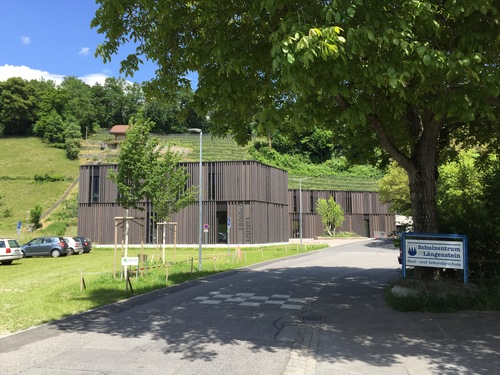
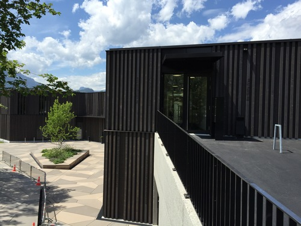
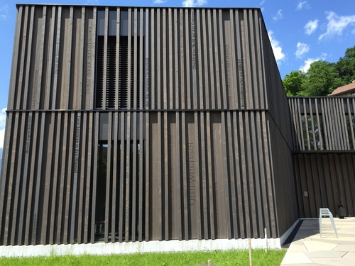
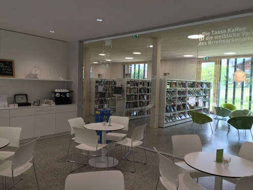
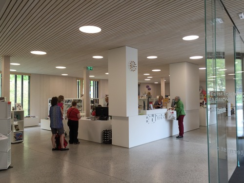
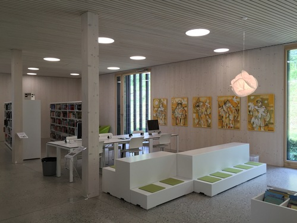
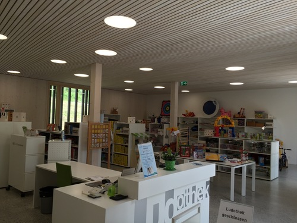
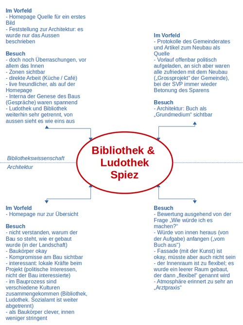

An der Hochschule für Technik und Wirtschaft Chur (Schweiz) sind als
Disziplinen anderem die Bibliothekswissenschaft (im Departement
Information) und die Architektur (Im Departement Bau) vertreten.
Forschende beider Disziplinen arbeiten unter anderem im europäischen
"Network on Urban Libraries" zusammen. (Schuldt & Mumenthaler, 2015) Im
Laufe dieser Zusammenarbeit zeigte sich, dass die Forschenden der beiden
Disziplinen mit sehr unterschiedlichen Interessen und Fragen an
Bibliotheken und Bibliotheksbauten herantreten. In Rahmen eines internen
Projektes wurde von vier Forschenden versucht, diese unterschiedlichen
Zugänge zu erfassen. Zwei der Forschenden lehren und forschen in der
Architektur (Daniel Walser, Susanne Caviezel), zwei in der
Bibliothekswissenschaft (Rudolf Mumenthaler, Karsten Schuldt).

Am Beispiel einer neu gebauten Bibliothek in einer schweizerischen
Gemeinde versuchten die vier Forschenden sich gegenseitig ihre
unterschiedlichen Zugänge zu verdeutlichen und gleichzeitig zu
reflektieren, wie sie bei ihrer Forschungsarbeit vorgehen. Die
untersuchte Bibliothek wurde gewählt, da sie erst einige Monate zuvor
eröffnet worden war und somit auf Unterlagen und Erfahrungen des
bauenden Architekturbüros und des Bibliothekspersonals zurückgegriffen
werden konnte.

Im folgenden soll dieser Besuch sowie die unterschiedlichen
Herangehensweisen geschildert werden. Grundsätzlich besuchten die vier
Forschenden die gleichen Bibliothek, es zeigte sich aber, dass sie zwei
sehr unterschiedliche Ansätze verfolgten und diesen auch
unterschiedliche Bilder von Bibliotheken im Allgemeinen zugrunde lagen.

### Das Beispiel: Bibliothek und Ludothek Spiez

Die untersuchte Bibliothek und Ludothek Spiez zog Anfang 2015 in ein
neues Gebäude in direkter Nachbarschaft der Gemeindeverwaltung und eines
Schulzentrums. Sie ist die Bibliothek der Gemeinde, weitere Filialen
existieren nicht. Spiez ist mit rund 12.500 Einwohnerinnen und Einwohner
eine mittelgrosse Gemeinde im Berner Oberland (Kanton Bern). Direkt am
Thunersee gelegen ist sie gekennzeichnet durch eine relativ lose
Besiedlungsform, zumeist in ein- bis dreigeschossigen Häusern, ohne
sichtbares Zentrum und mit einer stark ländlichen Atmosphäre. Grosse
Teile der Gemeinde sind mehr oder minder autonome dörfliche Strukturen
("Bäuerten"). Bekannt ist Spiez für seine hohe Naherholungsqualität,
insbesondere durch den Badestrand, den kleinen Hafen in der Bucht Spiez
und das Schloss Spiez. Die Gemeinde hat ein reges politisches und
kulturelles Leben und, im Rahmen der Gemeindegrösse, eine gesicherte
finanzielle Basis.

1980 bezog die Bibliothek einen Pavillon auf einer Wiese direkt vor dem
jetzigen Standort. Dieser Pavillon wurde spätestens in den 2000er Jahren
als unzulänglich begriffen und regelmässig als "Provisorium"
beschrieben.[^1] Zudem wurde 1980 die Ludothek Spiez gegründet.[^2] Auch
diese war in einer Räumlichkeit untergebracht, die als unzureichend
angesehen wurde. Beide Einrichtungen hatten im Laufe ihres Bestehens
Vereine gegründet, die sie, mit finanzieller Unterstützung der Gemeinde,
trugen. Mit dem gemeinsamen Einzug in das neue Gebäude wurden diese
Vereine aufgelöst und ein gemeinsamer Trägerverein für die Bibliothek
und Ludothek Spiez gegründet. Perspektivisch ist eine vollständige
Zusammenführung beider Einrichtungen geplant. Aktuell arbeiten sie im
selben Raum, mit einem geteilten Tresen, zusammen, sind aber noch als
unterschiedliche Gruppen, beispielsweise mit unterschiedlichen
Öffnungszeiten und Plätzen am Tresen, organisiert. Gleichwohl scheint
sich diese Situation, soweit beim Besuch und der vorhergehenden
Recherche ersichtlich wurde, nicht in einer Konkurrenz zwischen den
beiden Gruppen zu äussern.

Diesem Bau waren mehrere Jahre an intensiven Planungen vorausgegangen.
Bis zum Jahr 2006 hatten Bibliothek, Ludothek und Gemeindeverwaltung die
Planung für einen neuen Bau entwickelt, der mit 3,4 Millionen CHF
taxiert war und, an der Stelle des heutigen Baus, ein historisches
Gebäude integrieren sollte. In einer obligatorischen Volksabstimmung
wurde dieses Projekt allerdings von den stimmberechtigten
Gemeindemitgliedern verworfen.[^3] Diese Abstimmungsniederlage führte
interessanterweise zu einem neuen, grösseren Projekt, das neben der
Bibliothek und Ludothek auch Räume der Sozialverwaltung mit aufnahm.[^4]
Bis 2012 änderte sich auch die Situation in der Gemeinde. Die Bewohnerin
des historischen Gebäudes verstarb, die Gemeinde veräusserte ein nicht
mehr benötigtes Schulgebäude und hatte dadurch relativ grosse Geldmittel
für Investitionen zur Verfügung. Gleichzeitig stieg offenbar die
Platznot von Bibliothek, Ludothek und Sozialverwaltung.

In einer neuen Ausschreibung wurde ein Gebäude gefordert, welches für
Bibliothek, Ludothek und Gemeindeverwaltung Platz schaffen sollte. Das
vom Architekturbüro bauzeit (Biel) eingereichte Projekt "Buchwert",
welches den Wettbewerb gewann, setzte auf einen vollständigen,
zweigeschossigen Neubau, der das vorhandene historische Gebäude
ersetzte. Das neue Projekt, mit Kosten von rund 7,8 Millionen CHF, wurde
dann 2012 in der obligatorischen Abstimmung angenommen und bis 2014
umgesetzt. Der Bau selber wurde im "Grossen Gemeinderat" mehrfach als
ein "Grossprojekt" für die Gemeinde bezeichnet.[^5]

Das Gebäude ist am Rand der Gemeinde, direkt an einem Weinberg,
situiert. Der Baukörper besteht aus zwei Etagen, wobei Bibliothek und
Ludothek in der ersten, ebenerdigen Etage untergebracht sind, die
Gemeindeverwaltung in der zweiten, die seitlich ebenso direkt über eine
Rampe erreicht werden kann. Das von aussen kompakte Gebäude umfasst zur
Strasse hin einen Empfangs- und Aufenthaltsbereich mit Sitzgelegenheit.
(Bild 1 und Bild 2) Prägnant für den Bau ist die Ausgestaltung der
Aussenfassade mit dunklen Holzlamellen. Diese Lamellen sind mit rund 170
Buch- und Spieletiteln beschriftet. (Bild 3) Diese Fassade, explizit aus
Schweizer Holz gestaltet, lehnt sich an die Gestaltung der alten
Bauernhäusern des Berner Oberlandes an.[^6]

Der Innenraum der Bibliothek und Ludothek ist durchgängig vom Weiss der
Wände, Decken, Böden und meisten Möbel geprägt, aufgelockert durch helle
Farben und Schwarz als Kontrast. Die zahlreichen Fenster ermöglichen, im
Gegensatz zum Eindruck des Äusseren, einen hellen Innenraum. Gegliedert
wird er durch einige Glaswände und Säulen, aber vor allem durch die
Verwendung unterschiedlicher Möbel. (Bild 4) Der Tresen für das Personal
ist fest installiert, die anderen Möbel sind grösstenteils flexibel. Die
Ludothek nutzt den Platz rechterhand des Tresens, während der
Bibliotheksraum linkerhand eine grössere Fläche einnimmt. (Bild 5, Bild
6 und Bild 7) Am äussersten Ende, hinter zwei Ecken, sind Arbeitsplätze
installiert. Die Hoffnung des Architekten und des Bibliothekspersonals
ist, dass dies den ruhigsten Platz der Bibliothek darstellt. Ein Raum
mit kleiner Bühne und Technik, der für verschiedene Veranstaltungen der
Gemeinde sowie Einführungen für die Schülerinnen und Schüler des
gegenüberliegenden Schulzentrums genutzt wird, ist durch Türen in den
Bibliotheksraum hinein zu öffnen. Ein Lesegarten hinter dem Gebäude war
geplant, ist aber noch nicht umgesetzt.

### Der Besuch

Der Besuch der vier Forschenden fand im Juni 2015, kurz vor dem
offiziellen Eröffnungsfest, aber schon einige Monate nach der
tatsächlichen Eröffnung des neuen Gebäudes statt. Begleitet wurde der
Besuch vom ausführenden Architekten Peter Bergmann; ein Gespräch mit
einer Vertreterin der Bibliothek war ebenfalls möglich. Der Besuch
dauerte rund zwei Stunden, währenddessen die Forschenden das Gebäude
zuerst alleine interpretierten, dann durch den Architekten eine Führung
durch das Gebäude erhielten, in welcher dieser auch den
Entstehungsprozess und die Änderungen zwischen dem ursprünglich
geplanten und dem schliesslich gebauten Raum schilderte. Anschliessend
führten die Forschenden Gespräche mit den Anwesenden, immer daran
orientiert, was sie an einer solchen Bibliothek als Forschungsthema
interessieren würde. Dabei führten alle Forschenden mit
unterschiedlichen Personen Gespräche und erkundeten die Bibliothek und
Ludothek selbstständig, auffällig war aber, dass die Forschenden aus der
Architektur andere Fragen stellten als diejenigen aus der
Bibliothekswissenschaft und sich länger mit dem Architekten
unterhielten, während die Forschenden aus der Bibliothekswissenschaft
länger mit dem Personal von Bibliothek und Ludothek sprachen.

Ein Unterschied war, dass die Forschenden aus der
Bibliothekswissenschaft im Vorfeld unabgesprochen Recherchen über die
Bibliothek – allerdings mit unterschiedlichem Fokus – durchführten,
während die Forschenden aus der Architektur fast vollständig darauf
verzichteten und zuerst das Gebäude auf sich wirken lassen wollten.

Vor Ort wurde sichtbar, dass die Forschenden aus der Architektur sich
sehr für die Position des Gebäudes im umgebenden Raum sowie den
Baukörper selber interessierten, die Forschenden aus der
Bibliothekswissenschaft weniger. Letztere bewerteten die Bibliothek von
der Erfahrung aus anderen Bibliotheken ausgehend, die in den letzten
Jahren neu gebaut oder umgebaut wurden. Insbesondere fiel ihnen auf,
dass auch diese Bibliothek ähnlichen Grundsätzen folgte – beispielsweise
dem hellen Raum, den flexiblen Möbeln, der Zonierung des Raumes –,
obgleich die Entscheidungen für den Bau und die Ausstattung eigenständig
in Spiez getroffen wurden. So gibt es in Spiez zum Beispiel
Bilderbuchtröge und Zeitschriftenablagen, die vor Ort von einem
Schreiner gefertigt wurden, aber genauso aussehen und funktionieren, wie
die Möbel, welche bei etablierten Lieferanten von Bibliotheksmöbeln
erworben werden können. Sie sind fraglos praktikabel, aber die
Forschenden aus der Bibliothekswissenschaft nahmen sie auch als
Bestätigung der These, dass die meisten neu gebauten Bibliotheken
ähnlich aussehen; egal, wie die Bauten begründet sind und wer die
Entscheidungen über sie trifft.

Interessant war auch, dass der Architekt ausgewogenere Aussagen zum
gesamten Projektverlauf, vor allem den politischen Verhandlungen,
machte. Er bewertete die Bibliothek und Ludothek im Vergleich mit
anderen Projekten seines Büros, während das Personal sie aus der lokalen
Position heraus bewertete und durchaus berechtigt einen gewissen Stolz
auf das erfolgreiche Bauprojekt – das, wie gesagt, im Rahmen der
Gemeinde als Grossprojekt galt – zeigte. Architekt und Personal waren
beide mit dem schlussendlich gebauten Gebäude zufrieden, wobei es im
Laufe des Bauprozesse dennoch Abstriche gegeben hatte. Gleichzeitig wird
das neue Gebäude, so der Eindruck des Personals, von der Bevölkerung gut
angenommen. Vor allem die Forschenden aus der Bibliothekswissenschaft
interessierte dabei die Frage, wie die Vorstellungen aus der Bibliothek
und von Nutzerinnen und Nutzern in den Planungs- und Bauprozess
eingeflossen sind, obwohl diese Frage am Ende kaum beantwortet werden
konnte.

Insgesamt erlebte das Team der Forschenden die neugebaute Bibliothek als
belebt und gut durchdacht. Die Kompromisse, welche – wie bei allen
ähnlichen Projekten – eingegangen werden mussten, sind nicht auf den
ersten Blick sichtbar. Es gab die Frage, ob die Bibliothek und Ludothek
tatsächlich im gegebenen Platz alle Aufgaben wahrnehmen kann, die sie
sich selber zuschreibt – beispielsweise ruhiger Arbeitsort und
Bibliothek des Schulzentrums zu sein, gleichzeitig Zentrum für Familien
und die Gemeindebevölkerung selber –, aber es war sichtbar, dass im
Rahmen der Möglichkeiten der Gemeinde ein sehr sinnhafte Lösung gefunden
wurde. Wie vor allem die Forschenden aus der Architektur betonten, wurde
die Verbindung zur Sozialverwaltung im oberen Stockwerk nicht ganz klar.
Obwohl im gleichen Bau untergebracht und für den Abstimmungserfolg zum
neuen Gebäude als notwendig angesehen, scheint es keine richtige
Verbindung zwischen Bibliothek und Ludothek auf der einen und Verwaltung
auf der anderen Seite zu geben.

### Reflexion des Besuches

Der Besuch der Forschenden wurde unternommen, um gemeinsam die
unterschiedlichen Herangehensweisen bei Forschungen und der Entwicklung
von Fragestellungen zu neuen Bibliotheksbauten kennenzulernen. In einem
Reflexionsgespräch stellten sich die Forschenden einige Tage später
gegenseitig ihre Überlegungen im Vorfeld und während des Besuches dar.

Sichtbar wurde dabei, dass alle vier unterschiedlich an den Bau
herangegangen sind, dass sich aber auch gemeinsame Erfahrungen zwischen
den Forschenden aus der Architektur auf der einen und denen aus der
Bibliothekswissenschaft auf der anderen Seite zeigten. Grundsätzlich
gingen die beiden Disziplinen mit einem anderen Vorwissen und einem
anderen Interesse an den Besuch heran: Die Architektur interessierte der
Bau, die Umsetzung des Baus, die Funktion des Baus im Raum und die
Gestaltung des Raumes selber; die Bibliothekswissenschaft interessierte
die Nutzung der Bibliothek sowie die Raumplanung und -aufteilung. Beide
Blickwinkel schliessen sich nicht aus, es gab ebenso gemeinsame
Interessen. Beispielsweise fanden alle die Schilderungen der politischen
Prozesse – die allerdings nicht zur Publikation gedacht sind – in den
unterschiedlichen Kommissionen interessant oder fragten sich nach der
Funktion des Vorplatzes des Baus, der sehr aus der Umgebung
heraussticht. Gleichzeitig war aber auch sichtbar, dass die Massstäbe
unterschiedliche waren. Während die Architektur den Bau anhand anderer
Bauten interpretierte und ihn als sinnvoll und machbar, aber wenig
innovativ beschrieb, bewertete die Bibliothekswissenschaft auf der Basis
anderer Bibliotheken und fand die Lösungen im Innenraum in Spiez
praktikabel und nachvollziehbar, aber kaum hervorstechend anders als in
anderen Bibliotheken.

Bild 8 skizziert die unterschiedlichen Herangehensweisen an den Besuch
in Spiez. Sichtbar ist hier, dass von den Forschenden aus der
Bibliothekswissenschaft eher auf den Innenraum und dessen Nutzung
geachtet wurde, aber auch, dass einer der beiden Forschenden den Besuch
mit einer Recherche auf der Homepage vorbereitet und sich anschliessend
von der Situation vor Ort überraschen liess, während der andere
Forschende sich mit einer Recherche zur politischen Genese des Projektes
beschäftigte. Insoweit hatte zweiter beim Besuch Fragen zum Vorlauf, die
aber nur zum Teil beantwortet werden konnten, da auch der Blick der
Informantinnen und Informanten andere Fokusse hatte. Auch beide
Forschende aus der Architektur gingen, trotz gemeinsamer Interessen,
unterschiedlich an den Besuch heran. Neben der Recherche nach dem
Architekturbüro und einiger seiner Referenzbauten unternahmen beide
keine grösseren Recherchen im Vorfeld, sondern verliessen sich auf die
Informationen und den Eindruck, den sie vor Ort sammeln konnten, um
diesen anschliessend zu bewerten. Sie stellten vor Ort Fragen nach der
konkreten Umsetzung.

Interessant waren auch die Reaktionen auf die Gestaltung der Lamellen
mit Buch- und Spieletiteln. Die beiden Forschenden der
Bibliothekswissenschaft empfanden diese Lösung als zu traditionell, da
sie Bibliotheken als Orte mit verschiedenen Medien verstanden. Die
Forschenden aus der Architektur hatten diesen Eindruck nicht. Die Lösung
wurde als möglich für den Baukörper beschrieben. In diesem Zusammenhang
war es aber auch interessant, dass die Forschende aus der Architektur
den Bau ausgehend von der Frage bewerten wollte, wie sie selber die
Bauaufgabe gelöst hätte und dabei explizit vom Buch und seinen
Funktionen ausgegangen wäre. Hier zeigt sich, dass es nicht nur
unterschiedliche Herangehensweisen sondern ebenso unterschiedliche
Wahrnehmungen von Bibliotheken innerhalb des Teams gab.

Dies liess sich aber auch spiegelbildlich zeigen. Die Forschenden aus
der Bibliothekswissenschaft äusserten zwar im Nachhinein Zweifel, ob die
Bibliothek wirklich alle Aufgaben im gegebenen Raum wahrnehmen könne,
sahen aber die angestrebte Flexibilität als Zeichen einer modernen
Bibliothek. Die Forschenden aus der Architektur widersprachen dem
explizit. Insbesondere für die Forschende galt die Aufgabe als nicht
wirklich gelöst, sondern eher verschoben. Es sei ein leerer Innenraum
gebaut worden, der dann flexibel genannt würde. Der Forschende bemerkte
insgesamt, dass der Bau bei näherer Betrachtung doch die Kompromisse
zeigen würde, die notwendig gewesen wären, um den Bau politisch
durchzusetzen.

Letztlich zeigte der Besuch, dass die Herangehensweise der
Bibliothekswissenschaft eher von den bibliothekarischen Diskursen
bestimmt war, die überprüft, widerlegt oder zumindest als
Hintergrundinformation benutzt wurden, während die Architektur sehr
konkret vom tatsächlichen Bau und den baulichen Aufgaben ausging. Für
die weitere gemeinsame Forschung kann das Team auf dem Wissen um diese
unterschiedlichen Herangehensweisen zurückgreifen.

### Fazit

Der hier kurz beschriebene gemeinsame Besuch einer neuen Bibliothek
durch ein Team aus Forschenden der Bibliothekswissenschaft und der
Architektur lieferte einige interessante Ergebnisse, die über die eher
zufällige Gruppe von Forschenden und eher zufällig gewählte, neugebaute
Bibliothek hinausgehen. Für Forschungsprojekte, insbesondere in der
Phase der gemeinsamen Themen- und Methodenfindung, scheint sich ein
solcher Besuch in interdisziplinären Teams anzubieten. Das "informierte
Flanieren" und Verorten am und im Forschungsgegenstand Bibliothek sowie
die anschliessende gemeinsame Reflexion lässt Ansatzpunkte aber auch
Differenzen offenbar werden, die bei einem gemeinsamen
Forschungsvorhaben genutzt werden können. Offenbar geht es bei einer
solchen möglichen interdisziplinären Zusammenarbeit nicht nur darum,
dass die beteiligten Felder unterschiedliche Fragen in einen gemeinsamen
Fragekatalog unterbringen, sondern tatsächlich darum, dass über gänzlich
andere Fragen nachgedacht wird, die mit gänzlich unterschiedlichen
Methoden bearbeitet werden können und müssen.

Für andere potentielle interdisziplinäre Forschungsteams, an denen sich
die Bibliothekswissenschaft beteiligt, wäre es relevant, solche
gemeinsamen Besuche zu organisieren. Nicht nur die Architektur, sondern
auch verwandtere Disziplinen – beispielsweise die Pädagogik oder
Soziologie – stellen gewiss ganz andere Betrachtungen zu Bibliotheken
an. Es ist zu vermuten, dass die Debatten, auf denen die
Bibliothekswissenschaft – und die Bibliotheken – ihre Arbeit aufbauen,
von anderen Disziplinen nicht wahrgenommen werden oder das diesen zum
Teil sogar widersprochen wird, wie im hier geschilderter Beispiel der
Vorstellung von Flexibilität, die von Bibliotheken heute als essentiell
angesehen, aber von den Forschenden aus der Architektur kritisch
bewertet wurde.

Gleichzeitig zeigte der Besuch auf, dass das Bild von Bibliotheken an
sich auch bei Personen, die ausserhalb des Bibliothekswesens und der
Bibliothekswissenschaft stehen, grundsätzlich positiv ist, aber doch
sehr anders, als Bibliotheken dies erwarten oder selber wahrzunehmen
scheinen. Insoweit sollten nicht nur Bibliotheken und die
Bibliothekswissenschaft über Bibliotheken Auskunft geben, sondern
verstärkt versucht werden, auch die Darstellungen anderen Disziplinen
und Gruppen mit einzubeziehen. Ansonsten bleibt das Bild nicht nur
unvollständig, sondern eventuell sogar in unerwartete Richtungen
verschoben, wie im hier geschilderten Fall des positiven Bezugs auf das
Buch durch die Forschenden der Architektur und des ausführenden
Architekturbüros selber, von welchem in bibliothekarischen Debatten eher
vermuten wird, dass gerade dieser eher veraltet wäre.

### Literatur

bauzeit architekten (2013). *Bibliothek Ludothek Verwaltung Spiez.* Biel
: bauzeit architekten,
<http://www.bauzeit.com/?noFlash=true&lang=de&page=8&project=2>

Blumer, Eliane ; Schuldt, Karsten (2014). *Diese Zukunft war einmal:
Ehemals moderne Bibliotheken, heute*. In: LIBREAS. Library Ideas 10
(2014) 24, <http://libreas.eu/ausgabe24/04blumer/>

Dubs, Susanne (2015). *Regionalbibliothek Spiez*. In: biblioBE.ch.
Informationen für Schul- und Gemeindebibliotheken des Kantons Bern,
2015,
<http://www.bibliobe.ch/de/news/informationen-2015-2/regionalbibliothek-spiez.aspx>

Grosser Gemeinderat Spiez (2013). *227. Sitzung des Grossen
Gemeinderats. 02. Dezember 2013, 14:15 Uhr, Gemeindesaal Lötschbegr,
Spiez.* Spiez,
<http://www.spiez.ch/fileadmin/media/pdf/protokolle/GGR/2013/GGR_2013_12_02-2.pdf>

Schuldt, Karsten ; Mumenthaler, Rudolf (2015). *Bibliotheken und
Stadtentwicklung. Internationaler Workshop an der HTW Chur startet
Forschungszusammenarbeit*. In: SAB-Info 36 (2015) 01, 26-27

[^1]: Vgl. Die Protokolle des Grossen Gemeinderates,
    http://www.spiez.ch/gemeinde/informationen/protokolle-ggr.html. Dies
    war bei der Eröffnung noch anders, vgl. Blumer & Schuldt, 2014.

[^2]: Ludotheken sind Einrichtungen, in welchen Spiele und Spielsachen
    verliehen werden. In der Schweiz haben Ludotheken eine grosse
    Verbreitung gefunden, zumeist existieren sie als eigenständige
    Einrichtung, teilweise aber auch als Teil von Öffentlichen
    Bibliotheken. Oft sind sie, wie die Bibliotheken, in Vereinen
    organisiert. Die Arbeit in den meisten Ludotheken wird grösstenteils
    ehrenamtlich geleistet.

[^3]: Obligatorisch sind Referenden beispielsweise – wie in diesem Fall
    – ab einem bestimmten Finanzvolumen, welches allerdings von Kanton
    zu Kanton unterschiedlich angesetzt ist.

[^4]: Die Überlegung hinter dieser Vorwärtsstrategie war, so die beim
    Besuch befragte Bibliothekarin, dass mir der Einbindung mehrerer
    Einrichtungen sich für mehr Wählerinnen und Wähler Argumente für den
    Neubau ergeben würden.

[^5]: U.a. in Grosser Gemeinderat Spiez, 2013, 117.

[^6]: Dubs, 2015.
