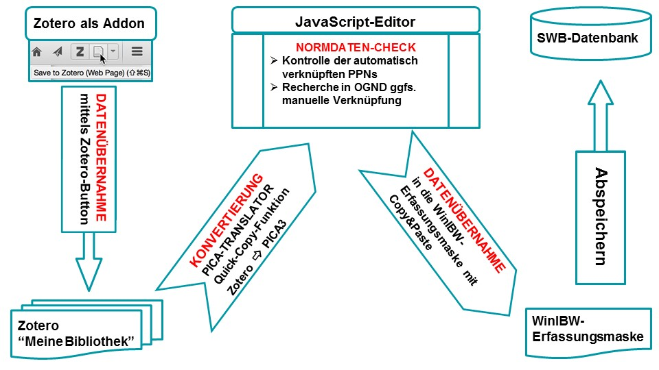
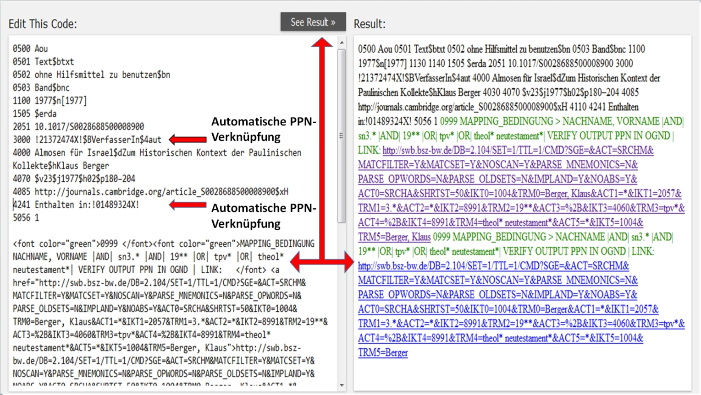
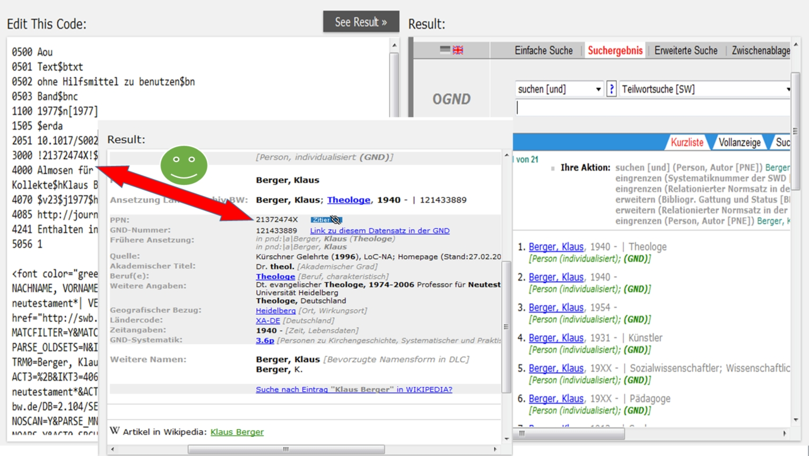

Eine traditionelle Aufgabe von Bibliotheken ist es, relevante Literatur
zu erschließen und für die Recherche nutzbar zu machen. Dabei
konzentrierte sich die Katalogisierungsarbeit in Bibliotheken meist auf
Monographien, Sammelwerke oder die Gesamtaufnahmen von Zeitschriften,
ohne die darin enthaltenen Artikel auszuwerten. Eine Ausnahme stellt der
Index Theologicus (IxTheo)^[<http://www.ixtheo.de/>] der
Universitätsbibliothek Tübingen dar.

Der IxTheo geht zurück auf die 1975 als gedruckter
Zeitschrifteninhaltsdienst Theologie begonnene Aufsatzdokumentation und
erscheint seit 2007 nur noch online als frei zugängliche
Aufsatzdatenbank ("Zur Geschichte des Index theologicus", 2007). Bis
dato ist der IxTheo eine der wichtigsten und frei zugänglichen
bibliographischen Datenbanken im Bereich Theologie und
Religionswissenschaft, die umfassend theologische Aufsatzliteratur
dokumentiert. Zudem wird der IxTheo im Rahmen des
Fachinformationsdienstes (FID)
Theologie^[<http://www.ub.uni-tuebingen.de/fidtheo>] 2016 zu einer
umfassenden, wissenschaftlichen Bibliographie für Theologie und
Religionswissenschaft ausgebaut, in der neben unselbständiger auch
selbständige Literatur sowie Datenbanken und ausgewählte Internetlinks
nachgewiesen werden.

Andere frei zugängliche theologische Spezialbibliographien wie

-   die Bibelwissenschaftliche Literaturdokumentation Innsbruck
    (BILDI^[<https://www.uibk.ac.at/bildi/index.html.de>]),

-   die Analytische Bibliographie zum Deuteronomium (AnaBiDeut^[<http://anabideut.univie.ac.at/content/site/de/projektinformation/index.html>]),

-   die Bibliographie biblique informatisée de Lausanne (BiBIL^[<https://www.unil.ch/irsb/fr/home/menuguid/bibil.html>]),

-   der Catalogue de l'École Biblique et Archéologique Française in
    Jerusalem
    (CEBAF^[<http://www.ebaf.edu/wp-content/uploads/biblio/en-aide-all.pdf>]),

-   die Missionsbibliothek und katholische Dokumentationsstelle
    (MIKADO^[<http://www.mikado-ac.info/home.html>]),

-   die Kanonistische Literaturdokumentation Innsbruck
    (KALDI^[<https://www.uibk.ac.at/praktheol/kaldi/>]),

-   die Datenbank zur mimetischen Theorie von René Girard
    (MIMESI^[<https://www.uibk.ac.at/rgkw/drama/mimdok/index.html.de>])
    und

-   der Theologische Schlagwortkatalog für Genderforschung
    (TSG^[<http://www.netzwerk-fgf.nrw.de/fileadmin/media/media-fgf/download/publikationen/Journal-33_Netzwerk_FGF.pdf>])

sind auf eine bestimmte theologische Teildisziplinen spezialisiert und
decken – anders als der IxTheo – nicht alle theologischen Disziplinen
umfassend ab.

Um aber eine solche freie bibliographische Datenbank dauerhaft betreiben
und weiterentwickeln zu können, sind neben solider Infrastruktur
zunehmend stärkere Vernetzung und Kooperation in Form von Informations-
und Datenaustausch untereinander erforderlich. Vor allem sollten die
Metadaten idealerweise arbeitsteilig in einem standardisierten
Datenformat von den kooperierenden Einrichtungen gemeinsam hergestellt
werden. Softwaretools sollten den Datenerfassenden ihre Tätigkeit so
einfach wie möglich machen und einzelne Arbeitsschritte weitgehend
automatisieren.

Eine Herausforderung bei der Aufsatzkatalogisierung in einer
Verbundumgebung ist jedoch die um Größenordnungen höhere Zahl von zu
bearbeitenden Aufnahmen und damit einhergehend die Problematik
zeitintensiver Bearbeitung der Normdaten. Softwaregestützte
semiautomatische Verfahren können auch bei dieser Problematik Abhilfe
schaffen, wie wir anhand von Zotero zeigen wollen.

### Katalogisierung im Index Theologicus

Seit 2013 wird die unselbständige Literatur nicht mehr in der
allegro-Datenbank, sondern direkt im Pica-CBS des Südwestdeutschen
Bibliotheksverbundes (SWB) erfasst. Die Migration der circa 507.000
"Altdaten" in die SWB-Datenbank ist dieses Jahr erfolgt und demnächst
wird noch der jetzige IxTheo-Katalog durch ein modernes Resource
Discovery System (*Vufind)* abgelöst. Seitdem die Katalogisierung im
SWB-Verbund erfolgt, ist die Normdatenverknüpfung und -erstellung der
Autoren in der gemeinsamen Normdatei (GND) als neue, aufwändige Aufgabe
hinzugekommen.

Mit großem Engagement des früheren und jetzigen IxTheo-Teams konnten
bislang mit konventionellen Methoden im IxTheo circa 12.000-20.000
Aufsätze jährlich ausgewertet und mit Schlagwörtern und
IxTheo-Klassen^[<http://web.archive.org/web/20160413144655/http://www.ixtheo.de/klassger.htm>]
analytisch tief erschlossen werden. Im Zuge der erfolgreichen
Überführung vom Sondersammelgebiet (SSG) in den Fachinformationsdienst
(FID) Theologie soll der Zeitschriftenkanon des IxTheo über die rund 600
laufend ausgewerteten Zeitschriften hinaus deutlich ausgeweitet werden.
Dabei setzen wir neben der automatischen Dateneinspielung von
Verlagsdaten (zum Beispiel von DeGruyter) auch das neue semiautomatische
Produktionsverfahren mittels Zotero u.a bei der Gewinnung der Metadaten
ein. Von den ungefähr 1.800 laufenden Zeitschriftenabonnements aus den
Beständen des SSG/FID Theologie und Religionswissenschaft der UB
Tübingen können vor allem Zeitschriften, die nur noch online erscheinen,
unter Einsatz von Zotero im Katalogisierungsclient WinIBW katalogisiert
werden.

Die mit diesem neuen Verfahren hergestellte Metadaten werden dann aus
der SWB-Verbunddatenbank exportiert und im Solr-Index des IxTheo
indexiert. Diese sichere und dauerhafte Datenhaltung in der
SWB-Verbunddatenbank erleichtert die Nachnutzung der Daten sowie
Kooperationsbestrebungen mit anderen Bibliotheken, die den WinIBW als
Katalogisierungsclient nutzen (Faßnacht 2015).

### Zotero Translators zur Datenextraktion

Zotero^[<https://www.zotero.org/>] ist eine
Literaturverwaltungssoftware, welche als Open Source Software vom Roy
Rosenzweig Center for History and New Media der George Mason University
zusammen mit der Zotero-Community entwickelt wird. Als Programm zur
Literaturverwaltung integriert sich Zotero in den wissenschaftlichen
Schreibprozess, unterstützt beim Aufbau und der Verwaltung einer
persönlichen Literaturdatenbank und vereinfacht es, die Angaben bei
Belegstellen in Zitationen sowie das Quellenverzeichnis zu erstellen.
Die primäre Zielgruppe für das Programm sind somit alle, die
wissenschaftlich schreiben und publizieren müssen, wie etwa Forschende
oder Studierende. Auch in Deutschland bieten viele Bibliotheken Kurse
zur Nutzung von Zotero und anderen Literaturverwaltungsprogrammen an.

Eine wesentliche Funktionalität ist die einfache und komfortable
Integration in den Webbrowser, um die eigene Literaturdatenbank gleich
bei Recherche im Web zu füllen. Dies geschieht in Zotero vor allem über
den *Zotero-Speichern-Button (Zotero-Picker)*, mit welchem man mit einem
Klick die bibliographischen Metadaten der aktuellen Webseite extrahieren
und speichern kann. Daneben gibt es auch noch weitere Möglichkeiten wie
etwa das Importieren von bibliographischen Metadaten oder das Suchen
nach bestimmten Identifikatoren mit dem "Zauberstab". Diese drei
Funktionalitäten zusammen mit den Export-Möglichkeiten werden über
sogenannte Zotero Translators^[ "Zotero
Übersetzer": <https://www.zotero.org/support/dev/translators>]
bereitgestellt wie in Abb. 1 dargestellt ist.

Zotero kann ähnlich einem Simultanübersetzer (oder
Babelfisch^[<https://de.wikipedia.org/wiki/Babelfisch>]) agieren und
zwischen verschiedenen Datenformaten übersetzen. Beispielsweise ist es
mit Zotero über entsprechende Import- sowie Export-Schritte möglich,
MARC-Daten zusammen mit MODS-Daten in einer gemeinsamen CSV-Datei
auszugeben. Für solche oder ähnliche Transformationsschritte gibt es
aber auch spezialisiertere Tools aus dem Bereich Metadatenmanagement
(siehe Pfeffer 2016).

Wohl einzigartig sind aber die Möglichkeiten, strukturierte Metadaten
aus einer Vielzahl von bibliographischen Webseiten zu extrahieren, mit
Hilfe des Zotero Web Translators. Es gibt etwa 440 Web Translators
(Stand April 2016), die aus der Präsentationsschicht von Verlagen,
Bibliotheken, Digitalen Archiven, Zeitschriften et cetera die
bibliographischen Metadaten generieren. Häufig werden bei diesen
Webseiten die Maschinenlesbarkeit beispielsweise für
Literaturverwaltungsprogramme, Export-Möglichkeiten in Standardformate
und die Pflege guter APIs zugunsten einer hübschen Präsentation
vernachlässigt (Zumstein & Stöhr 2015). Daher müssen Web Translators die
Informationen häufig aus den Webseiten "herauskratzen" (web scraping).
Somit sind Zotero Translators vielfach die einzige Möglichkeit, ohne
großen Aufwand bibliographische Daten automatisiert aus bestimmten
Webseiten zu extrahieren.

Das Translator Framework ist modular, das heißt jeder Translator ist
eine eigene Javascript-Datei mit Metadaten und Testfällen. Wir haben 
zotkat^[<https://github.com/UB-Mannheim/zotkat>], eine Erweiterung für
den Einsatz von Zotero bei der Katalogisierung, als Open Source
entwickelt. Eine zentrale Komponente von zotkat ist ein Export
Translator für das Pica3-Format des SWB, das für IxTheo eingesetzt wird.
Durch die Hinzunahme dieses einen Translators für den Export können für
eine Unmenge von Webseiten die bibliographischen Daten extrahiert und im
Katalogisierungsclient genutzt werden. Der praktische Ablauf wird im
nächsten Abschnitt beschrieben.

Alternativ könnte man, um Artikel von einer einzelnen Webseite zu
extrahieren, natürlich auch eine eigene Lösung programmieren, aber dies
ist einerseits nur begrenzt möglich und scheint häufig über den eigenen
Gebrauch hinaus keinen Nutzen zu bringen. Dahingegen schafft die
Verwendung eines einheitlichen Frameworks Synergieeffekte und ist für
viele verschiedene Anwendungsfälle nachhaltig. Mehr als 65 Personen
haben sich an der Entwicklung von Zotero Translators bereits beteiligt.
Dabei sind etwa 480 Translators kollaborativ entstanden und werden von
der Community gepflegt sowie weiterentwickelt. Dies entspricht insgesamt
etwa 117.000 Zeilen Code,^[Es wurden 116.983 Codezeilen eruiert mit dem Tool
    <https://github.com/AlDanial/cloc>
    am 29.03.2016.] was nach dem COCOMO
Modell^[<https://de.wikipedia.org/wiki/COCOMO>] etwa 30
Personenjahren^[Wir verwenden die gleichen Parameter wie bei bei
    <https://www.openhub.net/>, d.h. a=2,4,
    b=1,04 bei PM = a\*KDSI\^b, wobei KDSI die Anzahl von
    auszuliefernden Codezeilen in Tausend entspricht] Entwicklungszeit entsprechen würde. Die Zotero
Translators werden auch von Wikipedia innerhalb von
Citoid^[<https://www.mediawiki.org/wiki/Citoid>] verwendet und ProQuest
nutzt sie in PME^[<https://github.com/proquest/PME>] nach.

### Katalogisierungsworkflow in der Praxis

Zur Illustration des Katalogisierungsworkflow in der Praxis, welchen wir
hier im Folgenden beschreiben, haben wir noch ein kurzes Video (ohne
Ton) erstellt^[<https://rawgit.com/libreas/ausgabe29/master/05kim/video/zotkat-video.html>].

Nach der Installation von Zotero als Add-on im Firefox-Browser werden
über den Zotero-Picker in der Symbolleiste die bibliographischen
Metadaten aus verschiedenen Datenquellen wie Verlagswebseiten,
Fachdatenbanken, OA-Journals und Bibliothekskatalogen et cetera in
"Meine Bibliothek" heruntergeladen. Dabei kann je nach Webseite zwischen
unterschiedlichen Downloadoptionen gewählt werden (Einzel- und
Mehrfachübernahmen, Persistente Identifikatoren mittels "Zauberstab",
Importfunktion von anderen Formate). In den meisten großen
Aufsatzdatenbanken wie JSTOR oder EBSCO ist Mehrfachübernahme, das heißt
alle Aufsätze eines Zeitschriftenheftes mit einem Klick, möglich.

Da die heruntergeladenen Metadaten desselben Aufsatzes je nach
Download-Option variieren, muss einmal vorher überprüft werden, welche
Option die optimalen Metadaten für die Katalogisierung liefert. Um die
Bearbeitung einer "Zotero-geeigneten" Zeitschrift im
IxTheo-Geschäftsgang zu erleichtern, tragen wir Informationen wie das
Produktionsverfahren, Datenquelle mit Permalink, die zu wählende
Downloadoption und andere in einem internen Zeitschriftenverwaltungstool
zusammen.

Die im Zotero-Ordner gespeicherten Metadaten werden dann einzeln mit
Copy & Paste oder Drag & Drop in einen
JavaScript-Editor^[<http://www.w3schools.com/js/tryit.asp?filename=tryjs_myfirst>]
eingefügt und anschließend im rechten "Result"-Fenster (Abb.3) die
automatisch erzeugte Autoren-SWB-PPN intellektuell kontrolliert. Für die
leichte Kontrolle und eventuelle Nachverknüpfung der PPN werden
zusätzlich zwei Links^[Link 1: <http://bit.ly/1UCrmJE>, Link 2:
<http://bit.ly/1ZYyzE3>]
mit unterschiedlich vordefinierten Suchabfragen automatisch erzeugt,
deren Ergebnis im rechten "Result"-Fenster direkt angeklickt und
angezeigt werden kann. (Abb. 3)

Die Verknüpfungen mit den Normdaten werden auf unterschiedliche Weise
realisiert. Die bekannten Zeitschriften der Theologie sowie eine Liste
von Autoren wurden im Vorfeld zusammen mit der SWB-PPN in einer
Mapping-Tabelle hinterlegt. Jedes Mal wenn bei einem Aufsatz der
Zeitschriftentitel oder Autorenname in dieser Liste vorkommt, wird
dieser Text beim Export mit dem Pica3-Translator durch die entsprechende
Normdatenverknüpfung (PPN) ersetzt. Diese automatische PPN-Verknüpfung der Autorennamen werden auch bei einem vorhandenen eindeutigen Treffersatz in OGND - Lookup für Autoren - erzeugt. Zusätzlich werden bei den Autoren
auch noch zwei Links im Pseudo-Pica-Felder 0999 erzeugt. Diese Links
fragen die Namensform "Nachname, Vorname" verbunden mit weiteren
spezifizierten Suchattributen wie Berufsbezeichnung ("theol\*",
"bischof\*", "pfarr\*"), GND-Systematik ("3.\*") und Lebensdaten
("19xx") ab, um ein möglichst eindeutiges Mappingergebnis zu erzielen.
Diese OGND-Suchabfrage kann zudem projektspezifisch weiter
angepasst ^[<https://github.com/UB-Mannheim/zotkat/wiki/Suche-nach-Autoren-Normdaten-im-Online-GND-(OGND)-Katalog>]
werden. Diese Links dienen einerseits der Kontrolle, können aber auch
weiter zur Recherche bei verschiedenen Personen mit dem gleichen Namen
benutzt werden (Abb. 4). Nach diesem Arbeitsschritt kann dann die
Pica3-Titelaufnahme ohne die Links aus dem linken Fenster wieder in die
Erfassungsmaske der WinIBW mit Copy & Paste übernommen und in der Regel
direkt abgespeichert werden.

Damit wird Zotero hier als Vorstufe zum eigentlichen
Katalogisierungsclient geschaltet, die gesamte Bearbeitung findet
clientseitig statt und erlaubt auch noch weitere manuelle
Nachjustierungen im gewohnten Katalogisierungsumfeld der WinIBW. Vor
einigen Jahren gab es bereits einen Vorschlag im GBV (Voß 2008a; Voß
2008b), Zotero bei der Katalogisierung zu verwenden. Dabei wurde aber
vorgeschlagen Zotero als Katalogisierungsclient zu verwenden und einen
entsprechenden Webservice sowie Anbindungen an den Verbundkatalog
aufzusetzen. Dieses Vorhaben ist nicht weiter umgesetzt worden.

### Zotero Pica3-Export-Translator im Praxistest

Aufgrund der Verbesserungsvorschläge, die sich bei der Katalogisierung
während der Testphase ergaben, konnten wir für den Produktionsbetrieb
den Pica3-Export-Translator nach Katalogisierungsvorgaben weiter
ausbauen. So wurden beispielsweise folgende Anpassungen realisiert:
wiederholte Feldbelegung 30xx bei mehr als einem/r Verfasser/in,
Trennung des Untertitels vom Titel mit "\$d", sprachspezifische
Umsetzung des Sortierzeichens "@" nach einem
Artikel^[<https://github.com/UB-Mannheim/zotkat/files/137992/ARTIKEL.pdf>]
und Anpassung unterschiedlicher Zeichensetzung zwischen Zotero-internem
Format und WinIBW-Format.

In vielen Fällen war es nach diesen Anpassungen möglich, die in Pica3
konvertierte Titelaufnahme ohne nachträgliche Bearbeitung in WinIWB
direkt – ähnlich wie bei einer Datenübernahme über Broadcast-Search in
WinIBW – abzuspeichern. Während der Testphase beschränkte sich die
nachträgliche Korrektur auf die Groß- und Kleinschreibung der
fremdsprachigen Titel, die mit dem Translator technisch nicht abgefangen
werden konnte. Diese Korrektur war während der Testphase im laufenden
Produktionsbetrieb auch deshalb notwendig, da die Aufsätze nach der
gedruckten Vorlage mit dem Katalogisierungsniveau "Aou" (=Katalogisat
der Druckausgabe nach Autopsie) erfasst wurden, während die
heruntergeladenen Metadaten der Online-Ausgabe bisweilen geringfügig
davon abwichen.

### Retrospektive Erfassung der IxTheo-Zeitschriften vor 1976

Im Rahmen eines Projekts wurden Aufsätze aus Zeitschriftenarchiven der
National- und Allianzlizenzen^[<https://www.nationallizenzen.de/angebote>] nach
Katalogisierungsniveau "Aor" (=Katalogisat ohne Autopsie)
beziehungsweise "Aon" (=maschinell konvertierte Katalogisate) rückwärtig
erfasst, so dass hier keine nachträgliche Korrektur an der Titelaufnahme
erforderlich war.

Lediglich die automatisch verknüpften Autoren-PPNs wurden in der OGND
überprüft und bei Nicht-Verknüpfung die Autoren gegebenfalls mit dem
oben dargestellten Verfahren manuell verknüpft. Wenn keine Normdaten zu
dem Autorennamen vorhanden waren, wurden die Namen als Text im
Autoren-Feld 30xx stehen gelassen und der Satz in "Aon" geändert, um
später im laufenden Betrieb nach Neuansetzung der Personen durch
geschultes Bibliothekspersonal verknüpft werden zu können. Zudem wurde
eine "Datenmaske" für ein lokales Abrufzeichen und die
IxTheo-Klassifikation im
Exemplarsatz^[<https://www.gbv.de/wikis/cls/WinIBW3:Datenmasken>]
angelegt, um sich Schreibarbeit zu ersparen. Da wir von Beginn an bei
der retrospektiven Katalogisierung das lokale Abrufzeichen "ixzo" für
Titel, die mit Zotero katalogisiert werden, vergeben haben, konnten
diese Titel in WinIBW leicht abgefragt und das Testergebnis statistisch
festgehalten werden:

-----------------------------------------------------------------------------
  ISSN     Erfassungszeitraum   Insgesamt    (Vpos) mit Normdaten verknüpft 
--------- -------------------- ------------ ---------------------------------
0048-1009     1956 - 1976      392 Aufsätze     240 Aufsätze nach “Aor”      
                                                  Prozentsatz:  61,22%       

0028-6885     1959 - 1977      602 Aufsätze     354 Aufsätze nach “Aor”      
                                                   Prozentsatz:  58 %        
-----------------------------------------------------------------------------

Table: Ergebnistabelle (wird unten fortgesetzt)

 
------------------------------------------------------
 (Vnot) Nicht verknüpft            Ergebnis          
------------------------- ----------------------------
152 Aufsätze nach “Aon”   16 h / 392 = ca. 2 ½ min pro
  Prozentsatz:  38,78 %    Aufsatz inkl. Vergabe der  
                            IxTheo-Klassen für Neues  
                             Testament im Lokalsatz   

248 Aufsätze nach “Aon“    30 h / 601 = ca.3 min pro  
   Prozentsatz:  42 %      Aufsatz  inkl. Vergabe der 
                            IxTheo-Klassen für Neues  
                             Testament im Lokalsatz   
------------------------------------------------------

Bei der nachträglichen Verknüpfung der Autorennamen stieg der Anteil von
"Vpos" auf circa 67%.

Die Gründe für das Nicht-Verknüpfen waren zum einen, dass keine
Personensätze zu den Namen vorhanden waren, und zum anderen, dass die
Normdaten oft nur als Tni-/Tpi-Sätze existierten und nicht ausreichend
individualisiert waren.

Die Rückmeldung des Bibliothekspersonals waren nach der Testphase
insgesamt positiv, vor allem seien Ergonomie und Usability durch das
Zotero-Verfahren im Vergleich zum bisher angewendeten Copy &
Paste-Verfahren bei der Erfassung eines Aufsatzes deutlich verbessert
worden und eine zusätzliche, noch deutlichere Arbeitserleichterung sei
durch den automatisierten und nachjustierbaren Autorenabgleich bewirkt
worden.

### Zusammenfassung und Ausblick

Summa summarum scheint Zotero als vorgeschaltetes Tool in Kombination
mit dem Katalogisierungsclient WinIBW einen Mehrwert unter anderem bei
der Verknüpfung von Normdaten anzubieten. Durch flexibel programmierbare
Abfragen und integrierbare Mappinglisten in Zotero Translator kann den
Katalogisierern bei der Arbeitsroutine geholfen und die Arbeit
effizienter gestaltet werden. Solche Normdatenverknüpfungen bieten dann
unmittelbar für die Bibliotheksnutzer weitere Zusammenhänge wie etwa die
Suche nach Publikationen eines bestimmten Autors oder eine
automatische Verlinkung verschiedener Datenbankeinträge desselben
Autors^[<https://tools.wmflabs.org/persondata/index.php>] über sogenannte
BEACON-Dateien^[<http://www.ixtheo.de/beacon/ixtheo.txt>],
wie zum Beispiel zwischen Wikipediaartikel und anderen
Online-Bibliographien. Allgemeiner kann man dies als weiteren
Informationsteil der LOD Cloud ansehen.

Die verschiedenen Schritte in dem hier beschriebenen semiautomatischen
Katalogisierungsworkflow können auch von unterschiedlichen Personen
durchgeführt werden. Vorstellbar ist eine Teilung in drei Teile:

1.  Sammeln der Artikeldaten mit Zotero,

2.  Herstellen der Normdatenverknüpfungen,

3.  Speichern in der Verbunddatenbank.

Die Schritte 2) und 3) sind momentan verschränkt und erfordern meist
tiefergehendes bibliothekarisches Know-How. Dahingegen ist es
vorstellbar, dass zum Beispiel auch Forscher innerhalb eines Projektes
theologische Zeitschriften auswerten und die Aufsatzdaten mit Zotero
sammeln. Prinzipiell kann der Schritt 1) auch als Dateningest etwa von
Herausgebern einer Zeitschrift genutzt werden, um die Aufnahme dieser
Artikel im Index Theologicus anzustoßen. Dabei können diese Daten in
einer Zotero-Gruppe^[<https://www.zotero.org/groups/ixtheo>] kollaborativ und auch ohne profunde
Katalogisierungskenntnisse gesammelt werden. Die Bibliothek könnte sich
dann auf die Normdatenerstellung, -verknüpfung und das Abspeichern in
der Verbunddatenbank konzentrieren. Es bleibt eine spannende Frage, wie
man den Katalogisierungsablauf für diese Aufsatzdaten softwaregestützt
und kollaborativ weiter optimieren kann, um die Quantität der Titel aber
auch die Erschließungstiefe hoch zu halten.

### Quellenverzeichnis

Faßnacht, M. (2015). Index Theologicus. Presented at the 16.
BSZ-Kolloquium am 22. September 2015 in der Universität Stuttgart,
Stuttgart. Retrieved from
<http://nbn-resolving.de/urn:nbn:de:bsz:576-opus-12418>

Pfeffer, M. (2016, March). *Open Source Software zur Verarbeitung und
Analyse von Metadaten*. Vortragsfolien presented at the 105. Deutscher
Bibliothekartag in Leipzig 2016 = 6. Bibliothekskongress / Themenkreis
4: Wissen organisieren und erhalten / LIS-Workshop (16.03.2016,
14:00-18:00, Vortragsraum 10), Leipzig. Retrieved from
<https://opus4.kobv.de/opus4-bib-info/frontdoor/index/index/docId/2449>

Voß, J. (2008a). *Simple Web Cataloging with Zotero*. GBV. Retrieved
from
<https://www.gbv.de/wikis/cls/Datei:SimpleWebCatalogingWithZotero_7.1.pdf>

Voß, J. (2008b, February). Zotero als Katalogisierungsclient –
Verbund-Wiki GBV \[Wikiseite\]. Retrieved April 3, 2016, from
<https://www.gbv.de/wikis/cls/Zotero_als_Katalogisierungsclient>

Zumstein, P., & Stöhr, M. (2015). Zur Nachnutzung von bibliographischen
Katalog- und Normdaten für die persönliche Literaturverwaltung und
Wissensorganisation. *ABI-Technik*, *35*(4), 210–221.
<http://doi.org/10.1515/abitech-2015-0037>

Zur Geschichte des Index theologicus. (2007, January). Retrieved April
3, 2016, from <http://web.archive.org/web/20160324045150/http://www.ixtheo.de/histger.htm>

