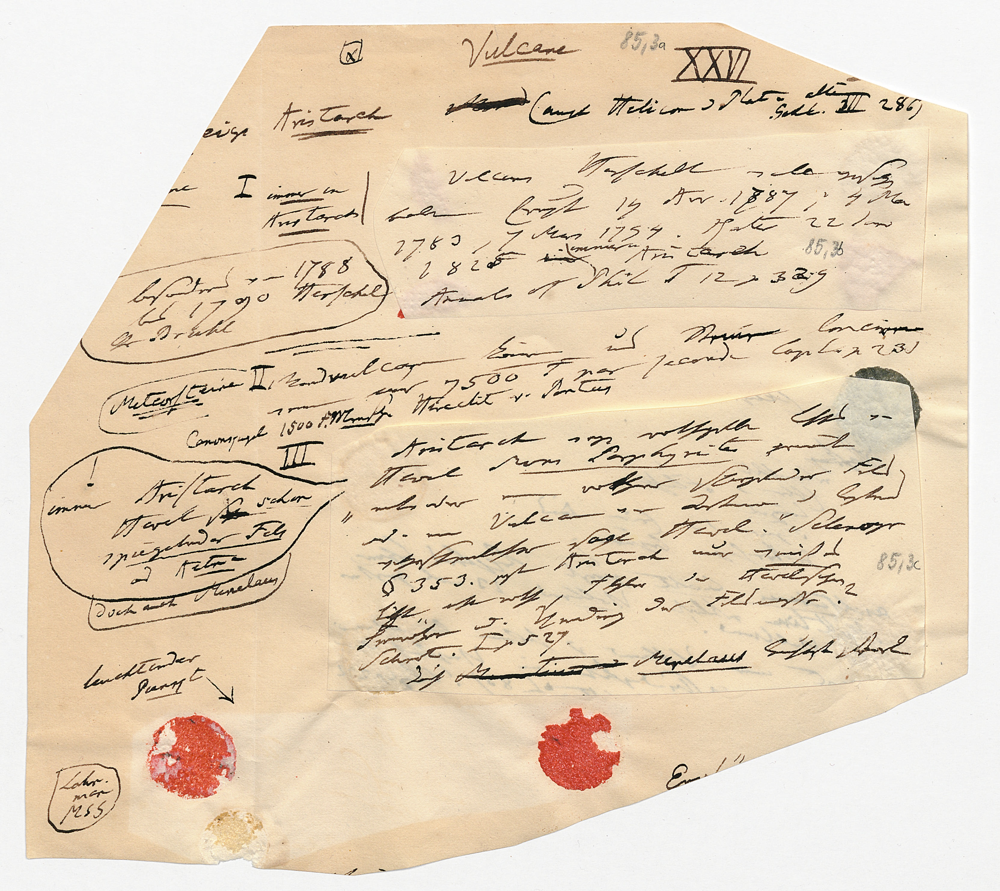
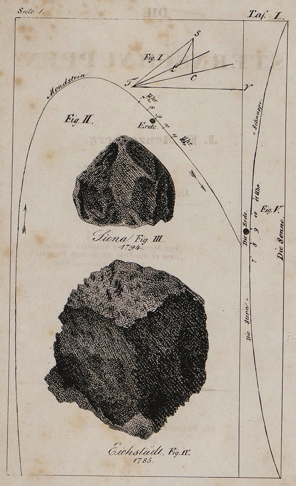

### Intro

Am Abend des 16. Juni 1794 waren in Siena Steine vom Himmel gefallen.
Schnell hatte man eins und eins zusammengezählt: Die Steine mussten vom
Vesuv stammen. Dort, in rund 380 km Entfernung, hatte es tags zuvor eine
sehr starke Eruption gegeben. Hätte ein Stein mit einem Gewicht von 1 kg
bei Neapel mit einer Anfangsgeschwindigkeit v~0~ und einem
Abschusswinkel α die Erdoberfläche verlassen, so wäre er tatsächlich am
nächsten Abend in der Toskana gelandet. Mathematisch besehen war diese
Hypothese also realistisch, und zwar spätestens seit Galilei
Berechnungen einer (idealen) Flugbahn (ohne Störungen wie sie
beispielsweise der Luftwiderstand mit sich brachte) angestellt
hatte.[^1] Realistischer jedenfalls als die Annahme, es könnten
tatsächlich Steine buchstäblich vom Himmel gefallen sein. An
mittelalterliche Ansichten über Meteoriteneinschläge als Strafe Gottes
wollte man zum Ende des 18. Jahrhunderts in der Regel nicht mehr so
recht glauben.

Die Erklärung überzeugte aber eben nur mathematisch. Denn die
geophysikalischen Untersuchungen, die dem als "Steinregen von Siena" in
die Geschichte eingegangenen Naturschauspiel unmittelbar folgten,
zeigten recht schnell, dass die Steine nicht vom Vesuv stammen
konnten.[^2] Eine andere Theorie musste her und diese fand man in der
Vorstellung, dass es sich zwar durchaus um Steine aus Vulkanausbrüchen
handeln würde, doch nicht von Vulkanen auf der Erde sondern von solchen
auf dem Mond. So war damals die Rede von Meteorsteinen selenitischer
Herkunft.

### Kosmos-Vorträge über "Meteorsteine"

Am 15.4.1828, also 34 Jahre nach diesem ‚event‘, referierte Alexander
von Humboldt in einem Hörsaal der Berliner Universität genau zu diesem
Thema: "Von den Meteorsteinen", und zwar in der 53. Sitzung seiner heute
so genannten Kosmos-Vorträge.[^3] Bei diesen handelte sich um zwei
teilweise parallel verlaufende Vorlesungszyklen: Humboldt hat einmal an
der Universität vor etwa 400 Hörern[^4] und einmal für ein noch
breiteres Publikum im damals größten überhaupt zur Verfügung stehenden
Vortragssaal, dem der Singakademie, vor immerhin 800 bis 1000[^5]
Zuhörern gelesen. Die Vorträge galten aufgrund der hohen Besucherzahlen
sowie der großen Aufmerksamkeit, die diese bereits zeitgenössisch
erfuhren, als "das bedeutendste gesellschaftliche Ereignis Berlins
dieser Jahre"[^6] und als "Sternstunden in der Geschichte der
Wissenschaftspopularisierung".[^7] Von dieser Veranstaltung haben wir
heute verschiedene Zeugnisse, da mehrere Nachschriften von Zuhörern
seiner Vorlesungen erhalten sind. Alle bisher bekannten Nachschriften
wurden und werden im Rahmen des Projekts "Hidden Kosmos – Reconstructing
Alexander von Humboldt's ‚Kosmos-Lectures‘" am Institut für
Kulturwissenschaft unter der Leitung von Christian Kassung digitalisiert
und im Volltext erfasst.[^8]

Kommen wir nun zurück zu den vom Himmel fallenden "Meteorsteinen" und
steigen für einen kurzen Moment in die entsprechende Passage der
besagten 53. Vorlesung Humboldts ein (hier zitiert aus der Nachschrift
von G. Parthey):

> Über die Ursachen des Phänomenes hat man 3 Hypothesen: 1, dass sich die
> Steine in der Athmosphäre der Erde bilden \[...\]. 2, dass sie aus den
> Mondvulkanen hergeschleudert werden. \[...\] 3, und dies ist das
> wahrscheinlichste, dass die Steine im Weltraume selbst herumfliegen
\[...\][^9]

Uns interessiert die Mondvulkanhypothese, wenn sie auch nach Humboldt
nicht die wahrscheinlichste war. Konzentrieren wir uns also auf die
Mondvulkanhypothese und zitieren ohne Auslassung aus derselben
Nachschrift:

> Poisson hat berechnet, dass eine Wurfkraft von 7100 Fus in der 1ten
> Sekunde dazu gehört um die Steine vom Monde auf die Erde zu schleudern:
> also 4 mal stärker als eine Kanonenkugel. Laplace fand, dass auf diese
> Art ein Stein in 2½ Tagen zu uns kommen könne: allein Olbers bewies mit
> musterhaftem Scharfsinn, dass Laplace dabei nicht auf die Translazion
> des Mondes gerechnet habe, und dass, wenn man diese in Anschlag bringt,
> die Steine aus den Mondvulkanen Erdsatelliten werden würden. Im Jahre
> 1660 wurde in Mayland ein Franziskanermönch durch einen Meteorstein
> getödtet, wie der Physiker Tortona berichtet, und schon um dieselbe Zeit
> 1660, sagte Turzago in einem Mémoire darüber: dass der Stein aus dem
> Monde gekommen sei.

Nicht weniger als fünf Quellen (Poisson, Laplace, Olbers, Tortona,
Turzago) ruft Humboldt in seiner Vorlesung im Jahr 1828 auf, um seinen
Zuhörern diese Hypothese verständlich zu machen.[^10] Um
Missverständnisse zu vermeiden: Humboldt ist sicherlich kein Anhänger
der Mondvulkanhypothese. Aber offensichtlich sind die Konsequenzen für
ein Gesamtes der Erdanschauung wie auch die damit verknüpften Namen und
Werke so groß, dass sie nicht einfach übergangen werden können.

So stellt sich die Frage: Welches Wissen stand Alexander von Humboldt
zur Verfügung? Wie sah seine Bibliothek, seine, wenn man so will,
Literaturdatenbank aus? Als wichtigstes Zeugnis der Bücher aus Humboldts
Privatbibliothek steht uns heute der "Catalogue of the Humboldt Library"
zur Verfügung (im Folgenden nach dem Verfasser Henry Stevens auch als
Stevens-Katalog bezeichnet). Der Großteil der Bücher wurde nach
Humboldts Tod durch einen Lagerhausbrand kurz vor der geplanten
Versteigerung bei Sotheby's vernichtet.[^11] Zu Laplace finden sich im
Auktionskatalog mit den Nr. 5669–5672 vier Einträge, wobei vor allem die
ersten drei ("Précis de l'Histoire de l'Astronomie", "Traité de
Mécanique céleste" und "Exposition du Systéme du Monde") entsprechende
Berechnungen über Meteorsteine enthalten könnten. Von Olbers war die
"Abhandlung über die Cometenbahn" in Humboldts Besitz sowie dessen
Briefwechsel mit F. W. Bessel. Die Nr. 7864–7868 entfallen auf Poisson,
wobei hier sicherlich letzteres mit dem Titel "Recherches sur le
Mouvement des Projectiles dans l'Air" von Interesse ist. Allerdings
finden sich weder für Tortona noch für Turzago irgendwelche Nachweise in
diesem überlieferten Verzeichnis.

In einer anderen im "Hidden Kosmos" Projekt bearbeiteten
Vorlesungsnachschrift wird die Passage zu den Mondvulkanen im großen und
ganzen bestätigt mit dem feinen Unterschied, dass es nicht Tortona,
sondern Tortana heißt: "Im Jahre 1660 wurde ein Franziskaner Mönch durch
einen Meteorstein getödtet, und Tortana war der erste der bei dieser
Gelegenheit in einer kleinen Dissertation sagte, daß sie aus dem Monde
kämen."[^12] Zu diesem Tortana findet sich (im XML der Transkription)
eine editorische Anmerkung:

```
<note resp="#BF" type="editorial">
    Vgl. <bibl>
	Terzago, Paolo Maria: Musaeum Septalianum Manfredi Septalae: 
             Patritii Mediolanensis Industrioso Labore constructum. Tortona 1664, 
             insbesondere Kapitel XVIII (S. 43–48).
	Online verfügbar: 
	<ref target="http://reader.digitale-sammlungen.de/de/fs1/object/display/bsb10051296_00075.html">
		MDZ München, abgerufen am 29.02.2016.
	</ref>
</bibl>
</note>
```

Editorische Notizen dieser Art wurden im Projekt "Hidden Kosmos" im
Rahmen einer Bachelorarbeit in die Projektdaten eingepflegt.[^13] Die
Notiz ist hier insofern interessant, da sich plötzlich die Verwirrung um
Tortona oder Tortana und Turzago auflöst. Alles war irgendwie falsch,
denn richtig wäre gewesen, dass es sich um eine Publikation eines Paola
Maria Terzago handelt, mit Tortona dagegen keine Person, sondern der
Verlagsort gemeint war.

Was aber heißt im Kontext von Vorlesungsnachschriften falsch und
richtig? Hatte Humboldt sich geirrt? Oder wurde er schlicht
missverstanden? Glücklicherweise liegen neben den Nachschriften der
Universitätsvorlesungen auch noch zwei Nachschriften des
Singakademie-Zyklus' vor.[^14]

In der Nachschrift von Otto Hufeland hat dieser die entsprechende
Passage wie folgt festgehalten:

> Bei der versuchten Erklärung dieses Phänomens haben einige die
> Behauptung aufgestellt, daß die herabgeschleuderten Massen Producte der
> Mondvulkane wären \[...\]. La Place und Olbers haben die Frage
> aufgeworfen, welche Wurfkraft erforderlich sein würde, um einen
> dergleichen Auswurf bis in die Attractionssphäre unserer Erde zu
> bringen. Mathematische Rechnungen ergeben, daß eine schwere Masse, die
> aus dem Monde mit einer anfänglichen Geschwindigkeit von 7500′ in 1
> Secunde, ungefähr die vierfache Geschwindigkeit einer Kanonenkugel,
> geschleudert würde, nach 2½ Tagen auf unserer Erde anlangen könnte
> \[...\] Uebrigens ist diese Meinung nicht neu, und schon Paulo Maria
> Torzago in Tortosa hat die Vermuthung geäussert, daß die Steinregen aus
> dem Monde herabkommenn möchten.[^15]

Bereits diese Querverbindung innerhalb der Projektdaten hätte sicherlich
genügt, um die entsprechende Quelle – die hier ja immerhin schon Person
und Ort beinhaltete – über eine simple Literaturrecherche ausfindig zu
machen und mit unseren Daten zu verlinken. Wobei dieser Arbeitsschritt
in zweierlei Hinsicht einen Mehrwert für das Projekt bedeutet:
Einerseits um die zwar aufgerufene, aber unvollständig ausgewiesene
Quelle kenntlich zu machen, und andererseits, um diese Quelle im
Folgenden in eine Gesamtbibliographie der in den "Kosmos-Vorlesungen"
zitierten Werke einzupflegen.

Aufgrund der Einbettung von "Hidden Kosmos" in das Deutsche Textarchiv
an der Berlin-Brandenburgischen Akademie der Wissenschaften steht uns
aber ein weit größeres Korpus zur Verfügung.[^16] Dort finden sich
mittlerweile über 2400 digitalisierte Werke in XML/TEI, in der Regel
nach den Erstveröffentlichungen und ein Großteil davon aus dem 19.
Jahrhundert. So verwundert es nicht, dass dort neben den fünf
*Kosmos*-Bänden Alexander von Humboldts weitere 167 Werke desselben
Autors zur Verfügung stehen.[^17] Erweitern wir also unser Suchmuster
auf alle Werke des Autors Alexander von Humboldt, werden wir tatsächlich
im ersten Band des *Kosmos* von 1845 fündig:

> Wenn man indeß den ganzen Umfang der Verhältnisse erwägt, die ich schon
> in diesem Naturgemälde habe aufzählen müssen, um dem Verdacht
> unbegründeter Behauptungen zu entgehen, so findet man die Hypothese des
> selenitischen Ursprunges der Meteorsteine von einer Mehrzahl von
> Bedingungen abhängig, deren zufälliges Zusammentreffen allein das bloß
> Mögliche als ein Wirkliches gestalten kann. Einfacher und anderen
> Vermuthungen über die Bildung des Sonnensystems analoger scheint die
> Annahme eines ursprünglichen Daseins kleiner planetarischer Massen im
> Weltraume.[^18]

In der dazugehörigen dreiseitigen(!) Endnote ruft Humboldt neben den
bereits bekannten Akteuren um Laplace, Olbers, Terzago wichtige
Argumente auf, die gegen die Hypothese von den Mondvulkanen
sprechen.[^19] Da es sich hierbei vornehmlich um ballistische
Berechnungen handelt, das heißt um Berechnungen unter welcher
Anfangsgeschwindigkeit die "Geschosse" den Mond verlassen haben müssten
und auf welcher Flugbahn sie dann in die Erdatmosphäre eindringen
würden, könnte man zusammenfassend sagen: Die Mathematik sprach für, die
Physik aber gegen Mondvulkane.

Die vielen Quellen, die Humboldt im ersten Band seines *Kosmos* (1845)
anführt und von denen viele bereits Gegenstand der Vorlesungen von
1827/28 war, lassen auf einen umfangreiches und avanciertes
Ordnungssystem schließen, in dem Humboldt die einschlägigen
bibliographischen Daten für die jeweils behandelten Themen organisierte.
In der Tat wurde erst 2009 von Dominik Erdmann und Christian Thomas im
Nachlass A. v. Humboldts eine Sammlung von Zetteln entdeckt, die
eindeutig den Kosmos-Vorträgen zuzuordnen sind.[^20] Bis zum heutigen
Datum kann die Existenz dieser Manuskripte, die Humboldt selbst in der
Vorrede zum ersten Band des *Kosmos* vehement bestritt,[^21] als der
Forschung weitestgehend unbekannt gelten.

Diese, im Nachlass Humboldts in der Berliner Staatsbibliothek SBB-PK
aufbewahrten, eigenhändigen Vortragsmanuskripte wurden von Humboldt
selbst über viele Jahre hinweg für verschiedene Publikationen genutzt.
Dabei sind sie teilweise zerschnitten, um späteres Wissen erweitert und
innerhalb der Systematik seiner ‚Kollektaneen zum *Kosmos‘* neu geordnet
worden.[^22] Auf einem dieser Zettel geht es unter anderem um
Mondvulkane (siehe Abb. 1). In der Bildmitte heißt es etwa:
"Meteorsteine II. Mondvulcane können uns Steine lancieren wenn min 7500
F par seconde Lapl 2-3 T":[^23]



Das Vorhandensein dieser Information (mit nur geringfügigen
grammatikalischen Anpassungen) sowohl in der Vorlesungsnachschrift von
Otto Hufeland[^24] wie auch im ersten Band von Humboldts *Kosmos*[^25] ,
kann als Indiz gedeutet werden, dass dieser Zettel an beiden Ereignissen
Teil hatte.

### Zwischenbemerkung

Am Beispiel der Meteorsteine konnten wir einen Einblick in die
Arbeitstechniken A. v. Humboldts geben. In Humboldts Werk, der sich vor
allem im *Kosmos* mit nicht weniger als dem *Ganzen* – was alle
Phänomene in den "irdischen und himmlischen Räumen"[^26] mit einschließt
– auseinandersetzte, war der Verweis auf die entsprechenden Quellen (das
kann man der Fülle von Anmerkungen im Endnotenapparat entnehmen[^27])
von zentraler Bedeutung. In unserem Projekt des "Reconstructing
Alexander von Humboldts ‚Kosmos Lectures‘" nimmt die Bibliographie
ebenfalls eine immens wichtige Rolle ein. Und genau deshalb gilt es,
sich den Herausforderungen zu stellen, die, wie oben gezeigt, darin
bestehen, dass 1) Humboldts Hörer nicht jede Referenz korrekt und
ausführlich notieren konnten; dass daher 2) oft nur mehrere
Vortragsnachschriften im Vergleich mit- und in Ergänzung zueinander dazu
führen, die Verweise zufriedenstellend auflösen zu können; und 3)
dadurch, dass unsere Quellen immer auch und vor allem Zeugnis einer
ursprünglich mündlichen Rede sind, in deren Verlauf die referierten
Gegenstände nicht immer in der Ausführlichkeit eines überbordenden
Quellenapparates à la *Kosmos* behandelt werden konnten.[^28]

Die Berechnungen der erforderlichen Geschwindigkeiten der vermeintlich
vom Mond stammenden Steine bezeugen genau das: Nur in Humboldts *Kosmos*
ist Raum für die exakten Zahlen: Olbers errechnet 7780 Fuß in der
Secunde, Laplace 7377 F., Biot 7771 F. und Poisson 7123 F.[^29] In den
Vorträgen dagegen wurde, wohl um der besseren Verständlichkeit willen,
auf 7500 Fuß gerundet, und sogar das war keine Garantie dafür, dass
Parthey daraus nicht 7100 machte.[^30]



Umso wichtiger aber, dass die genannten Quellen recherchiert und
verlinkt werden. Und wenn das hier exemplarisch am Beispiel der
angeblich vom Mond fallenden Steine gezeigt wurde, so ist klar, dass die
Voraussetzung für weitere Untersuchungen dieser Art in einer
Gesamtbibliographie zu Alexander von Humboldts Kosmos-Vorträgen besteht.
Eine erste Version einer solchen "Liste der in den Nachschriften
zitierten, genannten und auf andere Weise referenzierten Werke" wurde
von November 2015 bis Januar 2016 von Benjamin Fiechter erstellt und als
Bachelorarbeit an der Humboldt-Universität zu Berlin eingereicht. Im
Folgenden soll auf die so entstandene Humboldt-Bibliographie näher
eingegangen werden.

### Erstellung einer Bibliographie zu den Kosmos-Vorträgen

Angesichts des begrenzten Zeitraumes und der Anforderungen an eine
Bachelorarbeit im Fach Deutsche Literatur konnte nur ein Ausschnitt der
in den Kosmos-Vorträgen aufgerufenen Literatur recherchiert und
abgebildet werden. So entstanden 32 Seiten Bibliographie (von insgesamt
50 Seiten Bachelorarbeit) mit 87 Einträgen. Neben den eigentlichen
bibliographischen Angaben enthält die Bibliographie Verweise auf
Retrodigitalisate beziehungsweise Volltexte des jeweiligen Titels, eine
Überprüfung auf das Vorhandensein im Stevens-Katalog[^31] sowie die
Fundstellen in sechs der zehn bekannten Nachschriften, die zu diesem
Zeitpunkt bereits durch das Projekt "Hidden Kosmos" veröffentlicht
worden waren.

Problematisch war zu Beginn die Festlegung eines Formates für die
Aufnahme der bibliographischen Angaben. Dabei waren weder Regelwerke für
Bibliotheken noch international verbreitete Zitationsformate von Nutzen.
So erwiesen sich sowohl die Regeln für die alphabetische Katalogisierung
(in wissenschaftlichen Bibliotheken) (RAK-\[WB\])[^32] als auch das neue
internationale Regelwerk Resource Description and Access (RDA)[^33] als
nicht geeignet, angesichts der Tatsache, dass in der Regel eine Autopsie
nötig gewesen wäre, um alle dort obligatorischen Angaben zu ermitteln –
was im Rahmen einer Bachelorarbeit und auch im Rahmen des "Hidden
Kosmos"-Projekts nicht zu leisten war. Umgekehrt sind insbesondere
amerikanische Zitationsformate wie zum Beispiel APA Style[^34] oder
Harvard System of Referencing[^35] zu allgemein und ungenau gehalten, um
sie hierfür einsetzen zu können. Letztlich wurden die Regeln des
Instituts für Deutsche Literatur der Humboldt-Universität zu Berlin in
leicht abgewandelter Form angewandt, außerdem orientiert an den Regeln
des Deutschen Textarchivs zur Metadatenaufnahme.[^36] Aufgrund der
Entscheidung, in der Bachelorarbeit nur einen Ausschnitt aus der später
zu erstellenden Gesamtbibliographie zu zeigen, konnten die priorisierten
Titel dafür umso umfassender recherchiert werden.[^37]

Zuerst galt es, die oft falsch beziehungsweise gelegentlich völlig
entstellten Namen der Verfasser zu identifizieren ("Langeerde" statt La
Métherie;[^38] "Liston" statt Littrow, "Foller" statt Vollmer[^39] oder
"Hopfner" statt Hoff[^40] et cetera). Bei den Identifizierungen der
Personen waren – wie das oben am Beispiel der Mondvulkane bereits
gezeigt wurde – die Parallelstellen der verschiedenen Nachschriften sehr
hilfreich, so dass nahezu alle Verweise, die einen Namen und eine
Schrift nennen, aufgelöst werden konnten. Problematisch sind nach wie
vor sowohl ungenaue Notizen, die nur in einem Manuskript vorhanden sind
(zum Beispiel "v. Halle\[:\] Welträume"[^41] – vermutlich ist hier
Edmond Halley gemeint, aber welches seiner Werke?), als auch von
Humboldt bewusst unscharf gehaltene Angaben: "Ein sonst geistreicher
Schriftsteller glaubte, um das Ueberkommen der reißenden Thiere zu
erklären, zu der Annahme genöthigt zu seyn, daß sie als ganz kleine
Thiere in denselben Böten\[!\], worin die Menschen kamen, mit
eingeschifft worden wären."[^42] Der gemeinte Autor, der diese Hypothese
vertrat, konnte bislang nicht identifiziert werden.

In den meisten Fällen wurden nur unvollständige Namen, oft ohne
zugehöriges Werk, notiert. Hier musste mit der hypothetischen
Identifizierung des Autors zugleich ein thematisch passendes Werk
recherchiert werden.[^43] Besonderes Augenmerk wurde dabei auf Familien
gerichtet, deren Angehörige über mehrere Generationen hinweg
Forscherpersönlichkeiten hervorgebracht haben und häufig auch in
ähnlichen Feldern wissenschaftlich aktiv waren.

Standen der gesuchte Autor und das zugehörige Werk fest, wurde versucht,
diejenige Ausgabe zu ermitteln, die Humboldt selbst benutzte. In der
Regel ließ sich der Erscheinungszeitraum auf spätestens 1828 eingrenzen,
da die Kosmos-Vorträge in diesem Jahr endeten.[^44] Zunächst wurde im
Stevens-Katalog nach einer passenden Ausgabe gesucht (mehr als ein
Viertel der Titel in der Bibliographie sind dort aufgeführt); war dort
keine passende Ausgabe zu finden, wurde im *Kosmos* (1845–1862)
weitergesucht. Wenn auch hier keine genaueren Angaben zu entnehmen
waren, wurde auf die letzte, für Humboldt zu diesem Zeitpunkt in
Betracht kommende Ausgabe verwiesen, da Humboldt von vielen Werken die
neueste Ausgabe besaß, wie aus dem Stevens-Katalog hervorgeht. Bei
häufig verlegten Autoren wie zum Beispiel Dante, Cicero oder Galilei
stellte sich diese Herangehensweise als problematisch heraus; eine
gewisse Beliebigkeit bei der Ausgabenauswahl konnte hier nicht vermieden
werden. Erst jetzt konnte der Titel vollständig bibliographisch
aufgenommen werden.

Anschließend wurde nach einem frei zugänglichen Bilddigitalisat der
ermittelten Ausgabe gesucht. Waren mehrere Digitalisate derselben
Ausgabe verfügbar, war das wichtigste Kriterium bei der Auswahl die
Qualität der Scans, außerdem wurde die verantwortliche Institution
berücksichtigt, weil etwa bei Google Books ein dauerhafter Zugriff nicht
garantiert ist.

Schließlich wurden die bibliographischen Angaben sowie URLs zum
Digitalisat in den zugehörigen XML-Dateien der Nachschriften als
Anmerkungen eingefügt. Sie ermöglichen es dem Leser, unmittelbar auf die
Quelle der zuvor genannten Information zuzugreifen. Die Zusammenführung
im Sinne einer umfassenden Übersicht wird zurzeit vorbereitet und
spätestens mit Auslaufen der Projektförderung im August 2016 auf der
projekteigenen Webseite verfügbar sein.[^45] An der Bibliographie wird
kontinuierlich weitergearbeitet, so dass eine möglichst vollständige
Auflistung entsteht.

### Schlussbemerkung

Abschließend soll ein alternativer – man könnte sagen deduktiver –
Zugriff wenigstens angedeutet werden: In den Kosmos-Vorlesungen fehlt
mit dem deutschen Physiker und Geometer Johann Friedrich Benzenberg eine
wichtige Referenz zum Thema Sternschnuppen (eine Visualisierung von
diesem, die unter anderem den Steinregen von Siena thematisiert, ist in
Abbildung 2 dargestellt). Benzenberg veröffentlichte bereits 1801 in den
Annalen der Physik erste Beobachtungen von Sternschnuppen.[^46] In den
1830er Jahren publizierte er erneut wichtige Schriften zum Thema und war
bemerkenswerterweise nach wie vor ein Verfechter der
Mondvulkanhypothese.

Diese in den 1830er Jahren veröffentlichten Werke Benzenbergs wurden von
Alexander von Humboldt zur Kenntnis genommen, was nicht zuletzt die
Eintragungen im Stevens-Katalog belegen, und haben eindeutig Eingang in
den *Kosmos* gefunden. Dieser Befund führt auf Fragen zur Arbeitsweise
Humboldts, die sich ausgehend von der hier vorgestellten Bibliographie
der Kosmos-Vorträge zumindest zum Teil werden beantworten lassen: 1)
Welche Zeitschriften hat Humboldt regelmäßig zur Kenntnis genommen? Es
findet sich beispielsweise im gesamten zur Verfügung stehenden Korpus
kein einziger expliziter Beleg, dass Humboldt mit dem "Polytechnischen
Journal"[^47] gearbeitet hätte, obwohl es mit dieser Referenz in Sachen
Publikation technischer Fortschritte thematisch viele Überschneidungen
gäbe. 2) Mit welchen Kriterien der Selektion arbeitete Humboldt, wenn er
Benzenberg einerseits für eine "scharfsinnige Bemerkung"[^48] und
generell seine "verdienstvollen Bemühungen"[^49] lobt, andererseits aber
seiner (noch Anfang der 1830er Jahre in Teilen vertretenen[^50])
Mondvulkanhypothese längst widerspricht? Daran anschließend 3): Lässt
sich anhand der Nachschriften durchgängig belegen, dass Humboldt in
seinen Vorträgen diejenigen Forscher ganz bewusst namentlich unerwähnt
lässt, deren Hypothesen er für Unsinn hält[^51] – um also seine Hörer
gerade nicht zur Lektüre von deren Arbeiten zu (ver-)führen?

Humboldts Faszination für Sternschnuppen und Meteorsteine scheint
besonders ausgeprägt. Wenn aber nur "eine ununterbrochene und
systematisch fortgesetzte Beobachtung"[^52] zu einer Erklärung dieser
Phänomene führen kann, so muss diese Vorgehensweise beinahe sinnbildlich
auf Humboldts gesamtes Schaffen übertragen werden. Und die
Herausforderungen, die eine Ermittlung der expliziten und impliziten
Literaturverweise in den Kosmos-Vorträgen Humboldts, dessen
dazugehörigen Manuskripten aus dem Nachlass und deren Zusammenführung in
einer umfassenden Bibliographie mit sich bringt, erfordern ein ebenso
ununterbrochenes und systematisches Arbeiten im "Hidden Kosmos" -
Projekt, um letztendlich zu einer möglichst vollständigen Übersicht über
Humboldts Quellen gelangen zu können.

### Bibliographie

-   Anonymus (1797): "Steinregen zu Siena". *Göttinger Taschen Calender
    > für das Jahr 1797*, 161–69. Göttingen: Joh. Chr. Dieterich.

-   Benzenberg, Johann Friedrich (1801): "Beobachtungen von
Sternschnuppen." *Annalen Der Physik* 9: 370–74.

-   Benzenberg, Johann Friedrich (1839): *Die Sternschnuppen: Mit 9
Steintafeln*. Hamburg: Perthes.

-   Bermes, Christian (2004): *Welt Als Thema Der Philosophie: Vom
Metaphysischen Zum Natürlichen Weltbegriff*. Meiner Verlag.

-   Chladni, Ernst Florens Friedrich (1794): *Ueber den Ursprung der von
Pallas gefundenen und anderer ihr ähnlicher Eisenmassen (etc.)*.
Riga: Johann Friedrich Hartknoch.

-   Chladni, Ernst Florens Friedrich (1803): "Chronologisches
Verzeichniss der mit einem Feuermeteor niedergefallenen Stein- und
Eisenmassen, nebst einigen Bemerkungen". *Annalen der Physik* 15
(11): 307–28.

-   Daum, Andreas W. (1998): *Wissenschaftspopularisierung im 19.
Jahrhundert. Bürgerliche Kultur, naturwissenschaftliche Bildung
und die deutsche Öffentlichkeit 1848–1914*. München:
Oldenbourg Wissenschaftsverlag.

-   Dove, Alfred (1872): "Alexander von Humboldt auf der Höhe
seiner Jahre. (Berlin 1827–59.)", in: Bruhns, Karl (Hg.):
*Alexander von Humboldt: Eine wissenschaftliche Biographie*.
3 Bde. Leipzig: Brockhaus, Bd. 2., S. 93–484.

-   Erdmann, Dominik; Christian Thomas (2010): "Aussicht vom
Zettelgebirge – Zur Datenverarbeitung in Alexander von Humboldts
Manuskripten der Kosmos-Vorlesungen", in: *Trajekte* 20, S. 30–36.

-   Erdmann, Dominik; Christian Thomas (2014): "›… zu den wunderlichsten
Schlangen der Gelehrsamkeit zusammengegliedert‹. Neue Materialien
zu den ›Kosmos-Vorträgen‹ Alexander von Humboldts, nebst
Vorüberlegungen zu deren digitaler Edition". *HiN. Internationale
Zeitschrift für Humboldt-Studien* 15 (28): 34–45.

-   Erdmann, Dominik; Jutta Weber (2015): "Nachlassgeschichten –
Bemerkungen zu Humboldts nachgelassenen Papieren in der Berliner
Staatsbibliothek und der Biblioteka Jagiellonska Krakau". *HiN.
Internationale Zeitschrift für Humboldt-Studien* 16 (31): 58–77.

-   Gehler, Johann Samuel Traugott (1837): "Meteorstein". *Gehler’s
Physikalisches Wörterbuch* 6 (3): 2084–2152.

-   Hamel, Jürgen; Klaus-Harro Tiemann (Hg.) (1993): *Alexander von
Humboldt: Über das Universum. Die Kosmosvorträge 1827/28 in der
Berliner Singakademie*. Frankfurt a. M.: Insel.

-   Howard, H. Ed. (1803): "Versuche und Bemerkungen über Stein- und
Metallmassen, die zu verschiedenen Zeiten auf die Erde gefallen
seyn solten, und über die gediegnen Eisenmassen". *Annalen der
Physik* 13: 291–327.

-   Hufeland, Otto (1829): Vorlesungen über physicalische Geographie
von A. v. Humboldt. \[G\]eschrieben im Sommer 1829 durch
Otto Hufeland. \[Berlin\], \[ca. 1829\]. \[= Nachschrift der
'Kosmos-Vorträge' Alexander von Humboldts in der Sing-Akademie zu
Berlin, 6.12.1827–27.3.1828\] In: Deutsches Textarchiv
<http://www.deutschestextarchiv.de/hufeland_privatbesitz_1829>, abgerufen am 30.03.2016.

-   Humboldt, Alexander von (1845): Kosmos. Entwurf einer
physischen Weltbeschreibung. Bd. 1. Stuttgart u. a. In: Deutsches
Textarchiv
<http://www.deutschestextarchiv.de/humboldt_kosmos01_1845>,
abgerufen am 30.03.2016.

-   Humboldt, Alexander von (1847): Kosmos. Entwurf einer
physischen Weltbeschreibung. Bd. 2. Stuttgart u. a. In: Deutsches
Textarchiv
<http://www.deutschestextarchiv.de/humboldt_kosmos02_1847>,
abgerufen am 30.03.2016.

-   Humboldt, Alexander von (1850): Kosmos. Entwurf einer
physischen Weltbeschreibung. Bd. 3. Stuttgart u. a. In: Deutsches
Textarchiv
<http://www.deutschestextarchiv.de/humboldt_kosmos03_1850>,
abgerufen am 30.03.2016.

-   Humboldt, Alexander von (1851): *Atlas Zu Alexander v. Humboldt’s
Kosmos in Zweiundvierzig Tafeln Mit Erläuterndem Texte*. Hrsg. von
Traugott Bromme. Stuttgart: Krais & Hoffmann.
<http://www.biodiversitylibrary.org/item/89025>.

-   Humboldt, Alexander von (1859): Reise in die Aequinoktial-Gegenden
des neuen Kontinents. Bd. 2. Übers. v. Hermann Hauff. Stuttgart.
In: Deutsches Textarchiv
<http://www.deutschestextarchiv.de/humboldt_aequinoktial02_1859>, 
abgerufen am 31.03.2016.

-   Laplace, Pierre Simon (1824): *Exposition du système du monde*.
5ème ed. Paris: Bachelier.
<http://hdl.handle.net/2027/mdp.39015065834759>.

-   Lund, Hannah Lotte (2012): "Die Universität in der Stadt 1810–1840.
Geselligkeit – Kultur – Politik", in: Heinz-Elmar Tenorth und
Charles McClelland (Hg.): *Geschichte der Universität Unter den
Linden*, Bd 1: *Gründung und Blütezeit der Universität zu Berlin,
1810–1918*. Berlin: Akademie Verlag, S. 325–380.

-   \[N. N.\] (1828a): Die physikalische Geographie von Herrn
Alexander v. Humboldt, vorgetragen im Semestre 1827/28.
\[Berlin\], \[1827/28\]. \[= Nachschrift der 'Kosmos-Vorträge'
Alexander von Humboldts in der Berliner Universität,
3.11.1827–26.4.1828\] In: Deutsches Textarchiv
<http://www.deutschestextarchiv.de/nn_oktavgfeo79_1828>, abgerufen am 30.03.2016.

-   \[N. N.\] (1828b): Physikalische Geographie. Vorgetragen von
Alexander von Humboldt. \[Berlin\], \[1828\]. \[= Nachschrift der
'Kosmos-Vorträge' Alexander von Humboldts in der Sing-Akademie zu
Berlin, 6.12.1827–27.3.1828\] In: Deutsches Textarchiv
<http://www.deutschestextarchiv.de/nn_msgermqu2124_1827>, abgerufen am 31.03.2016.

-   \[N. N.\] (1828c): Alexander von Humboldts Vorlesungen über
phÿsikalische Geographie nebst Prolegomenen über die Stellung
der Gestirne. Berlin im Winter von 1827 bis 1828.
\[Berlin\], \[1827/28\]. \[= Nachschrift der 'Kosmos-Vorträge'
Alexander von Humboldts in der Berliner Universität,
3.11.1827–26.4.1828\] In: Deutsches Textarchiv
<http://www.deutschestextarchiv.de/nn_msgermqu2345_1827>, abgerufen am 31.03.2016.

-   \[N. N.\] (1828d): Physikalische Geographie von Heinr. Alex.
Freiherr v. Humboldt. \[V\]orgetragen im Wintersemester 1827/8.
\[Berlin\], \[1827/28\]. \[= Nachschrift der 'Kosmos-Vorträge'
Alexander von Humboldts in der Berliner Universität,
3.11.1827–26.4.1828\] In: Deutsches Textarchiv
<http://www.deutschestextarchiv.de/dtaq/book/view/nn_n0171w1_1828>, abgerufen am 30.3.2016.

-   Olbers, Heinrich Wilhelm (1837): "Die Sternschnuppen". *Jahrbuch für
1837*, herausgegeben von Heinrich Christian Schumacher, 36–64.

-   Parthey, Gustav (1828): Alexander von Humboldt\[:\] Vorlesungen über
physikalische Geographie. Novmbr. 1827 bis April,\[!\] 1828.
Nachgeschrieben von G. Partheÿ. \[Berlin\], \[1827/28\]. \[=
Nachschrift der 'Kosmos-Vorträge' Alexander von Humboldts in der
Berliner Universität, 3.11.1827–26.4.1828\] In: Deutsches
Textarchiv
<http://www.deutschestextarchiv.de/parthey_msgermqu1711_1828>, abgerufen am 30.03.2016.

-   Schwarz, Oliver (2014): "Alexander von Humboldt als astronomischer
Arbeiter, Diskussionspartner und Ideengeber". *HiN. Internationale
Zeitschrift für Humboldt-Studien* 15, Nr. 29: 39–50.

-   Tata, Abbé Domenico (1800): "Ueber den Steinregen zu Siena am 16ten
Juni 1794." *Annalen Der Physik* 6: 156–69.

-   Terzago, Paolo Maria und Manfredi Settala (1664): *Musaeum
Septalianum Manfredi Septalae patritii Mediolanensis industrioso
labore constructum*. Typis filiorum qd. Elisei Violae.

-   Thomas, Christian (2015a): "99 unselbständige Schriften Humboldts
als Volltext im Deutschen Textarchiv verfügbar", in:
*avhumboldt.de, Alexander von Humboldt Informationen
online*, <http://www.avhumboldt.de/?p=10922>.

-   ­Thomas, Christian (2015b): "Humboldts Akademie-Abhandlungen als
Volltext im Deutschen Textarchiv veröffentlicht". In:
*avhumboldt.de, Alexander von Humboldt Informationen
online*, <http://www.avhumboldt.de/?p=10959>.

-   Thomas, Christian; Benjamin Fiechter und Marius Hug (2016):
"Methoden und Ziele der Erschließung handschriftlicher Quellen zu
Alexander von Humboldts Kosmos-Vorträgen: Das Projekt Hidden
*Kosmos* der Humboldt-Universität zu Berlin." Erscheint in:
Horizonte der Humboldtforschung, hrsg. v. Ottmar Ette und
Julian Drews. Hildesheim: Olms-Weidmann, 2016. PREPRINT-Verison
unter <https://www.culture.hu-berlin.de/de/forschung/projekte/hidden-kosmos/media/thomas-fiechter-hug-2016-04-03-preprint.pdf>.

-   Vauquelin, Louis-Nicolas (1803): "Verhandlungen, die Analyse und den
Ursprung meteorischer Stein- und Metallmassen betreffend.
Abhandlung über die angeblich vom Himmel gefallenen Steine".
Übersetzt von Gehlen. *Neues allgemeines Journal der Chemie* 1
(1): 37–51.

-   Virmond, Wolfgang (Hg.) (2011): *Die Vorlesungen der Berliner
Universität 1810–1834 nach dem deutschen und lateinischen
Lektionskatalog sowie den Ministerialakten*. Berlin:
Akademie Verlag.

-   Werner, Petra (2004): *Himmel und Erde. Alexander von Humboldt und
sein Kosmos*. Berlin: Akademie Verlag.

[^1]: "Man hat beobachtet, dass Wurfgeschosse eine gewisse Curve
    beschreiben; dass letztere aber eine Parabel sei, hat Niemand
    gelehrt." (Vgl. Galilei 1891: 1). Um bei einer Entfernung von 380 km
    eine Parabel zu beschreiben – was einer störungsfreien Flugbahn
    entsprechen würde – müssten die Steine eine Höhe von 95 km
    erreichen. Vgl. auch Tata 1800: 163, wobei dort wird in Meilen
    gerechnet.

[^2]: Siehe bspw. Vauquelin 1803: 37. Chemische Untersuchen finden sich
    bspw. bei Howard 1803: 293f.

[^3]: Für das Wintersemester 1827/28 wurden im Lektionskatalog der
    Berliner Universität, der heutigen Humboldt-Universität, in der
    Sektion "Philosophische Wissenschaften" werden Humboldts Vorlesungen
    als Vorträge über "*Physische Erdbeschreibung*, mit Prolegomenen
    über Lage, Gestalt und Naturbeschaffenheit der Gestirne"
    angekündigt. (Zit. nach Virmond 2011: 484. Hervorhebung im
    Original.)

[^4]: Vgl. Virmond 2011: 484.

[^5]: Vgl. Dove 1872: 143.

[^6]: Lund 2012: 366; vgl. z. B. auch Werner 2004: 17.

[^7]: Zit. Hamel; Tiemann 1993: 11 vgl. ebd. sowie z. B. Daum 1998:
    270–273.

[^8]: Das Projekt "Hidden Kosmos"
    (<http://www.culture.hu-berlin.de/hidden-kosmos>) wird in der Förderlinie
    "Freiräume" aus Mitteln der Exzellenzinitiative der
    Humboldt-Universität zu Berlin gefördert.

[^9]: Parthey 1828: Bl. 336, , in: Deutsches Textarchiv
    <http://www.deutschestextarchiv.de/parthey_msgermqu1711_1828/675>,
    abgerufen am 28.03.2016.

[^10]: Bereits 1794 ist sich Chladni sicher, dass es sich bei den
    Meteorsteinen nicht um tellurische, sondern um kosmische handeln
    muss (vgl. Chladni 1803: 321). Allerdings lässt er auch 1803 die
    Entscheidung darüber offen, ob es sich dabei wirklich um kosmischen,
    oder doch eher selenitischen Ursprung handeln muss. Chladni wagt es
    (noch) nicht, Laplace zu widersprechen.

[^11]: Vgl. Erdmann/Weber 2015, Fußnote 35.

[^12]: \[N. N.\] 1828a: 485, in: Deutsches Textarchiv
    <http://www.deutschestextarchiv.de/nn_oktavgfeo79_1828/491>,
    abgerufen am 29.03.2016.

[^13]: Darauf wird später noch ausführlich eingegangen werden.

[^14]: An der Singakademie hat Humboldt seine Vorlesungen über
    physikalische Geographie mit gleichem Themenumfang in nur 16
    Vorträgen gehalten, an der Universität waren es 62.

[^15]: Hufeland 1829: 144, in: Deutsches Textarchiv
    <http://www.deutschestextarchiv.de/hufeland_privatbesitz_1829/148>,
    abgerufen am 29.03.2016.

[^16]: Die Nachschriften werden sukzessive im Deutschen Textarchiv (DTA)
    der Berlin-Brandenburgischen Akademie der Wissenschaften (BBAW)
    veröffentlicht:
    <http://www.deutschestextarchiv.de/search/metadata?corpus=avhkv>.
    Zusätzlich stehen die XML-Volltexte, verschiedene daraus extrahierte
    Übersichten (bspw. eine Übersicht der in den Vorlesungen erwähnten
    Personen oder Instrumente) sowie die im Projekt entwickelten Skripte
    auf GitHub online: <https://github.com/haoess/hidden-kosmos>.

[^17]: Neben einer wachsenden Anzahl von unselbstständigen Schriften
    stehen im DTA auch zahlreiche Werke von Humboldts Zeitgenossen zur
    Verfügung. Alle Texte A. v. Humboldts im DTA unter
    www.deutschestextarchiv.de/api/pnd/118554700; zu den Korpora der
    unselbstständigen Schriften Humboldts und seiner Vorträge an der
    Königlich Preußischen Akademie siehe Thomas 2015a und 2015b.

[^18]: Humboldt 1845: 127, in: Deutsches Textarchiv
    <http://www.deutschestextarchiv.de/humboldt_kosmos01_1845/146>,
    abgerufen am 29.03.2016.

[^19]: Daneben gibt er den Hinweis, dass es unter den "griechischen
    Physikern" (genannt werden bspw. Diogenes, Plinius, Anaxagoras,
    Euripides und natürlich Aristoteles) die gängige Meinung gab, dass
    die Steine von der Sonne stammen könnten. Der selenitische Ursprung,
    also Steine vom Mond, spielte bei den Griechen noch keine Rolle.

[^20]: Vgl. Dove 1872: 425f; zur (Wieder-)Auffindung dieser Manuskripte
    Erdmann/Thomas 2010 und dies. 2014, bes.: 39–42.

[^21]: Vgl. Humboldt 1845: X.

[^22]: Vgl. Thomas/Erdmann 2014: 36 und 41f. Sowie jüngst Erdmann/Weber
    2015: 60–62.

[^23]: A. v. Humboldts Handschrift ist mitunter, wie unschwer zu
    erkennen, nicht einfach zu transkribieren. An dieser Stelle gebührt
    Dominik Erdmann Dank, der hier zu Rate gezogen werden konnte.

[^24]: Wie Anm. 15.

[^25]: Humboldt 1845: 400, Fußnote 39.

[^26]: Humboldt 1847: 249.

[^27]: Auf die Bedeutung dieses zweigeteilten Designs, Haupttext plus
    Anmerkungen, geht Humboldt im zweiten Band des *Kosmos* ein: "Es ist
    der Zweck der Anmerkungen zum Kosmos, nicht etwa bloß
    bibliographische Quellen aus verschiedenen Litteraturen zur
    Erläuterung dessen darzubieten, was im Texte behauptet wird; ich
    habe in diesen Anmerkungen, die eine freiere Bewegung gestatten,
    auch einen reichhaltigen Stoff des Nachdenkens niederlegen wollen,
    so wie ich ihn aus der Erfahrung und aus langen litterarischen
    Studien habe schöpfen können." (Vgl. Humboldt 1847: 420, FN 59). Zu
    dieser geschachtelten Konstruktion wiederum bemerkt Christian Bermes
    treffend: "Daß diese Anmerkungsanmerkung selbst eine Anmerkung in
    und zu einer Anmerkung ist, darf als ein geglücktes Spiel angesehen
    werden, das die Ebenenverschmelzung von Inhalt und Beschreibung noch
    einmal verdeutlicht." (Vgl. Bermes 2004, 82, FN 222).

[^28]: Für weitere Bespiele siehe Thomas/Fiechter/Hug 2016.

[^29]: Humboldt 1845: 400, in: Deutsches Textarchiv
    <http://www.deutschestextarchiv.de/humboldt_kosmos01_1845/419>,
    abgerufen am 29.03.2016.

[^30]: Eine Suche über die Vorlesungsnachschriften im Bestand des
    Deutschen Textarchivs (<http://www.deutschestextarchiv.de/search/ddc>)
    zeigt, dass es sich dabei wirklich um eine Ausnahme handelte:
    /(7100|7500)/ && /Se\[ck\]/ \#has\[flags,/avhkv/\]. Die 7100 findet
    sich nur in Partheys Nachschrift, in den anderen Nachschriften heißt
    es richtigerweise 7500.

[^31]: Das Verzeichnis von Humboldts gesamter nachgelassener Bibliothek,
    s. o.

[^32]: Regeln für die alphabetische Katalogisierung in
    wissenschaftlichen Bibliotheken (RAK-WB), <http://d-nb.info/986402338/34>,
    abgerufen am 29.03.2016.

[^33]: RDA Steering Committee (RSC) for the Development of RDA: Resource
    Description and Access, <http://www.rda-jsc.org/archivedsite/rda.html>,
    abgerufen am 29.03.2016.

[^34]: American Psychological Association: APA Style, <http://www.apastyle.org/>,
    abgerufen am 29.03.2016.

[^35]: Siehe Anglia Ruskin University Library – Harvard System: Guide to
    the Harvard System of Referencing (5th edition): <http://libweb.anglia.ac.uk/referencing/harvard.htm>,
    abgerufen am 29.03.2016.

[^36]: Deutsches Textarchiv (DTA): DTA-Basisformat – Header, <http://deutschestextarchiv.de/doku/basisformat_header>,
    abgerufen am 29.03.2016.

[^37]: Ausgangspunkt waren die sogenannten "Quellen der Wissenschaft",
    die sich in allen Nachschriften der Universitätsvorlesungen finden.
    Hier führte Humboldt eine Reihe von aus seiner Sicht besonders
    wichtigen, zeitgenössischen und historischen Werken auf, wobei die
    verschiedenen Hörer auch hier verschiedene Werke notiert haben.
    Darüber hinaus wurden einzelne Themenbereiche in den Fokus genommen,
    z. B. Literatur zu Mondbewohnern oder von Humboldt erwähnte
    Belletristik.

[^38]: \[N. N.\] 1828c: 39, in: Deutsches Textarchiv
    <http://www.deutschestextarchiv.de/nn_msgermqu2345_1827/45>, 
    abgerufen am 30.03.2016.

[^39]: \[N. N.\] 1828d: 58, in: Deutsches Textarchiv
    <http://www.deutschestextarchiv.de/nn_n0171w1_1828/58>,
    abgerufen am 30.03.2016. Derzeit, stand März 2016, befindet sich
    dieser Text noch in DTAQ, der webbasierten Plattform zur
    Qualitätssicherung des DTA und ist daher nur nach Registrierung und
    Anmeldung zugänglich.

[^40]: \[N. N.\] 1828a: 63, in: Deutsches Textarchiv
    <http://www.deutschestextarchiv.de/nn_oktavgfeo79_1828/69>,
    abgerufen am 30.03.2016.

[^41]: \[N. N.\] 1828c: 40, in: Deutsches Textarchiv
    <http://www.deutschestextarchiv.de/nn_msgermqu2345_1827/46>,
    abgerufen am 30.03.2016.

[^42]: \[N. N.\] 1828b: 60v, in: Deutsches Textarchiv
    <http://www.deutschestextarchiv.de/nn_msgermqu2124_1827/124>,
    abgerufen am 30.03.2016.

[^43]: Selbstverständlich bot es sich in einigen Fällen auch an, das
    gesuchte Werk über den Stevens-Katalog selbst zu identifizieren.

[^44]: Da Humboldt auch auf noch unpublizierte Manuskripte verwies, sind
    einige wenige Werke in der Bibliographie enthalten, die erst später
    erschienen sind.

[^45]: Siehe www.culture.hu-berlin.de/hidden-kosmos. Neben der
    Bereitstellung einer Online-Übersicht der Bibliographie ist ein zur
    weiteren Verarbeitung herunterladbares Format (BibTeX, RIS) in
    Planung.

[^46]: Benzenberg 1801: 370–374.

[^47]: http://dingler.culture.hu-berlin.de

[^48]: Humboldt 1859: 58, in: Deutsches Textarchiv
    <http://www.deutschestextarchiv.de/humboldt_aequinoktial02_1859/66>,
    abgerufen am 31.03.2016.

[^49]: Humboldt 1850: 592, in: Deutsches Textarchiv
    <http://www.deutschestextarchiv.de/humboldt_kosmos03_1850/599>,
    abgerufen am 31.03.2016.

[^50]: Darauf, dass die Geschichte – wie immer – noch viel komplizierter
    sein kann, sei hier exemplarisch hingewiesen: Benzenberg revidiert
    die Hypothese, dass alle Meteorsteine vom Mond stammen, teilweise.
    Anfang der 1830er Jahre lässt sich eine Periodizität – also eine
    jährliche Wiederholung – im Erscheinen von Sternschnuppen nicht mehr
    leugnen. Diese macht aber freilich keinen Sinn, wenn die Steine
    direkt vom Mond zur Erde geschleudert werden. Benzenberg ging also
    fortan von zwei unterschiedlichen Klassen von Meteorsteinen aus,
    nämlich periodischen und nichtperiodischen. Siehe dazu die präzisen
    Untersuchungen von Schwarz 2014: 39–50, v. a. 44f.

[^51]: Siehe dazu das oben aufgeführte Beispiel der Theorie eines nicht
    namentlich genannten "sonst geistreiche\[n\] Schriftsteller\[s\]",
    dass die reißenden Tiere sozusagen als Miniaturversionen mit den
    Booten der Einwanderer auf den amerikanischen Kontinent gelangt
    seien.

[^52]: Humboldt, Alexander von (1851): 27.
