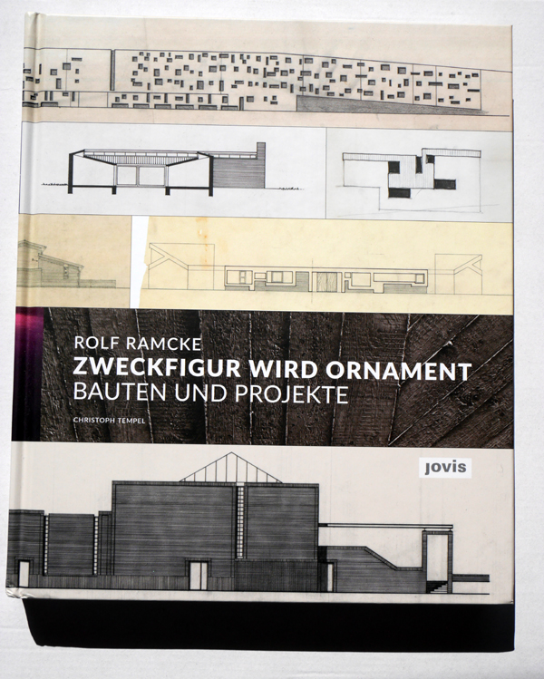

Der Bibliotheksbau ist sowohl für das Bibliothekswesen als auch die
Stadtgestaltung ein naturgemäß zentrales und idealerweise unübersehbares
Thema. Zahlreiche Bibliotheksneubauten der jüngeren Zeit stützen diese
Annahme. Für LIBREAS ist es nicht zuletzt deshalb ein besonderes Feld,
weil es die erste Ausgabe^[<http://libreas.eu/ausgabe1/inhalt.htm>] prägte.
Jahre in Berlin durch drei große neue Universitätsbibliotheksneubauten
geprägt wurde: Das "Brain" der Freien Universität, die
Volkswagen-Lesefabrik der Technischen Universität und schließlich das
Grimmzentrum der Humboldt-Universität. Dazu gesellte sich wenig später
das Spektakel des neuen Lesesaals in der Dauerbaustelle der
Staatsbibliothek Unter den Linden.

Mittlerweile hat das Baufieber der Hauptstadt freilich den Bereich der
Bibliotheken wieder verlassen. Zugleich, so scheint es, entschwand das
Thema fast parallel auch der lokalen Bibliothekswissenschaft. Jemand,
der dennoch lange durchhielt und noch immer durchhält, ist der Architekt
Rolf Ramcke, der, so der Eindruck, für viele Studierende des IBI die
charismatischste Figur war, die sie während ihrer Studienzeit als
Lehrkraft erleben durften und dürfen, was sich nicht zuletzt daran
zeigt, dass seine Kurse durchaus von Gasthörerinnen und Gasthörern
besucht werden. Folgerichtig enthält die aufwendige und sehr schöne, nun
im Jovis Verlag erschienene Monografie zu Werk und Wirken Rolf Ramckes
einen umfangreichen Abschnitt zu Lehre und Veröffentlichungen, den die
Literaturwissenschaftlerin (und Bibliotheksleiterin) Katja Stopka mit
einem sehr persönlichen Text einleitet und in dem sie zugleich die
Essenz des Lehrverständnisses von Rolf Ramcke benennt:

> "Mir war die Bibliothekswissenschaft plötzlich zu einem der
> aufregendsten Fächer geworden, da mir schien, dass sich nirgends
> anders als in der Baugeschichte von Bibliotheken die europäische
> Kultur- und Wissensgeschichte greifbarer und plastischer machen
> ließe." (S. 357)

Die gebaute Bibliothek als Schlüssel zum Verständnis von Kultur und
Wissensgeschichte und die Bibliothekswissenschaft in gewisser Form als
Hermeneutik dieser Raum gewordenen Textpraxis – allein das wäre ein
grandioses Forschungsprogramm, welches allerdings heute eher in der
Kulturgeschichte beheimatet ist. Das ist durchaus bedauerlich, wenn man
sinnvollerweise davon ausgeht, dass dieser Ansatz eine feste
Traditionslinie bis in die Gegenwart spannen und heutige Entscheidungen
zu Gestaltung von Kultur- und Wissensräumen, ergo Bibliotheken, prägen
könnte beziehungsweise sollte. Die Digitale Gegenwart und damit auch die
Digitalen Bibliotheken werden nicht selten als zutiefst disruptiv
bezeichnet, meist ohne tiefere Begründung dieser Zuschreibung, und der
reale Raum nicht selten als obsolet, was sich auch für Bibliotheken
längst als Kurzschlussannahme erwies. Auf eher kürzere als lange Sicht
könnte sich der ahistorische Oberflächen-Solutionismus der
Digitalwirtschaft und ihren Fans, dem vor 10 bis 15 Jahren die
Bibliothek 2.0 und ähnliche Entwicklungen meist völlig kritikfrei
huldigten, als Sackgasse erweisen.

Dass Bibliotheken heute nach wie vor in Beton gegossen werden, zeigt
immerhin, dass die Bibliothek als Ort bisher keinesfalls ein
Auslaufmodell ist. Und wo solche Orte entstehen, bleiben die drei
Schlüsselanforderungen des Gestaltungsverständnisses, das Rolf Ramcke
1981 in der ZfBB formulierte und das im vorliegenden Band abgedruckt
wurde, frisch: Die Bibliothek muss, erstens, nutzbar sein, also dem
Leser als strukturierter und navigierbarer Raum mit klaren Leitmerkmalen
differenziert entgegen treten. Zweitens ist die Aufgabe der Bibliothek
die Anregung. "Information ist auf Stimulanz angewiesen", weiß Rolf
Ramcke zu berichten und Ideen wie die der Diskursökonomie unterstreichen
dies nicht nur für die allgemeine Literaturvemittlung. Und schließlich
gilt, drittens, "Ein Bibliotheksgebäude sollte ermöglichen, daß der
Benutzer sich in ihm zuhause fühlt." Dieser Dreistufentest – Kann ich
mich orientieren?, Bekomme ich Lust, zu lesen (beziehungsweise zu
rezipieren)? und Fühle ich mich wohl in diesem Raum? – sind die denkbar
handlichste Grundlage einer individuellen Architekturkritik des
Bibliotheksraumes und nicht nur sehr alltagstauglich sondern auch
immunisierend gegenüber eventuellen Selbstdarstellungs- und
Autoritätsgesten, die Architekten noch häufiger als Architektinnen sehr
gern einem öffentliche Gebäude einschreiben.

Die beiden realisierten Bibliotheksentwürfe des Architekten müsse sich
daran natürlich ebenfalls entsprechend messen lassen, wenngleich die
Einschätzungen auf halber Strecke zwischen den im Band ausführlich
vorgestellten Bauten der Erweiterung der Stadtbibliothek Hannover aus
dem Jahr 1974 und der Zentralbibliothek der Fachhochschule Dieburg aus
dem Jahr 1994 formuliert wurde. Anhand der Darstellung im Band scheint
der Anspruch erwartungsgemäß im zweiten Fall besser realisiert zu sein
als im ersten. Genaueres könnte freilich erst nach einer vergleichenden
Begehung feststellen, wofür leider nicht die Gelegenheit gegeben ist.

Beide Bauten kennzeichnet in jedem Fall und besonders, wie Christoph
Tempel in seiner Beschreibung herausstellt, ein Bewusstsein für die
Rolle des natürlichen Lichts für die Bibliotheksnutzung. In Hannover lag
ein weiterer Schwerpunkt auf dem Farbkonzept, das mittlerweile dadurch
Schaden nahm, dass „der farbige Teppichboden entfernt und durch einen
grauen Nadelfilz ersetzt wurde“. (S. 143) Die Bibliothek der FH Dieburg
greift den Gedanken einer in den Raum hineinwirkenden Außenwelt noch
stärker auf: „Im Tageslauf der Sonne durchwandert von den Fensterbändern
her ein lebendig differenziertes Licht den Raum, was ermüdungsfreies
Arbeiten erleichtert und neben der zweckvollen Gestaltung und den
übersichtlich angeordneten Beständen den Hauptanreiz bietet, die
Bibliothek als Arbeitsort zu nutzen.“ (S.157)

Das grundlegende und sehr elaborarierte Architekturverständnis von Rolf
Ramcke, das sich sowohl im Titel der Monografie – Zweckform wird
Ornament – auf die kürzest mögliche Form kondensiert und sehr
detailliert in einem im Band enthaltenen Gespräch dargestellt findet,
prägt deutlich und sehr konsistent alle dargestellten Entwürfe und
Bauten bis hin zum nur vermeintlich unscheinbaren Wetterhäuschen im
Tiergarten von Hannover und sogar in der Mauerwerksgestaltung für den
Sand- und Fettfang des Klärwerks Herrenhausen. Christoph Tempels
umfangreiche Werkschau und Materialsammlung dürfte das definitive Werk
zum Schaffen Rolf Ramckes sein.

Darüber, warum dieser sich in seiner theoretischen Arbeit ausgerechnet
in die Nische des Bibliotheksbaus orientierte, kann man angesichts der
Vielfalt seiner Bauten allerdings nur mutmaßen. Sicher spielt der obens
zitierte Blick auf die kultur- und wissensgeschichtliche Dimension der
Bibliothek als Ort eine maßgebliche Rolle. Wer Rolf Ramcke kennt, weiß,
dass er sich weniger dem engeren Kreis der Architekten hingezogen fühlt,
sondern nicht wenige Spuren dessen zeigt, was man früher als Polyhistor
(oder im Englischen Renaissance Man) bezeichnet hätte. Die Bibliothek
ist daher vielleicht die einzige Bauform, die alle für ihn
kulturgeschichtlich interessanten Anschlüsse ermöglicht. Unabhängig
davon, ob es sich wirklich so verhält, war die Entscheidung Rolf
Ramckes, im Wintersemester 1975/76 einen Kurs zum Thema Bau und
Einrichtung von Bibliotheken für die Studierenden im Institut für
Bibliothekarsausbildung der Freien Universität Berlin zu geben und diese
Linie bis heute fortzusetzen, eine Glücksfall für die deutsche
Bibliothekswissenschaft und mehr noch für eine sehr große Zahl von
Absolventinnen und Absolventen dieser Disziplin. Wenig überraschend
unterstreicht die vorliegende Monografie diesen Eindruck sehr deutlich.
