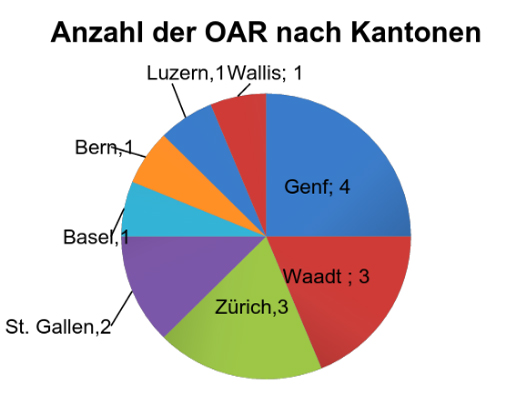
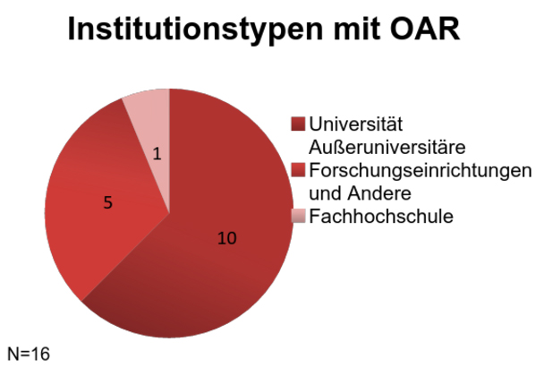
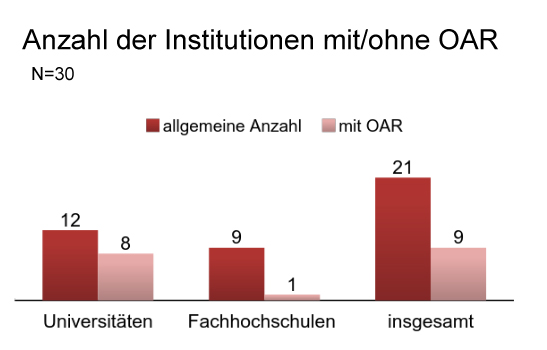
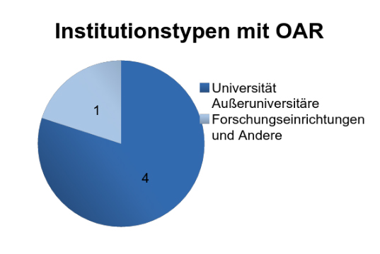
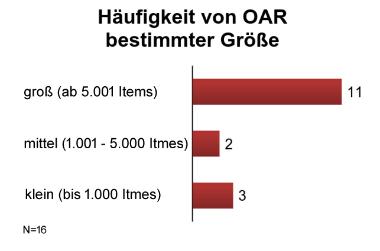
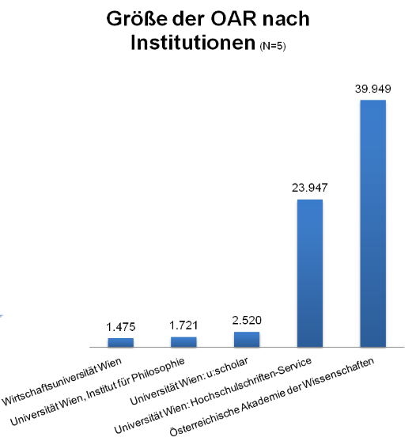
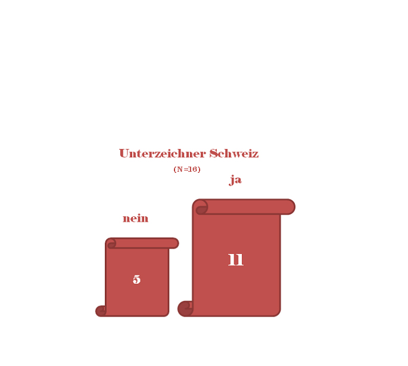
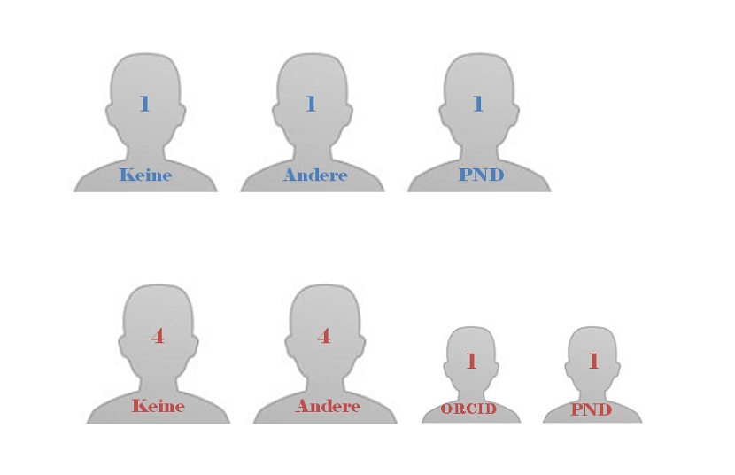
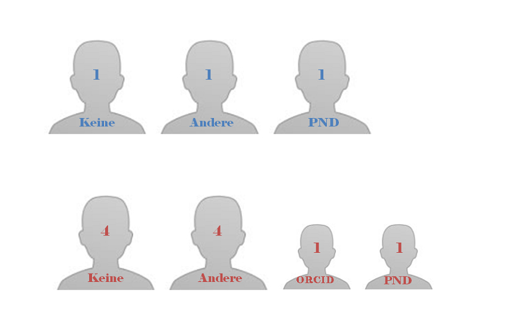
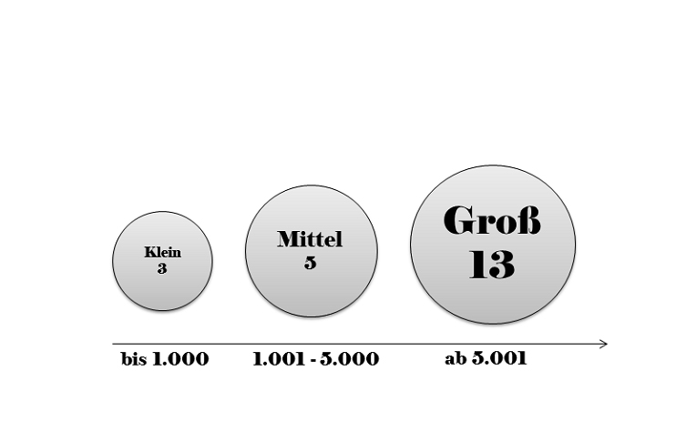

**Vorbemerkung der Redaktion:
Dieser Beitrag basiert auf der Nachnutzung von veröffentlichten
Forschungsdaten durch Studierende in einem Hauptseminar im Sommer 2015
am IBI der HU Berlin. Der Artikel ist exemplarisch für eine
Beitragsform, von der die LIBREAS-Redaktion perspektivisch gerne viel
mehr integrieren würde, um den bibliotheks- und
informationswissenschaftlichen Nachwuchs an das Publizieren
heranzuführen. Wir bitten die AutorIn und die LeserInnen an dieser
Stelle um Nachsicht, dass die Publikation des Beitrags erst in dieser
auf die Jubiläumsausgabe in 2015 folgenden LIBREAS-Ausgabe möglich war
und das verwendete Datenmaterial aus 2014 somit bereits zwei Jahre alt
ist. Weitere Analysen des Zahlenmaterials und ergänzende Erhebungen sind
ausdrücklich erwünscht.**

### 1 Einführung

Dieser Artikel wertet den "2014 Census on Open Access Repositories in
Germany, Austria and Switzerland" (2014 Census) auf Ergebnisse
hinsichtlich der Alpenländer Österreich und Schweiz aus. Er orientiert
sich dabei an dem von Maxi Kindling und Paul Vierkant[^1]
veröffentlichten Artikel über die deutschen Open-Access-Repositorien
(OAR), dem Open Access Repository Ranking (OARR)[^2] von 2014[^3]. Eine
Hausarbeit, die im Frühjahr 2015 für ein Seminar bei Ulla Wimmer am
Institut für Bibliotheks- und Informationswissenschaft der
Humboldt-Universität zu Berlin entstand, bildet die Grundlage des
Textes.

Der 2014 Census wurde im Zuge eines Projektseminars am Institut für
Bibliotheks- und Informationswissenschaft der Humboldt-Universität zu
Berlin erstellt, um einen Überblick über die Landschaft der
Open-Access-Repositorien (OAR) in deutschsprachigen Ländern zu
erhalten.[^4] Er "\[...\] basiert auf einer qualitativen Inhaltsanalyse
der Webseiten der Repositorien, einer automatisierten Validierung der
über das OAI-PMH ausgelieferten Metadaten sowie einer Umfrage unter
Repositorienbetreibern"[^5].

Für die Auswahl der zu untersuchenden OAR wurde für den Census die
nachfolgende Definition verwendet:

> "Open-Access-Repositorien sind für den Zweck dieser Studie
> institutionelle und disziplinäre Repositorien aus Deutschland,
> Österreich und der Schweiz, die mehrheitlich wissenschaftliche
> Open-Access-Volltextveröffentlichungen vorhalten. Die
> Volltextveröffentlichungen sind durch Metadaten beschrieben, die über
> eine Weboberfläche (Such- und Browsefunktionalität) recherchierbar
> sind. Die Open-Access-Repositorien sind mit einer funktionierenden
> Base-URL für das OAI-PMH Harvesting bei Bielefeld Academic Search
> Engine (BASE) registriert. Digitale Sammlungen,
> Forschungsdatenrepositorien, sowie Open-Access-Repositorien von
> Verlagen, University Presses und kommerzielle Dienste sind
> ausgeschlossen."[^6]

Der Betrachtungsgegenstand setzt sich demzufolge aus den in BASE
registrierten OAR der beiden Länder zusammen, die von Universitäten,
Fachhochschulen und außeruniversitären Institutionen unterhalten werden.
Welche dazu gehören, wurde durch die Typisierungslisten der BMWF (heute
BMWFW) für Österreich und CRUS (heute swissuniversities) für die Schweiz
auf Grundlage der Zahlen von 2014 ermittelt.[^7] Zum
Untersuchungszeitraum zählte die Studie 16 solcher Repositorien in der
Schweiz und fünf in Österreich. Laut der OpenDOAR-Liste der Länder
besitzt die Schweiz 2016 17 und Österreich 22 OAR.[^8] Dies kann darauf
zurückzuführen sein, dass einige in OpenDOAR gelistete Repositorien
entsprechend der Definition für OAR dieser Studie nicht berücksichtigt
wurden oder 2014 noch nicht existierten.

Da für Österreich und die Schweiz eine überschaubare Menge an OAR
vorzufinden sind, ist eine Aufteilung in Bundesländer bzw. Kantone, wie
es in der Auswertung für Deutschland geschehen ist, nicht überall
notwendig. Zudem finden sich in beiden Ländern nur institutionelle
Repositorien. Eine Differenzierung in disziplinäre und institutionelle
erfolgt demzufolge nicht.

### 2 Standorte

#### 2.1 Schweiz

Um zu Beginn einen Überblick über die Repositorien in der Schweiz zu
erhalten, wird zunächst betrachtet, wo sich diese befinden.

Die Schweiz hat 26 Kantone, für acht davon, d.h. weniger als ein
Drittel, sind OAR erfasst. Jedoch muss beachtet werden, dass in elf
Kantonen keine den Kriterien des Census entsprechende Hochschule
existiert, die ein Repositorium betreiben könnte.

Abbildung 1 zeigt, dass Genf mit vier OAR auf Kantonebene Vorreiter ist.
Eine Ursache dafür ist die renommierte Forschungseinrichtung der Physik,
die Europäische Organisation für Kernforschung (CERN), die dort ihren
Sitz hat und mit zwei OAR im Census 2014 vertreten ist. Auch in Waadt,
einer der beiden Kantone mit den zweitmeisten OAR, befinden sich an der
Ecole Polytechnique Fédérale de Lausanne zwei Repositorien.

Die Schweizer Kantone sind wie bereits erwähnt nicht gleichmäßig mit
Hochschulen ausgestattet, was zur Folge hat, dass nicht überall
akademische Repositorien angesiedelt sein können. Insgesamt verfügt die
Schweiz über 12 anerkannte universitäre Hochschulen und neun
Fachhochschulen. Die Fachhochschulen sind aus einem Verbund von
regionalen Hochschulen zusammengesetzt, die sich an verschiedenen
Standorten über die Kantone verteilt befinden und theoretisch, wie die
Hochschule für Technik Rapperswil, je ein eigenes Repositorium betreiben
könnten.

Mit 14 Hochschulen (zwei universitären Einrichtungen und zwölf
Fachhochschulen), besitzt der französischsprachige Kanton Waadt die
meisten. Darauf folgen das Tessin, Basel-Stadt, Genf und Luzern. Genf,
der Kanton mit den meisten Repositorien, unterhält sieben nicht
universitäre Hochschulen und eine Universität, während Zürich zwei
universitäre Hochschulen und drei Fachhochschulen aufweist und dabei
drei Repositorien unterhält, die alle drei an den universitären
Hochschulen angesiedelt sind.

Keine den Census-Kriterien entsprechenden Hochschulen und ebenfalls
keine Repositorien weisen die zehn Kantone Uri, Schwyz, Zug, Obwalden,
Nidwalden, Glarus, Appenzell-Ausserr- und Innerrhoden, Schaffhausen und
Thurgau auf. Der einzige italienischsprachige Kanton in der Schweiz, das
Tessin, besitzt zwar eine Universität, die USI Università della Svizzera
italiana und sechs Fachhochschulen, betreibt aber kein OAR.[^9]

#### 2.2 Österreich

Im Census 2014 sind fünf österreichische Repositorien gelistet. Diese
befinden sich ausschließlich in der Hauptstadt Wien, die gleichzeitig
eines der neun Bundesländer darstellt.

Im bei der Datenanalyse vergleichend herangezogenen OARR 2015 sind mit
Tirol und der Steiermark mit je einem OAR auch weitere Bundesländer
Österreichs vertreten.

### 3 Institutionstypen

#### 3.1 Schweiz

Das Feld der Institutionstypen teilt sich in der Studie auf
Universitäten, Fachhochschulen und außeruniversitäre
Forschungseinrichtungen auf. Abbildung 2 veranschaulicht, dass in der
Schweiz jeder dieser Typen als OAR-besitzende Institution vorkommt.
Dabei nehmen die Universitäten mit zehn von 16 Repositorien eine
deutliche Führungsrolle ein, während es mit der HSR Hochschule für
Technik Rapperswil nur eine einzige Fachhochschule gibt, die ein OAR
unterhält.[^10] Wie groß ist nun der Anteil der Institutionen, die in
der Schweiz überhaupt ein OAR betreiben? In dieser Auswertung werden
keine außeruniversitären Forschungseinrichtungen aufgeführt, da zur
Gesamtzahl solcher Einrichtungen in der Schweiz keine Daten ermittelt
werden konnten.

Laut CRUS (dem Vorgänger des gemeinsamen hochschulpolitischen Organs der
Schweiz "swissuniversities") gab es 2014 21 Universitäten und
Fachhochschulen bzw. Fachhochschulverbünde in der Schweiz. Von diesen
besitzen neun ein OAR. Acht der zwölf Universitäten und nur eine der
insgesamt neun Fachhochschulverbünde haben ein Repositorium. An zwei
Universitäten werden jeweils zwei OAR betrieben, weswegen sich die
Anzahl der Universitäten mit Repositorium von zehn auf acht reduziert.
Abbildung 3 zeigt, dass nicht ganz die Hälfte aller
Hochschuleinrichtungen ein OAR betreiben, jedoch nur vier Schweizer
Universitäten kein Repositorium haben.

#### 3.2 Österreich

Wie in Abbildung 4 zu erkennen, betreiben in Österreich hauptsächlich
Universitäten OAR. Einzig die Österreichische Akademie der
Wissenschaften ist als nicht-universitäre Institution im Census
2014verzeichnet.

Wie groß ist die Anzahl der Institutionen, die in Österreich überhaupt
ein OAR betreiben?

Laut dem BMWF hatte Österreich 2014 22 Universitäten.[^11] Von diesen
sind im Census 2014 vier vertreten. Keine der 21 Fachhochschulen
betreibt ein OAR. Das bedeutet, dass insgesamt nur vier von 43
Hochschulen ein für den Census 2014 relevantes Repositorium betreiben.
Diese sehr geringe Anzahl überrascht. Es lässt sich jedoch festhalten,
dass es durchaus mehr Repositorien geben könnte, die nur durch die
Census-spezifische Definition nicht erfasst wurden.

### 4 Größe der OAR

Als Größe eines OAR wird die Anzahl der über die OAI-Schnittstelle
ausgelieferten Items in einem Repositorium definiert. Der Census 2014
kategorisiert Repositorien folgendermaßen nach ihrem Umfang: Kleine
Repositorien halten ein bis 1.000 Items vor, mittelgroße 1.001 bis 5.000
Items und als groß werden OAR bezeichnet, die 5.001 oder mehr Items
besitzen.[^12]

Die Mehrheit der Schweizer Repositorien sind groß. Kleine und mittlere
Repositorien gibt es zusammengenommen nur fünf.

In Österreich gibt es kein der Kategorisierung zufolge als klein
einzustufendes OAR. Es gibt drei mittelgroße und zwei große
Repositorien.

#### Größe der OAR nach Institutionstyp – Schweiz

Insgesamt besitzen die OAR in der Schweiz 1.190.965 Items. Die meisten,
und zwar 706.526, verteilen sich auf Universitäts-OAR, während nur ein
Fachhochschul-OAR mit lediglich 314 Objekten in St.Gallen vorhanden ist.
Die außeruniversitären Forschungseinrichtungen hingegen halten mit
484.125 Items eine weitere große Menge vor. Sie haben einen hohen Anteil
an den gesamten Items in den Repositorien der Schweiz, obwohl es gerade
einmal fünf ihres Typs gibt. Der außeruniversitäre *CERN Document
Server* ist mit 455.394 Items das größte OAR der Schweiz.

Insgesamt werden in den Repositorien Österreichs 69.612 Items zur
Verfügung gestellt. Das größte Repositorium Österreichs wird von der
Österreichischen Akademie der Wissenschaften betrieben. Dort befinden
sich mehr als die Hälfte aller Items. Darauf folgen die drei OAR der
Universität Wien, wobei der Hochschulschriften-Service mit 23.947 Items
das größte ist. Das kleinste OAR ist das der Wirtschaftsuniversität
Wien, welches nur 2% der Gesamt-Items ausmacht.

#### Wachstum der OAR

Anhand der im Zeitraum vom 6. Januar 2013 bis zum 6. Januar 2014 zu den
einzelnen OAR hinzugefügten Items, lassen sich das prozentuale Wachstum
der verschiedenen Repositorien für diesen Zeitraum ermitteln.

Das stärkste Wachstum verzeichnet laut Tabelle 1 der *CERN Document
Server* mit 381,98%. Das sehr viel kleinere *OpenAIRE Orphan Record
Repository* vergrößerte seine Item-Anzahl im Verhältnis am zweitmeisten
und konnte um rund 101% wachsen. Auch dieses Repositorium wird am CERN
betrieben.

---------------------------------------------------------------------
OAR                        Anzahl       Anzahl   Absoluter    Zuwachs
(N=16)                      Items        Items     Zuwachs        von
                       06.01.2013   06.01.2014         von      Items
                                                     Items         im
                                                        im   Zeitraum
                                                  Zeitraum    2013/14
                                                   2013/14         in
                                                              Prozent
-------------------- ------------ ------------ ----------- ----------
CERN                        94484       455394      360910    381,98%
Document                                                             
Server                                                               
(CDS)                                                                

OpenAIRE                      229          460         231    100,87%
Orphan                                                               
Record                                                               
Repository                                                           
(Open                                                                
Access                                                               
Infrastructure                                                       
Research                                                             
for                                                                  
Europe)                                                              

Universität                 19569        30153       10584     54,09%
Basel:                                                               
Dokumentenserver                                                     
edoc                                                                 

University                  48595        62075       13480     27,74%
of                                                                   
Zurich:                                                              
ZORA                                                                 
(Zurich                                                              
Open                                                                 
Repository                                                           
and                                                                  
Archive)                                                             

Zentral-                     1032         1318         286     27,71%
und                                                                  
Hochschulbibliothek                                                  
Luzern:                                                              
zhb-dokumentenserver                                                 

réro                        20432        25584        5152     25,22%
doc                                                                  
Digitale                                                             
Bibliothek                                                           
(Westschweizer                                                       
Bibliotheksverbund                                                   
/                                                                    
Réseau                                                               
des                                                                  
bibliothèques                                                        
de                                                                   
Suisse                                                               
occidentale)                                                         

Université                  24219        30112        5893     24,33%
de                                                                   
Genève:                                                              
Archive                                                              
ouverte                                                              
UNIGE                                                                

Université                  28711        35685        6974     24,29%
de                                                                   
Lausanne                                                             
(UNIL):                                                              
Serval

Ecole                          22           27           5     22,73%
Polytechnique                                                        
Fédérale                                                             
de                                                                   
Lausanne                                                             
(EPFL):                                                              
Reproducible                                                         
Research                                                             
Repository                                                           

Medecins                     1156         1369         213     18,43%
Sans                                                                 
Frontieres:                                                          
MSF                                                                  
Field                                                                
Research                                                             

Universität                 34155        38637        4482     13,12%
St.                                                                  
Gallen:                                                              
Forschungsplattform                                                  
Alexandria                                                           

SEALS:                     292200       327576       35376     12,11%
Digitalisierte                                                       
Zeitschriften                                                        
(Schweiz)                                                            

ETH                         26484        27834        1350      5,10%
Zürich                                                               
(Eidgenössische                                                      
Technische                                                           
Hochschule):                                                         
ETH                                                                  
E-Collection                                                         

Ecole                       keine       115465      115465      n .a.
Polytechnique              Angabe                                    
Fédérale                                                             
Lausanne:                                                            
Infoscience                                                          

Hochschule                  keine          314         314      n .a.
für                        Angabe                                    
Technik                                                              
Rapperswil:                                                          
HSR -                                                                
Institutional                                                        
Repository                                                           

Universität                  2013        38962       38962      n .a.
Bern:                   gegründet                                    
BORIS                                                                
Bern                                                                 
Open                                                                 
Repository                                                           
and                                                                  
Information                                                          
System                                                               
---------------------------------------------------------------------

Table: Schweiz - Wachstum der OAR

In Österreich kann das zweitgrößte OAR das höchste Wachstum vorweisen.
Von 2013 auf 2014 konnte sich der Bestand des
*Hochschulschriften-Service* der Wiener Universität um 41,56%
vergrößern. Das größte österreichische Repositorium der Akademie der
Wissenschaften hingegen verzeichnet mit 1,94% das geringste Wachstum.
(Tab. 2)

--------------------------------------------------------------------------
OAR                             Anzahl       Anzahl   Absoluter    Zuwachs
(N=5)                            Items        Items     Zuwachs        von
                             06.1.2013   06.01.2014         von      Items
                                                          Items         im
                                                             im   Zeitraum
                                                       Zeitraum    2013/14
                                                        2013/14         in
                                                                   Prozent
-------------------------- ----------- ------------ ----------- ----------
Universität                      16917        23947        7030     41,56%
Wien:                                                                     
Hochschulschriften-Service                                                

Wirtschaftsuniversität            1334         1475         141     10,57%
Wien:                                                                     
ePubWU                                                                    

Universität                       1572         1721         149      9,48%
Wien,                                                                     
Institut                                                                  
für                                                                       
Philosophie:                                                              
Sammelpunkt.                                                              
Elektronisch                                                              
archivierte                                                               
Theorie                                                                   

Universität                       2361         2520         159      6,73%
Wien:                                                                     
u:scholar                                                                 

Österreichische                  39188        39949         761      1,94%
Akademie                                                                  
der                                                                       
Wissenschaften:                                                           
epub.oeaw                                                                 
--------------------------------------------------------------------------

Table: Österreich - Wachstum der OAR

### 5 Nutzung von OAR-Software

#### 5.1 Schweiz

Die internationale OAR-Software EPrints ist in der Schweiz besonders
weit verbreitet, gefolgt von Invenio, das unter anderem vom CERN genutzt
wird. Außerdem genutzt werden DSpace, FEDORA, FezWiki (ebenfalls von
FEDORA) und JAHIA jeweils einmal und drei Repositorien nutzen andere,
nicht näher genannte Software-Lösungen.

Aufgespalten in die verschiedenen Institutionstypen lässt sich erkennen,
dass vor allem Universitäten EPrints nutzen. Auch die einzige
Fachhochschule nutzt diese Software, während die außeruniversitären
Forschungseinrichtungen hauptsächlich auf Invenio setzen.

#### 5.2 Österreich

In Österreich wird ebenfalls auf EPrints gesetzt. Drei von fünf
Instanzen nutzen diese Lösung, während nur einmal Phaidra und einmal
eine unter "Andere" erfasste Software Verwendung findet. Phaidra ist
eine eigens von der Universität Wien für ihre OAR entwickelte
Software-Lösung. Das in Deutschland weit verbreitete deutschsprachige
OPUS nutzt keines der untersuchten Repositorien in beiden Ländern.

### 6 Metadatenqualität

Die Metadatenqualität der OAR wird anhand des DINI-Validators evaluiert.
Der DINI-Validator-Score "ist ein Maßstab für die Metadatenstandard- und
Schnittstellenkonformität eines OAR mit dem DINI-Zertifikat 2010"[^13],
bei dem Punkte in einem Bereich von null bis 100 vergeben werden können.
Er stellt "ein Hilfsmittel zur Überprüfung und Steigerung der
tatsächlichen Metadatenqualität eines Repositories"[^14] dar.[^15]

Es ist hervorzuheben, dass keines der Schweizer und österreichischen
Repositorien ein DINI-Zertifikat besitzt. Die Zertifikate wurden bis
jetzt nur in Deutschland vergeben, weswegen in Betracht zu ziehen ist,
dass die Betreiber der nicht-deutschen OAR nicht zwingend bewusst nach
den Anforderungen des Zertifikats streben und sich entsprechend an den
DINI-Kriterien orientieren. Trotzdem, oder gerade deswegen, spricht eine
hohe Konformität mit dem DINI-Zertifikat 2010 für die Metadatenqualität
eines OAR.

Den höchsten DINI-Validator-Score in der Schweiz erreichte mit 77,18
Punkten das OAR der Universität in Zürich, dicht gefolgt vom *BORIS* der
Universität Bern, das einen Score von 76,52 vorweisen kann. Die
Ergebnisse der anderen OAR liegen im Bereich der niedrigen bis mittleren
Punktezahlen.

Keines der österreichischen OAR konnte einen hohen DINI-Validator-Score
erreichen. Der höchste Wert im Feld beträgt 72,7 beim *u:scolar*
Repositorium der Universität Wien. Die Wirtschaftsuniversität Wien
erzielte den zweithöchsten Score mit 70,5.

Zum Vergleich: In Deutschland konnten drei OAR der DINI-zertifizierten
Repositorien die Höchstpunktzahl erreichen und der Durchschnitt liegt
bei 77,5.

### 7 Berliner Erklärung

Die "Berliner Erklärung über den offenen Zugang zu wissenschaftlichem
Wissen" manifestierte den Willen das Open-Access-Publizieren zum Nutzen
der Wissenschaft zu verbreiten und wurde seit der Veröffentlichung in
2003 von zahlreichen internationalen Institutionen unterzeichnet. In
Deutschland löste sie eine
OAR-Gründungswelle aus.[^16] Heute, über ein
Jahrzehnt später, gilt es einen Blick darauf zu werfen, wie sich die
Situation in der Schweiz und Österreich entwickelt hat.

In der Schweiz unterzeichneten die wichtigsten
Wissenschaftsorganisationen 2006 die Erklärung.[^17] Zehn Jahre später
sind es 21 Schweizer Unterzeichner.[^18] Laut dem Census gehörten 2014
elf von 16 im Zensus vertretenen Institutionen oder Schirmorganisationen
zu den Signatoren.

Es gibt mit der *ETH E-Collection* der ETH Zürich nur ein Repositorium
(von dem eine Angabe zum "Launch Date" verfügbar war), das vor der
Berliner Erklärung online ging. Alle anderen OAR entstanden danach. Um
von einer direkten Folge sprechen zu können, gibt es nicht genügend
Anhaltspunkte, aber es ist durchaus möglich, dass die
Open-Access-Aktivitäten nach der Veröffentlichung der Berliner Erklärung
einige Institutionen zur Gründung eines OAR bewegen konnten.

In Österreich unterzeichneten drei von fünf OAR die Berliner Erklärung.
Dies entspricht einer Mehrheit, jedoch bedeutet es auch, dass zwei
Institutionen noch nicht unterzeichnet haben. Insgesamt haben laut der
Signatorenliste der Max-Planck-Gesellschaft mittlerweile neun
österreichische Institutionen die Berliner Erklärung
unterschrieben.[^19]

### 8 Fakten aus der Online-Umfrage

#### 8.1 Schweiz

Die folgenden Auswertungen basieren auf der Online-Umfrage, die Teil des
Census war und weitere Daten über die OAR liefert. Da die Umfrage nicht
von allen Repositorien beantwortet wurde, zeigt sie nur einen Ausschnitt
des Gesamtbildes.

Neun von 16 Schweizer Repositorien beantworten die Umfrage. Davon sind
acht OAR an Universitäten und nur der zhb-dokumentenserver der Zentral-
und Hochschulbibliothek Luzern ist als Repositorium einer
außeruniversitären Forschungseinrichtung vertreten.

Bei allen Fragen wurde zwar ein freies Feld für zusätzliche "andere"
Antworten zur Verfügung gestellt, jedoch kann dieses aufgrund der in ihm
enthaltenen vertraulichen Information nicht veröffentlicht werden.

***Persistent-Identifier-Systeme ***

In der Umfrage wurde nach dem Einsatz von Persistent-Identifier-Systemen
(PI-Systeme) für die Vergabe von eindeutigen und dauerhaften
Identifikatoren für Open-Access-Volltexte gefragt.[^20] In der Schweiz
nutzen zwei OAR kein PI-System, während sieben eines verwenden. Mit fünf
Verwendungen ist das Digital-Object-Identifier-System (DOI) am
häufigsten. URNs werden in zwei Repositorien genutzt, wobei der
Dokumentenserver der Universität Basel DOIs und URNs gleichzeitig nutzt.
In Deutschland verhält es sich umgekehrt. Mit 83%[^21] ist der URN in
Deutschland bei weitem am meisten verbreitet, während DOI von 14% der
OAR verwendet wird.

Die ebenfalls zur Auswahl stehenden Systeme Handle und PURL wurden in
der Schweiz im Fall von Handle gar nicht und im Fall von PURL einmal im
OAR *Infoscience* der Ecole Polytechnique Fédérale Lausanne verwendet.
In Deutschland haben diese beiden Systeme mit vier (Handle) und sechs
(PURL) Prozent Verwendung ebenfalls geringere Bedeutung.

***Dateiformate zur Langzeitarchivierung ***

Weiterhin wurde nach dem Dateiformat für die Langzeitarchivierung der
Dokumente gefragt. Zur
Auswahl standen PDF/A und XML sowie "keine" oder "andere" Formate. Nur
vier OAR machten dahingehende Angaben. Fünf OAR mehr als die Hälfte
keine Angaben zu speziellen Formaten machen. Bei den anderen vier OAR
ist das PDF/A-Format ähnlich wie in Deutschland mit 47% am meisten
verbreitet und wird durch drei der vier Repositorien verwendet. Zwei OAR
nutzen mehrere Formate. Das *Archive ouverte UNIGE* der Universität in
Genf nutzt sowohl PDF/A als auch XML und das OAR für Digitalisierte
Zeitschriften SEALS nutzt XML sowie ein nicht näher spezifiziertes
"anderes" Format.

***Autorenidentifikatoren***

Vier OAR nutzen keinerlei Autorenidentifikatoren für die Beschreibung
von Open-Access-Volltexten. ORCID und die Personen Normdatei (PND)
werden jeweils einmal verwendet. Alle weiteren OAR nutzen meist interne
Identifikatoren, die in der nicht näher spezifizierten Kategorie
"Andere" zusammengefasst wurden. In Deutschland nutzt eine Mehrheit
keine IDs und 10% ebenfalls "andere" Identifikatoren, was darauf
hindeutet, dass sich bislang sowohl in der Schweiz als auch in
Deutschland kein System für Autorenidentifikatoren durchsetzen konnte.
Weitere 10% nutzen in Deutschland die PND, die in der Schweiz nur von
einem Repositorium verwendet wird.

#### 8.2 Österreich

Im Falle der OAR Österreichs ist die geringe Teilnahme an der
Online-Umfrage besonders gravierend, da insgesamt nur fünf Repositorien
verzeichnet sind und davon wiederum nur drei den Fragebogen ausgefüllt
haben und im Folgenden berücksichtigt werden können. Dies ist zwar eine
Mehrheit, aber trotzdem eine sehr geringe Menge. Der Vollständigkeit
halber wurden die Analysen dennoch durchgeführt.

Unter den teilnehmenden OAR befinden sich die Repositorien der
Universität Wien, der Wirtschaftsuniversität Wien sowie der
außeruniversitären Forschungseinrichtung Österreichische Akademie der
Wissenschaften.

***Persistent-Identifier-Systeme***

Alle drei OAR nutzen PI-Systeme. Es wird jedoch eventuell ein
Unterschied zwischen Universitäten und außeruniversitären
Forschungseinrichtung sichtbar. Die Universitäten nutzen "andere", nicht
namentlich gelistete PI-Systeme, während die außeruniversitäre
Forschungseinrichtung DOIs benennt.

***Dateiformate zur Langzeitarchivierung ***

Alle drei Repositorien nutzen Dateiformate zur Langzeitarchivierung,
wobei PDF/A, XML und "andere" gleichermaßen genutzt werden.

***Autorenidentifikatoren***

Das Repositorium der Wirtschaftsuniversität Wien
nutzt keinerlei Autorenidentifikatoren. Die anderen beiden OAR verwenden
entweder die PND oder "andere". Alle weiteren Identifikatoren finden in
den befragten Repositorien keine Verwendung.

#### 9 Vergleich mit dem Open Access Repository Ranking 2015**

Schon 2014 wurde ausgehend von den Daten des Census 2014 das Open Access
Repository Ranking erstellt und im Jahr 2015 auf Basis
weiterentwickelter Kriterien und aktualisierter Daten
veröffentlicht.[^22]

Anhand des aktuellen Rankings 2015 stellte sich die Situation im
Vergleich zu 2014 nur leicht verändert dar. Mittlerweile sind sieben
österreichische und 14 Schweizer Repositorien im Ranking vertreten, die
auch den Bedingungen des Census entsprechen würden. In Österreich kamen
mit *Unipub* der Universität Graz und der *Digitalen Bibliothek* der
Universität Innsbruck zwei neue OAR hinzu, die auch außerhalb des
Bundeslandes Wien angesiedelt sind. In der Schweiz wiederum fehlten 2015
drei Repositorien, die 2014 noch im Census auftraten, während ein Neues
hinzu kam. Nicht mehr im Ranking sind das *Reproducible Research
Repository* der Ecole Polytechnique Fédérale de Lausanne und die
*Digitalisierten Zeitschriften (SEALS)*. Neu hinzugekommen ist *PHIQ*
der Pädagogischen Hochschule St.Gallen.

Im Jahr 2015 gibt es im Vergleich zu den Werten des vorherigen Jahres
rund 211.000 Items weniger in allen 14 verzeichneten OAR der Schweiz.
Das ist auf den allgemeinen Rückgang der OAR-Anzahl zurückzuführen,
während die 10.720 Items Zuwachs in den österreichischen OAR
hauptsächlich durch die neuen OAR zu erklären sind.

Auf die drei Alpenländer gesehen, ist Deutschland weiterhin führend.
Österreich stieg mit dem Repositorium *ePubWU* der
Wirtschaftsuniversität Wien auf Rang 34 ein und die Schweiz auf Rang 27
mit *ZORA* der University of Zurich, während Deutschland alle davor
liegenden Plätze belegt. Damit ist das Repositorium an der Universität
Zürich, welches schon im Census 2014 als das mit der höchsten
Metadatenqualität nach dem DINI-Validator eingeschätzt werden konnte,
das erfolgreichste nicht-deutsche OAR.

Im Ranking 2015 wurde wie im Census ein Umfrageanteil eingebaut, der
hier kurz mit den Ergebnissen der Census Kriterien aus dem Jahr zuvor
verglichen wird. Wieder haben nicht alle OAR alle Fragen beantwortet,
was berücksichtigt werden muss, wenn man sich die Zahlen zu diesen
Kriterien ansehen möchte. In Österreich haben drei der sieben OAR alle
Angaben gemacht. In der Schweiz waren es sechs von 14. Es kann also
sein, dass einige OAR tatsächlich die relevanten Dateiformate oder
Identifikatoren nutzen, dies jedoch nicht angegeben haben, sodass sie in
dieser Auswertung als Nicht-Verwender auftauchen.

Dateiformate für die Langzeitarchivierung wurden laut OARR in Österreich
2015 von keinem OAR verwendet, was allerdings auf der Angabe nur dreier
Repositorien basiert. Im Jahr 2014 nutzten gemäß des Census noch alle
drei an der Umfrage teilnehmenden Repositorien solche Formate. In der
Schweiz nutzte 2015 mit der ETH Zürich ein einziges von 14 OAR
Dateiformate für die Langzeitarchivierung. Im Census 2014 waren es noch
vier von neun Teilnehmenden.

Bei den Angaben bezüglich Persistent Identifier ist davon auszugehen,
dass die Daten aus dem Ranking für Österreich vollständig sind, da alle
OAR angeben PI zu verwenden. Nicht alle weisen auf ihren Webseiten aus
welche verwendet werden. Die drei OAR, die es tun, nutzen jeweils URN,
Handle oder DOI. Auch 2014 nutzten alle drei an der Umfrage
teilnehmenden OAR Identifier, die auf einmal DOI und zweimal "andere"
PI-Systeme verteilt waren.

Die Situation in der Schweiz stellt sich 2015 ähnlich dar. Bis auf die
Universität St.Gallen nutzen alle Repositorien PI. Die 10 OAR, auf deren
Webseiten dir PI ersichtlich waren, verwendeten DOI. Im Jahr 2014
nutzten alle bis auf zwei PI, wobei ebenfalls am häufigsten auf DOI
zurückgegriffen wurde.

In Österreich ist nur bei drei Repositorien sicher, dass sie 2015 keine
Autorenidentifikatoren nutzten. Die anderen vier haben keine
vollständigen Angaben gemacht, weisen aber in der Kategorie ebenfalls
eine 0 auf. Im Jahr davor nutzte noch eines von drei Repositorien
Autorenidentifikatoren. Für die Schweiz ist im Ranking verzeichnet, dass
keines der 14 OAR, bis auf das der Universität Genf,
Autorenidentifikatoren verwendet. Im Census 2014 lag die Zahl der OAR,
die Autorenidentifikatoren verwenden, noch bei fünf.

### 10 Fazit

Die Analyse der Daten des Census 2014 erbrachte einige interessante
Ergebnisse. Zunächst ist festzuhalten, dass in beiden Ländern
verhältnismäßig wenige der Definition des Census entsprechende
Open-Access-Repositorien betrieben werden, die Eingang in die
Untersuchung fanden. Während aus Deutschland 152 OAR verzeichnet sind,
sind es aus der Schweiz 16 und aus Österreich gerade einmal fünf für den
Census 2014 relevante OAR. Darüber hinaus finden sich in Österreich nur
in Wien als einzigem der neun Bundesländer überhaupt Repositorien,
während sich in der Schweiz in immerhin acht von 26 Kantonen ein OAR
finden lässt. In Deutschland war nur in Mecklenburg-Vorpommern zum
Zeitpunkt der Erhebung kein Repositorium zu ermitteln, das die Kriterien
für die Aufnahme in den Census 2014 erfüllte.

Ungleich verteilt sind die OAR auch auf die Institutionstypen
Universität, Fachhochschule und außeruniversitäre
Forschungseinrichtungen und Andere. Fachhochschulen gibt es in der
Schweiz eine, die ein OAR betreibt und in Österreich keine.
Außeruniversitäre Forschungseinrichtungen sind in beiden Ländern etwas
breiter vertreten, aber die Mehrheit der Repositorien verteilt sich auf
Universitäten. In Österreich haben trotzdem nur knapp ein Sechstel der
Universitäten ein OAR. In der Schweiz ist es ein Großteil der
universitären Hochschulen. Die Situation in Deutschland sieht ähnlich
aus. Auch dort betreiben hauptsächlich Universitäten OAR.

Im Vergleich zu Deutschland gibt es in den Alpenstaaten zwar insgesamt
relativ wenige OAR, dafür halten sie größtenteils viele Items vor und
können als groß klassifiziert werden. Es gibt in beiden Ländern
zusammengenommen nur drei kleine OAR mit bis zu 1.000 Items. Den Rest
machen fünf mittlere und 13 große mit über 5.001 Items aus. Auch hier
ist der Vergleich zu Deutschland interessant, da dort zwar mehr OAR
vorhanden sind, eine knappe Mehrzahl dieser allerdings als klein
eingestuft werden kann. Besonders groß sind die Repositorien der
außeruniversitären Forschungseinrichtungen.\
Die Metadatenqualität der OAR ist in beiden Ländern eher als gering
einzustufen. Mithilfe des DINI-Validators wurde die Konformität eines
OAR mit den Vorgaben für Metadatenauslieferung gemäß des
DINI-Zertifikats von 2010 überprüft. Die meisten Repositorien in
Österreich und der Schweiz sind im Mittelfeld angesiedelt. Von den 100
möglichen Punkten wurden in Österreich im Durchschnitt 43,64 und in der
Schweiz 54 Punkte erreicht, während in Deutschland dreimal die
Höchstpunktzahl erreicht werden konnte und der Durchschnitt bei 77,5
Punkten liegt.

Bei der Software setzen die Alpenstaaten hauptsächlich auf EPrints. Die
"Berliner Erklärung über offenen Zugang zu wissenschaftlichem Wissen"
von 2003 gilt als wichtiger Meilenstein in der Entwicklung von Open
Access und wurde in Österreich und der Schweiz jeweils von einer
Mehrheit der befragten die OAR betreibenden Institutionen unterzeichnet.
Insgesamt sind es in beiden Ländern 14 von 21. In Deutschland folgte auf
die Erklärung eine regelrechte Gründungswelle. Auch in Österreich und
der Schweiz kann man beobachten, dass die meisten der im Census 2014
verzeichneten OAR erst nach der Veröffentlichung der Berliner Erklärung
gegründet wurden.

Auf adäquate Datenformate für die Langzeitarchivierung wird in
Österreich in jedem OAR Wert gelegt, wobei die Zahl der in die
Untersuchung einbezogenen OAR wie bereits erläutert gering ist. In der
Schweiz hingegen gibt die Hälfte der OAR an, keine für die
Langzeitarchivierung geeigneten Dateiformate zu verwenden. In
Deutschland verwendet die Mehrheit der Repositorien entsprechende
Dateiformate. Auch dort ist, wie in der Schweiz, das meistverwendete
Format PDF/A.

Zusammengefasst lassen sich die Haupterkenntnisse der Auswertung des
Census 2014 folgendermaßen formulieren:

-   Österreich und die Schweiz haben wenige, aber dafür große OAR.

-   Die meisten OAR verteilen sich auf Universitäten und
    außeruniversitäre Forschungseinrichtungen. OAR an Fachhochschulen
    gibt es kaum.

-   Die Konformität der Metadatenauslieferung über das OAI-PMH-Protokoll
    ist gemessen der Validierung mit dem DINI-Validator in beiden
    Ländern gering. Hier muss jedoch beachtet werden, dass die Vergabe
    des DINI-Zertifikats für Repositorien aus den Alpenstaaten bislang
    nicht erfolgte.

-   Die Software-Lösung EPrints dominiert die OAR-Szene
    der Alpenstaaten.

[^1]: Vierkant, Paul; Maxi Kindling: Welche Institutionen betreiben
    Open-Access-Repositorien in Deutschland?. LIBREAS. Library Ideas, 26
    (2014). http://libreas.eu/ausgabe26/07vierkantkindling/

[^2]: <http://repositoryranking.org/>, 28.06.2016.

[^3]: Kindling, Maxi: Auswertungen und Forschungsdaten zum "2014 Census
    on Open Access Repositories in Germany, Austria and Switzerland”.
    <https://oanetzwerk.wordpress.com/2015/09/07/forschungsdaten-und-auswertungen-zum-2014-census-on-open-access-repositories-in-germany-austria-and-switzerland/>,
    18.10.2015

[^4]: Vierkant, Paul; Maxi Kindling u.a.: Dataset Open access

    Research Data of the 2014 Census of Open Access Repositories in
    Germany, Austria and Switzerland.
    <http://www.zenodo.org/record/10734?ln=en\#.VK\_3knvpWXc>,
    26.02.2015.

[^5]: Vierkant P., M. Kindling: Welche Institutionen betreiben
    Open-Access-Repositorien in Deutschland?.

[^6]: Vierkant, P.; M. Kindling: Welche Institutionen betreiben
    Open-Access-Repositorien in Deutschland?.

[^7]: "Der Erhebungszeitraum begann am 6. Januar 2014 und endete am 31.
    Januar 2014." Vierkant, P.; M. Kindling: Welche Institutionen
    betreiben Open-Access-Repositorien in Deutschland?.

[^8]: <http://www.opendoar.org/find.php?search=&clID=&ctID=&rtID=&cID=205&lID=&rSoftWareName=&submit=Search&format=summary&step=20&sort=r.rName&rID=&ctrl=new&p=1>;
    <http://www.opendoar.org/find.php?search=&clID=&ctID=&rtID=&cID=15&lID=&rSoftWareName=&submit=Search&format=summary&step=20&sort=r.rName&rID=&ctrl=new&p=1>,
    04.01.2016.

[^9]: Aus Informationen der Seite
    <http://www.swissuniversities.ch/de/hochschulraum/anerkannte-schweizer-hochschulen/>
    recherchiert.

[^10]: Eine auf Kantonebene aufgegliederte Auswertung kann bei der
    Autorin angefordert werden.

[^11]: 2015 gelten die gleichen Zahlen. Gesamtübersicht Universitäten:
    <http://wissenschaft.bmwfw.gv.at/bmwfw/wissenschaft-hochschulen/universitaeten/gesamtuebersicht-universitaeten/>,
    24.10.2015.

[^12]: Vierkant, Paul: Eine kurze Geschichte der
    Open-Access-Repositorien-Landschaft in Deutschland von 1991-2013.
    Fußnote 7.
    <https://libreas.wordpress.com/2014/12/01/eine-kurze-geschichte-der-open-access-repositorien-landschaft-in-deutschland-von-1991-2013/>,
    25.10.2015.

[^13]: Vierkant, Paul: Eine kurze Geschichte der
    Open-Access-Repositorien-Landschaft in Deutschland von 1991-2013.
    <https://libreas.wordpress.com/2014/12/01/>, 25.10.2015.

[^14]: Buddenbohm, Stefan: DINI-OAI-Validator verfügbar.
    <https://oanetzwerk.wordpress.com/2011/11/10/dini-oai-validator-verfugbar/>,
    25.10.2015.

[^15]: Der Validator und die DINI-Check-Regeln:
    <http://oanet.cms.hu-berlin.de/validator/pages/validation\_dini.xhtml>,
    25.10.2015.

[^16]: Vierkant, Paul; Maxi Kindling u.a.: Dataset Open access Research
    Data of the 2014 Census of Open Access Repositories in Germany,
    Austria and Switzerland.
    <http://www.zenodo.org/record/10734?ln=en\#.VK\_3knvpWXc>,
    25.10.2015.

[^17]: Open Access an der Universität Basel.
    <http://www.ub.unibas.ch/ub-hauptbibliothek/dienstleistungen/publizieren/open-access/>,
    25.10.2015.

[^18]: Signatoren der Berliner Erklärung:
    <http://openaccess.mpg.de/3883/Signatories>, 10.01.2016.

[^19]: Signatoren der Berliner Erklärung:
    <http://openaccess.mpg.de/3883/Signatories>, 10.01.2016.

[^20]: Persistent Identifier:
    <https://wiki.dnb.de/display/NESTOR/Persistent+Identifier>,
    25.10.2015.

[^21]: Diese und folgende Prozentzahlen zu den Fakten aus der
    Online-Umfrage aus: Vierkant, Paul: 7 Fakten über Deutsche
    Open-Access-Repositorien:
    <https://zenodo.org/record/13045/files/7-Fakten-ueber-Deutsche-Open-Access-Repositorien.svg>,
    25.10.2015.

[^22]: <http://repositoryranking.org/>
