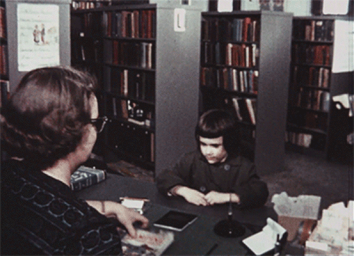

Dass sich ein festes Band zwischen dem Schreiben von Büchern und der
Idee der Bibliothek ergibt, ist nahezu unvermeidlich. Gerade das
sinnliche Erleben des Raums der Bibliothek scheint wenigstens bis tief
in das 20. Jahrhundert hinein eine tiefe Wirkung auf Schreibende
ausgeübt zu haben. Ob die Schreibpraxis im 21. irgendwo an diese
Raum-Schreibakt-Beziehung anzuschließen vermag, wird sich erst zeigen
müssen und zwar auch daran, welche Räume tatsächlich genutzt werden.
Dass Raum auf Schreiben wirkt, ist offensichtlich. Aber ob es der Raum
einer Bibliothek sein wird und welche Form und welche Grade der
Sinnlichkeit dieser überhaupt haben wird, ist nicht vorherzusagen. Die
erhabene Konzentration und Stille des Lesesaals gibt es noch. Aber sie
ist für Bibliotheksnutzerinnen und -nutzer nur noch eine Option von
diversen Zugängen.

In der Rückschau jedenfalls zeigt sich: wo sinnliche Wirkung vorliegt,
entsteht gern auch Poesie und nicht selten verbindet sich diese auch mit
Zwischenmenschlichem."Wir saßen häufig in derselben Bank…" eröffnet
Helmut Richter sein so harmloses wie schönes Gedicht *In der Deutschen
Bücherei zu Leipzig* aus den 1960er Jahren. Ähnlich, aber deutlich
direkter tritt Alfred Andersch eine Lesesaalfantasie los: "eine schöne
Studentin / hinter einem Haufen Bücher." (*Lesesaal*, 1977)

Wer diesen Spuren etwas folgt, sammelt zwangsläufig schnell eine ganze
Reihe von Belegen für die Bibliothek in der Literatur zusammen.
Besonders dann, wenn man für beide Welten, Bibliothek und Literatur,
sensibel ist.

Auf Raymond Dittrich, Bibliothekar an der Bischöflichen
Zentralbibliothek in Regensburg, trifft das augenscheinlich zu.
Ausgangspunkt war für ihn Rainer Malkowskis *Gedenkblatt für eine
Bibliothek*, eine Erinnerung an eine Kindheit in Westberlin und - "Am
schönsten war es im Winter, / \[...\] Von der zugigen Plattform der
Linie 96/ sprangen wir in die warme Welt der Bücher" - offensichtlich
auch eine Erinnerung an die Straßenbahnen im Westteil der geteilten
Stadt. Im Monat des Jahres 1961 fuhr die 96 dann letztmalig am
Blücherplatz und damit an der Amerika-Gedenkbibliothek vorbei, während
der junge Rainer Malkowski zur Zeitung ging und Berlin Richtung
Frankfurt/Main verließ. Es folgte die Sammlung einer erstaunlichen Zahl
von Bibliotheksgedichten vom 16. Jahrhundert bis fast heute, die nun in
der Anthologie "Bibliotheken der Dichter" vorliegt. Die Maskulinform des
Titels ist leider ein Wermutstropfen und irgendwie Programm, überwiegt
doch der Anteil des männlichen Blicks auf Buch und Bibliothek erheblich
(das Verhältnis Dichter : Dichterinnen beträgt rund 8:1), was aber eher
ein literaturgeschichtliches Problem sein dürfte, als eines desjenigen,
der die Lese aus dem verfügbaren Material vornimmt.

Ebenso offensichtlich ist, dass ein Anspruch auf Vollständigkeit für
eine solche Annäherung weder erwartet werden kann noch notwendig ist.
Die Sammlung ist in der vorliegenden Fassung außerordentlich umfassend
und vermutlich die umfangreichste publizierte zum Thema
Bibliotheksgedicht. Die Kriterium der thematischen Auswahl führt
naturgemäß in eine erhebliche und sehr inklusive Bandbreite an
literarischer Qualität, die durch das Nebeneinandersetzen von Texten
noch deutlicher wird. Zugleich liegt darin ein eigener Reiz und eine
Entsprechung zur Idee der Bibliothek als inklusivem Ort.

Sophie Leutenstorfer, die jüngste in der Sammlung enthaltene Autorin,
ist Jahrgang 1992 und spürbar noch auf dem Weg zu einer eigenen Sprache.
Aber eben auch das Werden gehört dazu. Zudem greifen Gedichte auf
verschiedenen Ebenen und wer einen ostdeutschen Hintergrund hat und die
Erinnerung der aus Altenburg stammenden Dichterin Kristina Stanczewski
(geboren 1978) an ihren Gang in die Bibliothek in der
Erich-Mäder-Straße, wo die bis heute nachwirkenden (und schwer zu
bekommenden) Bücher des Zauberland-Schöpfers Alexander Wolkow, gleitet
unwillkürlich in einen Zustand des Vertrauten (*Wolkow nur mit
Warteliste*, Erstveröffentlichung).

Zugleich entstehen intertextuelle Brücken. Wo sich Kristina Stanczewski
erinnert "Mehr als drei \[Bücher\] auf einmal war’n nicht drin" erhebt
sich zugleich ein Echoraum zu Rita Doves Zeile "greedily: six books, six
volumes of bliss" (*Maple Valley Branch Library, 1967*) und in gewisser
Weise die Vermutung, dass frühbiografische Begegnungen mit dem Phänomen
der öffentlichen Bibliothek ganz universell prägend wirkten.

Parallel sammelt der Band sehr intensiv scharf an der Sprache
operierende VertreterInnen der Dichtkunst, von Thomas Kling und Wulf
Kirsten bis zu Ernst Jandl oder auch Ron Winkler. Und unvermeidlich
entdeckt man auch Gottfried Benns delirierende Staatsbibliothek, dieses
"Satzbordell" und eines der bekanntesten und einprägsamsten Exemplare
der Bibliothekslyrik.

Was, wie eingangs angedeutet, auffällig fehlt, ist die jüngste und
mittlerweile auch schon wieder mittelalte Variante der Bibliothek,
nämlich die digitale. "Wurde der bücherlosen Bibliothek … je ein Gedicht
gewidmet?" fragt der Herausgeber. Eventuell braucht dessen Entstehung
noch Zeit, denn generell befinden sich das Digitale und das Poetische
noch in einer Kennenlernphase und aufgrund der reduzierten Sinnlichkeit
der binärcodierten Lebenserfahrung und dem Hunger nach Spürbarem seines
Gegenparts kann es noch eine Weile dauern, bis Post-Internet-Lyrik mit
einem gewissen Berührungspotential vorliegt. Bislang stehen das Digitale
und das Poetische eben im Gegensatz, in ihrer eigenen Meta-Binarität,
und es gilt Gail Mazurs Einsicht aus dem Gedicht *Inventory*: "your data
will never add up—Clarity, I think we're done here." Eine mögliche Spur
liegt darin, diese antagonistische Verhältnis zu thematisieren, wie es
Robyn Schiff in ihrem soziophoben Text *H1N1* unternimmt: "being read
from the book of life, / which is available on Kindle / and allows me to
avoid the public library".

Aber vielleicht schaut man auch einfach an der verkehrten Stellen und
die Poesie ist längst in animated Gifs visualisiert vorhanden und zwar
auch mit Bezug zum Phänomen der Bibliothek. Möglicherweise ist die
digitale Poesie etwas, das sich außerhalb der Lyrikkabinette und
Literaturhäuser entfaltet, weil sie ohnehin mehr in Bildern und Loops
spricht und nicht in Strophen. "ganz leise leise kurz blink blink kurz
kurz ganz kürzest / ist es da und blink blink geklimpert / schon ist es
wieder fort" - vielleicht fasst es Judith Nika Pfeifers *blinkts* aus
dem Jahr 2012 bislang am passendsten. Aber von der Bibliothek erzählt es
nichts. Die Frage, wie die Poesie der digitalen Bibliothek aussehen
wird, bleibt vorerst unbeantwortet.

Aus dieser Perspektive ist die Sammlung zu den Bibliotheken der Dichter
auch eine der Erinnerungen, ein willkommener Zeitspeicher, der an einer
außerordentlich deutlichen Schnittkante der Entwicklungen dessen, was
wir unter Bibliothek verstehen, erschien, hoffentlich noch in den
Bestand gelangt, um dort in aller Selbstreferentialität in eine medial
und auch poetisch sehr offene Zukunft zu übersetzen.

### Quellen

Rita Dove: *On the Bus with Rosa Parks*. New York: Norton, 1999

Gail Mazur: *Forbidden City*. Chicago; London: The University of Chicago
Press, 2016

Judith Nika Pfeifer:*nichts ist wichtiger / ding kleines du*. Wels:
mitter verlag, 2012

Robyn Schiff: *A Woman of Property*. New York: Penguin, 2016

Alle weiteren zitierten Gedichte stammen aus dem besprochenen Band.
