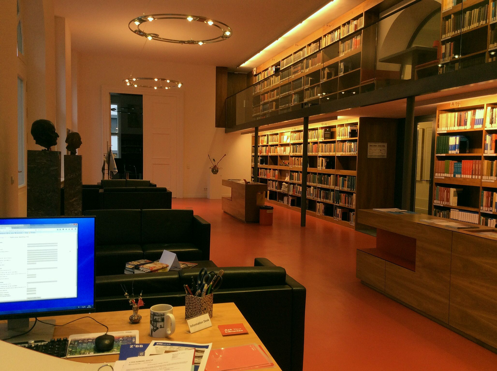
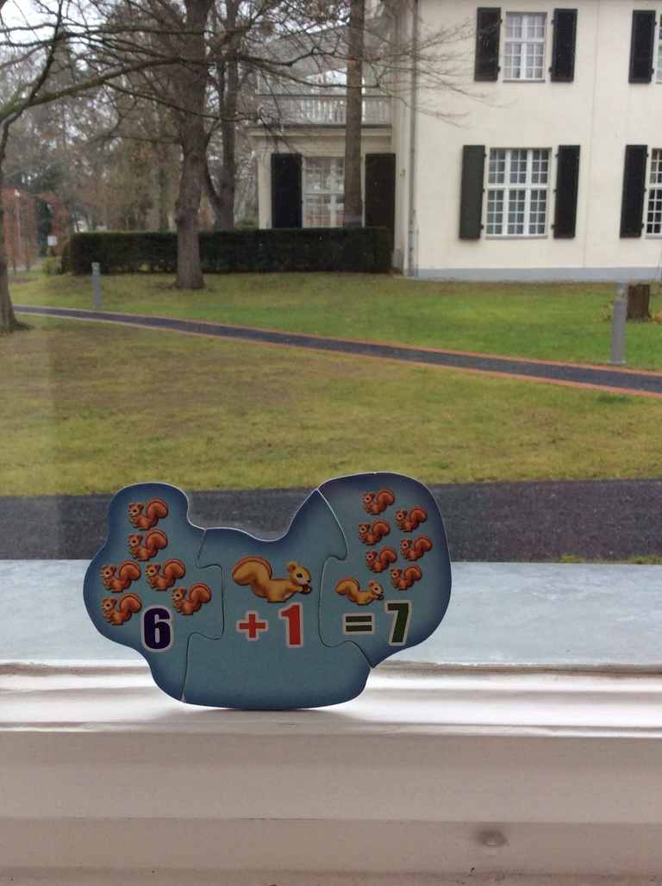
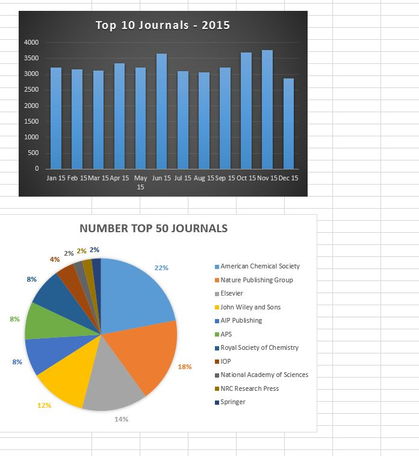
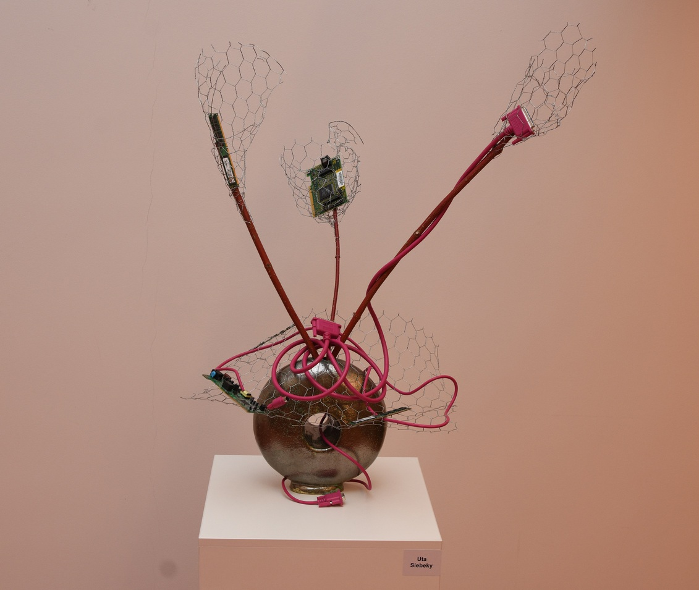

Zeigen Sie uns den Ort in Ihrer Bibliothek, an dem Sie die meiste Zeit verbringen. Was ist das für ein Ort? Wieso sind Sie die meiste Zeit dort?
================================================================================================================================================

Der Arbeitsplatz im Lesesaal der Bibliothek wird im Wechsel von allen
Bibliotheksmitarbeiterinnen besetzt. Hier werden alle Fragen von
Wissenschaftlerinnen und Wissenschaftlern beantwortet und
Beratungsgespräche geführt.

Was würden Sie vermissen, wenn es nicht mehr da wäre? Wieso würden Sie es vermissen?
====================================================================================

Das Fritz-Haber-Institut ist von einem großzügigen Park umgeben. Der
Arbeitsplatz in der Bibliothek gewährt einen schönen Blick in den Park.
Hier tummeln sich häufig Eichhörnchen, die an den alten Bäumen hoch- und
runterklettern.

Was stört Sie an Ihrer Bibliothek beziehungsweise was würden Sie gerne verbessern? Wieso stört Sie das jetzt (noch)?
====================================================================================================================

Nach dem Umzug der Bibliothek im Jahr 2010 musste der Monografien- und
Referenzbestand auf mehrere Etagen aufgeteilt werden. Somit ist nur ein
Teil des Bestandes im Lesesaal verfügbar. Der Referenzbestand ist über
die Wendeltreppe, die in den Keller führt, zugänglich. Die
innenarchitektonischen Gegebenheiten machen eine Verbesserung der
Aufstellung leider unmöglich.

Zeigen Sie uns Spuren der Bibliotheksnutzung. Gibt es dazu eine Geschichte?
===========================================================================

Unsere Wissenschaftlerinnen und Wissenschaftler haben Zugriff auf ein
sehr umfangreiches elektronisches Angebot. In der Regel wird
Zeitschriftenliteratur nur noch elektronisch genutzt. Schon seit Jahren
werten wir die jährlichen Nutzungszahlen der Verlage aus und erstellen
anschauliche Statistiken. Dies ermöglicht uns ein Monitoring zur
Bestandsentwicklung.

Was haben Sie, was die anderen nicht haben? Warum haben Sie das? Sollten andere es auch in ihren Bibliotheken haben?
====================================================================================================================

In der Bibliothek wird regelmäßig ein Ikebana aufgestellt. Im Dezember
2017 fand die erste Ikebana-Ausstellung in der Bibliothek statt. Diese
soll jährlich wiederholt werden. Diese neue Veranstaltungsreihe ergänzt
das bisherige interne Veranstaltungsprogramm und sorgt für eine optimale
Ausnutzung der Bibliotheksräume.

Ihre Bibliothek (Name, Adresse, Spezialisierung, was man noch über sie wissen sollte)?
======================================================================================

Bibliothek des Fritz-Haber-Institutes der Max-Planck-Gesellschaft in
Berlin-Dahlem. Das Institut blickt auf eine über hundertjährige
Geschichte zurück. Die Bestände richten sich nach den aktuellen
Forschungsschwerpunkten (zum Beispiel Katalyse- und Energieforschung).