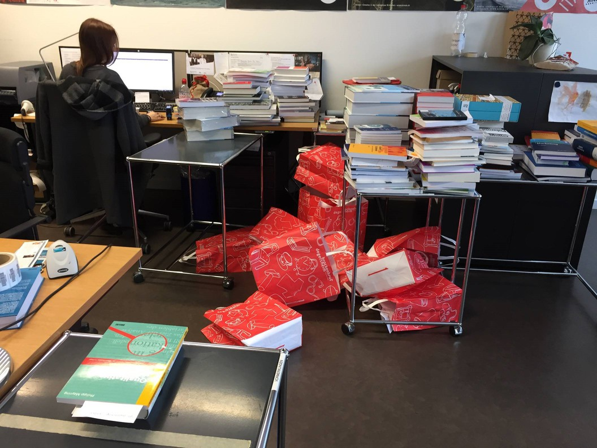
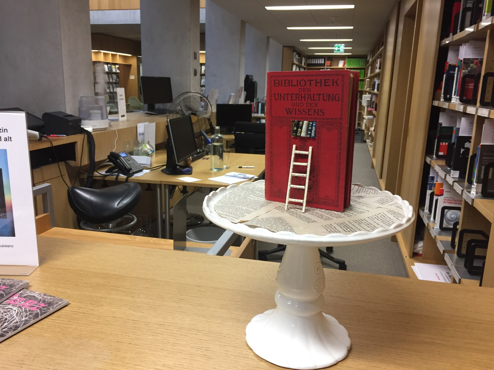
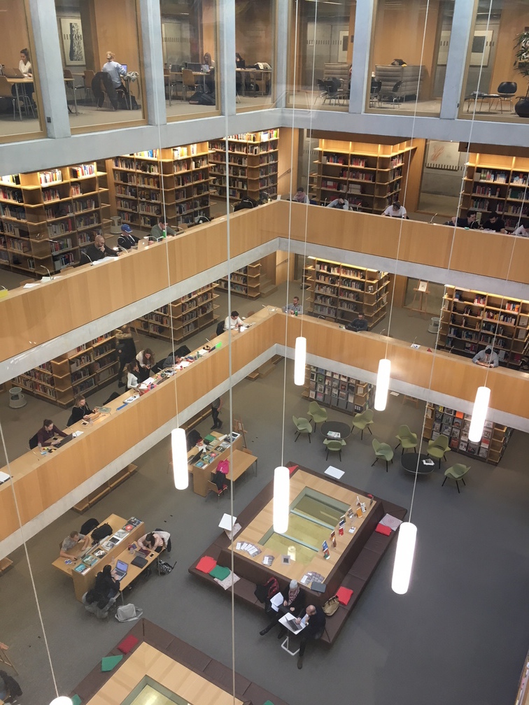
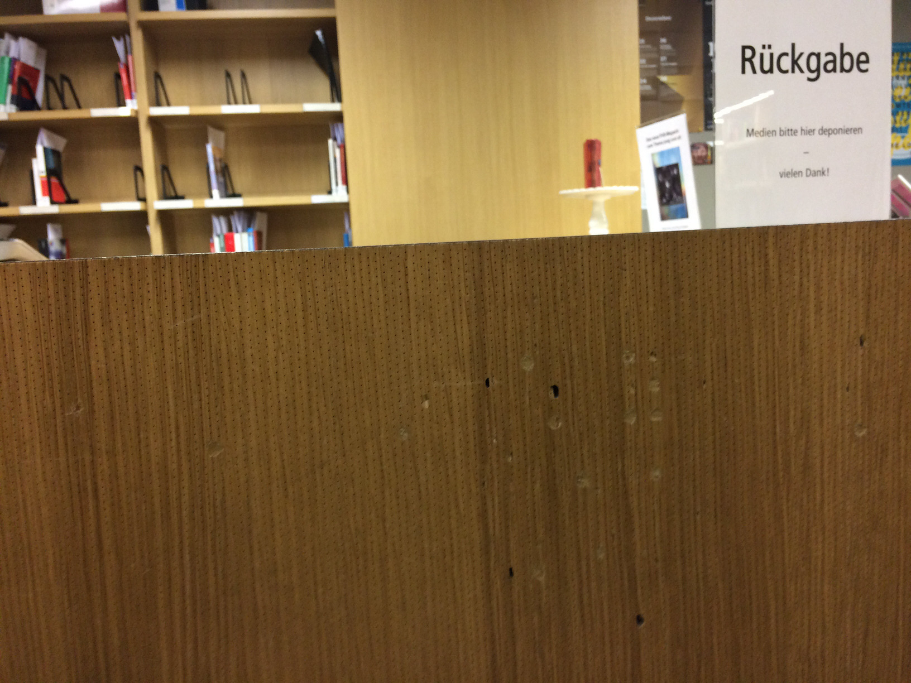
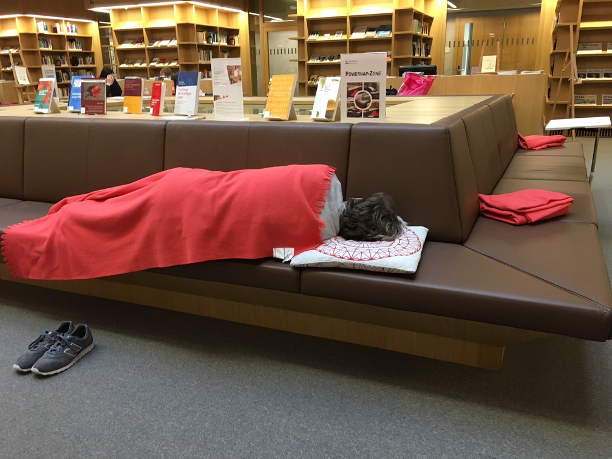

Zeigen Sie uns den Ort in Ihrer Bibliothek, an dem Sie die meiste Zeit verbringen. Was ist das für ein Ort? Wieso sind Sie die meiste Zeit dort?
================================================================================================================================================

Die meiste Zeit verbringen wir in unserem Bibliotheksbüro. Dieses Bild
zeigt unsere Lernende Sara, wie sie kurz vor Weihnachten die
eintreffende Flut neuer Büchern bewältigt.

Was würden Sie vermissen, wenn es nicht mehr da wäre? Wieso würden Sie es vermissen?
====================================================================================

Nicht missen möchten wir die fantasie- und liebevollen Dekorationen
unserer Mitarbeiterin Stefanie im Schalterbereich unserer Bibliothek.

Was stört Sie an Ihrer Bibliothek beziehungsweise was würden Sie gerne verbessern? Wieso stört Sie das jetzt (noch)?
====================================================================================================================

Wenn wir etwas verbessern könnten in unserer schönen Bibliothek, dann
wäre das eine Abtrennung zwischen dem Lese- und dem Schalterbereich.

Zeigen Sie uns Spuren der Bibliotheksnutzung. Gibt es dazu eine Geschichte?
===========================================================================

Wenn die Bibliotheksnutzerinnen und -nutzer in unserer Bibliothek an den
Schalter kommen, um Medien zurückzubringen, lehnen sie sich wohl etwas
innig am Schalter aus Eichenholz an, denn es entstehen gut sichtbare
Löcher. Diese erzählen eine kleine Geschichte. Die Geschichte von einem
viel genutzten Schalter mit Tuchfühlung unserer Besucher und
Besucherinnen. ... da hat es auch nichts genützt, dass wir die Löcher
auffüllen liessen... sie entstehen immer wieder, wie aus Zauberhand,
neu.

Was haben Sie, was die anderen nicht haben? Warum haben Sie das? Sollten andere es auch in ihren Bibliotheken haben?
====================================================================================================================

Während der Lernphase richten wir für (studier-)müde Benutzerinnen und
Benutzer auf unseren Sitzbänken eine Powernap-Zone ein. Dieser wird
gerne und rege genutzt.

Ihre Bibliothek (Name, Adresse, Spezialisierung, was man noch über sie wissen sollte)?
======================================================================================

Bibliothek der FHS St.Gallen, Hochschule für Angewandte Wissenschaften,
Rosenbergstrasse 59, 9001 St.Gallen