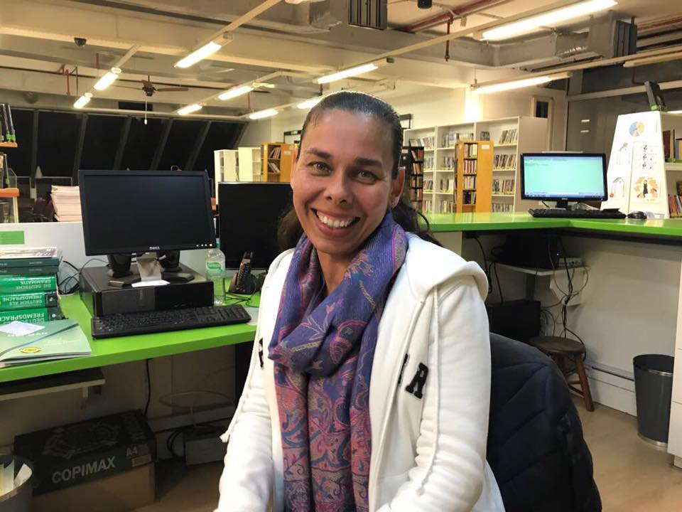
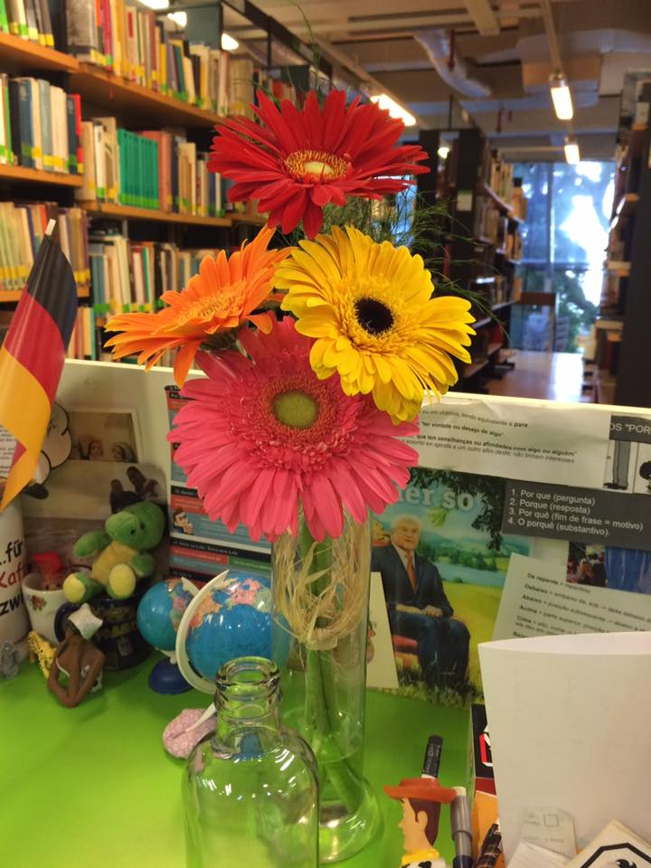
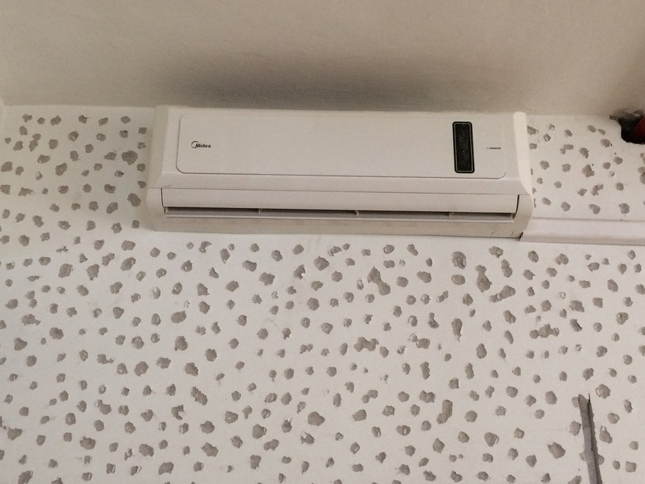
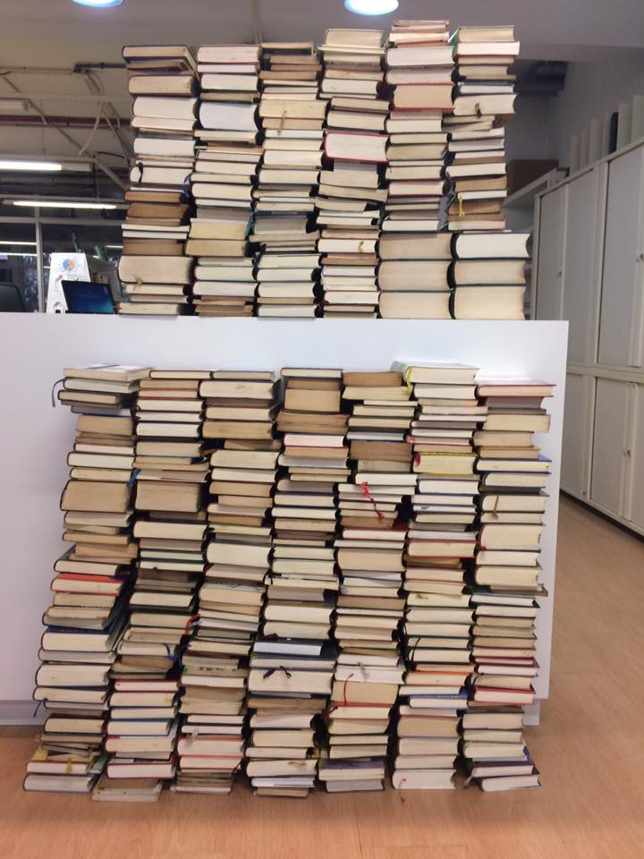
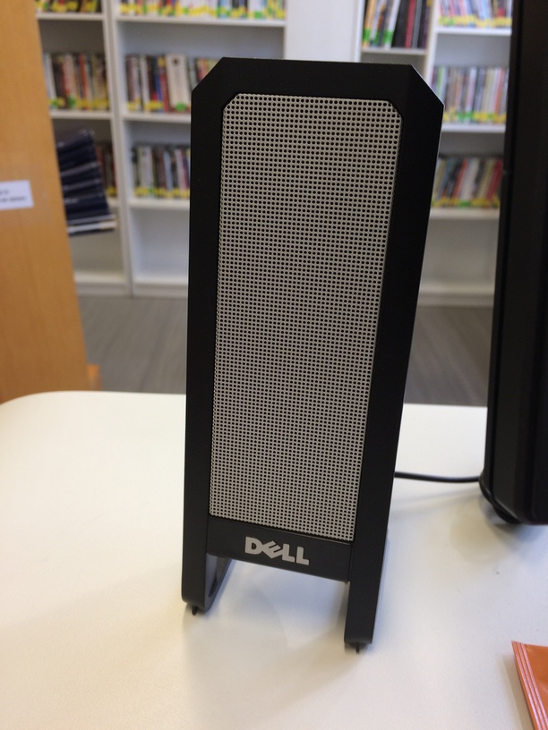

Zeigen Sie uns den Ort in Ihrer Bibliothek, an dem Sie die meiste Zeit verbringen. Was ist das für ein Ort? Wieso sind Sie die meiste Zeit dort?
================================================================================================================================================

Der Ort ist die Bibliothek, wo ich den Kundendienst und die
Katalogisierung mache.

Was würden Sie vermissen, wenn es nicht mehr da wäre? Wieso würden Sie es vermissen?
====================================================================================

Weil ich die Bibliothek ein bisschen bin und die Bibliothek ist ein
bisschen von mir.

Was stört Sie an Ihrer Bibliothek beziehungsweise was würden Sie gerne verbessern? Wieso stört Sie das jetzt (noch)?
====================================================================================================================

Weil es wenige Klimaanlagen in der Bibliothek gibt und sie ist deshalb
im Sommer zu warm.

Zeigen Sie uns Spuren der Bibliotheksnutzung. Gibt es dazu eine Geschichte?
===========================================================================

Bücher aussondern.

Was haben Sie, was die anderen nicht haben? Warum haben Sie das? Sollten andere es auch in ihren Bibliotheken haben?
====================================================================================================================

Musik. Bibliothek sollen auch Hintergrundmusik haben.

Ihre Bibliothek (Name, Adresse, Spezialisierung, was man noch über sie wissen sollte)?
======================================================================================

Goethe-Institut Porto Alegre -- Bibliothek. Rua 24 de Outubro, 112,
Porto Alegre, RS -- Brasil CEP 90510-000