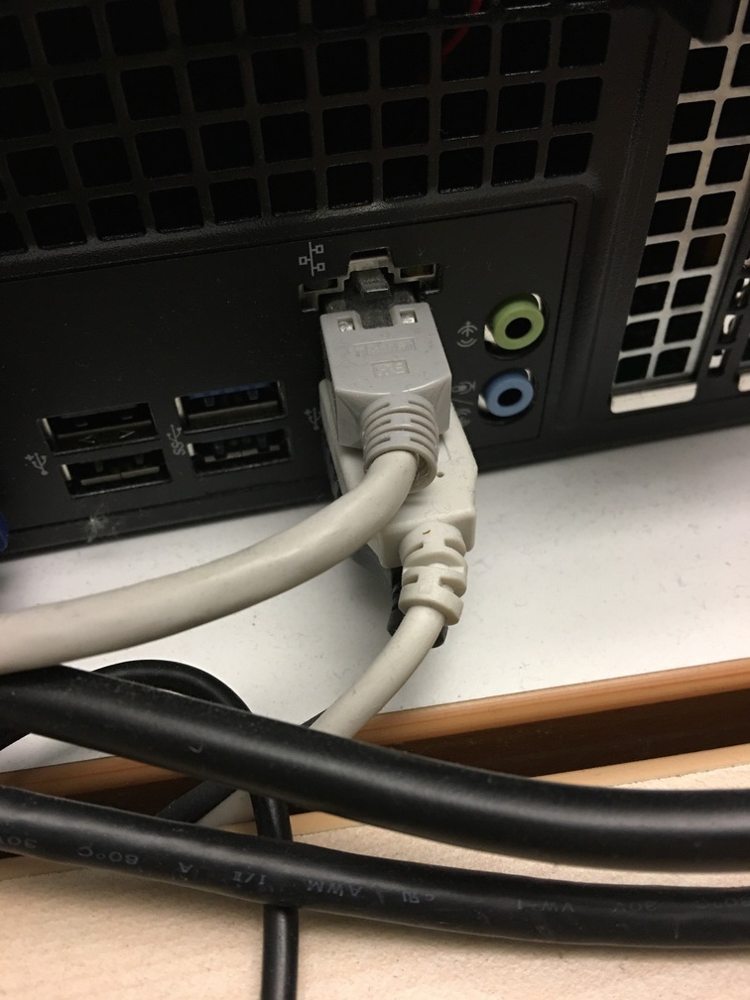
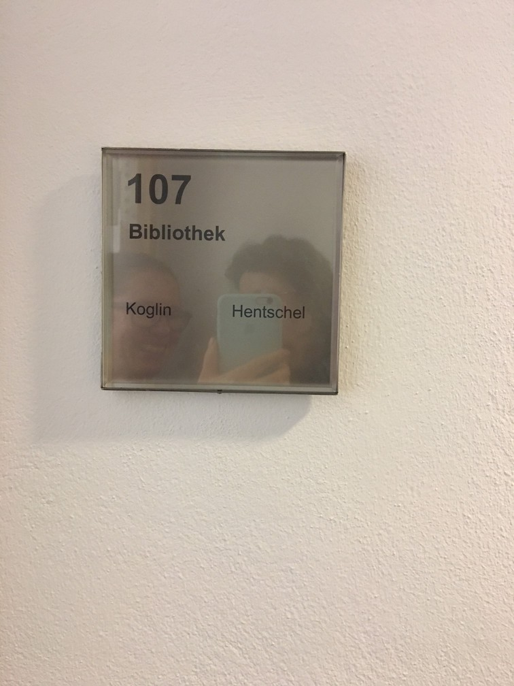
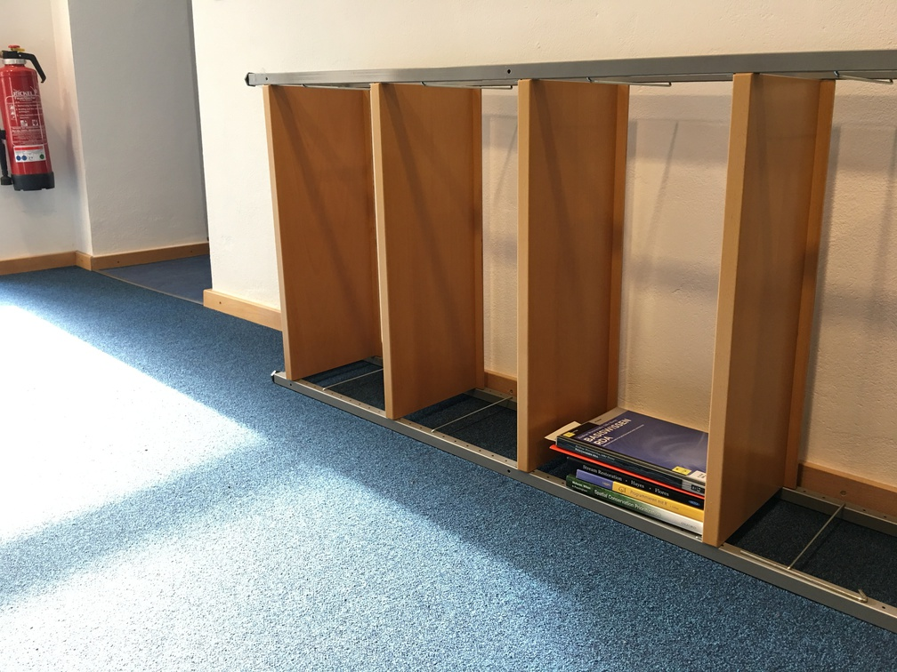
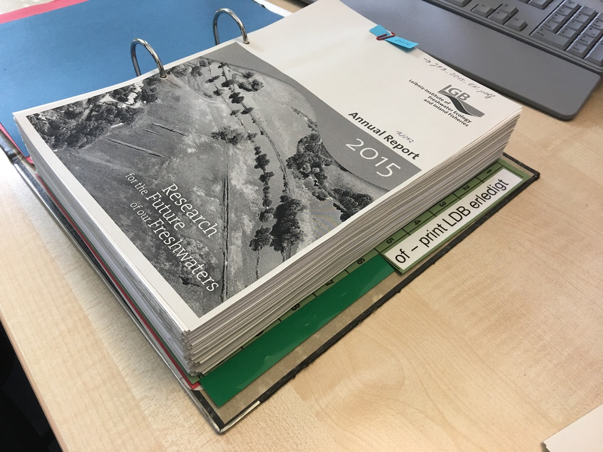

Zeigen Sie uns den Ort in Ihrer Bibliothek, an dem Sie die meiste Zeit verbringen. Was ist das für ein Ort? Wieso sind Sie die meiste Zeit dort?
================================================================================================================================================

Zweifelsohne verbringen wir die meiste Zeit irgendwo im Netz. Wenn das
Netz ausfällt -- was es glücklicherweise selten macht --, merkt man das
erst richtig. Gut, dass es dann noch ein paar Bücherregale gibt, in
denen man mal wieder Ordnung schaffen kann.

Was würden Sie vermissen, wenn es nicht mehr da wäre? Wieso würden Sie es vermissen?
====================================================================================

Meine Kolleginnen. Wir sind eine Two-Persons-Library mit Hilfskraft und
ich habe einen sehr großen Respekt für Kolleginnen aus OPLs, die alles
alleine stemmen.

Was stört Sie an Ihrer Bibliothek beziehungsweise was würden Sie gerne verbessern? Wieso stört Sie das jetzt (noch)?
====================================================================================================================

Wir sind gerade bei einem Projekt, bei dem wir mehrere tausend Bücher
umstellen. Physische Medien sind in ihrer Verwaltung, Bearbeitung und
täglichen Handhabung sehr aufwendig. Irgendwann dachte ich mal -- in den
Anfangsjahren der bibliothekarischen Tätigkeit -- so ein Regal ist
schnell umgeräumt oder ein paar Bücher schnell neu signiert. But, boy,
was I wrong...

Zeigen Sie uns Spuren der Bibliotheksnutzung. Gibt es dazu eine Geschichte?
===========================================================================

Auf dem Foto sieht man die ausgedruckten Titelseiten aller am Institut
erstellten Publikationen im Jahr 2016. Ich sehe sie auch als ein
Ergebnis der von Bibliotheken bereitgestellten gemeinsamen und lokalen
Infrastrukturen, ohne die Forschung nicht möglich wäre und die hier
wieder zurück in die Bibliothek finden.

Was haben Sie, was die anderen nicht haben? Warum haben Sie das? Sollten andere es auch in ihren Bibliotheken haben?
====================================================================================================================

Auch wenn es das absolute No-Go ist, muss ich zugeben: Ich bin ein Fan
von Benutzungsspuren. Dieses Buch haben wir zufällig bei der
Bestandsdurchsicht gefunden. Elektronische Medien, für die wir heute den
Großteil unseres Budgets ausgeben, haben diese Spuren nicht. Bei allen
Vorteilen, die digitale Medien haben, vermisse ich es ein wenig, dass
Dateien niemals Geschichten erzählen werden können.

Ihre Bibliothek (Name, Adresse, Spezialisierung, was man noch über sie wissen sollte)?
======================================================================================

Bibliothek des Leibniz-Instituts für Gewässerökologie und
Binnenfischerei (IGB) im Forschungsverbund Berlin e.V., am Nordufer des
Müggelsees in Berlin-Friedrichshagen.