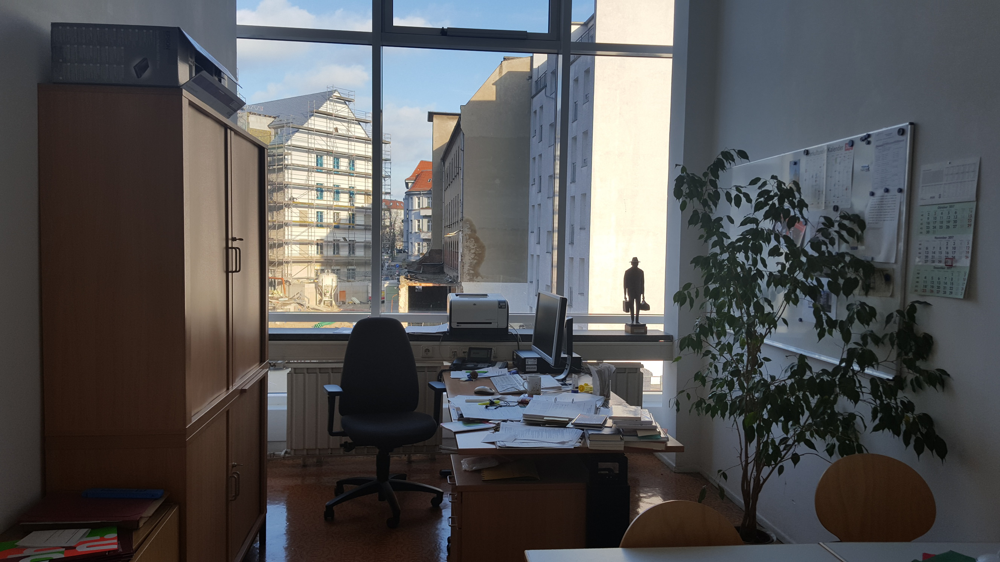
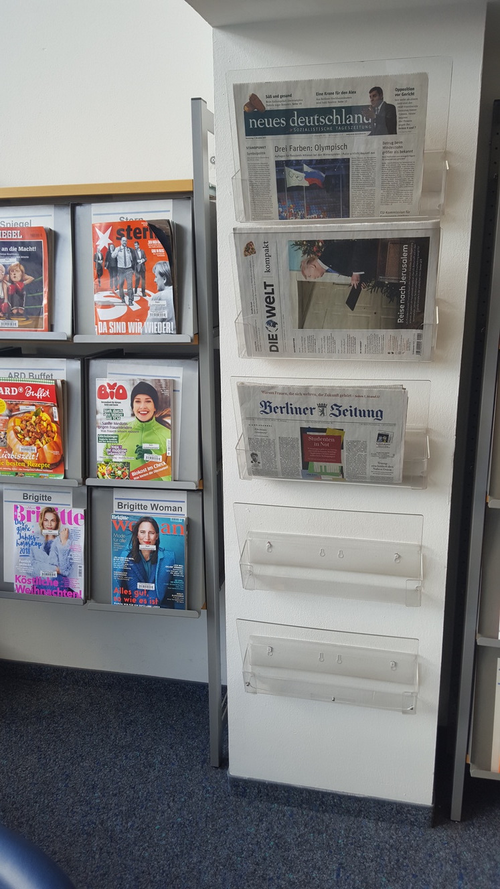
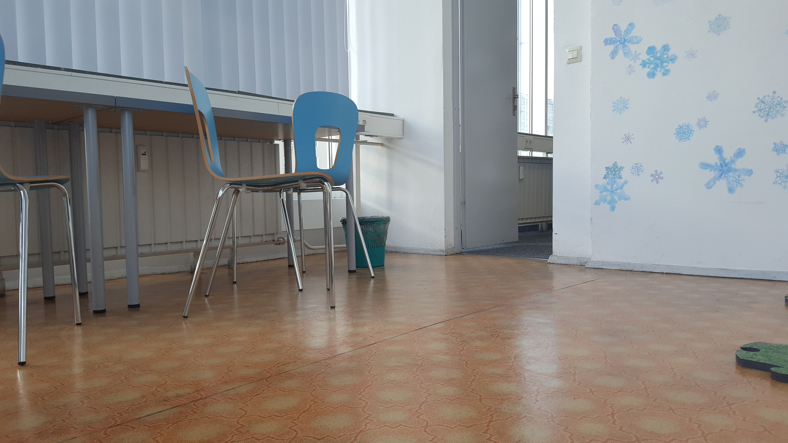
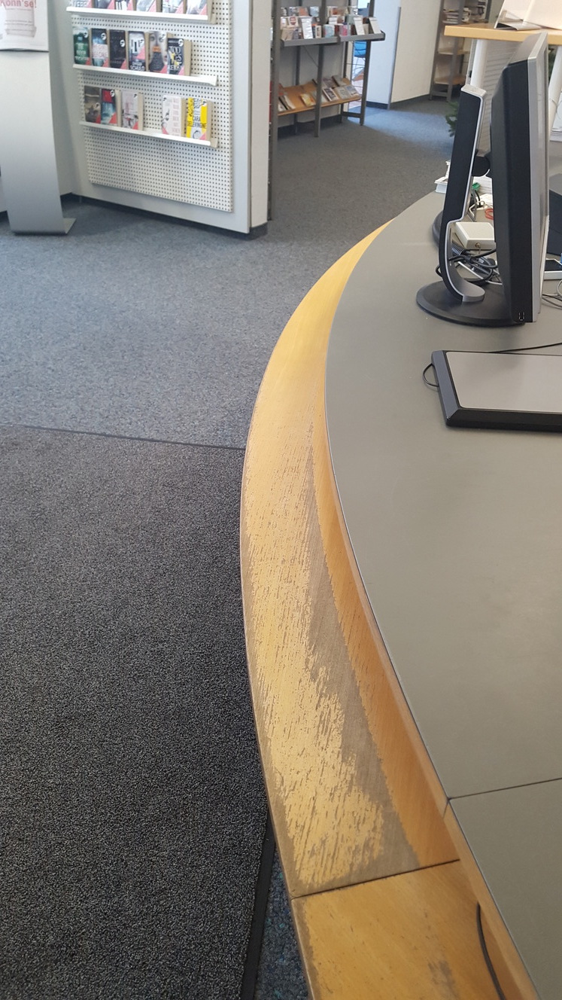
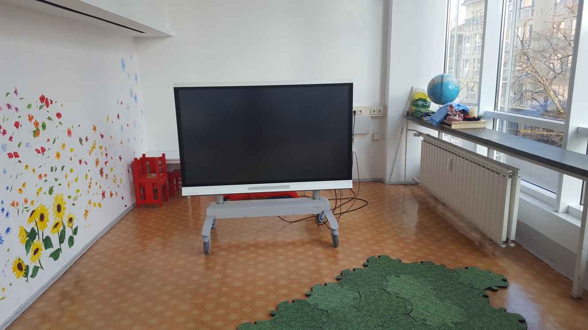

Zeigen Sie uns den Ort in Ihrer Bibliothek, an dem Sie die meiste Zeit verbringen. Was ist das für ein Ort? Wieso sind Sie die meiste Zeit dort?
================================================================================================================================================

Zu sehen ist das Büro der Leitung. Als Leiter der Bibliothek verbringe
ich dort die meiste Zeit, da viele Aufgaben einer Leitung in den
Verwaltungsbereich (Geschäftsbereich, Statistik, Personal, Finanzen\...)
fallen.

Was würden Sie vermissen, wenn es nicht mehr da wäre? Wieso würden Sie es vermissen?
====================================================================================

Tages- und Wochenzeitungen würden mir fehlen, also wenn Nutzer\*Innen
kein knisterndes Geräusch beim Umblättern des Zeitungspapiers mehr
erzeugten.

Was stört Sie an Ihrer Bibliothek beziehungsweise was würden Sie gerne verbessern? Wieso stört Sie das jetzt (noch)?
====================================================================================================================

Hier ist ein kleiner Veranstaltungsraum zu sehen, der für
Veranstaltungen mit Kitas sowie als Gruppenarbeitsraum genutzt wird. Der
Bodenbelag ist noch Erstausstattung (1982) und müsste erneuert werden,
wie andere Bereiche in der Einrichtung auch. Was in öffentlichen
Bibliotheken nicht immer einfach zu realisieren ist.

Zeigen Sie uns Spuren der Bibliotheksnutzung. Gibt es dazu eine Geschichte?
===========================================================================

Abgebildet ist die Ausleihtheke. Die Nutzer\*Innen haben im Laufe der
Jahre durch Taschen und Rucksäcke Spuren der Abnutzung hinterlassen.

Was haben Sie, was die anderen nicht haben? Warum haben Sie das? Sollten andere es auch in ihren Bibliotheken haben?
====================================================================================================================

Das Smartboard wird genutzt, um Kinder durch multimediale Anwendungen in
die Bibliotheksnutzung einzuführen. Es eignet sich auch sehr gut für
Bilderbuchkino (Onilo). Eine Anschaffung ist empfehlenswert.

Ihre Bibliothek (Name, Adresse, Spezialisierung, was man noch über sie wissen sollte)?
======================================================================================

Egon-Erwin-Kisch-Bibliothek, Frankfurter Allee 149, Berlin
