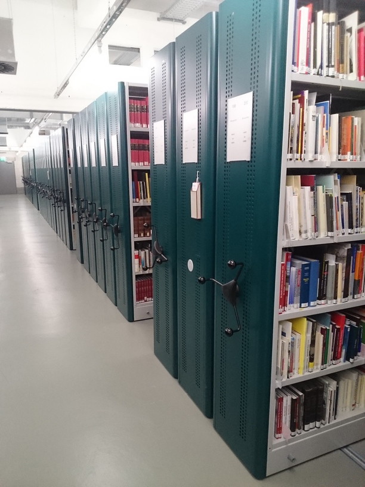
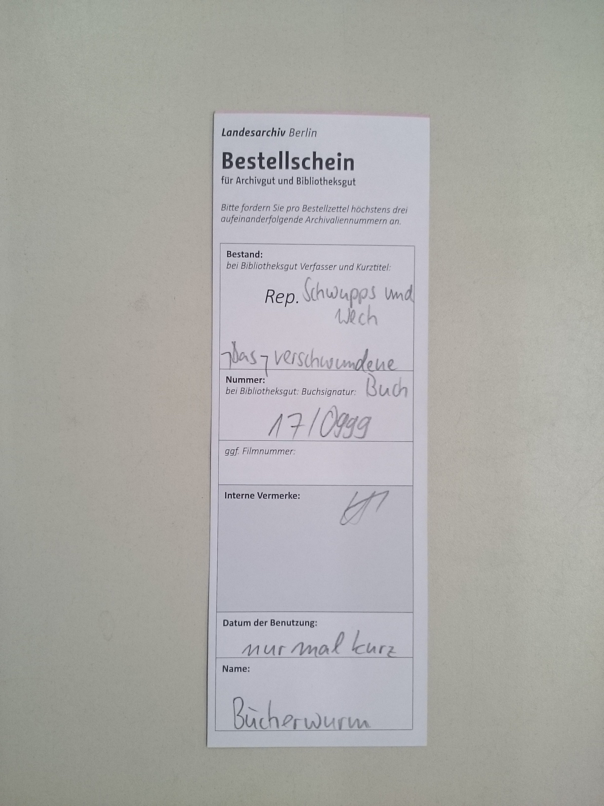
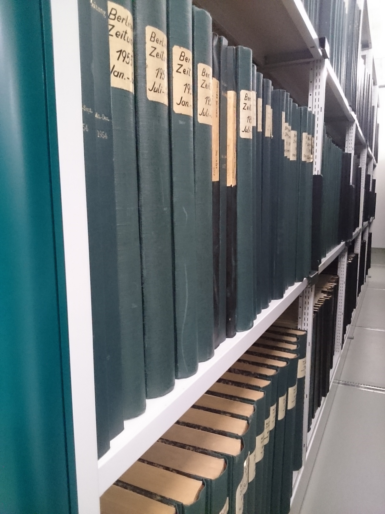
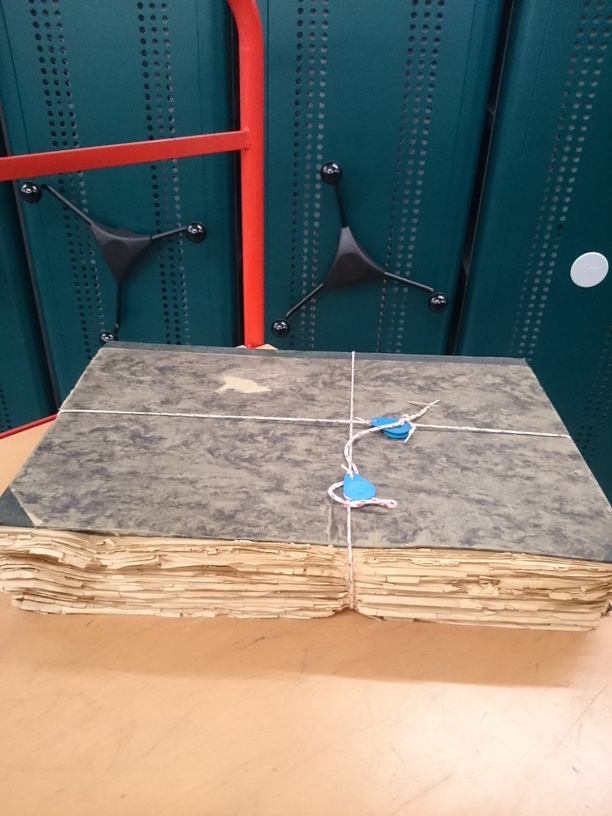

Zeigen Sie uns den Ort in Ihrer Bibliothek, an dem Sie die meiste Zeit verbringen. Was ist das für ein Ort? Wieso sind Sie die meiste Zeit dort?
================================================================================================================================================

Das Bild zeigt einige Regale im neuen Bibliotheksmagazin. Hier befindet
sich seit Beginn dieses Jahres fast der gesamte Bestand an Büchern,
Zeitschriften- und Zeitungsbänden. Die Zeitungen werden zur Zeit
umsystematisiert und signiert. Um aufwendige Transporte zu vermeiden,
wird diese Medienbearbeitung direkt im Magazin durchgeführt.

Was würden Sie vermissen, wenn es nicht mehr da wäre? Wieso würden Sie es vermissen?
====================================================================================

Das Landesarchiv Berlin verwendet ein analoges Bestellverfahren für die
Aktenbestände. Dieses Verfahren wird auch für den Bibliotheksbestand
angewandt. Fehlt sowohl das Buch als auch der Platzhalter im Magazin,
ist es oft sehr aufwendig das gesuchte Exemplar wiederzufinden.

Was stört Sie an Ihrer Bibliothek beziehungsweise was würden Sie gerne verbessern? Wieso stört Sie das jetzt (noch)?
====================================================================================================================

Die Zeitungstitel waren im Katalog ausschließlich mit der Nummer des
Regals, in dem die Bände standen, eingetragen. Also "Berliner Zeitung
Regal 5". Das führte dazu, dass mehrere Titel die selbe "Signatur"
hatten oder auch Titel mit umfangreichem Bestand gleich mehrere
"Signaturen", "Berliner Morgenpost Regal 9, 10 und 27". Dadurch
musste oft unnötig lang nach einzelnen Bänden gesucht werden.

Zeigen Sie uns Spuren der Bibliotheksnutzung. Gibt es dazu eine Geschichte?
===========================================================================

Zeitungen sind nun einmal nicht für eine dauerhafte Aufbewahrung
gemacht. Besonders geschädigt sind meist seltene Titel oder die Ausgaben
von historisch bedeutsamen Daten, wie dem 9. November 1918. Aber auch
"Kriegsschäden" sind hier zu finden.

Was haben Sie, was die anderen nicht haben? Warum haben Sie das? Sollten andere es auch in ihren Bibliotheken haben?
====================================================================================================================

In dem Zeitungsbestand befinden sich einige Berliner Lokalblätter, die
in der Zeitschriftendatenbank (ZDB) nicht nachgewiesen sind. Die Chancen
stehen also ganz gut, dass unsere Exemplare die einzigen noch existenten
sind. Wieviel historischen oder wissenschaftlichen Gehalt so ein
Anzeigenblättchen von 1897 hat, ist aber wohl eine andere Frage.

Ihre Bibliothek (Name, Adresse, Spezialisierung, was man noch über sie wissen sollte)?
======================================================================================

Die Bibliothek des Landesarchivs Berlin ist eine wissenschaftliche
Spezialbibliothek mit den Schwerpunkten Berliner Landes- und
Verwaltungsgeschichte, Berliner Persönlichkeiten und
archivwissenschaftliche Literatur. Sie dient der Versorgung von
Mitarbeiterinnen und Mitarbeitern sowie von Nutzerinnen und Nutzern des
Archivs mit Fachinformationen und Medien. Sie soll diese bei der
Erschließung von Aktenbeständen und der Gewinnung neuer Erkenntnisse
unterstützen.
