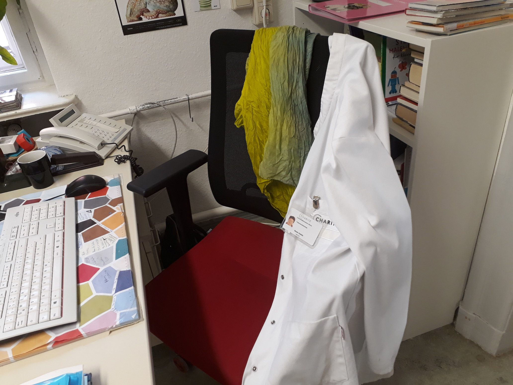
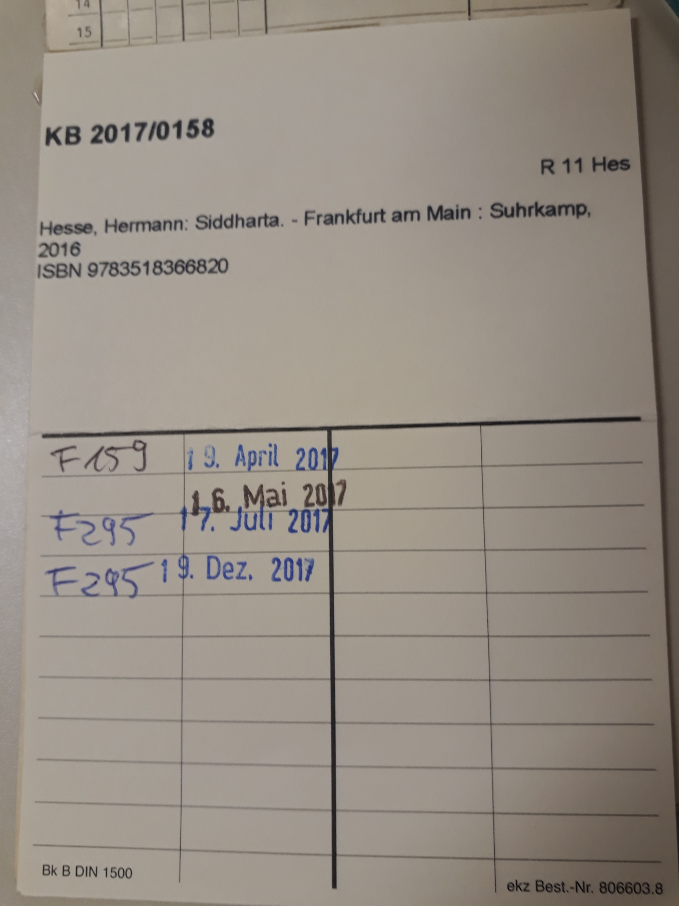
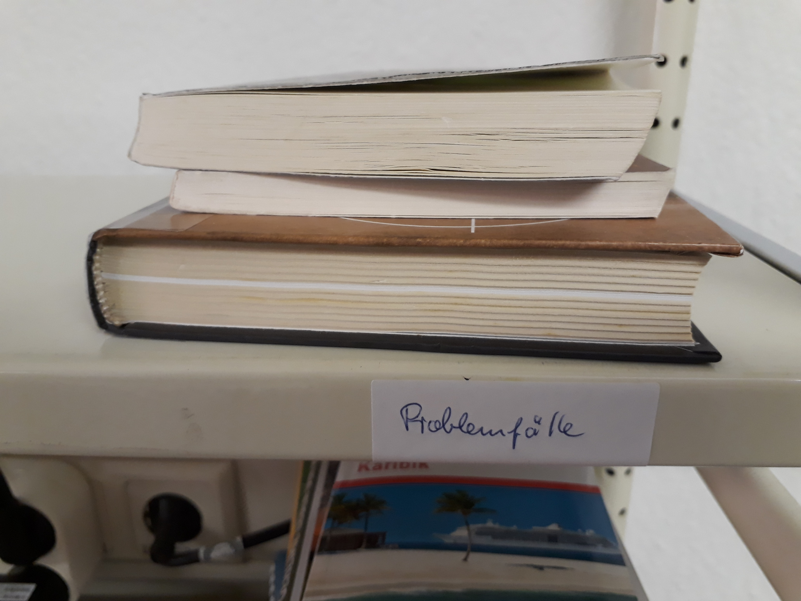
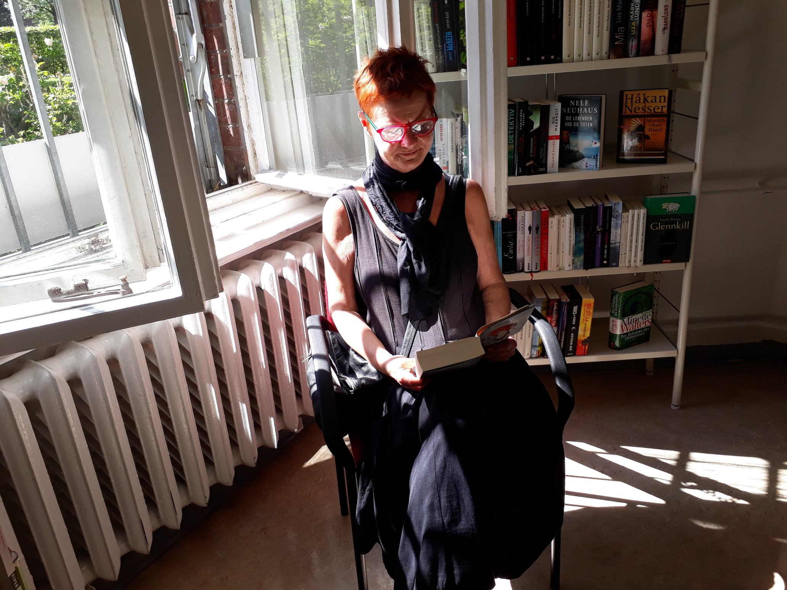
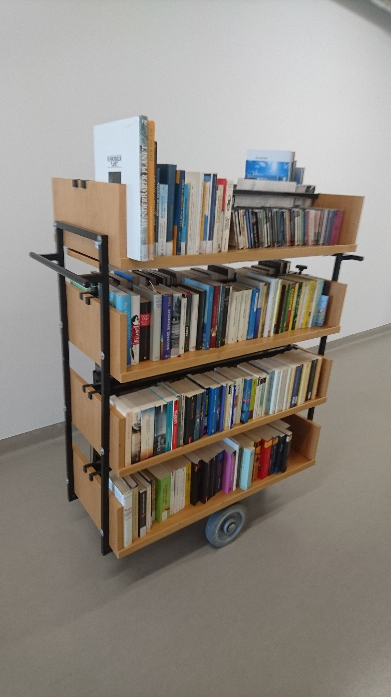

Zeigen Sie uns den Ort in Ihrer Bibliothek, an dem Sie die meiste Zeit verbringen. Was ist das für ein Ort? Wieso sind Sie die meiste Zeit dort?
================================================================================================================================================

Hier sieht man meinen Arbeitsplatz. Von dort aus steuere ich die
Geschicke der Patientenbibliothek CCM in der Charité Mitte Berlin und
stelle mit meinem sechsköpfigen Team sicher, dass möglichst alle
Patienten des Krankenhauses Zugang zu Lektüre haben, wenn sie das
möchten.

Was würden Sie vermissen, wenn es nicht mehr da wäre? Wieso würden Sie es vermissen?
====================================================================================

Das ist eine Buchkarte, wie sie in all unseren Büchern steckt. Wir sind
dabei, auf eine elektronische Ausleihe umzustellen, deshalb werden diese
Karten bald verschwinden. Bis jetzt kann man allerdings auf den
Buchkarten anhand der Lesernummer erkennen, ob ein Benutzer das Buch
schon gelesen hat. Gerade bei unseren Viel-Lesern ist es ein sehr
geschätzter Service, dass wir sagen können, ob man das Buch schon hatte.

Was stört Sie an Ihrer Bibliothek beziehungsweise was würden Sie gerne verbessern? Wieso stört Sie das jetzt (noch)?
====================================================================================================================

In diesem Stapel fehlen den Medien die Buchkarten. Man muss die gesamte
Ausleihe in der Bibliothek und auf Station durchsuchen, um sie
wiederzufinden. Das hört dann mit der elektronischen Ausleihe auf --
sicher gibt es aber auch dann "Problemfälle"!

Zeigen Sie uns Spuren der Bibliotheksnutzung. Gibt es dazu eine Geschichte?
===========================================================================

Andrea D. ist Patientin und eine eifrige Leserin in unser
Basisbibliothek. Für einen Online-Artikel über unsere
Patientenbibliothek hat sie Auskunft gegeben, warum die Bibliothek für
ihren Heilungsprozess so wichtig war. Er findet sich auf der Homepage
des Goethe-Instituts.[^1]

Was haben Sie, was die anderen nicht haben? Warum haben Sie das? Sollten andere es auch in ihren Bibliotheken haben?
====================================================================================================================

Wir haben mehrere Bücherwagen, weil wir jeden Vormittag die Stationen
des Krankenhauses bedienen, insgesamt 21 Stationen. So ein Bücherwagen
ist relativ teuer und wenn man ihn nicht für die tägliche Arbeit
braucht, wird man sich sicher keinen anschaffen. Als hilfreich empfinde
ich den begrenzten Raum, der zur Buchpräsentation zur Verfügung steht.
Er hilft dabei, eine für die Patienten relevante Auswahl zu treffen und
sich auf das Wesentliche zu konzentrieren.

Ihre Bibliothek (Name, Adresse, Spezialisierung, was man noch über sie wissen sollte)?
======================================================================================

Patientenbibliothek am Campus Charité Mitte, Charité Platz 1; 10117
Berlin

Bibliotheksnutzung für Patienten und Mitarbeiter der Charité

[^1]: [https://www.goethe.de/de/kul/lib/rei/lib/21031666.html](https://www.goethe.de/de/kul/lib/rei/lib/21031666.html)
