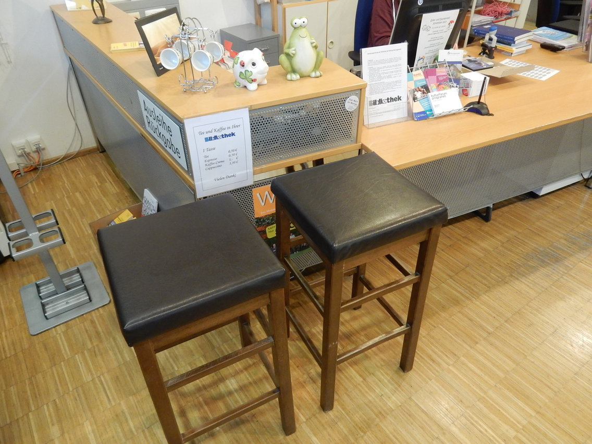
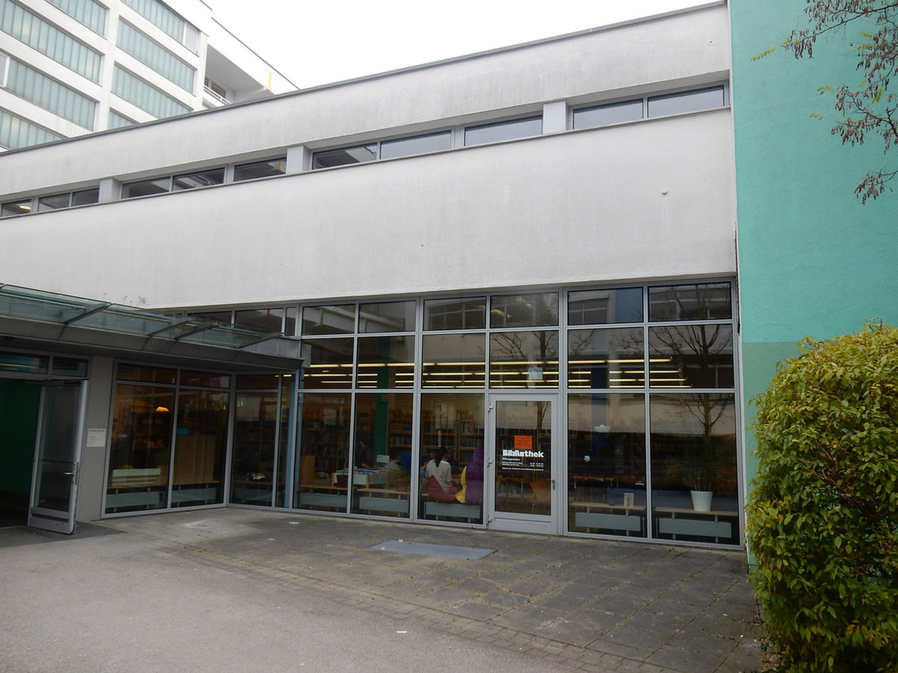
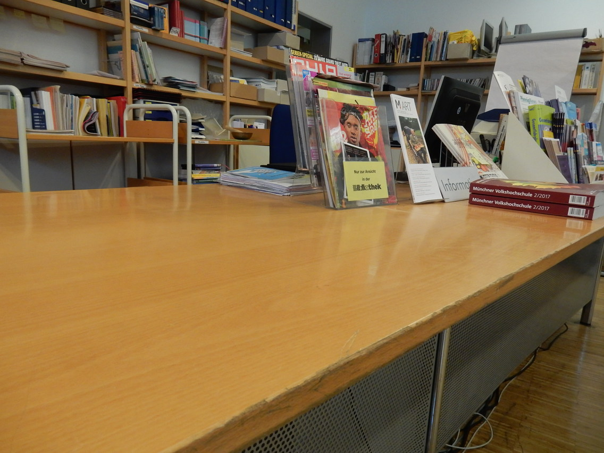
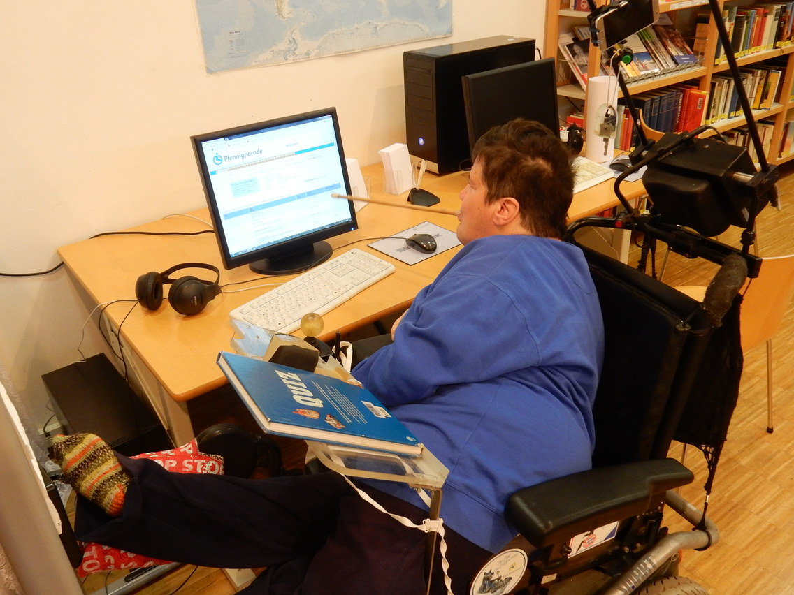

Zeigen Sie uns den Ort in Ihrer Bibliothek, an dem Sie die meiste Zeit verbringen. Was ist das für ein Ort? Wieso sind Sie die meiste Zeit dort?
================================================================================================================================================

Dies ist der Platz des Bibliotheksleiters. Der Rechner ist der
Datenbank-Server und zugleich Arbeitsplatz-PC mit der
Bibliothekssoftware. Erwerbung, Katalogisierung und Auskunft sowie die
Organisation der Veranstaltungsarbeit erfolgen hier. Daher ist dies der
Ort in der Bibliothek, an dem ich mich die meiste Zeit aufhalte.

Was würden Sie vermissen, wenn es nicht mehr da wäre? Wieso würden Sie es vermissen?
====================================================================================

Die Barhocker an der Theke bieten einen kommunikativen Platz für junge
und alte Besucher. Hier finden viele Gespräche in unserer Bibliothek als
Ort der Begegnung statt.

Was stört Sie an Ihrer Bibliothek beziehungsweise was würden Sie gerne verbessern? Wieso stört Sie das jetzt (noch)?
====================================================================================================================

Die Außenansicht der Bibliothek ist nicht sehr ansprechend. Die
Bezeichnung „Bibliothek" ist hier ziemlich klein an der Tür des
Notausganges zu finden. Eine künstlerische Gestaltung wäre wünschenswert
und läuft derzeit an.

Zeigen Sie uns Spuren der Bibliotheksnutzung. Gibt es dazu eine Geschichte?
===========================================================================

Die Ausleihtheke ist zentraler und intensiv beanspruchter Bestandteil
der Bibliothek. An den Kerben und Schrammen im Holz sieht man die
kontinuierliche Nutzung im Laufe der Jahre. So viele Leser haben ihre
Medien über diese Platte ausgeliehen und früher oder später wieder
zurückgegeben.

Was haben Sie, was die anderen nicht haben? Warum haben Sie das? Sollten andere es auch in ihren Bibliotheken haben?
====================================================================================================================

Unsere Bibliothek ist inklusiv und rundum barrierefrei. Als Teil des
Körperbehindertenzentrums Stiftung Pfennigparade suchen uns zahlreiche
Menschen jeden Alters mit Behinderung auf. Die räumliche und ideelle
Ausrichtung auf unsere körperbehinderten Besucher zeichnet unsere
Einrichtung aus. Das Miteinander, die Hilfsbereitschaft und die
Aufmerksamkeit für diese besonderen Nutzer sollten auch in anderen
Bibliotheken selbstverständlich gelebt werden.

Ihre Bibliothek (Name, Adresse, Spezialisierung, was man noch über sie wissen sollte)?
======================================================================================

Stiftung Pfennigparade, Bibliothek

Barlachstr. 26

80804 München

Inklusive barrierefreie Bibliothek für Menschen mit und ohne
Körperbehinderung.

Öffentliche Bibliothek und zugleich Schulbibliothek der
Ernst-Barlach-Schulen.
