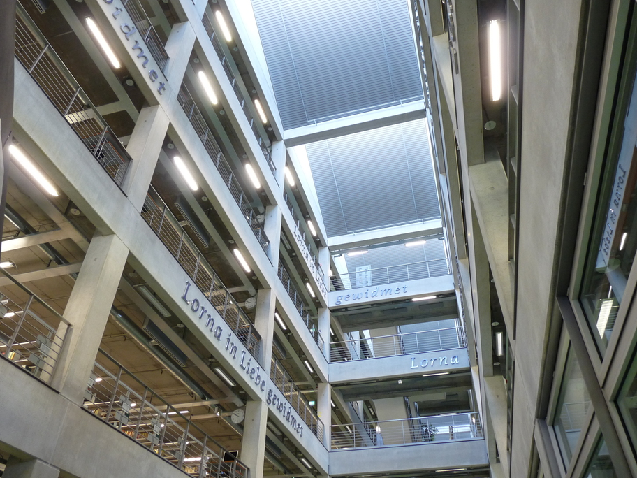
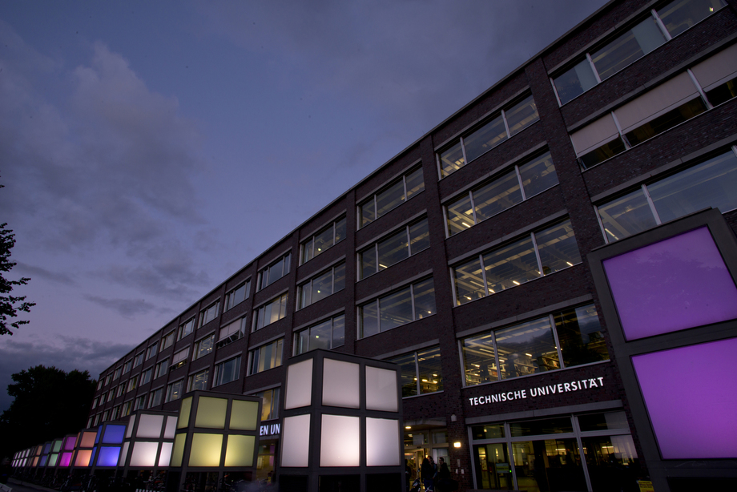
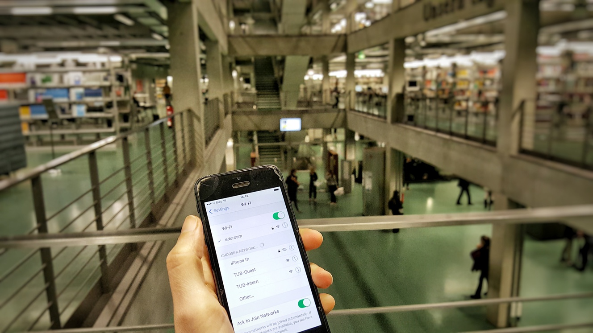
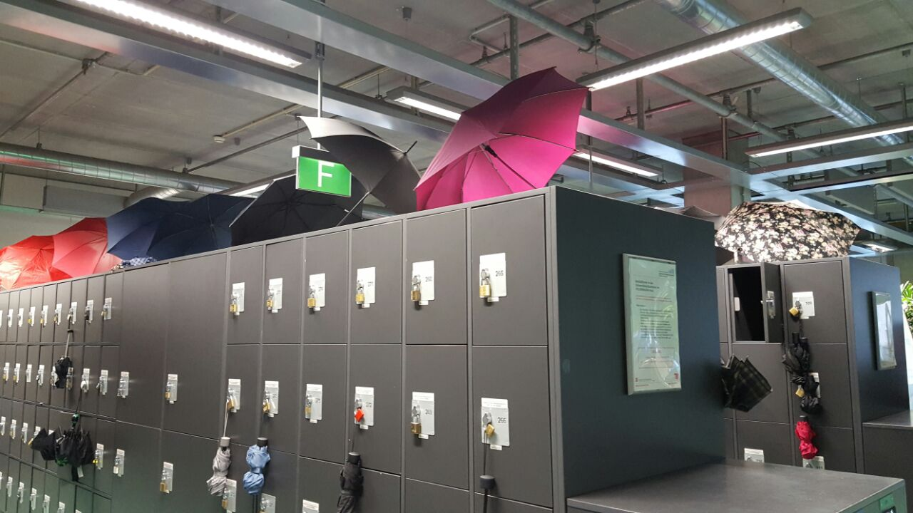
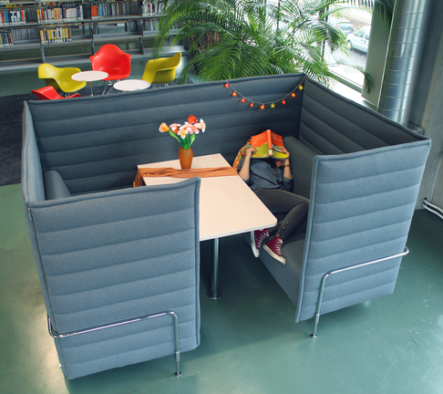

Zeigen Sie uns den Ort in Ihrer Bibliothek, an dem Sie die meiste Zeit verbringen. Was ist das für ein Ort? Wieso sind Sie die meiste Zeit dort?
================================================================================================================================================

Das ist ein eher ungewöhnlicher Blick in unsere Bibliothek. Von unten
nach oben. Hier sieht man gut, wie, trotz der massiven Architektur, die
Gedanken nach oben und durch den ganzen Raum schweifen können. Physisch
bin ich zwar die meiste Zeit in meinem Büro, aber mental schwirre ich an
vielen Orten dieser Bibliothek.

Was würden Sie vermissen, wenn es nicht mehr da wäre? Wieso würden Sie es vermissen?
====================================================================================

Unsere bunten Stelen, die abends immer heiter vor sich hin flackern,
verschönern einem einfach den Weg nach Hause.

Was stört Sie an Ihrer Bibliothek beziehungsweise was würden Sie gerne verbessern? Wieso stört Sie das jetzt (noch)?
====================================================================================================================

Ich fände es toll, wenn alle unser WLAN nutzen könnten und nicht nur
Angehörige von Eduroam-Institutionen. Das Internet sollte allen Menschen
frei zugänglich sein.

Zeigen Sie uns Spuren der Bibliotheksnutzung. Gibt es dazu eine Geschichte?
===========================================================================

An Regentagen stellen unsere Nutzer\*innen ihre Regenschirme auf den
Schließfächern ab oder hängen sie an die Schlösser. Daran kann man immer
gut sehen, was für ein Wetter draußen ist und wie stark besucht wir
gerade sind.

Was haben Sie, was die anderen nicht haben? Warum haben Sie das? Sollten andere es auch in ihren Bibliotheken haben?
====================================================================================================================

Arbeitsplätze, an denen man auch einmal ein Nickerchen machen kann.
Pausen und Ruhezeiten sind wichtig. Als Studierende wäre ich sehr
glücklich darüber gewesen.

Ihre Bibliothek (Name, Adresse, Spezialisierung, was man noch über sie wissen sollte)?
======================================================================================

Universitätsbibliothek der Technischen Universität Berlin, Fasanenstraße
88 auf dem Campus Charlottenburg. Wir haben den größten Bestand an
technisch-naturwissenschaftlicher Literatur in der Region
Berlin-Brandenburg und beherbergen die Deutsche Gartenbaubibliothek.
