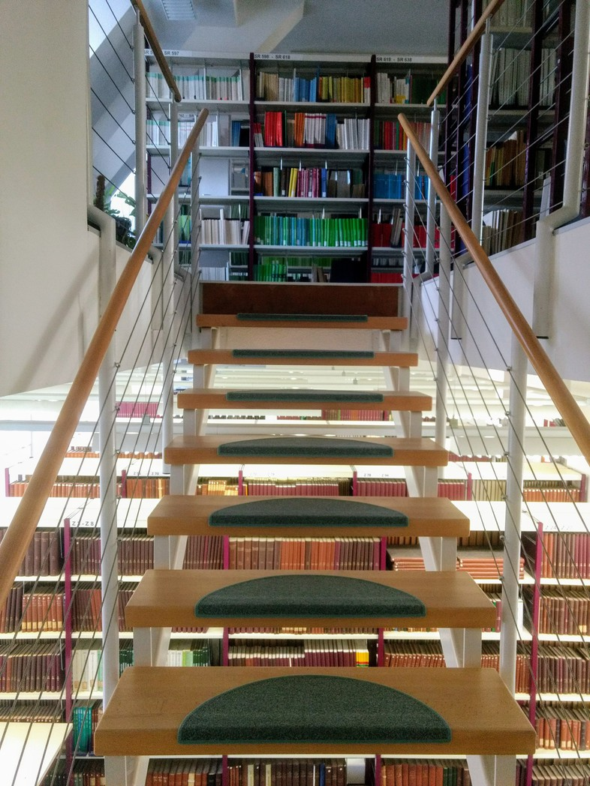
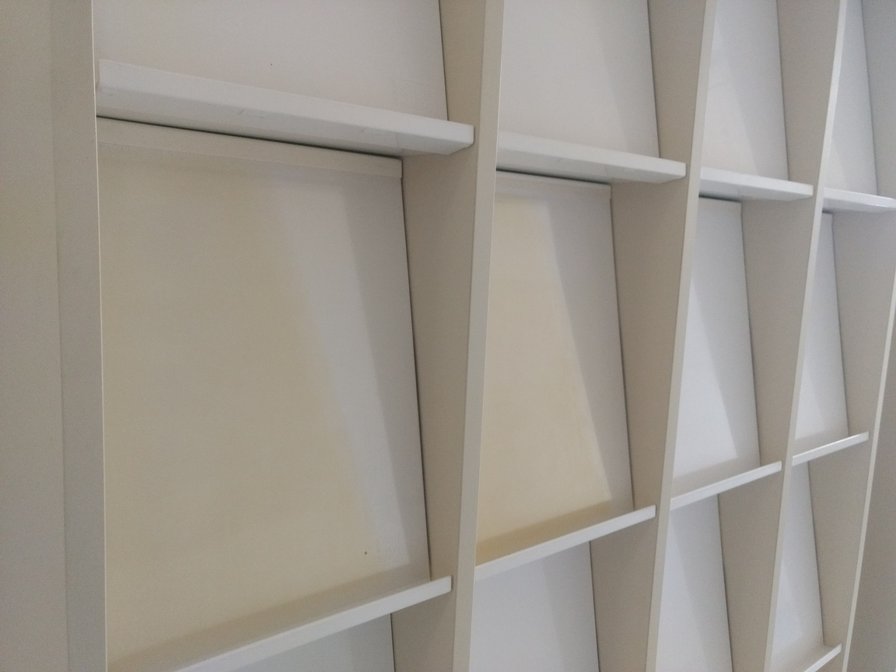
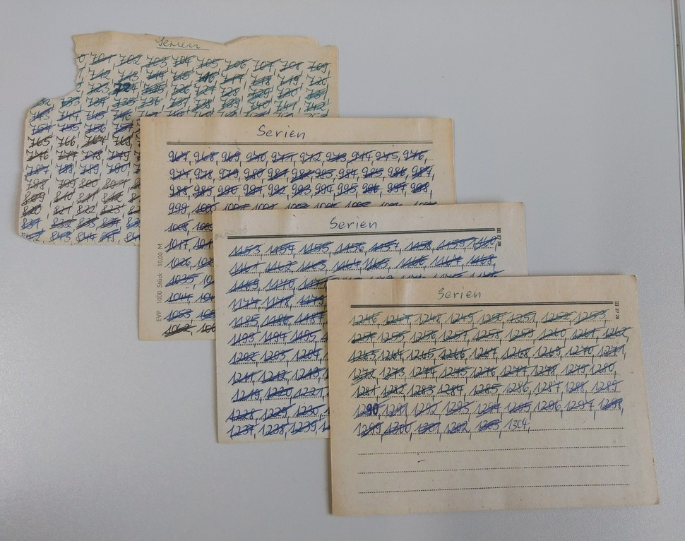
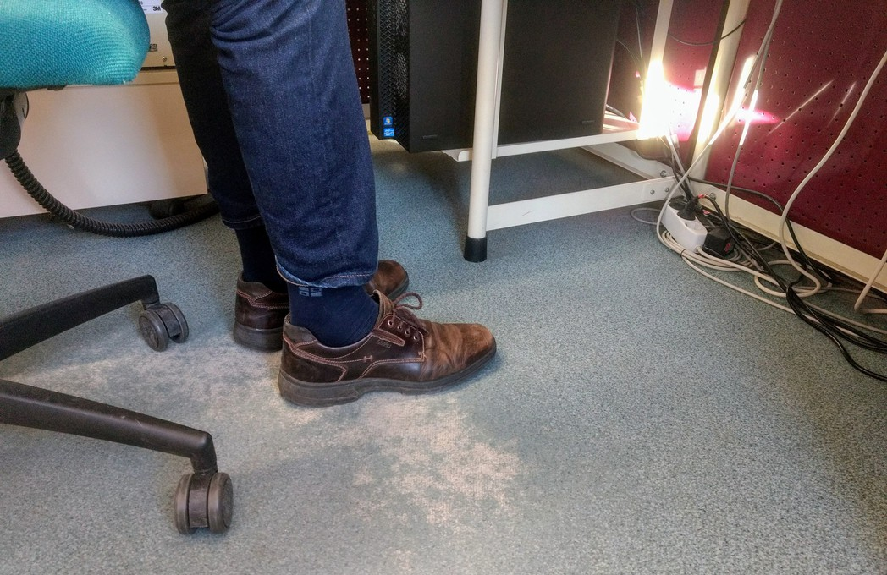

Zeigen Sie uns den Ort in Ihrer Bibliothek, an dem Sie die meiste Zeit verbringen. Was ist das für ein Ort? Wieso sind Sie die meiste Zeit dort?
================================================================================================================================================

Hier sieht man die Treppe, die beide Etagen der Bibliothek des
Leibniz-Zentrums für Agrarlandschaftsforschung (ZALF) e.V. verbindet.
Der Ort steht für das Arbeiten in der physischen und digitalen Welt:
zwischen hunderten Regalmetern in dunkelbraunem Leder gebundener
Zeitschriftenbände und einer virtuellen Forschungsumgebung.

Was würden Sie vermissen, wenn es nicht mehr da wäre? Wieso würden Sie es vermissen?
====================================================================================

Als wissenschaftliche Spezialbibliothek im Bereich der
Umweltwissenschaften spielen Zeitschriften als maßgeblicher
Publikationsort eine entscheidende Rolle. Hier zu sehen sind leer
geräumte Zeitschriftenaufsteller. Einige wenige Zeitschriften beziehen
wir noch in print, 90% unseres heute erworben "Bestandes" stellen wir
unseren Nutzern digital zur Verfügung. Das haptische Gefühl für die
Zeitschriftenhefte geht verloren.

Was stört Sie an Ihrer Bibliothek beziehungsweise was würden Sie gerne verbessern? Wieso stört Sie das jetzt (noch)?
====================================================================================================================

Unsere, im Sinne der Raumplanung beinahe wieder modern wirkende,
Bestandsaufstellung nach Numerus currens und nach den Publikationsformen
monographische Werke, Schriftenreihen und Zeitschriften. Serendipity ist
nur in begrenztem Maße möglich.

Zeigen Sie uns Spuren der Bibliotheksnutzung. Gibt es dazu eine Geschichte?
===========================================================================

Hier zu sehen ist der abgenutzte Teppich am Arbeitsplatz des Tresens. Er
steht für unser stetiges Engagement unsere NutzerInnen bedarfsgerecht
mit den Informationen zu versorgen, die sie benötigen. Er steht
gleichzeitig für die aktuellen und ehemaligen MitarbeiterInnen unserer
Bibliothek, die unermüdlich zwischen Tradition und Innovation wandeln.

Was haben Sie, was die anderen nicht haben? Warum haben Sie das? Sollten andere es auch in ihren Bibliotheken haben?
====================================================================================================================

Historisch bedingt entschied man sich vor rund zehn Jahren das
Publikationsmanagement an die Bibliothek anzugliedern. Eine Situation,
die heute dafür sorgt, dass wir im aktuellen Spannungsfeld
Open-Access-Publizieren, Lizenzmanagement und Bibliometrie/Szientometrie
ein Serviceangebot haben, das innerhalb der Leibniz-Gemeinschaft selten
bei den kleineren Bibliotheken zu finden ist, den aktuellen
Anforderungen an das Berufsbild des Bibliothekars aber nahe kommt.

Ihre Bibliothek (Name, Adresse, Spezialisierung, was man noch über sie wissen sollte)?
======================================================================================

Bibliothek des Leibniz-Zentrums für Agrarlandschaftsforschung (ZALF)
e.V. KOBV-Bibliothek, 2,5–3,5 Vollzeitäquivalente. Interdisziplinäres
Sammelgebiet zur Landschaftsforschung.