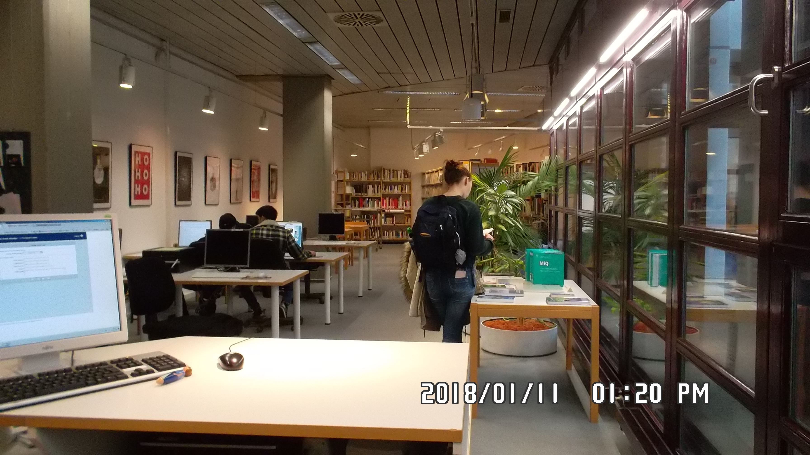
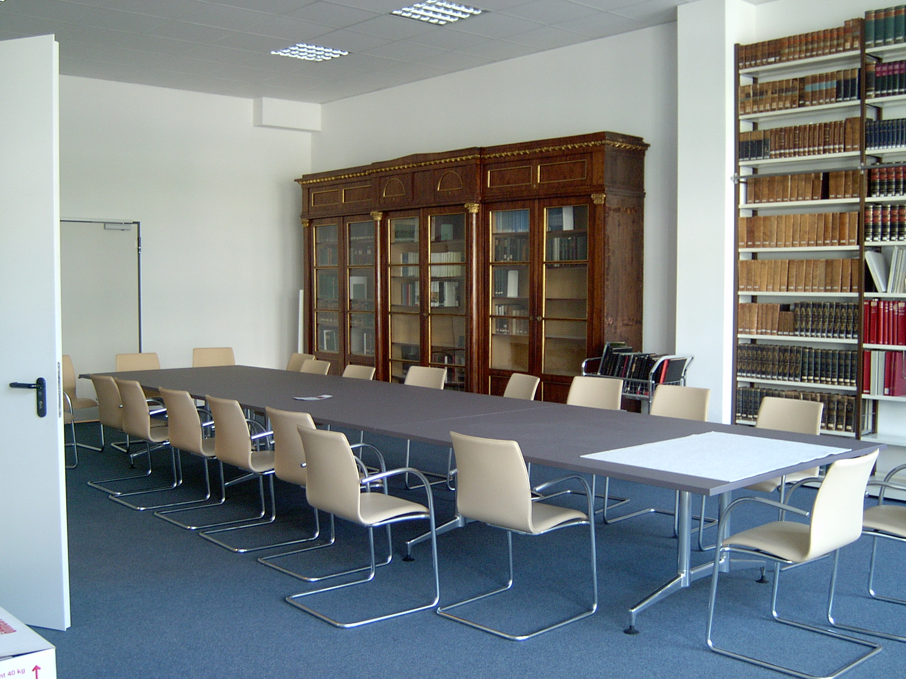

### 20 Jahre Arbeitskreis der One-Person Libraries von Berlin/Brandenburg

*Karin Aleksander*

Ab wann existiert ein Arbeitskreis? Vom Tage seiner konstituierenden
Sitzung an? Wer hat dann zu dieser Sitzung eingeladen? Jeder
Arbeitskreis hat also eine Vorgeschichte -- so auch dieser Arbeitskreis
der One-Person Libraries von Berlin/Brandenburg.

Unsere Gründung am 6. März 1998 -- an einem Freitag, was noch heute
unser üblicher Sitzungstag ist -- reihte sich ein in die seit circa 1995
entstandenen Arbeitsgruppen und -kreise in weiten Teilen der gesamten
Republik. Vor allem die überregionale Multiplikator\_innenrunde[^1] am
damaligen Deutschen Bibliotheksinstitut, die von Evelin Morgenstern aus
der Abteilung Spezialbibliotheken organisiert worden war, und die im Mai
1997 vom Vorstand des Vereins der Diplom-Bibliothekare an
wissenschaftlichen Bibliotheken e. V. (VdDB) beim 7. Bibliothekskongress
in Dortmund eingesetzte Kommission für One-Person Librarians bewirkten
verstärkte Aufmerksamkeit für diese spezielle Form von Bibliothek.
Innerhalb von nur vier Monaten meldeten sich damals 1.100 Leute in einer
OPL-Datenbank an...

Diese begeisterte Bewegung basierte auf der Philosophie der One-Person
Libraries (OPL), die in den 1970er Jahren vor allem von Guy St. Clair in
den USA entwickelt wurde und auch in Großbritannien mit der "One Man
Bands Group" existierte.

Eine der ersten Aufgaben unseres neuen Berlin/Brandenburger
Arbeitskreises nach dem wechselseitigen Kennenlernen unserer
Einrichtungen bestand darin, sich mit den Inhalten dieser Philosophie
vertraut zu machen. Unter der Leitung von Frau Morgenstern übersetzten
einige unserer Mitglieder\_innen zum Beispiel wichtige
OPL-Publikationen. Damit gab es weitere Checklisten und Praxisbeispiele
als Orientierungshilfe für den Betrieb von OPLs in deutscher Sprache.
Fleißig tauschten wir den OPL-Newsletter aus den USA untereinander.
Organisiert von Frau Morgenstern besuchten 2002 auch Mitglieder\_innen
unseres Arbeitskreises innerhalb von nur 14 Tagen circa 26 Bibliotheken
in Chicago, Washington D.C. und New York. Besondere kulturelle
Höhepunkte waren für viele von uns die jährlichen Veranstaltungen (von
2003 bis 2014), auf denen der John Jacob Astor Award in Library and
Information Science für herausragende Leistungen in
Spezial-/Bibliotheken vergeben wurde, meist gekoppelt an einen
hochkarätigen Workshop der Preisträger\_innen danach, der uns viel Input
gab.

Zu unserem 10. Jahrestag 2008 veröffentlichte unser Arbeitskreis in
Zusammenarbeit mit einer Foto-Klasse am Lette-Verein einen
Text-Bild-Band, in dem 15 OPLs ihre Besonderheiten nicht nur selbst
beschreiben, sondern diese auch mit dem fremden Blick der Fotokamera und
der persönlichen Sicht der Fotografierenden doppelt gespiegelt werden.

Nun -- zu unserem 20. Jahrestag -- legen wir mit einem kollektiven
Tagebuch aus dem Arbeitsalltag von neun OPLs unseres Arbeitskreises ein
wieder anderes Gemeinschaftsprojekt vor. Auch hier wird deutlich: Wir
sind verschieden. Gerade das Spezielle ist das Primäre. Und gerade das
Spezielle wird zum verbindenden Element, denn alle arbeiten wir in einer
One-Person Situation.

Nach der klassischen Definition von Guy St. Clair ist in einer OPL nur
eine Person für alle anfallenden Arbeiten zuständig: Dazu zählen die
Auswahl, Bestellung, Erfassung, Indexierung, Ausleihe und Vermittlung
von Literatur. Darüber hinaus das Verhandeln mit Lieferfirmen und
Vorständen über die Vergabe von Mitteln, das Schreiben von Rechnungen,
Bücher einstellen und Saubermachen... Dabei kann diese qualifizierte
Fachkraft auch zeit- und teilweise von studentischen Hilfskräften,
Praktikant\_innen oder Auszubildenden unterstützt werden. Mit dem
Übergang ins 21. Jahrhundert rückten die Kompetenzen der One-Person
Librarians als Informationsspezialist\_innen in den Vordergrund. Als
"insourced information specialists/consultants/practioners" -- so die
Formulierungen um die Jahrtausendwende -- schaffen sie für ihre
speziellen Nutzer\_innen den optimalen Service, das heißt beraten sie zu
den besten Suchstrategien und -formaten, und auch dazu, in welcher Form
analysiert und aufbereitet die Suchergebnisse weitergegeben werden
sollten. Dafür brauchen sie spezielle Fähigkeiten im Umgang mit
Informationen, Fachkenntnisse ihrer speziellen (wissenschaftlichen,
organisatorischen, betrieblichen et cetera) Umgebung sowie Leitungs- und
organisatorische Fähigkeiten. Mit ihren Leistungen trägt die OPL
entscheidend zum Erfolg ihrer zugehörigen Einrichtung bei. Nicht in
allen Institutionen wird das auch so gesehen. Für manche bleibt die
Bibliothek, erst recht eine "kleine" OPL, ein Büro, das mal ein Buch
besorgt und überhaupt mit dem Internet und der Digitalisierung
eingespart werden kann...

Auch solche Fragen diskutieren wir während unserer meist vierteljährlich
stattfindenden Arbeitskreissitzungen. In 20 Jahren haben wir leider
einige OPLs verloren, weil sie aufgelöst oder anders organisiert wurden,
haben Unterstützungsbriefe verfasst und gemeinsam neue Konzeptionen für
einzelne diskutiert, um sie für ihre Institutsdebatten zu stärken.
Andererseits sind in diesen 20 Jahren auch viele OPLs neu entstanden und
der Arbeitskreis hat sich enorm erweitert. Kamen vor 20 Jahren 10--12
Kolleg\_innen zu den Treffen, so sind es heute 20--30, vorrangig Frauen,
aber immer auch einige Männer. Wir tauschen unsere Erfahrungen mit
Praktika aus, wenden uns an verantwortliche Stellen, um als kleine
Einrichtungen weiterhin Printabonnements zu bekommen, die nicht an
Online-Pakete gekoppelt sind, oder berichten von inter/nationalen
Tagungen und Projekten, an denen unsere Mitglieder beteiligt sind.\
Das ist überhaupt das Bereichernde dieses Arbeitskreises: unser
Netzwerken! Die eine kennt diese wichtige Ressource, der andere besitzt
Kenntnisse in einem besonderen Bereich. Wir helfen uns wechselseitig,
was wir auch dadurch erreichen, dass wir reihum in einer unserer
Einrichtungen tagen und diese durch Einführung und Informationen besser
kennenlernen als nur durch ihre Ressourcen im Internetauftritt. So
können alle von allen lernen, egal ob es sich um eine OPL in einem
Betrieb oder Museum, einer Kanzlei, einer Stiftung, einer Universität,
einer Galerie, einer Behörde oder in einem kultur-, geistes- oder
naturwissenschaftlichen Institut handelt. Dabei thematisieren wir auch
auffällige Unterschiede, zum Beispiel in der Ausstattung oder bei
Auswahl und Umfang der Medien, der Art und Weise, wie Nutzer\_innen
betreut werden oder welche Anerkennungsverhältnisse in einer Institution
gelten.

Ein wichtiges Thema kommt immer wieder auf unseren Tisch: Wie sichtbar
beziehungsweise unsichtbar ist unsere Arbeit in den OPLs? Wie wird diese
Arbeit als qualifizierte Arbeit vergütet? Auch hier gibt es große
Unterschiede in den einzelnen Institutionen. Das Spektrum der
Tätigkeiten beinhaltet bei allen OPL-Kolleginnen und -Kollegen einfache
bis komplizierte bibliotheksspezifische Tätigkeiten, administrative bis
anwendungsbezogene IT-Arbeit, aufwändige Kommunikations- und
Verhandlungsarbeit, konzeptionelle Arbeit. Das sind alles Arbeiten mit
einem hohen Verantwortungsgrad und einer hohen Anforderung an
selbstständiges Arbeiten. Vergütet werden die gleichen Arbeiten in der
einen Bibliothek mit E5, in der anderen mit E9 und in einer weiteren mit
E12/13 -- je nachdem, welchem Tarifvertrag die tragende Einrichtung
folgt. Da die Arbeit in OPLs alle anfallenden Tätigkeiten in immer
wechselnden Anteilen umfasst, ist sie nicht in ein übliches
Eingruppierungsschema zu pressen und wird als sogenannter
"Mischarbeitsplatz" gewertet. Generell -- so wird aus Sicht der
Verantwortlichen für die Eingruppierung diskutiert -- sind meist die
niedriger zu vergütenden Tätigkeiten das entscheidende Argument, die
höherwertigen Tätigkeiten werden oft nicht anerkannt oder prozentual
heruntergerechnet. Fakt ist: Es gibt kaum aktuelle
Arbeitsplatzbeschreibungen, demnach auch keine Grundlage für die
Formulierung von Tätigkeitsmerkmalen und daher auch keine Entwicklung in
der Tarifdiskussion für Bibliotheksberufe, erst recht nicht für die
speziellen OPLs! In den letzten Jahren haben sich zahlreiche Felder
unserer Arbeit gewandelt. Das erfordert ständiges Umlernen und
Weiterbilden. In unseren Arbeitsplatzbeschreibungen wird das weder
berücksichtigt noch mit einer neuen Eingruppierung vergütet.

Auch aus diesem Grunde hoffen wir mit unserem Einblick in die
alltägliche Arbeit verschiedener OPLs dazu beizutragen, dass\

... die One-Person Libraries als spezieller Bibliothekstyp bekannter
werden. Viele von ihnen sind auch für die Öffentlichkeit zugänglich!\
... die Vielzahl unserer Tätigkeiten in diesem besonderen Bibliothekstyp
endlich entsprechend vergütet wird;\
... dass sich der besondere Service für unsere Nutzer\_innen als ein
Qualitätsmerkmal für Bibliotheksarbeit durchsetzt und\
... dass wir aus dem Feedback zu unserem kollektiven Tagebuch von
anderen OPLs lernen können, um auch in Zukunft immer wieder uns
erneuernd zu bestehen.

*OPL-Arbeitskreis Berlin/Brandenburg (Hrsg.): One-Person Libraries
Berlin : 10 Jahre Arbeitskreis OPL Berlin Brandenburg. Berlin : Bib
Spider, 2010. -- 109 S. : überw. Ill. ; 21 x 23 cm, ISBN:
978-3-936960-41-9*

### Kleine Schritte: Kunstbibliothek der Hegenbarth Sammlung Berlin 

*Katja Schöppe-Carstensen*

In der Hegenbarth Sammlung Berlin (HSB)[^2] befindet sich seit 2014 die
umfangreichste Büchersammlung rund um den Künstler Josef Hegenbarth
(1884--1962), der namensgebend für dieses Ausstellungskabinett ist.
Spezialgebiete dieser kleinen Studienbibliothek sind unter anderem die
verschiedensten Facetten und Beispiele der Illustrationskunst,
graphische Techniken sowie Kunst der DDR. Besucher\*innen steht die
Präsenz- und Forschungsbibliothek während der Ausstellung von 12 bis 18
Uhr oder nach vorheriger Anmeldung zur Verfügung.

 

**07.11.2017** Dienstags nehme ich mir immer wieder vor, unsere kleine
Kunstbibliothek in Ordnung zu bringen. Zwar sind alle Bücher,
Zeitschriften und Aufsätze nach einem einfachen Ordnungsprinzip in den
Regalen verstaut, aber noch nicht alle Bücher sind schriftlich
katalogisiert. Wenigstens die beiden Rückgabefächer, wohin die von den
Benutzer\*innen entnommenen Bücher zurückgelegt werden, sollten einmal
wöchentlich geleert und -- falls noch nicht geschehen -- die Bücher
katalogisiert und dann in die Regale zurückgeräumt werden.

 

Handschriftlich habe ich die Bibliotheksregale beschriftet, die unseren
Besucher\*innen einen Überblick über die mehrere hundert Bände
umfassende kleine Studienbibliothek geben. Dringend müsste eine
Beschriftung in der HSB-Typographie vorgenommen werden. Dann haben alle
Drucksachen und die Bibliothek die gleiche Schrifttype. Ebenso soll ein
Handkatalog die Leser\*innen informieren, welche Bücher Hegenbarth
illustriert hat und worum es in diesen Werken geht. Es gibt also einiges
zu tun, neben der Arbeit als Kunstvermittlerin und wissenschaftliche
Mitarbeiterin.

Seit Oktober unterstützt mich Molly, unsere Praktikantin aus England.
Sie soll eine Vorlage für einen Handkatalog im handlichen DIN A5-Ordner
zu Hegenbarths Buchillustrationen anfertigen und dann schon einmal die
ersten Bücher darin aufnehmen.

**08.11.2017** An einem Gesprächsabend während der Ausstellung zu
Schillers "Lied von der Glocke" hat eine Stammbesucherin uns ein tolles
Geschenk übergeben: Sie hat uns eine Miniaturausgabe dieses Gedichts in
Stenographieschrift mitgebracht. Nach dem Ende der Ausstellung muss ich
unbedingt noch alle Publikationen vom Büchertisch katalogisieren.

**17.11.2017** Irgendwie scheint der Schriftentausch mit einer
Ausstellungsinstitution zu haken -- unbedingt nochmal anfragen! Dafür
sind die Bücher aus Dresden und Schwerin eingetroffen. Mit Hilfe des
Schriftentauschs konnte der Bücherbestand um fast 100 Bücher innerhalb
eines Jahres erweitert werden. Um sich teure Ankäufe zu sparen, tauscht
man einfach die Bücher aus.

**28.11.2017** Vorstellungsgespräch mit der künftigen Praktikantin, die
sich gerne um die Bibliothek kümmern möchte. Sie wird den Handkatalog zu
Hegenbarths Illustrationswerken fortführen und ergänzen.

**01.12.2017** Die HSB-Schriftart ist endlich auf meinem Computer
installiert. Dann kann ich bei Gelegenheit die Bücherregalbeschriftungen
in Angriff nehmen...

**05.12.2017** Wieder sind zahlreiche neue Bücher im Rückgabefach zu
finden. Unser Schriftentausch mit anderen Ausstellungsinstitutionen
floriert. Der Schriftentausch wird sowohl in der Bücherliste vermerkt
als auch im Bibliotheksordner (wenn ein Briefbeleg vorhanden ist).
Leider ist der Platz für die Publikationen der Fremdkünstler\*innen sehr
begrenzt, weshalb ich regelmäßig Bücher umsortieren muss.

**06.12.2017** Um 10 Uhr kam eine Grundschulklasse, die einen Workshop
in unserer aktuellen Ausstellung gebucht hatte. Mein Haupttätigkeitsfeld
in der HSB sind Bildung und Vermittlung von Ausstellungsinhalten in Form
von Workshops und Führungen. Nachdem die Schulklasse weg ist und ich
alles aufgeräumt habe, kann ich mich endlich der Beschriftung unserer
Bibliotheksregale in der HSB-Typographie widmen: Alle Regale sind nun
nicht mehr handschriftlich, sondern einheitlich in der Schriftart
Calluna beschildert.

 

**12.12.2017** Molly hat die ersten Entwürfe für den
Exlibris-Bücherstempel fertig. Rund, oval oder eckig -- wer die Wahl
hat, hat die Qual... Endgültiges Stempellayout festlegen und
Kostenvoranschläge einholen.

**15.12.2017** Heute ist Weihnachtsfeier. Bevor wir anfangen, bespreche
ich noch schnell mit Molly, was sie alles geschafft hat und wo ich oder
die neue Praktikantin ab Januar 2018 weitermachen können. Ich werde
Molly vermissen, sie war eine tolle und verlässliche Hilfe!

**18.12.2017** Bevor es in die Weihnachtsferien geht, noch schnell die
*To do-Liste* für Januar 2018 erstellt: Übersicht aller Presseartikel
über die Hegenbarth Sammlung Berlin in die Bibliothek überführen;
notwendige Bücherbestellungen vornehmen; die
Zeitschriften-Veröffentlichungen über Hegenbarth vervollständigen;
schriftliche Katalogisierung der Sekundärliteratur zu den verschiedenen
Motivbereichen (von I bis VII) Josef Hegenbarths vornehmen;
Kolleg\*innen fragen, bis wann ein Handapparat für die nächste
Ausstellung eingerichtet werden soll und Übersicht mit den Aufgaben für
die neue Praktikantin anlegen.

### Zeitungen und kein Ende: Die Bibliothek im Landesarchiv Berlin

*Max Hallmann*

Die Bibliothek im Landesarchiv Berlin[^3] ist eine wissenschaftliche
Spezialbibliothek. Mit ihren Ressourcen unterstützt sie die
Mitarbeiter\_innen sowie die Nutzer\_innen beim Erschließen und
Recherchieren der Archivbestände. Sammlungsschwerpunkte sind die
Berliner Landes- und Verwaltungsgeschichte, Berliner Persönlichkeiten
und Institutionen sowie archivwissenschaftliche Fachliteratur. Eine
Besonderheit ist die umfangreiche Zeitungssammlung, sie enthält Titel
und Bände von circa 1750 bis heute.

**29.11.2017** Heute Vormittag habe ich wieder eine Schicht
"Zeitungsbände bearbeiten" eingelegt. Habe für die spätere Auswertung
die Zeit gestoppt. In vier Stunden hatte ich knapp 120 Bände "Berliner
Morgenpost" fertig bearbeitet. Das macht zwei Minuten pro Band, vom
Ausheben aus den Regalen, über das Ausdrucken der Signaturetiketten,
Stempeln und Beschriften bis zum Etikettenkleben und Folieren.

Möchte mir gar nicht ausrechnen, wie viel Zeit ich mit dem Bearbeiten
der 13.500 Bände umfassenden Zeitungssammlung am Ende verbracht haben
werde. Möchte mir auch keine Gedanken darüber machen, warum die gesamte
Zeitungssammlung keine Signaturen hatte. Ertappe mich dabei, wie ich es
doch mache...

Nach der Mittagspause geht es gleich wieder zurück ins Magazin. Der
Kollege aus der Zentral- und Landesbibliothek Berlin (ZLB) hat eine
Liste von Zeitungsausgaben geschickt, die er benötigt. Ich habe ihm die
entsprechenden Bände herausgesucht und zum Abtransport verpackt, noch
den Leihvertrag dazu gelegt und ab in die Poststelle. Im Rahmen unserer
Kooperation fertigt die ZLB Mikrofilmmaster von den Zeitungsausgaben an
und gibt uns eine kostenlose Nutzungskopie ab. Win, win.

Im Postfach wartet der tägliche Eingang von Zeitschriftenheften,
Pflichtabgaben und Belegexemplaren, garniert mit einigen Anfragen von Nutzer\_innen.

Habe die Zeitschriftenhefte eingearbeitet und in den Umlauf gegeben.
Eine fehlende Ausgabe musste reklamiert werden. Dann noch den
Absender\_innen der Belegexemplare eine Eingangsbestätigung schicken und
die Exemplare ins Zugangsregal. Das Einarbeiten schaffe ich heute nicht
mehr.

Eine Nutzerin möchte wissen, ob sie unsere Ausgabe des "C.-V.-Kalenders"
(Kalender der Christlichen Verlagsgesellschaft) von 1930 einsehen kann.
Gerne kann sie das, mache sie noch auf die Benutzungsbedingungen und die
Öffnungszeiten des Lesesaals aufmerksam.

Zum Schluss noch ein Blick auf den Kalender, keine Termine morgen
Vormittag. Na dann auf zu einer neuen Runde "Zeitungsbände
bearbeiten"...

**01.12.2017** Der Tag hat mit einer Besprechung zum bevorstehenden "Tag
der Archive" am 3./4. März 2018 begonnen. Werde in diesem Rahmen mehrere
Bibliotheksführungen anbieten. Diesmal lautet das Motto "Demokratie und
Bürgerrechte", dazu kommen 2018 die verschiedenen Jahrestage: 1848,
1918, 1968.

Habe mir eine erste Liste mit Bibliotheksmedien zusammengestellt, die
gezeigt werden können, das "Verzeichnis der auf dem Friedhof im
Friedrichshain bestatteten Personen", die Ausgabe des "Vorwärts" mit der
Schlagzeile "Der Kaiser hat abgedankt", den
"Oberbaum-Linkeck-Almanach"... Stelle fest, dass das alles nicht
sonderlich originell ist. Darüber werde ich wohl noch mal nachdenken.

Danach habe ich einige Ergänzungslieferungen zu Loseblattsammlungen
eingearbeitet. Das "Amtliche Handbuch des Deutschen Bundestages",
Abschlusslieferung zur 18. Wahlperiode, na das passt ja. Ich bringe noch
die kontrollierten Rechnungen in die Verwaltung.

Am Nachmittag Benutzungsservice im Lesesaal.

### Im Rausch der Routine: Bibliothek der SRH Hochschule der populären Künste (hdpk)

*Pamela Schmidt*

Die hdpk Bibliothek[^4] ist die Hochschulbibliothek der privaten SRH
Hochschule der populären Künste (hdpk),[^5] an der seit 2010 Studierende
aus aller Welt in sieben Bachelor- und zwei Masterstudiengängen für die
Kreativbranche ausgebildet werden. Die Bibliothek stellt die
Basisliteratur für die Studierenden bereit und bildet dabei die
Diversität der Studiengänge ab. So gibt es neben wissenschaftlicher
Fachliteratur und Zeitschriften auch Noten, CDs und DVDs. Die Services
(Nutzung, Ausleihe und Beratung) und Workshops stehen nur den
Angehörigen der drei SRH Hochschulen Berlin zur Verfügung.

**25.10.2017** Heute bin ich wieder "Gastdozentin" im Seminar zur
Vorbereitung der Bachelorarbeit. Innerhalb von knapp zwei Stunden soll
ich einen Rundumschlag zu wissenschaftlicher Recherche und Exkursen zum
richtigen Zitieren und Zitierstandards (vor allem die Richtlinien der
American Psychological Association) et cetera geben. Da die
Vorkenntnisse der Studierenden äußerst heterogen sind, habe ich zwar wie
in jedem Semester meine Unterlagen überarbeitet und optimiert, bin aber
immer noch nicht wirklich zufrieden damit. Vielleicht bin ich ja dann
mit der nächsten Überarbeitung für das Sommersemester glücklicher?

**20.11.2017** Routinearbeiten: E-Mail-Verlängerungen.
Praktikumsbewerbung prüfen und beantworten. Wegen Einladung zur
Weiterbildung nachfragen und möglichst die Genehmigung zur Teilnahme
einholen: Die Termine sind ein Montag und Dienstag, das heißt die
Bibliothek müsste dann geschlossen bleiben. Auf zwei Rechnungen von
letzter Woche vermerken, dass sie erst am 16.11.2017 (nach mehrmaliger
Nachfrage) gestellt wurden, auch wenn sie laut Datum vom September
beziehungsweise Oktober stammen. Buchrücknahmen; nicht abgeholte
reservierte Bücher für alle freigeben und in die Regale zurückstellen.
Neu eingegangene Buchbestellungen von Dozent\*innen in die Liste
aufnehmen und bei verschiedenen Lieferfirmen recherchieren.
Nachrecherche zu vergriffenem Buch, das ich vom Autor direkt beziehen
könnte: Ist der Preis, den er haben möchte, zu hoch? Facebook-Abrufe
prüfen. E-Mails bearbeiten. Kommunikation mit diversen Lieferfirmen
wegen Buchbesorgungen. Buchlieferung: Prüfung auf Vollständigkeit
mithilfe des Lieferscheins und erste Prüfung der Rechnung.
Aktualisierung der Websites wegen der kommenden Schließungen.
Kommunizieren der Schließungszeiten über Moodle und bei Facebook.
Aushänge zu Schließzeiten im November anbringen. Zurückgegebene Bücher
einstellen.

**21.11.2017** Routinearbeiten: Rechnungsbearbeitung (Workflow). Neu
eingegangene Zeitschriften einarbeiten. Bücher katalogisieren und
inhaltlich erschließen. Nicht im Netz verfügbare Inhaltsverzeichnisse
einscannen, Scans bearbeiten und mit dem Katalogeintrag verknüpfen.
Abgleichen der Literaturlisten mit den gelieferten und eingearbeiteten
Büchern. Mit Verwaltungsleiter wegen möglicher Praktikantin abstimmen.
Termin für Bewerbungsgespräch vereinbaren. E-Mail an einen Leser wegen
eines nicht abgegebenen Buches (beim Anrufen kommt immer nur die
Mailbox). Heraussuchen reservierter Bücher und Benachrichtigung der
Nutzer\*innen. Marketing: Erstellen neuer Aushänge und Facebook-Posts zu
Schließungen. Recherche nach interessanten Themen für die
Facebook-Seite.[^6] Feueralarm als Brandschutzhelferin: Das bedeutet,
ich musste die Räume kontrollieren und die Evakuierung beaufsichtigen.

**22.11.2017** Das Fatale bei OPLs, bei denen wirklich nur eine einzige
Person arbeitet, ist, dass im Krankheitsfall die Bibliothek geschlossen
ist. Also schleppe ich mich (außer wenn es gar nicht anders geht) auch
dann hierher, wenn ich eigentlich krank bin. Heute geht es aber nicht
anders, also: Bescheid sagen, auf Facebook mein "Krankbild" posten und
hoffen, dass es morgen dann doch wieder geht.

**23.11.2017** Der jährliche Besuch meiner Buchhandelspartnerin steht
an. Das heißt: vorher endlich das Altpapier wegbringen, Kaffee kochen
und Lebkuchen kaufen. Der Besuch ist wie immer sehr angenehm.

Zwischendurch die restlichen Plastikkappen auf die Hängebuchstützen
montieren, damit sie einsatzbereit sind. Pro Buchstütze vier
Plastikkappen. Nachdem ich in letzter Zeit jeden Tag ein paar montiert
habe, will ich das jetzt abhaken können.

Ein paar Routineaufgaben wie Beratung von Leser\*innen, Titelaufnahmen,
inhaltliche Erschließung, dann noch das Ergänzen von Schlagworten und
Inhaltsverzeichnissen bei bestehenden Katalogeinträgen und etwas
Rechnungsbearbeitung.

Heute habe ich dann auch endlich das Bild für den Facebook-Post für
Nikolaus zusammengebastelt und gepostet. Vielleicht verwende ich es dann
auch gleich nochmal für die Posts und Aushänge zur Bibliotheksschließung
um Weihnachten herum, mal sehen. Aber soooo gelungen finde ich es nicht,
hoffentlich fällt mir noch etwas Besseres ein.

Ach ja, der Begleittext war: "Ach was: in 13 Tagen ist Nikolaus."

**27.11.2017** Abgleich der Literaturlisten mit den in den letzten
Wochen gelieferten und eingearbeiteten Büchern: Was fehlt noch? Was kann
ich in meiner Tabelle abhaken? Ich habe im Sommer eine Tabelle angelegt,
in die ich alle Erwerbungswünsche eintrage (und irgendwann abhake). So
habe ich mittelfristig einen besseren Überblick, wer wann was bestellt
hat, ob es eingetroffen ist, was es gekostet hat, welche Schwierigkeiten
es gab oder gibt (zum Beispiel out of print). Leider streicht meine
Lieferfirma nämlich manchmal Medien, die sie nicht besorgen kann,
einfach weg und irgendwann wundere ich mich, wo denn das vor Monaten
bestellte Buch geblieben ist. Im Moment macht die Liste aber noch
ziemlich viel Arbeit. Andererseits geben mir manche Lehrkräfte ihre
Wünsche mündlich, andere bringen ausgedruckte Zettel, wieder andere
schreiben eine E-Mail, daher ist es sinnvoll, alles in einem zentralen
Dokument zusammenzuführen.

**28.11.2017** Ich bekomme eine Anfrage zu Abschlussarbeiten im Fach
Audiodesign. Das nehme ich zum Anlass einer Nacherfassung aller
vorhandenen Abschlussarbeiten dieses Fachs im Katalog; Nachfrage wegen
Praktikantin und Korrespondenz dazu; Exmatrikulationsstempel vergeben;
Zeitschriftenaufnahme.

**04.12.2017** Eine Studierende kommt für eine Beratung zu ihrer
Abschlussarbeit -- leider ohne Voranmeldung, das heißt mein Tagesplan
löst sich gerade wieder in Wohlgefallen auf. Zum Glück habe ich erst vor
kurzem eine Anfrage zu einem ähnlichen Thema gehabt, sodass ich sie an
die entsprechenden Spezialbibliotheken verweisen kann, die auch Lizenzen
relevanter Datenbanken haben.

**14.12.2017** In der letzten Zeit habe ich mehrere gute Bewerbungen für
ein Praktikum erhalten. Bisher fühlte ich mich durch die
Herausforderung, mir zusätzlich zu meinen normalen Aufgaben ein
sinnvolles Projekt für ein Praktikum auszudenken und zu betreuen, eher
überfordert. Nun hoffe ich, dass das Praktikum als Geben und Nehmen für
uns beide die Erwartungen erfüllen wird, das heißt die Praktikantin muss
sich nicht langweilen, lernt den Alltag in einer OPL kennen und kann
mich etwas entlasten. Als Projekt habe ich mir die Umsystematisierung
und -signierung unserer Bestände mit der Regensburger
Verbundklassifikation überlegt, die ich mit einer Bestandsinventur
verknüpfen möchte. Mal sehen, ob das klappt. Auf jeden Fall werde ich
einen Projektplan anfertigen.

Vorbereitung des Termins mit der potentiellen Praktikantin. Ich bin
aufgeregt. Welche Fragen stelle ich ihr am besten? Im Laufe des Tages
denke ich mir einen Fragenkatalog aus, der mir hoffentlich ein besseres
Bild der Kandidatin vermittelt. Und achte darauf, Fragen, die mich im
Bewerbungsprozess immer genervt haben, möglichst auszuklammern.

Nach dem Termin: Oh je, wir haben uns völlig verquatscht! Das nächste
Mal muss ich mir also einen Wecker stellen, damit ich ein vorher
festzulegendes Zeitlimit nicht überschreite! Meine Fragen haben aber gut
funktioniert.

Durch das lange Gespräch hänge ich jetzt mit allem anderen hinterher. Da
ich ab der nächsten Woche Urlaub habe und erst im neuen Jahr wieder in
die Bibliothek komme, möchte ich die Neuerwerbungen wenigstens noch
soweit in den Katalog aufnehmen, dass sie eine 2017er Inventarnummer
bekommen.

20:30 Uhr: Ich kapituliere! Mehr geht nicht mehr, dann müssen die
restlichen Bücher eben damit leben, dass ihre Inventarnummer mit 2018
beginnt.

**3. Januar 2018** Während der Weihnachtsschließung (aber leider auch
noch vorher) ist einiges liegengeblieben und sollte jetzt unbedingt
aufgearbeitet werden -- fragt sich nur wann?

Wie immer muss ich Prioritäten setzen und die Aufgaben nach
Dringlichkeit abarbeiten beziehungsweise mir eine möglichst sinnvolle
und effiziente Reihenfolge ausdenken.

Wie können in 6 Urlaubstagen über 200 E-Mails angekommen sein? Die
wollen auch alle durchgesehen und bearbeitet, im Zweifel auch
beantwortet werden. Gestern habe ich eigentlich den ganzen Tag nur die
neuen Zeitschriftenjahrgänge aufgenommen. Obwohl ich vorerst nur die
Zeitschriften, für die die neueste Ausgabe schon eingetroffen ist,
bearbeite, ist das doch zeitaufwendig.

Vielleicht hat meine Praktikantin ja dann eine zündende Idee, wie ich
den Eingang der Zeitschriften besser kontrollieren kann. Das bisherige
System ist durchaus verbesserungswürdig.

**4. Januar 2018** Die neu angekommenen Medien müssen katalogisiert und
verschlagwortet werden. Hoffentlich kann ich für die meisten
Titelaufnahmen wieder die Fremddatenübernahme nutzen, sonst ist das viel
zu zeitaufwendig.

Eigentlich muss ich dringend meine Erwerbungsliste kontrollieren und
aktualisieren und mit den Bestellungen für das Sommersemester anfangen.

Ich stelle mal wieder fest, dass anscheinend viele
Bibliotheksnutzer\*innen mit dem Alphabet überfordert sind. Nachdem sie
sich durch die Regale gewühlt haben, stellen sie alles an der Stelle ins
Regal ein, an der sie sich gerade befinden. Zum Glück habe ich
inzwischen gelernt, nicht immer gleich in Panik auszubrechen, wenn ein
Buch nicht auffindbar ist, sondern erst einmal abzuwarten. In der Regel
tauchen die Sachen nach einer Weile immer wieder auf.

Schock! In eineinhalb Wochen gebe ich ja wieder einen Workshop! Dazu
muss ich mir die Unterlagen und Handouts noch einmal ansehen und prüfen,
ob sich etwas verändert hat (zum Beispiel Links) oder ob ich inhaltlich
etwas verändern will. Und die Inhalte mit den Interessen der
angemeldeten Teilnehmer\*innen abgleichen. Und, und, und.

Das Facebook-Marketing habe ich schon begonnen, diesmal probiere ich den
Tipp aus dem Ned Potter-Seminar im Sommer aus und werde penetrant
mehrmals meine Message aussenden: "Am 15. Januar findet der letzte
Recherche-Workshop für dieses Semester statt!"

Wenn das nicht hilft, wird die Frequenz im nächsten Semester noch einmal
erhöht. Und ich sollte früher mit dem "Trommeln" anfangen.

Routineaufgaben: Rechnungskontrolle; Titelaufnahmen; Buchbearbeitung;
Signaturvergabe; Schlagwortvergabe; Inhaltsverzeichnisse;
Verlängerungen; Rücknahmen; Bücher einstellen; Vorbestellungen
bearbeiten; E-Mails beantworten.

Schade, dass die erste Woche des Jahres schon fast vorbei ist (und für
mich nur aus drei Arbeitstagen bestand). Die Studierenden haben keine
Seminare und schlafen wohl gerade ihre Weihnachtsvöllereien aus. Auf
jeden Fall konnte ich in den letzten Tagen einiges abarbeiten, das sonst
aufgrund der vielen Unterbrechungen wesentlich länger dauert.

Selbstverständlich haben die Leser\*innen bei mir immer Vorrang, das
heißt wenn sie kommen, anrufen oder e-mailen, sind sie die Hauptpersonen
und alles andere liegt auf Eis.

**08.01.2018** HILFE! Bis Mittwoch sollte ich die Bibliotheksordnung
(die ich schon seit vielen Monaten ändern möchte) überarbeitet haben,
damit sie pünktlich zur Sitzung des Akademischen Senats fertig ist und
abgesegnet werden kann. Wie war das nochmal mit den flexibel
anzupassenden Prioritäten?!

### Telefonbücher und noch viel mehr: Die Bibliothek des Museums für Kommunikation

Claudia Loest

Die Bibliothek im Museum für Kommunikation Berlin[^7] -- heute eine der
beiden Bibliotheken der Museumsstiftung Post und Telekommunikation,
begründet 1872 im Reichspostmuseum, seit 1898 in Stadtmitte an der
Leipziger Straße/Ecke Mauerstraße beheimatet -- ist Zeitzeugin der
wechselvollen deutschen Geschichte.

Als Museumsbibliothek gehört sie einer auch in Bibliothekskreisen
relativ unbekannten Spezies an. Sie dient mit ihren circa 100.000 Medien
nicht nur der umfassenden Literaturversorgung aller Mitarbeiterinnen und
Mitarbeiter, sondern mit ihren seltenen historischen Beständen zur
Transport-, Verkehrs-, Technik- und Postgeschichte sowie Philatelie als
Anlaufstelle für Forschende und die interessierte Öffentlichkeit.

**20.11.2017** So, wieder zurück im Bibliotheksalltag. Die letzte Woche
war turbulent. Unsere Museumsbibliothek war (ein sehr kleiner)
Bestandteil der Tagung der Arbeitsgemeinschaft der Spezialbibliotheken:
Nach drei anstrengenden Konferenztagen haben sich am letzten Freitag
wirklich über 20 Menschen zur Bibliotheksführung bei uns eingefunden.
Sie alle wollten von mir so einiges aus der über 140-jährigen Geschichte
von Museum und Bibliothek erfahren. Beim Rundgang durch den Lesesaal
blieben, wie immer bei Führungen, einige am Telefonbuchregal stehen.
Unsere Sammlung der Berliner Telefonbücher aus Ost und West von 1950 bis
heute ist schon sehr beeindruckend. Auch diesmal wurde in früheren
Ausgaben "überprüft", ob zum Beispiel der eigene Eintrag drin steht...

Als diese große Gruppe danach ins Museum zum diesmal offenen Forum des
Arbeitskreises der Berlin-Brandenburger One-person libraries wechselte,
lief sie zufällig unserer Verwaltungsleiterin über den Weg. Das ist
unschätzbare "PR nach innen", wenn Fachpublikum in so großer Zahl auch
von den eigenen Kolleginnen und Kollegen wahrgenommen wird.

Auch das offene Forum für OPL's war so gut besucht, dass die Gruppe
umziehen und im Aktionsraum des Museums tagen musste. Wer danach ins
Wochenende ging, hatte die seltene Gelegenheit, durch ein schon
geschlossenes, ruhiges (selbstverständlich durch unsere freundliche
Museumsaufsicht gut bewachtes) Museum, dessen blaue Kuppel den Lichthof
geheimnisvoll beleuchtete, auf die Leipziger Straße zu treten.

Ausdrücklich gerührt war ich von der Unterstützung der Kolleginnen und
Kollegen des Hauses: Ob es das vorausschauende Einräumen des
Aktionsraumes durch unseren Hausmeister/Techniker war oder das
"Catering" betraf oder, oder, oder.

Das war letzte Woche, heute ist Montag. Ein Arbeitstag ohne
Öffnungszeit, denn auch das Museum hat geschlossen. Klar, nicht wenige
unserer Nutzer\*innen meinen, wir hätten dann frei, aber es ist unser
traditioneller Archiv- und Besprechungstag. Nach der kurzen Besprechung,
bei der auch unsere FaMI-Praktikantin dabei ist, geht es für den
Assistenten ins Archiv, um für morgen bestellte Medien auszuheben. Ich
freue mich auf ein paar Stunden am Schreibtisch, um zu schauen, was an
E-Mails eingetrudelt ist.

**28.11.2017** In der nächsten Woche ist Kassenschluss. Das heißt, die
letzten Bestellungen des Jahres müssen ausgelöst werden. Sehr gern
schaue ich, ob ich Bücherbestellwünsche, die ich aus unterschiedlichen
Gründen für genau diese Zeit zurückgelegt habe, noch erfüllen kann.
Sieht gut aus, denn wir bekommen von einem Verlag eine Reihe gespendet.
Unsere Nutzer\*innen warten schon sehnsüchtig drauf und werden sich
freuen.

Ein Projekt mit unserer Schwesterbibliothek im Museum für Kommunikation
Frankfurt am Main steht gerade auf der Kippe. Unser langgehegter Wunsch,
unseren Nutzer\*innen einen gemeinsamen Flyer beider Bibliotheken in die
Hand geben zu können, ist schwieriger zu verwirklichen, als wir dachten.
Ob wir das noch schaffen? Wir telefonieren viel miteinander und
versuchen, unsere unterschiedlichen Befindlichkeiten unter einen Hut zu
bekommen. Ist anstrengend, schweißt uns aber auch zusammen.

**04.12.2017** Wieder mal ein Montag. Während im Adventskalender das
vierte Türchen geöffnet wurde, läuft bei uns die letzte Rechnungswoche
an. Ich überprüfe, welche Bestellungen (inklusive Rechnungen) noch
ausstehen. Sind noch einige. Dafür sind in den wenigen Öffnungstagen der
Bibliothek weniger Nutzer\*innen zu erwarten. Wir haben noch einige
Anfragen, die uns über das Rechercheformular auf unserer Webseite
erreicht haben, zu beantworten.

**06.12.2017** Das wird doch noch was mit unserem Bibliotheksflyer. Wir
sind gespannt auf die angekündigte Lieferung in der Vorweihnachtswoche.

Inzwischen ist wieder ein Quartal vorbei und für 2017 ist das letzte
Heft unserer Museumspublikation erschienen. Das bedeutet, wir versenden
je ein Exemplar an alle Institutionen, mit denen wir Schriften tauschen.
Unsere FaMI-Praktikantin hilft dabei und staunt, wohin überall unsere
Zeitschrift "Das Archiv" verschickt wird, welche bekannten und für sie
unbekannten Institutionen darunter sind.

**13.12.2017** Es wird ruhiger in der Bibliothek und im
Verwaltungstrakt. Dafür brummt's im Museum. Die MusPäds
(Museumspädagog\*innen) berichten in der Dienstbesprechung über viele
Besucher\*innengruppen. Die Praktikantin ist beeindruckt. War sie
bereits, als wir vor zwei Tagen die beliebte "Glühwürmchen"-Führung in
unserer aktuellen Wechselausstellung "Die Nacht" genießen konnten. Die
Vorbereitungen für Ausstellungen beginnen meist zwei Jahre vor einer
Eröffnung. Für die Ausstellung "Die Nacht" begannen wir zum Beispiel
2015 für die Kuratoren zu recherchieren. Schön, dass wir mal wieder
durch die Ausstellung gehen, im Alltag ist die Zeit dafür nicht da.

**14.12.2017** Ich schreibe Weihnachtskarten an unsere Buchhandlungen,
an Firmen, die uns beliefern und mit denen wir Schriften tauschen. Auch
eine schöne Tradition, die ich meist am Abend erledige, wenn die
Bibliothek geschlossen hat und viele Kolleginnen und Kollegen schon im
Feierabend sind.

Vorher habe ich mich noch von unserer Praktikantin verabschiedet, die
morgen an meinem freien Tag noch einmal kommt. Sie hat sich so gut in
unser kleines Team eingefügt und wir haben gern mit ihr
zusammengearbeitet. Ab der nächsten Woche geht sie wieder in die
Berufsschule. Wenn ihr Praktikumsbericht kommt, werden wir, wie bei
allen Praktikantinnen und Praktikanten zuvor, erstaunt sein, was sie
alles in den vergangenen acht Wochen bei uns geschafft hat.

**21.12.2017** Unser letzter Öffnungstag in diesem Jahr. Einige
Kolleginnen und Kollegen unserer Abteilung Öffentlichkeitsarbeit sind
schon im Urlaub. Wir wundern uns ein bisschen, dass noch vier externe
Nutzer\*innen kommen. Sie decken sich für die Weihnachtszeit mit
Literatur ein.

**28.12.2017** Die Zeit zwischen den Jahren. Diesmal arbeite ich an zwei
Tagen. Und komme endlich mal dazu, mir ohne den üblichen Stress ein paar
Buchspenden genauer anzuschauen. Wir haben eine Publikation über einen
Postbeamten geschickt bekommen, der einen interessanten Lebensweg hatte.
Ich blättere genauer und lese mich an einigen Stellen fest. Danach sende
ich dem Verfasser eine E-Mail und bedanke mich. Er schreibt zurück und
freut sich über das Feedback.

### Zwischen Veranstaltung und E-Publishing: Die ICI Library

*Corinna Haas*

Das ICI Berlin[^8] ist ein unabhängiges, internationales
Forschungszentrum, das sich der Frage widmet, wie unterschiedliche
Kulturen produktiv miteinander konfrontiert werden können. Dabei folgt
es einem weiten Kulturbegriff, der verschiedene kulturelle Formationen
und Felder der Wissensproduktion einschließt. Das Institut unterhält ein
Stipendienprogramm für PostDocs und führt im Kontext seiner Forschung
zahlreiche Veranstaltungen durch. Die ICI Library[^9] unterstützt und
spiegelt die multidisziplinäre Forschung der WissenschaftlerInnen und
StipendiatInnen des Hauses. Die benötigte Forschungsliteratur wird teils
projektbezogen erworben (Printbestand circa 6.000 Bücher) und teils per
Fernleihe beschafft. Die Arbeitssprache am Institut ist Englisch und
damit auch für die Sacherschließung der Bibliotheksmedien.

**04.10.2017** Der Tag beginnt mit einem Außentermin beim KOBV
(Kooperativer Bibliotheksverbund Berlin-Brandenburg), der auch den
Betrieb von Institutsrepositorien unterstützt. Ich möchte mich dazu
beraten lassen, wie wir Zweitveröffentlichungen der vom ICI gepflegten
Publikationsreihe "Cultural Inquiry" Open Access verfügbar machen
können. Außerdem, wie sich Filmmaterialien einbinden lassen, denn wir
produzieren Videomitschnitte von Vorträgen und anderen
ICI-Veranstaltungen. Leider stellt sich im Gespräch heraus, dass der
Service des KOBV auf Textmaterialien, nicht aber AV-Medien zugeschnitten
ist. Zumindest für unsere Videomitschnitte benötigen wir also eine
andere Lösung.

Gegen Mittag komme ich ins Institut. Ein Blick in unser
Bibliotheksmanagementsystem zeigt, dass viele Bestellungen für Bücher
und Aufsätze aus externen Bibliotheken eingegangen sind. Wir nutzen ein
internes Bestell- und Ausleihsystem auf Basis einer Filemaker-Datenbank,
in das unsere Fellows Bestellwünsche eingeben können, die wir
Bibliotheksmitarbeiterinnen dann bearbeiten. Ich recherchiere die
angefragten Titel also erst einmal im KOBV-Portal und in der
Zeitschriftendatenbank und lege dann Bestellungen bei den einzelnen
Bibliotheken an. Später wird meine Mitarbeiterin die Bestellungen
abholen oder vor Ort herunterladen.

Am Nachmittag trifft sich dann das Vorbereitungsteam für das jährlich im
Dezember stattfindende ICI Library Event. Diese Veranstaltung wird immer
von MitarbeiterInnen und Fellows gemeinsam gestaltet, mit einem
Programm, das sich thematisch auf das gemeinsame Forschungsprojekt des
Jahres bezieht. Für dieses Jahr ist eine szenische Lesung geplant. In
Anlehnung an den Forschungsschwerpunkt *ERRANS, in Time*, der
Zeitkonzepte und -erfahrungen untersucht, werden wir Texte zum Thema
"Erzählen im Futur" lesen. Heute besprechen wir, wie wir bei der
Textrecherche vorgehen wollen und planen die weiteren Termine.

Später zeigt mir eine Kollegin noch einen Brief, den ihr ein Verlag
geschickt hat, bei dem sie publiziert. In dem Schreiben werden "für uns
Verlage fatale Gerichtsurteile des EUGH und des Bundesgerichtshofs"
erwähnt, verbunden mit der Klage über eine "bittere Last" von
Rückzahlungen an die VG Wort und der Bitte an die Autorin, einer
Ausschüttung der Verlagsanteile an den Verlag zuzustimmen. Die Kollegin
möchte wissen, was dieser Brief genau zu bedeuten hat. Ich verspreche
ihr, dieser Frage nachzugehen.

**05.10.2017** Höchste Zeit, im E-Mail-Verteiler des Instituts auf
unsere Neuerwerbungsliste für den vergangenen Monat hinzuweisen! Ich
habe die Liste zwar schon vor einigen Tagen online gestellt, wollte aber
vor dem Versand noch zusammen mit der Kollegin aus der Abteilung
Media/IT einige Templates überarbeiten. Das ist inzwischen geschehen,
also raus mit der Mail.

Dann sind für die Buchhaltung einige Rechnungen zu überprüfen: Sind die
Bestellungen zu den abgebuchten Beträgen alle schon angekommen? Einen
Augenblick lang stutze ich über eine Abbuchung aus Japan -- ach ja, das
war die Fernleihe aus Tokio! Wir hatten in der dortigen Bibliothek der
Universität Tokio einen Aufsatz bestellt; diese hat die IFLA-Vouchers
nicht angenommen, mit denen wir internationale Fernleihen sonst
bezahlen, und eine Gebühr abgebucht.

Heute Sturmwarnung für Berlin, ab dem Mittag werden orkanartige Böen
erwartet. Doch wir haben Leihverkehrsbücher aus mehreren
Universitätsbibliotheken und der Staatsbibliothek abzuholen. Ich
beschließe, die große Tour heute nicht meiner Mitarbeiterin allein zu
überlassen, sondern die Hälfte selbst zu erledigen. So können wir beide
schon am Mittag wieder zurück im Institut sein, bevor Orkan Xavier
voraussichtlich sein Unwesen treibt. Wir machen uns per Straßenbahn und
U-Bahn auf den Weg. -- High Noon: Geschafft! Wir sind zurück im sicheren
Büro, und Xavier lässt noch immer auf sich warten. (Über meinen
chaotischen Heimweg am Abend, als wegen des Orkans Bus- und
S-Bahnverkehr eingestellt sind, schweige ich lieber.)

**24.10.2017** Fortsetzung der Recherchen zum Thema Elektronisches
Publizieren: Wie vergibt man eigentlich Digital Object Identifiers
(DOI)? Wendet man sich für Aufsätze und für Filme an die selbe
DOI-Registrierungsstelle? Für Geisteswissenschaften scheint nämlich die
SUB Göttingen, für Filme die TIB Hannover zuständig zu sein. Einige
Klicks und Anrufe später bin ich schlauer: Göttingen ist unsere
Anlaufstelle für alles. -- Ich liebe übrigens die kurzen Wege in einer
kleinen Bibliothek. Ich muss nicht darum bitten, dass die Leiterin X der
Abteilung Y auf dem Dienstweg Z den Abteilungsleiter in der SUB
Göttingen oder der TIB Hannover anruft, sondern kann es einfach selbst
tun.

Nachmittags trifft sich die Arbeitsgruppe "Publikationen". Daran nehmen
der Institutsdirektor, der Staff Researcher, die Wissenschaftliche
Koordinatorin, der Leiter der Abteilung Media/IT und ich teil. Meine
Aufgabe ist es heute, über die Ergebnisse meiner Recherchen zur
DOI-Vergabe zu berichten. Daraus ergeben sich neue Fragen: Soll jeder
einzelne Vortrag einer Konferenz recherchierbar sein, also auch einen
eigenen DOI bekommen, oder wollen wir die Konferenzen nur insgesamt
erschließen? Wo sollte vielleicht der Workflow verändert werden? Es gibt
noch viele Fragen zu klären.

Später erzähle ich meiner Mitarbeiterin von der Preisverleihung des
Innovationspreises für Bibliotheken in Berlin und Brandenburg am
Vorabend. Den Sieg hat ein Projekt der Stadtbibliothek Wildau
davongetragen, die einen Roboter für die Leseförderung von
GrundschülerInnen einsetzen will. Ich persönlich bin hinsichtlich der
Leseförderung durch Maschinen sehr skeptisch. Doch meine Mitarbeiterin,
die in Japan aufgewachsen ist, findet Roboter recht alltäglich. Ihre
Bekannten in Tokyo, berichtet sie, ließen ihre Wohnungen von Robotern
staubsaugen, und alte Menschen ließen sich von Robotern Romane vorlesen.
Ich weiß nicht recht. Aber als ich meiner elfjährigen Tochter von dem
Vorleseroboter erzähle, ist sie ganz begeistert und will ihn unbedingt
kennen lernen.

Am Abend verabschiedet sich eine Besucherin, die in den vergangenen
Tagen in unserer Bibliothek gearbeitet hat. Nach einigen Wochen in
Berlin wird sie nun zurück nach London reisen, wo sie für das
Forschungszentrum Asien der Tate Gallery tätig ist. Bei uns hat sie sich
Veröffentlichungen zum Thema Performance Art in Asien angesehen. So wie
sie kommen hin und wieder externe Gäste, die vor Ort mit unserem
Medienbestand arbeiten. ICI Fellows und MitarbeiterInnen hingegen nutzen
die Bibliothek selten als Arbeitsort, da sie eigene Büros im Institut
haben. Meist kommen sie nur kurz vorbei, um etwas aus der ICI Library
auszuleihen oder eingetroffene Fernleihen abzuholen. Manchmal auch
einfach für einen Tapetenwechsel oder wegen des bequemen Sofas in der
Bibliothek.

**25.10.17** Ich laufe mich wieder mit Routinetätigkeiten warm:
Rechnungsbearbeitung, Formalerschließung einiger neuer Bücher,
Systematisierung einiger anderer. Für die Katalogisierung nutzen wir den
Lokalen Bibliotheksservice des GBV. Daher müssen wir nur wenige Titel
selbst aufnehmen, denn meistens können wir unsere Exemplardaten an
bereits vorhandene Katalogisate anhängen. Als eine von ganz wenigen
Bibliotheken in Deutschland verwenden wir für die Sacherschließung die
Library of Congress Classification -- vielen unserer internationalen
NutzerInnen ist sie vertraut, und wir können gleich die englischen
Schlagworte übernehmen. Mit einer Solo User License können wir bis zu
zwanzig Stunden pro Woche auf die Library of Congress-Datenbank
zugreifen -- das reicht auch vollkommen aus, denn wir erwerben nur ein
paar Hundert Titel pro Jahr. Aufwendiger als Katalogisieren und
Systematisieren ist dann natürlich die interne Verschlagwortung nach
Forschungsprojekten und Veranstaltungen.

Zwischendurch schauen zwei Leute aus dem Editing Team des ICI Library
Events vorbei. Sie treffen die Feinauswahl der Texte für die szenische
Lesung zum Thema "Erzählen im Futur" und arrangieren die Texte in einer
dramaturgisch sinnvollen Reihenfolge. Doch Hilfe, das Programm ist noch
zu kurz, wir brauchen mehr Texte! Gemeinsam schauen wir ins Wiki -- da
hatten wir doch nach dem letzten Meeting noch einige Vorschläge
festgehalten. Nehmen wir noch "Das Futuristische Manifest" dazu? Nee, zu
faschistisch; das können wir schlecht bei einer Festivität vorlesen.
Oder lieber "Das Feministische Manifest" von 1915? Da noch diese Passage
von Maurice Blanchot und jene von Alexander Kluge.... Zufrieden ziehen
die beiden Editors ab; jetzt haben sie weiteres Material für die
Textmontage.

**26.10.2017**

In unserem Veranstaltungsbereich steht heute ein sehr schönes und extravagantes Blumengesteck. Das ist für den Abendvortrag der Modehistorikerin Valerie Steele über "Fashion, Time, and Queer Identity".

**28.11.17** Wie katalogisiert man eigentlich Blogbeiträge? Ein Kollege
hat mich auf ein Interview eines früheren ICI Stipendiaten hingewiesen,
das in einem Blog veröffentlicht wurde. Was mache ich damit nur? Ich
lege testhalber ein Katalogisat an und schicke dann meine Fragen an die
PICA-Mailingliste für Katalogisierungsfragen im GBV. So wie meistens
reagiert zuerst eine Kollegin, die ebenfalls an den Antworten
interessiert ist. Am nächsten Tag trifft eine Rückmeldung aus der
Verbundzentrale ein: Man habe sich mit KollegInnen aus anderen Verbünden
beraten und "grundsätzlich nichts dagegen", dass ich den Blogbeitrag in
dieser Form katalogisiere; das sei in der Katalogisierungspraxis üblich.
Ich solle nur noch das Datum der Sichtung ergänzen und eine Fußnote
"Blogbeitrag" ergänzen. Ich freue mich zwar über die schnelle Antwort,
finde das Prozedere aber doch etwas behelfsmäßig -- eine Fußnote? Doch
vielleicht entsteht ja mit der Zeit, sozusagen bottom up, aus der Praxis
des Katalogisierens eine klarere Regelung. Warten wir's ab.

**Januar 2018** Inzwischen ist das ICI Library Event gut über die Bühne
gegangen. Dann war da auch noch die Tagung der Arbeitsgemeinschaft der
Spezialbibliotheken, für die ich mit zwei anderen OPL-Kolleginnen eine
Podiumsdiskussion über Digitalisierungsprojekte an One-Person Libraries
organisiert hatte. Die Winterpause am ICI Berlin ist jetzt vorbei, und
es werden wieder fleißig Fernleihbestellungen getätigt. Wann immer wir
Zeit übrig haben, polieren wir unsere Katalogisate, damit unsere
Metadaten dann für die DOI-Vergabe tipptopp sind. Die AG Publikationen
tagt weiterhin. Und außer diesem Aufsatz hier für LIBREAS steckt auch
schon wieder der nächste in der Pipeline. -- Also, langweilig wird er
eigentlich selten, der Alltag in der One-Person Library!

### Die Bibliothek als Klassenzimmer: Lette Verein Berlin

Der Lette Verein Berlin[^10] ist heute als Stiftung des Landes Berlin
Träger von Berufsfachschulen für Mädchen und Jungen in den Bereichen
Ernährung, Design, Gesundheit und Technik. 1866 wurde er als
Privatverein zur Förderung der Berufsausbildung von Frauen gegründet.
Daher gibt es ein interessantes historisches Archiv. Eine
Bibliothek[^11] mit "wissenschaftlicher und schönwissenschaftlicher
Literatur" für das Selbststudium der Schülerinnen wurde erstmals 1878
erwähnt. Vielfach transformiert und immer wieder neu erfunden besteht
sie bis heute und ist ein zentraler und beliebter Aufenthalts- und
Lernort auf dem Campus.

Die Bibliothek hat einen etwa 70 qm großen Raum mit Büchern und
Zeitschriften, Computerarbeitsplätzen und sonstigen Arbeitsplätzen an
Tischen, Sofas, mobilem Stehtisch, nebenan noch einen
Gruppenarbeitsraum. Wenn es ganz voll ist oder ein besonders großer
Bildschirm benötigt wird oder wenn eine Gruppe einen Film sehen will,
dann wird das ehemalige Dienstzimmer zum Multifunktionsraum. Laptops,
USB-Sticks und alles mögliche Zubehör gibt's zum Ausleihen.
WLAN-Tagestickets werden an der Theke ausgegeben.

Ein Tag an einem Arbeitsplatz, der auch Co-working Space heißen könnte.

Um **8:45 Uhr** schalte ich das Licht an, fahre die Computer hoch und
drücke den Button für die Erinnerungsmails. Ich sammle die To Do's für
heute in einem Korb, schnappe mir meinen Laptop und richte mir meinen
Arbeitsplatz neben der Theke ein. Während der Raum gelüftet wird, fahre
ich mit dem Bücherwagen zur Poststelle der Stiftung und hole die Kiste
mit den Zeitschriftenzugängen der letzten Woche ab.

Um **9:30 Uhr** öffne ich die Tür und die ersten Gäste kommen herein.
Sie verteilen sich an den Arbeitsplätzen, holen sich WLAN-Tickets, geben
Bücher ab und verlängern Leihfristen. Sie fragen dies und das und wollen
sich etwas ausleihen. Eine Kollegin kommt vorbei und lässt sich von mir
ein Problem bei der Handhabung der Bilddatenbank erklären. Ein Lehrer,
der nach der Frühstückspause eine Unterrichtseinheit in der Bibliothek
durchführt, stellt schon einmal sein Gepäck ab und geht noch einen
Kaffee trinken, bevor seine Klasse in die Bibliothek kommt. Anrufe,
Ausleihen, WLAN-Tickets. Die Klasse kommt und recherchiert nach
Definitionen und Anwendungsbeispielen von Lithiumbatterien. Der Lehrer
geht von Grüppchen zu Grüppchen und gibt Hilfestellungen oder
beantwortet Fragen. Nebenbei habe ich es geschafft, die Hälfte der
Zeitschriften in die Datenbank einzutragen. Es gibt ein Problem mit dem
Drucker. Nachdem es provisorisch behoben ist, können Umlaufzettel
gedruckt werden, denn einige wenige Lesegruppen bekommen noch den
"Papierumlauf".

**11:30 Uhr**: Mittagspause. Ich schnappe mir einen Artikel und gehe für
eine halbe Stunde in die nahe gelegene Bäckerei, um etwas zu essen und
ihn dabei zu lesen.

**12:00 Uhr**: Die nächste Klasse kommt in die Bibliothek. Es ist eine
kleine Gruppe mit einer Aufgabe. Sie leihen sich Laptops aus und nehmen
Platz in einer Arbeitsecke. Auch die anderen Plätze sind bald wieder
besetzt. "Wie kann ich denn hier Seitenzahlen einfügen?" werde ich
gefragt. Ein Ticket, eine Verlängerung, eine Ausleihe, eine Rückgabe,
ein Rat. Nebenbei schaffe ich es, auch die zweite Hälfte der
Zeitschriften einzutragen und diejenigen, die für die Auslage in der
Bibliothek bestimmt sind in die Regale einzustellen. Gegen 14 Uhr wird
es leerer. Ich beginne, die Plätze aufzuräumen -- Kaffeebecher, Zettel,
Bücher und Zeitschriften. Die Laptops werden aufgeladen und upgedatet.

**14:30 Uhr**: Ende der Öffnungszeit. Keine Termin-Verabredung. Also
gehe ich in den Kommunikationsbereich der Lehrkräfte, um ihnen die
Umlaufzeitschriften in die Fächer zu legen. Manche Abteilungen bekommen
eine Rundmail mit dem Link zum Inhaltsverzeichnis und der Information,
dass die aktuelle Zeitschrift eingetroffen ist. Die Lehrkräfte aus
diesen Abteilungen kommen häufiger als die mit den "Papierumläufen" in
die Bibliothek, um in den Zeitschriften zu lesen. Auch ihre
Schüler\*innen lesen öfter als andere in den Zeitschriften, weil die
Lehrer\*innen ihnen von Artikeln berichtet haben. Es gibt aber auch noch
Abteilungen, deren Mitarbeiter\*innen die Zeitschriften lieber am
eigenen Schreibtisch lesen. Als ich wieder in der Bibliothek bin,
erwischt mich ein Kollege aus einem anderen Archiv mit einer Frage zu
einem historischen Thema am Telefon. Wir tauschen uns kurz dazu aus. Aus
dieser Frage ergibt sich dann gleichzeitig eine Antwort auf eine andere
Frage, die sich mir vor zwei Wochen stellte. Wie doch die Dinge auf
ungeahnte Weise zusammenhängen!

**15:00 Uhr:** Nach einer kurzen Kaffeepause -- eine Klasse aus der
Abteilung Ernährung und Versorgung hat mir ein leckeres Dessert
gebracht, das sie heute Vormittag hergestellt hat -- bearbeite ich die
Post aus der letzten Woche, in der ich im Urlaub war. Darunter ist die
Mitteilung der Servicestelle für Digitalisierung digis und der Deutschen
Digitalen Bibliothek, dass unsere Auswahl digitalisierter Archivalien
erfolgreich hochgeladen und nun öffentlich zugänglich ist. Das war eines
der Ziele des von der Senatskanzlei geförderten
Digitalisierungsprojekts, an dem ein Jahr lang mehrere Personen und
Stellen gearbeitet haben. Auch ich habe viel Zeit und Mühe in dieses
Projekt gesteckt. Große Freude und Erleichterung -- es ist geschafft!

Frau A. hat mir ihre Masterarbeit über den Bestandsaufbau an einer
Schulbibliothek geschickt, Herr B. die neueste Auflage seiner Anleitung
zum Urheberrecht in Schulen. Frau C. fragt nach dem nächsten
Schulungstermin für die Arbeit an unserer Bilddatenbank. Manche E-Mails
müssen gleich beantwortet werden, andere bleiben für morgen.

Nun kommt noch der Kollege aus der IT-Abteilung vorbei und löst das
Druckerproblem. Außerdem ist noch etwas zum WLAN zu besprechen.

Noch ein Blick in den Kalender für morgen, und dann ist Feierabend: 17
Uhr. Rund 50 Buchungsvorgänge und 20 Tickets gab es heute.

### Vom kindlichen Spracherwerb bis zur Erwerbung von Büchern: Die Bibliothek des Leibniz-Zentrums Allgemeine Sprachwissenschaf

*Christina Beckmann*

Das Leibniz-Zentrum Allgemeine Sprachwissenschaft (ZAS)[^12] ist ein
außeruniversitäres Forschungsinstitut, das vom Verein
Geisteswissenschaftliche Zentren Berlin (GWZ) getragen wird. Die
Bibliothek[^13] mit ihren circa 58.000 Bänden zur Linguistik, davon mehr
als 1.300 Grammatiken zu etwa 600 Sprachen der Welt, steht in erster
Linie den Mitarbeiterinnen und Mitarbeitern sowie den Gästen des
Zentrums zur Verfügung. Auch externe Gäste können eine
Bibliotheksführung erhalten und die Bestände im Lesesaal einsehen.

**20.11.2017** Es steht mal wieder an, die Benutzerinnen und Benutzer an
überfällige Medien zu erinnern. Doch ich verzichte darauf und verlängere
die Medien stattdessen. Wichtig ist vor allem, dass die Entleihungen
statistisch erfasst werden. Echte Mahnungen schreibe ich schon lange
nicht mehr (nur noch an externe Nutzerinnen und Nutzer), denn die
meisten Bücher befinden sich im Hause. Unsere Belegschaft ist es seit
jeher gewohnt, ihre Fachliteratur über lange Zeiträume am Platz zu haben
und soll auf diesen Komfort nicht verzichten. Wenn ein Buch gesucht
wird, das sich nicht im Regal befindet, weil es gerade entliehen ist,
lässt sich mit einem kurzen Anruf unkompliziert eine direkte Übergabe in
die Wege leiten. In bestimmten Abständen müssen zwar alle entliehenen
Titel vorgelegt werden, können aber sogleich nach der Rückbuchung erneut
wieder entliehen werden.

Eine Mitarbeiterin des Hauses schickt einen Link mit der Anfrage:
"Können wir das Buch kaufen? Oder können wir irgendwie darauf
zugreifen?" Das "Buch" entpuppt sich als Aufsatz in einer Zeitschrift,
die wir nicht im Abo beziehen. Zunächst prüfe ich auf der Verlagsseite,
ob der Beitrag eventuell frei zur Verfügung steht. Einige Verlage bieten
inzwischen Hybridlösungen an, die allerdings nicht den Prinzipien des
Fair Open Access entsprechen, denn der freie Zugang zu einzelnen
Beiträgen bildet nur die Ausnahme und die bereitgestellte Information
wird bei hybriden Zeitschriften zweimal bezahlt: Zum einen wird das Abo
aus dem Bibliotheksetat und zum anderen mussten die Autor\_innen oder
ihre Institutionen bereits vorher für Article Processing Charges (APC)
aufkommen. Im vorliegenden Fall handelt es sich aber um ein klassisches
Modell: Wenn ich das Journal nicht abonnieren möchte, kaufe ich entweder
das komplette Heft oder nur den Artikel als PDF. -- Mit anderen Worten:
dieser Artikel kostet offenbar etwas! Erfreulicherweise hilft mir aber
eine einfache Google-Suche weiter, unter deren Treffern auch ein
Fachrepositorium gelistet ist. Tatsächlich bietet diese Quelle nicht nur
den Literaturnachweis, sondern auch den Zugriff auf den Volltext. Ich
bin angenehm überrascht und zweifle kurz an der

Rechtmäßigkeit meines Fundes, aber nach Sichtung einiger Angaben kann
ich davon ausgehen, dass der Artikel ganz legal frei zur Verfügung
gestellt wurde, da das Zweitveröffentlichungsrecht gemäß § 38 Abs. 4
UrhG erfüllt ist.

Als ich den nachgefragten Zeitschriftenartikel gefunden habe, erinnere
ich mich an den Tag vor etwa zwei Monaten, an dem Elsevier
"ResearchGate", das soziale Netzwerk für Forschung, zum Entfernen von
Artikeln von der Plattform aufgefordert hatte, um gegen unerlaubte
Zweitveröffentlichungen vorzugehen und später sogar Klage gegen den
Dienst eingereicht hatte. Um den Kolleginnen und Kollegen eine konkrete
Hilfe für die Einschätzung einer rechtmäßigen Zweitveröffentlichung an
die Hand zu geben, hatte ich aus diesem Anlass ein Informationsblatt zum
Zweitveröffentlichungsrecht zusammengestellt und als Rundmail in Umlauf
gebracht. Die E-Mail fische ich heute aus meinem E-Mail-Ordner
"Open-Access-Beratung" hervor und versende sie jetzt noch einmal zur
Erinnerung, denn aus Erfahrung weiß ich, dass Informationen der
Bibliothek manchmal im Alltagstrubel untergehen. Außerdem haben wir
sicher inzwischen einige neue Mitarbeiterinnen und Mitarbeiter, denen
diese Hinweise nicht entgehen sollen.

**28.11.2017** Heute tritt meine neue studentische Hilfskraft den Dienst
in der Bibliothek an, denn meine derzeitige studentische Hilfskraft wird
nach drei Jahren ihre Arbeit in der Bibliothek beenden. Sie hat in
letzter Zeit die Gratwanderung geschafft, drei Jobs und ihr Studium
unter einen Hut zu bekommen, aber auf Dauer ist das kein zumutbarer
Zustand. Im Dezember bleibt sie mir zum Glück noch erhalten.

Zuerst erhält "der Neue" eine Führung durch die Bibliothek sowie die
grundlegenden Informationen über unsere organisatorischen Strukturen und
die Ausleihrechte der verschiedenen Nutzer\_innengruppen. Mit Allegro-C
kennt er sich schon ein bisschen aus, und so konzentriere ich mich
darauf, ihm bestimmte Funktionen und die Besonderheiten der
Arbeitsoberfläche unserer Katalogdatenbank zu zeigen. Neu erworbene
Bücher, die ich bereits katalogisiert, inventarisiert und gemäß unserer
hauseigenen Regeln in Deutsch und Englisch verschlagwortet habe, stattet
er mit Signaturetiketten aus und legt die von bestimmten Kolleginnen
oder Kollegen bestellten Titel ins Abholfach. Ich erkläre ihm, worauf es
beim Anlegen neuer Stammdatensätze für unsere Leser\_innen ankommt und
überlasse es ihm zur Übung, sich selbst einen Account anzulegen. Eine
seiner Hauptarbeiten wird die Erfassung der Beiträge in Sammelwerken
sein, und nach einer kurzen Einweisung findet sich mein neuer Kollege in
diese Arbeit ein. Das Angebot dieses Services verkürzt die Suchzeiten
unserer Bibliothekskundschaft nach bestimmten Aufsätzen und das
Retrieval der unselbstständigen Aufsätze im eigenen Bibliothekskatalog
erhöht dessen Relevanz als primäres Recherchetool.

**29.11.2017** Eine Forscherin unserer Einrichtung unterhält sich auf
Englisch mit einer mir unbekannten Besucherin im Lesesaal und stellt sie
als Kollegin aus Estland vor, die sich gerade am ZAS aufhält. Ich frage
die Besucherin, ob sie einfach ganz in Ruhe im Lesesaal arbeiten möchte
oder auch an einer Führung durch die Bibliothek mit Informationen über
unseren Service interessiert ist. Sie signalisiert Interesse und erfährt
während des Rundgangs durch die Räumlichkeiten nicht nur, wo welche
Bestände zu finden sind, sondern auch, wie die Systematik unserer
Grammatiken aufgebaut ist. Sie blättert in den neuesten Heften der
Zeitschrift "Journal of Child Language" und nutzt dann auch den
WLAN-Zugang im Lesesaal. Im Web-OPAC kann sie nach weiterer Literatur
zum kindlichen Spracherwerb stöbern und erfährt von mir, dass 30 unserer
35 Zeitschriften-Abos innerhalb des Netzwerkes unseres Zentrums auch
online frei zugänglich sind.

Zusammen mit Zeitschriftenrechnungen für etliche unserer Abonnements
sind ein Stapel neuer Zeitschriftenhefte und bestellte Bücher
eingetroffen. In den Zeitschriftenheften überfliege ich schnell die
Inhaltsverzeichnisse, wobei mich besonders interessiert, ob
ZAS-Publikationen darunter sind. Die Zeitschriftenrechnungen übertrage
ich in meine Excel-Rechnungstabelle und bereite die
Auszahlungsanordnungen für unsere Haushaltsabteilung vor. Die
Zeitschriftenhefte und -rechnungen lege ich dann für den neuen
studentischen Mitarbeiter beiseite, der die Hefte auf Kardex-Karten
inventarisieren und auch die Rechnungen dort eintragen wird. Dabei fällt
mir ein, ihn zu bitten, beim Blick auf die Karten auch auf eventuell
fehlende Exemplare zu achten. Anhand der Onlinezugänge auf der Website
kann er auch gleich prüfen, ob wir die neuesten Hefte schon erhalten
haben oder gegebenenfalls reklamieren müssen.

**30.11.2017** Eigentlich wollte ich mich heute als erstes um die
Rechnungen und um die Vervollständigung der Katalogisate der neu
eingetroffenen Bücher kümmern. Vordringlich wäre auch, meinem neuen
studentischen Mitarbeiter für morgen mit einer wohlgeordneten
Vorbereitung den Einstieg in seine neuen Tätigkeiten etwas zu
erleichtern. Aber heute ist wieder so ein ausgeprägter
E-Mail-Kommunikations-Tag. Eine lang erwartete E-Mail signalisiert mir,
dass wir von dem Abschluss der Vorbereitungen für eine Kooperation mit
dem Linguistik-Portal nicht mehr weit entfernt sind. Unser
Bibliothekskatalog soll als Informationsquelle in den virtuellen Katalog
des Linguistik-Portals aufgenommen werden. Für mich ist das ein
aufregendes Projekt, denn noch gehören wir keinem Verbund an und unser
Katalog "hat das Haus bisher noch nie verlassen". Das Linguistik-Portal
wird derzeit zur Online-Plattform des Fachinformationsdienstes FID
Linguistik ausgebaut, und ich freue mich schon auf die Zusammenarbeit.
Denn zum einen nutze ich das Portal selbst gerne für Recherchen, und zum
anderen ist mit unserer Anbindung eine erhöhte Sichtbarkeit für unsere
Einrichtung verbunden. Jetzt steht jedoch erst einmal das Versenden
einiger E-Mails an, damit die nächsten Arbeitsschritte erfolgen können.
Das eingetroffene Skript für den Datenexport muss vom
Systemadministrator getestet werden, der mir wiederum signalisiert, ob
alles okay ist -- erst dann werde ich die Rechnung zusammen mit der
Auszahlungsanordnung weiterleiten. Den "Skript-Lieferanten" bitte ich,
auf der Rechnung darzulegen, dass er als unser Datenbankbetreuer für den
erteilten Auftrag besonders befähigt ist. Zum Glück bewegt sich der
Preis noch im Rahmen eines Direktkaufs, wodurch sich der
Erklärungsaufwand für den gewählten Anbieter in Grenzen hält -- es muss
nur deutlich gemacht werden, dass ich die wirtschaftlichste Wahl
getroffen habe.

So, nun zu den Büchern. In der Bestelldatei den Status aktualisieren und
das Lieferdatum vermerken, dann alles in die Rechnungsdatei aufnehmen
und die Auszahlungsanordnungen erstellen. Die Zugangsnummern trage ich
morgen nach, nachdem die Hilfskraft die Titel in das Zugangsbuch
eingetragen hat. Dann an die Arbeit mit Allegro-C, genauer gesagt mit
dem Allegro-Katalogisierungsprogramm a99, denn jetzt liegen die Bücher
vor und die Titelsätze können in Autopsie vervollständigt werden. Über
den jeweils zugeordneten Bestellsatz wird inventarisiert und der
Bestellvorgang zum Abschluss gebracht. Die Auftraggeber\_innen der
bestellten Titel werden benachrichtigt und können sich ihre Bücher ab
sofort abholen.

Zwischendurch werfe ich einen Blick in den Lesesaal, in dem lautlos
Benutzer\_innen Platz genommen haben, die still vor sich hinarbeiten.

Bei der formalen und inhaltlichen Erschließung der neuen Bände stoße ich
auf uneinheitliche Ansetzungen bei Reihentiteln mit Unterreihen und
passe die Aufnahmen älterer Katalogisate an. Einer der besonders
interessanten Aspekte meiner Arbeit liegt in der Verschlagwortung auf
Deutsch und Englisch. Zwischendurch wenden sich Benutzer und
Benutzerinnen an mich, die Bücher ausleihen möchten und Artikel suchen,
die ich online finde und per E-Mail an sie weiterleite. Dann wende ich
mich wieder den formalen Anpassungen im Katalog zu. Schließlich tauche
ich intensiv in die Sacherschließung ein, nehme bei den Grammatiken
zusätzlich die zugehörigen ISO-Sprachcodes auf und bilde Notation und
Signatur, um die neuen Bände unserer Systematik der Grammatiken
zuzuordnen. Den heutigen Arbeitstag schließe ich damit ab, die Synonyme
der Sprachbezeichnungen im Bibliothekssystem zu erfassen und lege dafür
die entsprechenden Thesaurusstammsätze an. Tatsächlich habe ich das
Wichtigste von dem, was ich mir vorgenommen hatte, erledigt und mit
einem zufriedenen Gefühl schließe ich die geöffneten Programme am PC.

### Mehrgleisig bei Wind und Wetter: Technische Bibliothek Bombardier Transportation

von Ute Czerwinski

Die Technische Bibliothek am Standort Hennigsdorf des
Schienenfahrzeugunternehmens Bombardier Transportation (BT)[^14] besteht
bereits seit 1957. Die One Person-Library stellt mit einem
Freihandbestand (circa 10.000 Bestandseinheiten) an Büchern und
Zeitschriften sowie einem fast ebenso großen Archivbestand an
Fachzeitschriften den Mitarbeiter\_innen Fachliteratur zu den
Schwerpunkten Schienenfahrzeugbau und Verkehrswesen, Maschinenbau,
Elektrotechnik/Elektronik sowie Wirtschaft und Recht zur Verfügung.

Die Bibliothek verwaltet auch die Sondersammlung "Studienarbeiten" der
Azubis und Dualstudent\_innen, die in den Fachabteilungen und der
Berufsakademie ausgebildet werden, sowie die Sondersammlung "Prospekte
und Firmenschriften". Die Sondersammlung bezieht sich nicht nur auf BT,
sondern umfasst auch Veröffentlichungen der Vorgängerbetriebe am
Standort Hennigsdorf. Außerdem organisiert die Technische Bibliothek in
Absprache mit dem zentralen Einkauf die gesamte Literaturbestellung für
den Standort Hennigsdorf und das Hauptquartier von BT in Berlin. Dies
geschieht auf der Grundlage elektronischer SAP-Bestell- und
Lieferplannummern.

Neben der Buch- und Zeitschriftenausleihe und dem Zeitschriftenumlauf
für die Fachabteilungen nutzen vor allem auch die Mitarbeiter\_innen
weiterer Bombardierstandorte die Möglichkeit, aus 45 laufend gehaltenen
Fachzeitschriften Inhaltsverzeichnisse und Fachartikel als PDF-Datei zu
bestellen.

**Ein Tag im November 2017 \[29.11.2017\]**. **Postrunde im Anorak** Nun
ist es schon ziemlich kalt morgens -- also werde ich zuerst die
Postrunde erledigen, bevor ich den warmen Anorak ausziehe. Vorher noch
schnell im Computer nachschauen, ob auf Outlook über Nacht noch Anfragen
zu Artikeln von Fachzeitschriften gekommen sind, die im Außenarchiv
stehen -- vielleicht kann ich das gleich miteinander verbinden. Nun,
eine solche Anfrage ist wirklich hereingekommen -- und zwei der
Zeitschriftenbände stehen im Archiv. Die Tasche mit den
Hauspostumschlägen für die Zeitschriftenumläufe ist zwar heute schon
sehr gut gefüllt, aber ich hoffe, dass es nicht so viele Rückläufe gibt.
Ich nehme auch den Archivschlüssel mit und begebe mich auf die Runde.
Nach einer halben Stunde bin ich wieder im Büro angelangt und friere
nicht mehr. Die gewünschten Artikel aus den beiden Archivzeitschriften
scanne ich gleich ein und schicke sie, natürlich mit
Urheberrechtsvermerk, an den Kollegen.

Mit der Post sind neue Zeitschriftenhefte eingetroffen. Die meisten
stehen auf meiner Anforderungsliste für die Inhaltsverzeichnisse. Diese
scanne ich gleich ein und schicke sie mit dem jeweiligen Verteiler los.
Jetzt die Mahnungen aus dem Bibliotheksprogramm abarbeiten. Da keine der
aufgeführten Bücher oder Zeitschriften vorbestellt sind, werden alle von
mir verlängert. Glück für die, die es betrifft; in meiner
Betriebsbibliothek werden keine Mahngebühren erhoben. Inzwischen trudeln
auch schon die ersten Kopierwünsche für die neuen Zeitschriftenhefte
ein, aber die werde ich mir en bloc erst am Nachmittag vornehmen. Solche
Routine- und Fleißarbeiten gehen dann immer noch ganz gut von der Hand.

**Abonnementbestellung in der Betriebsbibliothek** Sämtliche Abonnements
wie Zeitschriften, Loseblattsammlungen, Datenbankzugriffe und
Buchbestellungen im Abo dürfen laut Einkaufsdirektive möglichst nur bei
einer bestimmten, von unserer Einkaufsabteilung vertraglich gebundenen
Lieferfirma bestellt werden. Da die Technische Bibliothek die
Abonnements sowohl für ihren Standort als auch für das Berliner
Headquarter verwaltet, müssen diese zum Jahresende überprüft werden.

Die aktuellen Listen für 2018 habe ich schon in der letzten Woche
zusammengestellt. Jetzt erst einmal nachschauen, ob meine gestern
ausgelöste Bestellung an unsere Kontaktbuchhandlung für eine neue
Lieferplannummer im Genehmigungsprozess weiter vorangekommen ist. Prima,
mein Chef hat die Bestellung genehmigt -- nun noch zweimal Controlling,
dann der Einkauf; von dort bekomme ich die neue SAP-Bestellnummer. Aber
am Headquarter ist eine neue Person für den Einkauf verantwortlich. Nun
muss ich in einer E-Mail noch einmal erklären, warum ich auch für diese
Betriebsstätte eine neue Lieferplan-Bestellnummer für 2018 benötige.
Also los, Hintergründe beleuchten, Begründung schreiben, Listen
anhängen.

**Vorsichtig öffnet sich die Tür\... Benutzer\_innen der Bibliothek**
Zwischendurch bringt eine Mitarbeiterin ihre Ausleihen zurück -- nein,
sie braucht heute nichts Neues. Gut, also weiter im Text. Wieder öffnet
sich vorsichtig die Tür: Ein neuer Student, der in einer Fachabteilung
seine Bachelorarbeit schreiben will. Er habe gehört, dass es hier eine
Bibliothek gibt, und ob er zu seinem Thema hier etwas finden könnte?
Natürlich -- Kurzeinführung Bibliothek, Merkblatt mit der Adresse zur
Bibliotheks-Homepage in die Hand gedrückt, und einführende Literatur zu
seinem Bachelorthema herausgesucht und ausgeliehen.

Eine Kollegin schaut zur Tür herein: "Kommst Du mit essen?" Oh, schon
Mittagszeit! Danach muss ich aber dringend die E-Mail mit der Begründung
an die Einkaufsabteilung abschicken und die gewünschten
Zeitschriftenartikel scannen und verschicken und den Termin für die neue
Sicherheitsunterweisung bestätigen und die E-Mail von ... beantworten
und und und...

Ob ich wirklich um 16:30 Uhr Feierabend machen kann?

### "Fragen Sie die Bibliothekarin, hier wird Ihnen geholfen": Stadtmuseum Berlin

*Iris Schewe*

Die Bibliothek[^15] des Stadtmuseums Berlin[^16] ist seit
Museumsgründung 1874 öffentlich zugänglich. Ihr Schwerpunkt liegt auf
der Kultur und Geschichte Berlins. Unsere Bücher sind
Informationsquellen, aber auch Ausstellungsstücke.

Heute umfasst die Sammlung circa 115.000 Medieneinheiten, die
überwiegend formal und inhaltlich erschlossen und internetbasiert zu
recherchieren sind. Wir arbeiten im Kooperativen Bibliotheksverbund
Berlin-Brandenburg (KOBV) und an der Zeitschriftendatenbank mit.
Außerdem sind wir Mitglied im Deutschen Bibliotheksverband, in der
Arbeitsgemeinschaft der Kunst- und Museumsbibliotheken und im
OPL-Arbeitskreis Berlin/Brandenburg. Während sich die Ausstellungshäuser
und die Verwaltung des Stadtmuseums in Berlin-Mitte befinden, ist die
Bibliothek zusammen mit den Sammlungen und den meisten
Restaurierungswerkstätten im Zentraldepot in Spandau untergebracht.

**Montag, 13. November 2017** Montagmorgen-Blues!

Ich liebe meinen Beruf -- am Montagmorgen allerdings nicht ganz so wie
sonst...

Doch die Kollegin hat schon Kaffee gekocht und begrüßt mich mit einem
freundlichen Lächeln -- da lässt sich die Arbeitswoche trotzdem gut
angehen.

Nach einem kurzen Gespräch steht der Tagesplan fest:

Außer der routinemäßigen Beantwortung eingehender Anfragen (die meisten
inzwischen per E-Mail) wird am Vormittag eine Kunstspedition erwartet,
die Leihgaben aus einer Ausstellung zurückbringt. Wenn die
Speditionsfirma kommt, müssen die Objekte sofort ausgepackt und auf
etwaige Schäden untersucht werden.

Da steht ein Kollege in der Bürotür.

Als Bibliothekarin innerhalb einer Organisation sind die Mitarbeiter
meine "Kernaufgabe": Für sie lasse ich, wenn nötig, alles fallen und
kümmere mich sofort um ihre Wünsche. Hier geht es nur um eine kurze
Recherche; der Kollege benötigt einen bestimmten Aufsatz über die
Postkartensammlung des Märkischen Museums, kann sich aber an den genauen
Titel nicht erinnern -- für die Sacherschließung des
Bibliothekskataloges kein Problem! Eine kurze Recherche, ein Gang ins
Depot (wir sind eine Magazinbibliothek), und er zieht befriedigt davon.

Anruf der Kunstspedition: Der Transport steht in Berlin-Mitte, wo sich
die Museumsverwaltung und die Ausstellungshäuser befinden -- die
Sammlungen und die Bibliothek sind aber in Spandau, im Museumsdepot,
untergebracht... Der Fahrer ist entspannt und freundlich; er wird sich
wieder auf den Weg machen.

Ach ja, der Tagesplan!

Da ich letzte Woche auf einer Weiterbildung war, muss der Posteingang
der letzten Tage gesichtet und bearbeitet werden. Wir haben Mitte
November; so langsam beginnt das "Jahresendfieber" mit allen möglichen
Abgabeterminen für Spendenbescheinigungen, Buchbestellungen,
Jahreschroniken -- und den diversen Kleinigkeiten, die schnell noch
vorher erledigt werden wollen.

Nebenher laufen die "großen" Projekte weiter:

-   Wir wollen uns in unserem regionalen Bibliotheksverbund KOBV besser aufstellen.

-   Mittelfristig steht der Umstieg auf das neue bibliothekarische Regelwerk RDA bevor.

-   Das ganze Museum steht vor einer kompletten Neuausrichtung, sowohl nach außen als auch nach innen, in der die Bibliothek sich orientieren und ihren Platz finden muss.

Als ich eine Stippvisite im Lesesaal mache, um neu hereingekommene
Zeitschriftenhefte auszulegen, spricht mich eine Leserin auf ein
schwergängiges Schloss des Bücherschrankes an. Der Schrank ist ein
Sammlungsobjekt, das nicht mehr ins Möbeldepot passte und zur Freude
unserer Besucherinnen und Besucher nun für Atmosphäre im Lesesaal sorgt.
Also muss ich die Kuratorin der Möbelsammlung und die
Metallrestauratorin auch noch gleich mit informieren.

Auf dem Rückweg in mein Büro höre ich entnervtes Stöhnen aus dem
Kopierraum. Da mein Büro dem Kopierer am nächsten liegt, habe ich aus
reiner Notwehr bei der Schulung an den neuen Geräten sehr gut aufgepasst
und kann dem Kollegen jetzt aus der Patsche helfen. Meine Lesehilfe
leihe ich ihm auch aus; er hat nämlich seine Brille vergessen -- Fragen
Sie die Bibliothekarin, hier wird Ihnen geholfen!

Nach der Mittagspause wird es ruhiger -- Zeit für die Erschließung von
Neueingängen.

Als Spezialbibliothek übernehmen wir nicht einfach nur fertige
Titelaufnahmen, sondern reichern die übernommenen Fremddaten mit
Schlagwörtern aus unserem eigenen Regelwerk an. Auch die Verzeichnung
und Erschließung von Aufsätzen gehört zu unseren Aufgaben.

Anruf des Pförtners: Die Spedition ist eingetroffen!

Im Beisein der Restauratorinnen wird im Gemäldedepot die Klimakiste
geöffnet; neben den ausgeliehenen Gemälden und Metallobjekten finden
sich darin auch, sorgsam verpackt, die beiden Ausleihobjekte aus der
Bibliothek. Es handelt sich um zwei Blätter mit Holzschnitten aus dem
frühen 16. Jahrhundert. Sie waren bereits bei uns passepartouriert[^17]
und gerahmt worden und konnten so, gut gesichert, auf die Reise gehen
und an Ort und Stelle gleich aufgehängt werden.

Auf dem Rückweg aus dem Depot, wo die beiden Holzschnitte wieder an
ihrem Platz liegen, treffe ich die Kollegin, die von einem Außentermin
zurückkommt. Sie hat unsere Bestände einer Zeitschrift mit denen der
Kunstbibliothek verglichen.

Für eine schlichte Titelaufnahme eine andere Bibliothek zu konsultieren,
ist ungewöhnlich, aber manchmal unumgänglich. Wir melden unsere
Zeitschriftenbestände an die Zeitschriftendatenbank, den weltweit
größten Nachweis von Titeldaten und Besitznachweisen von Periodika -- da
legen wir großen Wert auf korrekte Angaben.

Auf meinem Schreibtisch liegt inzwischen die Post von heute. Darunter
ist ein Brief, in dem ein Heimatforscher aus einem kleinen Dorf in
Brandenburg nach Literatur über seinen Ort fragt. Wir haben tatsächlich
etwas, das er noch nicht kennt! Ich bin immer wieder überrascht, was
sich nach über hundert Jahren Sammeltätigkeit aus einem Bestand von
115.000 Objekten für Schätze heben lassen.

### Praktizierte Diversität: die Genderbibliothek des Zentrums für transdisziplinäre Geschlechterstudien

*Karin Aleksander*

Die Genderbibliothek[^18] des Zentrums für transdisziplinäre
Geschlechterstudien[^19] an der Humboldt-Universität zu Berlin sammelt
seit 1989/90 Informationen und Materialien zur Frauen-, Männer- und
Geschlechterforschung für alle Interessierten. Die Genderbibliothek ist
aktive Partnerin in inter/nationalen Projekten zur Literaturversorgung
der Geschlechterforschung, wie beim META-Katalog[^20] (seit 2013) und
Deutschen Digitalen Frauenarchiv[^21] (DDF, seit 2016) des
i.d.a.-Dachverbandes[^22], bei der e-library des Resource and
Documentation Centre des European Institute for Gender Equality
(EIGE)[^23] in Vilnius (seit 2010) und beim Aufbau des Repositoriums für
die Geschlechterforschung -- GenderOpen[^24] (DFG-Projekt seit 2016).

**Oktober 2017** Mitte Oktober beginnt das neue Semester. Das Zentrum
für transdisziplinäre Geschlechterstudien (ZtG), zu dem die
Genderbibliothek gehört, immatrikuliert in jedem Herbstsemester 100--150
Studierende im Bachelorstudiengang und 30 für den Master. Schon in der
Woche vor dem eigentlichen Studienbeginn organisiert die Fachschaft des
ZtG eine Einführungswoche. Hier lernen die neuen Studierenden auch die
Genderbibliothek kennen. An einem Nachmittag erkunden sie in kleinen
Gruppen die Bibliothek als Ort und ich stelle mich als ihre
Ansprechperson vor. Am Dies academicus dann, einem unterrichtsfreien
universitären Feiertag, präsentiere ich die Serviceleistungen der
Genderbibliothek in der ersten Einführungsvorlesung. Im Laufe des
Semesters besuchen mehrere Tutor\_innen mit ihren Gruppen die
Bibliothek, um zu lernen, sich dort zurechtzufinden und in einem kurzen
Überblick die wichtigsten Rechercheinstrumente kennen zu lernen. Wer
dann mehr dazu ausprobieren möchte, kann unseren neunstündigen
Literaturrecherchekurs besuchen. Mit Übungen und Fachliteratur
diskutieren wir, wie Kataloge funktionieren, was sie offenbaren und
verschleiern, wie Recherchefragen effektiv zu formulieren sind und wie
die Suchergebnisse unter einer Genderperspektive kritisch zu bewerten
sind.\
Seit dem letzten Jahr biete ich auch einen Kurs an zum Thema: Wie finde
ich eine Forschungsfrage? Hier vermittle ich Wissen und Erfahrungen aus
meiner Arbeit, zeige an Beispielen, wo sich Fragen "verstecken" und wie
Schätze zu heben sind. Das ist gerade für eine inter-/transdisziplinäre
Forschungsrichtung sehr hilfreich.

**10. November 2017 -- Weblog der Genderbibliothek.** **Sternchen im
Bibliothekskatalog** Gestern traute ich meinen Augen nicht: war da doch
ein Sternchen \* im Titel eines Buches, den ich per Importmodul aus der
Deutschen Nationalbibliothek (DNB) in unseren GReTA-Katalog[^25] zog!
Und ebenso revolutionär zeigte sich bei den Schlagworten ein großes I.
Hier der Originaltitel dieser aktuellen Monografie:

Lewerenz, Susann: Geteilte Welten : exotisierte Unterhaltung und
Artist\*innen of Color in Deutschland 1920--1960 (ISBN:
978-3-412-50569-1).

Bei den Schlagworten: ArtistInnen of Color;...\
Die Schlagworte zeigt die gegenwärtige DNB-Maske noch gar nicht, weil
der Titel in Bearbeitung ist. Aber auch in den Katalogen der
Bibliotheksverbünde GBV und SWB ist der Titel mit Sternchen schon
verzeichnet!\
Sicher schafft es die Technik (also die Menschen dahinter) eines Tages
doch noch, Diversität abzubilden...\

Allerdings wird das sicher noch eine Weile dauern. Mehrere Wochen später
ist das Buch zwar in weiteren Katalogen erfasst -- und überall mit
Sternchen(!), weil es im Titel so steht. Die Schlagworte sind jedoch
überall "traditionell" geworden, zum Beispiel Artist ; Person of Color.
Die Folge ist: Bei einer Recherche finde ich das Buch nur mit dem
Stichwort "Artist", nicht mit "Artistin"!\
Dabei weist das Sternchen ausdrücklich darauf hin, dass die Autorin auch
andere Geschlechter als das männliche berücksichtigt. Bei einer Suche
mit dem Stichwort "Artist\*innen" erscheint nur dieses Buch, außer beim
KOBV, der auch gleichzeitig Titel mit der männlichen Form angibt.

Wann also verändern die zuständigen Stellen endlich die unpassende Regel
für die Schlagwortvergabe, wonach männliche plus weibliche Formen nur
bei einem Vergleich angegeben werden müssen? Damit könnte der
Mehraufwand für die Suche minimiert werden.\
Auch an diesem Beispiel zeigt sich, wie wichtig die Schlagwortvergabe
ist und wie wertvoll die speziellen Kataloge der Frauen- und
Geschlechterforschung für eine gezielte Suche sind.

**06.12.207 Weblog des Women's Information Network Europe**[^26]**.
GenderOpen is online!**[^27]

by Gender Library HU[^28]

"This week we celebrated the launch of the worldwide first repository
for gender studies and gender research [repository for gender studies
and gender research](http://www.genderopen.de/)[^29]. Based on the
collaboration of the gender studies centres of the three universities in
Berlin we started our repository according to schedule with the first
100 articles from journals and edited volumes. Now the repository is
open for users to read, print out papers and especially to upload own
articles. In the uploading process users can use a special list with
controlled vocabulary (about 500 terms in German) to index their
papers.\
You can have a look at our repository, search and browse there,
hopefully admire it and give us your feedback to improve GenderOpen in
the time left until the end of our DFG-project (2016-2018).\
The opening ceremony in Berlin is documented in a short video and could
be watched on our GenderOpen-blog[^30]."

Der erste Meilenstein beim Aufbau des Repositoriums für die
Geschlechterforschung ist geschafft! Nach fast drei Jahren
Vorbereitungszeit für den Antrag bei der Deutschen
Forschungsgemeinschaft ist GenderOpen jetzt online und damit in der
öffentlichen Testphase. Von der Genderbibliothek aus bin ich mit einem
wissenschaftlichen Mitarbeiter und einer studentischen Mitarbeiterin für
den Bereich Metadaten verantwortlich. In einer speziellen Arbeitsgruppe
wählten wir aus einem Reservoir von über 16.000 Schlagworten 500 für das
Repositorium aus. Autor\_innen können daraus Schlagworte nutzen, um ihre
Artikel beim Hochladen selbst zu indexieren. Darüber informierte ich
nicht nur unsere nationalen Netzwerke, sondern auch die internationalen,
wie das Women's Information Network Europe oder das European Institute
for Gender Equality.

**Herbst 2017** Mit der einzigartigen Geschichte unseres Zentrums als
DDR-Gründung ist die Genderbibliothek seit 1989/90 auch ein Anlaufpunkt
für Forschungen zu Frauen und Geschlechterverhältnissen in der DDR und
den neuen Bundesländern. Aktuell nutzen zwei Wissenschaftlerinnen unsere
Bibliothek, die zum Thema DDR-Frauen in Führungspositionen und zum
Verbleib von Physikerinnen aus der DDR nach der Wende forschen. Dafür
kann ich nicht nur Literatur empfehlen, sondern auch Kontakte zu
Personen, Archiven und anderen Institutionen herstellen. Durch diese
Zusammenarbeit ergeben sich immer wieder auch neue Quellen für die
Genderbibliothek bis hin zur Übernahme von Literaturbeständen
emeritierter Wissenschaftlerinnen.

Ein besonderer Teil unserer Literatur zur DDR-Geschichte wird zukünftig
im Digitalen Deutschen Frauenarchiv des i.d.a.-Dachverbandes
eingearbeitet werden. Als Mitglied dieses Verbandes stellte ich für die
Genderbibliothek einen Projektantrag, der mit zwei Teilzeitstellen vom
Bundesministerium für Familie, Senioren, Frauen und Jugend gefördert
werden wird. In diesem Projekt sollen unter anderem Interviews mit
DDR-Frauen aus drei Generationen über ihr Leben im Sozialismus
digitalisiert, verschlagwortet und mit wissenschaftlichen Essays für die
Forschung aufbereitet werden. Außerdem bilden Forschungsarbeiten zum
Demokratischen Frauenbund Deutschlands eine wichtige Kontrastfolie zu
den informellen Frauengruppen der nichtstaatlichen Frauenbewegung in der
DDR.

Für die neuen Mitarbeiterinnen müssen die Arbeitsplätze eingerichtet und
alle notwendigen Anfangsprozesse für einen optimalen Projektstart ab
März 2018 vorbereitet werden. Dafür kann ich hoffentlich auch die neue
Praktikantin ab Januar 2018 begeistern, die dann in einem Teil ihrer
Zeit spezielle Sammlungen kennen lernen und betreuen kann.

[^1]: Die Texte wurden in einer geschlechtersensiblen Sprache verfasst.
    Frauen und Männer wurden dann sprachlich als solche bezeichnet, wenn
    sie gemeint sind. In allen anderen Fällen wurden geschlechtsneutrale
    Formulierungen oder Aufzählungen gewählt.

[^2]: <http://www.herr-hegenbarth-berlin.de/>

[^3]: <http://landesarchiv-berlin.de/>

[^4]: <https://www.hdpk.de/de/hochschule/einrichtungen-und-bereiche/bibliothek/>

[^5]: <https://www.hdpk.de>

[^6]: <https://www.facebook.com/hdpkbibliothek/>

[^7]: <http://www.mfk-berlin.de/bibliothek/>

[^8]: <https://www.ici-berlin.org/>

[^9]: <https://www.ici-berlin.org/library/>

[^10]: <http://www.letteverein.berlin/>

[^11]: <http://www.letteverein.berlin/campus-leben/bibiliothek/>

[^12]: <http://www.zas.gwz-berlin.de/>

[^13]: <http://www.zas.gwz-berlin.de/bibliothek.html>

[^14]: <https://de.bombardier.com/content/germany/de/about-us/bombardier-in-country/sites/>site.transportation-hennigsdorf.html

[^15]: <https://www.stadtmuseum/bibliothek.de>

[^16]: <https://www.stadtmuseum.de>

[^17]: <Ein Passepartout ist eine Papier- oder Kartonumrahmung für>
    Grafiken, Fotos und Gemälde; passepartourieren bedeutet also: mit
    einer Kartonumrahmung versehen.

[^18]: <https://www.gender.hu-berlin.de/de/bibliothek>

[^19]: <https://www.gender.hu-berlin.de/de>

[^20]: <http://www.meta-katalog.eu/>

[^21]: <<https://www.digitales-deutsches-frauenarchiv.de/blog/>>

[^22]: <http://www.ida-dachverband.de/home/>

[^23]: <http://eige.europa.eu.rdc>

[^24]: <https://www.genderopen.de>

[^25]: <http://genderbibliothek.de/>

[^26]: <https://winenetworkeurope.wordpress.com/>

[^27]: <https://winenetworkeurope.wordpress.com/2017/12/06/genderopen-is-online/>

[^28]: <https://www.gender.hu-berlin.de/en/library/genderlibrary>

[^29]: <http://www.genderopen.de>

[^30]: <https://blog-genderopen.de>
