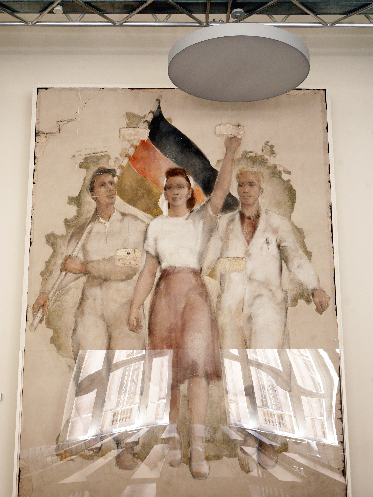
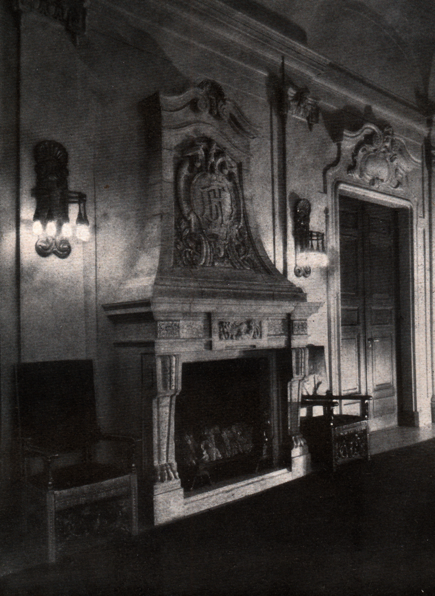
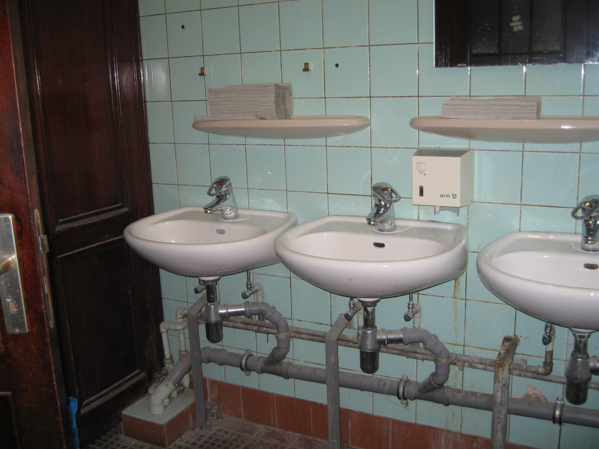

### Ein Gebäude, eine Recherche

Drei Stufen, eine außerordentlich schwere Tür, ein Dutzend weitere
Stufen, eine leichtgängige Kipptür. Dann steht man im Foyer, sieht
halbrechts ein Treppenhaus in höhere Etagen schwingen und links einen
Kaffeeautomaten zu wenig Licht in eine dunkle Ecke werfen. Es gibt ein
paar Säulen. Es gibt hier und da ein paar Menschen, die zu einem Seminar
eilen, das schon fünf Minuten läuft und sich den bösen oder
indifferenten Blick eines/r Dozenten/in einfangen, je nach Gemüt und
Stimmungslage. Es gibt Erinnerungen in unüberschaubarer Menge, viele
vergraben, die wenigsten notiert. Erinnerungen an die Dorotheenstraße,
vormals Clara-Zetkin-Straße, vormals Dorotheenstraße - Nummer 26
beziehungsweise 8. Für die Berliner und vielleicht auch die deutsche
Bibliothekswissenschaft bzw. Bibliotheks- und Informationswissenschaft
(gebräuchliche Abkürzung erst IB, dann IBI) ist das ein Identitätsort.
Und ebenso für alle, die es mit diesem Fach an der Humboldt-Universität
einmal versuchten.

Dabei residiert sie noch gar nicht so lange an diesem Ort, der denkbar
passend ist, weil er genau im Dreieck von Staatsbibliothek Haus 1
(früher Königliche Bibliothek) und dem Hauptgebäude der
Humboldt-Universität eine Kreuzung schmückt, deren
Fußgängerampelschaltungen den Fußgängern traditionell wenig bedeuten und
deren Straßenbahngleis jeweils zu Beginn des Semesters die Vorderräder
von Berliner Fahrradneulingen aus der Balance heben. Man kann auf dem
Balkon des PC-Raums in der ersten Etage das Kreuzungsgeschehen sehr gut
beobachten. Der andere Balkon zeigt zum aktuellen Eingang der
Staatsbibliothek, der lange Eingang zur zentralen Bibliothek der
Humboldt-Universität war, bis diese zeitweilig in Charité-Nähe in die
Hessische Straße und dann an die S-Bahntrasse unweit des Bahnhofs
Friedrichstraße zog. Dieser Balkon ist fotogener und man ist dort immer
in Gesellschaft. Zwei steinerne Buchhalter mit denkbar heroischen
Körperformen rahmen jeden, der von dort auf die Passantinnen und
Passanten blickt. Die Aufmerksamen unter ihnen schauen zurück.
Weltreisende machen auch gern ein Foto. Das ist Berlin.

Glück hatte sie schon, die Bibliothekswissenschaft der
Humboldt-Universität und vielleicht auch ein bisschen ein schlechtes
Gewissen angesichts der Bestlage im Herzen der Hauptstadt. Gut, den
Innenhof mit Betonboden, auf dem ein paar Zentimeter Erde jeder
Generation neu die Möglichkeit eines Gartens vorgaukelt, konnte man
eigentlich nur zum Fahrradabstellen benutzen. Eine Kastanie hatte es
immerhin bis über das Dach hinaus geschafft und es sollte bis spät in
die 2010er Jahre dauern, bis sie gefällt, zersägt und aus den Augen und
dem Sinn getragen wurde. Nicht ganz, vielleicht, denn sie bleibt ja doch
in der Erinnerung. In manchem Winter kampierte im Gebäude jemand, der
sonst kein Obdach hatte, versteckt im hinteren Treppenhaus, ungestört
vom noch nicht wiederhergestellten Fahrstuhl, der erst aufgrund der
Klage einer zeitweilig hochschulweit sehr bekannten Rollstuhlfahrerin
instand gesetzt wurde und bei dessen Umbau etliche Brieftaschen und
Porte­mon­naies geborgen wurden, die die Berliner Taschendiebe an einem
stillen Ort entsorgt hatten. Die Dorotheenstraße hatte auch die wilden
1990er erlebt, wenn auch eher unfreiwillig und selten unter Beteiligung
von Bibliothekswissenschaftler\*innen. Cruising und Voyeurismus waren
erstaunlich häufig Themen bis knapp über die Jahrtausendwende. Ein
zentraler PC-Pool im Obergeschoß hielt das Haus ja an sechs Tagen der
Woche offen. Die neben ihm befindliche Zweigbibliothek
Bibliothekswissenschaft schloß deutlich früher. An der Nordseite des
Bibliothekssaals befand sich gut verdeckt und weithin vergessen die
Vorzeichnung eines frühsozialistischen Wandgemäldes aus einer Zeit, in
der man auch in Ostberlin noch die Parole der Wiedervereinigung
hochhielt. Arbeiter, Bäuerin und Ingenieur marschieren unter einem
wappenlosen Schwarz-Rot-Goldenen Banner vor einer Deutschlandkarte, die
die Oder-Neiße-Friedensgrenze kennt aber noch keine innerdeutsche.
Tatsächlich brauchte es die Wiedervereinigung und nochmal zwölf Jahre um
diese Spur Geschichte freizulegen. Jetzt marschiert das Trio halb hinter
Glas Richtung Vorlesungssaal, denn den Luxus einer
bibliothekswissenschaftlichen Institutsbibliothek gibt es nicht mehr.
Die Dinge, die verschwinden.

Ist das zu bedauern? Vielleicht. Aber natürlich sind für das Institut
für Bibliothekswissenschaft auch Dinge verschwunden. Und ebenso für das
Gebäude, das überhaupt nicht mit dem Ziel, eine Hochschuleinrichtung zu
schaffen, erbaut wurde. Eine Handelskammer sollte es sein, massiv und
repräsentativ. Wilhelm Cremer und Richard Wolffenstein wussten, was
erwartet wird. Cremer & Wolffenstein waren eine Marke und zugleich, wenn
man so will, eine Hausnummer der Berliner Architekturszene der Wende vom
19. zum 20. Jahrhundert. Sie hatten etwa den zweiten Platz bei der
Ausschreibung für den Reichstag belegt. Zahlreiche Synagogen, von denen
nach dem volksdeutschen Irrsinn fast nichts blieb, stammten von ihren
Reißbrettern. Der verschwundene Hochbahnhof am Nollendorfplatz ebenso,
oder auch das verschwundene Warenhaus Tietz am Alexanderplatz. Das
Warenhaus Tietz in Hamburg steht heute immerhin noch und ist als
Alsterhaus bekannt. Auch noch vorhanden: das ehemalige Kaufhaus
Brenninkmeyer am Kreuzberger Oranienplatz, heute Hotel Orania,
umstrittenes Symbol der Gentrifizierung eines einst hochdynamischen
Stadtviertels des wilden Berlins. Von da ist es gar nicht weit zur
Stadtbibliothek am Kottbusser Tor. Von da war es gar nicht weit zur
ehemaligen Bona-Peiser-Bibliothek, in der jenseits des Moritzplatz
auslaufenden Oranienstraße. Auch diese ließ sich nicht retten.

### Zwei Exkurse

#### Exkurs: Maison d'Orange

Zweihundert Jahre bevor Cremer & Wolffensteins wuchtiger Block die Ecke
markierte, wurde das Maison d'Orange gegründet und dieses fand ebenfalls
an der Dorotheenstraße, auch in der Nummer 26, aber vielleicht doch an
einer anderen Stelle[^1], seinen Platz. Die Rekonstruktion in der Zeit
mit teils unzuverlässigen Quellen macht es nicht leicht und auch wenn
der Gang zur Einsicht in historische Liegenschaftskataster reizvoll ist,
so war er für diese Rückschau nicht umsetzbar. Selbst wenn das Hospiz
also ein paar hundert Meter entfernt vom Standort des aktuellen
IBI-Gebäudes lag, so war es doch in der Nähe. Und das reicht uns als
Linie in die Vergangenheit. Das Maison für die französische Emigranten
blieb bis 1792 in einem eher zierlichen Bau, der 1794 durch einen
repräsentativeren Neubau ersetzt wurde. Der wechselte 1883 den Besitzer
und das Maison d'Orangen den Standort. Es befand sich von nun an in der
Ulmenstraße.

Der Name des Armenhauses verweist auf die Herkunft der
Glaubensflüchtlinge aus dem südfranzösischen Fürstentum Orange, dessen
Name nicht von der Farbe, sondern von einer homophonen Ableitung von --
okzidentalisch -- *Aurenja* stammt, Name der zentralen und gleichnamigen
Stadt des Fürstentums in Anlehnung an den Wassergott Arausio. Der
schaffte es allerdings nicht ins Stadtwappen. Stattdessen findet man
dort auch heute noch drei Orangen. Das Fürstentum fiel nun 1702 dem
französischen Königshaus zu, welches im Rahmen der Rekatholisierung
Frankreichs die Angehörigen der calvinistischen Gemeinde die Ausreise
befahl. Für nicht wenige dieser dritten Welle calvinistischer
Flüchtlinge (nach der ersten 1680 in Folge der Aufhebung des Edikt von
Nantes in Frankreich, wovon Orange nicht betroffen war, und der zweiten
in den 1690ern aus der Schweiz) hat das brandenburgische Fürstenhaus und
die französisch-calvinistische Gemeinde in Brandenburg die gleichen
Unterstützungsstrukturen und-maßnahmen ergriffen, die schon bei den
ersten beiden Wellen etabliert wurden. Unter anderem wurde für die
Bedürftigen ein Armenhaus, eben das Maison d'Orange, errichtet, in
welchem allerdings (wie auch in den anderen Armenhäusern dieser Zeit)
strenge Arbeitszucht galt. Eine Besonderheit war, dass das Haus (wie
ähnliche Armenhäuser der hugenottischen Gemeinde) durch eine Kollekte
finanziert wurde, bei der allerdings diesmal der Großteil des Geldes in
Großbritannien eingenommen wurde. Deshalb hatte der britische Gesandte
in Berlin bis 1914 auch die Aufsicht über die Stiftung des Hauses.

Ob dieser sich häufiger in die Nachbarschaft Dorotheenstraße 8, die
später die 26 sein sollte, begab, ist nicht so leicht rekonstruierbar.
Gründe gab es aber einige. Vielleicht logierten Gäste im Central-Hotel
vis-à-vis zum Bahnhof Friedrichstraße. Vielleicht besuchte er den
Admiralsgarten in der Prinz-Louis-Ferdinand-Straße, die heute
Planckstraße heißt. Von den akademischen Bierhallen in der
Dorotheenstraße hielt er sich vermutlich eher fern. Aber vielleicht ging
er zum Institut für Meereskunde und dem dortigen Museum für Meereskunde,
das sich seit 1906 an der Georgenstraße befand, dort wo heute unter
anderem das Institut für Rehabilitationswissenschaften der
Humboldt-Universität seinen Sitz hat. Und dass dieses Museum für
Meereskunde eine sehr bewegte und bibliothekswissenschaftlich
interessante Geschichte hat, wollen wir es auch noch einmal an die
Oberfläche holen.

#### Exkurs: Museum für Meereskunde

Das Gebäude des Instituts liegt in einem Straßenblock, welcher heute
durch eine Anzahl von Gebäuden (unter anderem dem Institut für
Sozialwissenschaften, dem bereits erwähnten Institut für
Rehabilitationswissenschaften sowie einem Parkhaus) mit genutzt wird.
Für viele Jahre war dies allerdings nicht der Fall. Ende des 19.
Jahrhunderts wurde der Block vom Laborgebäude des Chemischen Instituts
der Berlin geprägt, welches den größten Teil des Blocks einnahm. In
dieses Gebäude zog dann 1900 das "Institut für Meereskunde" ein. Am 5.
März 1906 fuhr Kaiser Wilhelm II. vor und eröffnete am Standort das
Museum für Meereskunde, in dem Wissenschaft und Volk gemeinsam die Meere
und das Seewesen verstehen lernen sollten. Angebunden war das Museum an
das Geographische Institut der Berliner Universität und zwar unter
anderem über Albrecht Penck der nach dem Tod des Gründungsdirektors
Ferdinand von Richthofen sowohl das Institut als auch das Museum
leitete. Es wurde schnell recht populär. Für das Berichtsjahr 1913 wurde
über 135.000 Besucher verzeichnet.

Für das Institutsgebäude ist das Museum für Meereskunde aus zwei Gründen
interessant: Einerseits stößt man wegen der räumlichen Nähe bei
Recherchen zum Gebäude ständig auf dieses Museum, andererseits war das
Museum 1929 -- also als das bibliothekswissenschaftliche Institut in
Berlin gerade erst eingerichtet worden war -- schon wieder zu klein und
es gab (laut einer Werbeschrift[^2]) den Plan, es durch Erwerb des
restlichen Geländes um das Museum herum, zu erweitern. Hierzu kam es
nicht, aber eine Verwirklichung hätte möglicherweise einen Abriss des
heutigen Institutsgebäudes bedeutet.

Auch wenn es vom Namen her nicht zwingend so klingt, hatte das Museum
doch namhafte Unterstützung durch das deutsche Militär, insoweit gab es
Chancen, dass dieser Plan umgesetzt werden könnte. Gegründet wurde es zu
einer Zeit des aktiven deutschen Kolonialismus und es war auch eine
Forschungsstelle für koloniale Wissenschaft. 1898 war das erste
Flottengesetz erlassen worden, mit dem der Aufbau einer deutschen
Militärmarine begonnen wurde. Das Museum sollte helfen, den Ruf
derselben in der deutschen Gesellschaft zu verbessern.[^3] Diese
Verbindung zur Marine und die positive Darstellung derselben änderte
sich auch in der Weimarer Republik und im Nationalsozialismus nicht.
Immer ging es darum, über die Meereskunde eine Begeisterung für Kolonien
und die Marine zu generieren. Die Ausweitung wurde nur zurückgestellt.

Der Weltkrieg ließ das Museum im Vergleich zu den anderen Berliner
Museen besonders schwer beschädigt zurück. Aber einige Schiffsmodelle,
das Schau- und Versuchsbecken, ein Taucheranzug für Tiefseeerkundungen
und einige Schiffsmotoren waren noch vorhanden und intakt und so bestand
doch zunächst Hoffnung auf Wiederaufbau und Neueröffnung. Die
Öffentlichkeit hatte allerdings seit 1945 keinen Zutritt mehr,
wenngleich im März 1946 der 40. Eröffnungstag des Hauses so feierlich
wie unter diesen Bedingungen eben möglich begangen wurde. Zwei Räume
wurden dafür instand gesetzt: Ein kleiner Hörsaal für Studierende und
ein Bibliotheksraum. Bald jedoch verabschiedete man sich von weiteren
Plänen für das Museum. Zu groß waren die Schäden und zu klein die
Notwendigkeit, ausgerechnet diese Objekte zeitnah wiederherzustellen. In
den 1950er Jahren ließ man daher die Räume zum Beispiel den Bildhauer
Fritz Koelle, der in einer Art Notatelier zum Beispiel Hochöfner, die im
Wortsinne an Hochöfen tätigen Arbeiter, und Landarbeiterinnen formte,
die jeweils drei Meter groß als neue allegorische Figuren ihre verloren
gegangenen Vorgänger vom Dach des Hauptgebäudes der Humboldt-Universität
ersetzen und vom neuen Menschen künden sollten. In Berliner
Verzeichnissen blieb das Museum für Meereskunde allerdings mit dem
Zusatz "noch nicht eröffnet" unter der Rubrik "Museen" gelistet.

In den 1950er Jahren zog das "Institut für angewandte Kunst" in ein
offenbar dafür taugliches Kreuzgewölbe der Ruine und später dann als
"Zentralinstitut für Gestaltung" in die Dorotheenstraße 28. Ab 1959
begann, nachdem die Abteilung Denkmalpflege des Magistrats abgewunken
und den Bau als historisch nicht wertvoll klassifiziert hatte, der
Abriss, wobei zur Freude unter anderem der Berliner Presse weitere
verschüttete und verloren geglaubte Museumsobjekte wieder zu Tage kamen,
so zum Beispiel fünf Boote im März des gleichen Jahres. Diese wurde erst
einmal unweit direkt in der Georgenstraße auf die Straße gestellt, womit
das Museum in gewisser Weise ein letztes Mal etwas für die Berliner zur
Schau stellte. Endgültig aufgegeben wurde es mit der Teilung Berlins.
Die museale Meereskunde der DDR konzentrierte sich fortan in Stralsund.
Wo in Berlin das Museum war, erstreckte sich nun ein Parkplatz und eine
Schleife der Berliner Straßenbahn. Im Zuge der Neugestaltung des
Zentrums von Ostberlin wuchs dieses Ensemble wiederum Ende der 1980er
Jahre mit einem Parkhaus für das Renommierobjekt des Internationalen
Handelszentrums und einigen Funktionsbauten zu.

Seine seit Eröffnung öffentliche zugängliche und umfangreiche Bibliothek
erhielt das Deutsche Technikmuseum in Berlin, welches de facto die --
zivile -- Nachfolge des Museums für Meereskunde übernahm und den größten
Teil dieser Bibliothek auch heute noch betreut. (Stahlberg 1929:10, zur
Geschichte dieser Bibliothek siehe Böndel 1996 und Curtius 1996). Dies
war möglich, weil die Bibliothek, wie auch zahlreiche andere
Museumsobjekte, sich durch Auslagerung nach dem Zweiten Weltkrieg in den
westlichen Besatzungszonen befanden und dann in einigen anderen Museen
landeten, ein Großteil davon in Berlin.

### Das Gebäude des Instituts für Bibliothekswissenschaft

Das Gebäude der Handelskammer in der Dorotheen- beziehungsweise
Clara-Zetkin-Straße blieb all die Jahre eine Art steinerne Zeugenschaft
zunächst zum Verschwinden des Museums für Meereskunde und später der
DDR. Das Baujahr des Gebäudes wurde, leicht versteckt und daher leicht
zu übersehen, an die Unterseite des Balkons mit bestem Kreuzungsblick
gehängt. Erbaut 1904, parallel, wenngleich deutlich schneller, zur
Königlichen Bibliothek. Auch heute beeindruckt es noch.

Das zweigeschossige, fünfachsige Gebäude zeigt der Dorotheenstraße
jeweils vier große Fenster, wobei die Fenster im ersten Obergeschoss mit
zwei kleinen Säulen unterteilt sind, die im wesentlich höheren zweiten
Geschoss unterbrochen durch französische Balkone als Pfeiler fortgeführt
werden. Im Erdgeschoss sind, statt der großen repräsentativen Fenster,
jeweils zwei kleine Fenster mit Rundbogen in den Rhythmus der Fassade
eingefügt. Es handelt sich um eine Neubarock-Fassade aus Sandstein mit
Figuren des Bildhauers Ernst Westphal (1851--1926), der in Berlin unter
anderem Dekorelemente am Berliner Admiralspalast und Schmuckelemente des
Rathaus Charlottenburg erschaffen hat.[^4] Das Figurenprogramm besteht
aus zwei überlebensgroßen, halb liegenden Lesenden, die mit einem Tuch
um die Hüften bekleidet sind. Die beiden Figuren sind oberhalb links und
rechts neben dem Eingangsportal platziert, in deren Mitte der Balkon
eingefasst ist.

Inhaltlich scheinen sich die beiden Figuren der heutigen Verwendung des
Gebäudes als Sitz der Bibliotheks- und mittlerweile auch
Informationswissenschaft zu fügen, wenngleich deren adonishaftes und
leichtbekleidetes Erscheinungsbild eher an griechische Gottheiten
angelehnt zu sein scheint als an sterbliche Studierende. Da die lesenden
Figuren nun aber für den Sitz der Berliner Handelskammer erschaffen
wurden, verweisen sie mutmaßlich eher allegorisch auf Eigenschaften wie
Gelehrtheit und Gründlichkeit, die die Mitarbeiter der Handelskammer
(hoffentlich) innehatten, die zugleich wiederum auch den Studierenden
traditionell gut anstehen. Im Obergeschoß lud die Handelskammer ab und
an zum Tanz im eigenen Ballsaal mit Kamin. Nach Einzug der
Bibliothekswissenschaft lud man in denselben Raum zum Seminar, manchmal
aber auch zu einer Semesterabschluss-Fete, ganz ohne sich der Tradition
bewusst zu sein und ihr doch irgendwie folgend.

Bis 1945 blieb das Haus Handelskammer und während gleich gegenüber der
Lesesaal der Staatsbibliothek Opfer eines Bombeneinschlags wurde, blieb
das Gebäude erstaunlich intakt. Einzig das Dach wurde schwer beschädigt
und deutlich schlichter als vorher rekonstruiert.[^5] Die Fassade
freilich trägt bis heute etwas hilflos verspachtelte Narben des
Endkampfs um die Reichshauptstadt. Seit 1946 wurde das Gebäude von der
Universität genutzt und 1950 erfolgte der Umbau.[^6]

Ab 7. März 1951 stand das mittlerweile zur Humboldt-Universität
gehörende Haus dann nicht mehr in der Dorotheenstraße. Statt der
Kurfürstin sollte nun an eine Sozialistin und Frauenrechtlerin denken,
wer hinter der Humboldt-Universität den Weg zur Museumsinsel oder
Friedrichstraße einschlug. Clara-Zetkin-Straße 8, später 26, hieß es bis
immerhin 1995 und dann wieder Dorotheenstraße, da sich, wie berichtet
wurde, der Einheitskanzler Helmut Kohl persönlich daran störte, dass
Regierungsbauten der - nun wieder - Hauptstadt den Namen einer
Sozialistin im Briefbogen hätten. Die ehemalige Handelskammer gab in der
Zwischenzeit diversen Einrichtungen der Humboldt-Universität Obdach und
auch, weshalb vermutlich die Bibliothekswissenschaft am Ende dort
einziehen durfte, seit Ende der 1950er Jahre der Fachschule für
wissenschaftliche Information und wissenschaftliches Bibliothekswesen
ein Domizil.

Das aus dem zuvor mit der Postadresse Universitätsstraße 7 versehenen
Institut für Bibliothekswissenschaft und wissenschaftliche Information
hervorgegangene, nun neu aufgestellte Institut für
Bibliothekswissenschaft der Humboldt-Universität (damals noch IB) zog
erst 1994/95 in das Gebäude. Die Identifikation mit dem Gebäude schien
sich nicht allzu stark entfalten und blieb bis zur Sanierung 2009, bei
der beide Hörsäle erneuert sowie das Dach 2014 wieder in die
ursprüngliche Vorkriegs-Form gebracht wurde[^7], eher verhalten bis
negativ geprägt, nicht zuletzt wegen des maroden Zustandes,
beispielsweise der sanitären Anlagen. Dass diese als Rückzugsorte für
alles Mögliche benutzt wurden, wovon hin und wieder auch Spritzenfunde
zeugten, verbesserte die Situation nicht sonderlich. Die Kinder vom
Bahnhof Zoo prägten zweifellos das Bild Berlins. Aber man wollte es
nicht derart authentisch zwischen zwei Vorlesungen nacherleben müssen
und das *Chic* im Heroin Chic der 1990er war eben überhaupt nicht
schick, sondern nur eine zynische Lüge. Alles vorbei, in diesem Fall
glücklicherweise und auch die doch hier und da auftauchenden Tags und
Kritzeleien in den Sanitärzellen sind nicht mehr so extrem sexualisiert,
dicht gesetzt und vulgär wie in diesen Jahren.

Selbst wenn man nur ein bestimmtes Zeitfenster des Gebäudes erinnert,
muss man unvermeidlich staunen und staunen und staunen, wie sich
Zeitschicht auf Zeitschicht legt. In einer Nische gibt es dann noch
sogar ein fünfundzwanzig Jahre altes Graffiti. Die Renovierung erfolgt
als Patchwork. Ein neuer Aufbau sitzt da, wo mancher ein bisschen
todesmutig während einer Studierendenfete mal übers Eck aufs Dach stieg
und dem Fernsehturm zuprostete. Der ehemalige Dachboden ist kein wilder
Taubenschlag mehr, sondern ein blitzsauberer Lehrbereich. Das
Haupttreppenhaus bleibt bis heute seinem alten Anstrich treu. Die Stufen
selbst geben Zeugnis von einem Zeitalter, in dem auch Funktionsgebäude
repräsentativ gestaltet wurden.

Vivien Petras sagt in ihrem Interview in dieser Ausgabe zum Gebäude:
"Ich liebe dieses Gebäude, ich liebe die 'Harry Potter'-Treppe, ich
liebe die großen Hallen --- und ich habe genügend Fantasie, um mir das
'schön' vorzustellen \[lacht\]. Es ist aber nicht untrennbar mit dem IBI
verbunden. \[\...\] Und die Frage ist: Brauchen wir überhaupt ein
[Gebäude]{.underline}? Ich denke, wir bräuchten viel mehr moderne
Informationstechnologie."[^8]

Brauchen wir überhaupt ein Gebäude? Wir denken schon. Nicht zwingend als
Gefäß zur Vermittlung bestimmter Lehrinhalte, auch wenn das iLab im
Kellergeschoß nun wirklich ein zeitgemäßer und großartiger Raum ist.
Sondern weil ein gemeinsamer Ort auch ein gemeinsames Empfinden, also
geteilte Identifikation und Identität hervorbringt. Je markanter das
Gebäude, desto schneller stellt sich dieses Gefühl ein. Für die
Generationen der Direktstudierenden seit 1995 eröffnete es einen
vielfältigen, einzigartigen Erlebens- und Erinnerungsraum, in dem man
auf jedem traditionell alljährlich am ersten Novemberwochenende
stattfindenden Alumnitreffen sofort zurückkehren kann. Dass es nach 2002
zu einer derartig umfassenden und wirksamen Mobilisierung der
Studierenden gegen die Schließungspläne des damaligen Präsidiums der
Humboldt-Universität um Jürgen Mlynek kam, lag mit Sicherheit auch
daran, dass es einen festen und zentralen Anlaufpunkt, also einen
Identifikationsort, zur Bündelung dieser Aktivitäten gab. Natürlich ist
bibliothekswissenschaftliche Forschung auch ohne dieses Haus möglich.
Aber vermutlich wäre sie heute nicht an dem Institut an der
Humboldt-Universität realisierbar, wenn es nicht diesen Ort, diese Räume
und damit die Möglichkeiten zur Bündelung eines entsprechenden
Engagements gegeben hätte.

Nicht zuletzt hat sich die Redaktion der LIBREAS. Library Ideas in ihrer
ersten Zusammensetzung in diesem Ort gefunden. In den ersten,
experimentellen Jahren dieser Zeitschrift waren die großen leeren
Hallen, die leicht dystopisch-romantische Stimmung, wenn die Sonne durch
die großen Fenster strahlt, aber doch viele Ecken vom Licht unerreicht
scheinen und das Refugium des Fachschaftsraumes der Ort, wo die meiste
redaktionelle Arbeit an den Ausgaben geleistet wurde.

### Quellen

Böndel, Dirk: Auslagern, Einlagern, Verlagern. In: Museum für Verkehr
und Technik Berlin : Aufgetaucht. Das Institut und Museum für
Meereskunde im Museum für Verkehr und Technik Berlin. (Berliner Beiträge
zur Technikgeschichte und Industriekultur, Schriftenreihe des Museums
für Verkehr und Technik Berlin, 15). Berlin: Nicolaische
Verlagsbuchhandlung Berlin, 1996, 27--32.

Curtius, Andreas: Die Bibliothek des Instituts für Meereskunde. In:
Museum für Verkehr und Technik Berlin: Aufgetaucht. Das Institut und
Museum für Meereskunde im Museum für Verkehr und Technik Berlin.
(Berliner Beiträge zur Technikgeschichte und Industriekultur,
Schriftenreihe des Museums für Verkehr und Technik Berlin, 15). Berlin:
Nicolaische Verlagsbuchhandlung Berlin, 1996, 55--59.

Hiller, Karl: Der Bauplastiker Ernst Westphal (1851--1926). Berlin 2013.
[http://www.karl-hiller.de/wp-content/uploads/2013/01/Karl%20Hiller%20%282013%29%20Der%20Bauplastiker%20Ernst%20Westphal.pdf](http://www.karl-hiller.de/wp-content/uploads/2013/01/Karl%20Hiller%20%282013%29%20Der%20Bauplastiker%20Ernst%20Westphal.pdf)
\[zuletzt aufgerufen: 1.11.2018\].

Institut für Denkmalpflege (Hrsg.): Die Bau- und Kunstdenkmale in der
DDR. Hauptstadt Berlin I. Abteilung Forschung Gesamtredaktion Heinrich
Trost. Henschelverlag Berlin, 1984.

Landesdenkmalamt Berlin: Handelskammer Berlin.
[http://www.stadtentwicklung.berlin.de/denkmal/liste\_karte\_datenbank/de/denkmaldatenbank/daobj.php?obj\_dok\_nr=09080414](http://www.stadtentwicklung.berlin.de/denkmal/liste_karte_datenbank/de/denkmaldatenbank/daobj.php?obj_dok_nr=09080414)
\[zuletzt aufgerufen: 1.11.2018\].

Probst, Bettina: Das Institut und Museum für Meereskunde -- Eine bewegte
Geschichte. In: Museum für Verkehr und Technik Berlin (1996):
Aufgetaucht. Das Institut und Museum für Meereskunde im Museum für
Verkehr und Technik Berlin. (Berliner Beiträge zur Technikgeschichte und
Industriekultur, Schriftenreihe des Museums für Verkehr und Technik
Berlin, 15). Berlin: Nicolaische Verlagsbuchhandlung Berlin, 1996,
11--25.

Stahlberg, Walter: Das Institut und Museum für Meereskunde an der
Friedrich Wilhelms-Universität in Berlin. Als Handschrift gedruckt.
Berlin : \[Museum für Meereskunde\], \[1929\].

Technische Abteilung der Humboldt-Universität zu Berlin: Dorotheenstr.
26,
[https://www.hu-berlin.de/de/ueberblick/campus/mitte/standorte/dorotheenstrasse-26/dorotheenstrasse-26](https://www.hu-berlin.de/de/ueberblick/campus/mitte/standorte/dorotheenstrasse-26/dorotheenstrasse-26)
\[zuletzt aufgerufen: 1.11.2018\].

Dorotheenstr. 26 Dacherneuerung,
[https://www.ta.hu-berlin.de/915](https://www.ta.hu-berlin.de/915)
\[zuletzt aufgerufen: 1.11.2018\].

Wenzel, Gerhard: "Dein Armer!": Das diakonische Engagement der
Hugenotten in Berlin von 1672 bis 1772. Diakonie zwischen Ohnmacht,
Macht und Bemächtigung. (Studien zur Kirchengeschichte; 25) Hamburg:
Verlag Dr. Kovač, 2016.

Westpfahl, Ernst. In: Hans Vollmer (Hrsg.): Allgemeines Lexikon der
Bildenden Künstler von der Antike bis zur Gegenwart. Begründet von
Ulrich Thieme und Felix Becker. Band 35: Waage-Wilhelmson. E. A.
Seemann, Leipzig 1942, 455.

[^1]: Die Nummerierung der Straße hatte sich über die Jahre mehrfach
    verändert.

[^2]: Stahlberg 1929, 9f.

[^3]: Siehe Probst 1996.

[^4]: Siehe Vollmer 1942, 455 und Hiller 2013.

[^5]: Siehe Technische Abteilung:
    [https://www.ta.hu-berlin.de/915](https://www.ta.hu-berlin.de/915)

[^6]: Siehe TA:
    [https://www.hu-berlin.de/de/ueberblick/campus/mitte/standorte/dorotheenstrasse-26/dorotheenstrasse-26](https://www.hu-berlin.de/de/ueberblick/campus/mitte/standorte/dorotheenstrasse-26/dorotheenstrasse-26)

[^7]: Siehe ebenda:
    [https://www.ta.hu-berlin.de/915](https://www.ta.hu-berlin.de/915)

[^8]: Vgl. das Interview mit Prof. Vivien Petras, PhD und Prof. Dr. Elke
    Greifeneder geführt von Thomas Roesnick (20.06.2018) in dieser Ausgabe: [http://libreas.eu/ausgabe34/interview-roesnick/].
