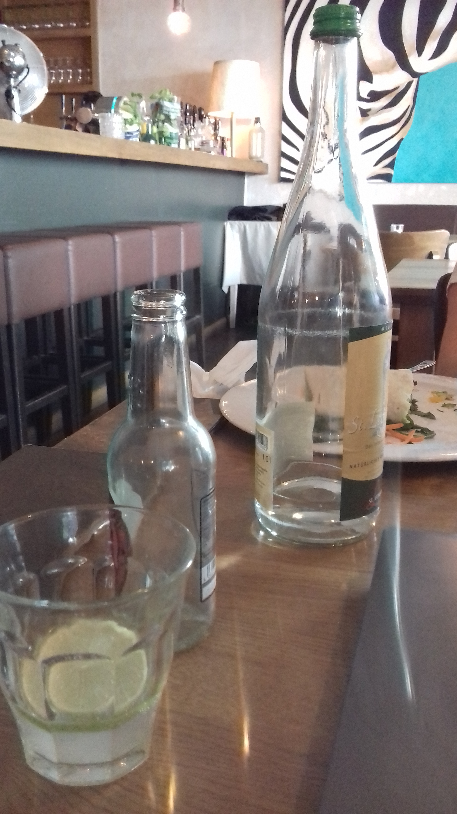

Die Redaktion der LIBREAS. Library Ideas ist -- was wohl bekannt ist --
eng mit dem Institut für Bibliotheks- und Informationswissenschaft
verbunden, ohne dass Institut und Redaktion zusammengehören würden. Das
Institut hat die LIBREAS mehrfach unterstützt, als sie als Projekt
gegründet wurde, als sie in den ersten Jahren die Infrastruktur des
Instituts nutzen durfte und auch in Auseinandersetzungen für die
Namensrechte -- und tut dies weiterhin, zuletzt als das Institut den
Besitz der Wortmarke LIBREAS für weitere zehn Jahre sicherte, wofür wir
natürlich sehr dankbar sind. Grundsätzlich aber ist die LIBREAS schon
länger "ausgezogen", mit eigenem Verein und selbst-organisierter (und
finanzierter) Infrastruktur.

Kurz: Die LIBREAS ist nicht die Hauszeitschrift des Instituts. Zugleich
besteht die gesamte Redaktion aus ehemaligen Studierenden des Instituts,
die zu einem großen Teil dort auch gearbeitet haben, zum Teil weiter
arbeiten, promovierten oder noch promovieren. In der Geschichte der
Redaktion war das nicht immer so und es muss auch nicht so bleiben. Die
Verbindungen zum Institut aber bleiben. Fraglos hat es unser aller Leben
entscheidend beeinflusst.

Dass dieses nun eine 90-Jahr-Feier plant -- genauer, wie Hans Lutz in
einem Beitrag bemerkt, den wir in dieser Ausgabe republizieren, 90 Jahre
der Verlegung des Lehrstuhls nach Berlin -- war für die Redaktion
Anlass, danach zu fragen, was in diesen 90 Jahren in der
Bibliotheks\*wissenschaft in Berlin eigentlich passiert ist. Das ist
interessant, schon weil diese 90 Jahre mehrere Diktaturen und
Gesellschaftsformen umfassen, eine Vielzahl von Personen und ihre
Biographien, viele Neuanfänge und wohl auch Diskussionen, die wieder
aufblühten, verblassten und häufig über die Zeit wieder vergessen
wurden.

Das jetzt entstandene Heft gibt einen gewissen ersten Einblick in diese
Geschichte, aber selbstverständlich lässt sich dies in alle Richtungen
erheblich weiter ausbauen. Es fällt zum Beispiel auf, dass vor allem die
letzten Jahre -- also nach 1990 -- thematisiert werden. Die
Gründungsgeschichte wird durch drei wiederveröffentlichte Texte
repräsentiert. Alles andere dazwischen fehlt praktisch. Auch wird kaum
über den Gegenstand, Benennung oder Methodik der Bibliothekswissenschaft
nachgedacht. Wir hoffen deshalb, wie immer übrigens, dass die Beiträge
in der Ausgabe Ausgangspunkt weiterer Diskussionen und historischer
Nachforschungen werden. Ein Einfluss, den unsere Ausbildungen am
Institut auf unser Leben hatte, war nämlich, dass wir alle im Nachhinein
den Eindruck hatten, dass gerade die Diskussion über die
Wissenschaftlichkeit und Methodik der Bibliotheks\*wissenschaft zu kurz
kam. Dies überraschte und überrascht im Prinzip jede Generation von
Studierenden neu, vor allem, da es sich beim IBI bekanntlich um die
einzige bibliotheks- und informationswissenschaftliche Institution mit
Promotionsrecht im gesamten deutschsprachigen Raum handelt, eine gewisse
theoretische Orientierung und Fundierung also vorausgesetzt werden kann.
Man könnte es auch positiv formulieren: Wo feste Vorgaben hinsichtlich
wissenschaftlicher Methode und Ausrichtung des Faches fehlen, fällt der
Diskurs umso lebhafter und freier aus. Und ohne diese Freiheit gäbe es
die LIBREAS vermutlich nicht.

Diese Ausgabe ist auch deshalb eine besondere, weil sie zusammen mit
Studierenden des IBI-Projektseminars "90 Jahre IBI" im Sommersemester
2018 entstanden ist. Das Seminar wurde von Kirsten Schlebbe geleitet.
Unter dem Motto "Vergangenheit, Gegenwart und Zukunft des IBI" haben die
Studierenden Interviews mit aktuellen und ehemaligen Professorinnen und
Professoren, Mitarbeitenden und Studierenden des Instituts geführt. Für
die Zusammenarbeit und das Engagement danken wir dem "Team LIBREAS" sehr
-- diese Kooperation ist umso schöner, weil die LIBREAS von Anfang an
auch als Publikationsort für Studierende gedacht war und ist, um
Publikationserfahrungen zu sammeln.

In dieser Tradition wollen wir als LIBREAS. Library Ideas, nicht nur in
dieser Ausgabe, einen Ort für Debatten, Diskussionen und Reflexionen zur
Verfügung stellen.

Das IBI haben die meisten Redaktionsmitglieder\*innen in ihrer
Studienzeit als angenehmen, offenen und unterstützenden Ort in
Erinnerung. Wir sind froh, dass das Institut heute weiter existiert und
damit die Möglichkeit bietet, sich an den genannten Fragen abzuarbeiten.
Wir sind auch weiterhin dankbar für die Unterstützung des Instituts und
auch für seine Offenheit gerade uns, die ja gerne Kritik äußern, zu
unterstützen. Und wir hoffen, dass die Einblicke in die Geschichte von
Institut und Profession, welche dieses Heft bietet, Sie, die
Leser\*Innen, interessiert und zu eigenen Arbeiten anregt.

Ihre / Eure Redaktion LIBREAS. Library Ideas

(Berlin, Chur, Dresden, Göttingen, München)
