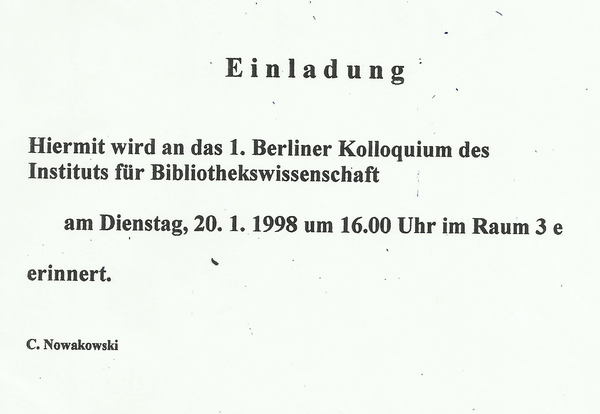
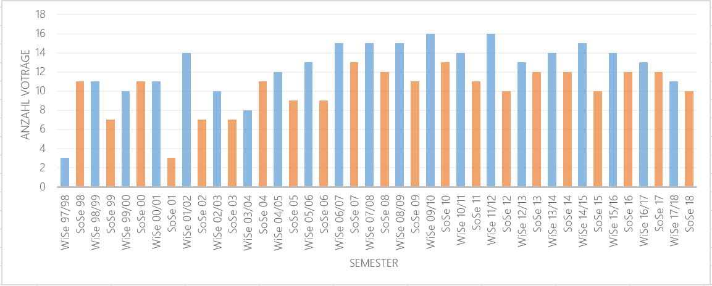
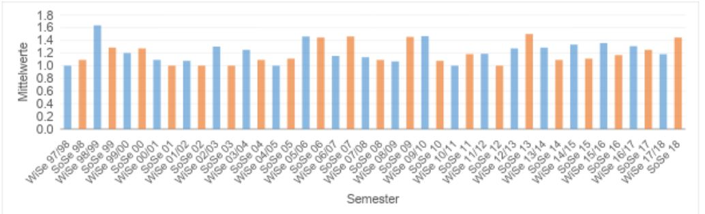
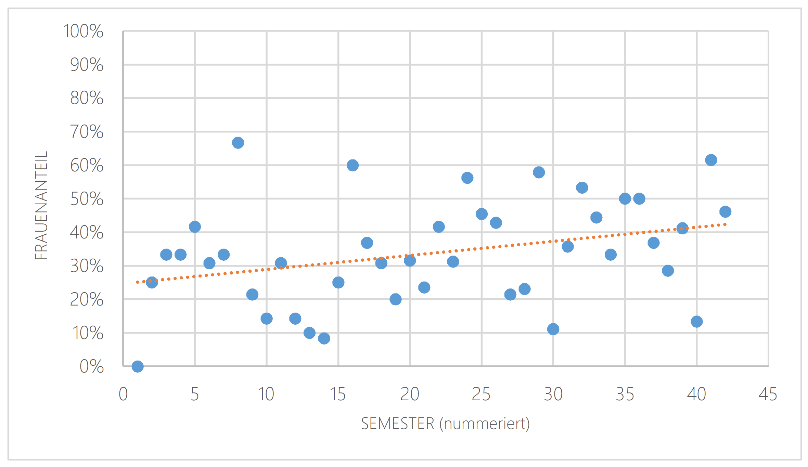
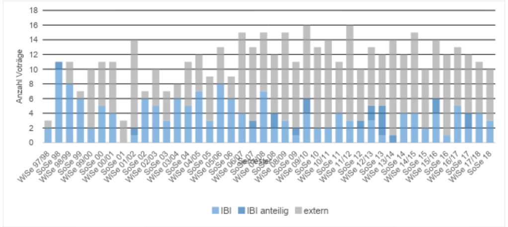
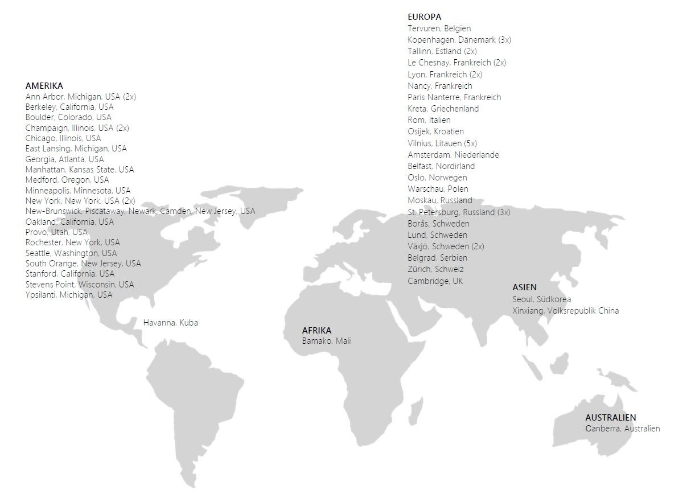
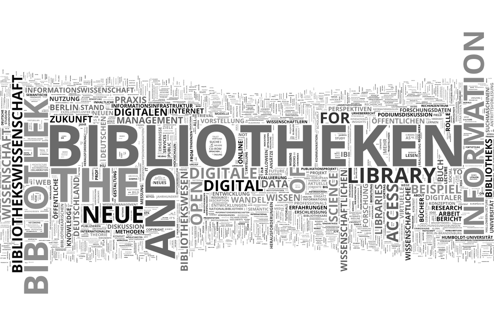

Hintergrund
==============

Eine Anfrage von Studierenden der Staatlichen Universität für Kunst und
Kultur in St. Petersburg machte uns im Dezember 2017 darauf aufmerksam,
dass nicht nur das Institut für Bibliotheks- und
Informationswissenschaft (IBI) im Jahr 2018 ein Jubiläum begeht. Ein
Blick in die Aufzeichnungen sowie das Gespräch mit aktuellen und
ehemaligen Mitarbeitenden zeigte, dass auch eine andere Institution im
Januar diesen Jahres einen runden Geburtstag feiern konnte: Das Berliner
Bibliothekswissenschaftliche Kolloquium (BBK) existiert als
Vortragsreihe am Institut für Bibliotheks- und Informationswissenschaft
seit nunmehr 20 Jahren.

Auf Anregung von Michael Heinz, der fachliche Kolloquien während seiner
Zeit am Institut für Mathematik an der Humboldt-Universität
kennengelernt hatte, und unter der Leitung des damaligen
geschäftsführenden Direktors Prof. Dr. Robert Funk, wurde das Kolloquium
im Wintersemester 1997/98 ins Leben gerufen. Eine Einladung (Abb. 1)
erinnert an den ersten Termin am Dienstag, dem 20. Januar 1998.

Hintergrund für die Idee einer institutseigenen Veranstaltungsreihe war
nach Aussage von Michael Heinz "einerseits das Bedürfnis, die
Kommunikation sowohl unter den Professoren und wissenschaftlichen
Mitarbeitern zu verbessern \[\...\]. Andererseits war das Anliegen, die
Kontakte mit der Praxis auszubauen und die eigene Forschung stärker
sichtbar zu machen \[...\] eine Kommunikationsplattform zu schaffen, die
der eigenen Weiterbildung genauso dient, wie der Information
untereinander, mit Studierenden und der bibliothekarischen und
informatorischen Praxis. \[...\] Bei der Zeitplanung wurde ausdrücklich
beachtet, dass ein geeigneter Wochentag und eine günstige Uhrzeit die
Teilnahme des im Berliner und Potsdamer Raum reichlich vorhandenen
Fachpersonals weitestgehend ermöglichen sollen. \[...\] Und es war klar,
dass ein verlässlicher wöchentlicher Rhythmus in den Semestermonaten
gewährleistet werden musste, um diese Veranstaltungsreihe zu
etablieren." (Dr. Gertrud Pannier, persönliche Korrespondenz,
08.12.2017).

Bis zum heutigen Tag findet das BBK während der Semestermonate dienstags
am frühen Abend statt. Die Leitung des Kolloquiums liegt in der Regel
bei den DirektorInnen des Instituts. Die praktische Organisation wurde
zum einen von wissenschaftlichen MitarbeiterInnen und seit 2011 auch von
einer eigenen studentischen Hilfskraft für das BBK übernommen. Bereits
seit dem Beginn der Reihe wurden die Termine online verzeichnet und zum
Teil wurden zusätzliche Materialien wie Abstracts, Vortragsfolien oder
Volltexte verlinkt. Seit 2011 gab es auch erste Audio- und
Videoaufzeichnungen der Vorträge. Mittlerweile werden die Aufnahmen
standardmäßig über das Medienrepositorium der Humboldt-Universität und
Verlinkungen auf der Webseite des BBK[^1] zur Verfügung gestellt.

Während bei dem ersten Termin im Januar 1998 im Rahmen einer Gründungs-
und Diskussionsveranstaltung eher institutsinterne Fragen erläutert
werden sollten, sind die nachfolgenden Termine (27.01.1998 -- heute) auf
den aktuellen sowie archivierten Webseiten des Institutes verzeichnet
und bis heute einsehbar.[^2]

Für den vorliegenden Artikel wurden die BBK-Termine zwischen dem
27.01.1998 bis zum 10.07.2018 mit ihren charakteristischen Daten (Datum,
Titel, ReferentIn sowie Institution) zusammengetragen, bereinigt und
ausgewertet.[^3] Die folgenden Absätze geben somit einen Überblick über
20 Jahre Berliner Bibliothekswissenschaftliches Kolloquium am Institut
für Bibliotheks- und Informationswissenschaft und bieten auf diese Weise
auch einen Einblick in die Entwicklung der Forschung und Ausrichtung des
Instituts und seiner jeweiligen Mitarbeitenden.

In einem ersten Schritt werden die Anzahl der Vorträge insgesamt sowie
die Entwicklung der Zahlen über die Semester erläutert. Im Anschluss
sollen die ReferentInnen des BBKs näher betrachtet werden: Wie viele
Personen waren im Schnitt an einem Vortrag beteiligt und welche Person
war an den meisten Vorträgen beteiligt? Weiterhin wird ein kritischer
Blick auf das Geschlechterverhältnis bei den Vortragenden im BBK
geworfen. Auch die Frage nach dem Verhältnis von "IBI-internen" und
externen ReferentInnen wird gestellt. Die Analyse schließt mit einem
Blick auf die Entwicklung der behandelten Themenfelder.

Ergebnisse
===========

Anzahl der Vorträge
---------------------

Zwischen dem 27.01.1998 und dem 10.07.2018 wurden im Verlauf von 42
Semestern insgesamt 476 Vorträge gehalten. Abbildung 2 zeigt, dass die
Anzahl der Vorträge pro Semester dabei bis auf wenige Ausnahmen in den
ersten Jahren einigermaßen konstant blieb und dass in den längeren
Wintersemestern (blau) naturgemäß mehr Vorträge stattfanden als in den
kürzeren Sommersemestern (orange).

ReferentInnen
---------------------

### Anzahl der ReferentInnen pro Vortrag

Der klassische BBK-Vortrag wurde von einer einzelnen Person gehalten:
Bei 380 von 476 Vorträgen (79,83 %) ist ein/e einzelne/r ReferentIn
aufgeführt. Bei 59 Vorträgen (12,39 %) referierten zwei Personen, bei 12
Vorträgen (2,52 %) gab es drei ReferentInnen. Nur selten gab es vier (4
mal; 0,84 %) oder fünf (2 mal; 0,42 %) Vortragende. Bei 19 Terminen
(3,99 %) bleibt die genaue Anzahl der ReferentInnen unklar, da es sich
um Diskussionsveranstaltungen handelt oder die ReferentInnen nicht alle
namentlich benannt sind (Beispielsweise Person X und Studierende).
Abbildung 3 zeigt die Verteilung in der Übersicht.

Bei der Anzahl von ReferentInnen pro Vortrag zeigt sich auch im Verlauf
der Jahre keine große Veränderung. Der "Trend zum Kollektiv" in der
Wissenschaft (FAZ, 07.06.2018) kann also im Zusammenhang mit dem BBK
nicht bestätigt werden. Abbildung 4 bildet die Mittelwerte (Anzahl
ReferentInnen / Vortrag) für die einzelnen Semester ab.

### Anzahl der Vorträge pro ReferentIn

Insgesamt waren 560 Vortragende an 457 Kolloquien beteiligt. Die oben
bereits angesprochenen 19 Termine, bei denen die genaue Anzahl an
ReferentInnen nicht ermittelt werden konnte, wurden von der folgenden
Analyse ausgeschlossen. Die 560 Vortragenden stellen jedoch nicht 560
verschiedene Personen dar: Durch mehrere Vorträge im BBK kam es zur
Mehrfachnennung von einigen Personen. Rechnet man diese heraus, so waren
von 1998 bis 2018 371 verschiedene Personen als Vortragende am BBK
beteiligt.[^4] Dabei waren 33 Personen an zwei Vorträgen im BBK
beteiligt, 13 Personen an drei Vorträgen und sieben Personen waren bei
vier Kolloquien als ReferentIn aufgeführt. Die "Spitzenreiter" unter den
ReferentInnen mit fünf oder mehr Beteiligungen werden in Tabelle 1
aufgeführt. Mit großem Abstand führt hierbei Prof. Dr. Konrad Umlauf die
Liste mit insgesamt 25 Beteiligungen an BBK-Vorträge an.

+--------------+-------------------------------+
| **Vorträge** | **Name**                      |
+==============+===============================+
| 5            | Dr. Inge Lindtner             |
|              |                               |
|              | Prof. Dr. Peter Schirmbacher  |
+--------------+-------------------------------+
| 6            | Prof. Dr. Stefan Gradmann     |
|              |                               |
|              | Prof. Dr. Rainer Kuhlen       |
+--------------+-------------------------------+
| 7            | Prof. Dr. Elke Greifeneder    |
|              |                               |
|              | Prof. Dr. Engelbert Plassmann |
+--------------+-------------------------------+
| 8            | Dr. Petra Hauke               |
+--------------+-------------------------------+
| 9            | Prof. Michael Seadle, PhD     |
+--------------+-------------------------------+
| 10           | Prof. Dr. Eric W. Steinhauer  |
+--------------+-------------------------------+
| 11           | Dr. Frank Havemann            |
+--------------+-------------------------------+
| 12           | Michael Heinz, Dipl.-Math.    |
+--------------+-------------------------------+
| 13           | Prof. Dr. Walther Umstätter   |
+--------------+-------------------------------+
| 25           | Prof. Dr. Konrad Umlauf       |
+--------------+-------------------------------+

Table: Personen mit Beteiligungen an 5 oder mehr BBK-Vorträgen

### Geschlechterverhältnis ReferentInnen

Ein spannendes Thema, welches im Zusammenhang mit akademischen
Vortragsreihen häufig diskutiert wird, ist das Verhältnis von weiblichen
und männlichen ReferentInnen. In diese Analyse wurden 562 aufgeführte
Vortragende miteinbezogen: Neben den 560 oben genannten ReferentInnen,
kommen an dieser Stelle noch zwei weitere Personen hinzu, in deren Fall
das Geschlecht des Hauptvortragenden zugeordnet werden konnte
(Beispielsweise Person X und Studenten), das Geschlecht der beteiligten
Studierenden konnte hingegen nicht ermittelt werden. Die 17
Podiumsdiskussionen beziehungsweise Veranstaltungen ohne aufgeführte
Personen wurden in diese Analyse ebenfalls nicht miteinbezogen.

Für 562 Vortragende konnte die Zuordnung anhand des Kriteriums
"männlicher" oder "weiblicher" Name getroffen werden. Bei 459
BBK-Terminen gab es insgesamt 197 weibliche Referentinnen und 365
männliche Referenten. Hinzu kommt eine unbekannte Anzahl von
ReferentInnen unbekannten Geschlechts, die bei zwei BBK-Terminen nur als
"Studenten" aufgeführt wurden. Es ergibt sich für die Vortragenden,
deren Geschlecht zugeordnet werden konnte, somit die folgende
Verteilung: 64,95 % (365) der ReferentInnen beim BBK waren männlich und
35,05 % (197) weiblich.

Einen Einfluss auf dieses Ergebnis hat die oben bereits erwähnte
Mehrfachnennung von einigen Personalien. Wirft man einen Blick auf
Tabelle 1, so zeigt sich beispielsweise, dass die fünf Personen, die an
zehn oder mehr BBK-Vorträgen beteiligt waren, alle männlichen
Geschlechts sind. Schaut man sich also die 371 verschiedenen Personen
an, die insgesamt am BBK als ReferentInnen beteiligt waren und denen ein
Geschlecht zugeordnet werden konnte, so zeigt sich nun folgende
Verteilung: 59,84 % (222) der Vortragenden waren männlich, 40,16 % (149)
waren weiblich.

Bei beiden Herangehensweisen an die Daten zeigt sich ein Überwiegen der
männlichen Referenten. Betrachtet man aber die Entwicklung des Anteils
der Frauen an der Gesamtzahl der ReferentInnen (männlich & weiblich) pro
Semester, so zeigt sich, dass dieser im Verlauf der Jahre zugenommen
hat. Extrapoliert man die Trendlinie, so könnten wir bei einer
gleichbleibenden Entwicklung davon ausgehen, dass ein ausgewogenes
Verhältnis zwischen männlichen und weiblichen ReferentInnen etwa im
Jahre 2027 erreicht werden könnte, wie auch Abbildung 5 zeigt.

### Intern oder extern?

Interessant ist auch die Frage, aus welchen Einrichtungen die
ReferentInnen der BBK-Vorträge stammen. Für diese Analyse wurde zwischen
Vorträgen unterschieden, die ausschließlich Vortragende mit
IBI-Zugehörigkeit gehalten haben (IBI), Vorträgen, bei denen Personen
aus dem IBI beteiligt waren (IBI anteilig) und Vorträgen, die von
Personen gehalten wurden, bei denen das IBI nicht als Institution
aufgeführt wird (extern). Hier zeigt sich über die Jahre eine klare
Tendenz zu einem verstärkten Anteil von externen ReferentInnen (siehe
Abb. 6).

### Internationale Kontakte

Schon in den frühen Jahren des BBK waren auch regelmäßig internationale
Vortragende zu Gast am IBI: Zwischen 1998 und 2018 haben tatsächlich
ReferentInnen von allen fünf Kontinenten im Rahmen des BBK einen Vortrag
gehalten. Abbildung 7 zeigt die geographische Zuordnung der
internationalen Institutionen, denen die Vortragenden angehörten.
Deutlich wird durch die Grafik auch der Schwerpunkt bei den Kontakten zu
europäischen und nordamerikanischen Einrichtungen, der natürlich durch
die Personalia des Instituts sowie durch die bestehenden Kooperationen
und Partnerschaften (iSchool Organisation; ERASMUS et cetera) entstanden
ist.

Auch an dieser Stelle zeigen sich interessante Entwicklungen im Laufe
der Zeit, die in gewisser Weise die Geschichte des Instituts
widerspiegeln: Während es in den ersten Jahren des BBK verstärkt
Institutionen aus Russland sowie dem Baltikum waren, aus denen
Vortragende aus internationalen Institutionen stammten, lässt sich seit
der Ankunft von Prof. Michael Seadle eine deutliche Tendenz zu
ReferentInnen aus nordamerikanischen Einrichtungen erkennen.

Themen
----------

### Entwicklung über die Jahre

Das BBK griff immer aktuelle Themen aus der bibliotheks- und
informationswissenschaftlichen Forschung auf. Die Übersicht über die
Vortragstitel der vergangenen 20 Jahre gibt somit auch einen Einblick in
die Entwicklung von Fachdiskursen und Themenfeldern.

Sichtbar wird dies beispielsweise bei der Verfolgung des Begriffes
*Internet* als Teil des Vortragstitels über die Semester hinweg: Während
sich die frühen Vorträge im BBK zum Thema noch mit den "Entwicklungen
der Informationsrecherche im Internet" (09. Juni 1998) oder der
"inhaltlichen Erschließung des Internets mit Hilfe von Meta-Daten"
(12.01.1999) beschäftigen, geht es am 06.05.2008 bereits um "Sicherheit
und Datenschutz im Internet der Dinge" und schließlich darum mit
"*Peer-to-Peer* Suchmaschinen" Informationen im Internet zu vernetzen,
Zensur zu verhindern und Privatsphäre zu sichern (19.06.2012).

Der Suchbegriff "Bibliothek\*" taucht übrigens in insgesamt 164 Titeln
von BBK-Vorträgen auf, der Begriff "Information\*" in 67 und der Begriff
"Wissenschaft\*" in 74 Titeln. Diese inhaltlichen Schwerpunkte stellt
auch die folgende Wortwolke anschaulich dar, die aus allen Wörtern
erstellt wurde, welche in den BBK-Vortragstiteln zwischen 1998 und 2018
enthalten waren (siehe Abb. 8).

Im BBK wurden aber nicht nur klassische Vorträge gehalten, es fand und
findet auch immer wieder ein reger fachlicher Austausch statt: In
Diskussionsrunden und Panels wurden sowohl interne (Beispielsweise
"Vorstellung und Diskussion der neuen Entwürfe der Studienordnungen --
Teil 1-3"; 07.12.2004-11.01.2005) als auch externe Themen
(Beispielsweise "Wie 'in' ist der/die wissenschaftliche
Bibliothekar/in?"; 25.01.2005) erörtert.

Auch innovative Vortragsformate wurden aufgegriffen: So fand am
27.05.2014 unter der Moderation von Maxi Kindling der erste bibliotheks-
und informationswissenschaftliche Science Slam im Rahmen des BBK statt.
Bereits legendär ist natürlich die *"Halloween Lecture"* von Prof. Dr.
Eric W. Steinhauer, die am 27.10.2009 mit einem Vortrag zu friedhofs-
und bestattungsrechtlichen Fragestellungen im Bibliothekswesen ihren
Anfang nahm und in den folgenden acht Jahren unter anderem mit
Ausführungen zur "Theorie und Praxis der Bibliotheksmumie" sowie zu
"Grundzügen der Vampyrologie für Bibliothekare" für überfüllte Hörsäle
und verängstigte BBK-ZuhörerInnen sorgte.

Für feierliche Anlässe wurde der Termin des BBK ebenso gerne genutzt:
Neun Antrittsvorlesungen, zwei Verabschiedungen (siehe Tabelle 2) sowie
verschiedene Geburtstagsfeiern und Jubiläen wurden im Laufe der Jahre
als Teil des Berliner Bibliothekswissenschaftlichen Kolloquiums
begangen.

+-----------------------+-----------------------+-----------------------+
| **Termin**            | **Anlass**            | **Vortragende**       |
+=======================+=======================+=======================+
| 04.07.2006            | Antrittsvorlesungen   | Prof. Dr. Claudia Lux |
|                       |                       |                       |
|                       |                       | Prof. Dr. Peter       |
|                       |                       | Schirmbacher          |
+-----------------------+-----------------------+-----------------------+
| 24.10.2006            | Akademische           | \-                    |
|                       | Verabschiedung von    |                       |
|                       | Prof. Dr. Walther     |                       |
|                       | Umstätter             |                       |
+-----------------------+-----------------------+-----------------------+
| 28.10.2008            | Antrittsvorlesungen   | Prof. Michael Seadle, |
|                       | der Lehrstühle        | PhD                   |
|                       | Digitale Bibliotheken |                       |
|                       | und Wissensmanagement | Prof. Dr. Stefan      |
|                       |                       | Gradmann              |
+-----------------------+-----------------------+-----------------------+
| 10.06.2014            | Antrittsvorlesung:    | Prof. Dr. Eric W.     |
|                       | Ein                   | Steinhauer            |
|                       | 'Bibliotheksrecht'    |                       |
|                       | gibt es natürlich     |                       |
|                       | nicht!                |                       |
+-----------------------+-----------------------+-----------------------+
| 18.11.2014            | Antrittsvorlesung:    | Prof. Dr. Elke        |
|                       | Big data does not     | Greifeneder           |
|                       | equal big picture     |                       |
+-----------------------+-----------------------+-----------------------+
| 13.06.2017            | Antrittsvorlesung:    | Prof. Dr. Wolfram     |
|                       | Wissenschaft und      | Horstmann             |
|                       | Bibliothek -- vereint |                       |
|                       | im digitalen Wandel?  |                       |
+-----------------------+-----------------------+-----------------------+
| 28.11.2017            | Antrittsvorlesung:    | Prof. Dr. Robert      |
|                       | Das World Wide Web    | Jäschke               |
|                       | als Ressource für die |                       |
|                       | Wissenschaft          |                       |
+-----------------------+-----------------------+-----------------------+
| 10.07.2018            | Verabschiedung von    | \-                    |
|                       | Prof. Michael Seadle, |                       |
|                       | PhD                   |                       |
+-----------------------+-----------------------+-----------------------+

Table: Antrittsvorlesungen und Verabschiedungen im Rahmen des BBK

So fand auch im Rahmen des letzten BBK-Termins des Sommersemesters 2018
am 10. Juli 2018 die feierliche akademische Verabschiedung von Prof.
Michael Seadle, PhD, statt.

Zusammenfassung
=================

Der vorliegende Beitrag hat einen Blick auf die letzten 20 Jahre des
Berliner Bibliothekswissenschaftlichen Kolloquium (BBK) geworfen,
welches 1998 als Vortragsreihe am Institut für Bibliotheks- und
Informationswissenschaft ins Leben gerufen wurde. Die Auseinandersetzung
mit dem Material bietet dabei nicht nur einen Überblick über die
Entwicklung der Vortragsreihe selbst, sondern ermöglicht auch einen
Einblick in die Geschichte des Instituts, welches in diesem Jahr sein
90-jähriges Jubiläum feiert. Die Vortragenden, ihre Institutionen und
die Titel der Vorträge geben indirekt auch Auskunft über die
personellen, strategischen und inhaltlichen Entwicklungen am Institut
zwischen 1998 und heute.

Neben den oben betrachteten Aspekten lassen sich daher zahlreiche
weitere Fragen an das Datenmaterial stellen: Wie haben sich die
Schwerpunkte bei den behandelten Themen über die Jahre entwickelt,
welche Netzwerke lassen sich im Zusammenhang mit den ReferentInnen
erkennen? Bislang unangetastet blieben auch die Abstracts, welche für
einen größeren Teil der Vorträge zusätzlich vorliegen.

Klar ist, dass das BBK nach wie vor ein wichtiger Teil des Instituts für
Bibliotheks- und Informationswissenschaft ist und noch immer eine
Kommunikationsplattform darstellt, die der fachlichen Weiterbildung für
Studierenden und Lehrende genauso dient wie dem Austausch untereinander
und mit anderen -- sei es auf nationaler oder internationaler Ebene.

Referenzen
=============

Anderl, Sybille: Trend zum Kollektiv: Die Forschung der vielen, in:
*Frankfurter Allgemeine Zeitung Online* (07.06.2018), URL:
[http://www.faz.net/-in2-9auu0](http://www.faz.net/-in2-9auu0)
\[zuletzt abgerufen am 3.10.2018\]

[^1]: [www.ibi.hu-berlin.de/de/bbk](http://www.ibi.hu-berlin.de/de/bbk)

[^2]: Siehe die BBK-Websites [https://www.ibi.hu-berlin.de/de/bbk/bbk-archiv](https://www.ibi.hu-berlin.de/de/bbk/bbk-archiv) (Sommersemester 2007 bis heute) sowie [http://www.ib.hu-berlin.de/about/veranst/bbk/index.html](http://www.ib.hu-berlin.de/about/veranst/bbk/index.html) (Sommersemester 2005 bis Wintersemester 2006/07) und [http://www.ib.hu-berlin.de/about/veranst/bbk/archiv/index.html](http://www.ib.hu-berlin.de/about/veranst/bbk/archiv/index.html) (Wintersemester 1998 bis Wintersemester 2004/2005) \[zuletzt abgerufen am 3.10.2018\]

[^3]: Eine tabellarische Übersicht der BBK-Termine sowie weitere
    Statistiken sind als (Roh-)Datendokumente im XLSX-Format dem Artikel
    als Supplement beigefügt, vgl. [http://libreas.eu/ausgabe34/schlebbe/data](http://libreas.eu/ausgabe34/schlebbe/data).

[^4]: Nicht vollständig ausgeschlossen werden kann, dass Personen durch
    eine Namensänderung nach einer Eheschließung bei der Analyse als
    zwei verschiedene Personen gewertet wurden.
