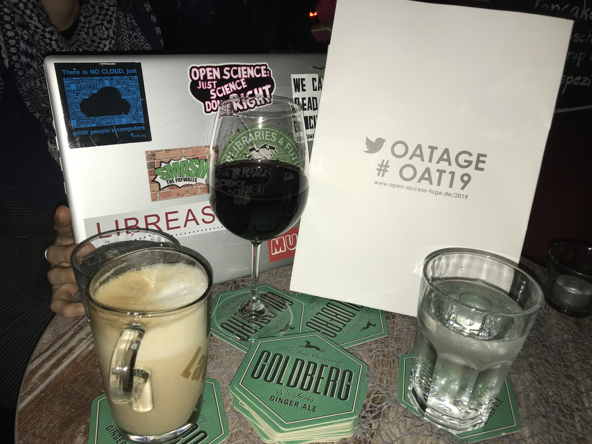

Vor rund sieben Jahren standen wir vor der Frage, wie wir die LIBREAS nachhaltig aufstellen können, weil der Serverbetrieb nicht mehr gewährleistet werden konnte. Wir mussten daher einen Weg finden, die Zeitschrift zu migrieren und ihre Integrität zu gewährleisten. Klar, Geld war nicht vorhanden und unsere Zeit sowie unser Know-How waren begrenzt. 

Passend zur Ausgabe #23 zum Thema Forschungsdatenmanagement[^1] überführten wir damals das Journals mittels eines statischen Website Site-Generator nach GitHub Pages[^2], welches ein kostenfreies Hosting von statischen Webseiten anbietet. Pandoc, ein Konvertierungstool für Dokumentenformate[^3], bildete das Werkzeug, das uns seitdem beim semi-automatischen Setzen der Artikel hilft[^4]. Und klar, auch Slack und Google Docs sind für unsere Kommunikationen und der inhaltlichen Textarbeit unersetzlich. PDFs werden zudem auf dem edoc-Server der HU Berlin archiviert[^5].

Sind Workflow einschließlich der Verbreitung der LIBREAS jetzt also nachhaltig? Finanziell dank des Vereins, der freiwilligen Arbeit und fehlenden Kosten fürs Hosting und Setzen bestimmt. Der Umfang der Redaktion ist stabil und offen für neue Personen. Technisch steht zum 15jährigen Jubiläum eine Aktualisierung an, da seit 2013 vieles passiert ist. Inhaltlich planen wir bereits die Ausgabe #38. Für die Ausgabe #37 zum Thema "Forschung und Öffentliche Bibliothek" gibt es bereits einen Call for Paper[^6].

Unter den Beiträgen zum aktuellen Schwerpunkt "Nachhaltigkeit von Forschungsinfrastrukturen" finden sich Vorschläge zur Qualitätssicherung und Finanzierung von Open-Access-Zeitschriften (Kathrin Ganz, Marcel Wrzesinski & Markus Rauchecker) und Repositorienplattformen (Beate Rajski & Pascal Becker). Niklas K. Hartmann entwickelt Handlungsoptionen zum Umgang mit personenbezogenen Forschungsdaten. Er verweist auf die Bedeutung von Standards für ein nachhaltiges  Forschungsdatenmanagements, einen Aspekt, den auch Francesco Gelati und Bernd Kulawik in ihren Beiträgen aufgreifen. Andrea Bertino und Jan Rohden stellen den DARIAH-DE Helpdesk vor, der die Nutzung digitaler Werkzeuge und Ressourcen befördern soll. Es gibt zudem eine Reihe von Interviews und Veranstaltungshinweisen zum Thema Nachhaltigkeit von Forschungsinfrastrukturen.

Wir finden, dass LIBREAS #36 damit durchaus eine bemerkenswerte Sammlung an Beiträgen vereint. Wir wünschen viel Freude und Denkanregungen!

Ihre / eure Redaktion LIBREAS. Library Ideas

(Aarhus, Berlin, Chur, Dresden, München)

[^1]: <https://libreas.eu/ausgabe23/>

[^2]: <https://github.com/libreas/libreas.github.io/>

[^3]: <https://pandoc.org/>

[^4]: <https://github.com/libreas/libreas.github.io/wiki/Workflow-Satz>

[^5]: <https://edoc.hu-berlin.de/handle/18452/149>

[^6]: <https://libreas.wordpress.com/2019/11/06/cfp-37-forschung-und-oeffentliche-bibliothek/>
