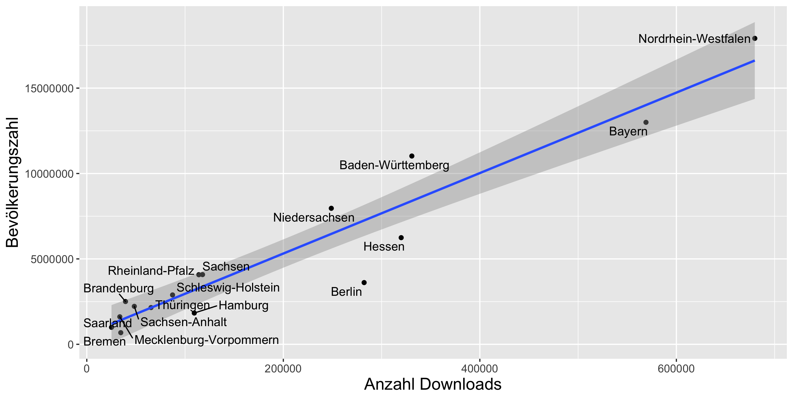
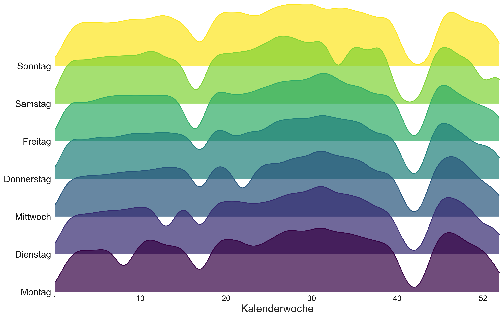
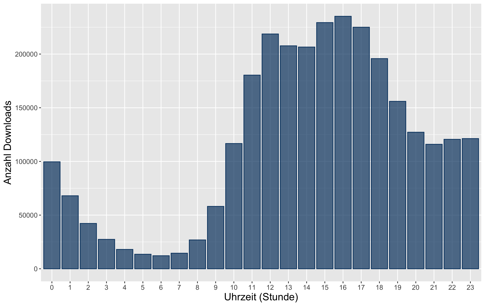
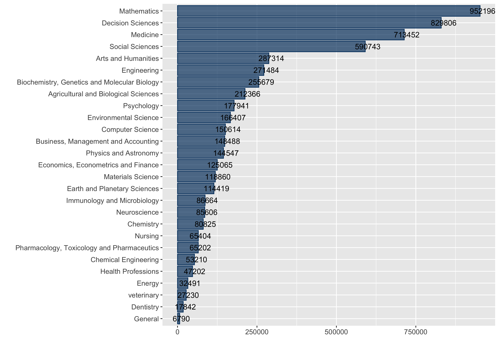

### Einleitung und Fragestellung

Anfang der 2000er Jahre entstanden in Reaktion auf unzureichende
Zugangswege zu Fachliteratur und ausgelöst durch steigende
Subskriptionsgebühren wissenschaftlicher Zeitschriften erste illegale
Dokumentensammlungen, sogenannte Schattenbibliotheken (Karaganis, 2018).
Schattenbibliotheken sind Internetdienste, die ohne Zustimmung der
RechteinhaberInnen Datenbanken mit wissenschaftlichen Volltexten
erstellen, betreiben und allen Interessierten dadurch den Zugriff auf
wissenschaftliche Literatur ermöglichen (Bodó, 2016). Zu den
meistgenutzten Schattenbibliotheken zählt Sci-Hub. Der Dienst wurde 2011
von Alexandra Elbakyan entwickelt und umfasste zum Zeitpunkt der
Untersuchung mehr als 74 Millionen Dokumente.

Die Akzeptanz dieser Dienste unter Forschenden und anderen
Personengruppen, verschwimmende Grenzen in der öffentlichen Wahrnehmung
zu Open Access sowie mögliche Konsequenzen für bestehende legale Zugänge
zu Fachliteratur beschäftigen nicht nur InformationswissenschaftlerInnen
weltweit.

In diesem Beitrag wird die Rolle des Phänomens Schattenbibliothek bei
der wissenschaftlichen Informationsversorgung in Deutschland untersucht,
insbesondere im Hinblick auf regionale Verteilungen von Downloads,
Zugriffszeiten, Zusammenhängen zwischen der Größe bestimmter
Personengruppen (Bevölkerungszahl, Anzahl wissenschaftlicher
Mitarbeitender an Hochschulen) und den Downloadzahlen eines Bundeslands
sowie den Eigenschaften der angefragten Dokumente (Themen, Verlage,
Publikationsalter beim Zugriff).

### Forschungsstand

Dank ihrer zunehmenden Popularität rücken Schattenbibliotheken in den
letzten Jahren zunehmend in den Fokus der Forschung. Im Mittelpunkt
steht dabei insbesondere die derzeit größte Schattenbibliothek Sci-Hub.

Sci-Hub zeichnet sich durch eine einfache grafische Benutzungsoberfläche
aus. Der Zugriff erfolgt über die Eingabe eines Digital Object
Identifier (DOI) in die Suchmaske. Gefundene Dokumente werden Nutzenden
im Browser angezeigt und zum Download angeboten. Ist das angefragte
Dokument noch nicht in der Datenbank abgelegt, nutzt Sci-Hub
Bibliothekszugänge für lizenzierte Volltexte, um das Dokument von
Verlagswebseiten herunterzuladen und an die Nutzenden auszuliefern
(Seer, 2017). Nach Angaben von Sci-Hub werden diese Bibliothekszugänge
von Forschenden gespendet. Zumindest eine Quelle erwähnt die Beteiligung
von Bibliotheksmitarbeitenden und technischem Personal an
wissenschaftlichen Einrichtungen (Seer, 2017). Es ist nicht
ausgeschlossen, dass Zugänge auch ohne Kenntnis der ZugangsinhaberInnen
erworben wurden (Seer, 2017).

Vorangegangene Analysen der Nutzung von Sci-Hub zeigen, dass der Dienst
weltweit genutzt wird (Bohannon, 2016). Ein Abgleich der Datenbank von
Sci-Hub im Jahr 2016 mit der bibliografischen Datenquelle Crossref
belegt, dass die Schattenbibliothek einen Großteil der
wissenschaftlichen Fachliteratur abdeckt (Himmelstein et al., 2018). So
waren beispielsweise 85,1 % der Zeitschriftenartikel, die nicht über
Open Access frei zugänglich waren, über Sci-Hub verfügbar. Auch die
Inhalte vieler Zeitschriften waren fast vollständig in der Datenbank
enthalten.[^1] Mindestens 76,3 % der Zeitschriftenliteratur einer
Disziplin über Sci-Hub verfügbar. Für die meisten Publikationsjahre seit
1850 lag die Abdeckung zwischen 60 und 80 %. In den Jahren 2016 und 2017
zeigte sich eine geringe Abdeckung. Ursächlich könnte dafür sein, dass
Dokumente erst nach einer erfolgreichen Anfrage in die Datenbank
aufgenommen werden (Himmelstein et al., 2018). Eine weitere Untersuchung
zeigte, dass über Sci-Hub überwiegend auf aktuelle Literatur zugegriffen
wird: Das Publikationsalter beim Zugriff betrug bei 35 % der angefragten
Dokumente weniger als zwei Jahre (Greshake Tzovaras, 2017). Zudem
konzentrierten sich rund 80 % der Zugriffe auf nur neun Verlage.

Die genannten Untersuchungen berichten von der verbreiteten Nutzung der
Schattenbibliothek und ihrer umfassenden Abdeckung der
Zeitschriftenliteratur. Die Nutzung von Sci-Hub unter Forschenden
scheint zuzunehmen, obwohl nicht nur der Betrieb, sondern auch die
Nutzung einer Schattenbibliothek -- zumindest nach deutschem Recht --
rechtlich nicht unbedenklich ist (Steinhauer, 2016). In einer Umfrage,
die 2016 von der Zeitschrift Science unter LeserInnen durchgeführt
wurde, gaben 60 % der Befragten an, Sci-Hub bereits genutzt zu haben
(Travis, 2016). Ein Viertel der Befragten besuchte die
Schattenbibliothek wöchentlich oder täglich. Auch unter
Nachwuchsforschenden nimmt die Nutzung von Sci-Hub zu (Nicholas et al.,
2018).

Diese allgemeinen Analysen erlauben jedoch kaum Rückschlüsse auf
regionale Besonderheiten der Nutzung. Erste Länderanalysen zur Nutzung
von Sci-Hub in Russland und der Ukraine zeigen, dass sich in beiden
Ländern die Nutzung in Großstädten konzentriert. (Lutay, 2018;
Nazarovets, 2018)

Auch im Hinblick auf die am häufigsten betroffenen Verlage ergeben sich
in diesen Ländern Häufungen. Dieses Muster hängt vermutlich mit der
allgemeinen Verlagskonzentration auf dem Zeitschriftenmarkt zusammen
(Larivière, Haustein & Mongeon, 2015).

Disziplinspezifische Besonderheiten der Nutzung von Sci-Hub wurden
bislang kaum untersucht. Eine Ausnahme bildet die medizinische
Fachliteratur. Ermittelt wurde, dass sich 69 % der Anfragen nach
Fachliteratur aus diesem Themengebiet auf Länder mit geringem und
mittleren Einkommen zurückführen lassen. Länder mit mittlerem Einkommen,
die nicht vom HINARI-Programm[^2] profitieren weisen das höchste
Verhältnis von Downloads zu EinwohnerInnen auf (Till et al., 2019). Die
Autorinnen und Autoren dieser Studie kommen zu dem Schluss, dass Sci-Hub
zur Überbrückung von Ungleichheit beim legalen Zugang zu medizinischer
Fachliteratur genutzt wird.

### Vorgehen (Methode, Datenerhebung und -bearbeitung)

Für die vorliegende Studie wurde die Nutzung von Sci-Hub in Deutschland
mit Methoden der Logfile-Analyse untersucht. Dabei werden die in den
Logfiles repräsentierten Transaktionen zwischen Nutzenden und
Informationssystemen ausgewertet (Jansen, 2009). In den
Informationswissenschaften werden Logfile-Analysen beispielsweise für
die Analyse von Internetdiensten und elektronischen Ressourcen
angewendet (Schlögl, 2013).

Die Studie folgt einem explorativen Ansatz. Mögliche Anknüpfungspunkte
für vertiefende Fragestellungen werden in der Diskussion erläutert.

#### Datenerhebung

Die Betreiberin von Sci-Hub veröffentlichte anonymisierte Logfiles für
die Zeiträume September 2015 bis Februar 2016 sowie Januar 2017 bis
Dezember 2017[^3] (Bohannon & Elbakyan, 2016; Greshake Tzovaras
Tzovaras, 2018). Die Logfiles dokumentieren erfolgreiche Anfragen an den
Dienst. Am 17. Mai 2018 gab die Betreiberin von Sci-Hub über Twitter
bekannt, dass Anfragen mit einem bestimmten DOI-Präfix fälschlicherweise
aus den Logfiles von 2017 herausgefiltert worden waren.[^4] Der Link zum
ergänzenden Datensatz lässt sich inzwischen nicht mehr auflösen. Da die
nachgereichten Anfragen zu einem früheren Zeitpunkt heruntergeladen und
gesichert werden konnten, werden sie in dieser Untersuchung dennoch
verwendet. Der ausgewertete Datensatz stellt ein Subset mit Anfragen aus
Deutschland dar und ist frei verfügbar (Strecker, 2018).

Das Subset[^5] wurde über Crossref um bibliografische Angaben zu den
angefragten Dokumenten ergänzt. Publikationsdatum und ISSN wurden auf
Artikelebene über die DOI des jeweiligen Dokuments ermittelt. Über die
ISSN wurden der Verlag sowie die Notationen der ASJC (All Science
Journal Classification) auf Zeitschriftenebene abgefragt. Angaben zur
Größe der untersuchten Personengruppen (Bevölkerung[^6] und
wissenschaftliche Mitarbeitende an Hochschulen[^7]) auf Ebene des
Bundeslandes stammen vom Statistischen Bundesamt.

#### Datenbearbeitung

Für ein allgemeines Bild der Themen angefragter Dokumente wurden die
numerischen Notationen auf die ersten zwei Stellen verkürzt und damit
auf die oberen Hierarchieebenen der ASJC bezogen.

Das Publikationsalter zum Zeitpunkt des Zugriffs stellt den Zeitraum
zwischen dem Publikationsdatum, in Crossref angegeben in dem Feld
`issued`, und dem Zeitpunkt der Abfrage in Monaten beziehungsweise
Jahren dar.

Die Zuordnung von Orten zu Bundesländern erfolgte über OpenStreetmap.

Für die Datenerhebung und -auswertung wurde die Statistiksoftware R, die
integrierte Entwicklungsumgebung RStudio und einige R-Libraries
verwendet.

### Ergebnisse

Die Logfiles dokumentieren insgesamt 3.047.945 Downloads. Der Großteil
davon (2.837.666) entfällt auf das Jahr 2017.

#### Regionale Verteilung der Downloads

Die Abbildung zeigt die Anzahl der Downloads
über den gesamten Zeitraum, gruppiert nach Ort. Die Karte verdeutlicht,
dass Sci-Hub in Deutschland fast flächendeckend genutzt wird, wobei sich
Downloadzahlen in Großstädten häufen. Auffällig ist der Unterschied in
der Nutzungsintensität und regionalen Abdeckung zwischen Regionen im
Nordosten und im Südwesten des Landes. Bezogen auf die Bundesländer
weisen Berlin (0,078), Hamburg (0,06), Hessen (0,051), Bremen (0,05) und
Bayern (0,044) die meisten Downloads pro Einwohner auf. Download- und
Bevölkerungszahlen für alle Bundesländer sind in der nachfolgenden
Tabelle dargestellt.

  **Bundesland**           **Bevölkerungszahl**   **Downloads Gesamt**   **Downloads pro Einwohner**
  ------------------------ ---------------------- ---------------------- -----------------------------
  Baden-Württemberg        11.023.425             330.782                0,03
  Bayern                   12.997.204             569.073                0,044
  Berlin                   3.613.495              282.230                0,078
  Brandenburg              2.504.040              39.383                 0,016
  Bremen                   681.032                34.569                 0,05
  Hamburg                  1.830.584              109.377                0,06
  Hessen                   6.243.262              319.945                0,051
  Mecklenburg-Vorpommern   1.611.119              33.598                 0,02
  Niedersachsen            7.962.775              248.816                0,031
  Nordrhein-Westfalen      17.912.134             679.810                0,038
  Rheinland-Pfalz          4.073.679              114.016                0,028
  Saarland                 994.187                25.147                 0,025
  Sachsen                  4.081.308              117.775                0,029
  Sachsen-Anhalt           2.223.081              48.351                 0,022
  Schleswig-Holstein       2.889.821              87.275                 0,03
  Thüringen                2.151.205              65.355                 0,03

### Korrelation von Downloadzahlen eines Bundeslandes mit der Größe von Personengruppen

Wie in der folgenden Abbildung
dargestellt, besteht ein starker Zusammenhang zwischen der
Bevölkerungszahl und der Anzahl von Downloads eines Bundeslands
(Pearson\'s r: 0,95 ; p \< 0,001). Ein lineares Regressionsmodell
(kleinste Quadrate) beschreibt den Zusammenhang sehr gut
($\text{adjusted\ }R^{2} = 0,901$).

Ein ähnlich starker Zusammenhang ergibt sich für Downloadzahlen und die
Anzahl wissenschaftlicher Mitarbeitender an Hochschulen (Pearson's r:
0,92 ; p \< 0,001). Das Regressionsmodell für wissenschaftliche
Mitarbeitende liefert allerdings einen schwächeren Erklärungsansatz für
die Entwicklung von Downloadzahlen ($\text{adjusted\ }R^{2} = 0,834$).

### Zeitliche Verteilung der Downloads

Die Anfragen des Jahres 2017 wurden in Hinblick auf die Zugriffszeiten
(Wochentage und Uhrzeit) analysiert. Für alle Anfragen konnten
Zugriffszeiten ermittelt werden.

Obwohl für das erstellte Subset Daten für die Kalenderwochen 41 bis 43
fehlen, zeigt die nächste Abbildung in der Tendenz
einen Anstieg der Anzahl angefragter Dokumente im Verlauf des Jahres
2017. Eine deutliche Varianz zwischen den Wochentagen ist nicht
erkennbar.

In der nächsten Abbildung ist die Uhrzeit der
Anfragen nach Stunde dargestellt. Die Schattenbibliothek wird demzufolge
überwiegend zu üblichen Bürozeiten und am späten Abend genutzt.

#### Dokumenteigenschaften

##### Notationen und Themen

Notationen der AJSC konnten für 3.047.649 der angefragten Dokumente
ermittelt werden. Die Notationen „Statistics and Probability" (817.196)
und „Statistics, Probability and Uncertainty" (803.874) treten dabei mit
großem Abstand am häufigsten auf.

Eine Analyse der AJSC-Notationen auf der obersten Hierarchieebene
ermöglicht eine allgemeinere Übersicht der Themen angefragter Dokumente.
Demnach werden Publikationen, die den Themenfeldern Mathematik
(952.196), Decision Sciences (829.806 - dazu zählen beispielsweise
Statistik und Teile der Managementtheorie), Medizin (713.452) und
Sozialwissenschaften (590.743) zugeordnet werden können, am häufigsten
angefragt (siehe nachstehende Abbildung).
Publikationen anderer Themenfelder wurden in deutlich geringeren Umfang
angefragt.

##### Verlage

Angaben zum Verlag konnten für 3.047.045 Downloads ermittelt werden.
Über den gesamten Zeitraum wurden Publikationen der Verlage Elsevier
(850.342), Springer (485.883), Wiley (376.327), Informa (181.696) und
American Chemical Society (124.379) am häufigsten angefragt.
Durchschnittlich entfallen auf einen Verlag rund 2.947 Downloads. Der
Median beträgt 16 Downloads, der Modalwert liegt bei einem Download pro
Verlag.

##### Publikationsalter

Für 2.076.856 angefragte Dokumente konnte das Publikationsdatum im
Format YYYY-MM ermittelt und damit das Alter der Publikationen zum
Zeitpunkt des Zugriffs berechnet werden. Das durchschnittliche Alter der
Publikationen beim Zugriff beträgt 9,98 Jahre, der Median liegt bei 5,41
Jahren, der Modalwert bei 9 Monaten. 24,54 % der angefragten Dokumente
waren zum Zeitpunkt der Abfrage weniger als zwei Jahre alt. Einige
Publikationen waren zum Zeitpunkt der Abfrage auffallend alt -- im
Extremfall über 500 Jahre. Dadurch wird das durchschnittliche
Publikationsalter stark verschoben. Dokumente mit einem
Publikationsalter von mehr als 100 Jahren entstammen überwiegend den
Themenfeldern Medizin (3.275), Sozialwissenschaften (1.526), Psychologie
(1.435) und Energie (1.400).

### Diskussion

Dass Sci-Hub in Deutschland bis auf einige Regionen im Nordosten fast
flächendeckend genutzt wird, wird durch die Visualisierung der Downloads
auf der Karte verdeutlicht. In Großstädten und dicht besiedelten
Gebieten häufen sich die Downloadzahlen. Der starke Zusammenhang
zwischen der Bevölkerungszahl, der Anzahl wissenschaftlicher
Mitarbeitender und den Downloadzahlen eines Bundeslands liefert einen
Erklärungsansatz für regionale Unterschiede in der Nutzungsintensität.

Die Analyse dieser Personengruppen liefert weitere Erkenntnisse über die
Nutzung von Sci-Hub in Deutschland. Die Größe beider Personengruppen
korreliert stark mit den Downloadzahlen eines Bundeslands. Die linearen
Regressionsmodelle beschreiben die Entwicklung von Downloadzahlen bei
einem Zuwachs der Personengruppe jedoch unterschiedlich gut. Daran wird
deutlich, dass die Nutzung von Sci-Hub nicht allein durch
Hochschulangehörige erklärt werden kann. Aufgrund der mangelnden
Datengrundlage wurden Angehörige außeruniversitärer
Forschungseinrichtungen in dieser Arbeit nicht betrachtet.

Die Auswertung der Zugriffszeiten zeigt, dass die Downloadzahlen im
Verlauf des Jahres 2017 in der Tendenz anstiegen. Da sich Downloadzahlen
zu üblichen Bürozeiten häufen, ist anzunehmen, dass Sci-Hub vor allem am
Arbeitsplatz genutzt wird. Allerdings erfolgt die Nutzung unabhängig vom
Wochentag.

Eine Analyse der Themenfelder, die den angefragten Dokumenten zugeordnet
werden konnten, zeigt, dass ein Großteil der Downloads auf Publikationen
aus vier Themengebieten entfiel: Mathematik, Decision Sciences, Medizin
und Sozialwissenschaften. Das könnte als Anzeichen für
Informationsbedürfnisse in diesen Themenfeldern gewertet werden, die von
bestehenden legalen Diensten nicht vollständig abgedeckt werden.

Hier könnten weitere Untersuchungen anknüpfen, die die Nutzung eines
Themengebiets vertieft betrachten. Beispielsweise könnte über die
Nutzung medizinischer Fachliteratur die These überprüft werden, dass
Ärztinnen und Ärzte ohne Anbindung an ein Bibliothekssystem
Schattenbibliotheken nutzen, um aktuelle wissenschaftliche Literatur zu
beziehen. Einige Disziplinen, insbesondere Mathematik und Teile der
Decision Sciences, weisen zudem zahlreiche Überschneidungen mit anderen
Themengebieten auf, beispielsweise durch die Beschreibung und
Evaluierung statistischer Methoden. Eine Assoziationsanalyse könnte
aufzeigen, wie Publikationen welcher Disziplinen gemeinsam mit
Publikationen aus der Mathematik genutzt werden.

Die in den Logfiles dokumentierten Anfragen konzentrieren sich auf
wenige Verlage. Besonders häufig wurden Publikationen des Verlags
Elsevier heruntergeladen, gefolgt von Springer und Wiley. Für die
meisten Verlage wurde dagegen nur ein Download registriert. Bei der
zunehmenden Konsolidierung des Zeitschriftenmarkts verwundert diese
Beobachtung nicht. Nach Inkrafttreten des von Projekt DEAL
ausgehandelten Publish-and-Read-Vertrags mit dem Verlag Wiley Anfang
2019 könnte zukünftig untersucht werden, ob dieser
Open-Access-Transformationsvertrag einen Einfluss auf die Nutzung von
Sci-Hub hat. Zu untersuchen wäre weiterhin, ob die Kündigung von
Elsevier-Subskriptionen durch wissenschaftliche Bibliotheken im Rahmen
der DEAL-Verhandlungen einen Anstieg der Nutzung von
Elsevier-Publikationen über Sci-Hub zur Folge hat.

Einige Verlage verfolgen Strategien zur Bekämpfung von
Schattenbibliotheken, darunter Klagen gegen die Betreiberin oder das
Blocken des Dienstes durch Internet Service Provider. Allerdings haben
legale und technische Maßnahmen, die sich gegen den Betrieb der
Schattenbibliothek richten, bislang wenig bewirkt (Manley, 2019). Einige
Verlage setzen nun auf eine Abkehr vom IP-basierten Zugriff auf
lizenzierte Fachliteratur zugunsten eines plattformübergreifenden
Authentifizierungssystems und begründen den Vorstoß auch mit der
Bekämpfung von Piraterie (National Information Standards Organization,
2019). Ob diese Maßnahme ein wirksames Mittel gegen Schattenbibliotheken
darstellt, bleibt abzuwarten; allerdings wird sie sich auch auch auf
legale Informationsangebote von Bibliotheken auswirken. Entwicklungen
dieser Initiative sollten daher auch von Bibliotheken beobachtet werden.

Nutzende erlangen über Sci-Hub überwiegend Zugang zu aktueller
Literatur, was der Modalwert des Publikationsalters von 9 Monaten zeigt.
Greshake Tzovaras stellte für alle Anfragen zwischen September 2015 und
Februar 2016 fest, dass bei rund 35 % der angefragten Dokumenten das
Publikationsalter weniger als zwei Jahre betrug (Greshake Tzovaras,
2017). Für Anfragen aus Deutschland über den gesamten betrachteten
Zeitraum weisen nur 24,54 % der Dokumente ein Publikationsalter von
unter zwei Jahren auf. Obwohl die Angaben nicht direkt vergleichbar
sind, kann der Unterschied als Hinweis darauf gewertet werden, dass in
Deutschland vergleichsweise häufiger ältere Literatur angefragt wird.
Auffällig ist, dass auch Publikationen angefragt werden, die ein sehr
hohes Publikationsalter aufweisen -- teilweise mehr als 100 Jahre.
Dadurch werden Mittelwert und Median stark verschoben. Von diesen
besonders alten Publikationen fallen einige längst nicht mehr unter den
Schutz des Urheberrechts und sollten inzwischen in die Gemeinfreiheit
übergegangen sein. An diese Beobachtung könnten weitere Untersuchungen,
beispielsweise nach mangelnder Erschließung oder Zugangsbarrieren dieser
Publikationen, anknüpfen.

Der Umstand, dass auch ältere Publikationen genutzt werden, in
Verbindung mit steigenden Downloadzahlen, stützt die Annahme einer
Normalisierung der Nutzung von Schattenbibliotheken und die These, dass
die Nutzung auch mit dem vereinfachten Zugriff auf Ressourcen durch
Sci-Hub erklärt werden kann.

### Limitationen

Da die Logfiles nur erfolgreiche Anfragen dokumentieren, können in
dieser Arbeit nur die Eigenschaften der Dokumente untersucht werden, die
tatsächlich heruntergeladen wurden. Entsprechend erlauben die Logfiles
keine Rückschlüsse auf alle Informationsbedürfnisse der Nutzenden,
sondern nur die, welche von Sci-Hub erfüllt werden konnten. Aufgrund der
Funktionsweise des Dienstes können über Sci-Hub zudem nur Dokumente, vor
allem Zeitschriftenartikel, mit DOI angefragt werden.

Wesentliche Teile dieser Arbeit, vor allem die Filterung von Anfragen
aus Deutschland, basieren auf der Interpretation von IP-Adressen. Da
diese beispielsweise über Virtual Private Networks (VPNs) leicht
verändert werden können, wurden möglicherweise nicht alle relevanten
Anfragen berücksichtigt.

Die Logfiles decken den Zeitraum zwischen 2015 und 2017 in
unterschiedlichem Umfang ab. Wie in der nachfolgenden Tabelle
dargestellt, variiert auch die Anzahl der dokumentierten Downloads.

  Jahr   Abgedeckter Zeitraum (Monate)   Downloads Gesamt
  ------ ------------------------------- ------------------
  2015   4                               218.495
  2016   2                               66.112
  2017   12 (ausgenommen KW 41 - 43)     3.870.206

Die Anreicherung der Logfiles erfolgte über Crossref. Relevante Angaben
waren nicht für alle Anfragen verfügbar. Um die Vergleichbarkeit der
analysierten Themengebiete sicherzustellen, erfolgte die Zuordnung der
Themen über die ASJC auf der Ebene von Zeitschriften. Da Themen nicht
für individuelle Zeitschriftenartikeln ermittelt wurden, ist die
Granularität der Analyse sehr grob. Für detailliertere Ergebnisse,
insbesondere für Publikationen aus disziplinübergreifenden
Zeitschriften, könnten zukünftige Analysen eine Zuordnung auf der Ebene
individueller Zeitschriftenartikel vornehmen.

### Literatur

Bodó, B. (2016). Pirates in the Library -- an inquiry into the Guerilla
Open Access movement. *SSRN Electronic Journal*. Gehalten auf der 8th
Annual Workshop of the International Society for the History and Theory
of Intellectual Property, Glasgow.
<https://doi.org/10.2139/ssrn.2816925>

Bohannon, J. (2016). Who's downloading pirated papers? Everyone.
*Science*, *352*(6285), 508--512.
<https://doi.org/10.1126/science.352.6285.508>

Greshake Tzovaras, B. (2017). Looking into Pandora's box: The content of
Sci-Hub and its usage. *F1000Research*, *6*, 541.
<https://doi.org/10.12688/f1000research.11366.1>

Himmelstein, D. S., Romero, A. R., Levernier, J. G., Munro, T. A.,
McLaughlin, S. R., Greshake Tzovaras, B., & Greene, C. S. (2018).
Sci-Hub provides access to nearly all scholarly literature. *ELife*,
*7*. <https://doi.org/10.7554/eLife.32822>

Jansen, B. J. (2009). The methodology of search log analysis. In B. J.
Jansen, A. Spink, & I. Taksa (Hrsg.), *Handbook of research on web log
analysis:* (S. 99--121).
<https://doi.org/10.4018/978-1-59904-974-8>

Karaganis, J. (2018). Introduction: Access from above, access from
below. In J. Karaganis (Hrsg.), *Shadow Libraries* (S. 1--24).
Cambridge, MA: MIT Press.

Larivière, V., Haustein, S., & Mongeon, P. (2015). The oligopoly of
academic publishers in the digital era. *PLOS ONE*, *10*(6), e0127502.
<https://doi.org/10.1371/journal.pone.0127502>

Lutay, A. (2018, Juli 12). *Use of Sci-Hub in the Russian Federation*.
<https://doi.org/10.6084/m9.figshare.6809312.v1>

Manley, S. (2019). On the limitations of recent lawsuits against
Sci-Hub, OMICS, ResearchGate, and Georgia State University. *Learned
Publishing*, *32*(4), 375--381. <https://doi.org/10.1002/leap.1254>

National Information Standards Organization. (2019). *Recommended
practices for improved access to institutionally-provided information
resources*. Abgerufen von
<https://groups.niso.org/apps/group_public/download.php/21892/NISO_RP-27-2019_RA21_Identity_Discovery_and_Persistence.pdf>

Nazarovets, S. (2018). *Black Open Access in Ukraine: Analysis of
downloading Sci-Hub publications by Ukrainian Internet Users*. Abgerufen
von <https://arxiv.org/abs/1804.08479>

Nicholas, D., Boukacem-Zeghmouri, C., Xu, J., Herman, E., Clark, D.,
Abrizah, A., Rodríguez-Bravo, B., & Świgoń, M. (2018). Sci-Hub: The new
and ultimate disruptor? *Learned Publishing*.
<https://doi.org/10.1002/leap.1206>

Schlögl, C. (2013). Logfile- und Link-Analysen -- Nicht-reaktive
Methoden der Online-Forschung. In *Handbuch Methoden der Bibliotheks-
und Informationswissenschaft. Bibliotheks-, Benutzerforschung,
Informationsanalyse*.
<https://doi.org/10.1515/9783110255546.184>

Seer, V. (2017). Von der Schattenbibliothek zum Forschungskorpus. Ein
Gespräch über Sci-Hub und die Folgen für die Wissenschaft. *LIBREAS.
Library Ideas*, (32). Abgerufen von
<https://libreas.eu/ausgabe32/scihub/>

Steinhauer, E. W. (2016). Die Nutzung einer „Schattenbibliothek" im
Licht des Urheberrechts. *LIBREAS. Library Ideas*, (30). Abgerufen von
<https://libreas.eu/ausgabe30/steinhauer/>

Till, B. M., Rudolfson, N., Saluja, S., Gnanaraj, J., Samad, L.,
Ljungman, D., & Shrime, M. (2019). Who is pirating medical literature? A
bibliometric review of 28 million Sci-Hub downloads. *The Lancet Global
Health*, *7*(1), e30--e31.
<https://doi.org/10.1016/S2214-109X(18)30388-7>

Travis, J. (2016). *In survey, most give thumbs-up to pirated papers*. <https://doi.org/10.1126/science.aaf5704>

### Datenquellen

Bohannon, J., & Elbakyan, A. (2016). *Data from: Who's downloading
pirated papers? Everyone*.
<https://doi.org/10.5061/dryad.q447c>

Greshake Tzovaras, B. (2018). *Sci-Hub download log Of 2017*.
<https://doi.org/10.5281/zenodo.1158300>

Strecker, D. (2018). *Sci-Hub Downloads from Germany* \[Data set\].
<https://doi.org/10.5281/zenodo.1286284>

### Verwendete Software

R Core Team. R: A language and environment for statistical computing.
Wien: R Foundation for Statistical Computing. (2019) Version 3.6.1.
<https://www.r-project.org/>

RStudio Team. RStudio: Integrated Development for R. Boston: RStudio,
Inc. (2015) Version 1.2.1335.<http://www.rstudio.com/>

Wickham, Hadley. tidyverse. (2017) Version 1.2.1.
<https://cran.r-project.org/package=tidyverse>

Grolemund, Garrett und Wickham, Hadley. lubridate. (2011) Version 1.7.4.
<https://cran.r-project.org/package=lubridate>

Chamberlain, Scott u.a. rcrossref. (2019) Version 0.9.2.
<https://cran.r-project.org/package=rcrossref>

Wickham, Hadley. httr. (2018) Version 1.4.0.
<https://cran.r-project.org/package=httr>

Ooms, Jeroen. jsonlite. (2014) Version 1.6.
<https://cran.r-project.org/package=jsonlite>

Padgham, Mark u. a. osmdata. (2017) Version 0.1.1.
<https://cran.r-project.org/package=osmdata>

Kahle, David und Wickham, Hadley. ggmap. (2013) Version 3.0.0.
<https://cran.r-project.org/package=ggmap>

Yu, Guangchuang. ggimage. (2019) Version 0.2.1.
<https://cran.r-project.org/package=ggimage>

Tennekes, Martijn. tmaptools. (2019) Version 2.0-2.
<https://cran.r-project.org/package=tmaptools>

[^1]: <https://greenelab.github.io/scihub/#/journals>

[^2]: Ein Programm der WHO zur Förderung der Literaturversorgung in
    sogenannten Entwicklungsländern, vgl.
    <https://www.who.int/hinari/en/>
    .

[^3]: Das Subset mit Anfragen aus Deutschland enthält für das Jahr 2017
    keine Daten für die Kalenderwochen 41 -- 43.

[^4]: <https://twitter.com/Sci_Hub/status/996925449577037824>

[^5]: Anfragen aus der Gemeinde Haina (Kloster) wurden von der Analyse
    ausgeschlossen, da ein Fehler bei der Zuordnung von IP-Adressen zu
    Orten angenommen wird -- die Zuordnung ergibt ungewöhnlich viele
    Treffer für diese Gemeinde, die laut Wikipedia nur 3455 Einwohner
    hat.

[^6]: Fachserie 1, Reihe 1.3, Tabelle 3.1:
    <https://www.destatis.de/DE/Themen/Gesellschaft-Umwelt/Bevoelkerung/Bevoelkerungsstand/Publikationen/Downloads-Bevoelkerungsstand/bevoelkerungsfortschreibung-2010130177005.xls?__blob=publicationFile>

[^7]: Fachserie 11, Reihe 4.4, Tabelle 1:
    <https://www.destatis.de/DE/Themen/Gesellschaft-Umwelt/Bildung-Forschung-Kultur/Hochschulen/Publikationen/Downloads-Hochschulen/personal-hochschulen-2110440177004.pdf?__blob=publicationFile>
