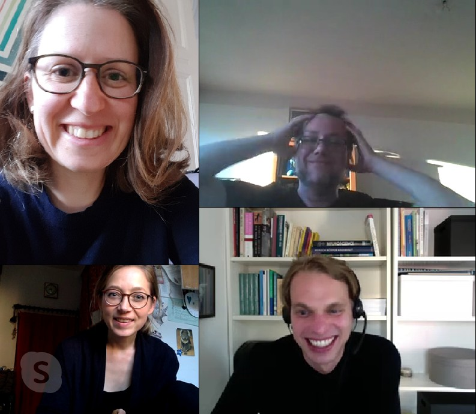

Jetzt, wenn dieses Editorial entsteht, sitzen wir – die Redaktion plus
unsere Schwerpunktredakteurin für diese Ausgabe, Ulla Wimmer – in
Wohnungen, um während der COVID-19-Pandemie sowohl aus Selbstschutz als
auch aus Solidarität das Ansteckungsrisiko gering zu halten. Diese
Ausgabe entstand also, mehr noch als andere, online, über Landes- und
Sprachgrenzen hinweg. Persönlich war diese Situation für einige von uns
belastender als für andere. Starke Eindrücke hinterließ sie bei uns
allen.

Aber selbstverständlich waren und sind wir nicht allein. Kolleg\*innen
in zahlreichen Öffentlichen Bibliotheken (und anderen) fanden sich von
der gleichen Situation betroffen und hatten dennoch ständig
Entscheidungen zu treffen: Die, die aufgefordert waren, trotz Pandemie
zur Arbeit zu erscheinen und dafür beispielsweise mit dem ÖPNV quer
durch Städte fahren mussten – sollten sie es tun oder besser Wege suchen
daheim zu bleiben? Was war wichtiger: Die eigene Angst, Vorsicht, der
Wunsch, solidarisch zu handeln – oder die Einschätzung, dass die Arbeit
in der Bibliothek unbedingt jetzt, vor Ort und nicht in ein paar Monaten
oder daheim getan werden müsste? Personal und Bibliotheken mussten auch
entscheiden, was wichtiger war: Der klar geäußerte Wunsch von
medizinischen Expert\*innen und Regierungen, alle unnötigen Reisen und
Kontakte zu vermeiden – oder der Wunsch von Bibliotheken, als relevant
zu gelten und weiter Angebote zu unterbreiten? Der Wunsch von
Nutzer\*innen, Medien geschickt zu bekommen oder der Wunsch von Post-
und Paketlieferunternehmen, möglichst nicht noch mehr Pakete in die
schon überlasteten Systeme zu geben? Auch Kolleg\*innen, die daheim
blieben, mussten entscheiden, wie sie mit der Situation umgehen: Sollten
sie Angst haben? Hoffen? Die Situation vor allem realistisch sehen? Aber
was ist, was war realistisch? Sich Innerhalb der vier Wände, die
plötzlich zum Hauptaufenthaltsort wurden, Kontemplation suchen – oder an
ihnen verzweifeln? Den Tagen Struktur geben oder sich treiben lassen?
Doch noch hinausgehen, zum Spazieren, oder vollständig daheim bleiben?
Und das alles nicht als Gedankenexperiment, sondern in Echtzeit.

Was war und ist wichtig? Was muss getan werden und was nicht? Uns allen
stell(t)en sich während der Pandemie diese oder doch ähnliche Fragen.
Wir haben sie unterschiedlich beantwortet und werden nach der Pandemie
Zeit haben, uns klar zu werden, ob es gute Entscheidungen waren oder
weniger gute. Ob wir alleine so entschieden haben oder ob die meisten
unsere Entscheidungen teilten.

Interessanterweise kamen auch viele Texte dieser Ausgabe auf solche
Fragen zurück, wenn auch in einem ganz anderen Kontext, nämlich der
Frage des Bezugs von Forschung und Praxis Öffentlicher Bibliotheken: Was
ist wichtig und was nicht? Wann? Schon beim Call war uns klar, dass sehr
verschiedene Akteur\*innen sehr unterschiedliche Antworten darauf haben.
Das zeigte sich dann tatsächlich in den Texten. Während viele allgemein
dafür plädieren, dass es einen Platz für Forschung geben muss, wenn man
gut funktionierende und sich entwickelnde Öffentliche Bibliotheken haben
möchte, zeigen sich doch sehr unterschiedliche Antworten. Während ein
Beitrag (Rebekka Putzke) eine Position aus einer Öffentlichen Bibliothek
heraus entwickelt, problematisiert ein anderer (Mahmoud Hemila) auf der
Basis der Erfahrungen bei der Forschung für eine Bachelorarbeit die
Grenzen solcher Forschung in der Praxis. Einige Beiträge (Sarah Juen,
Sina Menzel, Sari Herde) zeigen, dass die Praxis Öffentlicher
Bibliotheken durchaus Thema wissenschaftlicher Arbeit sein kann.
Abschließend thematisieren drei Beiträge aus der Wissenschaft
grundsätzlich die Beziehung von Forschung und Praxis. Einmal als
Aufforderung an das Öffentliche Bibliothekswesen sich zu ändern (Karsten
Schuldt), einmal als Untersuchungsgegenstand selber (Ulla Wimmer) und
einmal am Beispiel Brasiliens auf eine ganz andere Art, als dies im
DACH-Raum normalerweise geschieht, nämlich nicht als potentielles
Gegeneinander, sondern Miteinander (Elias Junior, Cardos Machado &
Bezerra Cardoso).

\*\*\*

Mit dieser Ausgabe wird die LIBREAS. Library Ideas für uns unglaubliche
15 Jahre alt. Grundsätzlich war geplant, dies größer zu feiern. Ob und
wie es noch dazu kommen wird, wird wohl vor allem durch den Lauf der
Pandemie und ihren Nachwirkungen entschieden werden. So oder so wollen
wir uns aber bei allen bedanken, die uns bislang begleitet haben: Ihr
wart und seid großartig!

Eure / Ihre Redaktion LIBREAS. Libreas

(Berlin, Dresden, Göttingen, Lausanne, München)
