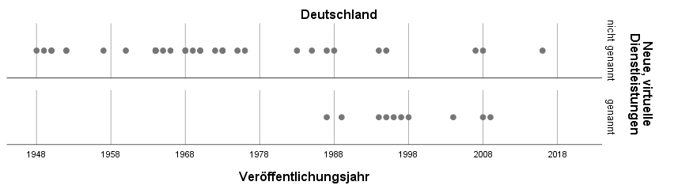
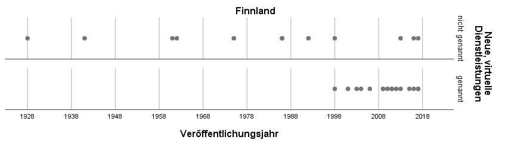
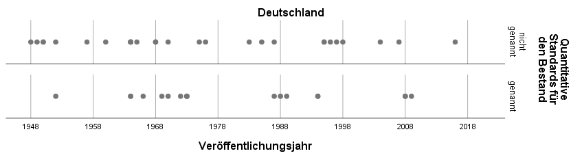

### Einleitung

Finnische Öffentliche Bibliotheken werden zu den besten und
erfolgreichsten der Welt gezählt, und das schon seit vielen Jahren, ganz
egal ob man sich die hohen Benutzer- und Ausleihzahlen, die
beeindruckenden Bibliotheksgebäude oder die erfolgreiche Zusammenarbeit
mit Schulen im Zusammenhang mit dem guten Abschneiden finnischer Schüler
bei den PISA-Tests ansieht. Die in Finnland gesetzlich vorgeschriebene
Evaluation der Angebote und Dienstleistungen Öffentlicher Bibliotheken
zeigt, dass die Benutzer\*innen diese sehr positiv bewerten und ihnen
eine hohe Dienstleistungs- und Aufenthaltsqualität bescheinigen.
Technische Neuerungen wie die Ausstattung mit PCs und WLAN wurden
flächendeckend im ganzen Land in allen Bibliotheken gefördert und
finanziert. Auf die skandinavischen "Vorzeigeländer" der Öffentlichen
Bibliotheken Finnland und Dänemark wird auch in Deutschland vor allem in
den Diskussionen um eine nationale Bibliotheksstrategie und ein
nationales Bibliotheksgesetz stets hingewiesen.

Warum genau sind die finnischen Öffentlichen Bibliotheken so
erfolgreich? Der große Unterschied zum deutschen Öffentlichen
Bibliothekswesen besteht darin, dass es in Deutschland kein nationales
Bibliotheksgesetz gibt -- könnte dieses für den Qualitätsunterschied
verantwortlich sein? Allerdings gibt es auch hierzulande nationale
Empfehlungen und Pläne für die Bibliotheksarbeit, die zwar, genau wie in
Finnland, nicht verpflichtend sind, aber dennoch je nach personellen und
finanziellen Ressourcen umgesetzt werden sollten. Unterscheiden sich die
Inhalte dieser empfehlenden Papiere so gravierend, dass sich auch daraus
ein Qualitätsunterschied erklären ließe?

Zur Beantwortung dieser Fragen habe ich im vergangenen Jahr im Rahmen
meiner Masterarbeit (Herde 2019) am Institut für Bibliotheks- und
Informationswissenschaft der HU Berlin die nationalen Gesetze,
Empfehlungen und Strategien für Öffentliche Bibliotheken in Finnland und
Deutschland zwischen 1945 und 2017 verglichen, um grundlegende
Unterschiede oder auch Gemeinsamkeiten in der Betrachtung und Planung
Öffentlicher Bibliotheken herauszufinden.

### Kurze Geschichte der Bibliotheksgesetzgebung in Finnland und Deutschland

**Finnland** hat eine lange Tradition bezüglich der gesetzlichen
Regelung Öffentlicher Bibliotheken. Das erste finnische
*Volksbüchereigesetz* (Finnland. Eduskunta 1928) und die *Verordnung zu
den Volksbüchereien* (Finnland. Opetusministeriö 1928) regelten bereits
Aspekte, die bis heute in den 1961, 1986, 1998 und 2016 erneuerten
Bibliotheksgesetzen vorkommen, zum Beispiel Gebührenfreiheit, Ausbildung
der Bibliotheksleitung, Kooperation, geeignete Räumlichkeiten,
Öffnungszeiten, Tätigkeitsstatistik und Finanzierung. Jedoch legte erst
das *Bibliotheksgesetz* von 1961 (Finnland. Eduskunta 1961) den
Grundstein für den Erfolg der finnischen Öffentlichen Bibliotheken. Die
Entstehung dieses Bibliotheksgesetzes steht im Zusammenhang mit der
Entwicklung Finnlands zu einem Wohlfahrtsstaat nach dem Ende des Zweiten
Weltkrieges, geprägt durch die starke Einflussnahme des Staates und die
Gleichbehandlung aller Bürger\*innen, unabhängig von ihrem Einkommen
oder ihrem Wohnort. So wurde der Bau neuer Bibliotheksgebäude auf dem
Land finanziell gefördert und staatliche Bibliotheksinspektoren
unterstützten die Bibliotheksleitenden bei der Ausstattung und dem
Betrieb ihrer Bibliotheken auch in den abgelegensten Regionen. Das
*Bibliotheksgesetz* von 1961 bewirkte, dass Anfang der 1980er Jahre kaum
mehr Unterschiede zwischen den städtischen und ländlichen Öffentlichen
Bibliotheken bestanden. Im *Bibliotheksgesetz* von 1986 (Finnland.
Eduskunta 1986) waren Bibliotheksnetz und Kooperation zentrale Punkte.
Das *Bibliotheksgesetz* von 1998 (Finnland. Eduskunta 1998) legte
Öffentliche Bibliotheken als Pflichtaufgabe der Gemeinden fest, eine
Evaluation der Dienstleistungen wurde obligatorisch und die Entwicklung
virtueller und interaktiver Netzangebote wurde gefordert. Das neueste
*Gesetz zu den Öffentlichen Bibliotheken*, das 2016 in Kraft trat
(Finnland. Eduskunta 2016), und die entsprechende *Verordnung des
Bildungs- und Kulturministeriums zu den Öffentlichen Bibliotheke*n von
2017 (Finnland. Opetus- ja Kulttuuriministeriö 2017) berücksichtigen die
neuen, vielseitigen Dienstleistungen Öffentlicher Bibliotheken. Sie
beschreiben genau die Aufgaben der verschiedenen Akteure innerhalb des
Bibliotheksnetzes, regeln die Ausbildung und Kenntnisse des
Bibliothekspersonals, ebenso die Evaluation und Gebührenfreiheit.

Zur Unterstützung der Gesetze und Verordnungen und zur Gewährleistung,
dass die bibliothekarischen Dienstleistungen und Angebote überall im
Land von gleichbleibend hoher Qualität sind, werden seit Ende der 1990er
Jahre vom Bildungsministerium (finnisch: Opetusministeriö)
beziehungsweise seit 2010 Bildungs- und Kulturministerium (finnisch:
Opetus- ja Kulttuuriministeriö) unter Beteiligung unter anderem von
Vertreter\*innen des Finnischen Bibliotheksverbands (finnisch: Suomen
Kirjastoseura), des Finnischen Gemeindebunds (finnisch: Suomen
Kuntaliitto), von Bibliothekar\*innen und Politiker\*innen
Bibliotheksstrategien und -programme verfasst, die in die staatliche
Bildungs- und Kulturpolitik eingebettet sind. Mit den Strategien, die in
regelmäßigen Abständen überarbeitet werden, kann man auf
gesellschaftlichen oder wirtschaftlichen Wandel schnell reagieren und
die bibliothekarischen Dienstleistungen anpassen, zum Beispiel als
Reaktion auf die rasante informationstechnologische Entwicklung. Frühere
Bibliotheksstrategien betonten unter anderem die Wichtigkeit der
ländlichen "Nachbarschaftsbibliotheken" (Finnland. Opetus- ja
Kulttuuriministeriö 2006) oder die Rolle der Öffentlichen Bibliotheken
beim Verhindern einer "digital information gap" (Finnland.
Opetusministeriö 2003) -- immer mit dem Ziel, allen Menschen
gleichberechtigten Zugang zu Wissen und Bildung zu gewähren. Die
Strategien sind häufig verbunden mit der finanziellen Förderung von
Projekten, die allen Bibliotheken gleichermaßen zu Gute kommen sollen,
beispielsweise der Ausstattung aller Bibliotheken mit moderner Technik
oder der Entwicklung von zentralen Netzangeboten wie "Libraries.fi", dem
Internetangebot der finnischen Öffentlichen Bibliotheken.

In **Deutschland** wurde bereits in der Weimarer Republik über die Frage
der Einführung eines nationalen Bibliotheksgesetzes diskutiert,
allerdings kam es erst im Jahre 1937 im Rahmen der
nationalsozialistischen Umgestaltung der Gesellschaft zu *Richtlinien
für das Volksbüchereiwesen*, die Züge eines Bibliotheksgesetzes trugen,
jedoch bis Ende des Zweiten Weltkrieges nicht das Ziel einer
Vereinheitlichung des Öffentlichen Bibliothekswesens erreichen konnten.
Nach dem Ende des Krieges wurde das Thema Bibliotheksgesetz unter
anderem vom Deutschen Büchereiverband wieder aufgegriffen, um mit seiner
Hilfe die Grundlage für den Ausbau des Bibliothekssystems zu schaffen,
denn vor allem auf dem Land war die Zahl der Öffentlichen Bibliotheken
sehr gering. So hatten im Jahr 1950 77 % der Gemeinden keine Öffentliche
Bibliothek und 41 % der deutschen Bevölkerung lebten in Gemeinden ohne
Öffentliche Bibliothek (Thauer; Vodosek 1991, S. 167). Allerdings kam es
nur in der DDR zwischen 1949 und 1968 zu drei Verordnungen, die
Gesetzescharakter hatten und die Öffentlichen Bibliotheken im Sinne des
Sozialismus entwickeln sollten. In der BRD wurden stattdessen von
verschiedenen Akteuren (zum Beispiel dem Deutschen Städtetag, der
Ständigen Konferenz der Kultusminister der Länder in der Bundesrepublik
Deutschland (KMK) und der Kommunalen Gemeinschaftsstelle für
Verwaltungsvereinfachung (KGSt)) Richtlinien, Empfehlungen,
Denkschriften, Pläne und Gutachten veröffentlicht, die mit
unterschiedlichen Schwerpunkten das Bibliothekswesen regeln und
vereinheitlichen sollten (siehe zum Beispiel Deutsche
Bibliothekskonferenz u. a. 1973).

Immer wieder wurde die Forderung nach einem nationalen Bibliotheksgesetz
laut, das die Existenz der Öffentlichen Bibliotheken sichern könne. Da
in Deutschland die Kulturhoheit bei den Ländern liegt, sind jedoch nur
Landesbibliotheksgesetze möglich, die Auftrag und Organisation der
Bibliotheken eines Bundeslandes regeln. Seit 2008 wurden in fünf
deutschen Bundesländern (Thüringen 2008, Sachsen-Anhalt 2010, Hessen
2010, Rheinland-Pfalz 2014 und Schleswig-Holstein 2016)
Bibliotheksgesetze erlassen, die sowohl die Tätigkeit der Öffentlichen
als auch der Wissenschaftlichen und Spezialbibliotheken beinhalten. In
weiteren Bundesländern wurden Gesetzentwürfe oder
Bibliotheksentwicklungspläne verfasst.

### Vorgehen beim Vergleich finnischer und deutscher Grundlagenpapiere

Für einen systematischen Vergleich der finnischen und deutschen
Grundlagenpapiere wurde die Inhaltsanalyse als Methode gewählt, die
besonders geeignet ist zur Analyse eines "umfangreichen Textkorpus, der
in spezifische Analyseeinheiten zerlegt wird. Für jede Analyseeinheit
werden anhand vorab definierter Kategorien das Vorliegen bestimmter
Merkmale festgestellt und dabei in numerische Werte (Codes) übertragen."
(Volpers 2013, S. 414). Grundlage des Kategoriensystems waren 11
internationale Standards, Empfehlungen und Richtlinien der International
Federation of Library Associations and Institutions (IFLA), der United
Nations Educational, Scientific and Cultural Organization (UNESCO), des
Europarats des European Bureau of Library, Information and Documentation
Associations (EBLIDA) und des Europäischen Parlaments, die zwischen 1949
und 2005 erschienen sind (z.B. IFLA 1956, UNESCO 1979, Europarat 2000,
IFLA/UNESCO 2005), in denen Aufgaben, Zielsetzungen und gesetzliche
Regelungen von Öffentlichen Bibliotheken behandelt werden und die als
Hilfestellung für die Weiterentwicklung ihrer Angebote dienen sollen.
Aus diesen wurden die für die gegenwärtige und zukünftige Arbeit
Öffentlicher Bibliotheken zentralen Themen ermittelt und in ein
Kategorienschema überführt. Die 12 übergeordneten Themenbereiche sind:

- Grundsätze von Öffentlichen Bibliotheken,
- Organisation und Verwaltung der Öffentlichen Bibliothekswesens,
- Finanzierung,
- Bestände,
- Unterstützung von lebenslangem Lernen,
- Bibliotheksgebäude und Bibliotheksräume,
- Sammeln, Bewahren und Vermitteln des kulturellen Erbes,
- Stärkung der lokalen Dimension,
- Integrationsförderung,
- Medien- und Informationskompetenz,
- Leseförderung und
- weitere Inhalte (wie neue, virtuelle Dienstleistungen, Bibliotheken als Pflichtaufgabe und Partizipation der Bürger).

Innerhalb dieser Themenbereiche wurde das Vorkommen von insgesamt 92
Einzelthemen in den untersuchten Veröffentlichungen abgeprüft.

Analysiert wurden Veröffentlichungen, die sich auf das gesamte
Öffentliche Bibliothekswesen Finnlands und Deutschlands beziehen, also
Bibliotheksgesetze und -verordnungen, welche die konkrete Umsetzung der
Gesetze regeln, Bibliotheksstrategien, -konzepte, -empfehlungen und
-richtlinien und Papiere zu Bibliotheks-, Bildungs- und Kulturpolitik.
Konkret waren das 28 finnische und 46 deutsche Papiere, die zwischen
1945 und 2017 erschienen sind beziehungsweise in Kraft waren und die
Arbeit Öffentlicher Bibliotheken auf nationaler Ebene geregelt haben.

------------------------------------------------------------------------------------
             Gesetze/Verordnungen                 Empfehlungspapiere           
----------- ---------------------- ------------- --------------------- -------------
                   Finnland         Deutschland        Finnland         Deutschland 

 1945–1960            2                  2                 0                 6      

 1961–1985            2                  1                 1                20      

 1986–1997            3                  0                 0                10      

 1998–2017            5                  0                15                 7      

  Gesamt              12                 3                16                43      
------------------------------------------------------------------------------------

*Tabelle 1: Nationale Gesetze und empfehlende Papiere zur Arbeit
Öffentlicher Bibliotheken in Finnland und Deutschland zwischen 1945 und
2017*

Bei den finnischen Papieren handelt es sich um 12 Gesetze und
Verordnungen und 16 Strategie- und Politikpapiere, bei den deutschen um
3 Verordnungen und 43 Empfehlungen, Strategien, Positionen und
Ähnlichem.

**Ergebnisse**

Schon formal ist ein Unterschied ins Auge fallend: In Finnland wurden
die 16 empfehlenden Papiere von **5** unterschiedlichen Institutionen
verfasst; in Deutschland haben **22** unterschiedliche Institutionen die
43 empfehlende Papiere formuliert.

In Deutschland beschäftigen sich also viele Akteure auf verschiedenen
Ebenen mit unterschiedlichen Schwerpunkten mit Öffentlichen
Bibliotheken; es gibt keine übergeordnete Instanz zur Planung des
nationalen Bibliothekswesens und somit auch keine verbindlichen
Regelungen auf nationaler Ebene. In Finnland sind es wenige auf
nationaler Ebene agierende Akteure, die sich mit der nationalen
Bibliotheksplanung befassen. Das Öffentliche Bibliothekswesen stellt
sich als Einheit dar, was auch daran zu sehen ist, dass sich die
Veröffentlichungen häufig aufeinander beziehen, aufeinander aufbauen und
sich ergänzen.

-----------------------------------------------------------------
Finnland                         Deutschland                     
-------------------------------- --------------------------------
Bildungsministerium,             **International**: UNESCO           
Bibliothekskomitee, Finnischer                                   
Gemeindebund, Finnischer                                         
Bibliotheksverband, Rat der                                      
Öffentlichen Bibliotheken                                        

                                 **National**: SPD, CDU/CSU,         
                                 Gewerkschaft Öffentliche        
                                 Dienste, Transport und          
                                 Verkehr, Bundesregierung,       
                                 Wissenschaftliche Dienste des   
                                 Deutschen Bundestags,           
                                 Enquete-Kommission „Kultur in   
                                 Deutschland“                    

                                 **Überregional**: Deutscher         
                                 Städtetag, Deutscher            
                                 Städtebund,                     
                                 Kultusministerkonferenz,        
                                 Deutscher Ausschuss für das     
                                 Erziehungs- und Bildungswesen,  
                                 Bund-Länder-Kommission für      
                                 Bildungsplanung, Kommunale      
                                 Gemeinschaftsstelle für         
                                 Verwaltungsvereinfachung        

                                 **Regional**: Arbeitskreis          
                                 Erwachsenenbildung des          
                                 Kultusministeriums              
                                 Baden-Württemberg,              
                                 Arbeitsgruppe Bibliotheksplan   
                                 Baden-Württemberg               

                                 **Vertreter des                   
                                 Bibliothekswesens**:              
                                 Heidelberger Volksbüchereitag,  
                                 Bibliothekare Öffentlicher      
                                 Bibliotheken,                   
                                 Arbeitsgemeinschaft der         
                                 Verleger, Buchhändler und       
                                 Bibliothekare in der            
                                 Friedrich-Ebert-Stiftung,       
                                 Deutscher Bibliotheksverband,   
                                 Deutsche Bibliothekskonferenz,  
                                 Bibliothek & Information        
                                 Deutschland, Fachkonferenz der  
                                 Staatlichen Büchereistellen in  
                                 Deutschland                     
-----------------------------------------------------------------
*Tabelle 2: Verfasser nationaler Bibliotheksplanungspapiere in Finnland
und Deutschland*

Beim inhaltlichen Vergleich der deutschen und finnischen Papiere wurde
festgestellt, dass von den 92 Themen, die in den internationalen
Richtlinien ermittelt wurden, 91 sowohl in den deutschen als auch in den
finnischen Papieren genannt werden (Ausnahme: Medienlesefertigkeit --
allerdings beinhaltet in Deutschland wahrscheinlich der Themenkomplex
"Medienkompetenz" diesen Aspekt).

42 Themen werden in Deutschland und Finnland in gleicher oder sehr
ähnlicher Weise betrachtet (das betrifft vor allem die Grundlagen der
Arbeit Öffentlicher Bibliotheken wie Gewährung freien Zugangs zu
Informationen, die Finanzierung und Verwaltung, Kooperation, das
Bibliotheksnetzwerk, Aufgaben wie Leseförderung und
Informationskompetenzveranstaltungen und die Bibliothek als sozialen und
kulturellen Ort).

50 Themen werden in Deutschland und Finnland unterschiedlich betrachtet,
wobei 33 Themen in Finnland häufiger genannt werden, 17 Themen in
Deutschland. Grundsätzlich könnte eine vermehrte Nennung darauf
hindeuten, dass ein Thema von größerer Bedeutung für das
Bibliothekswesen des Landes ist, entweder weil es bereits gesichert oder
besonders prekär oder umstritten ist. Auch die Nichtnennung eines Themas
kann Unterschiedliches bedeuten, entweder wird dieser Aspekt als
selbstverständlich oder aber als irrelevant angesehen. Zusätzlich ist
davon auszugehen, dass Themen innerhalb von Gesetzen und Verordnungen
per se eine höhere Wichtigkeit besitzen als solche in empfehlenden
Papieren. So kann nur von Thema zu Thema entschieden werden, ob ein
gravierender Unterschied in der Betrachtung vorliegt oder nicht. Im
Folgenden werden einige Unterschiede zwischen den finnischen und
deutschen Papieren vorgestellt.

### Finnland: Einbindung in nationale Langzeitstrategien

Bei den Schwerpunkten in den finnischen Papieren handelt es sich genau
um die Themen, die in internationalen und auch deutschen
Veröffentlichungen als Stärken des finnischen Bibliothekswesens
herausgestellt werden, wie das Eingebundensein in nationale Bildungs-
und Kulturstrategien und die Existenz einer nationalen
Bibliotheksstrategie.

*Einheit des Bibliothekssystems*

Durch alle finnischen Papiere hindurch zieht sich das Ziel der
Vereinheitlichung des Bibliothekswesens im ganzen Land. Grundlage
hierfür bilden Angebote und Dienstleistungen, die in allen Bibliotheken
des Landes in gleichbleibender Qualität vorhanden sind, wofür vor allem
kooperativ erstellte Angebote und gut ausgebildetes Personal sorgen
sollen.

*Obligatorischer Masterabschluss für Leitungspositionen*

In Finnland muss die Bibliotheksleitung immer einen Masterabschluss
haben, wohingegen in Deutschland nur für einen kleinen Teil der
Bibliotheken, nämlich ab Sektion 2 (= Öffentliche Bibliothekssysteme und
Bibliotheken für Versorgungsbereiche ab 100.000 Einwohner), ein solcher
erforderlich ist. Sowohl die kooperativen Angebote als auch die
Ausbildung des Personals sind schon in den ersten finnischen
Bibliotheksgesetzen enthalten gewesen und haben dazu geführt, dass man
im ganzen Land vergleichbar gute Öffentliche Bibliotheken findet.

*Obligatorische Evaluation*

Zur Qualitätssicherung gehört in Finnland seit 1998 auch die gesetzlich
vorgeschriebene Evaluation, denn nur mit ihrer Hilfe können die
angebotenen Leistungen auch überprüft werden. Natürlich gibt es auch in
Deutschland Evaluationen, allerdings werden sie von den Bibliotheken
selbst oder deren Trägern initiiert und durchgeführt, eine
Vereinheitlichung der Leistungen aller Bibliotheken wird nicht
angestrebt.

*Gebührenfreiheit*

Die Gebührenfreiheit in Finnland ist ebenfalls eine der Regelungen, die
bereits seit dem ersten Bibliotheksgesetz festgeschrieben wurden. Die
Gebührenfrage wird in Deutschland, wie auch die Rechte und Pflichten der
Benutzer\*innen und die Bibliotheksordnung, in die Entscheidungsgewalt
der Bibliotheken beziehungsweise ihrer Träger gelegt, obwohl auch die
deutschen Landesbibliotheksgesetze zumindest überwiegend die
gebührenfreie Vor-Ort-Benutzung vorschreiben.

*Neue und virtuelle Dienstleistungen*

Die Öffentlichen Bibliotheken in
Finnland scheinen sich heute stärker mit neuen Trends und Entwicklungen
zu befassen, denn die hybride Bibliothek beziehungsweise ein
gleichberechtigtes Nebeneinander von physischen und virtuellen
Materialien, neue und virtuelle Dienstleistungen, zeitgemäße Technik und
Medienlesefähigkeit tauchen vor allem oder ausschließlich in neueren
finnischen Papieren auf. In deutschen Papieren wurde in den 1990er
Jahren die Einführung von PCs gefordert. Da die moderne
Informationstechnik im Alltag der Menschen eine wichtige Rolle spielt,
müssen auch die Öffentlichen Bibliotheken entsprechende Angebote und
Dienstleistungen vorhalten, um attraktiv zu bleiben. Weil die
Benutzer\*innen immer besser ausgebildet sind und gute Kenntnisse in den
neuen Technologien besitzen, muss sich das Personal entsprechend
weiterbilden, um seinen Informationsvorsprung zu bewahren und den
Informationssuchenden in den neuen Medien Hilfestellung bieten zu
können.

#### Deutschland: Ausstattungsstandards im Fokus

Die Themen, auf die in deutschen Papieren besonderer Wert gelegt wird,
betreffen vor allem das konkrete Angebot, das Öffentliche Bibliotheken
ihren Benutzer\*innen machen sollten, das heißt es werden quantitative
Standards für Bestände, Personal, Gebäude und Einrichtung vorgegeben
sowie Hinweise für Gebäude und zum Bestandsaufbau, was den Bedarf für
unterschiedliche Altersgruppen und unterschiedliche Inhalte angeht.
Diese Veröffentlichungen, die spezifische Ratschläge für das Betreiben
einer guten Bibliothek (wieviel Platz sollte für wie viele Bücher/Medien
welchen Inhalts für welche Benutzergruppe vorhanden sein) beinhalten und
überwiegend im Zeitraum 1964--1973 erschienen sind, zielen
offensichtlich darauf, Bibliotheksvertreter\*innen eine
Argumentationshilfe gegenüber Entscheidungsträgern zu geben.

In der finnischen Bibliotheksgesetzgebung werden dagegen beispielsweise
nicht mehr die verschiedenen Medienformate aufgezählt, die den
Bibliotheksnutzer\*innen zur Verfügung stehen sollten, sondern es werden
die Dienstleistungen beschrieben, die von Öffentlichen Bibliotheken
angeboten werden sollten, wozu auch das gleichberechtigte Nebeneinander
von Materialien, Sammlungen und Angeboten jeglicher Art passt (Finnland.
Eduskunta 2016, § 6). Eine Erklärung für das Fehlen quantitativer
Standards in den meisten finnischen Papieren könnte sein, dass es schon
seit Anfang der 1960er Jahr in jeder finnischen Gemeinde eine
ausreichend ausgestattete Öffentliche Bibliothek gibt. Eventuell finden
sich entsprechende Vorgaben aber auch in praktischen Handreichungen für
Bibliotheken, die unterhalb der Untersuchungsebene dieses Beitrags
liegen. .

### Fazit

Trotz der großen Anzahl gleich behandelter Themen in deutschen und
finnischen Papieren wirkt das finnische Öffentliche Bibliothekswesen mit
seinen thematischen Schwerpunkten sehr viel mehr als Einheit als das
deutsche Öffentliche Bibliothekswesen. Alles ist darauf ausgerichtet,
den Benutzer\*innen im ganzen Land ein aktuelles, gleichbleibend gutes
Angebot in allen Bereichen anzubieten. Auch in den deutschen
Veröffentlichungen werden Vorschläge für ein einheitliches
Bibliotheksnetzwerk gemacht, wobei man durch die Betonung von
quantitativen Mindeststandards für Ausstattung und Medienangebot den
Eindruck bekommt, dass es eher um die Existenz einzelner Bibliotheken
geht als um die Qualität aller Bibliotheken. Auch das Fehlen einer
übergeordneten Instanz, die verbindliche Regelungen auf nationaler Ebene
festlegt, ist deutlich spürbar, denn natürlich können Ratschläge gemacht
und Hinweise gegeben werden -- diese haben jedoch wenig Wirkung, wenn
ihre Befolgung nicht überprüft oder gefordert werden kann oder
entsprechende finanzielle oder personelle Ressourcen zur Umsetzung durch
mangelnde politische Unterstützung fehlen.

Die Ausgangsfrage, ob ein Grund für den Erfolg der finnischen
Bibliotheken die vorhandene gesetzliche Grundlage ist, würde ich in
jedem Fall mit "Ja" beantworten, sie ist es aber nicht allein. Das
einheitliche Bild, das sich in der Gesamtheit der finnischen Papiere
zeigt, das "Ziehen an einem Strang", um die bestmögliche Leistung aller
Bibliotheken zu erreichen (also eine kooperative Haltung innerhalb des
Berufsstands selbst) hat genauso wie die Anerkennung der Bedeutung der
Öffentlichen Bibliotheken durch die Politik dazu beigetragen, dass sich
das finnische Bibliothekswesen auf der gesetzlichen Grundlage zu dem
entwickelt hat, was es heute ist.

Die Vielzahl der Akteur\*innen bei der Planung des deutschen
Öffentlichen Bibliothekswesens erzeugt ein sehr viel diffuseres Bild,
obwohl im Laufe des untersuchten Zeitraums natürlich auch
richtungweisende deutsche Planungspapiere erschienen sind, die aber
durch die fehlende gesetzliche Grundlage und Möglichkeit zur
Durchsetzung der Vorschläge keine einheitliche Entwicklung ermöglichen
konnten. Auch in Deutschland gibt es hervorragende Öffentliche
Bibliotheken, gute Netzwerke und innovative Angebote. Für eine
vergleichbare Entwicklung aller Bibliotheken wäre jedoch mehr
politischer Wille nötig, um doch zumindest eine gemeinsame nationale
Bibliothekspolitik auf die Beine zu stellen, wofür auch eine nationale
Planungseinheit nützlich wäre. Der deutsch-finnische Vergleich zeigt,
dass das Zusammenwirken aller Akteure immer noch das beste Ziel erreicht
-- Absichtserklärungen einzelner Teile des Systems können hingegen ohne
Wirkung bleiben.

### Literatur

Deutsche Bibliothekskonferenz; Deutscher Büchereiverband; Arbeitsstelle
für das Büchereiwesen (1973): *Bibliotheksplan 1973. Entwurf eines
umfassenden Bibliotheksnetzes für die Bundesrepublik Deutschland*.
Berlin: Dt. Bibliothekskonferenz.

Europarat (2000): *Bibliotheksgesetzgebung und -politik in Europa.
Richtlinien* \[12.10.1999\]. In: Bibliotheksgesetzgebung in Europa.
Diskussionsbeiträge und Länderberichte. Hrsg. von Christiane Bohrer. Bad
Honnef: Bock + Herchen (Bibliothek und Gesellschaft), S. 27--35.

Finnland. Opetus- ja Kulttuuriministeriö (2006): *Library development
program 2006--2010. The library as an integrated service center for
rural and urban areas*. Helsinki.

Finnland. Opetusministeriö (2003): *Bibliothekenstrategie 2010. Politik
des Bildungsministeriums zur Sicherstellung des Zugangs zu Wissen und
Kultur. Öffentliche Bibliotheken in Finnland*. Helsinki.
(Veröffentlichungen des Bildungsministeriums 39).

Herde, Sari (2019): *Grundsätzlich besser? Finnlands nationale Konzepte,
Strategien und Empfehlungen für Bibliotheken*. Masterarbeit. Berlin: HU
Berlin, Institut für Bibliotheks- und Informationswissenschaft.

IFLA (1956): *Die Entwicklung des Öffentlichen Bibliothekswesens.
IFLA-Memorandum*. -- In: Bücherei und Bildung 7, S. 239--247.

IFLA; UNESCO (2005): *Dienstleistungen Öffentlicher Bibliotheken.
IFLA/UNESCO Richtlinien für die Weiterentwicklung*. München: K.G. Saur.

Thauer, Wolfgang; Vodosek, Peter (1990): *Geschichte der öffentlichen
Bücherei in Deutschland*. 2. Aufl. Wiesbaden: Harrassowitz.

UNESCO (1979): *Unesco public library manifesto*. In: Unesco journal of
information science, librarianship and archives administration Vol. 1,
No. 4, S. 230--232.

Volpers, Helmut (2013): *Inhaltsanalyse*. In: Handbuch Methoden der
Bibliotheks- und Informationswissenschaft. Bibliotheks-,
Benutzerforschung, Informationsanalyse. Hrsg. von Konrad Umlauf, Michael
S. Seadle u.a. Berlin, Boston: De Gruyter Saur.

#### Gesetze und Verordnungen

Finnland. Eduskunta (1928): *Kansankirjastolaki 131/1928*.

Finnland. Eduskunta (1961): *Kirjastolaki 235/1961*.

Finnland. Eduskunta (1986): *Kirjastolaki 235/1986*.

Finnland. Eduskunta (1998): *Kirjastolaki 904/1998*.

Finnland. Eduskunta (2016): *Laki yleisistä kirjastoista 1492/2016*.
(Englische Übersetzung:
<https://www.finlex.fi/en/laki/kaannokset/2016/20161492>),
zuletzt geprüft am 23.3.2020

Finnland. Opetus- ja Kulttuuriministeriö (2017): *Opetus- ja
kulttuuriministeriön asetus yleisistä kirjastoista 660/2017*.

Finnland. Opetusministeriö (1928): *Asetus kansankirjastoista 144/1928*.
