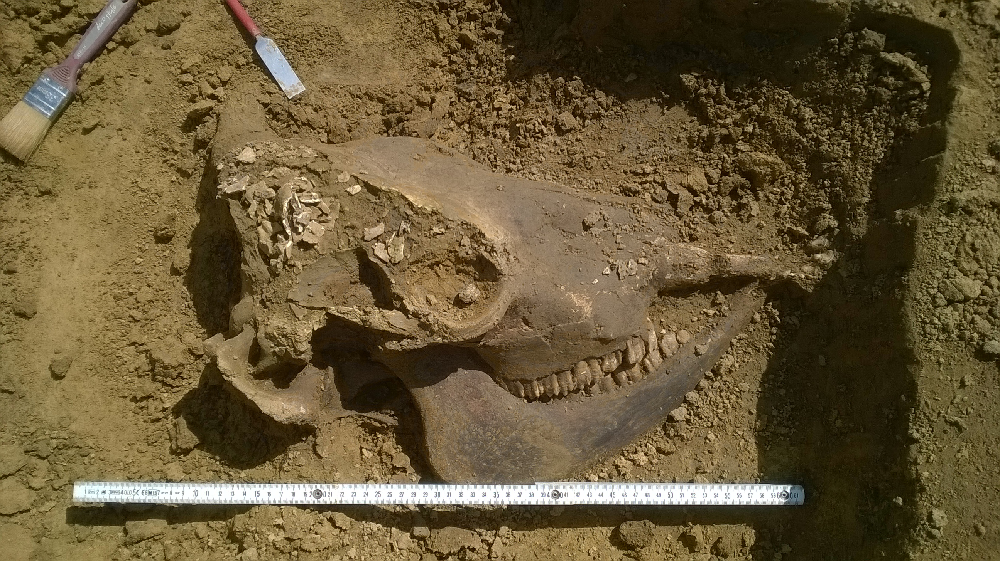

Die wechselseitige Beziehung von Bibliotheken auf der einen und Tieren
diverser Couleur auf der anderen Seite ist von gegenseitigem Geben und
Nehmen geprägt. Das Spektrum reicht von den bei Lesern und Nutzern
beliebten Vorlesehunden und Bibliothekskatzen bis hin zu Schädlingen wie
Bücherwürmern und Kleinnagern.[^1] Es gibt also zum einen absichtliche
und gewollt herbeigeführte, zum anderen unabsichtliche und eher
ungewollte Begegnungen. Letztere enden zudem nicht selten negativ für
alle Beteiligten, nicht zuletzt auch für unsere Buchbestände.

Für einige der wertvollsten Werke jedoch, die man in unseren Beständen
bewundern kann ‒ Bücher, deren Beschreibstoff "Pergament" ist ‒ waren es
aber die Tiere, die hier Leib und Leben lassen mussten.

In folgendem Aufsatz soll es zum einen um Pergament gehen, Herkunft,
Geschichte und Herstellung, aber zum anderen vor allem auch um die
Tiere, die, zwangsläufig, eine zentrale Rolle spielen. Der Schwerpunkt
soll hier bei Schafen und Rindern liegen.

### Pergament -- was ist das eigentlich?

Pergament ist ein Beschreibstoff, der aus der Haut von Wirbeltieren
hergestellt wird. Definiert wird es dabei als "enthaarte,
spanngetrocknete \[...\] nicht gegerbte Haut".[^2] Zumeist werden
beziehungsweise wurden die Häute von Rindern, Kälbern, Schafen, Ziegen
oder Schweinen dafür verwendet. Aber auch Häute anderer Tiere, wie die
von Rehen und Hirschen, dienten als Rohstoff.[^3]

Die rohen Häute werden zunächst etwa zwei Tage im Wasserbad gereinigt
(Weiche). Danach folgt das sogenannte Äschern, bei dem die Häute über
längere Zeit in einer Kalklauge gebeizt werden. Anschließend werden die
letzten Reste von Fettgewebe, Fleischresten und Haaren auf dem
Gerberbaum, einem Holzbock, abgeschabt, bis nur noch die reine weiße
Lederhaut zurückbleibt. Nach weiterem Waschen wird die Haut in einen
zumeist hölzernen Rahmen gespannt. Durch das Trocknen zieht sich die
Haut dabei stark zusammen, und kann reißen. Die Collagen-Fasern ordnen
sich jetzt neu an, und das Material wird opak, zudem wird das Blatt fest
und flexibel. Vor dem Beschreiben müssen diese Häute jedoch noch
geschliffen und auf die gewünschte Stärke geschabt werden, wobei es
Unterschiede zwischen Haut- oder Narbenseite gibt. Um den Mal- oder
Schreibgrund feinsamtig und fettfrei zu bekommen müssen noch weitere
Arbeitsschritte durchgeführt werden, mit deren Feinheiten oft die
Schreiber selbst betraut waren.[^4]

Chemisch wird die Struktur von Pergament vor allem durch Collagen (auch
Kollagen) geprägt, einem langkettigen Skleroprotein, das lange Fasern
aufweist und daraus eine Art dreidimensionales Netz oder Geflecht
bildet. Dieses stützt den Körper, den es umgibt, schützt ihn vor der
Umwelt und dient damit auch als Grundlage der späteren
Materialeigenschaften des daraus gewonnenen Pergaments.[^5]

Je nach verwendeter Tierart, dem Alter, Geschlecht und individuellen
Eigenheiten variiert das Pergament in Qualität, Farbe und Dicke. Das
feine, papierdünne Jungfernpergament, *charta virginea*, wird von
neugeborenen Lämmern gewonnen.[^6]

### Pergament -- gestern und heute

Zu den frühesten pergamentartigen Funden gehört eine Schriftrolle aus
dem Kairo des 2. Jahrtausend v. Chr. Der antiken Überlieferung nach
wurde Pergament im 2. Jahrhundert v. Chr. in der kleinasiatischen Stadt
Pergamon erfunden, wo unter König Eumenes II. (197--159 v. Chr.) die
Herstellung verfeinert wurde. Der heutige Name "Pergament" stammt von
den antiken Bezeichnungen ab, also *membrana pergamena, pergamenum* oder
*charta pergamena.* In griechischen Quellen wird es διϕτέρα[^7] genannt.
Einige Jahrhunderte parallel zum Papyrus verwendet, verhalf die immer
größere Verbreitung der Codex-Buchform dem Pergament zum Aufstieg, denn
das Papyrus war dafür weniger gut geeignet. Ein weiterer Vorteil des
Pergaments ist, dass es prinzipiell überall dort hergestellt werden
kann, wo es geeignete Tiere gibt. Im Gegensatz dazu blieb Ägypten
primärer Herstellungsort für Papyrus. Zudem ist Pergament dauerhafter
und kann auch beidseitig beschrieben werden, und so deutlich mehr Inhalt
bei gleichem Platzbedarf fassen. All dies macht es für die Codex-Form
besonders gut geeignet.[^8]

Ab dem 4. Jahrhundert löste das Pergament rasch den Papyrus ab, wobei
die Möglichkeit es lokal herstellen zu können mit der Tatsache
einherging, dass Importe von Papyrus aus Ägypten immer schwieriger zu
bekommen waren. Spätestens ab dem 8. Jahrhundert dominierte Pergament
das europäische Schriftwesen. Die Buchproduktion war dabei anfangs eng
mit der Pergamentherstellung verknüpft, beides geschah in der Regel am
gleichen Ort. Pergament wurde schwerpunktmäßig für den eigenen Bedarf in
den Klöstern produziert und dort auch gleich zu Codices
weiterverarbeitet. Hinzu kommt Pergament für Urkunden. Die Prunkstücke
vieler Bibliotheken zeugen auch heute noch von dieser Zeit. Ab dem 13.
Jahrhundert wurde der Beschreibstoff auch von Laien, berufsmäßigen
Pergamentern, hergestellt.[^9]

Ab dem 13. Jahrhundert wurde das Pergament langsam von einem
ursprünglich chinesischen Beschreibstoff verdrängt, dem Papier. Bereits
im 12. Jahrhundert wurden die ersten Produktionsstätten im damals
arabischen Spanien errichtet, 1390 schließlich die erste deutsche
Papiermühle in Nürnberg. Die zunehmende Verbreitung des Papiers hing
auch mit dem aufkommenden Buchdruck ab den 1440er Jahren zusammen. Das
deutlich teurere Pergament konnte den stark ansteigenden Bedarf der
überall entstehenden Druckereien nicht decken. Zudem war Papier durch
seine Materialeigenschaften für den Druck besser geeignet.[^10]

Pergament spielt heutzutage als Beschreibmaterial nur noch eine sehr
untergeordnete Rolle, etwa für Urkunden oder Reparaturen von
Handschriften. Dank der Allgegenwart des Papiers und dem aktuellen Trend
zu E-Publikationen wurde es zu einem hochspezialisierten
Nischenprodukt.[^11]

Was auch in seiner Hochzeit das Pergament teuer, aufwändig und selten
machte, war der immense Aufwand, der für nur einen Codex betrieben
werden musste. Denn die Herstellung des Pergaments war nur der erste
Schritt. Die Seiten mussten ja noch beschrieben und illustriert, das
ganze Buch mit einem Einband[^12] versehen werden.[^13]

Immens war auch der Bedarf an Tieren. Für einen Codex mit 100
Doppelblättern wurden etwa 25 Häute gebraucht, also 25 Kälber. Einer mit
300 Blättern, Format etwa DIN A3, benötigt etwa 75 Kälber, wobei
folglich jedes Kalb zwei Doppelblätter lieferte. Für eine große Bibel
muss man mit 600 Schafen rechnen. Wenn man für die etwa 3.300 Klöster in
Deutschland des 13. Jahrhunderts[^14] jeweils nur mit 50 Büchern
rechnet, kommt man schnell auf sehr große Zahlen: [^15]

Codex für 50 Kälber x 50 = 2.500 Kälber pro Kloster

2.500 Kälber x 3.300 Klöster = **8.250.000** Kälber

Wobei größere Tiere natürlich mehr Seiten liefern als kleine.
Dementsprechend schaut die Rechnung für Schafe so aus:

Bibel für 600 Schafe x 50 = 30.000 Schafe pro Kloster

30.000 Schafe x 3.300 Klöster = **99.000.000** Schafe

Große Bibliotheken, wie Kloster Eberbach oder St. Gallen, kommen alleine
schon auf 1.000 (50.000 Kälber / 600.000 Schafe) beziehungsweise 2.100
Codices (105.000 Kälber / 1.260.000 Schafe). Für Kloster Eberbach sind
für das Jahr 1500 mehr als 2.000 Schafe nachgewiesen, wobei deren Häute,
neben Wolle und Fleisch, nur ein Teil ihres Nutzens darstellen.[^16]

Tatsächlich gibt es auch Hochrechnungen, wie viele Handschriften
ursprünglich hergestellt wurden, also inklusive derjenigen, die bis
heute verloren gegangen sind. Für Deutschland in der Zeit vom 8. bis 15.
Jahrhundert geht man von 1,4 bis 1,8 Millionen Büchern aus. Folglich
ergibt sich:[^17]

Codex für 50 Kälber x 1.400.000 = **70.000.000** Kälber

oder

Bibel für 600 Schafe x 1.400.000 = **840.000.000** Schafe

Diese Rechnungen sind natürlich reine Zahlenspielereien, und weder
belastbar noch repräsentativ; sie sollen lediglich einen Anhaltspunkt
für die benötigten Tiere geben. Nicht zu vergessen ist, dass Pergament
verschiedener Tiere verwendet wurde, und nicht nur, so wie hier
angedeutet, singulär von einer Gattung. Auch muss man die gestiegene
Bedeutung von Papier vor allem im 15. Jahrhundert berücksichtigen.

Was aber in jedem Fall ersichtlich wird, ist die Tatsache, dass es eine
riesige Menge an Tieren war, deren Häute zu Pergament verarbeitet
wurden, vor allem, da sich die oben genannten Zahlen alleine auf
Deutschland beschränken.

Und dies führt uns zum zweiten Teil: den Tieren.

### Tiere -- welche sind das überhaupt, und was macht man mit ihnen?

Neben dem Ackerbau, und in geringerem Maße der Jagd, stellt die Nutz-
bzw. Haustierhaltung[^18] eine der wichtigsten Säulen der
Nahrungsmittelversorgung dar. Auch im Mittelalter war dies nicht
anders.[^19]

Die Häute und die Felle von Tieren stellen einen wichtigen, heute oft
umstrittenen Rohstoff dar. Leder wird und wurde daraus gegerbt, aber
auch unser Pergament. Meist werden die Tiere aber wegen ihrer
Arbeitskraft, ihrem Fleisch, ihrer Milch oder ihrer Wolle gehalten, und
die Häute fallen, wie Innereien, Hörner oder Haare, als "Nebenprodukt"
bei der Schlachtung ab.[^20]

Der Versuch sich der Haustierhaltung im deutschen Mittelalter zu nähern
führt fast zwangsläufig auch zu einer Betrachtung der archäologischen
Fundsituation. Dabei ist zwangsläufig von einem unvollständigen, von der
jeweiligen Erhaltungssituation abhängigen und generell einem nicht
unbedingt immer repräsentativen, da vom Zufall bestimmten Bild
auszugehen.[^21]

Im Folgenden sollen exemplarisch die beiden wichtigsten Tierarten für
die Pergamentherstellung, Schaf und Rind, sowie die Ziege vorgestellt
werden.

#### Schafe und Ziegen

Das Schaf (*ovis*) gehört zu den ältesten Nutztieren, und wurde bereits
im 9. Jahrhundert v. Chr. in Südwestasien domestiziert. Schafe sind
relativ genügsam, haben eine hohe Reproduktionsrate und bieten ein
breites Nutzungsspektrum: Fleisch, Milch, Wolle und Fell beziehungsweise
Haut für unser Pergament. Die fast wichtigste Nutzung war jedoch die
Wolle, die von Tuchwebern zu Stoff verarbeitet wurde, wobei ein
mittelalterlicher Handwerker etwa 40--50 Schafe abdecken konnte. Der
Wollstoff selbst wurde dann, neben dem lokalen Eigenverbrauch, auch zum
europäischen Handelsgut.[^22]

Es sind einige phänotypisch unterschiedliche Rassen bekannt, eine lange
postulierte "Urrasse" kann im Fundmaterial aber nicht ausgemacht werden.
Die teils erheblichen regionalen Unterschiede umfassen etwa Größe, wobei
norddeutsche Tiere bis zu 10 cm größer waren als süddeutsche, und
Körperbau, norddeutsche waren schlanker, süddeutsche eher gedrungener.
Zudem scheinen hornlose Tiere verbreiteter gewesen zu sein als gehörnte.
Grundlegende züchterische Maßnahmen zur gezielten Ertragssteigerung von
Wolle scheinen aber nicht durchgeführt worden zu sein, auch wenn edlere,
ertragreichere Tiere sehr begehrt waren und auch gehandelt wurden
(beziehungsweise eben dieser Handel untersagt wurde). Heute ist die
Bedeutung der Wolle aufgrund der Durchsetzung synthetischer Fasern stark
zurückgegangen. Stattdessen werden die Tiere vornehmlich wegen ihres
Fleisches gezüchtet.[^23]

Die Ziege (*capra*), die "Kuh des kleinen Mannes"[^24], kann unter sehr
kargen Bedingungen gehalten werden und alleine zur Subsistenzversorgung
durch Milch und Fleisch beitragen. Sie wurde ebenfalls im 9. Jahrhundert
v. Chr. in Mesopotamien vor allem zur Fleischnutzung domestiziert. Im
Vergleich zu Schafen stellen Ziegen im gebirgigen Südwesteuropa etwa
30--60 % der Knochenfunde bei den Kleinwiederkäuern, im restlichen
Europa nur 10 bis 20 %.[^25]

Nutzung fanden zudem die Hörner und, von speziellen Wollrassen wie der
heutigen Angoraziege, auch eben die Wolle, wenn auch das Hauptaugenmerk
nach wie vor auf Milch und Fleisch lag. Für die Pergamentherstellung
wurden Schafe und Ziegen während des frühen und hohen Mittelalters vor
allem in Südeuropa herangezogen.[^26]

Laut der *Ernährungs- und Landwirtschaftsorganisation der Vereinten
Nationen* (FAO) lebten im Jahr 2017 weltweit fast 1,5 Milliarden Schafe
und etwa 1 Milliarde Ziegen. In Deutschland alleine waren es 1,8
Millionen beziehungsweise 100.000 Tiere, von denen circa 1 Million
beziehungsweise 20.000 geschlachtet wurden.[^27]

Abbildung 1: Schafe gehörten zu den wichtigsten Pegamentlieferanten.
Dieses Bild zeigt jedoch eine rezente Rasse. Foto: Pixabay

#### Rinder

Die heutigen Hausrinder (*bos*) stammen alle vom heute ausgestorbenen
Auerochsen (*Bos primigenius*) ab. Erste sichere Funde von
domestizierten Tieren sind aus dem 7. bis 6. Jahrhundert v. Chr. aus dem
griechischen Thessalien überliefert. Die wichtigsten Nutzungen waren als
Fleisch- und Milchlieferant und als Zugtier von Pflug oder Wagen.[^28]

In römischer Zeit wurden relativ große, kräftige und langgestreckte
Tiere gehalten, was auch dafür gesorgt hat, dass noch im Mittelalter auf
ehemals römischem Gebiet am Niederrhein und in Süddeutschland große
Tiere lebten. Generell jedoch ist ein Trend zu kleineren, schlankeren
und lokal deutlich unterschiedlichen Tieren zu erkennen, wobei ab dem
Spätmittelalter wieder eine Größenzunahme zu erkennen ist.[^29]

Nicht zuletzt wegen seiner Rolle als Zugtier blieb das Rind im
Mittelalter das wirtschaftlich vielleicht wichtigste Tier. Im frühen
Mittelalter wurde es rein zahlenmäßig von Schweinen abgelöst, die fast
ausschließlich zur Fleischerzeugung dienten. Dieser Trend änderte sich
aber ab dem hohen Mittelalter wieder. Für die Pergamentherstellung
wurden Rinder beziehungsweise ihre Kälber während des frühen und hohen
Mittelalters vor allem in Nordeuropa herangezogen.[^30]

Laut der *Ernährungs- und Landwirtschaftsorganisation der Vereinten
Nationen* (FAO) lebten im Jahr 2017 weltweit fast 1,5 Milliarden Rinder.
In Deutschland alleine waren es 12,3 Millionen Tiere, von denen circa
3,5 Millionen geschlachtet wurden.[^31]

Abbildung 2: Vermutlich römerzeitlicher Rinderschädel auf einer
archäologischen Ausgrabung aus dem Jahr 2016. Foto: M. Becht

### Ausblick, oder: Tiere und Pergament heute

Natürlich gehorcht die heutige Haustierhaltung ganz anderen Regeln und
Gesetzmäßigkeiten, als die vergangener Epochen, nicht zuletzt was das
Schlachtverhalten anbelangt. Auch stark gewandelt ist die
zeitgenössische Bewertung, was moralische Aspekte anbelangt.

Im Zuge der zunehmenden Industrialisierung der Tierhaltung nach dem
Zweiten Weltkrieg entwickelte sich auch eine Gegenbewegung, die ab den
1960er Jahren das Tierwohl in den Fokus nahm. Heute sind Proteste gegen
Massentierhaltung beziehungsweise gegen die Bedingungen dieser
Massentierhaltung an der Tagesordnung. Auch das Konzept der
Nachhaltigkeit ist hier von Bedeutung.[^32]

Dem gemeinen Bibliothekar werden wohl weder Schafe noch Rinder
tagtäglich über den Weg laufen. Falls doch, so sollte man darauf achten,
Rinder nicht zu bedrängen oder zu lange anzustarren. 2010 kamen alleine
in Deutschland sieben Landwirte durch ihr Vieh ums Leben. Auch in freier
Natur sollte man deshalb immer an die Warnung der Landwirtschaftskammer
Tirol denken: "Eine Alm ist kein Streichelzoo!"[^33]

Schafe hingegen sind deutlich friedfertiger, man sollte sich hier mehr
vor dem Hütehund in Acht nehmen -- vor allem, wenn man selbst einen Hund
mit sich führt. Weder sollte man eine Herde durchqueren, noch mit dem
Auto hupen, sondern sich stattdessen geduldig und respektvoll
verhalten.[^34]

Im bibliothekarischen Berufsalltag werden es vor allem die Kolleginnen
und Kollegen vom Alten Buch sein, die sich mit Tieren in Pergamentform
auseinandersetzen. Für Tierwohl ist es hier zu spät, und auch die
Haltungsbedingungen gehorchen ganz anderen Regeln.

### Literatur

**Benecke 1994a**

Norbert Benecke: Archäozoologische Studien zur Entwicklung der
Haustierhaltung in Mitteleuropa und Südskandinavien von den Anfängen bis
zum ausgehenden Mittelalter, Schriften zur Ur- und Frühgeschichte 46,
Berlin 1994
<https://doi.org/10.1515/9783050069456>
(15.07.2020).

**Benecke 1994b**

Norbert Benecke: Der Mensch und seine Haustiere, Berlin 1994.

**Bischoff 1986**

Bernhard Bischoff: Paläographie des römischen Altertums und des
abendländischen Mittelalters, Berlin ²1986.

**Buringh 2011**

Eltja Buringh: Medieval Manuscript Production in the Latin West, Leiden
2011.

**Corbach 2003**

Almuth Corbach: Von der Haut zur Codexform -- Metamorphose eines Organs,
in: Ulrike Zeuch (Hrsg.): Verborgen im Buch, verborgen im Körper,
Wolfenbüttel 2003, S. 13--45.

**Doll 2003**

Monika Doll: Haustierhaltung und Schlachtsitten des Mittelalters und der
Neuzeit, Internationale Archäologie 78, Rahden 2003.

**Eberbach 2016**

Pressemitteilung der Stiftung Kloster Eberbach: Klösterliche
Schafhaltung im Kloster Eberbach. Stiftung veranschaulicht grundlegenden
Bewirtschaftungsansatz der Zisterzienser. Erfolgreiche Kooperation mit
Kiedricher Schafzüchter, Eberbach 2016
<https://kloster-eberbach.de/fileadmin/media/stiftung/Pressemitteilungen/20160322_PM_StiftungKlosterEberbach_Kl%C3%B6sterliche-Schafhaltung.pdf>
(14.07.2020).

**FAO 2019**

Food and Agricultural Organization of the United Nations: World Food and
Agriculture -- Statistical pocketbook 2019, Rom 2019
<http://www.fao.org/3/ca6463en/CA6463EN.pdf>
(22.07.2020).

**Haidlinger 2016**

Alois Haidlinger: Beschreibstoffe, in: Christine Beier (Hrsg.):
Geschichte der Buchkultur, Band 5/1, Graz 2016, S. 17--38.

**Henning 1994**

Friedrich-Wilhelm Henning: Deutsche Agrargeschichte des Mittelalters. 9.
bis 15. Jahrhundert, Stuttgart 1994.

**Hilz 2019**

Helmut Hilz: Buchgeschichte. Eine Einführung, Berlin 2019.

**Jakobi-Mirwald 2004**

Christine Jakobi-Mirwald: Das mittelalterliche Buch, Stuttgart 2004.

**Foerster 1981**

Hans Foerster: Abriss der lateinischen Paläographie, Stuttgart ²1981.

**Fuchs -- Meinert -- Schrempf 2001**

Robert Fuchs, Christiane Meinert, Johannes Schrempf: Pergament.
Geschichte -- Material -- Konservierung -- Restaurierung, München 2001.

**Levin 2018**

Rachel Levin: Kühe anstarren verboten!, München 2018.

**Rimkus 2015**

Marco Rimkus: Welternährung, Nutztierschutz und Lebensmittelsicherheit,
Berlin 2015.

**Sambraus 1996**

Hans Hinrich Sambraus: Atlas der Nutztierrassen, Stuttgart ^5^1996.

**Santifaller 1953**

Leo Santifaller: Beiträge zur Geschichte der Beschreibstoffe im
Mittelalter, Graz und Köln 1953.

**Statista 2020a**

Webseite der Firma Statista, Seite "Anzahl der gewerblich geschlachteten
Tiere (ohne Geflügel) in Deutschland nach Tierarten in den Jahren 1993
bis 2019"

<https://de.statista.com/statistik/daten/studie/77515/umfrage/gewerblich-geschlachtete-tiere-seit-2009/>
(05.08.2020)

**Statista 2020b**

Webseite der Firma Statista, Seite "Bestandsentwicklung an Nutztieren in
Deutschland im Verlauf der Jahre 1900 bis 2018"
<https://de.statista.com/statistik/daten/studie/659045/umfrage/nutztierbestand-in-deutschland/>
(05.08.2020)

**St. Gallen 2020**

Webseite der Stiftsbibliothek St. Gallen, Seite "Handschriften"
<https://www.stiftsbezirk.ch/de/stiftsbibliothek/handschriften/>
(15.07.2020).

**Visscher 1991**

J. Visscher: Looking back on a Lifetime in Parchmentmaking at William
Cowley, in: Peter Rück (Hrsg.): Pergament. Geschichte, Struktur,
Restaurierung, Herstellung, Sigmaringen 1991, S. 341--358.

[^1]: Hier kann der interessierte Leser auf den Blog des Fachbereichs
    für Informations- und Bibliothekswesen in München,
    [[www.aubib.de]{.underline}](http://www.aubib.de/), verwiesen
    werden, auf dem eine gezählte Artikelserie zum Thema "Bibliotheken
    und Tiere" veröffentlicht wird.

[^2]: Fuchs -- Meinert -- Schrempf 2001, S. 36.

[^3]: Fuchs -- Meinert -- Schrempf 2001, S. 36, 40; Corbach 2003, S. 15.

[^4]: Fuchs -- Meinert -- Schrempf 2001, S. 36, 40--42, 49--51, 62;
    Foerster 1981, S. 55.; Corbach 2003, S. 18--21.

[^5]: Fuchs -- Meinert -- Schrempf 2001, S. 9, 15; Corbach 2003, S. 15.

[^6]: Fuchs -- Meinert -- Schrempf 2001, S. 54-55, widerspricht hier der
    in der Literatur (zum Beispiel Bischoff 1986, S. 24--25) auch zu
    lesenden Theorie, das Jungfernpergament entstünde aus ungeborenen
    Tieren; Fuchs -- Meinert -- Schrempf 2001, S. 18--30, 54--55;
    Corbach 2003, S. 16--17; Foerster 1981, S. 55; Bischoff 1986, S.
    24--25.

[^7]: Umschrift: diphtera.

[^8]: Santifaller 1953, S. 77--79; Hilz 2019, S. 8--9; Foerster 1981, S.
    45, 48, 53--54, Corbach 2003, S. 13--14; Jakobi-Mirwald 2004, S.
    119.

[^9]: Hier sei beispielhaft das *Brevarium Alarici* (Clm 22501) in der
    Bayerischen Staatsbibliothek genannt.; Fuchs -- Meinert -- Schrempf
    2001, S. 9, 32--33, 61--62; Hilz 2019, S. 10--11; Foerster 1981, S.
    53--54; Corbach 2003, S. 14, 24; Haidinger 2016, S. 20--22.

[^10]: Fuchs -- Meinert -- Schrempf 2001, S. 9, 34; Hilz 2019, S. 28,
    43; Foerster 1981, S. 27--28; Corbach 2003, S. 14; Haidinger 2016,
    S. 22--23.

[^11]: Visscher 1992, S. 344. Im bibliothekarischen Kontext denkt man
    hier auch an Fragen der Bestandserhaltung, der Lagerung und der
    Restaurierung.

[^12]: Genauer hierzu: Alois Haidinger: Der gotische Bucheinband, in:
    Christine Beier (Hrsg.): Geschichte der Buchkultur, Band 5/1, Graz
    2016, S. 39--62.

[^13]: Hilz 2019, S. 10--15; Corbach 2003, S. 24--25; Jakobi-Mirwald
    2004, S. 132--148.

[^14]: Buringh 2011, Tabelle 2.14 S. 90.

[^15]: Haidlinger 2016, S. 21; Jakobi-Mirwald 2004, S. 118; Eberbach
    2016, S. 2.

[^16]: Eberbach 2020, S. 2; St. Gallen 2020.

[^17]: Buringh 2011, S. 264.

[^18]: In zoologischer Sicht geht der Begriff "Haustier" über Hund und
    Katze hinaus, und meint auch Nutztiere, wie Rind und Schaf, in
    Abgrenzung zu Wildtieren, wie Rehen und Hirschen (Benecke 1994a, S.
    20).

[^19]: Benecke 1994a, S. 189.

[^20]: Doll 2003, S. 162--165.

[^21]: Benecke 1994a, S. 182--183.

[^22]: Benecke 1994a, S. 122--123, 12--127, 228--229; Henning 1994, S.
    233--234; Sambraus 1996, S. 102--103.

[^23]: Henning 1994, S. 233--234, 236, Benecke 1994a, S. 236; Benecke
    1994b, S. 220--222.

[^24]: Benecke 1994b, S. 238.

[^25]: Benecke 1994b, S. 238--245; Sambraus 1996, S. 163--164.

[^26]: Benecke 1994b, S. 246--247; Sambraus 1996, S. 163--164; Doll
    2003, S. 164; Hilz 2019, S. 14.

[^27]: FAO 2019, Tabelle 6 S. 30; Statista 2020a; Statista 2020b.

[^28]: Benecke 1994a, S. 208; Benecke 1994b, S. 260--261, 264--265,
    272--274; Sambraus 1996, S. 29.

[^29]: Benecke 1994a, S. 216--218; Benecke 1994b, S. 274--276.

[^30]: Benecke 1994a, S. 195--196, 202, 207--208; Doll 2003, S. 164;
    Hilz 2019, S. 14.

[^31]: FAO 2019, Tabelle 6 S. 30; Statista 2020a; Statista 2020b.

[^32]: Rimkus 2015, S. 43, 47.

[^33]: Levin 2018, S. 76--77.

[^34]: Levin 2018, S. 102--103.
