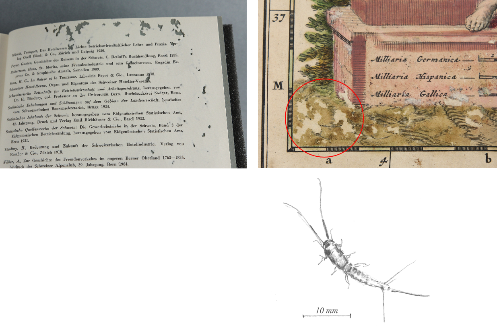

Die Bibliothek Münstergasse ist eine Teilbibliothek der
Universitätsbibliothek Bern und befindet sich im Herzen von Bern in
einem historischen Gebäude. Die Altstadt von Bern ist nicht nur ein
schöner und idealer Ort für eine Bibliothek, sie ist auch natürlicher
Lebensraum für Mäuse, Schaben und andere Insekten und Kleintiere.

Nach einer Totalrenovation des Bibliotheksgebäudes in den Jahren 2014
bis 2016 wurde bereits vor dem Einzug der Bibliotheksbestände zurück in
die Magazinräumlichkeiten ein Schädlingsmonitoring durchgeführt.

Das Monitoring wurde einer externen Firma in Auftrag gegeben und
umfasste Fallen für Mäuse und Klebefallen für Schaben, Silberfische und
andere Insektenarten. Die Zusammenarbeit von Konservierung und
Hausdienst vor Ort gewährleistete, dass auch die heikleren und
versteckten Orte überwacht wurden. Tiere können über Fenster, Türen,
kleinste Ritze oder gar Rohrsysteme in das Gebäude gelangen. Ein
weiterer Weg ist die Einschleppung über Paletten und Verpackungsmaterial
von Anlieferungen oder generell über Neuzugänge. Papierfischchen (*lat.
ctenolepisma longicaudata*), die grosse Populationen bilden können,
lieben Karton und Seidenpapier. Manchmal sind sie nur als Ei oder kleine
Nymphen vorhanden und bilden sich erst Monate später zu einem adulten,
gefrässigen Tier aus. Ein Auftauchen von Schädlingen muss grundsätzlich
so früh wie möglich erkannt werden, um rechtzeitig handeln zu können.
Idealerweise werden Neuzugänge zuerst in Quarantäne genommen und
intensiv gereinigt, bevor sie in die Magazine gebracht werden.

Es stellte sich heraus, dass das Haus nach dem Umbau frei von grösseren
Insekten- oder Nagerpopulationen war und der Bibliotheksbestand in eine
weitgehend schädlingsfreie Umgebung einziehen konnte. Nun war es
wichtig, diesen guten Zustand auch weiterhin zu überwachen, vor allem
weil neu auch ein Gastronomiebetrieb in das Haus zog. Essen, Getränke
und Vorräte locken Tiere an. Insekten und Silberfischchen mögen Proteine
und Kohlenhydrate, die sich auch in den Materialien unserer historischen
Bibliotheksbestände befinden.

Es folgte ein weiterer Auftrag an die Schädlingsbekämpfungsfirma, die
ein Monitoring zuerst jeden zweiten, dann jeden dritten Monat
durchführte. Zwischenzeitlich finden diese noch zweimal im Jahr statt,
aber die Fachleute sind natürlich jederzeit ansprechbar für aktuell
auftauchende Fragen.

Es besteht ein Ess- und Trinkverbot für die Nutzer der Lesesäle und auch
die Mitarbeitenden sind aufgefordert, Essen und Getränke nur an den
dafür vorgesehenen Orten zu konsumieren.

Gleichzeitig haben wir intern in der Dienststelle Konservierung
Ansprechpersonen, welche die Mitarbeitenden in der Bibliothek immer
wieder dazu ermuntern, die Augen offen zu halten und gesichtete Tiere zu
melden, damit sie identifiziert und klassifiziert werden können. Oft
gelangen Insekten von draussen in die Räumlichkeiten, welche
grundsätzlich für unsere Bestände keine Gefahr darstellen. Diese Tiere
sind aber ein gefundenes Fressen für gefährlichere Schädlinge, wenn sie
sich in Ritzen und Ecken verkriechen oder tot als Frass-Köder wirken.
Eine überwachte Klimatisierung der Magazin- und Atelierräumlichkeiten
und die Sicherstellung einer regelmässigen Reinigung sind genauso
wichtig wie das Schädlingsmonitoring. Insekten fühlen sich in Staub und
Schmutz grundsätzlich wohl. Abfälle müssen regelmässig und oft entsorgt
werden.

So sind wir seit dem Wiedereinzug in 2016 von Schädlingsbefall verschont
geblieben und hoffen, dass dies so bleibt. Ein konsequentes Monitoring
ist also weiterhin angezeigt.

Im Rahmen von internen und externen Veranstaltungen finden sporadisch
Weiterbildungen im Restaurierungsatelier statt, dies manchmal auch auf
spielerische Art: Die Teilnehmenden müssen anhand von konkreten
Beispielen an älteren Insekten- und Frass-Schäden herausfinden, welches
Tier hier am Werk war.

#### Hinweis zum Copyright der Bilder

Fotoaufnahmen: © Zentrum Historische Bestände, Bibliothek Münstergasse
Bern

Zeichnungen: © Andréa E. Bhend, Zentrum Historische Bestände, Bibliothek
Münstergasse Bern
