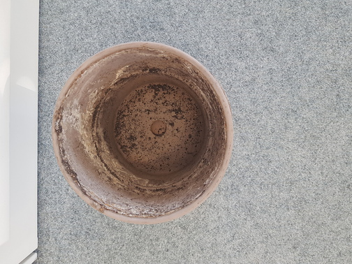

Adopted in 2013 at the EPFL library following a "librarian
Pedro-to-librarian Marjorie" donation, Gundula passed away in June 2020
at the Rolex Learning Center.

The office shutdown combined with the heatwave got the better of you.
Life is hard for a papyrus if it does not have water. The windows of the
building are dangerous. Gundula resisted well, but without her librarian
to water her, she withered and then dried up.

When she died, her librarian in charge wanted her to be buried in front
of the library staff entrance so that she could rest where she lived for
7 years.

Farewell Gundula, your long green stems and your parasol leaves will be
missed.