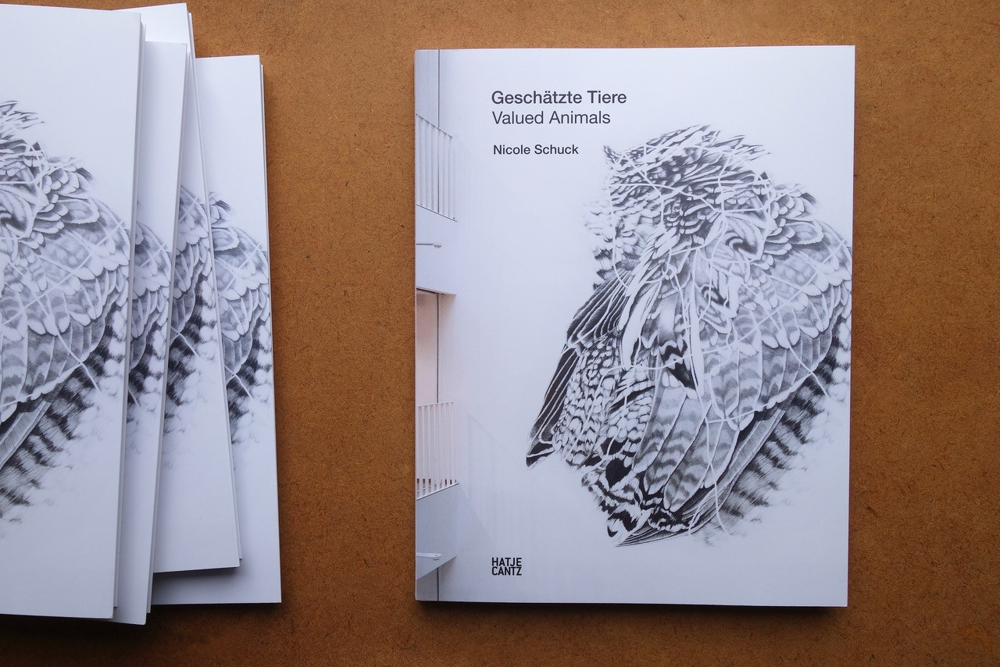
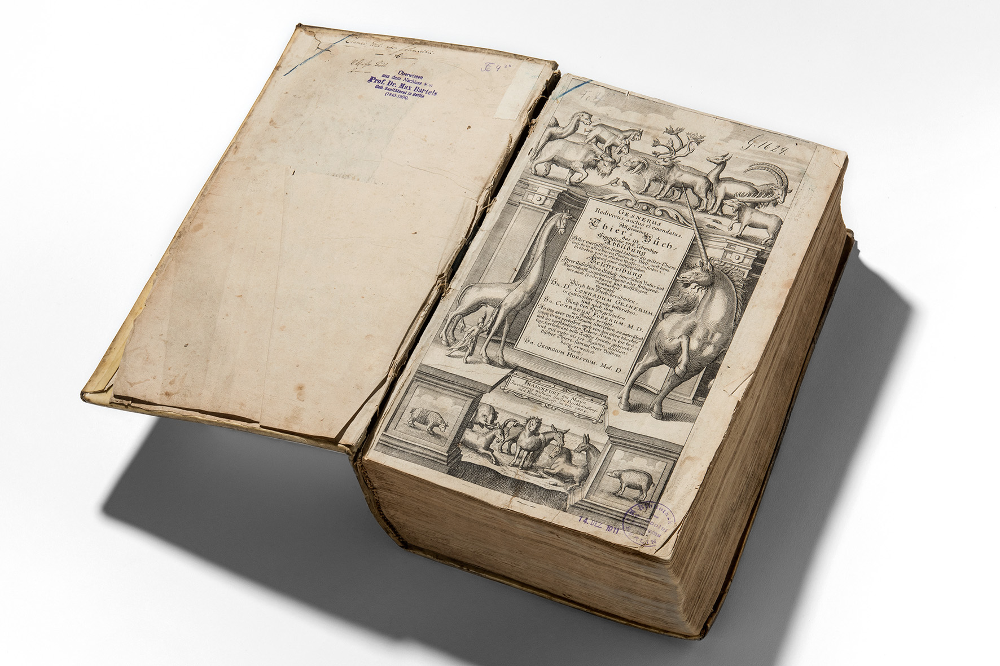

Vielen Dank, dass Sie sich bereit erklärt haben, unsere Fragen zu
beantworten. In der LIBREAS-Redaktion haben gemerkt, dass eine gewisse
Anzahl von Künstler\*innen und Kreativen, wenn sie mit und für
Bibliotheken und andere Bildungseinrichtungen arbeiten, gerne als Symbol
auf Tiere oder Pflanzen zurückgreifen. Uns interessiert, warum das so
ist.[^1] Gleichzeitig wollen wir die Möglichkeit auch nutzen, um von
Ihrer Seite zu hören, wie eine solche Zusammenarbeit mit Bibliotheken
ablaufen kann.

(Die Fragen stellte Jana Rumler)

### Nicole Schuck

*Wann kamen Sie das erste Mal in Ihrer Arbeit mit der Bibliothek des
Museums für Naturkunde in Kontakt? Hatte das Herantreten an die
Bibliothek bei Ihnen "Vorläufer", beispielsweise eigene Erfahrungen aus
der Kindheit und Jugend und später im künstlerischen Schaffen?*

Im Zentrum meiner künstlerischen Auseinandersetzung stehen Wildtiere,
natürliche und urbane Lebensräume, Fragen des Naturschutzes,
Klimawandels und der Werteökonomie. Meine Arbeitsweise basiert auf dem
Wechselspiel von Kunst und Wissenschaft, indem ich deren Schnittstellen
und Überschneidungsflächen auslote und aus ihren unterschiedlichen
Forschungs- und Erkenntnismöglichkeiten schöpfe.

Der erste persönliche Besuch der Bibliothek fand 2007 im Rahmen des
Projektes «HUM» im Museum für Naturkunde (MfN) statt, zu dem ich als
*Performende* eingeladen wurde. Die Fülle an naturbezüglichen
historischen Büchern beeindruckte mich sehr und die Bibliothek in ihrem
gesamten Erscheinungsbild bietet eine Zeitreise durch die Geschichte.
Fortan dachte ich immer wieder an diesen spannenden Ort der
Wissenssammlung mit den zahlreichen Regalen und Schränken.

Für die Ausstellung «On the Edge» im Tieranatomischen Theater in Berlin
2015 wurde ich eingeladen, eine Arbeit im Dialog mit Objekten aus den
wissenschaftlichen Sammlungen der Humboldt-Universität zu Berlin zu
konzipieren. Meine langjährige Auseinandersetzung mit Wildtieren führte
mich derzeit zu dem Thema «Naturkapital». Auch wenn das Museum für
Naturkunde heute ein Forschungsmuseum der Leibniz-Gemeinschaft ist und
nicht zu der Sammlung der Humboldt-Universität gehört, kam der Wunsch
auf, eine Arbeit mit Folianten von Conrad Gessner aus der Bibliothek zu
realisieren. Seine Studien gewähren einen Einblick in eine Zeit, in der
Mythologie und Wissenschaft, Imagination und Beobachtung als
gleichwertige Erkenntnisquellen behandelt wurden. Die Überlappung dieser
unterschiedlichen Bereiche beschäftigt mich seit Jahren.

Bücher mit Tierdarstellungen und Geschichten über ihre Lebensweise
faszinieren mich seit meiner Kindheit. In meiner Verwandtschaft wurden
Bücher leidenschaftlich gesammelt und verschenkt, was mir zugute kam.
Bibliotheken waren und sind wichtige Orte der Recherche und Inspiration
für meine künstlerische Arbeit und werden es auch in Zukunft sein. Etwas
Bedeutendes zu finden, wonach ich nicht gesucht habe und es unter
anderem haptisch zu «begreifen», ist das Glück eines
Bibliotheksbesuches.

Mit meinem aktuellen Buch «Geschätzte Tiere» zum Wert von Wildtieren,
realisiert sich mein Anliegen, selbst Bücher zu Wildtieren und unserem
gemeinsamen Lebensraum herauszugeben.

*Unterschied sich die Arbeit mit einer Spezialbibliothek von jener mit
anderen Bibliotheken?*

Ja, für mich schon. Die Zugriffsmöglichkeiten am MfN sind andere, der
Bestand ist unkompliziert zugänglich und nutzbar. Der Unterschied ist
ein direkter Kontakt zu den Medien und den Personen, die seit vielen
Jahren mit dem Bestand vertraut sind. Martina Rißberger öffnete Türen
und Schränke, im wahrsten Sinne des Wortes, und ermöglichte mir auf
diese Weise den Zugang zu speziellem, wertvollem historischem Wissen.
Sie unterstützte mein Anliegen und stellte Bezüge zu Werken anderer
Autoren her, die mir vorher unbekannt waren. Als interessierte,
engagierte und feinsinnige Vermittlerin mit umfassendem Wissen, stellte
die Kommunikation mit ihr einen wichtigen Aspekt für die Entwicklung
meiner Arbeit dar.

*Die fachliche Leitung der Bibliothek hat Sie bei den kreativen
Prozessen begleitet. Wie sah die Zusammenarbeit konkret aus?*

Martina Rißberger ermöglichte mir Zugang zu allen Folianten Conrad
Gessners, die in der Bibliothek vorhanden sind und machte mich auf
weitere Autor\*innen aufmerksam, die thematisch interessant waren. Wir
tauschten uns zu den Inhalten und Tierdarstellungen aus und diskutierten
die unterschiedlichen Visualisierungen.

Mein Animationsvideo «Von Thieren auff der erde und wasseren ir wonung
habend» stellt 13 Kreaturen aus sechs verschiedenen Folianten Gessners
vor. Die Holzschnitte in den verschiedenen Ausgaben weichen voneinander
ab, die Veränderungen werden durch Überlagerungen der Bilder desselben
Tieres in dem Video visualisiert. Das wirft die Frage auf, inwiefern die
Übertragung von Wissen durch visuelle Mittel zu unserem, sich wandelnden
Verständnis der Welt beiträgt.

*Wie sind Sie vorgegangen, um zu den Motiven für Ihre Arbeiten,
speziell für Ihr 2020 erschienenes Buch «Geschätzte Tiere -- Valued
Animals»*[^2] *zu gelangen?*

Die Grundlage aller meiner Projekte der vergangenen Dekade, die in dem
Buch vorgestellt werden, ist eine ausführliche Recherche und
Feldforschung: Ich trage vielfältigste Informationen zum jeweiligen
Lebensraum von Wildtier und Mensch zusammen, durch Archivrecherche
(unter anderem Bibliotheken, Internet), Gespräche, Ortsbegehungen und
Kooperationen mit Spezialist\*innen wie Biolog\*innen, Zoolog\*innen,
Philosoph\*innen, Naturschützer\*innen und Einheimischen. Diese
wichtigen Bestandteile meiner Arbeit lassen ein erweitertes Verständnis
für die Fauna und den gemeinsamen Lebensraum entstehen. In meinen
Zeichnungen und Installationen transformiert sich dies zu eigenen
Formen, aus denen wiederum neue Erfahrungsebenen erwachsen.

*Stach das Vorgehen zum Projekt für Sie heraus aus Ihrem sonstigen
Schaffen oder würden Sie dieses eher als typisch für Ihre Projekte
ansehen?*

In meinen Projekten spielt der Austausch mit Expert\*innen eine wichtige
Rolle.

Das Besondere mit Martina Rißberger war und ist bis heute ihr großes
persönliches Interesse an meinen Projekten und ihre diesbezügliche
Unterstützung. Sich so auf meine Arbeiten einzulassen, eröffnet eine
tiefere Auseinandersetzung über die Inhalte.

*Ihre gezeichneten Tiere (Auster, Eule, Mauswiesel, Moorfrosch,
Rebhuhn, Uhu, Fledermaus, Stachelschwein und andere) zeichnen sich durch
die «Bewegungsvielfalt» mit «zeichnerischer Kontextualisierung» aus, wie
es ein Kunstkritiker in Ihrem Buch beschreibt.*[^3] *Was ist damit
gemeint?*

Hiermit ist die Linienführung gemeint mit der ich das Tier mit dem Stift
abtaste und bewandere. Der zeichnerische Impuls folgt jedem Tier
individuell, dem was seine Haut, seine Haare, seine Schale oder Federn
mir vorgeben. Die Linien verdichten sich, tauchen aus dem Weiss des
Papieres auf und wieder ab. Indem ich mich mit Bleistiften und ihrer
ganzen Palette von Grauwerten einem Tier und seinen Strukturen und
Beziehungen nähere -- oft über mehrere Wochen und Monate hinweg --,
entstehen profunde Beziehungen und Kenntnisse, was wiederum zu einer
großen Wertschätzung des Wildtieres als Individuum / Subjekt und für den
gemeinsamen Lebensraum führt. Die Zeichnung spürt ihnen nach, geht
individuell auf sie ein und hat keine systematischen Voraussetzungen --
außer dem linear-prozessualen Sich-Einlassen auf jedes einzelne Tier und
seine Bezüge. Wichtig ist mir hier, diese bedingungslose, nachdrücklich
unwissenschaftliche Wertschätzung des einzelnen Lebewesens und unserer
Umwelt sichtbar zu machen. Die Zeichnung erlaubt es damit, das an sich
nicht Sichtbare zur Darstellung zu bringen.

Papier als Bildträger ist für meine Zeichnungen sehr bedeutsam. Es
stellt eine Allegorie zu unserem gemeinsamen Lebensraum dar. Das Papier,
das von dem gezeichneten Tier «bewohnt» wird, reagiert auf kleinste
klimatische Veränderungen. Je höher die Luftfeuchtigkeit steigt, desto
welliger wird das Papier, was besonders bei den großen Formaten sichtbar
wird. Je trockener die Luft, desto mehr spannt sich die Oberfläche.
Papier ist in vielerlei Hinsicht empfindlich. Es reißt schnell, auch
Spuren vom Radieren und Ablegen der Hände prägen sich ins Papier ein.
Die Linie lässt sich an diesen Stellen nicht mehr so präzise und klar
ziehen, sie sieht verschwommener aus. Die Oberfläche wird durch die
Anwendung von Radierern offener und rauer. Auch direktes Tageslicht
verändert über einen langen Zeitraum ebenso das Erscheinungsbild des
Papiers.

Einen Folianten aus dem 16. Jahrhundert in den Händen zu halten, mit all
seinen in das Papier «eingeschriebenen» Lebensspuren visuell und
haptisch zu erleben, ist ein bewegender Moment, der Respekt hervorruft.
Diese Spuren selbst zu berühren, das alte Papier rascheln zu hören und
seinen Geruch wahrzunehmen, setzen die Informationen auf ihm in
bestimmte historische Zusammenhänge. Dieses direkte Mitvollziehen von
Geschichte und Geschichten verfängt sich anders in der Rezeption als
internetbasierte Recherche, der etwas Steriles anhaftet.

*Welches Potential steckt, Ihrer Meinung nach, in der Kommunikation
mit der und über die Bibliothek? Gab es besondere Anknüpfungspunkt zu
den Mitarbeitenden in der Bibliothek sowie mit den
Wissenschaftler\*innen im Kontext des Museums, die Sie für Ihre Arbeit
ebenfalls einbezogen haben?*

Das Potential der Bibliothek stellt für mich der umfassende Bestand und
das persönliche Engagement und Interesse an meiner künstlerischen Arbeit
von Martina Rißberger dar, welches sich aus dem Projekt «On the Edge»
2015 bis heute weiterentwickelte. Martina Rißberger denkt mit und knüpft
nicht nur inhaltliche Verbindungen ihr Feld betreffend, sondern
vermittelt Kontakte zu Wissenschaftler\*innen und Mitarbeiter\*innen,
die ihr inhaltlich sowie für die Verbreitung des Buches «Geschätzte
Tiere» sinnvoll erschienen. Beispielsweise basiert der Kontakt zu Jörg
Freyhof, Biologe und Bioökonom am Museum für Naturkunde und einer der
Autor\*innen meines Buches, auf ihrer Unterstützung.

Die erste Buchvorstellung überhaupt von «Geschätzte Tiere» kam durch
Martina Rißbergers Vermittlung zustanden. Wir planten gemeinsam die
Buchveröffentlichung im Mai live mit Gästen im Museum zu feiern.
Covid-19-bedingt realisierten wir stattdessen einen einstündigen
Instagram-Livestream-Spaziergang im Museum[^4], bei dem ich im Gespräch
mit zwei der Autor\*innen -- Jörg Freyhof und Georg Toepfer, Philosoph
und Biologe -- über den Wert von Wildtieren und Natur spreche. Elisa
Herrmann, Wissenschaftliche Leiterin der Bibliothekssammlung, führte in
bedeutende historische Tierdarstellungen aus wissenschaftlicher Sicht
ein.

Allgemein von Bedeutung ist, dass durch die Vermittlung des Bestandes
vielfältigste neue Publikationen entstehen und diese wiederum der
Öffentlichkeit weltweit zur Verfügung gestellt werden. Hier wird
wissenschaftlicher, und in meinem Fall transdisziplinärer Output
unterstützt.

*Welche Erfahrungen nehmen Sie aus der Zusammenarbeit mit dieser
Bibliothek mit?*

Die Zusammenarbeit mit Martina Rißberger ist eine herausragend gute und
unterstützende. Wie gut eine Zusammenarbeit funktioniert, hängt von den
jeweiligen Menschen ab, auf die man trifft und lässt sich demzufolge
nicht verallgemeinern. Je offener die Beteiligten sind und sich
interessiert einlassen, umso mehr kann sich daraus entwickeln.

*Sprechen Sie mit anderen Kreativen darüber, je nach Ausrichtung ihres
Schaffensprozesses, Bildungseinrichtungen wie Bibliotheken, Museen und
Archive einzubeziehen?*

Ja klar, der Austausch über Erlebtes mit Einrichtungen und Expert\*innen
ist Gesprächsstoff unter Gleichgesinnten. Positive Berichte können sich
inspirierend auswirken und zu neuen Projekten anregen. Die Bibliothek
des Museum für Naturkunde mit ihren unterstützenden Mitarbeitenden ist
ein wundervoller Ort der Wissenssammlung, -vermehrung und -verbreitung,
deren Besuch und Nutzung ich Interessierten nur ans Herz legen kann.

### Martina Rißberger

*Wie kam der Kontakt zur Künstlerin zustande? Gab es in der Bibliothek
vorher bereits ähnliche Projekte, die es Menschen erlaubte, die Bestände
und Räumlichkeit so zu nutzen, dass kreatives Schaffen ermöglicht werden
könnte?*

Der Kontakt zu der Künstlerin Nicole Schuck entstand ursprünglich durch
das Kunstprojekt der Humboldt-Universität «On the Edge», das im Jahr
2015 Künstler\*innen die Möglichkeit gab, in Beziehung zu Objekten aus
den wissenschaftlichen Sammlungen der Universität neue Kunstwerke zu
schaffen. Begründet auf ihrem naturwissenschaftlichen Interesse
entschied sich Nicole Schuck für die Zoologische Sammlung des Museums
für Naturkunde Berlin, die bis 2009 zur Humboldt-Universität gehörte.
Der Kontakt zur Bibliothek des Museums entstand durch ihre Auswahl des
in der Bibliothek befindlichen Bandes von Conrad Gessner: Das Thierbuch,
1669.

*Gab es Unterschiede in der Kommunikation im Vergleich zu den
typischen Nutzenden der wissenschaftlichen Spezialbibliothek (eines
integrierten Forschungsmuseums). Wenn ja, wie sahen diese aus? Gab es
besondere Anliegen, die bei Ihnen, den Mitarbeitenden und der
Künstlerin, geweckt wurden?*

Typische Nutzer der wissenschaftlichen Bibliothek am Museum für
Naturkunde Berlin sind deren Forscher\*innen und Mitarbeiter\*innen,
außerdem externe Wissenschaftler\*innen, Studierende, Schüler\*innen und
naturkundlich interessierte Bürger\*innen, einschließlich
Künstler\*innen. Das Anliegen der Künstlerin Nicole Schuck an die
Bibliothek bestand darin, verschiedene Auflagen des «Thierbuchs» von
Conrad Gessner aus dem Bestand der Bibliothek hinsichtlich der
wissenschaftlichen Illustration zu vergleichen. Dasselbe Motiv sollte in
den verschiedenen Ausgaben miteinander verglichen werden, woraus sich
die Fragestellung entwickelte, wie die Art der Darstellung im Kontext
steht mit dem Wissenschaftsstand der Zeit. Durch den breiten
historischen Bestand der Bibliothek war es möglich, dieses Anliegen zu
erfüllen.

*Wie haben Sie den Umgang mit den Rara-Beständen in der Zusammenarbeit
erlebt? Hat sich der fachliche Blick auf die Bestände verändert?*

Bei der Bereitstellung historischer Bibliotheksmedien für
Künstler\*innen steht das Interesse an der wissenschaftlichen
Illustration zumeist im Vordergrund. Ich setze beim Umgang mit
historischen Medien meine Kenntnisse der Buchkunst und auch der
Kunstgeschichte ein. In der Zusammenarbeit mit Nicole Schuck wurde meine
Aufmerksamkeit nachhaltig auf die Interpretationen der Illustrationen
hinsichtlich ihres Kontextes zu gesellschaftlichen und ökologischen
Aspekten der Zeitepoche gelenkt; ich könnte auch sagen hinsichtlich der
Wertschätzung der Tiere im jeweiligen Jahrhundert. Ich habe
diesbezüglich einen Wissenszuwachs erfahren, dass ich bei der
Betrachtung historischer Tierillustrationen den Blick stärker auf die in
ihnen ausgedrückte gesellschaftliche Wertschätzung richte.

*Haben Sie sich mit Fachkolleg\*innen, Mitarbeitenden und
Wissenschaftler\*innen dazu ausgetauscht wie man den kreativen
Schaffensprozess unterstützen kann?*

Ja, ich stand im Kontakt mit einem Zoologen und einer
Kunstwissenschaftlerin an unserem Institut.

*Die Künstlerin hat in diesem Jahr ein Buch veröffentlicht, das unter
anderem im Kontext der Arbeit mit der Bibliothek zu sehen ist. Dieses
ist dann auch, bedingt durch die Pandemie im digitalen Raum, über die
Öffentlichkeitsarbeit des Museums vorgestellt worden. Wie fruchtbringend
empfanden Sie die Kommunikation mit der Künstlerin?*

Die Kommunikation mit der Künstlerin Nicole Schuck war sehr
gewinnbringend. Die Inhalte ihres Buches «Geschätzte Tiere» greifen mit
den Inhalten unseres Bibliotheksbestandes ineinander. Das Wissen über
die Lebensräume der Wildtiere in ihrem Buch ist mit dem Wissen, das die
Bibliothek bewahrt, eng verwoben. Die erste öffentliche Präsentation
ihres Buches sollte deshalb auch am Museum für Naturkunde Berlin
stattfinden.

In der Zeit der Covid-19-Pandemie, die umso mehr den Zusammenhang
zwischen den Lebensräumen der Wildtiere und den menschlichen Eingriffen
in diese verdeutlicht und deren Erforschung sich das Museum auch
verstärkt widmet, ist auch das Thema des Buches «Geschätzte Tiere» von
besonderer Aktualität. Eine alternative Vorstellung des Buches konnte
schließlich virtuell stattfinden.

*Hat sich bei Ihnen durch die Zusammenarbeit der Wunsch nach aktivem
Einbeziehen von Kunstschaffenden und anderen Kreativen als
Bibliotheksnutzende eingestellt? Welche Anknüpfungspunkte an die
bisherige Arbeit der Bibliothek ergeben sich hier?*

Die Verbindung zwischen Kunst und Naturwissenschaft wird am Museum für
Naturkunde rege gelebt, unter anderem durch Projekte zur künstlerischen
Interpretation von naturkundlichen Objekten und mit Ausstellungen an der
Grenze von Naturwissenschaft und bildender Kunst. In diesem Kontext wird
auch die Bibliothek von Kunst- und Kulturschaffenden genutzt und die
Bibliothek trägt mit ihrem Bestand dazu bei, neben den
wissenschaftlichen Publikationen der eigenen Institution auch
Publikationen von Kunstschaffenden zu unterstützen. Die Medien der
Bibliothek dienen diesen künstlerischen Fragestellungen, die neu
entstanden Publikationen der Kunstschaffenden bereichern wiederum
unseren Bibliotheksbestand.

[^1]: <https://libreas.wordpress.com/2020/03/03/call-for-papers-38-tiere-und-gewaechse/>

[^2]: <https://www.hatjecantz.de/nicole-schuck-7744-0.html?article_id=7744&clang=0>

[^3]: Erich Franz: Übersetzen in Zeichnungen: Nicole Schucks Annäherung
    an das Tier. In: Schuck, Nicole (2020): Geschätzte Tiere -- Valued
    Animals. Berlin, Hatje Cantz Verlag. S. 89-93.

[^4]: <https://www.museumfuernaturkunde.berlin/de/museum/veranstaltungen/instagram-live-dem-wert-von-wildtieren-auf-der-spur>
