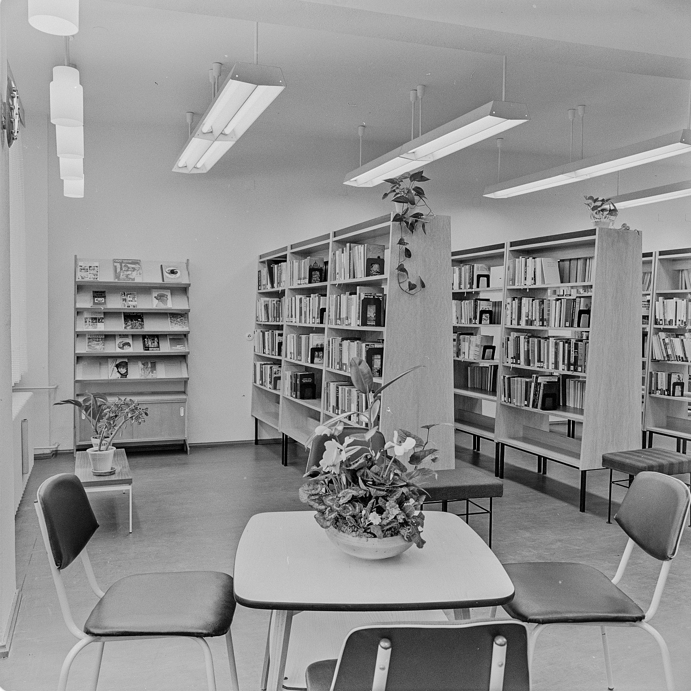

Pflanzen in Bibliotheken: Ich kann mich nicht erinnern, dass sie in
meinem Studium, in meiner eigenen Lehre, Forschung oder Beratung von
Bibliotheken wirklich jemals thematisiert wurden. Nur hier und da
tauchen sie auf. Einmal, in einer von mir mitbetreuten Bachelorarbeit,
die untersuchte, welche Auswirkung die Gestaltung des Raumes einer
kleinen Bibliothek auf die Nutzung hatte, kam eine Pflanze zur Sprache.
(Sie war nicht da, wo die Befragten sie gerne gehabt hätten, aber sie
wurde als wichtig angesehen.) Wenn ich mit Studierenden auf Exkursionen
die Lernlandschaft der Hochschulbibliothek Winterthur der ZHAW besuchte,
erwähnte ihr Leiter gerne auch die "Grüne Wand", die als Raumtrenner
verwendet wurde. Aber seit dieser die Karriere gewechselt hat, habe ich
von der Grünen Wand auch nichts mehr gehört. In den Darstellungen der
Lernlandschaft taucht sie kaum auf.[^1] Bei all den Diskussionen darum
und Publikationen dazu, wie Bibliotheken umgebaut, neu geplant oder auch
genutzt werden, gibt es viele Dinge, die thematisiert werden: aber kaum
Pflanzen. Selbst dann nicht, wenn unter Schlagworten wie "Dritter Raum"
darüber diskutiert wird, wie man Bibliotheken gemütlich gestalten kann.
So, als wären sie nicht da.

Und doch: Seit ich durch die Pandemie 2020 ins Homeoffice gezwungen
wurde, habe ich täglich Bilder von Bibliotheken gepostet.[^2] Auf diesen
sind mir Pflanzen immer und immer wieder begegnet. Nicht auf jedem Bild,
aber auf überraschend vielen. Ohne, dass sie irgendwie sichtbar
thematisiert worden wären, auch nicht in den Begleittexten, die für
viele Bilder existieren. Warum sind sie da? Was sollen sie vermitteln
und was vermitteln sie? Was tun sie?

Typisiere ich diese "Sichtungen", ergeben sich für mich mindestens drei
grobe Blöcke, wie Pflanzen auf Bildern von Bibliotheken auftauchen.
Dabei sollte klar sein, dass die meisten Bilder von Bibliotheken, die
öffentlich zugänglich sind, mit Absicht so gemacht wurden, wie sie sind.
Das sind fast nie Schnappschüsse, sondern gestellte Szenen. Und selbst
wenn nicht, war vorher bekannt, dass ein\*e Photograph\*in vorbeikommen
wird, so dass Zeit war, in der Bibliothek aufzuräumen. Aber gerade das
macht es auch interessant: Die Pflanzen wurden nicht fortgeräumt, bevor
die/der Photograph\*in vorbeikam, sondern sie wurden offenbar als
selbstverständlicher Teil der Bibliothek angesehen, vielleicht sogar
extra für den Photoshot herbeigeholt.

### Block 1: Pflanzen als Beiwerk

)](img/bundesarchiv-B145-Bild-P047388.jpg)

)](img/bundesarchiv-183-13520-0004.jpg)

Im grössten Teil der Bilder von Bibliotheken, auf denen sich Pflanzen
finden -- und von denen ich hier drei aus unzähligen anderen ausgesucht
habe --, finden sich diese irgendwo am Rand des Bildes. Sie sind
Beiwerk, das nicht weiter diskutiert wird. Der Fokus liegt immer
anderswo, bei diesen Bildern bei der Bibliotheksnutzung (3), der
Bibliothekstechnik (2) oder dem Lesesaal als Raum an sich (1). Die
Pflanzen sind Teil des Interieurs. Oft könnte man sich vorstellen, dass
sie auch dort stehen würden, wenn der Raum anders genutzt werden würde
und nicht als Bibliothek.

Und dennoch sind sie etwas Besonderes: Neben den Menschen sind sie die
einzigen lebenden Objekte auf diesen Bildern. Lässt man die Räume
einfach so, wie sie sind -- so wie das jetzt in vielen Fällen während
der Pandemie passierte --, wird man sie nach ein paar Monaten wieder so
vorfinden, wie man sie verlassen hat. Solange keine weiteren
Katastrophen geschehen, wird nach ein paar Monaten alles so sein, wie
zuvor: Die Regale und Tische und Stühle werden da stehen, wo sie
standen. Die Bücher und die Technik werden sich kaum bewegt haben. Die
Bilder an der Wand werden die gleichen sein. Einzig die Pflanzen werden
sich geändert haben. Sie werden erst gewachsen sein, vielleicht sogar
geblüht haben und dann wohl auch eingegangen sein. Sie sind es, die dem
Raum ein gewisses Leben geben und sie sind die Objektive in ihm, die
eigentlich der meisten Pflege benötigen.

In gewisser Weise sind sie etwas, das an die Eigenwilligkeit der Objekte
und des Lebens erinnert. Insoweit ist es bedeutsam, dass sie immer
wieder in Bildern auftauchen -- so, als würde auch da, wo eigentlich
vieles möglichst kontrolliert und geplant ablaufen sollte, in einer
professionell arbeitenden Bibliothek, sich das Leben immer wieder einen
Weg suchen. Und als würde es dazu auch immer wieder eingeladen werden --
denn irgendwer stellt diese Pflanzen in diese Räume, irgendwer kümmert
sich um sie, irgendwer entscheidet sich nicht dafür, sie aus dem Bild zu
räumen.

### Block 2: Pflanzen als Raumelement

Während Pflanzen auf den Bildern im ersten Block mehr oder weniger
zufällig aufzutauchen scheinen oder zumindest nicht weiter in den Fokus
gerückt werden, gibt es einen weiteren Block von Bildern, auf denen
Pflanzen explizit als Raumelement benutzt werden. Auf diesen -- wieder
aus mehreren Beispielen ausgewählten -- Abbildungen ist das explizit zu
sehen: Nicht nur stehen Pflanzen hier überall, offenbar gibt es auch
jeweils ein System für diese Aufstellung. Jedes Regal hat eine Pflanze
erhalten (4), es wurden Körbe aufgestellt, die den Raum teilen und
nichts enthalten ausser Pflanzen (5, 6).[^3] Zusätzlich stehen Pflanzen
auf dem Tisch der/des Bibliothekar\*in.

Jemand schreibt hier den Pflanzen eine Wirkung zu, den Raum zu
verändern. Ihn vielleicht gemütlicher zu machen oder auch zu zeigen,
dass er gepflegt wird. (Denn wieder: Dadurch, dass so viele Pflanzen in
den Raum gestellt werden, hat jemand nun die Arbeit, sie zu pflegen. Sie
stehen nicht einfach so da, sie haben einen Grund.) Wir wissen nicht
genau, welches Ziel die Pflanzen haben. Sie tauchen auch in dieser
Funktion auf Bildern von Bibliotheken aus ganz unterschiedlichen
Jahrzehnten und auch unterschiedlichen Ländern auf. Viel hat sich in
diesen Jahrzehnten geändert, in Vielem unterscheiden sich Länder.
Insoweit können wir berechtigt vermuten, dass sich auch die Gründe,
warum Pflanzen als Raumelement einsetzt werden, mit der Zeit verändert
haben werden. Aber es ist auffällig, wie oft sich in Bibliotheken doch
für Pflanzen als Objekte für die Raumgestaltung entschieden wird.

Was das ganze interessant macht, ist unter anderem das systematische
Herangehen an diese Gestaltung: Es sind Pflanzen, aber ihr Einsatz ist
kontrolliert. Sie dürfen nicht einfach wachsen, wie auf einer Wildwiese,
rhizomatisch. Vielmehr werden sie wohl oft beschnitten, begradigt,
umgetopft. Es wird einen Plan geben, wann und wie oft, vielleicht mit
welchen Zusätzen, die Pflanzen gegossen werden. Wann und wie sie
gepflegt werden. Auch wann sie ausgetauscht werden.

Aber sie müssen etwas bedeuten und es ist erstaunlich, dass diese
Bedeutung in der bibliothekarischen Literatur praktisch nicht besprochen
wird.

### Block 3: Natur in der Bibliothek

)](img/bundesarchiv-183-1986-0903-311.jpg)

In einem dritten Block von Bildern aus Bibliotheken existieren Pflanzen
nicht einfach, sondern sie werden explizit durch die/den Photograph\*in
eingesetzt, um einen Kontrast zu schaffen. Wie in diesem Beispiel (7)
erscheinen Pflanzen hier als Natur, welche der Ordnung der Bibliothek
und in der Bibliothek gegenübergestellt scheinen. Nutzer\*innen
arbeiten, Medien stehen in den Regalen. Alles ist sauber, gerade. Aber
wir blicken durch einen Wald von Pflanzen. Selbstverständlich: Auch
diese Pflanzen sind gepflegt und geplant aufgestellt. Aber worauf wir
fokussiert werden, ist das Unordentliche der Pflanzen, der Natur: Die
Blätter, die alle etwas anders wachsen, die sich alle etwas einer
Einheitlichkeit widersetzen, die das Licht etwas uneinheitlich brechen.
Das Leben, das sich über die Pflanzen im ersten Block in die Bibliothek
schleicht, wird hier durch die Bildkomposition betont: Wir schauen aus
der Natur in eine geordnete, arbeitsame Zivilisation. Die Pflanzen, die
Natur, bilden hier ein Aussen, welches uns im Kontrast mehr sehen lässt,
dass die Funktionen der Bibliothek wohl geordnet sind und funktionieren.

### Schweigen und Sprechen

In diesen Bildern -- die, wie gesagt, immer eine Auswahl darstellen und
ergänzt werden können -- sprechen Pflanzen in gewisser Weise zu uns:
Manchmal eher ein Flüstern als ein Reden, manchmal müssen wir genau
zuhören beziehungsweise schauen. Aber sie geben jedem Bibliotheksraum
etwas mit, was ohne sie nicht da wäre. Es ist nicht klar, ob wir alle
das gleiche hören (Finden wir die "Neue Bücherei" in 4 und 5 zum
Beispiel durch die Pflanzen gemütlicher oder langweiliger?), aber
offenbar greifen Bibliotheken über Jahrzehnte hinweg immer wieder auf
sie zurück.

Und gleichzeitig schweigt die bibliothekarische Literatur, die
Konferenzen, die bibliothekarische Aus- und Weiterbildung fast immer
über sie. Pflanzen sind immer da, egal, was sich in Bibliotheken
verändert und wie wenig über sie geredet wird. Sie sind wie Aliens, die
uns beobachten, aber die wir kaum sehen.

Auffälliger ist das nur noch, wenn man auf den gleichen Bildern nach
Tieren sucht: Die hingegen gibt es kaum. Obwohl so viele Werbe- und
Informationsmaterialien von Bibliotheken mit Tieren ausgestattet werden,
finden Sie sich in Bibliotheken eigentlich nicht. Das macht das
Vorkommen der Pflanzen nur um so erstaunlicher.

[^1]: <https://www.zhaw.ch/de/hochschulbibliothek/arbeiten-lernen/hochschulbibliothek-winterthur/lernlandschaft/>.

[^2]: Vergleiche Schuldt, Karsten (2020). *Einmal am Tag \#Bibliotheksgeschichte*. In: 027.7 Zeitschrift für Bibliothekskultur 7 (2020) 1, <http://dx.doi.org/10.12685/027.7-7-1-186>.

[^3]: In der Deutschen Fotothek <http://www.deutschefotothek.de> finden sich noch mehr Bilder aus dieser Serie von Kurt Heine, auf denen sichtbar wird, dass es sich nicht um den einen Korb links neben dem Informationstisch handelt, sondern mehrere.
