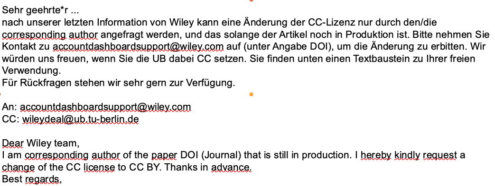

### Open Access an der TU Berlin

Die Open-Access-Policy der Technischen Universität Berlin (TU Berlin)
wurde im Dezember 2017 verabschiedet.[^1] Sie ist mit Präambel und acht
Punkten knapp gehalten,[^2] insbesondere die ersten drei Punkte sind
konkrete Empfehlungen hinsichtlich Open Access (OA) für die
TU-Wissenschaftler\*innen:

1.  Die Open-Access-Erstveröffentlichung wird empfohlen. Die OA-kompatible Creative-Commons-Lizenz CC BY wird als bevorzugte Lizenz explizit angeführt.

2.  TU-Autor\*innen sind aufgefordert, ihr Recht zur OA-Zweitveröffentlichung wahrzunehmen.

3.  Die TU ermutigt Wissenschaftler\*innen dazu, Verlagen nur einfache Nutzungsrechte zu übertragen.

Die Policy schlägt die Brücke zwischen detaillierten, konkreten
Handlungsempfehlungen und einer offenen Formulierung: Es gibt
(natürlich) keine Verpflichtung zu Open Access und die Form der
Umsetzung, ob als OA-Erstveröffentlichung oder Zweitveröffentlichung,
ist freigestellt. Sie ist also möglichst inklusiv und versucht, der
Heterogenität des Publikationsverhaltens gerecht zu werden.

Die Universitätsbibliothek versteht dies als Auftrag, Services für den
Goldenen und Grünen Weg des Open Access gleichermaßen anzubieten. Sie
koordiniert die zentralen OA-Aktivitäten an der TU Berlin: Neben der
Verwaltung des zentralen Publikationsfonds für OA-Gebühren und dem
Abschluss von Verträgen mit OA-Komponente unterstützt sie TU-Angehörige
im Rahmen des Services für OA-Zweitveröffentlichungen,[^3] berät zu
Autor\*innenrechten und Verlagsverträgen, betreibt den universitären
Open-Access-Verlag und vieles mehr.

Mit Blick auf die DEAL-Verträge übernimmt die Universitätsbibliothek die
Verifikation der Artikel in den Verlagsportalen (\"dashboard\") und die
Rechnungsbearbeitung. Darüber hinaus informiert sie campusweit zu den
Vertragskonditionen und berät TU-Autor\*innen zu (fast) allen Fragen,
insbesondere zur OA-Option.[^4]

### Kommunikation in die Universität

Die Kommunikation auf dem Campus über Open Access und passende Verträge
steht unter dem Motto "steter Tropfen höhlt den Stein". Für die
proaktive Information werden verschiedene Kanäle genutzt: Das ist zum
einen ein TU-internes Mitteilungsformat, die sogenannte "Aktuellen
Mitteilung". In Zusammenarbeit mit der Pressestelle sind ausgewählte
OA-Themen auch in den zentralen TU-News präsent.[^5] Ein weiterer
Informationskanal ist die Universitätszeitung "TUintern"; insbesondere
die DEAL-Verträge waren dort in der Vergangenheit mehrfach ein Aufhänger
für OA-relevante Beiträge.[^6] Der Publizieren-Blog der
Universitätsbibliothek ist die wichtigste Plattform, um regelmäßig,
ausführlicher und dauerhaft zugänglich zu OA-relevanten Themen zu
informieren.[^7] Ergänzt wird dies durch Posts in den
Social-Media-Kanälen der Universitätsbibliothek, wobei aktuell vor allem
Twitter genutzt wird.[^8] Zur direkten Information der Lehrstühle wurden
zudem Textbausteine erstellt, die die Fachreferent\*innen nach Bedarf
einsetzen können. Auf der Webseite zum zentralen Publikationsfonds der
TU finden sich ebenfalls Informationen zu Verträgen mit OA-Verlagen
beziehungsweise zu Verträgen mit OA-Option.[^9]

Open Access im Rahmen von DEAL ist ein weiterer Gegenstand der Beratung
einzelner Wissenschaftler\*innen: Die Universitätsbibliothek hat für die
DEAL-Verträge jeweils einzelne E-Mail-Adressen eingerichtet. Bei Bedarf
können konkrete Fragen oder Probleme auch telefonisch geklärt werden.
Seit circa fünf Jahren bietet das Open-Access-Team der
Universitätsbibliothek zudem Workshops an, in deren Rahmen sich einzelne
Lehrstühle oder Forscher\*innengruppen ausführlich über Open Access
informieren können.[^10] Die Länge der Workshops (zwischen 30 Minuten
und zwei bis drei Stunden) und die inhaltlichen Schwerpunkte werden
vorab mit den Lehrstühlen abgestimmt. In jüngerer Vergangenheit nahmen
OA-Verträge (unter anderem DEAL) dabei immer größeren Raum ein. Da die
Workshops pandemiebedingt aktuell weniger nachgefragt sind, wurde
anlässlich der internationalen Open Access Week 2020 eine Reihe von
(kurzen) Videos zu OA-Themen erstellt, unter anderem zu
OA-Verträgen.[^11]

Für die gesamte Informationsarbeit gibt es eine enge Abstimmung
innerhalb der Universitätsbibliothek -- zwischen der Erwerbungsleitung,
dem Open-Access-Team und der Öffentlichkeitsarbeit -- und auch mit der
TU-Pressestelle. Mitunter ist es schwierig abzuwägen, welcher
Detaillierungsgrad für welchen Informationskanal geeignet ist: Welche
Informationen sind zwingend erforderlich, welche Details sind
verzichtbar? Wie formuliert man am besten allgemeinverständlich aber
doch fachlich korrekt? In diesem Bereich gibt es einen kontinuierlichen
Lernprozess; hierfür ist die enge Zusammenarbeit mit den
Öffentlichkeitsexpert\*innen der Pressestelle und der
Universitätsbibliothek besonders wertvoll. Die Texte beziehungsweise
einzelne Textbausteine werden nachgenutzt -- etwa in den "Aktuellen
Mitteilungen" und im Blog. Wichtig scheint vor allem, regelmäßig über
Open Access zu informieren und damit das Thema in der TU-öffentlichkeit
präsent zu halten sowie die Universitätsbibliothek als zentrale
Anlaufstelle für Fragen zu platzieren.

### Lizenznachweis Crossref

Bei der Registrierung der DOI bei Crossref melden Verlage neben Angaben
zu Titel, Autor\*innen, Zeitschrift und so weiter idealerweise auch die
Creative-Commons-Lizenz (CC-Lizenz), unter der ein Artikel
veröffentlicht ist. Im Rahmen der DEAL-Verträge sind Wiley und
SpringerNature dazu sogar verpflichtet.[^12] Bei einer eher zufälligen
überprüfung haben wir dabei Probleme festgestellt: Bei Wiley fehlten
anfangs für circa 40 % der von der TU finanzierten Artikel die
entsprechenden Angaben bei Crossref. Auch bei den DEAL-Artikeln von
SpringerNature gab es Nachbesserungsbedarf, da die Einträge nicht für
alle Artikel schemakonform waren.

Die Korrektheit von Lizenzangaben ist vor allem relevant, um Open Access
de facto sichtbar zu machen -- für Menschen aber insbesondere für
Maschinen, also für Aggregatoren, die die Crossref-Daten nachnutzen.

Unpaywall ist ein Dienst, der im Bereich OA-Monitoring inzwischen nahezu
unverzichtbar ist, aber auch über das Browser-Plugin für Leser\*innen
wertvolle Dienste leistet.[^13] Unpaywall-Daten werden unter anderem von
Web of Science und Scopus genutzt. Erst dadurch ist eine Facettierung
von Treffermengen nach OA-Status und Art des Open Access (gold, grün,
hybrid) möglich. Nachgenutzt, mittel- oder unmittelbar, werden die Daten
auch durch Aggregatoren wie BASE
([https://www.base-search.net/](https://www.base-search.net/))
oder den nationalen deutschen OA-Monitor
([https://open-access-monitor.de/](https://open-access-monitor.de/)).
In Zeiten, in denen OA-Monitoring und die überprüfung von OA-Quoten
immer wichtiger werden, sind vollständige und korrekte Angaben in den
Schnittstellen unverzichtbar.

Abbildung 1 zeigt beispielhaft eine korrekte Angabe bei Crossref für
einen Wiley-Artikel. Laut HTML-Ansicht des Artikels steht der Artikel
mit der DOI 10.1002/adsc.201901230 unter CC BY 4.0; bei Crossref wird
für die Verlagsversion auch die entsprechende Lizenz-URL angegeben.[^14]

,
5.11.2020).)](img/CRwileyPOS.png)

Im Vergleich dazu zeigt Abbildung 2 ein Negativbeispiel bei Wiley: Der
Artikel mit der DOI 10.1002/ejic.201901232 ist unter CC BY 4.0
publiziert, aber bei Crossref findet sich als Lizenzangabe nur der Link
zur Text-and-Data-Mining-Policy.[^15]

,
5.11.2020)](img/CRwileyNEG.png)

Im Folgenden ein positives Beispiel für einen Springer-Artikel
(Abbildung 3): Bei Crossref finden sich für die DOI
10.1007/s00426-020-01291-7 zwei Lizenzangaben -- einerseits oben der
Eintrag für Text-and-Data-Mining-Zwecke, der untere Eintrag gibt die
Nutzungsbedingungen für die Verlagsversion an und hier wird die URL zur
Lizenz CC BY 4.0 korrekt angegeben.[^16]

,
5.11.2020).](img/CRspringerPOS.png)

In einem zweiten, negativen Beispiel für die DOI
10.1007/s00103-019-03080-z allerdings gibt es bei Crossref nur einen
Eintrag für das Attribut "TDM", also Text and Data Mining. Allgemeine
Nutzungsbedingungen für die Verlagsversion sollten, so die offizielle
Vorgabe von Crossref,[^17] aber im Attribut "VOR" ("Version of Record")
eingetragen werden.[^18] Für das zweite Springer-Beispiel gibt es also
einen Hinweis auf die CC-Lizenz, aber die Angabe ist nicht vollständig
beziehungsweise formal inkorrekt. Je nachdem, wie granular Dritte ihre
Systeme eingestellt haben, könnte sich das Fehlen negativ auf die
Nachnutzung der Daten durch Aggregatoren und Suchdienste auswirken.

, 5.11.2020).](img/CRwileyNEG.png)

Wie kommen bei dieser Frage nun Bibliotheken ins Spiel? Es ist zu
empfehlen, sich mit den Vertragsdetails bei DEAL vertraut zu machen und
auch einen Blick auf die konkrete Umsetzung zu werfen. Vor allem der
Austausch innerhalb der Fachcommunity ist dabei wichtig, denn keine
Einrichtung wird auf alle nachbesserungsbedürftigen Details stoßen.

Im Alltag prüfen wir für alle von der TU Berlin finanzierten
DEAL-Artikel regelmäßig die Angabe bei Crossref und nehmen bei Problemen
Kontakt mit dem Support des jeweiligen Verlags auf. Die Prüfung ist im
Einzelnen schnell erledigt. Es braucht mitunter aber einen langen Atem,
wenn etwa mehrfache Mails mit dem Support-Team für die Korrektur der
Angaben erforderlich sind.

Aber soll wirklich jede Einrichtung für diese Prozesse
Personalressourcen bereitstellen? Kurzfristig glauben wir, dass es
wichtig ist, als Community aktiv zu werden und den Verlagen genau auf
die Finger zu schauen. Mittel- und langfristig wären allerdings
automatisierte Checks und Workflows wünschenswert. Kolleg\*innen von der
SUB Göttingen arbeiten aktuell daran, ein Formular zu entwickeln, das
die Prüfung vereinfachen und beschleunigen soll.[^19]

### Rechte der Autor\*innen

DEAL-Autor\*innen unterzeichnen Verlagsverträge, wobei sie auch der
CC-Lizenz zustimmen. Zum Teil werden sie vorab in puncto CC-Lizenz vor
die Wahl gestellt. Die Variante CC BY ist von DEAL zwar gewünscht, aber
nicht vertraglich definiert.[^20]

Bei Springer ist CC BY im Prinzip Standard, Ausnahmen sind aber wohl
möglich. Bei Wiley allerdings ist CC BY nicht immer möglich: Hier hängt
es vom Journal ab, welche Lizenz die Autor\*innen wählen können.[^21]
Bei den hybriden Journalen haben Autor\*innen bei circa 16 % der
Zeitschriften de facto keine Chance zu CC BY (vergleiche Tabelle 1), im
Bereich der reinen Open-Access-Zeitschriften betrifft das circa 19 % der
Journale (vergleiche Tabelle 2).

  License Type Offered   Anzahl Journale   Anteil Journale in %
  ---------------------- ----------------- ----------------------
  CC-BY mandate only     229               15,95 %
  CC-BY only             8                 0,56 %
  CC-BY to all           1199              83,50 %
  Gesamt                 1436              100  %

Tab.1: Verteilung der Lizenzoptionen für hybride Journale von Wiley
("Revenue Modell: OO" laut Wiley-DEAL-Titelliste, Stand: 28.10.2020)

  License Type Offered   Anzahl Journale   Anteil Journale %
  ---------------------- ----------------- -------------------
  CC-BY mandate only     40                17,62 %
  CC-BY only             68                29,96 %
  CC-BY to all           110               48,46 %
  CC-BY-NC               2                 0,88 %
  TBD                    7                 3,08 %
  Gesamt                 227               100 %

Tab.2: Verteilung der Lizenzoptionen für Open-Access-Journale von Wiley
("Revenue Modell: OA" laut DEAL-Titelliste, Stand: 28.10.2020)

Für die TU Berlin beobachten wir häufig, dass Wissenschaftler\*innen
nicht umfassend mit rechtlichen Details vertraut sind: Sie scheinen
Verlagsverträge ("Copyright Transfer Agreement" oder CTA) kaum zu lesen
und haben selten detaillierte Kenntnisse zu CC-Lizenzen. Bei einer
Auswahloption zu CC wird offenbar häufig aus dem Bauch heraus
entschieden. Letztlich aber sind die Entscheidungen bei der
Vertragsunterzeichnung weitreichend, einerseits für die Autor\*innen
selbst und andererseits in Hinblick auf die Rechte für Dritte.

Eher zufällig hatte uns ein Autor den Verlagsvertrag für einen
Wiley-Artikel geschickt, der unter unter CC BY-NC-ND publiziert wurde.
Ein Blick in den Vertragstext offenbarte, dass der Autor mit seiner
Unterschrift Wiley exklusive Nutzungsrechte an seinem Artikel überträgt,
im Prinzip für alle Verwertungsarten gelten (Ausschnitt Vertrag siehe
Abbildung 5).

Die Nachfrage bei Wiley ergab, dass es sich dabei nicht um einen
Einzelfall handelt: Sobald Artikel nicht unter CC BY publiziert werden,
ist eine Übertragung exklusiver Nutzungsrechte an den Verlag vorgesehen.
Die fehlende Option zu CC BY für eine beachtliche Anzahl Journale ist
aus Open-Access-Sicht also auf zwei Ebenen negativ zu bewerten:

1.  Die Inhalte sind aufgrund eine restriktiven CC BY-NC- oder CC BY-NC-ND-Lizenz nicht in einer Form für Dritte nutzbar, wie es die Berliner Erklärung als Ziel definiert.[^22]

2.  Die Autor\*innen sind in der Nutzung ihres eigenen Artikels eingeschränkt. Will etwa ein\*e Doktorandin Teile eines Artikels in eine kumulative Dissertation einbinden, oder ein\*e Wissenschaftler\*in eine eigene Abbildung in einer anderen Publikation nutzen, müssen sie dazu wiederum die Nutzungsrechte beim Verlag einholen -- oder sich auf eine allgemeine Ausnahme berufen, wie Verlagspolicies es mitunter vorsehen. Das ist ein Umstand, den das Publizieren in Open Access eigentlich unterbinden soll und der in einem alltäglichen Beratungsgespräch mit Wissenschaftler\*innen auch kaum vermittelbar ist.

Vor diesem Hintergrund leiten sich für Bibliotheken in drei Bereichen
mögliche Aufgaben ab: Zum einen können und sollten sie Autor\*innen für
rechtliche Details sensibilisieren, das heißt aktiv auf sie zugehen,
über Verträge und Vertragsoptionen informieren und bei Bedarf auch
intensiver zu CC-Lizenzen zu beraten. Hilfreich kann auch sein, den
Autor\*innen Textbausteine für die Kontaktaufnahme mit dem Verlag zur
Verfügung zu stellen.

Zweitens ist der Austausch innerhalb der Fachcommunity wünschenswert:
Welche rechtlichen Aspekte fallen auf, was steckt dahinter? ähnlich wie
bei der Metadatenqualität kann keine Einrichtung alle Aspekte im Blick
haben.

Drittens kann und sollte die Bibliothek bei Unstimmigkeiten mit dem
Verlag in Kontakt treten, im Fall der Verlagsverträge mit Wiley etwa die
Vorgehensweise hinterfragen und auf änderung der Standardverträge
drängen.

Für die Universitätsbibliothek der TU Berlin bedeutet das konkret: Bei
der Artikelverifikation im Dashboard wird die gewählte CC-Lizenz
geprüft. Ist im Dashboard nicht CC BY angegeben, laut der Titelliste
aber für die Zeitschrift möglich, werden die Autor\*innen per Mail mit
einem Standardtext kontaktiert. Sie werden darin über die Empfehlung zu
CC BY gemäß der OA-Policy der TU informiert und bekommen
Handlungsoptionen aufgezeigt sowie detaillierte Beratung zu CC-Lizenzen
angeboten (Abbildung 6).

Eine änderung der CC-Lizenz kann nur der/die Autor\*in selbst anstoßen.
Meldet sich der/die Autor\*in auf die erste E-Mail hin zurück, kommt ein
zweiter Textbaustein zum Einsatz (Abbildung 7).

### Open Access Opt-out

Die DEAL-Verträge sehen bekanntlich vor, dass Autor\*innen auch Open
Access abwählen können. Die Institutionen werden über diese Opt-outs
nicht vorab informiert. Für Springer-Artikel schickt die MPDL Services
GmbH seit August 2020 sogenannte Opt-out Reports, eine Umstellung auf
Open Access ist zu diesem Zeitpunkt allerdings nicht mehr möglich.

Seit Start der Open-Access-Option bei DEAL hat uns an der
Universitätsbibliothek die Frage beschäftigt, ob und wie häufig
TU-Angehörige Opt-out wählen und warum sie es tun? Uns schien dies
wichtig, da sich die Opt-outs zum einen nicht kostenreduzierend
auswirken. Unsere These war, dass Autor\*innen Open Access nicht bewusst
abwählen, sondern dass trotz aller Bemühungen die DEAL-Verträge auf dem
Campus nicht genug bekannt waren und dass frühere Hinweise zu hybridem
Open Access (von dem in vergangenen Jahren immer wieder eindringlich
abgeraten wurde) nachhaltig nachwirken. Aus direkten Kontakten wurde im
Laufe von 2020 deutlich, dass einige TU-Autor\*innen sehr enttäuscht
darüber waren, dass ihre Artikel trotz DEAL nicht OA erschienen sind.
Insbesondere mit Blick auf Springer ist ein ungewollter Opt-out
folgenreich.

Da bis dato keine Daten zu Opt-outs zur Verfügung standen, wurden im
Juni 2020 mögliche Fälle eigenständig ermittelt. Das Ziel der Stichprobe
war, die Gründe für Opt-outs zu erfragen und zudem erneut über die
OA-Optionen im Rahmen von DEAL zu informieren. Mithilfe des nationalen
Open-Access-Monitors[^23] und Scopus wurden Publikationsdaten für die TU
Berlin abgefragt und manuell geprüft: Ist der/die 'corresponding author'
TU-affiliiert? Ist der Artikel unter einer CC-Lizenz publiziert? Wann
wurde der Artikel akzeptiert beziehungsweise online publiziert?

Für Wiley wurden 340 Artikel geprüft. Von diesen wiesen 100 Artikel
eine\*n 'corresponding author' mit TU-Affiliation auf und waren
augenscheinlich unter DEAL zu OA berechtigt. Allerdings wurden nur 96
TU-Wiley-Artikel OA publiziert. Für Springer wurden 73 Artikel geprüft,
davon wiesen 35 Artikel eine\*n 'corresponding author' mit
TU-Affiliation auf und waren augenscheinlich unter DEAL zu OA
berechtigt. Es wurden jedoch nur 25 TU-Springer-Artikel OA publiziert.
Im Ergebnis haben wir für Wiley also eine Opt-out-Quote von 4 %
festgestellt, bei Springer allerdings von fast 29 %.

Wir nahmen diese Ergebnisse zum Anlass für eine weitere "Aktuelle
Mitteilung" speziell zu der Opt-out-Option (Abbildung 8). Der Text wurde
in leicht veränderter Form auch im Blog der Universitätsbibliothek
veröffentlicht, um zu späteren Zeitpunkten jederzeit auf Details
verlinken zu können.[^24] Außerdem wurde den Fachreferent\*innen ein
Textbaustein zur Verfügung gestellt, den sie für ihre Kontakte mit den
Lehrstühlen nach Bedarf einsetzen können. Für die konkret ermittelten
Fälle nahmen wir direkten Kontakt zu den TU-Autor\*innen auf.

Anders als Springer ermöglicht Wiley das nachträgliche Umstellen auf
Open Access. Wir hatten zunächst Wiley kontaktiert und das Prozedere
erfragt. Im zweiten Schritt haben wir die wenigen betroffenen
Autor\*innen per E-Mail kontaktiert und, inklusive Hinweis auf die
empfohlene Lizenz CC BY, für die Umstellung auf OA geworben (Abbildung
9). In zwei Fällen war die Rückmeldung positiv; die Artikel wurden auf
nachträglich Open Access gestellt.

Springer allerdings weigert sich, einmal publizierte Artikel
nachträglich Open Access zu stellen. Das ist nicht nur, vor allem aus
Sicht der Autor\*innen, bedauerlich. Es ist nach unserer Einschätzung
auch nicht DEAL-vertragskonform -- jedenfalls nicht in der Form, in der
es momentan gehandhabt wird (Institutionen sehen ein Opt-out nicht im
Dashboard und erhalten auch auf anderem Weg keine Information, bevor der
Artikel publiziert ist). Für die Springer-Artikel stand bei dem
Anschreiben an die Autor\*innen (Abbildung 10) die Frage nach Gründen
für Opt-outs im Vordergrund. Nicht alle antworteten uns, aber die
erhaltenen Rückmeldungen bestätigten unsere Ausgangsthese: Autor\*innen
wählen nicht Opt-out, weil sie Open Access ablehnen. Einige waren sich
der Verträge nicht bewusst oder hatten Angst die Kosten selbst tragen zu
müssen. Andere meldeten zurück, dass sie nicht erinnern, OA aktiv
abgewählt zu haben.

Das Anschreiben ging zudem auf mögliche Alternativen ein und warb für
eine OA-Zweitveröffentlichung im institutionellen Repositorium. Einige
Autor\*innen nahmen das Angebot des OA-Teams, sie bei der
OA-Zweitveröffentlichung zu unterstützen, dankend an. Auf diese Weise
ist ein Kontakt zu den Wissenschaftler\*innen auch eine Möglichkeit, um
allgemein über OA und die verschiedene Wege der Umsetzung zu informieren
-- und nicht nur über Open Access im Rahmen von DEAL.

### Fazit

Bibliotheken versammeln vielfältige Expertise: Zu Zusammenhängen des
wissenschaftlichen Publikationsmarktes und insbesondere
Finanzierungsfragen, zu Urheberrecht und CC-Lizenzen, zu Metadaten und
vielem anderen mehr.

Die DEAL-Verträge sind für unsere Institutionen kostenintensiv. Der
vorliegende Beitrag diskutiert nicht das Für und Wider der DEAL-Verträge
als solche. Es geht an dieser Stelle nicht um die Frage, ob alle
Konditionen der DEAL-Verträge aus OA-Sicht schon zufriedenstellend sind
oder ob es Nachbesserungsbedarf gibt, insbesondere in Bezug auf die
Kosten(-verteilung). Vielmehr richtet sich der Beitrag an die
Praktiker\*innen in den Bibliotheken: Ist ein Vertragsabschluss nicht
auch eine ideelle Verpflichtung zu überprüfen, ob Vertragsdetails auch
eingehalten werden? Schließlich geht es um die Verausgabung von
Steuermitteln und über große Anteile der jeweiligen Bibliotheksbudgets.
Die breit aufgestellte Expertise der Bibliotheken sollte dafür genutzt
werden, das Optimale an Open Access und Offenheit im Sinne der Berliner
Erklärung aus den DEAL-Verträgen herauszuholen -- in Hinblick auf die
Metadatenqualität, den OA-Anteil insgesamt und die Rechte der
Autor\*innen. Denn Bibliotheken sind nicht nur dazu da, Gelder zu
verwalten, Rechnungen zu bearbeiten und Affiliationen zu verifizieren --
sie können durch ihre Beratungsangebote und das Drängen auf bessere
Workflows und Einhaltung der Vertragsvereinbarungen die
OA-Transformation aktiv mitgestalten.

[^1]: Vergleiche
    [https://www.tu.berlin/go4430/](https://www.tu.berlin/go4430/).

[^2]: Zum Prozess der Verabschiedung siehe Grimm, Steffi & Schobert,
    Dagmar (2017). Open Access an der Universität verankern: Ein
    Praxisbericht aus dem Jahr 2017. LIBREAS. Library Ideas, 32 (2017).
    [https://libreas.eu/ausgabe32/grimm/](https://libreas.eu/ausgabe32/grimm/)
    ([https://doi.org/10.18452/19095](https://doi.org/10.18452/19095)).

[^3]: Details zur Umsetzung des Zweitveröffentlichungsservices sind
    nachzulesen in Voigt, Michaela & Dittmann, Sebastian (2019).
    Zweitveröffentlichungsservice der TU Berlin --
    Automatisierungsmöglichkeiten für den Workflow. Humboldt-Universität
    zu Berlin. LIBREAS. Library Ideas, 35 (2019).
    [https://libreas.eu/ausgabe35/voigt/](https://libreas.eu/ausgabe35/voigt/)
    ([https://doi.org/10.18452/20330](https://doi.org/10.18452/20330)).

[^4]: Der vorliegende Beitrag ist eine Ausarbeitung des Vortrags der
    Autorin beim 1. DEAL Praxis-Webinar im November 2020: Voigt,
    Michaela (2020). Open-Access-Option bei DEAL optimal nutzen:
    Handlungsfelder aus Bibliothekssicht. DEAL Praxis-Webinar \#1,
    5.11.2020.
    [http://doi.org/10.5281/zenodo.4153569](http://doi.org/10.5281/zenodo.4153569).

[^5]: Vergleiche etwa Beitrag zu SpringerNature-DEAL-Vertrag
    [https://www.tu.berlin/nachrichtendetails/open-access-publizieren-bei-springernature/](https://www.tu.berlin/nachrichtendetails/open-access-publizieren-bei-springernature/).

[^6]: Zuletzt in der aktuellen Ausgabe der TUintern (Nr. 5, Oktober
    2020), die zwei Sonderseiten zu Open Access enthält, vergleiche
    [https://archiv.pressestelle.tu-berlin.de/tui/20okt/\#6](https://archiv.pressestelle.tu-berlin.de/tui/20okt/#6).

[^7]: Publizieren-Blog siehe
    [https://blogs.ub.tu-berlin.de/publizieren/](https://blogs.ub.tu-berlin.de/publizieren/);
    zum Wiley-DEAL-Vertrag siehe
    [https://blogs.ub.tu-berlin.de/publizieren/2019/07/kostenfrei-open-access-publizieren-bei-wiley/](https://blogs.ub.tu-berlin.de/publizieren/2019/07/kostenfrei-open-access-publizieren-bei-wiley/);
    zum SpringerNature-DEAL-Vertrag siehe
    [https://blogs.ub.tu-berlin.de/publizieren/2020/06/open-access-publizieren-bei-springernature/](https://blogs.ub.tu-berlin.de/publizieren/2020/06/open-access-publizieren-bei-springernature/).

[^8]: Vergleiche etwa
    [https://twitter.com/UB\_TU\_Berlin/status/1149674316390424576?s=20](https://twitter.com/UB_TU_Berlin/status/1149674316390424576?s=20)
    oder
    [https://twitter.com/TUBerlin/status/1271015549212987400?s=20](https://twitter.com/TUBerlin/status/1271015549212987400?s=20).

[^9]: Vergleiche Rubrik "Rabatte für TU-Angehörige" unter
    [https://www.ub.tu-berlin.de/publikationsfonds/](https://www.ub.tu-berlin.de/publikationsfonds/).

[^10]: Vergleiche
    [https://www.ub.tu-berlin.de/publizieren/open-access/beratung-workshops-materialien/](https://www.ub.tu-berlin.de/publizieren/open-access/beratung-workshops-materialien/).

[^11]: Vergleiche
    [https://youtu.be/72n2KboBoFU](https://youtu.be/72n2KboBoFU).

[^12]: Für Wiley vergleiche Appendix C -- 2.9
    ([https://doi.org/10.17617/2.3027595](https://doi.org/10.17617/2.3027595)),
    für SpringerNature: vergleiche Product Terms -- 3.1.9. (
    [https://doi.org/10.17617/2.3174351](https://doi.org/10.17617/2.3174351)).

[^13]: Siehe
    [http://unpaywall.org/](http://unpaywall.org/).

[^14]: HTML-Ansicht siehe
    [https://doi.org/10.1002/adsc.201901230](https://doi.org/10.1002/adsc.201901230),
    Crossref-Schnittstelle siehe
    [https://api.crossref.org/works/10.1002/adsc.201901230](https://api.crossref.org/works/10.1002/adsc.201901230)
    (Stand: 5.11.2020).

[^15]: HTML Ansicht siehe
    [https://doi.org/10.1002/ejic.201901232](https://doi.org/10.1002/ejic.201901232),
    Crossref-Schnittstelle siehe

    [https://api.crossref.org/works/10.1002/ejic.201901232](https://api.crossref.org/works/10.1002/ejic.201901232)
    (Stand: 5.11.2020).

[^16]: HTML-Ansicht siehe
    [https://doi.org/10.1007/s00426-020-01291-7](https://doi.org/10.1007/s00426-020-01291-7),
    Crossref-Schnittstelle siehe

    [https://api.crossref.org/works/10.1007/s00426-020-01291-7](https://api.crossref.org/works/10.1007/s00426-020-01291-7)
    (Stand: 5.11.2020).

[^17]: Vergleiche
    [https://www.crossref.org/education/content-registration/administrative-metadata/license-information/](https://www.crossref.org/education/content-registration/administrative-metadata/license-information/).

[^18]: HTML-Ansicht siehe
    [https://doi.org/10.1007/s00103-019-03080-z](https://doi.org/10.1007/s00103-019-03080-z),
    Crossref-Schnittstelle siehe

    [https://api.crossref.org/works/10.1007/s00103-019-03080-z](https://api.crossref.org/works/10.1007/s00103-019-03080-z)
    (Stand: 5.11.2020).

[^19]: Die Entwicklung erfolgt im Rahmen des DFG-geförderten Projekts
    "Hybrid OA Dashboards (HOAD)"
    ([https://www.sub.uni-goettingen.de/projekte-forschung/projektdetails/projekt/hybrid-oa-dashboards/](https://www.sub.uni-goettingen.de/projekte-forschung/projektdetails/projekt/hybrid-oa-dashboards/)),
    GitHub-Repository siehe
    [https://github.com/subugoe/metacheck/](https://github.com/subugoe/metacheck/).

[^20]: Verhandlungsziele von DEAL vergleiche
    [https://www.projekt-deal.de/aktuelles/](https://www.projekt-deal.de/aktuelles/).

[^21]: Vergleiche Wiley-Titelliste unter
    [https://keeper.mpdl.mpg.de/f/1578cfa1ea894d50970f/?dl=1](https://keeper.mpdl.mpg.de/f/1578cfa1ea894d50970f/?dl=1).

[^22]: Berlin Declaration on Open Access to Knowledge in the Sciences
    and Humanities (2003) siehe
    [https://openaccess.mpg.de/Berlin-Declaration](https://openaccess.mpg.de/Berlin-Declaration).

[^23]: Dazu wurden die folgenden Filter genutzt: "Wiley
    Hybrid-Zeitschriften" eingeschränkt auf 2019--2020, "Springer Nature
    Hybrid-Zeitschriften" eingeschränkt auf 2020; siehe
    [https://open-access-monitor.de/](https://open-access-monitor.de/).

[^24]: Siehe
    [https://blogs.ub.tu-berlin.de/publizieren/2020/08/nutzen-sie-die-chance-zu-open-access-bei-wiley-und-springernature/](https://blogs.ub.tu-berlin.de/publizieren/2020/08/nutzen-sie-die-chance-zu-open-access-bei-wiley-und-springernature/).
