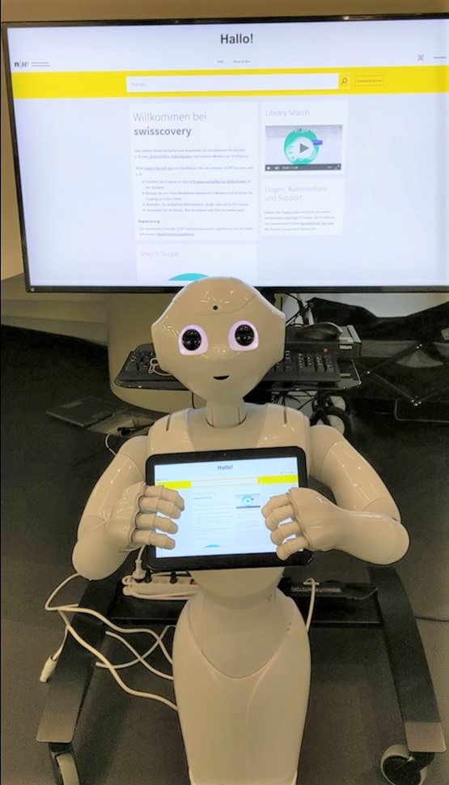
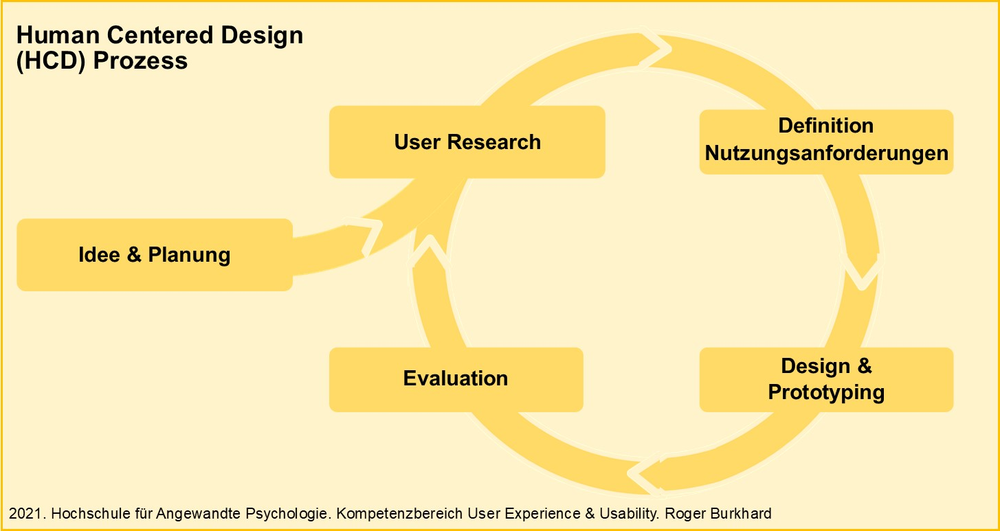
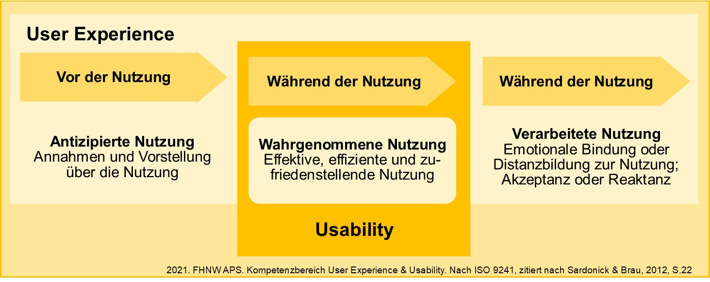

### Einleitung

Soziale Roboter stellen einen neuen Typ von Robotern dar, die in der
Lage sind, mit Menschen zu kommunizieren oder zu interagieren. Immer
mehr Organisationen setzen Roboter für Berufs- und Alltagssituationen
ein. So werden sie beispielsweise als Concierge oder Infopoint in
Hotels, Einkaufszentren, als Unterstützung bei der Aktivierung von
älteren Personen oder als unterstützende\*r Lehrer\*in bei
Schüler\*innen oder als Instruktor\*in bei Mitarbeitendenschulungen
eingesetzt.

In der Bibliothek der Fachhochschule Nordwestschweiz (FHNW) Campus
Brugg-Windisch Bibliothek ist seit Dezember 2019, in der FHNW Campus
Muttenz Bibliothek seit September 2020 je ein Roboter des Modells Pepper
(Version NAOqi 2.9) im Einsatz. Die Roboter sind Teil eines zweijährigen
Entwicklungsprojekts in Zusammenarbeit mit dem FHNW Robo-Lab. Im FHNW
Robo-Lab arbeiten mehrere Hochschulen der FHNW gemeinsam an der Frage,
wie soziale Roboter nutzenstiftend in Schweizer Unternehmen eingesetzt
werden können und testen dafür unterschiedliche Szenarien.

Das Team des Bibliotheksroboterprojekts, bestehend aus
wissenschaftlichen Mitarbeitenden der Hochschule für Angewandte
Psychologie und der Hochschule für Technik sowie der Bibliothek,
arbeitet laufend an der Weiterentwicklung des Roboters. Während der
Projektdauer von zwei Jahren werden an der Hochschule für Technik der
FHNW in jedem Semester mehrere Projektarbeiten ausgeschrieben, um die
Funktionen des Roboters in einem partizipativen Prozess zu erweitern.
Zudem wird mit der Softwareentwicklungsfirma raumCode
zusammengearbeitet. Die bestehenden Szenarien werden von Studierenden
der Hochschule für Angewandte Psychologie evaluiert, um das
Verbesserungspotential aufzuzeigen.

Der Roboter in der Bibliothek in Brugg-Windisch beantwortet häufige
Fragen, beispielsweise «Wo finde ich die Zeitschriften in der
Bibliothek?», «Wie recherchiere ich nach elektronischen Medien?» oder
«Wie funktioniert die Abholung der reservierten Medien?». Weiter erklärt
der Roboter die Registrierung für die Bibliotheksbenutzung und gibt
Tipps zu Verpflegungsmöglichkeiten. Kurz vor der abendlichen Schliessung
bittet der Roboter die Anwesenden, die Bibliothek zu verlassen --
begleitet von Hinweisen zum Medienangebot, Fahrplan des Öffentichen
Verkehrs und Wetter. Während der Corona-Pandemie wird der Roboter zudem
eingesetzt, um die Benutzenden auf die Hygiene-Regeln hinzuweisen. In
aktuell laufenden Projekten versuchen Studierende, die Navigation sowie
die Sprachinteraktion zu optimieren, um weitere geplante Szenarien
umzusetzen.

Die Interaktion mit dem Roboter kann über das Tablet, welches auf
Brusthöhe des Roboters angebracht ist, oder über Spracheingabe
vorgenommen werden. Anders als Sprachassistent\*innen wie Siri oder
Alexa reagiert der Roboter bei der Spracheingabe nur auf vorgegebene
Begriffe und die Spracherkennung bietet Optimierungspotential. Trotz der
technischen Limitationen ist es das Ziel, die Interaktion mit dem
Roboter so intuitiv wie möglich zu gestalten.

Der Roboter in der FHNW Campus Brugg-Windisch Bibliothek soll die
Wahrnehmung der Bibliothek als zeitgemässen und attraktiven Ort fördern.
Indem er häufige Fragen beantwortet, soll er einerseits die
Bibliotheksmitarbeitenden von repetitiven oder -- im Falle der
Ankündigung der abendlichen Schliessung -- unangenehmen Aufgaben
entlasten, wodurch den Mitarbeitenden mehr Zeit für vertiefte
Benutzendenanfragen zur Verfügung steht. Die Mitarbeitenden sollen durch
den Roboter die Möglichkeiten und Grenzen ihres «Roboter-Kollegen» als
Beispiel für den Einsatz moderner Technologien in einer Bibliothek
erfahren. Andererseits sollen auch die Benutzenden einen Nutzen durch
den Roboter erhalten, indem ihr Informationsbedarf auf spielerische
Weise gedeckt wird. Der Roboter beantwortet dieselben Fragen immer
wieder und bietet auch Benutzenden, welche den Kontakt zu
Bibliotheksmitarbeitenden meiden (Stichwort: library anxiety), zumindest
in einem beschränkten Mass die Möglichkeit, innerhalb der Bibliothek die
notwendigen Informationen zu erhalten. Durch die Zusammenarbeit mit den
verschiedenen Hochschulen besuchen auch Studierende von Hochschulen,
deren Medien hauptsächlich elektronisch zur Verfügung stehen, die
Bibliothek. Dort werden sie auf weitere Angebote der Bibliothek
aufmerksam. Die Studierenden und das Projektteam sammeln Erfahrung in
der Entwicklung, Programmierung, Erforschung und Evaluation sozialer
Roboter.

Die erarbeiteten Szenarien sollen also sowohl für die Mitarbeitenden als
auch die Bibliotheksbenutzenden einen Mehrwert erbringen. Um nützliche
Szenarien zu entwickeln, wird nach dem HCD-Prozess vorgegangen, der
nachstehend vorgestellt wird.

### Theoretischer Hintergrund

#### Die Akzeptanz von neuen Technologien

Neue Technologien von Smart-Home-Anwendungen über die Corona-Warn-App
bis zu Robotern werden von Nutzenden nur verwendet, wenn bestimmte
Bedingungen erfüllt sind. Selbst eine zunehmende Durchdringung von
Robotern erhöhe in der Gesellschaft nicht automatisch die Bereitschaft,
mit ihnen zu interagieren (de Graaf, Ben Allouch & van Dijk, 2019).

Die Bedingungen, ob eine neue Technologie benutzt oder nicht benutzt
wird, beschreiben Technologie-Akzeptanz-Modelle, die auf Basis des von
Davis (1993) entwickelten TAM-Modells in verschiedenen
weiterentwickelten Versionen existieren. Je nach Modell werden
verschiedene Einflussfaktoren wie zum Beispiel soziale Normen, Alter,
Geschlecht, Nutzungsfreiwilligkeit, bisherige Erfahrungen und Gewohnheit
genannt. Alle Modelle beinhalten jedoch die Aussage, dass die
wahrgenommene Nützlichkeit und die wahrgenommene Usability auf die
Nutzungsabsicht einen Einfluss haben. Wenn also eine
Bibliotheksbenutzerin den Roboter als nützlich ansieht und denkt, dass
die Interaktion über eine hohe Usability verfügt, steigt die
Wahrscheinlichkeit, dass sie ihn auch nutzen wird.

#### Usability & User Experience für einfach bedienbare Produkte mit gutem Erlebnis

Die Technologie-Akzeptanz-Modelle integrieren Konzepte aus verschiedenen
Forschungsgebieten. Wie oben erwähnt, werden in den Modellen
Nützlichkeit und Usability als zentrale Einflussfaktoren identifiziert.
Usability, auf Deutsch Gebrauchstauglichkeit oder Benutzbarkeit, im
Volksmund vielfach auch «Benutzerfreundlichkeit» genannt, bezeichnet das
Ausmass, ob bestimmte Nutzende in einem bestimmten Kontext ein Produkt
nutzen können, um ein Ziel effektiv, effizient und zufriedenstellend zu
erreichen (DIN EN ISO 9241-210: 2010). Beispielsweise, ob ein
Bibliotheksbenutzer, der eine bestimmte Information über die Bibliothek
möchte, diese Information effektiv vom Roboter erhalten kann und dafür
keine komplizierte und langwierige Bedienung nötig ist.
Zufriedenstellend deutet hier schon auf das Erleben der Nutzenden
während der Nutzung hin. Ein Begriff, der sich bei der
Produktentwicklung etabliert hat, ist die User Experience, auf Deutsch
auch Nutzungserlebnis genannt. Die User Experience beschreibt alle
Eindrücke und Erlebnisse einer Person vor, während und nach der Nutzung
eines Produktes oder einer Dienstleistung (DIN EN ISO 9241-210: 2010).
Eine Bibliotheksnutzerin kann also, schon bevor sie mit dem Roboter
interagiert, eine Einstellung zu einer Interaktion mit dem Roboter
haben, die sich dann nach der Interaktion bestätigt oder verändert.
Diese erwartete oder gemachte Erfahrung beeinflusst schliesslich auch
die Bewertung von in der Technologie-Akzeptanz erwähnten
Einflussfaktoren. Neben den in der Einleitung erwähnten Zielen von
Imagebildung und Lernerfahrung für Mitarbeitende und Studierende, soll
der Roboter für Bibliotheksbenutzende auch nützlich sein und sie bei
gewissen Aufgaben unterstützen.

#### Der Menschenzentrierte Entwicklungsansatz -- Human Centered Design (HCD)

Um nützliche und einfach bedien- respektive nutzbare Produkte und
Dienstleistungen mit einer guten User Experience zu entwickeln, hat sich
der Human Centered Design-Ansatz etabliert, der ebenfalls in der
DIN-Norm (DIN EN ISO 9241-210: 2010) beschrieben wird. Bei diesem Ansatz
wird die menschliche Perspektive der aktuellen und künftigen Nutzenden
und Stakeholder in allen Entwicklungsschritten einbezogen -- von der
Analyse der Nutzenden, deren Aufgaben und dem Nutzungskontext über die
Konzeptualisierung bis zur Entwicklung und Evaluation des Produkts
respektive der Dienstleistung. Die Entwicklung erfolgt zudem nicht
linear entlang der einzelnen Prozessschritte, sondern iterativ. Dabei
werden der Prozess (siehe Abbildung 3) oder einzelne Prozessphasen
schrittweise wiederholt, um nützliche und bedienbare Produkte oder
nutzbare Dienstleistungen zu erhalten.

In diesem Prozess werden, je nach Phase, verschiedene Methoden
eingesetzt. So können zum Beispiel bei der User Research, der
Nutzendenforschung, Feldbeobachtungen und Interviews oder bei der
Evaluation sogenannte Usability-Tests durchgeführt werden. Bei
Usability-Tests werden realistische Tätigkeiten von (potentiellen)
Nutzenden des Produktes oder der Dienstleistung durchgeführt. Das Ziel
ist dabei, Optimierungsmöglichkeiten herauszufinden oder das Produkt
nach bestimmten Kriterien zu bewerten. Solche Kriterien können
beispielsweise Usability-Kriterien wie Aufgabenangemessenheit oder
Selbstbeschreibungsfähigkeit nach ISO-Normen (EN ISO 9241) sowie
User-Experience-Kriterien wie unter anderem Spass, Stimulation, Ästhetik
nach bestehenden Fragebögen oder aufgrund empirischer Forschung zu
bestimmten Produkten sein. Je nach Produkt oder Dienstleistung und
Zielstellung können aber auch weitere Kriterien herangezogen werden. So
könnte dies zum Beispiel bei einem Milchaufschäumer für Restaurants die
bakterielle Belastung oder bei Robotern die Akzeptanz von neuen
Technologien sein.

Im Projekt ist vorgesehen, dass immer wieder mit Stakeholdern wie
Bibliotheksmitarbeitenden und Benutzenden die Interaktion mit dem
Roboter getestet wird, die Stakeholder dabei beobachtet und
anschliessend bezüglich Optimierungsmöglichkeiten und weiteren
Bedürfnissen befragt werden. Die Ergebnisse dieser Evaluationen fliessen
immer wieder in die Weiterentwicklung der bestehenden und die
Entwicklung von neuen Interaktionsszenarien ein, bis einzelne Szenarien
als nützlich und einfach bedienbar beurteilt werden und ein positives
Nutzungserlebnis auslösen.

### Die (Weiter-)Entwicklung des sozialen Roboters in der FHNW

#### Fragestellung

Bei einem neuen Produkt oder einer neuen Dienstleistung findet nach dem
oben genannten HCD-Prozess eine Analyse der Stakeholder statt. Dazu
wurden bei der Weiterentwicklung des Roboters in der FHNW Bibliothek in
einem ersten Schritt in mehreren Workshops zusammen mit den
Mitarbeitenden drei Interaktionsszenarien entwickelt und prototypisch
umgesetzt. Aus Zeit- und Ressourcengründen wurden hier
Bibliotheksbenutzende noch nicht involviert. Die Mitarbeitenden der
Bibliothek sind einerseits selbst Stakeholder und können andererseits
auch als Expert\*innen für die Anliegen, Fragen und Bedürfnisse der
Bibliotheksbenutzenden gelten. Nach dem HCD-Prozess ist es aber
unerlässlich, auch die effektiven Nutzenden in den Entwicklungsprozess
einzubeziehen. Zum einen können die Bibliotheksbenutzenden Bedürfnisse
haben, die den Mitarbeitenden nicht bewusst sind, und zum anderen können
nur die Nutzenden für sich selbst beurteilen, ob der Roboter einfach
benutzbar ist oder ob die Interaktion verständlich und nützlich ist. So
mag beispielsweise der Begriff „Katalog" für die
Bibliotheksmitarbeitenden völlig klar sein, Benutzende könnten den
Begriff anders oder nicht verstehen. Deshalb wurde in einem zweiten
Schritt eine Untersuchung mit Bibliotheksbenutzenden mit der Frage
durchgeführt, wie die Interaktion mit dem Roboter von den Benutzenden
akzeptiert wird, wie sie die Usability und User Experience einschätzen
und wie die Akzeptanz, die Usability und die User Experience erhöht
werden können.

#### Untersuchungsmethode

Um in einem menschzentrierten Gestaltungsprozess die subjektiven
Sichtweisen auf den sozialen Roboter und sein Einsatzgebiet zu erlangen,
wurde ein überwiegend qualitatives Vorgehen mit zwei
Iterationsschleifen, sprich zwei Datenerhebungen, gewählt. Dabei wurden
vor der zweiten Erhebung Anpassungen aufgrund der Erkenntnisse aus der
ersten Erhebung vorgenommen.

Die jeweiligen Erhebungen erfolgten in Form eines Usability-Tests mit
Benutzenden der Bibliothek. Den Teilnehmenden wurden dabei drei
Aufgabenstellungen erläutert, welche sie durch eine Interaktion mit dem
sozialen Roboter bearbeiten sollten. Es wurde dabei darauf geachtet, die
Teilnehmenden möglichst autonom handeln zu lassen und nur bei expliziten
Fragen weiterzuhelfen. Die Erhebungen erfolgten während der üblichen
Öffnungszeiten, also in einem realitätsgerechten Setting mit weiteren
anwesenden Personen und Bibliotheksbetrieb. In einem darauffolgenden,
circa 15-minütigen Interview wurden den Teilnehmenden Fragen zur
Usability, User Experience, sozialer Akzeptanz von Robotern und dem
Nutzungskontext der Bibliothek gestellt. Sowohl Usability-Tests als auch
Interviews wurden aufgezeichnet, um eine spätere Auswertung zu
ermöglichen.

Als Grundlage für die Erhebungen wurde der Bewertungsrahmen «Usability,
Soziale Akzeptanz, User Experience, Soziale Auswirkungen», kurz «USUS»,
(Weiss et al., 2011) verwendet. Dieser Bewertungsrahmen wurde in
Anlehnung an ein bestimmtes Technologie-Akzeptanz-Modell (siehe oben)
entwickelt und hat zum Ziel, soziale Roboter nutzbringend in die
Arbeitsumgebung von Menschen einzubringen und Menschen davon zu
überzeugen, den Prozess positiv zu unterstützen.

Während der Nutzung des Roboters spielt die Usability eine Rolle (siehe
Abbildung 4). Sie wurde nach den im USUS definierten Kriterien wie
Effektivität, Effizienz, Lernfähigkeit, Flexibilität, Robustheit und
Nutzen bewertet. Die User Experience, welche die Einstellung von
Personen vor und nach der eigentlichen Nutzung beschreibt, wurde unter
anderem mit verschiedenen Kriterien wie Emotion und Gefühl der
Sicherheit bewertet. Die soziale Akzeptanz wurde nach USUS mit Kriterien
wie beispielsweise Leistungs- und Aufwandserwartung, Einstellung
gegenüber Technologieeinsatz und Selbstwirksamkeit erhoben.

#### Stichprobe

Für die Usability-Testings wurden Personen, welche die Bibliothek
besuchten oder zu einem früheren Zeitpunkt besucht hatten, ausgesucht.
Während den Datenerhebungen wurden jeweils sieben Personen befragt,
insgesamt also 14 Personen. Diese Anzahl an Testpersonen pro Erhebung
wurde aus einem Aufwands-Ertrags-Aspekt gewählt. Mit fünf Personen
können im Schnitt über 85% der gesamten Usability-Probleme gefunden
werden, mit zehn Personen im Schnitt bereits über 94% (Faulkner, 2003,
zitiert nach Sardonick & Brau, 2016, S. 174).

#### Ergebnisse der ersten Erhebung

Während der ersten Erhebung wurde festgestellt, dass die Usability
unzureichend war, während die User Experience und die soziale Akzeptanz
als gut eingeschätzt wurden.

Die Usability betreffend wurde beispielsweise deutlich, dass
Rückmeldungen des Roboters fehlten, wenn dieser Sprachbefehle nicht
verstand, es an Flexibilität mangelte in der Art und Weise, wie dem
Roboter Fragen gestellt werden konnten, und wie dieser antwortete, dass
Anzeige- und Sprechgeschwindigkeiten an einigen Stellen zu langsam und
an anderen zu schnell waren, dass gewünschte Funktionen sowie einige
Hinweise fehlten -- zum Beispiel, dass man überhaupt mit dem Roboter
sprechen kann.

Betreffend der User Experience fiel die Bewertung des Roboters besser
aus. Seine Verkörperung wurde als positiv angesehen und der Roboter
wurde als „süss" beschrieben. Durch seine Gestik wirkte er lebendiger.
Als intelligent wurde er aber nicht wirklich wahrgenommen -- besonders
aufgrund der Fragen, die zwingend richtig formuliert gestellt werden
müssen. Eine eigene Persönlichkeit wurde, wenn überhaupt, nur
ansatzweise wahrgenommen, und zwar ausgelöst durch das „Blinzeln" des
Roboters (LED-Blinken in den Augen) oder durch das Fixieren des
Blickkontaktes und Nachblicken durch den Roboter. Obwohl ein weiterer
Einsatz durch die befragten Personen in Betracht gezogen wird,
unterscheidet sich die Interaktion mit dem Roboter ganz klar von einer
menschlichen Interaktion -- jedoch auch ein bisschen von einer
Interaktion mit einem Tablet oder PC.

Die soziale Akzeptanz wurde ebenfalls besser bewertet als die Usability.
Durch den Roboter erhalten die Benutzenden gesuchte Informationen
schneller und gezielter, unter der Bedingung, dass technisch alles
funktioniert. Selbstwirksamkeitserwartung (die Erwartung, dass man
Handlungen aufgrund eigener Fähigkeiten erfolgreich selbst ausführen
kann) -- als auch Aufwandserwartung (die Erwartung, wie einfach etwas zu
nutzen ist) fielen überwiegend positiv aus: Die Bedienung wurde dank der
geringen auswählbaren Möglichkeiten und der guten Beschriftung als
leicht zu erlernen und zu bedienen angegeben. Die befragten Personen
waren dem Roboter gegenüber positiv eingestellt. Der grösste Faktor
besteht im Spass, den der Roboter bereitet. Die neue Technologie mache
die Bibliothek dadurch interessanter. Negativ wurde der fehlende
Mehrwert des Roboters einem Sprachassistenten oder Tablet gegenüber
bemerkt. Eine Bindung wurde nur von einer Person aufgebaut, eine zweite
Person verspürte Ansätze einer Bindung. Einige Personen sprachen zwar
von keiner Bindung zum Roboter, bemerkten aber, dass Unterschiede zu
anderen technischen Gegenständen bestehen. Zitat: «*Eine Bindung nicht,
aber es ist schon anders als z. B. nur der Bildschirm, der nebendran
steht. Habe schon das Gefühl, dass er mir wirklich zuhört.*»

##### Änderungen nach der ersten Erhebung

Anhand der erhobenen Daten und Hinweisen aus Theorie und Literatur
wurden Änderungen am Roboter vorgeschlagen, welche Usability, User
Experience und soziale Akzeptanz verbessern sollten. Die technisch
umsetzbaren Vorschläge wurden umgehend angegangen. Folgende Auflistung
zeigt eine Auswahl an Änderungsempfehlungen:

* Der Interaktionsstart soll durch den Roboter erfolgen. Dadurch sinkt die Hemmschwelle, eine Interaktion mit dem Roboter einzugehen.
* Da oft nicht klar war, dass mit dem Roboter gesprochen werden kann, soll der Roboter zur Sprachsteuerung auffordern und anleiten.
* Der Roboter soll Fehler anzeigen, beispielsweise wenn er etwas nicht versteht oder der Befehl nicht existiert.
* Flexiblere Eingaben beziehungsweise mögliche Fragen, die dem Roboter gestellt werden können.
* Diversere beziehungsweise alternative Antworten durch den Roboter.
* Passende Gestik und Emotion zur Sprache verwenden. Nichts, was bedrohlich oder hastig wirkt.
* Ausblenden von Steuerelementen auf dem Tablet, wenn diese nicht bedienbar sind.
* Anzeigedauer von Grafiken anpassen, vor allem wenn eine Anleitung aus mehreren Schritten besteht.
* Gestaltung von Grafiken und Anzeigen auf dem Tablet nach psychologischen Gestaltungsmerkmalen (viele Substantive, kein Passiv, Lesegang beachten et cetera).

#### Ergebnisse der zweiten Erhebung

In der zweiten Erhebung wurden alle Punkte besser bewertet als in der
ersten, insbesondere in Bezug auf die Usability, welche als
zufriedenstellend eingeschätzt wurde. Die User Experience wurde als gut
und die soziale Akzeptanz als sehr gut bewertet. Nachfolgend werden
einige die Usability betreffende Punkte aus den Rückmeldungen dargelegt.
Die Bedienung wurde als positiv empfunden, da sie einfach erlernbar ist
und vom Roboter erklärt und mit Bildern auf dem Tablet beschrieben wird.
Die Auswahl an Möglichkeiten sowie die Struktur wurden als hilfreich
beschrieben. Als eher negativ wurde die künstliche Stimme genannt,
welche teils schlecht verständlich war, und wiederum stellten die
Benutzenden Fragen, welche in der Programmierung nicht vorgesehen waren.
Ebenfalls wurde ein individuelleres Eingehen durch den Roboter auf die
Person gewünscht und die Anzeigen auf dem Tablet des Roboters wechselten
an einigen Stellen zu schnell.

Betreffend der User Experience wurden ähnliche Punkte rückgemeldet wie
in der ersten Erhebung. Eine spannende Rückmeldung diesbezüglich ist,
dass der Roboter nicht als Teil des Personals angesehen wurde, sondern
als Hilfsmittel -- trotzdem aber nicht als rein technisches Gerät. Durch
die Interaktion über das Sprechen und Gestikulieren unterscheide er sich
von, zum Beispiel, einem Ticketautomaten. Es sei gut, dass er verbal
antwortet und eine Interaktion vorhanden ist, aber es sei kein sozialer
Kontakt. Zudem fehle das Zwischenmenschliche und der Fokus der
Interaktion falle zu stark auf das Tablet, statt auf das Gesicht des
Roboters.

Auch zur sozialen Akzeptanz wurden zur ersten Erhebung ähnliche Aussagen
getätigt. Eine spannende Ergänzung stellt hier die negative Einstellung
einer Person gegenüber dem Technologieeinsatz dar, aber nur falls
dadurch ein Mensch ersetzt werde (was in diesem Projekt natürlich nicht
der Fall ist).

##### Änderungen nach der zweiten Erhebung

Wiederum wurden anhand erhobener Daten und theoretischer Literatur
Änderungen vorgenommen. Auch diese Vorschläge wurden, soweit technisch
möglich, zeitnah geplant und umgesetzt. Folgende Auflistung zeigt einige
der wichtigsten Änderungsempfehlungen:

* Die verwendeten Begriffe sollen kurz und verständlich sein. Dies gilt sowohl für Begriffe, welche der Roboter sagt, als auch für solche, welche auf dem Tablet des Roboters ersichtlich sind (zum Beispiel Bezeichnung der Auswahl-Buttons).
* Übersichtslisten sollten systematisch geordnet sein, das heisst alphabetisch oder nach Kategorien.
* Der Bildschirm des Tablets soll nicht mit Abbildungen und anderen Elementen überlastet werden.
* Farben für Markierungen (zum Beispiel auf Übersichtskarten) sollten in hohem Kontrast verwendet werden.
* Zwischenmenschliches wie Begrüssung, Verabschiedung oder auch Unerwartetes können integriert werden, um dem Roboter mehr Persönlichkeit zu suggerieren.
Ähnlich wie die verwendeten Wörter des Roboters sollten sich auch seine Bewegungen und vorgespielten Emotionen nicht wiederholen.
Der Fokus im Einsatz des Roboters soll vor allem auf Unterstützung bei Problemen oder Aufgaben in der Bibliothek liegen, nicht auf Unterhaltung oder Spass. Damit wird einer Nutzungsabnahme nach einer anfänglichen Begeisterung entgegengewirkt.

Als Folge der Untersuchung wurden mehrere studentische Projektarbeiten
ausgeschrieben, welche sich mit der Stimmgestaltung, der Navigation des
Roboters und der Integration eines Chatbots beschäftigen.

### Schlussfolgerungen

Um den Einsatz des sozialen Roboters in der FHNW Campus Brugg-Windisch
Bibliothek nützlich zu gestalten, wurde ein menschzentrierter
Gestaltungsansatz gewählt. Durch die Zusammenarbeit mit den
Bibliotheksmitarbeitenden konnten Szenarien definiert werden, welche
sinnvoll in der Anwendung sind. Die Mitarbeitenden lassen die in den
Szenarien definierten Tätigkeiten gern durch den Roboter erledigen.
Weiter zeigte sich durch die Evaluation mit den Bibliotheksbenutzenden,
dass beim Roboter aus Benutzendensicht Verbesserungspotential vorhanden
ist. Aus den gewonnenen Erkenntnissen wurden Handlungsempfehlungen
abgeleitet, von denen einige umgesetzt werden konnten. Für die
zukünftige Entwicklung empfiehlt es sich, den menschzentrierten
Gestaltungsansatz weiter zu verfolgen.

Einige Handlungsempfehlungen wurden bereits umgesetzt und die
Interaktionen optimiert. Da die Bibliotheken der FHNW aufgrund der
Corona-Pandemie für die Benutzenden wiederholt nicht oder nur
eingeschränkt zugänglich waren, konnten noch kaum Erfahrungen mit den
verbesserten Szenarien gesammelt werden. Der Roboter wird trotzdem
laufend weiterentwickelt und soll den Bibliotheksnutzenden und
-mitarbeitenden auch künftig Nutzen und nicht zuletzt auch Spass
bereiten und die Neugier wecken.

Die Autorin und Autoren dieses Artikels bedanken sich herzlich bei der
strategischen Initiative Robo-Lab unter der Leitung von Prof. Dr.
Hartmut Schulze, dem Vizepräsidium Hochschulentwicklung unter der
Leitung von Prof. Dr. Daniel Halter sowie bei Isabel Dahinden, Leiterin
FHNW Bibliothek Brugg-Windisch, Charlotte Frauchiger, Leiterin Team
E-Medien FHNW Bibliothek Brugg-Windisch, und Markus Recher, technischer
Verantwortlicher im Projekt soziale Roboter in den FHNW Bibliotheken.

### Literaturverzeichnis

Davis, F. D. (1993). User acceptance of information technology: System
characteristics, user perception and behavioral impact. *International
Journal of Man-Machine Studies*, *38(3)*, 475--487.
[https://doi.org/10.1006/imms.1993.1022](https://doi.org/10.1006/imms.1993.1022)

de Graaf, M. M. A., Ben Allouch, S. & van Dijk, J. A. G. M. (2019). Why
Would I Use This in My Home? A Model of Domestic Social Robot
Acceptance. *Human--Computer Interaction*, *34*(2), 115--173.
[https://doi.org/10.1080/07370024.2017.1312406](https://doi.org/10.1080/07370024.2017.1312406)

Deutsches Institut für Normung e.V. EN ISO 9241-210:2010 (DIN EN ISO
9241-210) (2010). *Ergonomie der Mensch-System-Interaktion - Teil 210:
Prozess zur Gestaltung gebrauchstauglicher interaktiver Systeme (ISO
9241-210:2010)*. Berlin: Beuth Verlag GmbH.

Sarodnick, F. & Brau, H. (2016). *Methoden der Usability Evaluation.
Wissenschaftliche Grundlagen und praktische Anwendung* (3., unveränderte
Auflage.). Bern: Hogrefe Verlag.

Weiss, A., Bernhaupt, R., Tscheligi, M. & Yoshida, E. (2009). Addressing
User Experience and Societal Impact in a User Study with a Humanoid
Robot (Adaptive and Emergent Behaviour and Complex Systems - Proceedings
of the 23rd Convention of the Society for the Study of Artificial
Intelligence and Simulation of Behaviour, AISB 2009), 150--157.
