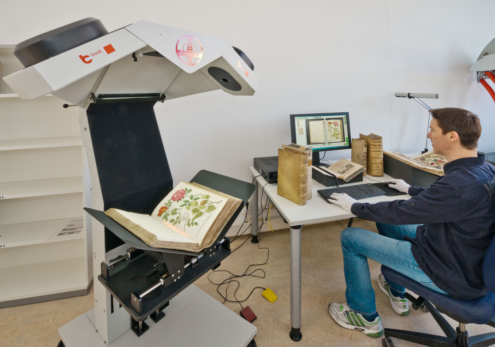

### Digitalisierung im bibliothekarischen Kontext

Digitalisierung gehört zum Alltagsgeschäft von Bibliotheken und das seit
über zwanzig Jahren. Ein Artikel über Digitalisierung an einer (relativ)
kleinen Bibliothek kann sicherlich in der Fachwelt nicht aufgrund
innovativer Revolutionen punkten -- vor allem nicht in der
Retrospektive. Sehr wohl aber kann das Interesse dafür geweckt werden,
wie denn der Beitrag einer Museumsbibliothek zu einer digitalisierten
Welt bisher ausgesehen hat, welche Probleme aufgetreten sind und wie
diese angegangen werden konnten. Dies ist zumindest die Hoffnung des
Verfassers dieses übergreifenden Werkstattberichts. So werden spezielle
Probleme am Beispiel deutlich, aber auch generell wird ersichtlich,
inwiefern der "gute alte Zettelkatalog", Produkt bibliothekarischer
Arbeit und Metadatenfundgrube, digital gewandelt -- Stichwort:
Metadatenmanagement -- nicht überflüssig geworden ist. Am Beispiel der
Bibliothek des Deutschen Museums wird in dieser Hinsicht deutlich, dass
die Bibliothek sich durch Digitalisierung nicht selbst abschafft,
sondern durch Fortführung dieser bibliothekarischen Grundaufgaben
Mehrwerte schafft. Im Verbund mit den anderen Säulen des Museums --
Ausstellungen und Archiv -- leistet sie ihren Beitrag zu einer
gemeinsamen digitalen Strategie,[^1] deren Ursprung bereits seit den
Gründungstagen angelegt ist, aber digital weit über die Museumsinsel
Münchens hinausgeht.

### Die Grundvoraussetzung: Digitale Erfassung der Metadaten der Bestände im Katalog und deren Einspielung in den Verbund

Bibliotheken haben seit jeher die Aufgabe, Bücher und generell Medien zu
sammeln und verfügbar zu machen.[^2] Im Falle der Spezial- und
Forschungsbibliothek des Deutschen Museums bedeutet dies bereits seit
der Gründung einen Sammel- und Erschließungsauftrag für
Naturwissenschaft, Technik und deren Geschichte.[^3] Um diese
Erschließung zu ermöglichen, werden Kataloge geführt, die in gewisser
Weise die Inhaltsverzeichnisse der Bibliotheken sind. Diese haben im
Verlauf der Bibliotheksgeschichte unterschiedliche Formen gehabt:
Bandkataloge, Zettelkataloge... In jedem Fall sind sie durch die
enthaltenen Metadaten wie die Findbücher in den Archiven der Schlüssel
zur effizienten Nutzung. Auch digital nutzt es wenig, zu wissen, dass
"alles im Netz" ist, wenn das Finden der gewünschten Information mit
ermüdender und langfristiger Bildschirmarbeit verbunden ist.

Seit 1995/96 katalogisiert die Bibliothek des Deutschen Museums in den
Verbundkatalog des Bibliotheksverbunds Bayern (BVB). Um rückwirkend
sinnvoll den gesamten Bestand verzeichnet zu haben und damit die
analogen Metadatenverzeichnisse digital nutzbar zu machen, schloss sich
eine Zeit der Retrokatalogisierung an. Dieses Vorhaben war für eine
Museumsbibliothek mit relativ großem Bestand nicht trivial. Inzwischen
bewegt sich der Bestand auf die Millionengrenze zu und ein nicht zu
unterschätzender Teil des Bestandes ist gemäß dem speziellen
Sammlungsauftrag deutschlandweit selten vorhanden, sodass
Fremddatenübernahme nicht flächendeckend möglich war.

Zusätzlich zu den Katalogkästen waren die seit der Gründerzeit geführten
Sachkataloge, welche Aufsätze, Zeitungsartikel und graue Literatur nach
Themen verzeichnen, ins Digitale zu überführen. Hier wurde ein
hausinternes Projekt durchgeführt, um die große Menge an Katalogkarten
einzuscannen und zumindest als Imagekatalog verfügbar zu machen. Mit der
Verbundkatalogisierung wurde zudem die Weiterführung des analogen
Instruments obsolet.

Das Vorhalten qualitativ guter Metadaten in bestenfalls übergreifenden
Systemen bildet die unabdingbare Voraussetzung für digitale Projekte und
dies in zweierlei Hinsicht: Zum einen verlangt der Anschluss an Verbünde
immer eine strenge Beachtung (und gegebenenfalls externe Kontrolle) der
eigenen Erschließungspraxis, zum anderen ist die digitale
Langzeitarchivierung beim Verbund besser gewährleistet. Schließlich
wurde der Vorteil für den Nutzenden rasch ersichtlich: Zum Jahresende
1999 ging der Onlinekatalog ins Netz.

### Erste (vorsichtige) Schritte

Ist diese (Daten-)Ebene essentiell wichtiger Bestandteil eines
Digitalisats,[^4] so kann man bei ihr noch nicht von einer
vollumfänglichen Digitalisierung des Bestandes sprechen. Hierbei
erwarten Nutzende nicht mehr nur Angaben zu Titeln, sondern auch die
Möglichkeit, Zugriff auf den Scan der Werke zu haben. Seit 2004 verfügt
die Bibliothek des Deutschen Museums mit dem ersten Buchscanner über das
notwendige Werkzeug. Ohne festgesteckte Projektziele diente dieses
allerdings zunächst der Reaktion auf Digitalisierungswünsche einzelner
KuratorInnen des Museums und die in dieser Art produzierten Scans waren
kein direkter Gewinn für die Nutzenden der Bibliothek oder die virtuelle
Öffentlichkeit. Nach dem Motto "Learning by Doing" wurden die
technischen Notwendigkeiten umgesetzt: Ein Laufwerk für die zu
erwartenden Digitalisate wurde eingerichtet, eine Ablagestruktur und ein
Benennungssystem für die Dateien entwickelt.

Mag diese Dienstleistung für die Forschenden vor Ort eine nette
Ergänzung zu früheren Kopieraufträgen sein, wird insbesondere im
deutschlandweiten Kontakt mit WissenschaftlerInnen der Nutzen einer
dezentralen Bereithaltung von Literatur deutlich: Zwar ist die
Bibliothek in gewisser Weise die Hausbibliothek der anwesenden
Forschenden und einschlägig interessierter MünchnerInnen, dem
Verständnis nach ist der Sammelauftrag bundesweit für das erwähnte
Fachprofil zu verstehen. Entsprechend sind die für das Museum
angeschafften Werke zwar Präsenzbestand, stehen aber der Forschung per
Fernleihe zur Verfügung. Abgesehen von der postalischen Lösung ist die
digitale Bereitstellung älterer Literatur eine naheliegende Alternative,
um den geografisch in Deutschland verteilten Forschenden kleiner
Disziplinen unnötige Reisen nach München zu ersparen.

Um die Notwendigkeit einer Bestellung oder gar einer Forschungsreise
bewerten zu können, kamen nun weitere (digitale) Erschließungsmethoden
zum Einsatz: Erste merkliche Verbesserung brachte auch für die Nutzenden
der Bibliothek des Deutschen Museums der Einstieg des Verbunds in die
Kataloganreicherung, welche der Bibliotheksverbund Bayern 2006 einführte
und hierfür sowohl Bearbeitungswerkzeug und Anleitungen bereitstellte.
Die an die Katalogeinträge angehängten gescannten Inhaltsverzeichnisse
haben insbesondere bei nichtssagenden Titeln oder Sammelbänden einen
eindeutigen Wert für jeden, der sich im Katalog fragt, ob das
entsprechende Werk bestellenswert ist. Als Spezialbibliothek mit Werken,
die ansonsten eher selten in Deutschland zu finden sind, entschied man
sich schnell, diese Anreicherung für die hochspezielle Erwerbung
anzuwenden. Das Einscannen von Inhaltsverzeichnissen ist bis heute neben
der verbalen Sacherschließung (Verschlagwortung) eine nicht zu
vernachlässigende Daueraufgabe der Bibliothek geblieben.

### Erstes Projekt: Astronomie-Rara in Kooperation mit der ETH Zürich 2010

Schließlich war in mehreren Etappen die Zeit reif für das Herzstück der
Digitalisierung, die digitale Reproduktion von analog vorliegenden
Werken. Durch eine glückliche Fügung erfolgte dies zunächst durch die
Beteiligung an einem Projekt: Anlässlich des Jahres der Astronomie 2009
ergab sich eine Kooperation mit der ETH Zürich. Auf einem gemeinsamen
Portal[^5] stellten die beiden Bibliotheken 191 bedeutsame Werke der
Astronomiegeschichte der Öffentlichkeit zur Verfügung. Die
Zusammenarbeit mit einer großen Bibliothek brachte es mit sich, dass die
Bibliothek Einblicke in die Anforderungen an derartige Projekte und vor
allem auch der entsprechenden Abläufe erlangte. Fürs Erste begnügte man
sich in Zürich damit, die großformatigen Scans im TIFF-Format per
Festplatte zugeschickt zu bekommen, folgende Arbeitsschritte wurden samt
und sonders in der Schweiz erledigt.

In Ermangelung zufriedenstellender erschwinglicher Softwarelösungen für
den Scan-Workflow setzte die Bibliothek auf Eigenentwicklung, die sich
vor allem für das Haus, aber auch in Projekten wie der Digitalisierung
umweltgeschichtlicher Werke in Zusammenarbeit mit dem Rachel Carson
Center for Environment and Society[^6] verdient machte. Diese
Eigenentwicklung bündelte notwendige Arbeitsschritte anderer digitaler
Werkzeuge, koordinierte Prozesse wie die Umwandlung der TIFF-Dateien in
Präsentationsformate sowie die Verknüpfung mit den Metadaten des
Katalogs und ermöglichte zudem eine Anreicherung des Katalogisats um
Schlagwörter und Strukturdaten -- Arbeitsschritte, bei denen andere
Workflowentwicklungen noch keine befriedigenden Lösungen anboten.

[Auch digital sehenswert: Die Buchschätze des
Astronomie-Rara-Projekts mit der ETH Zürich](img/Abb4.jpg)

### VD18 2014--2016

Waren mit dem Astronomie-Projekt die ersten Schritte quasi als
Juniorpartner der ETH Zürich gegangen, trat das Deutsche Museum als
Player der retrospektiven deutschen Nationalbibliographie[^7] für das
18. Jahrhundert in Erscheinung. Grundvoraussetzung war auch hier, dass
in seiner Sammlung teilweise unikaler Bestand an Spezialliteratur
bereits seit den Gründungstagen gesammelt wurde. Um den Schritt des
Scannens bei geringem Öffnungsgrad wertvoller alter Bücher und die
Möglichkeit, schnell(er) umzublättern, zu geben, wurde ein zusätzlicher
(Cobra-)Scanner angeschafft.

Die Ansprüche an die Digitalisate sind bereits durch den
förderpolitischen Motor, die Deutsche Forschungsgemeinschaft (DFG),[^8]
festgelegt. Ansprüche an Metadaten mussten besonders erfüllt werden, die
Verknüpfung von Scan und Metadaten, im besten Fall noch angereichert um
Strukturdaten, musste vom Haus selbst erledigt werden. Mit 300 zu
digitalisierenden Werken des Altbestands auch vom Umfang her eine
Steigerung. Um diesen Ansprüchen Herr zu werden, wurde erneut auf
softwaretechnische Eigenentwicklung gesetzt.

### Einstieg in die Massendigitalisierung: Die Kooperation mit Google Books

Im Anschluss an die erfolgreichen Verhandlungen der Bayerischen
Staatsbibliothek (BSB) mit Google und der für beide Seiten erfolgreichen
Durchführung des Projekts in den Jahren nach 2008[^9] stieg auch die
deutsche Bibliothekslandschaft ins Massengeschäft ein. Nach den
positiven Erfahrungen der BSB entstand im Deutschen Museum die Idee,
diese Möglichkeit ebenfalls zu nutzen.

Zwar führt der Wunsch einer Bibliothek, die Bestände zu digitalisieren,
nicht zwangsläufig zu einer Kooperation, denn Google kann rein
ökonomisch nicht daran interessiert sein, ein Kooperationsprojekt für
eine Bibliothek aufzusetzen, deren Bestände grosso modo bereits bei
großen Bibliotheken "abgegriffen" wurden und entsprechend bei Google
Books zu finden sind. Im Fall des Deutschen Museums waren eher
inhaltliche Gründe vorrangig:

-   Die Bibliothek des Deutschen Museums verfügt über einen bedeutenden
    Altbestand (libri rari) von 16.000 Werken aus dem Bereich der
    Geschichte der Technik und der Naturwissenschaften.

-   Als quasi Hausbibliothek für Technikhistoriker verfügt die
    Bibliothek über eine umfangreiche Sammlung in der
    Technikgeschichte, die zum Bereich der "kleinen Fächer"[^10]
    zählt. Ist die Bereitschaft, ein derartiges "kleines Fach"
    literaturtechnisch aus dem Bibliotheksetat umfassend zu bedienen,
    bei den meisten Universitätsbibliotheken gering, so hat das
    Deutsche Museum hier zusätzlich in gewisser Weise einen Auftrag
    als Archivbibliothek.

-   Zusätzlich zur im Buchhandel erschienenen Literatur wird
    einschlägige graue Literatur gesammelt.

-   Patentschriften und Adressbücher: Handelt es sich bei diesen zwei
    Gattungen sicherlich nicht um sehr verbreiteten
    Bibliotheksbestand, sind sie durch den technikhistorischen
    Schwerpunkt des Hauses für die einschlägige Forschung von großem
    Nutzen. Glücklicherweise sind sie nicht aufgrund von Säureschaden
    des schlechten Papiers entsorgt worden, wie es andernorts gerade
    bei den Adressbüchern und Branchenverzeichnissen häufig der Fall
    war: Das Veralten der enthaltenen Information ist häufig ebenso
    Grund zur Aussonderung, im Fall des Deutschen Museums jedoch ist
    dies allerdings eher ein Grund für die Aufbewahrung: Um
    Erkenntnisse etwa über Industrialisierungsprozesse zu gewinnen,
    sind Branchenverzeichnisse eine ergiebige Quelle. Schließlich
    gehörte und gehört zur technikhistorischen Forschung auch oft eine
    Recherche bezüglich Entwicklungen und ihrer Vermarktung.

2016 schließlich kam der Startschuss für die Kooperation des Museums mit
Google und damit auch die Digitalisierung mit Google Books. Die Gründe
auf der Museumsseite für eine derartige Kooperation sind leicht
ersichtlich, denn eine Digitalisierung von 50.000 gemeinfreien Bänden
war und ist bei der vorhandenen Personaldecke nicht zu stemmen. Im
Vergleich zur Boutique-Digitalisierung[^11], wie sie oben beschrieben
wurde, war die Public-Private-Partnership mit dem amerikanischen
Digitalgiganten von ganz anderen Überlegungen geprägt und hatte für ein
kleines Haus ganz andere Herausforderungen zu bieten.

Ist bei der Digitalisierung mit Google ein sehr personalintensiver und
zeitaufwändiger Faktor, das eigentliche Scannen, quasi ausgelagert, so
bleiben der Bibliothek wichtige Aufgaben. Einerseits sind diese
bibliothekarisch, denn mit Hilfe des Katalogs wurden die Werke
identifiziert, die urheberrechtlich unbedenklich sind und diese zu
Lieferungen zusammengefasst. Dabei kam es insbesondere beim Bestand der
libri rari, der kostbaren Altbestandssammlung, zu zahlreichen
Umarbeitungen und Aktualisierungen der Katalogeinträge. In Bezug auf
Zeitschriften mussten Jahrgangsbände systematisch in den Katalog
aufgenommen werden, damit diese verbuchbar, sprich: ausleihbar, waren.
Andererseits ist der Abtransport in das Digitalisierungszentrum von
Google durchaus auch eine logistische Herausforderung und so sorgte der
Ruf: "Google ist da!" für hektische Betriebsamkeit in Bibliothek und
Magazin.

Sicherlich können Digitalisate, die bei Google Books angezeigt werden,
in vielerlei Hinsicht nicht mit den Produkten der Hausdigitalisierung
mithalten. Nicht ausgeklappte Falttafeln, zerschnittene Titelblätter,
mitgescannte Finger, das sind Phänomene, für die sich erst im Vollzug
eine gewisse Sensibilität entwickelt hat und für welche Lösungen
gefunden werden müssen. Ebenfalls irrig ist die Annahme, dass
Massendigitalisierung die Kunst der (digitalen) Editorik übernehmen
könnte. Trotzdem, für eine Bereitstellung großer Textmengen ist die
Massendigitalisierung ein inzwischen auch am Deutschen Museum bewährtes
Verfahren und nach Abschluss der Hauptphase im Jahr 2019 kommt es auch
in Zukunft zu Lieferungen an Google, denn mit den fortschreitenden
Jahren verschiebt sich ebenfalls die Grenze der urheberrechtlichen
Unbedenklichkeit. Abgesehen von der Tatsache, dass ohne Google nicht mit
dieser Menge an Digitalisaten zu rechnen gewesen wäre, so ist die bei
Google durchgeführte automatische Texterkennung (Optical Character
Recognition, OCR) in Fachkreisen anerkannt und sorgt für einen Zugewinn
an Metadaten der eingescannten Titel: Die weitgehende Durchsuchbarkeit
des Textes. Insbesondere bei den erwähnten Branchenverzeichnissen und
Patentschriften wird so ein wahrer "digitaler Mehrwert" geschaffen und
das konservatorische Problem entschärft.

### Beteiligung am Fachinformationsdienst (FID) Geschichtswissenschaft (seit 2016)

Ihrer Rolle als Partnerin "in der digitalen Welt" wurde die Bibliothek
des Deutschen Museums noch auf anderer Ebene gerecht: Zusammen mit der
Bayerischen Staatsbibliothek übernahm sie im FID Geschichtswissenschaft
die Betreuung der Subdisziplin Technikgeschichte,[^12] seit Beginn der
zweiten Förderphase zusätzlich die Fächer Umwelt- und
Naturwissenschaftsgeschichte. Da das DFG-Programm generell der digitalen
Priorität verpflichtet ist, leistet auch die Bibliothek des Deutschen
Museums ihren Teil an der Digitalisierung vergriffener Werke. Mit dem
Beirat für Wissenschafts-, Technik- und Umweltgeschichte hat man sich
auf das Thema der frühen Atomforschung verständigen können. Diese
Digitalisierung hat Monographien zum Gegenstand. Hierfür verwendet die
Bibliothek weiterhin den erprobten Workflow, der als Eigenproduktion nun
an seine Grenzen stößt. Eine Anpassung an Standards insbesondere im
Bereich der Zeitschriftendigitalisierung ist nicht zuletzt aufgrund der
verwendeten Programmiersprache nicht ohne weiteres möglich.
Glücklicherweise entspricht die derzeitige Situation in Deutschland
nicht mehr denen der Pionierzeit, als die Zeichen auf Eigenentwicklung
standen: So liegt mit *Kitodo. Key to digital objects* ein
Workflowmanagementsystem vor, das weit verbreitet ist und auch von der
Fachcommunity getragen und weiterentwickelt wird.

Die "klassische" Bibliotheksarbeit findet im FID ebenfalls Anwendung und
ist -- dies Zeichen des digitalen Wandels -- jetzt nicht mehr auf den
eigenen Bestand begrenzt: Fachlich einschlägige und frei verfügbare
Ressourcen wie im Open Access publizierte Fachaufsätze aus zahlreichen
Ländern werden mit ihren Links in die Kataloge aufgenommen; so werden in
gewisser Hinsicht die (Sach-)Katalogkästen digital weitergeführt.
Zusätzlich verzeichnet das Themenportal[^13] auf der Internetpräsenz des
FID eine Vielzahl an Ressourcen wie die Adressen von passenden Archiven,
Museen und Fachgesellschaften, die geprüft und aktuell gehalten werden.

### Fazit und Ausblick

An der Digitalisierungsgeschichte der Bibliothek des Deutschen Museums
werden exemplarisch einige der Grundprobleme deutlich, denen sich jede
Bibliothek stellen muss, die das vermeintlich sichere Terrain einer rein
analogen Literaturversorgung verlassen kann und möchte. Sicherlich liegt
ein Teil der Aufgaben von Bibliotheken weiterhin in der Ermittlung der
passenden (gedruckten und digitalen) Literatur für die jeweiligen
NutzerInnen sowie der Gestaltung und Bereitstellung von attraktiven
Dritten Räumen für die Auseinandersetzung des Einzelnen mit Texten. Der
digitale Wandel und neue Arbeitsformen (sowohl wissenschaftlich als auch
privat) machen bibliothekarische Arbeit aber ebenso notwendig, wie sie
durch Erschließung, Kontextualisierung und Vernetzung Mehrwert
generiert.

Auch weiterhin bleibt es eine Illusion, dass man "alles im Internet"
finden könne, allein das Urheberrecht setzt hier exakt bestimmbare
Grenzen. Allerdings konnte die Bibliothek einen Teil der älteren
Literatur erfolgreich online bringen. Zur Relation: Die
Public-Private-Partnerschaft mit Google brachte bis heute circa 50.000
Werke ins Netz, der Bestand liegt jedoch bei circa einer Million Bänden
und stellt mittels bibliothekarisch erstellter Metadaten die
Möglichkeiten des Auffindens durch seinen Katalog bereit. Dieser ist
jedoch ebenfalls in andere Portale (Rechercheportale des Verbunds oder
Fachportal des FID) eingebunden. In Ergänzung zu den Anstrengungen in
der Welt der Bücher ist die Bibliothek auch Bestandteil des
Wissenskosmos Deutsches Museum und kommt damit zu ihren Ursprüngen auf
die Münchener Museumsinsel zurück: Im Deutschen Museum Digital[^14]
werden nicht nur ihre (Buch-)Digitalisate, sondern auch diejenigen der
Objektsammlungen und des Archivs gebündelt werden.[^15]

### Literatur

-   Altenhöner, Reinhard \[u.a.\]: Digitalisierung von Kulturgut. In:
    Rolf Griebel \[u.a.\] (Hg.): Praxishandbuch Bibliotheksmanagement.
    Berlin: De Gruyter, 2015, S. 763--811.

-   Bunge, Eva \[u.a.\]: Neue Services für die Technikgeschichte:
    Fachinformationsdienst Geschichtswissenschaft (FID). -- In:
    Technikgeschichte 85 (2018), S. 195--201.

-   Ceynowa, Klaus: Massendigitalisierung für die Wissenschaft -- Zur
    Digitalisierungsstrategie der Bayerischen Staatsbibliothek. In:
    Rolf Griebel \[u.a.\] (Hg.): Information, Innovation, Inspiration.
    450 Jahre Bayerische Staatsbibliothek. München: Saur, 2008, S.
    241--252

-   Ewert, Gisela \[u.a.\]: Bibliotheken. Die Definition der Bibliothek.
    In: Bibliotheksdienst 33 (1999) 6, S. 957--971.

-   Fieseler, Christian: Das Verzeichnis Deutscher Drucke des 18.
    Jahrhunderts (VD 18): Ziele, Entwicklung und aktueller Stand). --
    In BuB 68 (2016) 7, S. 402--405.

-   Hilpert, Wilhelm: 10 Jahre Partnerschaft mit Google. Auswirkungen
    und Spuren an der Bayerischen Staatsbibliothek. -- In: Klaus
    Ceynowa \[u.a.\] (Hg.): Bibliotheken: Innovation aus Tradition:
    Rolf Griebel zum 65. Geburtstag. -- Berlin/Boston: De Gruyter,
    2015, S. 258--266.

-   Hilz, Helmut (2017): Die Bibliothek des Deutschen Museums.
    Geschichte -- Sammlung -- Bücherschätze. München: Deutsches
    Museum.

-   Huguenin, Fabienne: Deutsches Museum Digital: Online-Portal von
    Archiv, Bibliothek und Objektsammlung. -- In: AKMB-news 25 (2019)
    2, S. 3--11.

[^1]: <https://digital.deutsches-museum.de/about/digital-strategy/>
    Zugriff am 08.02.2021.

[^2]: Ewert, Gisela \[u.a.\]: Bibliotheken. Die Definition der
    Bibliothek. In: Bibliotheksdienst 33 (1999) 6, S. 957--971.

[^3]: Hilz, Helmut (2017): Die Bibliothek des Deutschen Museums.
    Geschichte -- Sammlung -- Bücherschätze. München: Deutsches Museum,
    S. 72.

[^4]: Altenhöner, Reinhard \[u.a.\]: Digitalisierung von Kulturgut. In:
    Rolf Griebel \[u.a.\] (Hg.): Praxishandbuch Bibliotheksmanagement.
    Berlin: De Gruyter, 2015, S. 763--811, hier S. 793--801.

[^5]: <https://astronomie-rara.ethbib.ethz.ch/>
    Zugriff am 08.02.2021.

[^6]: <https://www.carsoncenter.uni-muenchen.de/index.html>
    Zugriff am 08.02.2021.

[^7]: Fieseler, Christian: Das Verzeichnis Deutscher Drucke des 18.
    Jahrhunderts (VD 18): Ziele, Entwicklung und aktueller Stand). -- In
    BuB 68 (2016) 7, S. 402--405.

[^8]: DFG (2013): DFG-Praxisregeln "Digitalisierung". Online verfügbar
    unter
    <http://www.dfg.de/formulare/12\_151/12\_151\_de.pdf>,
    Zugriff am 08.02.2021.

[^9]: Hilpert, Wilhelm: 10 Jahre Partnerschaft mit Google. Auswirkungen
    und Spuren an der Bayerischen Staatsbibliothek. -- In: Klaus Ceynowa
    \[u.a.\] (Hg.): Bibliotheken: Innovation aus Tradition: Rolf Griebel
    zum 65. Geburtstag. -- Berlin/Boston: De Gruyter, 2015, S. 258--266.

[^10]: <https://www.kleinefaecher.de/>
    Zugriff am 08.02.2021

[^11]: Ceynowa, Klaus: Massendigitalisierung für die Wissenschaft -- Zur
    Digitalisierungsstrategie der Bayerischen Staatsbibliothek. In: Rolf
    Griebel \[u.a.\] (Hg.): Information, Innovation, Inspiration. 450
    Jahre Bayerische Staatsbibliothek. München: Saur, 2008, S. 241--252,
    hier S. 245.

[^12]: Bunge, Eva \[u.a.\]: Neue Services für die Technikgeschichte:
    Fachinformationsdienst Geschichtswissenschaft (FID). -- In:
    Technikgeschichte 85 (2018), S. 195--201.

[^13]: <https://www.historicum.net/technikgeschichte>
    Zugriff am 08.02.2021.

[^14]: <https://digital.deutsches-museum.de/>
    Zugriff am 08.02.2021.

[^15]: Huguenin, Fabienne: Deutsches Museum Digital: Online-Portal von
    Archiv, Bibliothek und Objektsammlung. -- In: AKMB-news 25 (2019) 2,
    S. 3--11.
