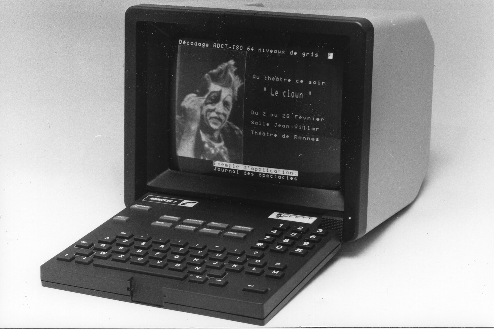
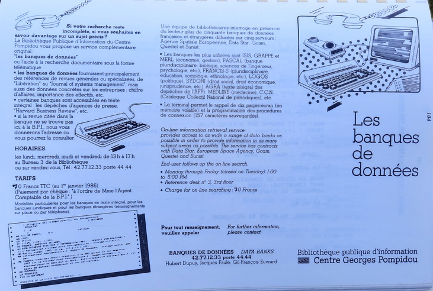

> «Für den einen mag dies alles wie eine Horrorvision aussehen, für den anderen wie Zukunftsmusik klingen, aber an einer Beschäftigung mit diesem Thema werden die Bibliothekare wohl nicht vorbeikommen.» (Redaktion Bibliotheksdienst 1983: 81, zu Btx)

### 1. Einleitung: Pepper est mort. Vive les nouvelles technologies !

Gerade als die LIBREAS-Redaktion daran arbeitete, die Ausgabe #39 mit
dem Schwerpunkt «Roboter und Automatisierung» für die Publikation
vorzubereiten, wurde berichtet, dass Softbank beschlossen habe, seine
Robotik-Abteilung zu schliessen. (Crowe 2021, Nussey 2021, Wakefield
2021) Diese Robotik-Abteilung bestand praktisch aus der französischen
Firma Aldebaran, welche Softbank 2013 gekauft hatte. (Boogar 2014,
Palmer 2012) Aldebaran hatte die humanoiden Roboter Nao und Pepper
entwickelt. Pepper hatte Nao abgelöst, der wohl schon länger nicht mehr
produziert oder weiterentwickelt wird. Im Rahmen der Nachrichten über
die Schliessung dieser Robotik-Abteilung wurde berichtet, dass auch die
Produktion von Pepper schon für längere Zeit eingestellt worden sei.[^1]

Das ist relevant, denn unter den Robotern, die in Bibliotheken
eingesetzt werden, sticht Pepper hervor. Es gibt andere Roboter,
insbesondere kleine, die in Makerspaces genutzt werden und solche, die
in Bibliotheksmagazinen und für das Bestandsmanagement eingesetzt
werden. Aber Pepper war es, der immer und immer wieder in den
Mittelpunkt gestellt wurde: In Vorträgen (König 2020), auf den
Titelblättern bibliothekarischer Fachpublikationen (beispielsweise BuB
70 (2018) 02--03) oder in Imagevideos (Stadtbüchereien Düsseldorf 2018).
Auch in der oben genannten Ausgabe #39 der LIBREAS erschien ein Artikel
darüber, wie an einer der Bibliotheken der Fachhochschule
Nordwestschweiz der Einsatz von Pepper systematisch und in
Zusammenarbeit mit Forschenden aus der Angewandte Psychologie geplant
wurde. (Urech, Eberle & Burkhard 2021) Zeitweise bestand der Eindruck,
als wäre die Zukunft der Robotik vielleicht humanoid und als wären diese
Roboter in Zukunft auch ein Bestandteil von Bibliotheken.

Das ist jetzt alles hinfällig. Es gibt nur noch die bereits fertig
produzierten Pepper. Diese werden wohl abverkauft oder genutzt, um
defekte Geräte auszutauschen. Serviceverträge werden gewiss noch bis zum
Ende der Laufzeit bedient. Aber es wird keine Weiterentwicklung geben,
keine neuen Modelle und irgendwann werden auch die noch existierenden
Pepper unbrauchbar sein. Seit der Ankündigung von Softbank ist keine
weitere Firma in die Bresche gesprungen und hat andere humanoide Roboter
der Grösse und Komplexität von Pepper für die zivile Nutzung angeboten.

Softbank hatte -- so die Einschätzung der oben erwähnten Artikel -- die
Produktion von Robotern eingestellt, weil sich die Hoffnungen darauf,
solche humanoiden Roboter im Alltag zu etablieren und damit einen neuen
Markt zu schaffen, wohl nicht realisiert hatten. Aldebaran, welche diese
Utopie aktiv vorangetrieben hatte, war auch schon vorher daran
gescheitert -- sonst hätte Softbank die Firma wohl nicht kaufen können.
Auch die in der bibliothekarischen Presse immer wieder verbreiteten
Photos von Pepper; alle Projekte, mit denen in verschiedenen Bereichen
Anwendungsfälle für Pepper und davor Nao gesucht wurden sowie die
positive Presse, welche diese Roboter hatten -- sie haben nicht dazu
geführt, dass sich diese Technologie breit durchgesetzt hätte.

Erstaunlicherweise hält das Bibliotheken bis heute nicht davon ab, sich
weiter mit Pepper auseinanderzusetzen. Die Zentral- und
Hochschulbibliothek Luzern postete noch im Dezember 2021 über ihren
Versuch, einen Ersatz für ihren offenbar defekten Pepper zu importieren.
(Mattmann 2021, ZHB Luzern 2021a-b) Auf dem Kongress des schweizerischen
Bibliotheksverbandes bibliosuisse im Oktober 2021 bot eine Firma,
CleverGuides, den Roboter an. Eventuell wird es noch einige Zeit dauern,
bis sich die Erkenntnis durchsetzt, dass Pepper und wohl auch andere
humanoide Roboter doch nicht die Zukunft der Bibliothek darstellen,
zumindest nicht in den nächsten Jahren.

#### 1.1 Abstraktion der Fragestellung

Was ist daraus zu lernen? Es wäre einfach, einen Text darüber zu
schreiben, was bei der offensichtlichen Begeisterung einiger Teile des
Bibliothekswesens für Pepper und die Versprechen, die mit ihm verbunden
wurden, fehl gelaufen ist und daraus vielleicht einige Vorschläge für
die Zukunft zu formulieren. Beispielsweise, dass man immer aufmerksam
sein sollte, wenn es praktisch nur ein oder zwei Firmen gibt, die eine
neue Technologie propagieren. Oder auch aufzupassen, wenn die
eigentliche Entwicklung so lange hinter den Versprechen dieser Firmen
hinterherhinkt, wie es bei Pepper -- und auch schon dem Vorgänger Nao --
passiert ist.

Aber: Es ist nicht das erste Mal, dass Bibliotheken eine gewisse
Begeisterung für eine neue Technologie zeigten, sich dann aber die
Technologie und mit ihr die ganzen Zukunftsvorstellungen, die an diese
neuen Technologien gebunden waren, als wenig erfolgreich herausstellten
und diese entweder verschwanden oder von wieder neueren Technologien
ersetzt wurden.

Das Ende von Pepper führte zu einer Recherche -- auf der dieser Artikel
basiert -- welche der Frage einen breiteren Rahmen geben sollte: *Gibt
es ein Muster, ein «Modell», dem Bibliotheken folgen, wenn sie sich mit
neuen Technologien auseinandersetzen?* Gäbe es dieses und könnte man es
beschreiben, so wäre für die Zukunft mehr gewonnen, als wenn man sich
gerade auf das Beispiel Pepper fokussieren würde. Wenn man ein Modell --
also eine immer wieder von Bibliotheken gefolgte Handlungsstruktur --
aufzeigen kann, kann man dieses anschliessend auch immer verändern. Man
könnte dann frühzeitig und gezielt reagieren, wenn die nächste
Technologie mit grossen Versprechen für die Zukunft propagiert wird.

Der Ton des letzten Absatzes macht es aber auch klar: Dieses Modell gibt
es so nicht. Zumindest zeigte es sich in der Recherche nicht, sondern
nur erste Anhaltspunkte für ein solche. Was hingegen bei dieser
historischen Recherche zu finden war, ist erstaunlicherweise eine schon
existierende Tradition -- wenn auch ausserhalb des Bibliothekswesens --
nach so einem Modell zu suchen. Ebenso fanden sich Hinweise darauf, wie
wichtig nicht-technische Elemente dabei sind, ob und wie neue
Technologien Verbreitung finden -- sowohl in der Gesellschaft im Grossen
als auch in Bibliotheken im Kleinen. Aber auch diese Ergebnisse liefern
Wissen, welches Bibliotheken in Zukunft helfen kann, planend auf neue
Technologien einzugehen.

#### 1.2 Aufbau des Textes

Im Folgenden soll zuerst (2) die genaue Fragestellung der Recherche
eingeführt werden. Es soll danach gesucht werden, ob sich ein Modell
finden lässt, welches erklärt, wie Bibliotheken auf neue Technologien
reagieren. Dafür werden Themen benannt, welche sich auf verschiedene
«neue Technologien» anwenden lassen. In diesem Kapitel wird auch
begründet, warum in diesem Text interaktive Videotextsysteme als
Beispiel für diese Untersuchung ausgewählt wurden. Im nächsten Kapitel
(3) werden die Entwicklungen des französischen Minitel- und des
bundesdeutschen Btx-Systems interaktiver Videotextsysteme dargestellt,
wobei es nicht hauptsächlich um die technische, sondern um die
gesellschaftlichen und politischen Kontexte gehen wird. Dies ist
relevant, da sich anhand des gewählten Beispiels zeigt, wie sehr die
Kontexte bestimmen, ob und wie eine Technologie sich in einer
Gesellschaft verbreitet. Erwähnt wird in diesem Kapitel auch, das die
Frage, welche Modelle die Verbreitung beziehungsweise Nicht-Verbreitung
neuer Technologien beschreiben können, schon im Zusammenhang mit den
hier besprochenen Systemen gestellt wurde. Schliesslich wird (4) darauf
eingegangen, wie Bibliotheken auf diese Technologie reagierten. Hier
zeigen sich deutliche Unterschiede zwischen der Situation in Frankreich
und der BRD. Es wird auch diskutiert, wieso sich gerade an diesem
Beispiel zeigt, warum die Suche nach Modellen der Etablierung von neuen
Technologien in Bibliotheken mindestens weit komplexer angelegt sein
muss, als sich nur auf technische Entwicklungen zu konzentrieren, und
warum die gesellschaftlichen Kontexte in diese Suche nach Modellen
integriert werden müssen. Im Fazit (5) wird dies, auf der Basis dessen,
was in der Recherche zu diesem Artikel gelernt wurde, als offenes, aber
auch lohnendes Forschungsthema skizziert.

Die Grundmotivation, verstehen zu wollen, wie und wieso Bibliotheken auf
neue Technologien reagieren, um dann dies in Zukunft für die
Bibliothekspraxis als Wissen zur Verfügung zu stellen, um genau in
solchen Fällen fundierter vorgehen zu können, ist auch am Ende des
Projektes, dessen Ergebnis dieser Text ist, besteht weiter. Es ist
während der Arbeit an diesem Text ersichtlich geworden, dass dies weit
schwieriger -- aber damit auch interessanter -- sein wird, als sich das
am Anfang dieser Arbeit gedacht wurde.

### 2. Der Plan: Warum Minitel und Btx ein gutes Beispiel sind.

Der Plan hinter diesem Text sieht wie folgt aus: *Anhand einer einst
neuen Technologie, mit der sich Bibliotheken auch tatsächlich befasst
hatten, soll ein Modell formuliert werden, welches beschreibt, wie diese
Technologie in den Bibliotheken reflektiert und genutzt wurde sowie wie
sie wieder aus den Bibliotheken verschwand.* Diese Arbeit schliesst an
zwei andere Artikel des Autors aus dem letzten Jahr an. Im ersten
(Schuldt 2021a) wurde die Verbreitung von Computern in Bibliotheken im
DACH-Raum in den 1960er Jahren dargestellt und einige Beobachtungen über
ein allgemein ähnliches Vorgehen in den Ländern des DACH-Raumes gemacht.
Die Frage war nun, ob sich dies auch bei der Diffusion anderer
Technologien zeigt und sich damit Hinweise auf typisches Verhalten von
Bibliotheken finden. Im zweiten (Schuldt 2021b) wurde diskutiert, wie
sich die Geschichte der Entwicklung von Technologie im Bezug auf
Bibliotheken darstellen lässt. Dabei wurden verschiedene Extreme --
Technikdeterminiertheit, Determination durch gesellschaftliche
Entwicklungen -- kritisiert und eine kontextualisierte Betrachtung
eingefordert. Die Herausforderung im vorliegenden Text war, diesen
Anspruch auch umzusetzen.

#### 2.1 Mögliche Inhalte eines Modells

Punkte, die in einem solchen Modell beachtet werden sollten, wären unter
anderem:

* Welche Vorhersagen und Versprechen für die Zukunft werden im Bezug auf die neue Technologie gemacht und welche davon tauchen dann in der bibliothekarischen Diskussion auf? Wie werden sie in Bibliotheken interpretiert? Werden zum Beispiel übergreifende Versprechen («Die Zukunft der Arbeit wird sich durch diese Technologie verändern.») übernommen oder werden sie für den Bibliothekskontext uminterpretiert («Der Zugang zum Katalog wird sich verändern.»)? Wie detailliert werden diese Vorhersagen gemacht und übernommen?

* In welcher Weise reagieren Bibliotheken auf die neue Technologie? Werden zum Beispiel zuerst intensive Diskussionen und Technikfolgeabschätzungen durchgeführt? Oder werden möglichst schnell Projekte mit der neuen Technologie aufgegleist?

* Welche Bereiche von Bibliotheksarbeit werden diskutiert und welche Bereiche werden dann tatsächlich angegangen, um sie mit der Technologie zu verändern? Wird zum Beispiel vor allem über die Rationalisierung der Arbeit von Bibliotheken nachgedacht oder über die Interaktion von Nutzer\*innen? Wird darüber nachgedacht, die Technologie in die Bibliothekspraxis zu integrieren -- und wenn ja, wie weit? Wird zum Beispiel früh darüber geredet, ob und wie sich die konkrete Arbeit für Bibliothekar\*innen verändert -- oder wird sie eher als Ergänzung bibliothekarischer Angebote verstanden? Und wie sieht dies dann in der Praxis aus?

* Wie sehr ist diese Reflexion oder Übernahme der neuen Technologie in Bibliotheken mit der Entwicklung der Diskussion über diese und ihrer Diffusion in der gesamten Gesellschaft verbunden? Reagieren Bibliotheken vor allem auf Diskurse und Entwicklungen oder agieren sie selber? Wie sehr sind sie dabei Avantgarde oder gerade nicht?

* Findet eine «banalisation» der Technologie statt -- also eine Übernahme in die Praxis, die dann so alltäglich wird, dass sie nicht mehr erwähnenswert scheint -- und wenn ja, wie schnell? Wird zum Beispiel irgendwann aufgehört, die Technologie immer wieder neu zu erklären oder zu betonen, dass sie eine Innovation darstellt? Wird irgendwann davon ausgegangen, dass sie bekannt ist?

* Gleichzeitig: Wie und wann wird eine Technologie wieder «ausgephast», also wieder aus der Bibliothek entfernt? Warum passiert das? Hat das dann vor allem Gründe in Bibliotheken -- also setzt sich beispielsweise eine andere Technologie durch -- oder Gründe ausserhalb von Bibliotheken -- zum Beispiel weil die Technologie nicht mehr hergestellt wird?

Dieses Modell soll von einem historischen Beispiel abstrahiert werden.
Es könnte der Bibliothekspraxis eine Struktur an die Hand gegeben.
Sollte es eine Struktur geben, der Bibliotheken vielleicht unbewusst
folgen und diese Struktur sichtbar gemacht wird, kann ihr anschliessend
bewusster gefolgt und die Diffusion von neuen Technologien effizienter
geplant werden. Andererseits würde das Modell auch Entwicklungen oder
Auseinandersetzungen im Bibliotheksbereich über Veränderungen als
strukturell angelegt verständlich machen, was beispielsweise dazu
genutzt werden könnte, die Bedeutung von Diskursen und Versprechen für
die tatsächliche Praxis sichtbar zu machen: Wenn zum Beispiel immer
wieder ähnlich Fragen auftreten, ähnliche Kritik geäussert wird oder
ähnliche Versprechen über die Entwicklung von Bibliotheken durch neue
Technologien gemacht werden, dann können diese als notwendig für solche
Prozesse identifiziert und eventuell von vornherein angegangen werden.

Es galt für diesen Plan, eine ehemals neue Technologie zu wählen, welche
im Idealfall folgenden Kriterien entsprechen sollte:

* Die Technologie sollte einen Einfluss auf Bibliotheken gehabt haben oder zumindest das Potential dazu. Je näher sie mit Aufgaben von Bibliotheken verbunden war, je eher kam sie als Beispiel in Betracht.

* Die Technologie sollte eine weite Verbreitung, sowohl in der Gesellschaft als auch in Bibliotheken, gefunden haben. Für das Beispiel waren also Technologien, die eigentlich nur in einigen ersten Projekten genutzt wurden, ungeeignet.

* Ideal wäre zudem, wenn diese Technologie wirklich an einen Endpunkt gelangt war und nicht die realistische Möglichkeit bestand, dass sie doch wieder neu «belebt» würde.[^2] Dabei wäre eine Technologie mit einer längeren, aber doch zu überblickenden «Lebenszeit» von Vorteil. Länger, damit in Bibliotheken und Gesellschaft genügend Erfahrung mit ihr gesammelt wurden, die für eine Analyse herangezogen werden können und überblickbar, damit diese Erfahrungen auch ausgewertet werden können.

* Von Vorteil wäre auch, wenn das Ende der Technologie einige Zeit zurückliegt, so dass über dieses Ende schon reflektiert werden konnte, aber auch nicht so weit, dass man vermuten könnte, dass sich Bibliotheken und Gesellschaft so sehr entwickelt hatten, dass aus der Geschichte dieser Technologie nichts mehr gelernt werden kann, weil der Kontext zu unterschiedlich geworden ist.

* Die am Ende gewählte Technologie erfüllte noch ein Kriterium, an das am Anfang nicht gedacht wurde, welches sich aber als erkenntnisfördernd herausstellte: Die Technologie hatte in vergleichbaren Gesellschaften unterschiedliche Entwicklungen genommen.

Es gäbe gewiss eine Anzahl an Technologien, welche diese Kriterien mehr
oder minder erfüllen.[^3] Zum Beispiel stellten erst kürzlich Anne
Christensen und Matthias Finck die Entwicklung von Discovery Systemen in
Bibliotheken dar und nutzen, um diese Entwicklung zu untersuchen, mit
dem «Gartner Hype Cycle» auch ein Modell -- allerdings ein nicht aus dem
Bibliothekswesen stammendes und die Möglichkeit eines Endes von
Technologien gar nicht beinhaltendes. (Christensen & Finck 2021) Die
Geschichte dieser spezifischen Technologie Discovery Systeme ist noch
nicht abgeschlossen, vielleicht wird sie es auch nie sein. Aber man
hätte sich zum Beispiel für den hier vorliegenden Artikel auf eine
Generation dieses Systems konzentrieren können. Christensen und Finck
zeigen in ihrem Beitrag immerhin eindrücklich, dass diese ein lohnendes
Thema für eine historische Beschäftigung sein könnte.

Die Wahl der Technologie war also, neben den aufgestellten Kriterien,
auch eine von privaten Interessen, Zugänglichkeit zu Materialien und
Sprachkenntnissen des Autors geprägte Entscheidung.[^4]

#### 2.2 Begründung für die Wahl der Technologie

Die Wahl fiel auf die interaktiven Videotextsysteme, welche in den
1980er Jahren Verbreitung in Ländern des globalen Nordens fanden. Im
Fokus stehen in diesem Text das französische und das bundesdeutsche
System. Das französische, bekannt unter dem Namen «Minitel»,[^5] wird
herangezogen, weil es die grösste Verbreitung in einem Land fand und
damit auch den grössten Einfluss hatte. «Bildschirmtext», abgekürzt
zumeist als Btx (aber auch teilweise mit anderen Schreibweisen wie BTX
oder btx), die bundesdeutsche Variante, wird als Vergleich herangezogen,
weil zu Btx eine Reihe von Materialien, die sich auf Bibliotheken
beziehen, für die Recherche zugänglich waren. Unter verschiedenen Namen
und auch mit unterschiedlichen Betriebsmodellen gab es diese Systeme
auch in anderen Ländern, beispielsweise als «Videotex» in der Schweiz
und Belgien, «Prestel» in Grossbritannien, «Teledata» in Dänemark und
Norwegen, «Beltel» in Südafrika oder unter verschiedenen Namen mit
verschiedenen Anbietern in den USA («Prestel», «Green Thumb»,
«Viewtron», «Teletext») und Kanada («Mercury», «Vidon», «Ida»). (Ratzke
1984: 222, Vetsch 1988: 54) Diese Technologie -- welche weiter unten
genauer dargestellt wird -- erfüllt die gerade (2.1) aufgestellten
Kriterien wie folgt:

* Sie existierte über einen längeren Zeitraum, entwickelt Ende der 1970er Jahre, aktiv in der breiten Nutzung in der Gesellschaft dann vom Beginn der 1980er Jahre bis Mitte der 1990er Jahre (betrieben wurde einige Netze länger, aber auch das erfolgreiche Minitel-Netz wurde 2012 endgültig abgeschaltet). Dieser Zeitraum liegt einige Zeit zurück, aber auch nicht zu weit.

* Die Technologie wurde, insbesondere in Frankreich, mit grossen Versprechen nicht nur über technische, sondern auch gesellschaftliche Veränderungen, Veränderungen in der Nutzung von Informationen oder Veränderungen beim Arbeiten verbunden. Sie wurde in einigen Ländern (unter anderem den beiden hier verglichenen) massiv von staatlicher Seite und von Seite grosser Unternehmen vorangetrieben. Sie war, zumindest vom Ziel her, keine Nischentechnologie. Auch wenn sich im Nachhinein zeigt, dass sich diese Erwartungen nicht unbedingt erfüllten, waren sie nicht substanzlos, sondern basierten auf ernsthaften Auseinandersetzungen mit der Entwicklung von Technologie und Gesellschaft.

* Interaktive Videotextsysteme wurden, wieder zumindest vom Ziel her, vor allem zur Verbreitung und Verarbeitung von Informationen genutzt, also einem Bereich, welcher direkt zum Arbeitsfeld von Bibliotheken gehört.

* Es gibt eine Anzahl von Erfahrungen aus Bibliotheken, die mit dieser Technologie arbeiteten.

Eher zufällig treffen sich Pepper und das Minitel-System darin, dass
beide auch vorangetrieben wurden, um die technikproduzierende Industrie
in Frankreich zu entwickeln -- es ging bei beiden auch immer um die
Schaffung von Arbeitsplätzen in Frankreich selber.

### 3. Die Technologie: Die Entwicklung interaktiver Videosysteme

Interaktive Videotextsysteme wurden in den 1970er Jahre entwickelt und
erreichten in den 1980er Jahren ihre Produktionsreife. Basis war immer
das britische Prestel-Netz, für das die Technik entwickelt wurde. Aber
fast immer wurden die Weiterentwicklungen in den einzelnen Ländern
selber unternommen.[^6] Sie stellten Computernetze dar, die dem System
von datenverarbeitenden Rechnern und Terminals -- also grundsätzlich
weiter der Trennung in Mainframe und Peripheriegeräten -- folgten. Die
Nutzer\*innen erhielten Zugriff auf das jeweilige System über diese
Terminals, welche aufgrund unterschiedlicher Standards grundsätzlich auf
jeweils ein Netz hin ausgerichtet waren. Diese Terminals übernahmen die
Eingabe von Daten über Tastaturen sowie die Ausgabe von Daten auf
Monitoren. Die Übermittlung der Daten geschah jeweils über das
Telefonnetz.[^7] Dabei waren die Terminals selber nicht sehr viel
grösser als heutige grosse Laptops, konnten also ihren Platz auch in
Wohnungen und Büros finden, obgleich Terminals für die öffentliche
Nutzung, beispielsweise an Bahnhöfen, auch in grössere Gestelle
eingebaut wurden, während die Hauptrechner in den Rechenzentren viel
grösser waren.[^8]

Alle Rechenleistung sowie die Datenspeicherung wurden von den Rechnern
im System, nicht den Terminals, übernommen. Diese Rechner wiederum waren
in Netzen zusammengeschlossen, über die ebenso Daten ausgetauscht
wurden. Dies gewährleistete, dass Daten schnell im gesamten Land zur
Verfügung stehen konnten. Da die Datenübertragung aber Zeit und Aufwand
kostete, war es auch nicht ungewöhnlich, dass Angebote nur für eine
Region angeboten wurden. Dann wurden die Daten nur in Rechenzentren
dieser Region vorgehalten und von diesem verbreitet.

In späteren Entwicklungen waren Erweiterungen des Systems möglich.
Beispielsweise war es möglich, für den Minitel eigene Server auf
Kleinrechnern zu betreiben (Guérin 1989) oder aber Kleinrechner als
Terminals zu nutzen (Servin & Schulwitz 1986).[^9] Aber auch diese Daten
wurden vom privaten Server auf Rechenzentren übertragen und von dort an
die angeschlossenen Terminals ausgeliefert. Ebenso war es dann in den
frühen 1990er Jahren möglich, das Minitel-Netz und andere über das
Internet betriebene Netze miteinander kommunizieren zu lassen.[^10]

#### 3.1 Funktionalitäten

Dieses System ermöglichte tatsächliche Interaktion, nicht nur die
Auswahl verschiedener Informationsseiten, wie sie der ähnlich benannte
«Videotext» anbietet, welcher von TV-Sendern angeboten wird, und mit dem
das System oft verwechselt wird. Nutzer\*innen von interaktiven
Videotextsystemen konnten auf Datenbanken und Daten anderer
Informationsanbieter (beispielsweise Informationen zu Bahnreisen)
zugreifen, elektronische Nachrichten verschicken und empfangen, in Foren
und in Chat-ähnlicher Form kommunizieren (insbesondere die weiter unten
im Text erwähnten «messageries»). Aber auch erste Formen von
Bankgeschäften per interaktiven Videotextsystem und Bezahlsysteme
existierten. So konnten beispielsweise erste Formen von
Online-Geschäften gemacht werden: Läden und Ladenketten stellten dafür
ihre Angebote dar und boten dann unterschiedlich umgesetzte
Möglichkeiten, Bestellungen auszulösen.

Die notwendigen Server waren allesamt in Datenzentren untergebracht, die
von Post- und Telefonunternehmen betrieben wurden. Je nach
Organisationsform waren das oft die staatlichen Unternehmen wie die
französische Postes, télégraphes et téléphones (PTT), die Deutsche Post
oder auch die schweizerischen Post-, Telefon- und Telegrafenbetriebe. In
anderen Ländern (Kanada, USA), in denen die Telefonnetze privatisiert
waren, übernahmen aber auch die betreffenden kommerziellen Firmen diese
Funktion. Mit der Privatisierung der Telefongesellschaften in den späten
1980er und frühen 1990er Jahren eröffnete sich dann auch in europäischen
Ländern die Möglichkeit, dass diese Datenzentren von anderen Anbietern
betrieben wurden.[^11]

#### 3.2 Finanzierung

Finanziert werden sollten die interaktiven Videotextsysteme über
zahlreiche Gebühren. Diese waren sowohl von Anbietern von Informationen
als auch von Nutzer\*innen zu zahlen. Dabei gab es verschiedene Modelle
und bis zum Ende der Systeme war die Frage, für was Gebühren erhoben
werden sollten und wie hoch diese sein sollten, ständig in der
Diskussion. Ratzke (1984: 215) führt zum Beispiel in einer Tabelle die
damals gültigen Gebühren für den bundesdeutschen Btx-Dienst auf. Für die
«Btx-Teilnehmer» waren dies monatliche Gebühren sowie solche für das
Senden einer Mitteilung und das «Speichern einer abgerufenen Mitteilung»
pro Seite und Tag. Für die «Informationsanbieter» gab es unter anderem
monatliche Gebühren (bundesweit oder für regionale Bereiche) für das
Betreiben eines Angebots, solche für das Speichern von Seiten pro Tag,
«für eine geschlossene Benutzergruppe», für das «Übertragen einer Seite
nach externen Rechnern», für das «Einarbeiten von Btx-Seiten» oder auch
für den «Eintrag in \[die\] Anbieterliste». Zudem gab es etwa Gebühren
für die «Berechtigung für den Anschluß eines externen Rechners» oder die
«Aufstellung der erhobenen Vergütungen».

Demgegenüber wird in der Literatur mehrfach die relative Einfachheit der
Gebühren des Minitels gelobt. (Mailland & Driscoll 2017) Bei diesem gab
es monatliche Gebühren, solche für die eigentliche Datennutzung und --
was als Grund für den Erfolg angesehen wird (Abadie 1988) -- ein
«Kiosk-System», bei dem die Nutzer\*innen für das Angebot eines
Anbieters, das aus mehreren Teilen bestehen konnte, zum Beispiel Zugang
zu den Artikeln einer Zeitschrift und gleichzeitig auch einer
«messangerie», erhöhte Anschlussgebühren zahlte. Ein Teil dieser
Gebühren für Kioske ging an die PTT, ein anderer an die jeweiligen
Anbieter, welche die Höhe selber bestimmen konnte.

Wichtig ist, dass alle interaktiven Videotextsysteme als Infrastruktur
konzipiert waren, deren Aufbau und Betrieb zwar oft von öffentlichen
Unternehmen gewährleistet wurde, die dann aber immer durch die
Benutzenden finanziert und im Idealfall auch Gewinn generieren sollten.
Es wurde zudem immer auch erwartet, dass sich um diese Systeme herum
weitere Unternehmen entweder neu formieren oder aber bestehende von
diesen profitieren würden.

### 4. Kultur, Politik und Technologie: Eine kurze Geschichte von Minitel und Btx

Beschäftigt man sich mit der Geschichte der interaktiven
Videotextsysteme, so fällt schnell auf, wie sehr diese Geschichte
jeweils in nationale Entwicklungen integriert war. Die Angebote, die
Nutzungsmöglichkeiten, die verwendeten Standards und auch die
tatsächliche Nutzung durch die Öffentlichkeit waren immer national
unterschiedlich. Dem steht nicht entgegen, dass es immer auch
länderübergreifende Treffen und Kommunikation über die Videotextsysteme
gab -- beispielsweise eine «videotex in Europe Conference» 1979 in
Luxemburg (Anderla 1980) und mindestens ein «Videotex Europa» Kongress
in Basel 1985 (Alphaville AG 1985, gleichzeitig der 3. Schweizerische
Videotex-Kongress). Zudem gab es immer Projekte, die jeweiligen Systeme
in anderen Ländern zu verbreiten -- beispielsweise explizite Versuche
Frankreichs, den Minitel über die Agentur «Intelmatique» zu exportieren.
Und zudem zumindest später das Angebot der Monacoischen Télématique MC-Tel an ihre Nutzer\*innen über ihre «serveur multi-normes, multi-lingues, multi-services, multi-réseaux» (Télématique MC-Tel 1989: 8) Anschluss an alle europäischen Netze zu erhalten. Diese nationalen gesonderten Entwicklungen gab es auch beim jeweiligen gesellschaftlichen Kontext der Verbreitung dieser Technologien.

#### 4.1 Von «L\'informatisation de la société» zur Télématique

Am sichtbarsten ist dies wieder beim französischen Beispiel. 1978 wurde
der Bericht «L\'informatisation de la société» veröffentlicht und in
Frankreich auch zum «Best-Seller» (Nora & Minc 1978, Walliser 1989).
Verantwortet von Simon Nora, Inspecteur Général des Finances,
beantwortete er Fragen des französischen Präsidenten Valéry Giscard
d\'Estaing zur Entwicklung der Informationstechnologie und deren
Auswirkungen auf die Gesellschaft. Selbstverständlich standen hinter
Auftrag und Bericht eine ganze Administration, in der
Abstimmungsprozesse liefen. Die Inszenierung von fragendem Auftrag des
Präsidenten und Antwort eines Regierungsmitglieds sollte aber wohl die
Bedeutung dieser Entwicklungen für die gesamte französische Gesellschaft
unterstreichen. Der erste Satz dieses Auftrags umreisst gleich die
Ängste, Erwartungen, aber auch Hoffnungen, die mit diesem einhergingen:

> «Le développement des applications de l\'informatique est un facteur de transformation de l\'organisation économique et sociale et du mode de vie : il convient que notre société soit en mesure, à la fois, de le promouvoir et de le maîtriser, pour le mettre au service de la démocratie et du développement humain.» (Valéry Giscard d\'Estaing in Nora & Minc 1978: 3)[^12]

Einerseits wird erwartet, dass eine Transformation von Wirtschaft und
Gesellschaft bevorstehen würde, welche offenbar Gefahren mit sich
bringen könnte, die aber -- auch im Bericht selber -- nicht ganz klar
ausgesprochen werden. Es scheint aber fraglos so, dass diese Entwicklung
grundsätzlich so oder so passieren wird. Im Bericht wird dann
postuliert, dass andere Länder -- die USA, Japan, BRD -- und einzelne
Firmen voranschreiten würden und Frankreich nichts anderes übrig bliebe,
als darauf zu reagieren. Andererseits gibt es die Überzeugung, dass
diese Risiken beherrscht werden und sogar in den Dienst von Demokratie
und menschlicher Entwicklung gestellt werden können.

Der Bericht beschäftigt sich sowohl damit, welche technischen und
gesellschaftlichen Entwicklungen die «informatisation» mit sich bringen
wird, als auch wie auf diese reagiert werden kann. Die Vorschläge
beziehen sich vor allem darauf, wie der Staat agieren kann. Andere
Bereiche -- Wirtschaft, Zivilgesellschaft, Forschung, Bildung und so
weiter -- werden nicht direkt angesprochen. Dabei wird aber nicht an
grossen Aussagen gespart: Es gäbe eine «crise française» (Nora & Minc
1978: 10) oder auch «crise de civilisation» (Nora & Minc 1978: 10), die
durch die «informatisiation» hervorgebracht würde. Die Bruchlinien
dieser Krise, vorangetrieben durch eine immer stärkere und
leistungsfähigere Automatisierung, wären Tradition versus Umwälzungen
sowie die Reproduktion von gesellschaftlichen Eliten versus
Demokratisierung der Gesellschaft. (Nora & Minc 1978: 10) Die
«révolution informatique» (Nora & Minc 1978: 11) löse, wie jede
technologische Revolution, einen grundlegenden Wandel aus, auf den die
Gesellschaft teilweise mit Begeisterung, teilweise mit Ablehnung
reagieren würde. Der Bericht geht sogar kurz darauf ein, dass eine
Technikkritik ebenso zu erwarten wäre, wie auch eine Kritik an sich
verändernden Arbeitsbedingungen.[^13]

«L\'informatisation de le société» entwirft das Bild einer
Technikentwicklung, die immer mehr zur Vernetzung von Computern und zur
Entwicklung immer kleinerer Maschinen tendieren würde sowie geprägt sei
vom ständigen Wachstum des Datenverkehrs und der Möglichkeiten zur
Kommunikation. Die Datenausgabe wurde sich auf Druckern, Fernsehern oder
über das Telefonnetz vorgestellt. So könne beispielsweise das Fernsehen
von einer Ein-Weg-Kommunikation zu einer Kommunikation in mehrere
Richtungen übergehen. Dies zusammengenommen würde die Verteilung von
Macht in der Gesellschaft und Wirtschaft verändern. Es werden Beispiele
und Themenbereiche angesprochen: Dezentralisierung im Grossen (der
Staat) und Kleinen (Unternehmen, lokale Verwaltungen), Banken und
Geldverkehr, Buchung von Flügen und Bahnfahrten (ein sehr spezifisches
Thema, aber im Verlauf der 1980er Jahre waren Reservationen bei Reisen
und durch Reisebüros dann tatsächlich ein wichtiges Feld der
Angebotsentwicklung des minitel), Lebensmittelmärkte, Medizin und
Telemedizin, Bildung, Ausbildung und Fortbildung. (Nora & Minc 1978:
49--61)[^14]

Als eine grosse Gefahr wurde der Vorsprung der USA und Kanadas
angesehen. Alle Nationen hätten andere Ansätze und Traditionen, aber
gerade die USA würden international sowohl die Hardware als auch die
Datenbanken dominieren.[^15] Die «informatisation» wäre deshalb auch
eine Frage der nationalen Souveränität. (Nora & Minc 1978: 10)

Der Staat müsste, so der Bericht, handeln und zwar in einer Weise, die
man heute wohl ganzheitlich nennen würde: Er müsse Netze einrichten, auf
denen Daten transportiert werden können (es wurde diskutiert, dass dafür
sowohl die Telefon- als auch die Fernsehnetze genutzt werden könnten,
aber auch Satelliten wurden angedacht), er müsse Datenbanken -- oder,
wie später im Text klarer wird, eher Fachinformationszentren[^16] --
kreieren (Nora & Minc 1978: 9--16), er müsse Marketing betreiben,
Services und Standards etablieren, diese für eine Übergangszeit auch
direkt vorantreiben, aber dann in Zukunft der Wirtschaft und der
Gesellschaft überlassen. (Nora & Minc 1978: 75--88)

Der ganze Bericht ist auch von einer Angst durchzogen, dass der Staat zu
zentralistisch reagieren könnte. Einerseits soll er investieren,
andererseits möglichst Freiheiten lassen und dezentral handeln.
Letzteres scheint sehr geprägt zu sein vom französischen Kontext und dem
Programm der französischen Regierungen seiner Zeit, welche
Dezentralisierung, Demokratisierung, aber auch die Zusammenarbeit von
Wirtschaft und Staat zum Ziel hatten.

Nora und Minc führen -- zumindest für die breite Öffentlichkeit -- im
Bericht für diesen zukünftigen Zusammenhang von Technologie, Planung und
breiter Nutzung den Begriff Télématique ein, welcher sich zumindest im
Zusammenhang mit dem Minitel auch durchsetzte. Man erkennt in dem
gesamten Bericht Themen und Entwicklungen, welche dann das Denken und
Handeln in den nächsten anderthalb Jahrzehnten prägen würden.

---

Interessant für die Frage dieses Artikels, wie Bibliotheken auf den
Minitel reagierten, ist, dass sie als Einrichtungen überhaupt nicht
erwähnt werden. Ebenso wenig Thema ist die Forschung als Produzentin und
Nutzerin von Informationen. Worauf der Bericht hingegen explizit
eingeht, sind «les sociétés de service» (Nora & Minc 1978: 91), welche
Informationen kaufen, verarbeiten und wieder verkaufen sollen, also
letztlich das, was später Informationswirtschaft genannt wurde. Diese
würden einen wichtigen Bestandteil für den Erfolg der Télématique
darstellen. (Nora & Minc 1978: 89--100) Oder anders: Zumindest dem
Bericht nach geht es vor allem um wirtschaftliche Fragen, nicht um
Bibliotheken oder, zum Beispiel, Wissenschaftskommunikation.

#### 4.2 Minitel

Der Richtung, welche im Bericht von Nora & Minc skizziert wurde, wurde
in der französischen Politik der nächsten Jahrzehnte -- mit einigen
Veränderungen -- dann auch gefolgt. Fast alle Darstellungen der
Geschichte des Minitels erwähnen, dass die Wahl für die
Datenübertragungen letztlich auf die Telefonnetze fiel, weil Frankreich
in den 1960er Jahren eines der ältesten Telefonnetze der westlichen Welt
gehabt hätte und mit der Förderung der Télématique auch die
Modernisierung dieser Netze vorantreiben konnte. (Abadie 1988, Marchand
1987, Marchand & Service de la Prospective et des Études Économiques
1987, Vetsch 1988, Senthiles 1989, Mailland & Driscoll 2017)
Gleichzeitig wurde auf eine Beteiligung der herstellenden Industrie
geachtet. Die ersten Minitel-Terminals wurden alle in Frankreich
entworfen und produziert, dies aber verteilt über verschiedene Firmen,
so dass die gesamte Industrie gefördert wurde.

Grundsätzlich übernahm der französische Staat über Ministerien,
Gesetzgebung und die damals staatliche PTT die Rolle, die ihm im
genannten Bericht zugedacht war. Dies ist zu verstehen im Rahmen einer
Politik seit den 1970er Jahren, Frankreich durch Infrastrukturprojekte,
zu denen zum Beispiel auch der Aufbau der Atomindustrie zählte,
grundsätzlich zu modernisieren. (Abadie 1988) Nach dem Bericht wurde --
zumindest offiziell -- die Entscheidung getroffen, das Minitel-Netz,
basierend auf einem zu modernisierenden Telefonnetz und der Technologie
des britischen Prestel, zu initiieren.[^17] Es wurden erste technische
Experimente durchgeführt, 1980 wurde das Thema in der
Nationalversammlung behandelt. 1980 und 1981 folgten dann praktische
Experimente, bei denen Minitels im kleinen Rahmen einer Öffentlichkeit
zur Nutzung übergeben wurden (in Saint-Malo, Ille-et-Vilaine, Vélizy,
alle eher im ländlichen Raum, erst später dann in Strasbourg). Der Staat
finanzierte diese und koordinierte die Zusammenarbeit der Industrie. Mit
der Agentur «Intelmatique» wurde auch eine Einrichtung geschaffen,
welche die Technik und Hardware in anderen Ländern verbreiten und so zum
Beispiel Produktionsaufträge für französische Firmen einwerben sollte.

Relevant für die dann anschliessende erfolgreiche Verbreitung waren, so
der Konsens in der Literatur, zwei Entscheidungen: Erstens wurden, im
Vergleich mit anderen Systemen, relativ einfache Kostenmodelle
etabliert. Insbesondere das schon erwähnte «Kiosk-Modell», bei dem die
Einnahmen zwischen PTT und den jeweiligen Anbietern geteilt wurden, gilt
als Voraussetzung für die schnelle Akzeptanz auf Seiten der
Informationsanbieter.[^18] Zweitens wurde die erste Generation der
Minitel-Terminals ab 1982 kostenfrei in Postfilialen abgegeben. Sie
ersetzten die gedruckten Telefonbücher, die stattdessen als Datenbank
angeboten wurden, welche für die ersten drei Minuten pro Sitzung
kostenfrei mit einem Minitel genutzt werden konnten. Hiermit sollte --
und wurde dann auch -- eine grosse Verbreitung der Geräte und
gleichzeitig eine Gewöhnung an den Umgang mit ihnen erreicht. Ab 1983
wurde das Netz für kommerzielle Nutzungen freigegeben, wenn auch
weiterhin unter staatlicher Kontrolle. Beispielsweise bedurften neue
Angebote erst einer Zustimmung durch die Polizei des Departements. Da
der Staat sich aber vor allem als Anbieter der Infrastruktur verstand,
wurde dies recht liberal gehandhabt. (Mailland & Driscoll 2017)[^19]

Diese Strategie war erfolgreich.[^20] Der Minitel verbreitete sich,
gleichzeitig etablierten sich auch schnell die Angebote für den Minitel.
Neben solchen staatlichen Firmen wie dem Bahnunternehmen SNCF (Société
nationale des chemins de fer français) etablierten sich immer mehr auch
Angebote privater Firmen. Von der Industrie wurden Peripheriegeräte wie
Drucker oder Sicherheitsschlösser für die Terminals entwickelt und
produziert. Gleichzeitig wurden Firmen gegründet, die sich nur auf den
Minitel stützten. Auch in jeder Geschichte des Minitel werden hier die
«messagerie roses» angeführt, bei denen -- ähnlich Telefonsexhotlines --
erotische Gespräche geführt wurden. Diese bauten auf dem «Kiosk-Modell»
auf und waren, zumindest in der Anfangszeit, offenbar für einen grossen
Teil des Datenverkehrs verantwortlich. Aber es gab selbstverständlich,
und mit der Zeit wachsend, auch andere Informations- und
Kommunikationsangebote. Neben privaten Geräten gab es eine wachsende
Zahl von öffentlichen Terminals, die oft eine bestimmte Funktion hatten,
beispielsweise am Bahnhof Zugang zu Reiseinformationen zu erhalten.
Schnell wurden auch explizit tragbare Minitel-Terminals entwickelt,
welche -- so zahlreiche Anzeigen (siehe France Telecom 1989 oder auch
die Beispiele in Marchand 1987) -- von Geschäftsreisenden genutzt werden
sollten.

Sentilhes et al. (1989) betonen in ihrem Buch «La Minitel Stratégie»,
welches als Einführung für Wirtschaftsunternehmen gedacht war, zum
Beispiel: «Le minitel n\'est pas un gadget et les chefs d\'entreprise en
prennent de plus en plus conscience.»[^21] (Sentilhes et al. 1989: 15)
Sie führen Daten zu Wachstumsraten und Diffusion des Minitel auf --
beispielsweise, dass er regelmässig von über 20 % der Bevölkerung
benutzt würde --, die ihre These, dass ein Unternehmen ein Angebot für
den Minitel haben müsse, um erfolgreich zu sein, unterstreichen sollte.
Aber sie argumentieren auch, dass der Minitel ein besseres
Wissensmanagement in einer Firma ermöglichen oder Logistik, interne
Bürokratie und anderer Abläufe verbessern helfen kann. Zudem führen sie
als neue Möglichkeiten Formen des Shoppings per Minitel an («centres
commerciaux électroniques»).

An sich wurde der Minitel schnell mit Anwendungen in Verbindung
gebracht, die heute weiterhin modern klingen: Buchhandlungen boten
Bücher zum Bestellen an, es gab aber auch Angebote, Bücher oder
Zeitschriften direkt am Bildschirm zu lesen. (Le Crosnier 1988) Ebenso
wurden praktisch alle Produkte irgendwie angeboten, entweder in
Datenbanken mit möglichen Einkaufsstellen oder zur direkten Bestellung.
(Garnier 1989) Es wurde ernsthaft über die Möglichkeiten des
«télétravail» -- also des Arbeitens von daheim -- nachgedacht.
(Aizicovici 1989) Ebenso wurde konstant an einer technischen
Weiterentwicklung der Minitel-Terminals und des Netzes, beispielsweise
zur Darstellung von Farben, Video und Musik, gearbeitet.

Der gesellschaftliche Einfluss des Minitel ist im Nachhinein
selbstverständlich schwer einzuschätzen, sollte aber auch nicht zu
niedrig angesetzt werden. Mailland & Driscoll (2017) weisen darauf hin,
dass dieser zu oft vom Ende her gedacht wird, nämlich seiner Ablösung
durch das Internet. Dadurch erscheint er oft wie eine Fehlentwicklung,
zumal die immer wieder angestrebte Verbreitung der Technologie in andere
Länder kaum gelang. Das ist aber, wie sie richtig schreiben, eine
Fehleinschätzung. Während seiner Existenz machte der Minitel aus
Frankreich ein Land, das weit mehr elektronisch vernetzt war als alle
anderen Länder. Die Nutzung digitaler Dienste durch die breite
Bevölkerung -- und wenn es «nur» die messageries oder das Abrufen von
Telefonnummern und Abfahrtszeiten von Zügen war -- war in der zweiten
Hälfte der 1980er Jahre etabliert. Um das Minitel-Netz herum entstanden
zahllose Firmen, die über Jahre existierten. Vielen davon gelang dann in
den 1990er Jahren auch der Umstieg zu anderen technologischen
Grundlagen. Vieles, was anderswo erst Mitte der 1990er Jahre oder später
zur Normalität wurde, war in Frankreich schon früher etabliert. Auch die
Modernisierung des nationalen Telefonnetzes war ein erwähnenswertes
Ergebnis. Frankreich verlor dann zwar diese führende Stellung in den
1990er Jahren wieder, aber das heisst nicht, dass der Minitel in den
1980er Jahren kein Erfolg war.

Der Minitel etablierte sich auch in der Populärkultur. Beispielsweise
sind solche Publikationen wie «La grande aventure du minitel» (Marchand
1987) voller Bilder von Minitels in Musikvideos, Einkaufszentren oder
als Motiv auf T-Shirts und Pins. Wie verbreitet die Nutzung war, zeigt
wohl auch eine Publikation wie «Le Dossier noir du Minitel rose» von
Denis Perier (1988). Perier möchte in diesem den Minitel von einem
konservativen Standpunkt aus kritisieren und entwirft eine Art Handel,
den die Politik mit der Presse, der Justiz und der Wirtschaft
eingegangen wäre, um mit dem Minitel eine Umgestaltung der Gesellschaft
und deren traditionellen Werte vorzunehmen. Er beschreibt die messagerie
roses und ähnliche Foren als Ausdruck dieser Umwertung, wobei er nicht
nur immer wieder betont, dass durch diese angeblich Prostitution,
sondern -- was er offenbar verwerflich findet, womit er seine Position
markiert -- auch Sexualpraktiken wie BDSM oder homosexueller Sex
befördert würden. Das Buch zeigt vor allem, wie gross der Einfluss des
Minitel war, wenn sich an ihn solche umfassenden Ängste binden konnten.

#### 4.3 Bildschirmtext Btx

Einen solchen Einfluss konnte der bundesdeutsche Bildschirmtext oder zum
Beispiel der schweizerische Videotex (Adrian 1988) nie erreichen,
obgleich die Technologie hinter ihnen praktisch die gleiche war, sie
also eigentlich die gleichen Möglichkeiten boten. (Zimmermann 1982) In
der BRD wurde Btx von der Deutschen Bundespost etabliert. Dem voran ging
aber nicht, wie in Frankreich, ein Bericht, welcher versuchte, die
Technologie und ihre Auswirkungen auf die Gesellschaft zu verstehen.
Vielmehr scheint auf internationale Entwicklungen reagiert worden zu
sein. Das heisst nicht, dass sich nicht Gedanken gemacht wurde oder dass
die Bundespost alleine gehandelt hätte: Sehr früh wurde die Verbindung
zwischen Politik -- insbesondere dem Bundespostministerium --,
Bundespost und der deutschen Wirtschaft gesucht und von
Wirtschaftsunternehmen ein Konsortium gebildet, das mit der Zeit unter
verschiedenen Namen agierte beispielsweise als
«Bildschirmtext-Anbieter-Vereinigung». Mit der «Studiengruppe
Bildschirmtext» und ihrer Schriftenreihe (dreizehn Publikationen,
erschienen zwischen 1983 und 1987) wurden auch Hochschulen und vor allem
die Verhaltensforschung mit einbezogen. (Stolte 1982, Warnecke 1983,
Adams 1984, Grunter 1984, Kaps 1984, Kuhlmann & Balderjahn 1984, Issing
& Bildschirmtext-Anbieter-Vereinigung 1985, Koch 1995, Degenhardt 1986,
Issing 1986, Nägle & Wieck 1986, Issing 1987, Korok 1987) Ebenso wurden
zwei Feldversuche durchgeführt, einer in Düsseldorf und Neuss, einer in
Berlin, bevor die Technologie mit dem «Staatsvertrag über
Bildschirmtext» (Bartl 1983) offiziell ab 1983 im gesamten Bundesgebiet
verbreitet wurde.

Was zum Beispiel an der genannten Schriftenreihe auffällt, ist der Fokus
auf wirtschaftliche Fragen. Die Nutzer\*innen wurden vor allem als
«Konsumenten» betrachtet und ihre Akzeptanz des Mediums untersucht. Die
weiter oben (3.2) schon geschilderte Gebührenstruktur hatte neben diesen
auch die Informationsanbieter vor allem als Zahlende im Blick. Btx wurde
offenbar nicht, wie dies in Frankreich zumindest angedacht war, unter
dem Blickwinkel der Demokratisierung von Wissen oder der
Dezentralisierung verstanden, sondern der liberal-konservativen Politik
der 1980er Jahre in der BRD folgend, als marktgängige Infrastruktur.

Gleichzeitig gab es offenbar immer wieder Versuche, das Medium an
Schulen und Hochschulen einzusetzen, allerdings erst nachdem die ersten,
extrem hohen Erwartungen an die Verbreitung von Btx enttäuscht wurden.
(Issing & Bildschirmtext-Anbieter-Vereinigung 1985, Schindler &
Fleischhauer 1985, Hammon 1986, Issing 1986, Schindler et al. 1991,
Bittner 1992, Bittner 1995) Jutta Arnold (1989) fasste, mit einem Blick
aus der DDR, diese Versuche vor allem in der BRD und Österreich zusammen
und kritisiert, dass es zwar praktisch an allen Hochschulen dieser
beiden Länder Versuche zum Einsatz von Btx in der Lehre gäbe, aber eine
Zentralisierung fehlen würde. Vorteil des Einsatzes von Btx wären nach
ihr die individualisierte Gestaltung der Lernprozesse, zeitunabhängiges
Lernen und die schnelle Anpassung von Lerninhalten -- also alles
Erwartungen, die auch heute weiterhin als modern gelten können, nur
übertragen auf aktuelle digitale Medien und das Internet. In der DDR
würde der Einsatz interaktiver Videotextsysteme noch bevorstehen, aber
dann könne auf Erfahrungen mit Btx zurückgegriffen werden. (Das
passierte dann wegen ihres Zusammenbruchs nicht mehr.)

Festzuhalten ist, dass Btx -- genauso wie alle anderen dieser Netze
ausserhalb Frankreichs -- nie eine Massenverbreitung fanden. Es gab
verschiedenste Versuche, diese zu erreichen. Beispielsweise wurden
öffentliche Terminals -- auch in Bibliotheken (Anonym 1981) --
aufgestellt. Aber letztlich blieb die Entwicklung hinter allen
optimistischen Vorhersagen, die zum Beispiel auf Basis der beiden
Feldversuche gemacht wurden, zurück. (Ratzke 1984, Schneider 1989) Das
heisst nicht, dass es keine Nutzung gab, aber eher durch Unternehmen als
durch Privatpersonen.

#### 4.4 Reflexionen

Der Unterschied zwischen der massenhaften Verbreitung von interaktiven
Videotextsystemen in Frankreich und dem Rest der Länder, die dies
versuchten, als auch die -- entgegen den Erwartungen -- enttäuschend
langsame Verbreitung von Btx gab schon früh Anstoss für Reflexionen.
Während in Frankreich vor allem Publikationen verbreitet wurden, welche
den Minitel als Erfolgsgeschichte feierten, (Abadie 1988) gab es
gleichzeitig ab Mitte der 1980er Jahre immer mehr bundesdeutsche
Publikationen, welche sich kritisch äusserten. Fast immer wurde in
diesen darauf verwiesen, wie erfolgreich der Minitel in Frankreich war,
aber auch, wie sich das dortige vom bundesdeutschen Herangehen
unterscheiden würde. (Stoetzer & Mahler 1995) Dabei ging es praktisch
immer um politische oder kulturelle Fragen sowie die massenhafte
Verbreitung der ersten Terminale durch die PPT. Es war Konsens, dass
diese Unterschiede die wichtigste Rolle spielten -- und nicht unbedingt
technische.

Das Beispiel Btx wurde auch zur Triebkraft einer Kritik an
Diffusionsmodellen. (beispielsweise Kubicek & Reimers 1995) Mit einem
gewissen Genuss wurden die verschiedenen Vorhersagen, welche vor allem
zu Beginn der Entwicklung von Btx über dessen zu erwartende rasante
Verbreitung gemacht wurden und deren methodische Grundlagen aufgezählt,
um zu zeigen, wie falsch diese alle lagen. Dabei hatten diese Modelle
selbstverständlich Auswirkungen gehabt: Sie lieferten in Deutschland
überhaupt eine Begründung dafür, warum es richtig war, Ressourcen in den
Aufbau des Btx-Netzes zu investieren. Im Gegensatz zu Frankreich, in dem
die Télématique mit einem Report begründet wurde, der nach den
Auswirkungen der Technikentwicklung auf die Gesellschaft fragte, war es
in der BRD vor allem die Begründung, mit dem Bildschirmtext einen neuen
Markt erschliessen zu können, der als Motivation angeführt wurde. Dafür
waren Modelle, die eine schnelle Diffusion vorhersagten, hilfreich.

Aber es blieb nicht dabei, sondern es gab eine Suche nach Erklärungen:
Wieso lagen die Modelle so falsch? Was war ihnen entgangen? (Kubicek &
Reimers 1995) Diese Suche wurde nie wirklich abgeschlossen, aber es
zeigte sich, dass die Annahme, man könne relativ einfache Modelle für
die Verbreitung von Innovationen finden und mit diesen dann Vorhersagen
machen, die auch tatsächlich eintreffen, falsch war. Immer stand diesen
Modellen der -- gemessen an ihnen -- erkennbare Misserfolg bei Btx und
gleichzeitig die Unmöglichkeit, mit den vorhandenen Modellen die
unterschiedliche Entwicklung in Frankreich zu erklären, entgegen.

Neben dieser Kritik am eigentlichen Erfolg von Btx existierte auch ein
Kritikstrang, welcher grundsätzlich die Entwicklung hin zur
«informatisation» und dessen Auswirkungen auf Arbeitsplätze,
Gesellschaft und die Beziehung zwischen Staat, Wirtschaft und der
Bevölkerung hinterfragte. (Siehe als Überblick dazu Kubicek & Rolf 1986)
Diese, vor allem aus dem gewerkschaftlichen Milieu getragene Kritik, war
von Nora & Minc (1978) für Frankreich erwartet worden, scheint dort aber
keinen grossen Eindruck hinterlassen zu haben gegenüber den Erfolgen des
Minitel oder -- wie es oft hiess -- der «banalisation» der Technik zum
alltäglichen Objekt. In Deutschland konnte sich diese Kritik letztlich
bestätigter fühlen, auch weil sich viele vorhergesagte Veränderungen,
gerade in der Gestaltung von Arbeitsplätzen und -verhältnissen durch den
relativen Misserfolg des Btx-Netzes, nicht einstellten. Hier spielte die
fehlende «banalisation» der Kritik in die Hände. Innerhalb dieses
Kritikstranges wurde immer wieder -- teilweise mit dystopischen
Vorhersagen, oft aber mit differenzierten Auseinandersetzungen --
betont, dass gesellschaftliche Fragen über denen zur reinen
Technikentwicklung stehen müssten. In gewisser Weise war dies auch ein
Unterschied zu Frankreich: Dort wurden diese Fragen -- Wozu soll die
Technik dienen? Wie wird sich die Gesellschaft mit dieser Technik
gestalten? Was sind die emanzipatorischen, was die dazu konträren
Potentiale der Technik? -- gleich zu Beginn gestellt. In anderen Ländern
wurden sie von ausserhalb formuliert.

### 5. Bibliotheken und interaktive Videotextsysteme

In diesem Text geht es explizit um das Verhältnis von Bibliotheken und
interaktiven Videotextsystemen. Die bisherige Darstellung, wenn auch
notwendig um diesen Umgang zu kontextualisieren, erwähnte diese aber
kaum. Dies hat seinen guten Grund: Bibliotheken waren offenbar nie im
Fokus der Planungen, weder für den Minitel noch für den Btx. Das ist vor
allem überraschend, wenn man bedenkt, dass die Technologie die
Verarbeitung und Verbreitung von Informationen als Hauptaufgabe hatte.
Sie wurde auch immer wieder in den Mittelpunkt gestellt: Im Bericht von
Nora & Minc (1978) geht es explizit um Datenbanken und
informationsverarbeitende Services. Die Schriftenreihe der Studiengruppe
Bildschirmtext konzentrierte sich in ihren Publikationen auch auf
«Personalsuche und Personalvermittlung» \[mittels Datenbanken und
Bewerbungen, die per Btx eingereicht werden sollten\] (Stolte 1982), auf
das «Informationsverhalten der Konsumenten» (Kaps 1983), den
Bankenverkehr (Warnecke 1983, Nägle & Wieck 1986, Korok 1987) und
«Verbraucherinformation» (Grunter 1984, Kuhlmann & Balderjahn 1984). Wie
weiter oben gesagt (2.2), wurde die Technologie auch wegen ihres Fokus
auf die Informationsverarbeitung für diese Untersuchung ausgewählt.

Zu erwarten wäre, dass Bibliotheken in diesen Diskurs einbezogen worden
wären, da die Veränderungen, die durch die Technologie angestrebt wurden
und dann -- zumindest in Frankreich -- auch stattfanden, ihre Arbeit
explizit berührten. *In Realität passierte dies andersherum: Die
Bibliotheken beschäftigten sich mit der Technologie.*

#### 5.1 Minitel: «Banalisation» und lange Existenz als alltäglicher Bestandteil

Grundsätzlich lässt sich feststellen, dass französische Bibliotheken
sich früh, aber auch nicht zu früh mit dem Minitel beschäftigten. Sie
waren offenbar in keine der frühen Projekte und Überlegungen einbezogen.
Aber als die Technologie verfügbar wurde, gab es von bibliothekarischer
Seite aus schnell Versuche herauszufinden, wie und wozu sie genutzt
werden konnte.

##### 5.1.1 Etablierung in der ersten Hälfte der 1980er Jahre

Eine Bibliothek, die sich -- auch aufgrund ihres Selbstverständnisses
als moderne und vorwärtsgewandte Einrichtung mit einer Art
Vorbildfunktion für andere Bibliotheken -- schnell mit dem Minitel
beschäftigte, war die Bibliothèque public d\'information (BPI) im Centre
Pompidou, Paris. In einem 1984 veröffentlichten Interview berichtet
Jean-François Barbier-Bouvet (1984) von einem dreistufigen Experiment,
von dem die erste Stufe dann schon durchgeführt war. In dieser Phase
wurde im Lesesaal der BPI ein Minitel zur Verfügung gestellt, mit dem
Nutzer\*innen zum Beispiel auf Angebote von Tageszeitungen zurückgreifen
konnten. In der zweiten Phase wurden fünf Minitel aufgestellt, mit denen
zusätzlich weitere Informationsangebote (zum Banking, Wohnungen,
Tourismus, öffentlichen Personennahverkehr und so weiter) zugänglich und
eine unterstützende Beratung durch Bibliothekar\*innen möglich sein
sollte. In der dritten Phase, welche Anfang 1985 beginnen sollte, wurde
der Aufbau von Datenbanken durch die BPI selber angedacht. Im gleichen
Interview stellt Barbier-Bouvet dann auch elektronische Kataloge der BPI
in Aussicht.

Die erste Phase dieses Projektes war dazu gedacht, zu beobachten, wie
Nutzer\*innen mit dem Minitel umgehen würden. Dabei stellte die BPI
fest, dass es verschiedene Gruppen gab, die genau zu bestimmen schwierig
sei. Es gäbe die Gruppe der Beobachter\*innen und die der
«Manipulator\*innen», welche den Minitel tatsächlich nutzten. Diese
Gruppen wären aber noch weiter zu unterteilen. Eigentliche
Nutzer\*innen, wie sie sich bei der Entwicklung des Minitel vorgestellt
wurden, die wussten, welche Informationen sie benötigen und diese auch
finden würden, wären die kleinste aller zu beobachtenden Gruppen
gewesen.[^22]

Mit Bezug auf das CLAIRE-Projekt, in welchem in Grenoble der Einsatz des
Minitels durch eine Stadtverwaltung und die sozialen Dienste der Stadt
-- aber ohne Beteiligung der Bibliothek -- ausprobiert worden war,
stellte sich Brigitte Guyot (1984) die Frage, wie sich Bibliotheken in
der neuen Informationslandschaft, welche durch die Télématique
geschaffen wurde, verorten würden. Explizit fragte sie, wie Bibliotheken
von Anbietern von Dokumenten zu Anbietern von Informationen werden
könnten und ob sie selber Informationsproduzenten werden sollten. Es
ging ihr dabei vor allem darum, dass im CLAIRE-Projekt direkt
Informationen produziert und zum Beispiel auf Fragen geantwortet wurde,
die von der Bevölkerung gestellt worden waren. Grundsätzlich sieht sie
es als möglich an, dass Bibliotheken auch solche Aufgaben übernehmen
könnten. Dafür müssten sie sich aber bewegen, weil sonst
Privatunternehmen diese Aufgaben übernehmen würden.

Man kann also nicht sagen, dass sich Bibliotheken nicht mit der
Technologie auseinandergesetzt hätten. Schon früh wurden Fragen nach den
Möglichkeiten der Technologie gestellt und Projekte entworfen, wurden
erste Versuche unternommen und dann bald eine Praxis etabliert. Es gab
auch eine in den darauf folgenden Jahren fortgesetzte Beschäftigung mit
dem Thema. zu nennen ist zum Beispiel ein Artikel von Kern (1986), der
im Bulletin des Bibliothèques de France die Entwicklungen der letzten
Jahre zusammenfasst und einen Ausblick auf die Entwicklung der
Télématique gibt.

Auffällig ist aber, dass nach all den grossen Themen und Erwartungen,
von dem die Einführung des Minitel begleitet war, die Projekte und Texte
sehr schnell auf konkrete Fragen zu sprechen kommen. Fabreguettes\'
Artikel beschäftigt sich 1986 zum Beispiel nur noch mit der Frage,
welche technischen, finanziellen und personellen Ressourcen notwendig
sind, um als Bibliothek ein eigenes Minitel-Angebot zu betreiben
(Fabreguette 1986). Kerhuel (1986) wurde dazu interviewt, wie an den
Universitätsbibliotheken Reims und Dijon die Kosten der Datenbanknutzung
per Minitel verteilt sind. Im gleichen Jahr wird die Minitel-Datenbank
des Cercle de la librarie -- der Vereinigung des französischen
Buchhandels -- in der bibliothekarischen Presse vorgestellt (Santiago
1986), mit der bibliographische Daten des Buchhandels zugänglich wurden.

In einer Broschüre der oben genannten BPI (Bibliothèque publique
d\'information Centre Georges Pompidou 1987) werden die Angebote
dargestellt, welche diese dann 1987 im Bezug auf den Minitel machte: Es
war jetzt, gegen Gebühr, möglich, in der Bibliothek rund 50 Datenbanken
abzufragen und sich über diese beraten zu lassen. Zudem gab es ein
Minitel-Angebot der Bibliothek selber. Über dieses konnten die
Öffnungszeiten, die verschiedenen Abteilungen der Bibliothek und
Informationen über Veranstaltungen der Bibliothek abgefragt werden.
Innerhalb weniger Jahre war aus dem Projekt also ein eingeführter
Service geworden.

##### 5.1.2 «Banalisation» in der zweiten Hälfte der 1980er Jahre

Dies zeigte sich dann auch in der zweiten Hälfte der 1980er Jahre: Der
Minitel wurde zum normalen Gegenstand in französischen Bibliotheken,
welcher mit eigenen Angeboten bedient und zur Verbreitung von
Informationen genutzt wurde -- oder anders gesagt, die «banalisation»
des Minitel, nicht nur in der französischen Gesellschaft, sondern auch
den Bibliotheken, war erstaunlich schnell abgeschlossen. Er wurde dann
auch intern eingesetzt, beispielsweise bei der Organisation des
Fernleihverkehrs und der Dokumentenlieferung (Nagelsmeier-Linke 1994)
sowie der Kommunikation zwischen den Bibliothèques de prêt, welche in
jedem Departement Bestände für Öffentliche Bibliotheken bereit halten,
und den von ihnen «betreuten» Bibliotheken. (Blanco-Salesne 1991,
Deschamps 1991) Konsens war, dass Bibliotheken sich der
«informatisation» nicht mehr verschliessen könnten, weil Politik,
Verwaltung und Nutzer\*innen schon in diese Richtung gegangen wären und
jetzt die Erwartung hätten, dass Bibliotheken folgen. (Blanc-Montmayeur
1987) Gefragt wurde dann praktisch nur noch, wie das passieren würde und
wie sich die Kompetenzen verändern werden, die von Bibliothekar\*innen
in Zukunft verlangt würden. (Craipeau 1987, Keriguy 1987)

Bezeichnend dafür ist wohl, wie der Minitel in dem Standardlehrbuch für
Bibliothekar\*innen, «Le métier de bibliothécaire», behandelt wurde. In
der neunten Auflage, erschienen 1992 -- also noch vor der Verbreitung
des Internets -- wird er an zwei Stellen erwähnt. Einmal bei der
Darstellung der Medienentwicklung als Instrument für Nutzer\*innen, um
Zugriff auf Datenbanken, bibliographische Informationen und Kataloge
bestimmter Bibliotheken zu erlangen (Froissart & Hecquard 1992: 23) und
einmal bei der Darstellung unterschiedlicher Funktionen von
Bibliotheken, sowohl als Instrument für den Zugriff auf Kataloge als
auch als Angebot für Nutzer\*innen selber. (Froissart & Hecquard 1992:
245f.) Insgesamt nimmt der Minitel nicht einmal eine Seite Text in
diesem über 300-seitigen Werk ein. Er muss nicht mehr erklärt werden,
sondern ist einfach bekannt und etabliert. Er ist keine neue Technologie
mehr, sondern ähnlich normal wie vielleicht Telefon, Fernseher oder
Waschmaschine. 1992 wird zum Beispiel im Bulletin d\'informations de
l\'Association des Bibliothécaires Français ein Schwerpunkt «Image et
son dans les bibliothèques» zu Multimediaanwendungen, Kleincomputern und
Bibliotheken publiziert, in welchem der Minitel nicht einmal mehr
Erwähnung findet, obwohl er zu diesem Zeitpunkt auch den Zugriff auf
viele «image et son» -- Bild und Ton -- sowie Video bot. Er scheint
einfach als eine Form von Kleincomputer bekannt gewesen zu sein.
(Association des Bibliothécaires Français 1992)

##### 5.1.3 Eine französische Besonderheit und ihr unklares Ende

Diese «banalisation» gilt aber nur für Frankreich. Was sich nämlich zu
Beginn der 1990er Jahre auch findet, sind zahlreiche Reiseberichte von
Bibliothekar\*innen oder Darstellungen des französischen
Bibliothekssystems, in denen immer wieder mehr oder minder erstaunt
darüber berichtet wird, wie aktiv französische Bibliotheken den Minitel
nutzen und wie sehr sie über diesen miteinander vernetzt sind. (Syré
1991, Sohnle 1991, Gabel 1993, Wöllenweber 1995, Menyesch 1996, Davies &
Johnson 1998, Hesse 1998)

Es ist nicht ganz klar, wann Bibliotheken in Frankreich aufhörten, den
Minitel zu nutzen. Klar ist, dass er auch in der zweiten Hälfte der
1990er Jahre noch von Zeit zu Zeit erwähnt wurde. Es scheint aber, als
wären -- wie so vieles zu der damaligen Zeit -- viele Angebote, die
zuvor für den Minitel gemacht wurden, mit der Zeit auch für das Internet
angeboten worden und dann langsam auf dieses übergegangen. Dies war wohl
irgendwann in der zweiten Hälfte der 1990er Jahre der Fall, dann aber
offenbar auch keine Meldungen oder grössere Auseinandersetzungen mehr
wert. Der Kleincomputer mit Internetanschluss ersetzte den Minitel nicht
nur in den französischen Privathaushalten, sondern offenbar auch in den
Bibliotheken.

#### 5.2 Btx: Schnelle Auseinandersetzung, schnelles Verschwinden im Hintergrund

Wie entwickelte sich dagegen der Zusammenhang von Btx und Bibliotheken
in der BRD? Erstaunlicherweise zuerst nicht viel anders als in
Frankreich. Obwohl, wie dargestellt, der politische und
gesellschaftliche Kontext ein anderer war, fanden sich auch in
Deutschland schnell Bibliotheken, die sich mit dem neuen Medium Btx
auseinandersetzten. 1981 schon nahm die Amerika-Gedenkbibliothek in
Berlin (West) an dem dortigen Feldversuch zu Btx teil und stellte «nach
sorgfältiger Abwägung aller Vor- und Nachteile» ein Gerät zur freien
Benutzung bereit. (Anonym 1981)[^23]

##### 5.2.1 Schneller Start

1983 begann das -- damals mit dem Auftrag, die Entwicklung von
Bibliotheken in der BRD voranzutreiben, bestehende -- Deutsche
Bibliotheksinstitut, sich mit den Anwendungsmöglichkeiten des Btx in
Bibliotheken zu beschäftigen. Dies schlug sich nicht nur in konkreten
Projekten, sondern auch einer intensiven Publikationstätigkeit,
insbesondere von Clemens Deider (1983a-d, 1984a-b), nieder. In einem
Artikel in der Zeitschrift «nachrichen elektronik + telematik» fasste er
die dazugehörigen Überlegungen zusammen. Diese bestanden zu dieser Zeit
aus vielen möglichen zukünftigen Anwendungsgebieten: Anzeige von
Katalogen inklusive Ausleihstatus; Ausleihmöglichkeiten und Fernleihe;
«Vergrößerung des Informationsspektrums» Öffentlicher Bibliotheken, was
sich aus dem «Selbstverständnis der Bibliothek als umfassendes
Informationszentrum \[ergäbe\]» (Deider 1984b: 420); Lernzentren in
Bibliotheken, in denen sich Btx nutzen liesse; «Zusammenschluß
bestimmter Bibliotheken, evtl. nach Region, Fachgebieten usw. in sog.
Geschlossenen Benutzergruppen» (Deider 1984b: 421) beispielsweise zum
Austausch von Titellisten und Erfahrungen. Oder auch der Aufbau lokaler
Btx-Verbünde von Bibliotheken mit anderen Informationsanbietern wie
Volkshochschulen. Bibliotheken könnten sich als «Informationsanbieter,
\[\...\] Informationsvermittler und -empfänger und als \[\...\]
Vermittler für das eigentliche Medium Btx» (Deider 1984b: 423)
etablieren. Er diskutiert zudem, welche Anforderungen an
Bibliothekar\*innen und Bibliotheken sich dadurch ergeben würden.

Auch im Jahresbericht des Bibliotheksinstituts nennt dessen Direktor
Günter Beyersdorff noch 1985 die Beschäftigung mit Btx, dessen Einsatz
in Bibliotheken und die Unterstützung von Bibliotheken, die sich mit dem
Medium bekannt machen wollen, als ein Arbeitsgebiet. Er weist zum
Beispiel auf dann schon realisierte Projekte hin, wie die
Zeitschriftendatenbank sowie einen vom Institut aufgesetzten «Testindex»
im Btx. Allerdings führt er diesen Teil des Berichtes schon mit den
folgenden Sätzen ein:

> «Es ist stiller geworden um Bildschirmtext. Gemessen an den sehr optimistischen Prognosen der Bundespost, wie sie etwa noch vor Jahresfrist veröffentlicht worden sind, sind die derzeitigen Voraussagen über Teilnehmerzahlen, Angebote und Nutzung bescheidener und damit vielleicht auch realistischer geworden.» (Beyersdorff 1985:387)

Er kritisiert dann auch vor allem die Gebührengestaltung durch die
Bundespost und postuliert, dass sich Btx in Konkurrenz zu Mikrocomputern
schwer durchsetzen wird. (Beyersdorff 1985: 387) Gleichwohl bewertet er
ihn noch positiv:

> «Er eignet sich \[\...\] prinzipiell als Medium für den Auskunftsdienst einer Bibliothek und als Transportweg für alle Informationen, die sich direkt an den Nutzer einer Bibliothek richten.» (Beyersdorff 1985: 388)

Ein Jahr später berichtete er aber selber, dass das Institut sein
Btx-Angebot eingestellt habe. (Beyersdorff 1986) Er bezeichnet die
Testphase als beendet und erwähnt, dass «wertvolle Erkenntnisse über
Probleme und Realisierungsmöglichkeiten des externen Rechneranschlusses
und der dabei zu lösenden Softwareprobleme» (Beyersdorff 1986: 765)
gewonnen worden wären. Aber gleichzeitig gibt das Institut damit
praktisch seine Beschäftigung mit diesem Medium auf und konzentriert
sich auf andere Aufgaben. Später wird es sich schnell mit den
Möglichkeiten des Internets befassen, bevor es dann Ende der 1990er
Jahre abgewickelt wird.

Das Bibliotheksinstitut war nur die sichtbarste Einrichtung im
bundesdeutschen Bibliothekswesen, welche sich mit Btx auseinandersetzte.
(Rauch 1984, Ernestus 1984) Auch viele Bibliotheken taten dies (Deider
1983d, Bittner 1992, Sträter 1993), ebenso wie Bibliotheken zum Beispiel
immer wieder versuchten, zu eruieren, wie man über Btx die Möglichkeiten
der Fernleihe (Nagelsmeier-Linke 1994) oder verteilter Arbeit, zum
Beispiel die an Bibliographien, organisieren könnte. (Syré 1991) Ebenso
gab es zahlreiche Weiterbildungen zum Thema. (Höpfner 1985, Bittner
1995) Auch wurde in der bibliothekarischen Fachpresse weiter über die
technischen Entwicklungen und Pläne der Bundespost berichtet. (Rochow
1984a-b, Deider 1991) Dies hörte nicht mit dem Ende des Projektes im
Deutschen Bibliotheksinstitut auf, sondern zog sich bis in die erste
Hälfte der 1990er Jahre hin, wenn auch mit stark abnehmender Intensität.

##### 5.2.2 Ähnliche Themen, andere Technologie

Auffällig ist, dass auch die Auseinandersetzung mit Btx, nach einigen
ersten Bedenken, sehr schnell auf konkrete praktische Fragen
ausgerichtet war. Überlegungen zu möglichen gesellschaftlichen
Veränderungen, Veränderungen der Arbeitsplätze oder der Demokratie, wie
in Frankreich, scheinen zumindest in der bibliothekarischen Literatur
nicht aufgekommen zu sein. Dies heisst nicht, dass solche Überlegungen
nicht doch unternommen wurden, allerdings nicht im Zusammenhang mit Btx.
Ein Beispiel wäre hier die Ad-hoc-Kommission zu Rationalisierungsfragen
im «Verein der Diplom-Bibliothekare an Wissenschaftlichen Bibliotheken»,
welche in der ersten Hälfte der 1980er Jahre tätig war. Sie untersuchte
explizit die «Auswirkungen neuer Technologien auf Bibliotheken und
Bibliothekare» (Ad-hoc-Kommision zu Rationalisierungsfragen 1984) und
verglich dabei den Geschäftsgang ohne und den gedachten Geschäftsgang
mit vernetzten Kleincomputern nebeneinander. Alle Beteiligten
(Bibliothekar\*innen, Berufsverband, Gewerkschaften) müssten die
Veränderungen aktiv gestalten, damit ihnen eine gute Richtung gegeben
werden könne. «Informationsbroker» (Ad-hoc-Kommision zu
Rationalisierungsfragen 1984: 84) und «Btx-Agenturen» (Ad-hoc-Kommision
zu Rationalisierungsfragen 1984: 85) -- also informationsverarbeitende
Services -- wurden von ihr dabei als Bedrohung für Bibliotheken
wahrgenommen. Solche Überlegungen bezogen sich aber immer auf eine
«Informationsgesellschaft» und eine Tendenz zum Einsatz von EDV, welche
als gegeben angenommen wurden, nicht direkt auf Btx.

Während also die Beschäftigung von Bibliotheken mit Btx sogar etwas
früher startete als die Beschäftigung mit dem Minitel in Frankreich,
lief sie in gewisser Weise in der zweiten Hälfte der 1980er Jahre gerade
dann aus, als der Minitel «banalisiert» wurde. Dies geht parallel mit
der Diffusion der Technologie in den Gesellschaften der beiden Länder.
Auf den ersten Blick scheint dies nicht unbedingt mit den Bibliotheken
selber zu tun gehabt haben. Aber auffällig ist doch, dass in Frankreich
der Minitel auch für Arbeiten wie die Fernleihe oder die Kommunikation
zwischen Bibliotheken genutzt wurde, während dies zumindest im grossen
Rahmen in der BRD mit dem Btx bei Überlegungen und Versuchen blieb. Es
gibt also Unterschiede, die zwischen den französischen und
bundesdeutschen Bibliotheken bestanden.

#### 5.3 Modell oder singuläre Entwicklungen?

Nach der Schilderung der Geschichte von Minitel und Btx, kann jetzt dazu
übergegangen werden, die oben aufgestellte Frage zu klären: Zeigt sich
in dieser Geschichte ein Modell, dem Bibliotheken bei der
Auseinandersetzung mit neuen Technologien folgen? Dazu werden die weiter
oben (2.1) genannten Fragen als Leitlinien genutzt.

---

*Welche Vorhersagen und Versprechen für die Zukunft werden im Bezug auf die Technologie gemacht und welche davon tauchen in der bibliothekarischen Diskussion auf?*

Wie dargestellt, waren die Vorhersagen bezogen auf den Minitel --
genauer, auf die gesamte Télématique, deren wichtigster Teil er war --
weitreichend. Es wurde über gesellschaftliche Veränderungen spekuliert,
die durch ihn vorangetrieben würden. Es ging um die Modernisierung des
ganzen Landes, um die Überwindung einer Krise, die durch die
Automatisierung erst ausgelöst worden wäre, aber auch um die Förderung
der französischen Industrie. Hingegen waren die Vorhersagen im Bezug auf
Btx weniger umfassend. Hier wurde vor allem das Entstehen neuer Märkte
angedacht. In beiden Ländern gab es zudem die Vorstellung, dass die
jeweiligen interaktiven Videotextsysteme den Aufschwung einer
Informationsindustrie bedingen würden.

Trotz dieser Unterschiede wurde sich im bibliothekarischen Feld vor
allem auf praxisnahe Fragen konzentriert. Es wurde eine neue Technologie
wahrgenommen und gefragt, wie die Technologie in der Bibliothek genutzt
werden könnte. Die gesamten vorhergehenden politischen Diskussionen, vor
allem in Frankreich, spiegeln sich dann in der bibliothekarischen
Diskussion und Praxis nur noch in Andeutungen wider. Es scheint ein
wenig so, als wären diese in einer anderen Sphäre geführt worden, welche
Bibliotheken nicht weiter beeinflusste.

---

*In welcher Weise reagieren Bibliotheken auf die neue Technologie? Werden zum Beispiel zuerst intensive Diskussionen geführt und Technikfolgeabschätzungen durchgeführt? Oder werden möglichst schnell Projekte mit der neuen Technologie durchgeführt?*

Bibliotheken führten in beiden Ländern eine gewisse Art von Voranalyse
durch. Die BPI wollte zum Beispiel zuerst wissen, wie Nutzer\*innen
reagieren. Das Deutsche Bibliotheksinstitut entwarf eine ganze Reihe von
möglichen Anwendungen, die dann zum Teil ausprobiert wurden.

Aber diese Phase war sehr kurz. Schnell wurde zu tatsächlichen Projekten
übergegangen, welche die Technik nicht nur ausprobierten, sondern
einsetzen wollten. Der Aufbau von Datenbankangeboten in der BPI sollte
gleich im Jahr nach dem ersten Projekt angegangen werden, das
Bibliotheksinstitut vermeldete auch schon zwei Jahre nach den ersten
Projektpublikationen, dass es gewissermassen standardmässig
Beratungsangebote zum Thema anbot. Alles ging relativ schnell.

---

*Welche Bereiche von Bibliotheksarbeit werden diskutiert und welche Bereiche werden dann tatsächlich angegangen, um sie mit der Technologie zu verändern?*

Es ging Bibliotheken sowohl darum, wie die Nutzer\*innen mit der
Technologie umgehen und was sie von der Technologie und Bibliotheken
erwarten würden, als auch darum, ob Bibliotheken die Technologie für die
eigene Arbeit nutzen konnten. Dabei wurden die Erwartungen erstaunlich
schnell zurückgeschraubt. In der BRD war Btx nach kurzer Zeit kaum noch
ein Thema bibliothekarischer Zukunftsentwürfe, in Frankreich wurde der
Minitel sehr praxisorientiert genutzt und schnell zum alltäglichen
Werkzeug in Bibliotheken.

---

*Wie sehr ist diese Reflexion oder Übernahme der neuen Technologie in
Bibliotheken mit der Entwicklung der Diskussion und Nutzung in der
gesamten Gesellschaft verbunden? Reagieren Bibliotheken vor allem auf
Diskurse und Entwicklungen oder agieren sie selber?*

Zu erwarten wäre gewesen, dass die Diskurse um die Technologie einen
grossen Einfluss auf die Auseinandersetzung in Bibliotheken gehabt
hätten. Das scheint aber nicht direkt der Fall gewesen zu sein.
Sicherlich wurden sowohl mit dem Bericht von Nora & Minc (1978) als auch
mit der Ausrichtung von Btx auf wirtschaftliche Fragen und der Erwartung
eines entstehenden Informationsmarktes eine Richtung vorgegeben, die
auch Bibliotheken ansprach -- und wenn es als mögliche Konkurrenz war.
Aber die meisten tatsächlich angegangenen Projekte konzentrierten sich
dann auf bibliothekarische Fragen: Wie wird sich die Arbeit der
Bibliothek ändern? Was wollen Nutzer\*innen von den Technologien? Was
können Bibliotheken anbieten?

Auffällig ist aber, dass die Diffusion der Technologie in den beiden
Gesellschaften und die Diffusion in den Bibliotheken der beiden Länder
jeweils parallel lief. Die Bibliotheken standen bei interaktiven
Videotextsystemen also auch nicht ausserhalb der Gesellschaft.

---

*Findet eine «banalisation» der Technologie -- also eine Übernahme in die Praxis, die dann nicht mehr erwähnenswert ist -- statt und wenn ja, wie schnell?*

Genauso wie die Beschäftigung mit der Technologie selber relativ schnell
begann und dann auch zu Praxisprojekten überging, fand die
«banalisation» des Minitel in französischen Bibliotheken statt -- so
sehr, dass sie in der zweiten Hälfte der 1980er Jahre eigentlich nicht
mehr gross erwähnt wurden, ausser in Texten, die aus dem Ausland über
diese französischen Zustände berichteten.

Eine vergleichbare «banalisation» von Btx liess sich nicht beobachten,
was aber wohl auch damit zu tun hat, dass sich kaum Anwendungsfälle
finden liessen, weil zum Beispiel Btx sich praktisch nicht in privaten
Haushalten etablierte. Auffällig ist eher, wie wenig Erwähnung Btx
überhaupt nach einigen Jahren noch fand.

---

*Wie und wann wird eine Technologie wieder «ausgephast», also wieder aus der Bibliothek entfernt? Warum passiert das?*

Im Fall von Btx scheint es, als wäre die Technologie aufgegeben worden
-- wenn auch über die Jahre immer wieder einmal neu aufgenommen --, weil
es offenbar nicht möglich war, Anwendungen für sie zu finden. Der
Minitel wurde, wie mehrfach gesagt, länger und für weit mehr Anwendungen
genutzt. Hier scheint es, dass er aufgegeben wurde, als sich das
Internet durchsetzte, aber auch nicht sofort. In vielen der oben
erwähnten Berichte über französische Bibliotheken aus den 1990er Jahren
finden sich auch Verweise, dass Minitel und Internet nebeneinander
benutzt würden.[^24]

Zu bemerken ist allerdings, dass dieses Entfernen oder Ersetzen der
Technologie sich eigentlich nicht in der bibliothekarischen Literatur
wiederfindet, sondern rückwirkend geschlossen werden muss: Irgendwann
wurde die Technologie einfach nicht mehr erwähnt. Im Falle des Minitel
wurde dafür dann «die nächste neue Technologie» besprochen. Es gab aber
keine sichtbaren Auseinandersetzungen damit, warum die «alte neue
Technologie» jetzt nicht weiter benutzt wird.

---

*Ergibt sich daraus ein Modell? Oder handelt es sich um eine singuläre
Entwicklung, die nur auf die interaktiven Videotextsysteme zutrifft?*

Nimmt man diese Aussagen zusammen, dann ergibt sich -- insbesondere,
wenn man schaut, welche Gemeinsamkeiten es trotz der unterschiedlichen
Diffusion der Technik in beiden Ländern gibt -- folgende erste Skizze
eines Modells:

* *Die Bibliotheken reagieren relativ schnell auf diese neue Technologie*. Sie erfinden sie nicht und sind auch nicht die, welche sie unbedingt mit Versprechen aufladen. Aber sie sind recht schnell dabei, sich mit ihr auseinanderzusetzen.

* *Die meisten Versprechen, mit denen die Technologie aufgeladen werden, interessieren in der konkreten Umsetzung in den Bibliotheken kaum.* Vielmehr werden sie schnell auf Aufgaben in Bibliotheken hin abgeklopft.

* Es geht dabei sowohl darum, *was die Nutzer\*innen wollen und darum, wie Bibliotheken die Technologie für ihre Arbeit nutzen können*. Ein Thema ist dabei immer, *welche neue Kompetenzen* von Bibliothekar\*innen in Bezug auf die neue Technologie erwartet werden.

* *Entscheidungen über den Einsatz der Technologie werden innerhalb weniger Jahre getroffen.* Innerhalb von vielleicht fünf Jahren wurde entschieden, ob eine «banalisation» stattfindet oder ob die Technologie kaum noch beachtet wird.

* Klar ist, dass neue Technologien auch von Bibliotheken aufgegeben werden. Aber welche, warum und wann genau, ist nicht einfach zu bestimmen.

---

Aber ist dies nur für interaktive Videotextsysteme gültig? Sicherlich
war diese Technologie darin besonders, dass sie aktiv von der jeweiligen
nationalen Politik vorangetrieben wurde. Aber hat das zum Beispiel zu
einer anderen Beschäftigung von Bibliotheken mit ihr geführt, die bei
anderen Technologien nicht zu beobachten war?

Dies müsste an mehreren «neuen Technologien» überprüft werden und kann
in diesem Text nicht geleistet werden. Möglich ist hier aber, einige
Hinweise zu versammeln, die darauf hindeuten, dass sich das Modell
grundsätzlich auch bei anderen Technologien finden lässt.

* Die schweizerische Version der interaktiven Videotextsysteme, Videotex (Freiburghaus 1985), wurde zumindest anfänglich ähnlich von Bibliotheken behandelt: Relativ schnell wurde sich grundsätzlich mit der Technologie auseinandergesetzt und gefragt, wie diese in Bibliotheken eingesetzt werden könnte (Chauveinc 1984), obwohl Bibliotheken bei den Akteuren hinter der Einführung nicht wirklich angedacht waren (beispielsweise werden sie beim Videotex-Kongress nicht erwähnt, Alphaville AG 1985). Anschliessend verschwindet Videotex aber praktisch aus den bibliothekarischen Medien der Schweiz, ähnlich wie aus der Öffentlichkeit. (Vetsch 1988) Es wird sich dann bald mit anderen Möglichkeiten der EDV auseinandergesetzt. (Walckiers 1987)

* Im oben genannten Artikel zur Verbreitung von Computern in Bibliotheken im DACH-Raum in den 1960er Jahren (Schuldt 2021a) zeigte sich auch zum Teil eine ähnliche Entwicklung: Relativ schnelle Auseinandersetzung mit der Technologie, Fokussierung auf bibliothekarische Anwendungen, Diskussion um die Veränderung von Arbeitsplätzen, schnelle Etablierung. Allerdings wurde nicht gefragt, was die Nutzer\*innen von Bibliotheken im Bezug auf Computer erwarten würden. Ebenso lief die Technik nicht im Untersuchungszeitraum aus.

Mit Vorsicht kann also gesagt werden, dass die genannten Eckpunkte als
skizzenhaftes Modell der Diffusion neuer Technologien in Bibliotheken
herangezogen werden können.

Allerdings wurde im Laufe der Recherche für diesen Artikel auch gelernt,
dass alle Modelle, die zu sehr darauf zielen, Vorhersagen über die
Diffusion neuer Technologien zu machen, daran scheitern, die damit
verbundenen komplexen Dynamiken zu modellieren. Statt für Voraussagen
eignet sich so ein Modell eher dafür, anzuzeigen, nach was gefragt
werden kann und sollte, wenn sich Bibliotheken mit neuen Technologien
beschäftigen wollen.

Was sich am Beispiel Minitel und Btx sehr klar zeigte, war die Bedeutung
nationaler Kontexte. Technologie und ihre Nutzung sind offenbar auch im
Bereich Bibliotheken nicht neutral, sondern immer auch vom
gesellschaftlichen Kontext abhängig.

### 6. Fazit: Offene Fragen

In diesem Text wurde gefragt und dann anhand des Beispiels interaktiver
Videotextsysteme untersucht, wie Bibliotheken auf neue Technologien
reagieren. Insbesondere wurde nach einem Modell gefragt, welches vom
Einzelfall abstrahiert werden und dann beispielsweise für ein besseres
Verständnis oder auch für eine bessere Steuerung von Aktivitäten im
Bereich «neue Technologien» genutzt werden könnte. Zudem könnte solch
ein Modell genutzt werden, um Forschungsfragen zu formulieren, damit
solche Prozesse besser untersucht werden können.

Ist dies erfolgreich gewesen? Nur zum Teil. Vielmehr wurde sichtbar, wie
komplex diese Prozesse offenbar sind. Es zeigte sich, dass bestimmte
Prozesse schwieriger nachzuvollziehen sind als andere. Das Bibliotheken
schnell die Versprechen, die mit neuen Technologien einhergehen,
ignorieren und nach konkreten Anwendungen fragen oder dass sie relativ
schnell reagieren -- sowohl was die Beschäftigung mit neuen Technologien
als auch Entscheidungen darüber, ob sie «banalisiert» oder nicht weiter
verfolgt werden -- ist zum Beispiel leichter zu rekonstruieren, als die
Prozesse, die dazu führen, dass eine einst neue Technologie wieder aus
Bibliotheken entfernt wird.

Was sich auch zeigte, war, dass insgesamt Bibliotheken recht offen für
neue Technologien sind. Die Begeisterung, die in den letzten Jahren für
humanoide Roboter aufgebracht wurde, war offenbar nur ein neueres
Beispiel dafür. Bestimmte Bibliothekar\*innen oder auch Bibliotheken
beschäftigen sich wohl immer wieder mit den jeweils neuen Technologien,
wenn sie gerade neu etabliert werden (egal, ob sie wirklich neu sind
oder -- wie mit Bezug auf Pepper in den oben angeführten Texten zum Ende
seiner Produktion angemerkt wurde -- eher Neuauflagen älterer Konzepte).
Die meisten dieser neuen Technologien scheitern und damit dann auch die
Auseinandersetzung mit ihnen in Bibliotheken. Aber, wie am Beispiel
Minitel und Btx sichtbar wurde, sind die Gründe dafür nicht unbedingt
nur in Bibliotheken zu suchen.

Dies öffnet neben praktischen auch viele offene Forschungsfragen. Wie
angedeutet, ist die Suche nach Modellen, mit denen solche Entwicklungen
verstanden werden können, nicht nur Thema des vorliegenden Textes. Auch
Christensen und Finck (2021) nutzen ein Modell, um die Diffusion und
Entwicklung einer Technologie im Bibliotheksbereich zu beschreiben. Das
von ihnen gewählte Modell liesse sich mit den hier präsentierten
Ergebnissen wieder kritisieren -- aber gemeinsam ist ihrem und dem
vorliegenden Text doch der Wunsch, mehr darüber zu verstehen, wie diese
Diffusion funktioniert. Auch in seinem persönlichen Überblick über die
Technikentwicklung in Bibliotheken seit den 1960er Jahren versucht Elmar
Mittler (2017) zu verstehen, wie diese stattfand und wie Bibliotheken
sie in Zukunft aktiv mitgestalten können. Er kommt zu anderen
Einschätzungen als der hier vorliegende Artikel. Insbesondere sieht er
die Bibliotheken eher als getrieben denn als gestaltend an. Aber auch
bei ihm geht es darum, die Entwicklungen der letzten Jahrzehnte zu
verstehen, damit Bibliotheken sie dann in Zukunft proaktiv gestalten
können.

Es bleiben also offene Fragen wie zum Beispiel folgende:

* Wie wählen Bibliotheken aus, welche neuen Technologien von ihnen beachtet werden? Wie kommt es, dass sie dabei relativ schnell sind?

* Wie funktioniert die Fokussierung auf bibliothekarische Fragen, die sich bei der Auseinandersetzung mit neuen Technologien feststellen lässt, konkret?

* Wie funktioniert die «banalisation» von Technik in den Bibliotheksalltag und wie die Ablehnung anderer Technologien? Insbesondere: Wie kommt es, dass einige Technologien sich relativ rasant im gesamten Bibliothekswesen verbreiten?

* Wie funktioniert das «Verschwinden» von Technologie konkret?

* Die in diesem Text postulierte, relativ schnelle Entwicklung, stimmt nicht unbedingt mit dem Selbst- und Fremdbild von Bibliotheken überein. Wie kommt es zu dieser Differenz? Warum wird beispielsweise in der bibliothekarischen Presse oder auf bibliothekarischen Konferenzen regelmässig argumentiert, dass Bibliotheken sich wandeln müssten, wenn sie dies offenbar -- bezogen auf neue Technologien -- auch von sich alleine aus tun?

* Grundsätzlich wurde in diesem Text versucht, nach einem Modell für die Diffusion neuer Technologien in Bibliotheken zu suchen. Es wurde einerseits gefunden, dass dies eine komplexe, vielleicht nie zu beendende Aufgabe darstellt und andererseits dennoch erste Eckpunkte für so ein Modell benannt. In Zukunft steht als offene Aufgabe, dieses Modell anhand anderer Beispiele zu überarbeiten[^25] und gleichzeitig, aus ihm konkrete Schritte für die zukünftige Bibliothekspraxis zu formulieren.

Auffällig wurde aber auch, dass eine gewisse Ebene der
Auseinandersetzung mit neuen Technologien, die in den 1980ern noch
normal gewesen zu sein scheint, nämlich die eher gewerkschaftlich
orientierte Frage danach, wie diese die Arbeitsplätze und -verhältnisse
verändern wird und wie darauf im Sinne der Arbeitenden politisch
reagiert werden soll, verschwunden zu sein scheint. Dabei würde es sich
lohnen, sie auch wieder zu stellen.

### Literatur

Abadie, Michel. 1988. *Minitel story les dessous d'un succès ...*
Lausanne: Favre.

Adams, Josef. 1984. *Bildschirmtext im Bereich privater Haushalte:
Akzeptanz und Nutzungsmöglichkeiten*. München: Verlag Reinhard Fischer.

Ad-hoc-Kommission zu Rationalisierungsfragen, Verein der
Diplom-Bibliothekare an Wissenschaftlichen Bibliotheken e.V. 1984.
*Auswirkungen neuer Technologien auf Bibliotheken und Bibliothekare:
Arbeitsbericht*. Berlin: VdDB.

Aizicovici, Francine. 1989. «Les promesses du Télétravail». *Telematique
Magazine* 33(Septembre):26--28.

Alphaville AG, Hrsg. 1984. *2. Schweizerischer Videotex-Kongress in
Basel*. Basel: Discount Print H. Leidenforst-Meierhans.

Alphaville AG, Hrsg. 1985. *Videotex Europa - Basel 85: 3.
Schweizerischer Videotex-Kongress*. Basel: Discount Print H.
Leidenforst-Meierhans.

Anderla, Georges, Hrsg. 1980. *Proceedings of the Videotex in Europa
Conference: Luxembourg 19-20 July 1979*. Oxford: Learned Information.

Anderla, Georges. 1988. «La Problématique de l'Europe de l'Information».
*BBF Bulletin des Bibliothèques de France* 33(1--2):10--18.

Anonym. 1981. «Berlin, AGB: Öffentliche Nutzung von Bildschirmtext».
*Bibliotheksdienst* 15(11--12):833--34.
[https://doi.org/10.1515/bd.1981.15.1112.833](https://doi.org/10.1515/bd.1981.15.1112.833).

Arnold, Jutta. 1989. *Moderne Informations- und
Kommunikationstechnologien in der beruflichen Weiterbildung: Beispiele
aus dem Hochschulbereich kapitalistischer Industriestaaten*. Berlin:
Zentralinstitut für Hochschulbildung.

Association des Bibliothécaires Français. 1992. «Image et son dans les
bibliothèques». *Bulletin d'informations de l'Association des
Bibliothécaires Français* (155):7--55.

Balle, Francis, und Gérard Eymery. 1984. *Les nouveaux médias*. 2e
édition. Paris: Presses universitaires de France.

Barbier-Bouvet, Jean-François. 1984. «Portrait de groupe avec Minitel».
*Bulletin des Bibliothèques de France* (3):230--34.

Barbier-Bouvet, Jean-François. 1987. «Les nouvelles technologies du bout
des doigts. Sociologie des usages en espace public». *Réseaux.
Communication - Technologie - Société* 5(25):7--20.

Bartl, Harald. 1984. *Handbuch Btx-Recht: mit einem Kommentar zum
Bildschirmtext-Staatsvertrag*. Heidelberg: RvDecker's Verlag.

Baumgärtel, Tilman. 2021. *Van Gogh TV's »Piazza Virtuale«: The
Invention of Social Media at Documenta IX in 1992*. transcript Verlag.

Beyersdorff, Günter. 1985. «Aufgaben und Tätigkeiten des Deutschen
Bibliotheksinstituts 1984/85». *Bibliotheksdienst* 19(5):382--94.
[https://doi.org/10.1515/bd.1985.19.5.368](https://doi.org/10.1515/bd.1985.19.5.368).

Beyersdorff, Günter. 1986. «Einstellung des Bildschirmtext-Angebots des
Deutschen Bibliotheksinstituts». *Bibliotheksdienst* 20(8):765--66.
[https://doi.org/10.1515/bd.1986.20.8.765](https://doi.org/10.1515/bd.1986.20.8.765).

Bibliothèque publique d'information Centre Georges Pompidou. 1987.
*Minitel +*. \[Réimpr.\]. Paris: Bibliothèque publique d'information
Centre Georges Pompidou.

Bisbrouck, Marie-Françoise. 1993. «Les bâtiments des bibliothèques
universitaires en France : un vaste programme!» *Arbido-R: Revue*
8(2):49--56.

Bittner, Ewald. 1992. «Bildschirmtext im Angebot einer Öffentlichen
Bibliothek: das Beispiel Bielefeld: Ein Laborbericht».
*Bibliotheksdienst* 26(7):993--1009.
[https://doi.org/10.1515/bd.1992.26.7.985](https://doi.org/10.1515/bd.1992.26.7.985).

Bittner, Ewald. 1995. «Bildschirmtext: Fortbildungsveranstaltung „Btx in
der Öffentlichen Bibliothek"». *Bibliotheksdienst* 29(1):111--13.
[https://doi.org/10.1515/bd.1995.29.1.111](https://doi.org/10.1515/bd.1995.29.1.111).

Blanc-Montmayeur, Martine. 1987. «Va, lance ton coursier dans ce vaste
hippodrome: L'informatisation de réseau de lecture publique de Valence».
*BBF Bulletin des Bibliothèques de France* 32(2):108--11.

Blanc-Montmayeur, Martine. 1989. «OPAC ou à la Trinité : l'indispensable
langage naturel». *Bulletin des Bibliothèques de France* (1):60--62.

Blanco-Salesne, Rosa-Marie. 1991. *La bibliothèque s'offre sur Minitel*.
Charnay-lès-Mâcon: Conseil général de Saône-et-Loire.

Boogar, Liam. 2014. «The Sad Story of Softbank's Aldebaran Robotics and
Its Emotionally Intelligent Robot». *Rude Baguette*. Abgerufen 27.
Dezember 2021
([https://www.rudebaguette.com/en/2014/12/aldebarans-trouble/](https://www.rudebaguette.com/en/2014/12/aldebarans-trouble/)).

Boulet, Anne, Jaques Kériguy, Francine Masson, Marie-Thérèse Rebot, und
Corinne Verry. 1986. *Informatique et bibliothèques: pourquoi et comment
informatiser une bibliothèque*. herausgegeben von P. Sanz und L. Marlot.
Paris: Cercle de la librairie.

Bundesregierung Deutschland. 1975. *Programm der Bundesregierung zur
Förderung der Information und Dokumentation (IdU-Programm), 1974-1977*.
Bonn: Bundesministerium für Forschung und Technologie.

Chauveinc, Marc. 1984. «La bibliothèque et les nouvelles technologies».
*Nachrichten VSB/SVD* 60(6):327--40.
[https://doi.org/10.5169/seals-771412](https://doi.org/10.5169/seals-771412).

Christensen, Anne, und Matthias Finck. 2021. «Discovery-Systeme: Eine
Analyse ihrer Geschichte und Gegenwart mit dem Hype-Zyklus». *Bibliothek
Forschung und Praxis* 45(3):497--508.
[https://doi.org/10.1515/bfp-2021-0039](https://doi.org/10.1515/bfp-2021-0039).

Craipeau, Sylvie. 1987. «La transformation des métiers de l'information:
une typologie des qualifications dans l'industrie de l'information».
*BBF Bulletin des Bibliothèques de France* 32(4):309--13.

Crowe, Steve. 2021. «Report: Softbank Stopped Production of Pepper Robot
in 2020». *The Robot Report*. Abgerufen 30. Dezember 2021
([https://www.therobotreport.com/report-softbank-stopped-production-of-pepper-robot-in-2020/](https://www.therobotreport.com/report-softbank-stopped-production-of-pepper-robot-in-2020/)).

Davies, Sylvie C., und Ian M. Johnson. 1998. «The Mitterrand Library in
Context: The Bibliothèque Nationale de France and Library Provision in
France». 48(4):187--211.
[https://doi.org/10.1515/libr.1998.48.4.187](https://doi.org/10.1515/libr.1998.48.4.187).

Degenhardt, Werner. 1986. *Akzeptanzforschung zu Bildschirmtext:
Methoden und Ergebnisse*. München: Fischer.

Deider, Clemens. 1983. «Bildschirmtext und Bibliotheken». *Bibliothek
Forschung und Praxis* 7(2):159--65.
[https://doi.org/10.1515/bfup.1983.7.2.159](https://doi.org/10.1515/bfup.1983.7.2.159).

Deider, Clemens. 1983. «Ist der Einsatz von Bildschrimtext (Btx) in
Bibliotheken denkbar?» *Bibliotheksdienst* 17(2):83--89.
[https://doi.org/10.1515/bd.1983.17.2.83](https://doi.org/10.1515/bd.1983.17.2.83).

Deider, Clemens. 1983. «Neuere Entwicklungen der Telekommunikation».
*Bibliothek Forschung und Praxis* 7(2):142--58.
[https://doi.org/10.1515/bfup.1983.7.2.142](https://doi.org/10.1515/bfup.1983.7.2.142).

Deider, Clemens. 1983. «Staatsbibliothek Preußischer Kulturbesitz.
Erstes Münz-Bildschirmtext-Terminal in einer Bibliothek».
*Bibliotheksdienst* 17(8):665--69.
[https://doi.org/10.1515/bd.1983.17.8.665](https://doi.org/10.1515/bd.1983.17.8.665).

Deider, Clemens. 1984. «Bildschirmtext (Btx) -- Vom Feldversuch zum
Dienstbetrieb». *Bibliotheksdienst* 18(9):899--903.
[https://doi.org/10.1515/bd.1984.18.9.899](https://doi.org/10.1515/bd.1984.18.9.899).

Deider, Clemens. 1984. «Btx in der Bibliothek». *nachrichten
elektronik + telematik* 38(11):419--23.

Deider, Clemens. 1991. «Hessisches Landtagsinformationssystem via
Bildschirmtext (Btx)». *Bibliotheksdienst* 25(10):1602--4.
[https://doi.org/10.1515/bd.1991.25.10.1602](https://doi.org/10.1515/bd.1991.25.10.1602).

Deschamps, Christine. 1991. «Cooperation and Networking between French
Libraries». *Libri* 41(4).
[https://doi.org/10.1515/libr.1991.41.4.262](https://doi.org/10.1515/libr.1991.41.4.262).

Doffey, Marie-Christine, Elena Gretillat-Baila, und Gina Reymond. 1993.
«CCN und ZDB: Arbeitsbesuche bei zwei grossen europäischen
Gesamtkatalogen für Periodika». *E-Periodica* 80:31--35.

Ernestus, Horst. 1984. «Sitzung der Kommission für audiovisuelle
Medien». *Bibliotheksdienst* 18(8):805--7.
[https://doi.org/10.1515/bd.1984.18.8.805](https://doi.org/10.1515/bd.1984.18.8.805).

Fabreguettes, Catherine. 1986. «Le budget d'un service Videotex». *BBF
Bulletin des Bibliothèques de France* 31(5):470--74.

France Telecom. 1989. «\[Publicité\]». *Telematique Magazine*
33(Juin):43--43.

Freiburghaus, Kurt. 1985. «Videotex Schweiz - Wie geht es weiter?» S. VI
1-6 in *Videotex Europa - Basel 85*. Basel: Discount Print H.
Leidenforst-Meierhans.

Froissart, Françoise, und Françoise Hecquard, Hrsg. 1992. *Le métier de
bibliothécaire: Cours élémentaire de formation professionnelle à
l'intention du personnel des médiathèques publiques*. 9e édition. Paris:
Éditions du Cercle de la Librairie.

Gabel, Gernot U. 1993. «Das System Der Französischen
Schwerpunktbibliotheken». *Bibliothek Forschung Und Praxis*
17(2):176--80.
[https://doi.org/10.1515/bfup.1993.17.2.176](https://doi.org/10.1515/bfup.1993.17.2.176).

Garnier, Véronique. 1989. «Le Guide Videotex». *Telematique Magazine*
33(Juin):70--75.

Grunert, Klaus G. 1984. *Verbraucherinformation in Bildschirmtext:
Möglichkeiten und Grenzen*. Gröbenzell bei München: Fischer.

Guérin, Marc. 1989. «Commnet créer un microserveur». *Telematique
Magazine* (35):58--61.

Guyot, Brigitte. 1984. «Des Minitels dans les bibliothèques ?»
(3):240--43.

Hammon, Klaus R. 1986. *Wissensvermittlung und berufliche Weiterbildung
mit Bildschirmtext*. Heidelberg: R. v. Decker's Verlag, G. Schenck.

Hesse, Angelika. 1998. «Ausland. Burgund: Bibliothèque Départementale de
Prêt de Saône-et-Loire». *Bibliotheksdienst* 32(4):672--86.
[https://doi.org/10.1515/bd.1998.32.4.672](https://doi.org/10.1515/bd.1998.32.4.672).

Höpfner, K. Amd. 1985. «"Bildschirmtext -- ein neues Medium auch für
öffentliche Bibliotheken?": Fortbildungsveranstaltung in Köln».
*Bibliotheksdienst* 19(6):527--29.
[https://doi.org/10.1515/bd.1985.19.6.527b](https://doi.org/10.1515/bd.1985.19.6.527b).

Inada, Miho. 2021. «Humanoid Robot Keeps Getting Fired From His Jobs».
*Wall Street Journal*.

Issing, Ludwig J., und Bildschirmtext-Anbieter-Vereinigung, Hrsg. 1985.
*Bildschirmtext macht Schule: Dokumentation e. Tagung d. Arbeitskreises
Bildung d. Btx-AV*. Berlin ; Offenbach: VDE-Verlag.

Issing, Ludwig Josef, Hrsg. 1986. *Bildschirmtext im Hochschulbereich*.
München: Fischer.

Jarrige, François. 2016. *Technocritiques: du refus des machines à la
contestation des technosciences*. Paris: Découverte.

Jarrige, François. 2021. «\" On n'arrête pas le progrès \": retour sur
l'invention d'un mythe moderne». *Brasero* 1(1):70--77.

Kaps, Rolf Ulrich. 1983. *Die Wirkung von Bildschirmtext auf das
Informationsverhalten der Konsumenten*. Gröbenzell bei München: Fischer.

Kerhuel, Marie-Christine. 1986. «Un ticket valable sur toutes les
lignes : Aide a l'interrogation des banques de données dans les
bibliothèques universitaires : le ticket moderateur». *BBF Bulletin des
Bibliothèques de France* 31(6):580--84.

Keriguy, Jacques. 1987. «Tu seras bibliothècaire, mon fils !» *BBF
Bulletin des Bibliothèques de France* 32(4):314--19.

Kern, Francis. 1986. «Du plan télématique au marché du vidéotex». *BBF
Bulletin des Bibliothèques de France* 31(5):440--48.

Koch, Hayo. 1985. *Anzeigenmärkte in Bildschirmtext: neue Möglichkeiten
und Gefahren für Zeitungen*. München: Fischer.

König, Erwin. 2020. «Bibliothekartag 2020». *Library Essentials*.
Abgerufen 6. Januar 2022
([https://www.libess.de/bibliothekartag-2020/](https://www.libess.de/bibliothekartag-2020/)).

Korok, Armin. 1987. *Kapitalanlageentscheidungen mit Bildschirmtext*.
München: R. Fischer.

Kubicek, Herbert, und Kai Reimers. 1995. «Abstimmungsprobleme bei
branchenübergreifenden Telematikanwendungen als kritischer Faktor für
die Diffusion der Datenfernübertragung». S. 99--127 in *Die Diffusion
von Innovationen in der Telekommunikation*, *Schriftenreihe des
Wissenschaftlichen Instituts für Kommunikationsdienste*, herausgegeben
von M. W. Stoetzer und A. Mahler. Berlin ; Heidelberg ; New York:
Springer.

Kubicek, Herbert, und Arno Rolf. 1986. *Mikropolis: mit Computernetzen
in die «Informationsgesellschaft»; Pläne der Deutschen Bundespost,
wirtschaftliche Hintergründe, soziale Beherrschbarkeit, technische
Details*. 2. überarb. Aufl. Hamburg: VSA-Verl.

Kuhlmann, Eberhard, und Ingo Balderjahn. 1984. *Verbraucherinformation
für Jugendliche über Bildschirmtext : eine experimentelle Untersuchung*.
München: Fischer.

Kunsthaus Bethanien. 2021. «VAN GOGH TV». *Kunsthaus Bethanien*.
Abgerufen 31. Dezember 2021
([https://www.bethanien.de/exhibitions/van-gogh-tv/](https://www.bethanien.de/exhibitions/van-gogh-tv/)).

La Cacheux, Geneviève. 1989. «Mémorial de Caen, Normandie : Un Musée
pour la paix». *Bulletin d'informations de l'Association des
Bibliothécaires Français* (142):21--26.

Lässer, Pierre. 1984. «Le vidéotex en Suisse : brève présentation et
état de développement». *Nachrichten VSB/SVD* 60(6):341--53.
[https://doi.org/10.5169/seals-771413](https://doi.org/10.5169/seals-771413).

Le Crosnier, Hervé. 1988. *L'édition électronique publication assistée
par ordinateur, information en ligne, médias optiques*. Paris: Éditions
du Cercle de la Librairie.

Lemelle, Françoise. 1989. «Electre - bibliographie». *Bulletin
d'informations de l'Association des Bibliothécaires Français*
(143):41--43.

Louis, Pierre. 1994. «Catalogue et réservations sur minitel».
(2):38--42.

Lupovici, Christian. 1988. «Splendeur et misère de l'informatique: Mise
au point dur l'informatisation des bibliothèques en Europe». *BBF
Bulletin des Bibliothèques de France* 33(1--2):64--73.

Macaulay, Thomas. 2021. «Farewell, Pepper the Robot: These Were Your
Greatest Moments». *TNW \| Neural*. Abgerufen 30. Dezember 2021
([https://thenextweb.com/news/softbank-halts-production-pepper-robot-best-moments](https://thenextweb.com/news/softbank-halts-production-pepper-robot-best-moments)).

Mailland, Julien, und Kevin Driscoll. 2017. *Minitel: Welcome to the
Internet*. Cambridge: The MIT Press.

Marchand, Marie. 1987. *La grande aventure du minitel*. Paris: Larousse.

Marchand, Marie und Service de la Prospective et des Études Économiques,
Hrsg. 1987. *Les paradis informationnels du Minitel aux services de
communication du futur*. Paris: Masson.

Mattmann, Beat. 2021. «Was voller Elan begann \... Kein
Logistikunternehmen möchte \@PepperTheRobot 2.0 in das Hochrisikogebiet
Schweiz bringen #coronavirus Kreative Problemlösung ist nun gefragt!
Stay tuned \...» *\@BeMattmann*. Abgerufen 30. Dezember 2021
([https://twitter.com/BeMattmann/status/1472911772252266500](https://twitter.com/BeMattmann/status/1472911772252266500)).

Melot, Michel. 1989. «La bibliothèque : un centre d'information».
*Arbido-R: Revue*
4(4):94--98. [https://doi.org/10.5169/seals-771776](https://doi.org/10.5169/seals-771776).

Melot, Michel. 1992. «Les technologies nouvelles sont arrivées».
*Bulletin d'informations de l'Association des Bibliothécaires Français*
(157):7--9.

Mémet, Monique. 1997. «Fiches pratiques pour chercheurs novices. La
recherche bibliographique : où et comment se procurer la documentation».
*Cahiers de l'APLIUT* 17(2):12--19.
[https://doi.org/10.3406/apliu.1997.1240](https://doi.org/10.3406/apliu.1997.1240).

Menyesch, Dieter. 1996. «Information und Dokumentation zwischen
Forschung und politischer Praxis: die Deutsche Frankreich-Bibliothek in
Ludwigsburg». *Bibliothek Forschung und Praxis* 20(3):371--87.
[https://doi.org/10.1515/0006.371](https://doi.org/10.1515/0006.371).

Minitel Research Lab. 2022. «Terminals». *Minitel Research Lab, USA*.
Abgerufen 31. Dezember 2021
([http://www.minitel.us/terminals](http://www.minitel.us/terminals)).

Mittler, Elmar. 2017. «Radikaler Wandel?: Ein Blick in die
Bibliotheksentwicklung der letzten 60 Jahre». S. 604--22 in *Bibliothek
-- Forschung für die Praxis*. De Gruyter Saur.

Monaco Télématique MC-TEL. 1989. «\[Publicité\]». *Telematique Magazine*
(35):8.

Nagelsmeier-Linke, Marlene. 1994. «Automatisierte Fernleihe und
elektronische Dokumentlieferung in den Bibliotheken. Der Stand der
Entwicklung». *Libri* 44(4):348--68.
[https://doi.org/10.1515/libr.1994.44.4.348](https://doi.org/10.1515/libr.1994.44.4.348).

Nägle, Michael, und Hans-Ascan Wieck. 1986. *Bildschirmtext bei Banken :
Anwendung u. Akzeptanz im Privatkundengeschäft*. München: Fischer.

Nora, Simon, und Alain Minc. 1978. *l'informatisation de la société:
rapport à M. le Président de la République*. Paris: La Documentation
française.

Nussey, Sam. 2021. «SoftBank shrinks robotics business, stops Pepper
production- sources». *Reuters*, Juli 29.

Palmer, Maija. 2012. «SoftBank puts faith in future of robots».
*Financial Times*.

Perier, Denis. 1988. *Le Dossier noir du Minitel rose*. Paris: Éditions
Albin Michel.

Perret, Jacques. 1992. «La bibliothèque s'offre sur minitel». *Bulletin
des Bibliothèques de France* (5):112--13.

Plaister, Jean. 1991. «Project ION (OSI Pilot/Demonstration Project
between Library Networks in Europe for Interlending Services)»: *Libri*
41(4):289--305.

Ratzke, Dietrich. 1984. *Handbuch der Neuen Medien*. Zweite, erweiterte
Auflage. Stuttgart: Deutsche Verlags-Anstalt.

Rauch, Wolf. 1984. «Die Rolle der Bibliothek im computergestützten
Informations- und Kommunikationssystem». *Bibliothek Forschung und
Praxis* 8(2):109--12.
[https://doi.org/10.1515/bfup.1984.8.2.109](https://doi.org/10.1515/bfup.1984.8.2.109).

Redaktion Bibliotheksdienst. 1983. «Vor-Sätze». *Bibliotheksdienst*
17(2):81--82.[https://doi.org/10.1515/bd.1983.17.2.81](https://doi.org/10.1515/bd.1983.17.2.81).

Rochow, Eberhard. 1984. «Bildschirmtext -- Aktueller stand der
technischen Entwicklung». *Bibliotheksdienst* 18(3):277--79.
[https://doi.org/10.1515/bd.1984.18.3.277](https://doi.org/10.1515/bd.1984.18.3.277).

Rochow, Eberhard. 1984. «Bildschirmtext in neuer Systemtechnik im neuen
Standard CEPT. Ein Resümee der telematica 84». *Bibliotheksdienst*
18(8):807--13.
[https://doi.org/10.1515/bd.1984.18.8.807](https://doi.org/10.1515/bd.1984.18.8.807).

Santiago, Suzanne. 1986. «Le Cercle en ligne : la banque de données
Electre-Bibliographie». *BBF Bulletin des Bibliothèques de France*
31(5):452--55.

Schindler, Hans, und Hans-Ludwig Fleischhauer. 1985. *Materialien für
die Sekundarstufe I: Schulversuch Informatik; Projekt «BTX-Bank»*.
Friedberg: Gesamtschule des Wetteraukreises.

Schindler, Hans, Hans-Ludwig Fleischhauer, Wolfgang Gregori, und Rüdiger
Steigleder. 1991. *Die Bank im Wohnzimmer: vernetzte Systeme am Beispiel
«Btx»*. 1. Aufl. herausgegeben von Hessisches Institut für
Bildungsplanung und Schulentwicklung (HIBS). Frankfurt/M: Diesterweg.

Schlageter, Gunter, und W. Stern. 1985. *Die große Chance für dezentrale
Ausbildung: Bildschirmtext: Überlegungen am Beispiel der
FernUniversität*. Hagen: FernUniversität.

Schneider, Volker. 1989. *Technikentwicklung zwischen Politik und Markt:
der Fall Bildschirmtext*. Frankfurt/Main \[u. a.\]: Campus-Verl.

Schuldt, Karsten. 2021. «Automatisierung in Wissenschaftlichen
Bibliotheken der 1960er Jahre: Der Anfang des Einsatzes von Computern in
Bibliotheken im DACH-Raum». *LIBREAS. Library Ideas* 17(39).
[https://doi.org/10.18452/23446](https://doi.org/10.18452/23446).

Schuldt, Karsten. 2021. «Wie von der Automatisierung in Bibliotheken
erzählen?» *LIBREAS. Library Ideas* 17(39).
[https://doi.org/10.18452/23449](https://doi.org/10.18452/23449).

Sentilhes, Grégoire, Philippe Merle, und Frédéric Prévost. 1989. *La
minitel stratégie*. Paris: First.

Severin, Rainer, und Guido Schulwitz. 1986. *Communications, modem et
minitel sur Amstrad CPC*. Paris: Micro-application.

Sohnle, Werner Paul. 1991. «Bericht über einen Studienaufenthalt an
Pariser Bibliotheken vom 2.10. - 26.10.1990». *Bibliotheksdienst*
25(4):507--17.
[https://doi.org/10.1515/bd.1991.25.4.487](https://doi.org/10.1515/bd.1991.25.4.487).

Stadtbüchereien Düsseldorf. 2018. *Pepper im LibraryLab*. Düsseldorf:
LibraryLab Stadtbücherei Düsseldorf.

Stoetzer, Matthias W., und Alwin Mahler, Hrsg. 1995. *Die Diffusion von
Innovationen in der Telekommunikation*. Berlin ; Heidelberg ; New York:
Springer.

Stolte, Dirk. 1983. *Personalsuche und Personalvermittlung mit
Bildschirmtext*. Gröbenzell bei München: Fischer.

Sträter, Elisabeth. 1993. «Die Nutzung von Bildschirmtext (Btx) für die
Leihverkehrsarbeit der Stadtbibliothek Syke». *Bibliotheksdienst*
27(2):196--99.
[https://doi.org/10.1515/bd.1993.27.2.196](https://doi.org/10.1515/bd.1993.27.2.196).

Syré, Ludger. 1991. «Arbeitsgruppe Regionalbibliographie:
Frühjahrstagung in Konstanz». *Bibliotheksdienst* 25(6):885--88.
[https://doi.org/10.1515/bd.1991.25.6.885](https://doi.org/10.1515/bd.1991.25.6.885).

Urech, Andreas, Marisa Eberle, und Roger Burkhard. 2021. «Entwicklung
von nützlichen Einsatzszenarien für Soziale Roboter in den Bibliotheken
der FHNW». *LIBREAS. Library Ideas* 17(39).
[https://doi.org/10.18452/23445](https://doi.org/10.18452/23445).

Vetsch, Adrian. 1988. *Videotex und Videotex-verwandte Systeme: Wesen,
Standort, Chancen und Grenzen eines neuen Mediums*. *schriftliche Arbeit
an der Rechts- und wirtschaftswissenschaftlichen Fakultät der
Universität Bern*. Bern: Rechts- und wirtschaftswissenschaftliche
Fakultät der Universität Bern.

Wakefield, Jane. 2021. «RIP Pepper Robot? SoftBank ‹pauses› Production».
*BBC News*, Juni 29.

Walckiers, Marc. 1987. «Les bibliothèques et le défi des nouvelles
technologies». *Arbido-R: Revue* 2(3):59--64.
[https://doi.org/10.5169/seals-771714](https://doi.org/10.5169/seals-771714).

Walliser, Andrée. 1989. «Le rapport ‹Nora-Minc›. Histoire d'un
best-seller». *Vingtième Siècle. Revue d'histoire* 23(1):35--48.
[https://doi.org/10.3406/xxs.1989.2832](https://doi.org/10.3406/xxs.1989.2832).

Warnecke, Christoph. 1983. *Bildschirmtext und dessen Einsatz bei
Kreditinstituten*. Gröbenzell: Fischer.

Wöllenweber, Heidrun. 1995. «Bericht über einen bibliothekarischen
Studienaufenthalt in der Bibliothèque Interuniversitaire de Bordeaux».
*Bibliotheksdienst* 29(2):205--14.
[https://doi.org/10.1515/bd.1995.29.2.205](https://doi.org/10.1515/bd.1995.29.2.205).

ZHB Luzern. 2021. «Da am Horizont! Was ist das? ‹It's a bird! It's a
plane! It's \... a Pepper?!› Nein, doch nicht. Der Schweizer Zoll hat
ihn abgefangen. #PepperReborn #nope #WaitingForPepper
https://t.co/RaTlPeNNMF». *\@zhbluzern*. Abgerufen 30. Dezember 2021
([https://twitter.com/zhbluzern/status/1470452389601845248](https://twitter.com/zhbluzern/status/1470452389601845248)).

ZHB Luzern. 2021. «Wir nehmen Abschied von Pepper - einem treuen Freund,
kindlichen Weggefährten und stets gut gelaunten Begleiter. Möge er in
Frieden ruhen. #rip #Robot <https://t.co/boyDKK6bqN>». *\@zhbluzern*.
Abgerufen 30. Dezember 2021
([https://twitter.com/zhbluzern/status/1470322608059125762](https://twitter.com/zhbluzern/status/1470322608059125762)).

Zimmermann, Harald H. 1982. «Einführung in Bildschirmtext».
[https://doi.org/10.22028/D291-25539](https://doi.org/10.22028/D291-25539).

[^1]: Darauf folgte eine Reihe von eher hämischen Artikeln
    (beispielsweise Inada 2021, Macaulay 2021), die zusammentrugen, in
    welchen Projekten Pepper in den letzten Jahren gescheitert wäre
    (beziehungsweise, wie es oft ausgedrückt wurde, «von seinem Job
    gefeuert wurde»). Auffällig an diesen Artikeln war allerdings, dass
    erstens immer wieder die gleichen Projekte angeführt wurden und
    zweitens, dass unter diesen keines in einer Bibliothek angesiedelt
    war, sondern eher in Supermärkten oder Banken.

[^2]: Das wäre zum Beispiel bei humanoiden Robotern nicht
    auszuschliessen. Diese Idee wird, genauso wie der Einsatz von
    kleinen Robotern zum Lernen, seit Jahrzehnten immer wieder neu
    formuliert.

[^3]: Nur einige Beispiele, die vielleicht für weitere Studien
    interessant wären: Mikroformate wie Microfiches und -filme,
    insbesondere ihre Verwendung als Medium für Kataloge,
    Schreibmaschinen, Reprodrucker und Kopiergeräte, Videos und
    Videotechnik, verschiedene Lehr- und Lerntechnologien, unter anderem
    Sprachlernstudios, Computer- und Konsolenspiele verschiedener
    Generationen.

[^4]: Zur Verfügung standen, neben digitalisierten Dokumenten -- die
    aber nicht so zahlreich sind, wie man vielleicht erwarten könnte --
    vor allem Materialien, welche in Berliner und Schweizerischen
    Bibliotheken vorhanden sind. Auffällig war bei letzteren, dass es
    eine Tendenz in den Sprachregionen gibt beziehungsweise gab,
    Materialien zu zur jeweiligen Sprache «gehörenden» Systemen zu
    sammeln. In Bibliotheken in der Deutschschweiz (und in Berlin)
    finden sich vor allem solche zu Btx, in der Romandie solche zum
    Minitel. (Das schweizerische System, Videotex, scheint kaum
    Gegenstand der bis heute im Bestand von Bibliotheken befindlichen
    Dokumenten gewesen zu sein. Hier war das PTT-Archiv der
    schweizerischen Post in Köniz hilfreich.) Bestimmte Medien, zum
    Beispiel populäre Zeitschriften zum Minitel -- solche, die im
    normalen Pressebuchhandel verkauft wurden -- finden sich aber weder
    in der Schweiz noch in Deutschland. Sie wären in ausgewählten
    französischen Bibliotheken zugänglich. Aufgrund der COVID-19
    Pandemie wurde aber auf weitere Recherchefahrten nach Frankreich
    verzichtet. Offenbar gab es immer wieder vor allem ein Interesse für
    die jeweils sprachlich zum Bibliothekswesen passenden Systeme. Für
    einen weitergehenden Vergleich, der zum Beispiel auch das britische
    oder die skandinavischen interaktiven Videotextsysteme einbeziehen
    würde, müssten also wohl auch Reisen zu Bibliotheken und Archiven in
    die betreffenden Länder unternommen werden.

[^5]: Eigentlich Télétel. Der Minitel war innerhalb dieses Systems das
    Terminal auf Seite der Informationsnutzer\*innen. Relativ schnell
    setzte sich dessen Name aber für das gesamte System durch und wird
    deshalb in diesem Text auch so verwendet.

[^6]: Was dann, fast klassisch, dazu führte, dass auch recht bald
    Diskussionen um gemeinsame Austauschstandards geführt wurden, um die
    verschiedenen Systeme miteinander kommunizieren zu lassen.

[^7]: Es gab auch Überlegungen und wohl Prototypen, diesen Zugang über
    das Fernsehnetz zu ermöglichen, was die Verwechslung von
    Interaktiven Videotextsystemen und Videotext, wie er als Ergänzung
    von Fernsehprogrammen etabliert wurde, nur noch mehr befördert
    hätte. Es scheint aber -- zumindest der vorhandenen Literatur nach
    -- nicht, dass dies irgendwo umgesetzt wurde.

[^8]: Eine Übersicht der Terminals für den Minitel findet sich auf der
    Homepage des «Minitel Research Lab, USA». (Minitel Research Lab
    2022)

[^9]: Das ermöglicht es, dass heute noch von Interessierten eigene
    interaktive Videotext-Server betrieben werden können (zum Beispiel
    [http://www.3614hacker.fr](http://www.3614hacker.fr/)
    oder [https://sm.3615.live](https://sm.3615.live/)),
    die meisten für den Minitel. Sie lassen sich über den Browser
    nutzen, aber auch mit alten Terminals oder mit modernen Nachbauten
    -- oft auf dem Raspberry Pi basierend -- derselben.

[^10]: Zu sehen beispielsweise zuletzt 2021 in der Ausstellung /
    Rekreation des interaktiven Projektes «Piazza virtuale»,
    ursprünglich durchgeführt 1992 im Rahmen der documenta IX, im
    Kunsthaus Bethanien, Berlin. (Kunsthaus Bethanien 2021, Baumgärtel
    2021) In diesem Projekt gab es 1992 in verschiedenen europäischen
    Städten «Sendestationen», die gemeinsam ein interaktives
    Fernsehprogramm gestalteten, bei dem sich Personen einwählen und
    dann interagieren konnten. Die Eingabegeräte für diese Interaktion
    waren verschiedene: Rechner, Telefone, aber auch immer Minitel.
    Diese waren -- um eine spätere Betrachtung in diesem Text
    vorwegzugreifen -- dann schon so «banalisiert», dass sie einfach als
    Möglichkeit erwähnt, aber nicht weiter erklärt wurden.

[^11]: Hinzu kommt, dass in diesem Zeitraum Post- und Telefonunternehmen
    aufgeteilt und neu aufgestellt wurden, um Privatisierungen
    vorzubereiten. Beispielsweise wurde Minitel von der PTT eingeführt
    -- was auch relevant war, weil die ersten Terminale, wie weiter
    unten (4.2) dargestellt wird, über Postfilialen verteilt wurden --,
    aber die PTT dann 1998 getrennt in France Télécom (heute Orange) und
    La Poste. France Télécom -- dann aufgestellt als
    «Telekommunikationsunternehmen» -- übernahm den Minitel. Deshalb
    existierte Werbung für den Minitel sowohl unter den Namen der PTT
    als auch von France Télécom.

[^12]: «Die Entwicklung von Anwendungen der Informatik ist ein Faktor,
    welcher die wirtschaftliche und soziale Organisation sowie unsere
    Lebensweise verändert: Unsere Gesellschaft muss in der Lage sein,
    sie sowohl zu fördern als auch zu beherrschen, um sie in den Dienst
    von Demokratie und menschlicher Entwicklung zu stellen.»
    (Übersetzung des Autors)

[^13]: Zwei Kritiklinien, die in der französischen Tradition nicht
    unbedingt voneinander getrennt sind. (Vergleiche Jarrige 2016,
    Jarrige 2021)

[^14]: Vieles davon liest sich heute weiterhin zeitgenössisch, nicht wie
    in den letzten Jahren der 1970er Jahre geschrieben.

[^15]: Es wird sich im Bericht zum Beispiel auch explizit von Japan
    abgegrenzt, dessen Gesellschaft grundsätzlich wenig
    individualistisch wäre als Frankreich. (Nora & Minc 1978: 33--48)
    Offenbar ist es beim Nachdenken über neue Technologien in gewisser
    Weise Tradition, auch auf dieses Land einzugehen.

[^16]: Zumindest wird auf einen «plan banques de données» in der BRD
    verwiesen (Nora & Minc 1978: 70), was mit hoher Wahrscheinlichkeit
    das «Programm der Bundesregierung zur Förderung der Information und
    Dokumentation (IdU-Programm)» meint. (Bundesregierung Deutschland
    1975)

[^17]: Minitel ist dabei eine Abkürzung für «Médium interactif par
    numérisation d\'information téléphonique». Allerdings scheint es,
    als wäre dieser -- an sich die Aufgabe des Gerätes klar
    beschreibende -- vollständige Name selten genutzt worden.

[^18]: Das Modell wurde zuerst für Zeitungen eingeführt, die zuvor dem
    Projekt eher skeptisch gegenüberstanden. Insbesondere die
    «Libération» wird immer wieder als früher Anbieter erwähnt.

[^19]: Mailland & Driscoll (2017) betonen auch, dass dies den Effekt
    hatte, dass -- im Gegensatz zu Entscheidungen heutiger Anbieter im
    Internet -- vor Gerichten gegen etwaige Entscheidungen der Polizei
    zur Verweigerung einer solchen Zulassen geklagt werden konnte.

[^20]: Einzuschränken ist, dass das Minitel-Netz in Frankreich,
    inklusive Korsika, etabliert wurde. Die französischen Überseegebiete
    wurden offenbar aussen vor gelassen.

[^21]: «Der Minitel ist kein Spielzeug und die Leitungen von
    Wirtschaftsunternehmen werden sich dem immer mehr bewusst.»
    (Übersetzung des Autors)

[^22]: Die Frage, welche Gruppen die jeweils neuesten Technologien wie
    nutzten, interessierte die BPI und Barbier-Bouvet noch in den
    folgenden Jahren, beispielsweise bei Kleincomputern. (Barbier-Bouvet
    1987) Auch bei diesen stellte er fest, dass sich unterschiedliche
    Nutzungsweisen zeigen und das es einer Zeit bedarf, bis sich die
    Nutzung der jeweiligen Technologie veralltäglicht hätte.

[^23]: Im Foyer, wo dann später bis zum Ende der 1990er Jahre weiterhin
    Btx-Geräte, später dann Rechner mit Internetzugang zur freien
    Nutzung standen.

[^24]: Dies mag im Nachhinein widersinnig erscheinen, da sich das
    Internet durchgesetzt hat. In den frühen 1990er Jahren war dies aber
    keine seltene Vorgehensweise. Das letzte produzierte
    Minitel-Terminal, das 1998 vorgestellte «Alcatel Web Touch Easy»,
    war zum Beispiel darauf ausgerichtet sowohl auf das Minitel-Netz als
    auch auf das Internet zuzugreifen. (Minitel Research Lab 2022)

[^25]: Es sollte dabei darauf geachtet werden, auf zeitgenössische
    Dokumente zurückzugreifen. Die Auseinandersetzung mit dem Minitel
    hat gezeigt, dass mit einigem zeitlichen Abstand eine nostalgische
    Sicht auf bestimmte Technologien entstehen kann, die wohl die
    ehemalige Realität überdeckt. Heute werden viele Dokumente zum
    Minitel von Begeisterten zusammengetragen und zur Verfügung
    gestellt, die einen sehr positiven Blick auf diese Technologie
    haben. Es gibt auch zahllose Videos, in denen der Minitel einer
    heutigen Öffentlichkeit als erstaunliche Technologie vorgestellt
    wird, sogar in Frankreich. Diese können aber wenig darstellen, wie
    die Technologie zu ihrer Hochzeit tatsächlich wahrgenommen und
    genutzt wurde. Dies wird bei anderen Technologien nicht anders sein.
    Während solche Nostalgie hilfreich für Recherchen ist (und zum
    Beispiel beim Minitel vom Autor auch gut nachvollzogen werden kann),
    wäre sie hinderlich für eine systematische Untersuchung.
