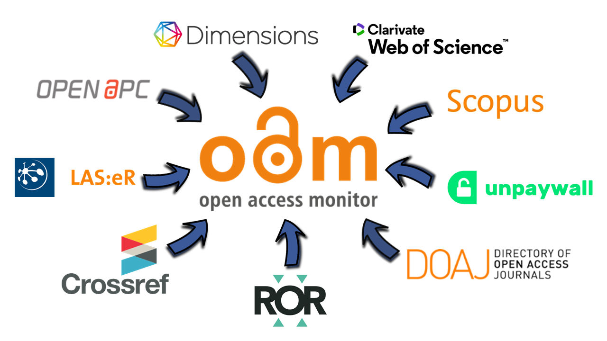

### Einleitung

Big Data ist in den vergangenen Jahren zu einem allgegenwärtigen Begriff
geworden und ist in vielen Wissenschaftsbereichen als Anwendung präsent.
Mit der Metapher, wonach Daten das neue Öl sind, wird Daten als neues
Treibmittel der digitalen Revolution eine ähnliche Rolle zugesprochen,
wie es einst das Öl für das Fortschreiten der Industrialisierung war
(Hirsch 2014). Öl ist die Grundlage vieler verarbeiteter Produkte wie
Kunststoffe, chemischer Verbindungen oder Antriebsmittel zur
Fortbewegung. Analog dazu kann Big Data in aufbereiteter Form ebenfalls
zu vielen Produkten verarbeitet werden wie Steuerungsoptimierungen,
Modellrechnungen oder Kundenprofilen (Manyika et al. 2011; Günther et
al. 2017). Der Vergleich lässt sich weiterführen mit der Überlegung,
dass die reine Existenz von Daten noch nicht ausreichend ist, sondern
dass diese stetig anwachsenden Datenmengen nutzbar gemacht werden müssen
(Nolin 2019; Couldry und Jun Yu 2018). So kommt Öl in der Erdkruste
nicht ubiquitär vor, sondern muss als erstes lokalisiert, anschließend
gefördert und schließlich durch Raffinationsprozesse aufbereitet werden.
Ähnlich verhält es sich mit Daten. Ohne ihren jeweiligen Kontext können
sie schnell an Bedeutung verlieren. Dementsprechend komplex kann das
Auffinden der gewünschten Datenmenge sein, wie es auch bei der Suche
nach Öl der Fall ist (Kharlamov et al. 2018; Hey et al. 2009).

Die Anzahl der in Publikationsdatenbanken nachgewiesenen
Veröffentlichungen steigt beständig und für Bibliotheken spielt die
Auswertung großer Datenmengen eine immer wichtigere Rolle. So werden
beispielsweise in der Datenbank Dimensions für das Jahr 2000 circa
90.000 Publikationen mit mindestens einer deutschen Affiliation
nachgewiesen, während es im Jahr 2020 bereits 236.000 sind. Der
Gesamtdatenbestand der Datenbank erreicht derzeit 126 Millionen
Publikationen.[^1] Im Gebiet der Informationsbereitstellung stellt sich
bei dieser großen Datenmenge für Nutzende zunächst das Problem der
Auffindbarkeit einzelner Informationen. Bei der Bereitstellung von
Publikationsdienstleistungen und auch bei der Unterstützung der
Open-Access-Transformation ist zudem die Schaffung einer Datengrundlage
vonnöten. Diese Datengrundlage muss zusammengetragen sowie auswertbar
gemacht werden und außerdem so aufbereitet sein, dass daraus
Informationen gewonnen werden können, die der Unterstützung des
Wissenschaftsmanagements dienen.

Zur Erhebung des Publikationsaufkommens wissenschaftlicher Einrichtungen
gibt es mehrere in Frage kommende Datenbanken wie Web of Science,
Scopus, Dimensions oder institutionelle Repositorien. Diese Datenbanken
nutzen nur zum Teil offene persistente Identifikatoren (PID) für
Organisationen. Zusätzlich kann keine der genannten kommerziellen
Datenbanken das Indexieren aller erschienen Veröffentlichungen
garantieren. Insbesondere wird in Web of Science und in Scopus durch
Kurationsprozesse eine Selektion der zu indexierenden Quellen
vorgenommen.

Deshalb bedarf es geeigneter Suchstrategien, um an die gewünschten Daten
zu gelangen. Hierfür werden optimalerweise mehrere Datenbestände mit
einbezogen, vorausgesetzt die entsprechenden Datenbanken sind
lizenziert. Nach dieser Förderung der Rohdaten ist häufig noch eine
händische Nacharbeit nötig, um die erhaltenen Daten zu vereinheitlichen
und Dubletten zu vermeiden. Dies könnte als der Raffinationsprozess der
Daten bezeichnet werden, auf welcher Grundlage im Anschluss die
erforderlichen Auswertungen vorgenommen werden können. Das Monitoring
des eigenen Publikationsoutputs stellt also einen beachtlichen Aufwand
für eine einzelne Einrichtung dar und ist mit vorhandenen Ressourcen
oftmals nicht zu leisten.

Ein Monitoring auf nationaler Ebene, wie es beispielsweise für nationale
Transformationsverträge oder für Evaluationen von Förderprogrammen
erforderlich ist, bedeutet sogar ein Vielfaches an Arbeit. Es existieren
mehrere Möglichkeiten, an die benötigten Daten zu gelangen. So können
zum einen die Daten von den einzelnen Einrichtungen erhoben und zentral
zusammengeführt werden. Voraussetzung hierfür wäre, dass die
entsprechenden Daten den einzelnen Einrichtungen vorliegen, was jedoch,
wie bereits beschrieben, häufig nicht in ausreichendem Maße der Fall
ist. Zudem muss bei einem solchen Verfahren ein Großteil der
Zusammenstellung und Auswertung in manueller Arbeit erledigt werden, was
zum einen große Ressourcen bindet und sich zum anderen nachteilig auf
die Reproduzierbarkeit auswirkt. Als wesentlich ökonomischere und
nachhaltigere Variante der Datenakquise können bereits existierende
Quellen im größtmöglichen Umfang nachgenutzt sowie dabei einheitliche
Definitionen und Algorithmen verwendet werden. Dieses Prinzip verfolgt
der Open Access Monitor (OAM), der so als Schnittstelle zur
Zusammenführung mehrerer Quellsysteme fungiert. Dadurch wird das
kontinuierliche Monitoring auf nationaler Ebene ermöglicht und bietet
damit die Grundlage zu faktenbasierten Entscheidungen und Handlungen.

### Die Struktur des OAM

Der OAM ist strukturell dreigeteilt in Backend, API und Frontend. Die
aufbereiteten Daten selbst liegen in einer Datenbank im Backend und
können über die API oder das Frontend abgefragt werden. Die folgenden
Abschnitte sollen einen kurzen Überblick über die jeweiligen
Bestandteile geben.

#### Backend

Im Backend läuft eine MongoDB-Instanz als Datenbankmanagementsystem,
welche alle benötigten Daten für den OAM bereitstellt. Bei einer MongoDB
handelt es sich um eine dokumentenorientierte NoSQL-Datenbank. Diese ist
auf große Datenmengen, wie bereits im vom englischen 'hu**mongo**us'
(gigantisch) abgeleiteten Namen enthalten, und auf konkurrierenden
Zugriff ausgelegt. Des Weiteren kann die Datenbank über mehrere Server
skaliert oder in mehrere Teile, sogenannte Collections, zerlegt werden.
Auf diese Weise können Abfragen parallel ausgeführt und die
Verfügbarkeit erhöht werden (Bradshaw et al. 2019).

Zur Übersichtlichkeit sind die Daten je nach Art auf verschiedene
Collections aufgeteilt, diese sind in Tabelle 1 aufgelistet.[^2] Die
Daten des OAM sind nicht wie bei SQL-orientierten Datenbanken als
Tabellen mit Relationen gespeichert, sondern werden als JSON-Dokumente
abgelegt. Dabei muss kein festgelegtes Schema für die Daten eingehalten
werden und somit existieren auch keine Pflichtfelder. Diese Dokumente
können beliebig tief verschachtelt werden, die Normalformen einer
relationalen Datenbank finden keine Anwendung. Die dabei auftretenden
Redundanzen werden bewusst in Kauf genommen, um eine schnellere
Abfragezeit zu erzielen. Die Abfrage-Performance kann durch eine
Indexierung weiter erhöht werden, da somit nicht mehr alle Dokumente,
sondern nur noch die Indizes durchsucht werden müssen (Bradshaw et al.
2019).


| **Collection**    | **Beschreibung**                                           |
|-------------------|------------------------------------------------------------|
| Publications      | Publikationsdaten inkl. Zitationszahlen                    |
| PublicationCosts  | Publikationskosten                                         |
| Journals          | Alle Zeitschriften des OAM                                 |
| Publishers        | Alle Verlage des OAM                                       |
| Organisations     | Alle Einrichtungen des OAM                                 |
| Statistics        | Statistische Zahlen zu den Daten (zuletzt aktualisiert, …) |
| SubscriptionCosts | Zukünftig: Aggregierte Subskriptionskosten                 |
Table: Tab. 1: Übersicht über die Collections

Die Daten können über die umfangreiche Abfragesprache der MongoDB
abgerufen oder auch aggregiert werden. Da die Datenbank allerdings nicht
über das Internet erreichbar ist, bildet die API eine Schnittstelle, um
Abfragen an die Datenbank zu stellen.

#### API

Der OAM besitzt als technische Schnittstelle eine REST-API
(Representational State Transfer),[^3] welche auf HTTP-basierten
Standards beruht und mit deren Hilfe die Daten des OAM abgefragt werden
können. Analog zur MongoDB nutzt auch die API JSON-Dokumente zur
Kommunikation; eine Übersicht der wichtigsten Endpunkte zeigt Tabelle
2.[^4]


| **Endpunkt**                     | **Beschreibung**                                                                                  |
|----------------------------------|---------------------------------------------------------------------------------------------------|
| `/Data`                          | Abfrage der verfügbaren Datenbanken.                                                              |
| `/Data/{database}`               | Collections einer Datenbank abfragen.                                                             |
| `/Data/{database}?query={query}` | Abfrage in einer Datenbank ausführen. Die Abfrage muss als MongoDB Command[^5] formuliert werden. |
Table: Tab. 2: Die wichtigsten API Endpunkte

#### Frontend

Um die Daten des OAM einem breiten Kreis von Nutzenden zugänglich zu
machen, gibt es ein Frontend. Dieses ist mittels der
Open-Source-Entwicklungsplattform ASP.NET[^6] umgesetzt, wobei
Blazor[^7] als Framework dient.

Um die große Datenmenge möglichst übersichtlich zu präsentieren, ist die
Website in mehrere Unterkategorien aufgeteilt. Über die Auswahl auf der
linken Seite können die Bereiche der Publikationsanalyse, der
Kostenanalyse, der Zitationsanalyse und der Dokumentation aufgerufen
werden. Die letzten Menüpunkte in der Navigationsleiste verweisen zur
Dokumentation und bieten Links auf die Wiki-Seiten, wo zusätzliche
Informationen zu den Quelldatenbanken, zur API oder als FAQ gefunden
werden können.

Die Aufteilung in die drei Auswertungsschwerpunkte Publikations-,
Kosten- und Zitationsanalyse dient dazu, die verschiedenen Datenbereiche
voneinander getrennt zur Verfügung zu stellen. Wird bei
Publikationsanalyse der Menüpunkt Publikationen ausgewählt, erhält man
eine Seite mit vielen Filtermöglichkeiten, wie in Abbildung 1
dargestellt.


Diese Filter ermöglichen es den Nutzenden, diejenigen Daten zu
selektieren, welche für ihre Fragestellungen relevant sind und die
restlichen Daten ausblenden zu können. Dafür gibt es Filter für die
Umstellung der Datenquelle, die Auswahl des Landes und für Web of
Science sowie Scopus die Limitierung auf Publikationen mit
'Corresponding Author'. Ferner ist eine Selektion nach Bundesland,
Einrichtungen, Verlagen, Zeitschriften und Open Access (OA)-Modellen
möglich, wobei die Namensangaben jeweils normiert sind. Die
Auswahlmöglichkeit für OA-Kategorien erstreckt sich über die Ebene der
Verlage, von Zeitschriften und schließlich auf die Artikelebene.[^8]
Zusätzlich können über den Filter "Transformationsverträge" die Artikel
aus den Zeitschriften einzelner Transformationsverträge angezeigt
werden, die in Deutschland auf nationaler Ebene bestehen. Eine weitere
Einschränkung ist über das Veröffentlichungsdatum möglich, welches auch
unterjährige Auswertungen unterstützt.

Mit all diesen Filtern ist es möglich, die Treffermenge der gefundenen
Artikel einzuschränken. Die Anzeige der ausgewählten Datenbankeinträge
kann über die Gruppierungsoptionen weiter an die individuellen
Bedürfnisse angepasst werden. So ist eine Gruppierung nach Einrichtung,
Bundesland, Verlag, Zeitschrift, Jahr und OA-Kategorie sowie die
nicht-gruppierte Ansicht der Artikel inklusive DOI (digital object
identifier) auswählbar.

Um die Zugänglichkeit zum Suchergebnis weiter zu erhöhen, gibt es neben
der tabellarischen Auflistung zusätzlich die grafische Darstellung als
Balken-, Linien- oder Kreisdiagramm. Diese Graphen können als
PNG-Bilddateien heruntergeladen werden; ebenso stehen die Daten aus der
jeweils darüber abgebildeten Tabelle als CSV-Datei zur Verfügung.

### Die Daten des OAM

Im Folgenden wird der Workflow von den gesammelten Rohdaten zur
einheitlichen Datenbasis beschrieben. Dazu werden zunächst die
verwendeten Quellsysteme des OAM vorgestellt. Um daraus einen homogenen
Datenbestand zu erhalten, sind Normierungsprozesse notwendig. Diese
werden im Anschluss exemplarisch gezeigt, wobei ein besonderer
Schwerpunkt auf die Einrichtungsnormierung gelegt wird. Die so
erhaltenen homogenen Daten können anschließend als aufbereiteter
Gesamtdatenbestand zusammengefügt und die OA-Kategorien vergeben werden.

Grundsätzlich ist anzumerken, dass im OAM ausschließlich Publikationen
verzeichnet werden, für die ein DOI bei Crossref registriert wurde;
entsprechend werden Publikationen ohne DOI ebenso wenig berücksichtigt
wie Publikationen, für die DOIs bei anderen Agenturen registriert
wurden. Das Vorliegen von DOIs ist essentiell für die Deduplizierung und
die Identifikation des OA-Status.

#### Quellsysteme

Die für den OAM verwendeten Quellsysteme sind in Abbildung 2 dargestellt
und werden hier im Folgenden eingehender besprochen. Der Datenbestand
von Unpaywall[^9] ist Ausgangsbasis und primäre Datenquelle des OAM. Von
dort kommen Publikationsmetadaten wie DOI, Zeitschriftentitel und Verlag
der jeweiligen Publikationen. Für die Zuordnung der OA-Kategorien wird
ebenfalls Unpaywall verwendet sowie das Directory of Open Access
Journals (DOAJ)[^10] für die OA-Kategorie von Zeitschriften. Unpaywall
ist eine Datenbank mit über 30 Millionen wissenschaftlichen OA-Artikeln,
wobei diese ebenfalls aus weiteren Datenbanken wie Crossref und PubMed
gespeist wird. Zusätzlich wird der Inhalt von über 50.000
OA-Repositorien direkt eingesammelt. Der gesamte Datenbestand von
Unpaywall weist über 120 Millionen Datensätze nach.[^11] Zentral für die
Nutzung ist die Vergabe eines DOI für einzelnen Artikel (Dhakal 2019).

Das DOAJ registriert über 17.000 reine OA-Zeitschriften, Hybrid-Modelle
sind davon ausgenommen. 2014 wurden die Qualitätskriterien angepasst, um
bei sich ändernden Rahmenbedingungen weiterhin das DOAJ als eine Art
Positivliste aufrechtzuerhalten und "questionable publishers" (Olijhoek
et al. 2015) nicht zu indexieren.



Für die Zeitschriftennormierung wird Crossref[^12] verwendet: Crossref
bietet die Verlinkung zwischen zitierender und zitierter Publikation
über Verlagsgrenzen hinweg mittels PIDs an (Hendricks et al. 2020).
Ferner bietet Crossref eine Titelliste über alle dort registrierten
Zeitschriften an (Clark 2020), welche vom OAM zur Normierung nachgenutzt
wird. Eine ausführlichere Beschreibung findet sich nachfolgend im
Abschnitt Zeitschriftennormierung.

Weiterhin werden die Publikationsdaten des OAM durch folgende drei
Datenquellen angereichert: Dimensions, Web of Science (WoS) und
Scopus.[^13] Diese drei Datenbanken liefern als ganz wesentliches
Element des OAM die Zuordnung der Publikationen zu den Einrichtungen
über die Autorenaffiliationen und außerdem Zitationsnachweise.
Dimensions weist eine frei zugängliche Version auf, welche weniger
Funktionen als der kostenpflichtige Zugang enthält. Dimensions indexiert
Publikationen mit Crossref-DOIs. Es wird also weniger selektiert als bei
den Konkurrenzprodukten, wodurch eine höhere Abdeckungsrate an Einträgen
gegeben ist (Schonfeld 2018). Im Gegensatz dazu verwendet das WoS einen
Kurationsprozess, wodurch lediglich eine Auswahl von Zeitschriften in
der Zitationsdatenbank indexiert ist. Bei Scopus gibt es ebenfalls einen
Auswahlprozess, jedoch befindet sich die daraus resultierende
Abdeckungsrate zwischen den anderen beiden vorgestellten Datenbanken.
Für die Zwecke des OAM weisen WoS und Scopus den Vorteil des Nachweises
der sogenannten Reprint Authors beziehungsweise Corresponding Authors
auf, wobei in Scopus mehr Titel aus dem deutschsprachigen Raum enthalten
sind (Singh et al. 2021). Die Anbindung aller drei Datenbanken an den
OAM bietet den Einrichtungen die maximale Datenkonsistenz zu ihrer
präferierten Datenquelle, so dass sich Uneinheitlichkeiten für die
Nutzenden reduzieren.

Für Gold- und Hybrid-Open-Access-Publikationen entstehen für
publizierende Einrichtungen beziehungsweise ihren Autor\*innen Kosten,
welche im Rahmen eines Open-Access-Monitorings berücksichtigt werden
müssen. Dafür werden die Daten von OpenAPC[^14] nachgenutzt, die von den
Einrichtungen dort gemeldet und mit Daten von Crossref, PubMed und DOAJ
ergänzt werden. Damit ist der Datenbestand zum einen abhängig von den
Beiträgen der jeweiligen Einrichtungen und zum anderen von der Qualität
sowie der Vollständigkeit der gemeldeten Daten.

Subskriptionskosten für Zeitschriftenlizenzen werden über LAS:eR[^15]
bezogen. Bei LAS:eR handelt es sich um ein Electronic Resource
Management System (ERMS), mit dem konsortiale und lokale Lizenzen und
Kosteninformationen in einem System verwaltet werden können.
Einrichtungen, die das System zur Erfassung Ihrer Lizenzkosten nutzen,
können durch eine Zustimmung zur Datenweitergabe diese Informationen
automatisiert an den OAM abliefern lassen. Da in den Verträgen mit den
Verlagen in der Regel Geheimhaltungsklauseln enthalten sind (Doenges
2017), können Kostenangaben nur in aggregierter Form öffentlich
verfügbar gemacht werden. Um einzelnen Institutionen dennoch die
Möglichkeit zu bieten, ihre gesamten Kosten mittels des OAM auswerten zu
können, ist ein abgestuftes Rechtemanagement für den Zugriff nötig.
Hierfür wird ein Authentifizierungsverfahren umgesetzt, sodass der
Einblick in Subskriptionskosten auf Einrichtungsebene nur der jeweiligen
Einrichtung zur Verfügung steht. Der OAM ist abhängig von der Nutzung
des Systems durch die Einrichtungen, der Zustimmung der Datenlieferung
an den OAM sowie der Qualität der dort eingegebenen Daten. Um
unabhängiger von der Verwendung eines bestimmten ERMS zu werden und
weitere Einrichtungen mit dem Angebot eines Monitorings der
Subskriptionskosten zu erreichen, ist die zusätzliche Anbindung von
Bibliothekssystemen wie FOLIO[^16] und Alma[^17] geplant.

#### Normierungsprozesse

Aufgrund der Zusammenführung vieler verschiedener Quellsysteme im
Backend des OAM bedarf es einer Vereinheitlichung der Begriffe:
Zeitschriftentitel, Verlagsnamen und Einrichtungsbezeichnungen müssen
normiert werden, damit die Einträge aus den jeweiligen Quellsystemen den
entsprechenden Datensätzen zugeordnet werden können. Nur so können
vollständige Datenbestände realisiert und Dubletten mit Namensvarianten
ausgeschlossen werden.

##### Zeitschriftennormierung

In den jeweiligen Datenbanken liegen die Zeitschriftentitel nicht immer
in gleicher Schreibweise beziehungsweise mit gleichen Identifikatoren
vor. Daher wird eine Normliste benötigt, auf welche gegebenenfalls
abweichende Schreibweisen der Zeitschriftentitel gemappt werden können.
Um diese nicht neu manuell anlegen zu müssen, sollte eine bereits
existierende Auflistung nachgenutzt werden. Dafür wird die Titelliste
von Crossref verwendet, da in dieser alle in Crossref registrierten
Zeitschriften hinterlegt sind (Clark 2020). Dadurch kommt diese
Zeitschriftenliste relativ nahe an den Idealzustand einer vollständigen
Liste heran und ist zusätzlich gut für die automatische
Weiterverarbeitung geeignet.

Für den Abgleich mit den vom Quellsystem gelieferten Titelansetzungen
wird zunächst per ISSN in der Titelliste gesucht, wobei nur eine der
ISSNs übereinstimmen muss. Dementsprechend könnten mehrere mögliche
Kandidaten in der Titelliste gefunden werden. Je nach Treffermenge wird
wie in Tabelle 3 beschrieben vorgegangen:


| **Trefferanzahl**                        | **Vorgehen**                                      |
|------------------------------------------|---------------------------------------------------|
| Genau ein Treffer                        | Auswahl des eindeutigen Treffers                  |
| Mehr als ein Treffer                     | Sortierung und Auswahl nach folgenden Kriterien:  |
|                                          | Übereinstimmung der ISSN-L                        |
|                                          | Übereinstimmung einer ISSN                        |
|                                          | Übereinstimmung einer zusätzlichen ISSN[^18]      |
|                                          | Ähnlichkeit des Titels                            |
| Kein Treffer                             | Exakte Titelsuche                                 |
Table: Tab. 3: Abgleich der Zeitschriftentitel mit der Zeitschriftentitelliste

Sind die Zeitschriftentitel normiert, werden diese direkt mit mehreren
Informationen angereichert. Durch diese zusätzlichen Informationen wird
beispielsweise der im Frontend implementierte Filter nach Mirror
Journals ermöglicht, um diese Zeitschriften selektieren oder auch
ausschließen zu können. Dafür gibt es jeweils eine statische
Zeitschriftenliste für Mirror Journals sowie eine für die bei
DFG-Förderanträgen zu berücksichtigenden Zeitschriften. Letztere besteht
aus den Zeitschriften aus dem DOAJ, ergänzt um die
ISSN-Gold-OA-Zeitschriftenliste aus Bielefeld (Bruns et al. 2022), und
um Mirror-Journals bereinigt. Zeitschriften, welche in einer dieser
Listen vorkommen, wird automatisch die OA-Kategorie "Gold" zugewiesen,
da von vornherein nur OA-Zeitschriften in diese Listen aufgenommen
werden.

Darüber hinaus gibt es für jeden Transformationsvertrag eine eigene
Liste mit den im Vertrag enthaltenen hybriden Zeitschriften, für die
innerhalb des Vertrags Publikationsrechte bestehen. Alle Listen werden
vom Team des OAM gepflegt und sind öffentlich zugänglich.[^19]

##### Verlagsnormierung

Als Normliste für die Verlage werden im ersten Schritt die von Unpaywall
gelieferten Angaben übernommen. Im zweiten Schritt werden mit Hilfe
einer intern gepflegten Liste verschiedenen Schreibweisen eines Verlags
auf eine gemeinsame Hauptschreibweise zusammengeführt.

Dabei werden nicht nur unterschiedliche Schreibweisen wie "Elsevier
B.V." oder "Elsevier Pub. Co." zu "Elsevier" vereinheitlicht, sondern
auch Imprints den übergeordneten Verlagen zugeordnet wie beispielsweise
"Island Press" zu "Springer Nature".

##### Einrichtungsnormierung

Die Normierung der Einrichtungen erfolgte bisher über ihre GRID-ID. Die
Global Research Identifier Database[^20] (GRID) stattet
Forschungsinstitutionen weltweit mit PIDs aus, der GRID-ID. Ausgehend
von diesem Datenbestand hat sich die community-basierte Research
Organization Registry[^21] (ROR) entwickelt (ROR Leadership Team 2021),
welche seit Ende 2021 anstelle von GRID für Einrichtungen im OAM
verwendet wird. Für die Normierungsarbeit im OAM wird allerdings im
Hintergrund derzeit noch GRID mitsamt der bereitgestellten
Rechercheoberfläche genutzt, da in der ROR-Oberfläche Beziehungen
zwischen Organisationen noch nicht abgebildet werden.

Einrichtungsnamen werden in den verwendeten Publikations- und
Zitationsdatenbanken zwar normiert, es liegen jedoch unterschiedliche
Mechanismen zu Grunde. So wird in Dimensions den Einrichtungen ihre
GRID-ID zugeordnet, welche leicht in die ROR-ID überführt werden kann.
Dementsprechend kann diese Normierung ohne größere manuelle Arbeiten
übernommen werden.

In WoS und Scopus werden die Einrichtungen jedoch nicht auf einen
offenen PID normiert. Vor allem aber werden die Beziehungen und
Abhängigkeiten jeweils unterschiedlich dargestellt. Beispielsweise
werden in diesen Datenbanken die Universitätskliniken in der Regel den
Universitäten zugeordnet, für die Auswertungszwecke des OAM ist jedoch
eine getrennte Behandlung erwünscht. Um eine eindeutige Zuordnung aller
Datensätze gewährleisten zu können, müssen daher die Daten von Scopus
und WoS mit PIDs angereichert werden. Dort, wo die an den OAM
gelieferten Einrichtungsnormierungen der Datenbanken aus den eben
genannten Gründen nicht direkt auf GRID-IDs gemappt werden können,
werden die Rohformen der Affiliationsangaben der Autor\*innen für die
Zuordnung verwendet. Das Ergebnis dieses Verfahrens ermöglicht den
nahtlosen Wechsel der Datenquellenauswahl in der Oberfläche des OAM. Im
Folgenden wird das Vorgehen am Beispiel einer Universitätsklinik
erläutert.

Das "Universitätsklinikum Würzburg" mit der GRID-ID grid.411760.5[^22]
ist in den Scopus-Daten unter folgenden Namen vertreten:

* Universitätsklinik Würzburg
* University Clinic Würzburg
* Universitaetsklinik Wuerzburg
* Chirurgische Universitätsklinik Würzburg
* Med. Universitatsklinik Wurzburg

Insgesamt 129 Treffer werden allein in den Scopus-Daten der deutschen
Einrichtungen mit folgender SQL-SELECT-Abfrage nach "Universitätsklinik
Würzburg" gefunden (Abbildung 3):


Im Anschluss kann diesen 129 Treffern der SELECT-Abfrage die GRID-ID
grid.8379.5 zugeordnet werden. Diese SELECT-Abfrage ist komplex, da
einerseits eine gewisse Unschärfe, beispielsweise durch Trunkierung der
Suchbegriffe, gegeben sein muss, um möglichst viele Schreibweisen
abzudecken. Andererseits muss sie hinreichend selektiv sein, damit
Einrichtungen mit einem ähnlichen Namen nicht zusätzlich gefunden
werden. Im obigen Beispiel wären dies Einrichtungen aus Wuppertal sowie
die dem Universitätsklinikums Würzburg (Parent-Institute)
untergeordneten Einrichtungen (Child-Institutes), wie zum Beispiel die
Universitäts-Kinderklinik Würzburg, welche jeweils eine eigene GRID-ID
aufweisen (siehe Abbildung 4).


Um falsche Zuordnungen sowie fehlende Einträge zu vermeiden, werden die
vergebenen IDs intellektuell geprüft. Dabei hat sich ein mehrstufiges
Vorgehen etabliert: Zu Beginn sind die SQL-Abfragen eher weit gefasst.
Anhand des Suchergebnisses werden weitere Filter zur SELECT-Anweisung
ergänzt, um ein präziseres Ergebnis zu erzielen. Je genauer (precision)
die "Trefferquote" (recall) und geringer der "Ausfall" (fallout) ist,
desto weniger aufwändig ist die intellektuelle Durchsicht (Buckland und
Gey 1994). Im Beispiel der SELECT-Abfrage nach "Uniklinik Würzburg"
kommt es trotz präziser Formulierung zu einem Treffer wie "Competence
Centre for University Teaching in Medicine Baden-Wuerttemberg". Ein
solcher "Ausfall" lässt sich nicht ganz vermeiden und der entsprechende
Eintrag muss bei einer intellektuellen Prüfung selbstverständlich eine
andere ID erhalten als die der Uniklinik Würzburg. Teilweise ist die
korrekte Zuordnung der GRID-ID eine anspruchsvolle Aufgabe, da zum einen
die Affiliationsangaben oft nicht eindeutig sind und andererseits die
klare Trennung der Einrichtungen insbesondere bei Kliniken zusätzlicher
Recherche bedarf. Aus der Trefferliste mit den 129 Bezeichnungen des
Universitätsklinikums Würzburg werden 129 SQL-UPDATE-Befehle erzeugt,
wie zum Beispiel folgender:

```
UPDATE scopus_organisations SET sc_grid = ' grid.8379.5 ' WHERE
sc_organisation =.'Universitätsklinik Würzburg'
```

Zur Erzeugung des UPDATE-Befehls wird die Ergebnistabelle der
SQL-SELECT-Abfrage in eine Excel-Tabelle kopiert und mittels
"Verketten"-Funktion die GRID-ID und die Spalte mit den verschiedenen
Bezeichnungen zu einem UPDATE Befehl verknüpft. Anschließend werden die
Befehle im SQL Management Studio ausgeführt. Somit sind die GRID-IDs der
Einrichtungen in den Scopus-Datensätzen zugeordnet. Für das Mapping der
WoS-Einrichtungsnamen wird ein analoges Verfahren eingesetzt.

Ist dieser Prozess für alle Einrichtungen abgeschlossen, kann die
normierte Einrichtungstabelle durch ein Importverfahren in den OAM
überführt werden. Da WoS und Scopus zwei eigenständige Datenbanken mit
eigenen Rohdaten sind, muss dieses Verfahren für jede Datenquelle
einzeln erfolgen. Dementsprechend sind für die Einrichtungsnormierung
zwei Tabellen im OAM hinterlegt.

Für eine bessere Durchsuchbarkeit und Auswählbarkeit der Einrichtungen
im Einrichtungsfilter des OAM sind diese in Kategorien eingeteilt. Die
Kategorien von ROR sind für die Zwecke des OAM zu unscharf, sodass eine
interne Zuordnungsliste gepflegt wird, welche jeder Einrichtung eine
Kategorie zuordnet (siehe Tabelle 4).

| **Einrichtungskategorie**|
|--------------------------|
| Universitäten            |
| Universitätskliniken     |
| Fachhochschulen          |
| Fraunhofer-Gesellschaft  |
| Helmholtz-Gemeinschaft   |
| Max-Planck-Gesellschaft  |
| Leibniz-Gemeinschaft     |
| Einrichtungen des Bundes |
| Einrichtungen der Länder |
| Sonstige                 |
Table: Tab. 4: Einrichtungskategorien des OAM


#### Zusammenführung der Quellsysteme

Zur Generierung einer gemeinsamen Datenbasis aus allen genannten
Quellsystemen wird Unpaywall als primäre Quelle verwendet. Dabei werden
über den wöchentlichen Datenfeed für alle Publikationen mit dem
Dokumenttyp "journal article" folgende Daten erfasst: DOI, Zeitschrift,
Verlag, Veröffentlichungsdatum und OA-Modell. Eine Übersicht der
genutzten Quellsysteme und den daraus verwendeten Daten befindet sich in
Abbildung 5.


Weitere Daten werden über den DOI aus Dimensions, Web of Science und
Scopus wöchentlich per Datenfeed importiert, dabei werden für jeden
Artikel die involvierten Einrichtungen, die jeweilige ID der Datenbank
und die Zitationszahlen zu den bereits vorhandenen Artikeldaten
hinzugefügt. Für WoS und Scopus wird zudem die Information des
Corresponding Authors ergänzt. Um eine möglichst genaue Zuordnung zu
realisieren, werden die affiliierten Einrichtungen mittels der ROR-ID
zugeordnet. Ein weiterer Abgleich findet über die ISSNs der
Zeitschriften mit der Zeitschriftentitelliste von Crossref statt.

Bis hierhin sind lediglich Informationen über den Publikationsoutput der
einzelnen Einrichtungen deutschlandweit, ohne Nachweise über Kosten,
verfügbar. Um die Publikationskosten zu erfassen, ist im Backend des OAM
eine weitere Collection angelegt. Dafür werden Daten aus OpenAPC für die
einzelnen Artikel verwendet, wie der Artikel-DOI, Publikationsjahr und
die bezahlende Einrichtung, welche ebenfalls auf die ROR-ID gemappt
wird. Ferner werden die Kosten erfasst, wobei zwischen APCs und
Hybrid-Artikeln differenziert wird. Dieser Datenbestand wird mit
weiteren Daten aus Unpaywall angereichert, wobei die Zuordnung per DOI
geschieht. Hier werden Verlag, Veröffentlichungsdatum, Zeitschrift und
die OA Farbe der Zeitschrift erfasst.

Damit sind zwar die Kosten für OA-Publikationen ebenfalls in der
Datenbank enthalten, aber es fehlen noch die Subskriptionskosten. Im
Produktivsystem sind diese noch nicht implementiert, jedoch ist die
Einbindung von LAS:eR im Testsystem bereits umgesetzt. Außerdem wird ein
Authentifizierungsmechanismus eingerichtet, um der jeweiligen
Einrichtung ihre Daten ohne Einsichtnahme von Dritten und langfristig
ein individuelles OA-Barometer zur Verfügung zu stellen.

Bei großen Datenmengen ist es nicht möglich, sämtliche Fehlerquellen
vermeiden zu können. Allerdings kann durch ein gutes System sowie durch
Korrekturschleifen die Datenqualität verbessert werden. Nähere
Informationen hierzu sind im Wiki des OAM hinterlegt.[^23]

#### Zuordnung der OA-Kategorien

Für die OA Zuordnung einzelner Publikationen werden verschiedene Felder
von Unpaywall ausgewertet. Dieser Datensatz beinhaltet nicht nur
allgemeine Daten zum OA-Status der Publikation respektive der
zugehörigen Zeitschrift, sondern listet darüber hinaus alle Orte auf, an
denen eine freie Version der Publikation gefunden werden konnte (OA
Location).[^24] Mit Hilfe dieser Daten kann eine detaillierte
OA-Zuordnung durchgeführt werden. Dazu werden die in Tabelle 5
dargestellten Prüfmechanismen in der abgebildeten Reihenfolge für jede
OA Location abgearbeitet. Sobald eine Bedingung erfüllt ist, wird die OA
Location mit der jeweiligen OA-Kategorie markiert und die Prüfung für
die nächste OA Location fortgeführt. Schließlich wird die "beste"
vergebene OA-Kategorie für die Publikation erfasst.


| **Definition**      | **Bedingungen**                                                                                                                                              |
|-----------------|----------------------------------------------------------------------------------------------------------------------------------------------------------|
| Diamond         | Gold-Veröffentlichung ohne APCs                                                                                                                          | Gold-OA ohne APC                                                                            |
| Gold            | Veröffentlicht in einer Open-Access-Zeitschrift, die im DOAJ indexiert ist.                                                                              | Es handelt sich um ein OA Journal                                                           |
| Hybrid          | Frei unter einer offenen Lizenz in einer Subskriptions-Zeitschrift veröffentlicht.                                                                       | Host ist ein Verlag und der Artikel besitzt eine CC-Lizenz                                  |
| Green published | Kostenpflichtiger Zugang auf der Verlagsseite, aber es gibt eine freie Kopie der veröffentlichten Verlagsversion in einem Open-Access-Repositorium.      | Host ist ein Repositorium und es handelt sich um die veröffentlichte Verlagsversion         |
| Green accepted  | Kostenpflichtiger Zugang auf der Verlagsseite, aber es gibt eine freie Kopie des akzeptierten Manuskripts in einem Open-Access-Repositorium (Postprint). | Host ist ein Repositorium und es handelt sich um die akzeptierte Version                    |
| Green submitted | Kostenpflichtiger Zugang auf der Verlagsseite, aber es gibt eine freie Kopie des eingereichten Artikels in einem Open-Access-Repositorium (Preprint).    | Host ist ein Repositorium und es handelt sich um die eingereichte Version                   |
| Green undefined | Version kann nicht bestimmt werden; wird im OAM wie Green submitted behandelt                                                                            | Host ist ein Repositorium                                                                   |
| Bronze          | Frei zu lesen auf der Verlagsseite, aber ohne klar erkennbare Lizenz.                                                                                    | Host ist ein Verlag und der Artikel besitzt keine CC-Lizenz, aber ist momentan ohne Paywall |
| Closed          | Alle anderen Artikel. (Nicht frei zugänglich.)                                                                                                           | Ansonsten                                                                                   |
Table: Tab. 5: Definitionen der Open-Access-Kategorien sowie die intern hinterlegten Bedingungen für die Zuordnung

Die OA-Zuordnung für Zeitschriften erfolgt über einen ISSN-Abgleich mit
den Daten des DOAJ, um das Publikationsmodell der Zeitschriften zu
bestimmen. Dabei wird, analog zur Tabelle 5, zwischen Diamond, Gold und
Closed beziehungsweise Hybrid OA unterschieden. Zusätzlich können auch
intern gepflegte Listen Einfluss auf die OA-Zuordnung der Zeitschriften
nehmen.[^25]

Bei den Verlagen wird nur zwischen Gold und Closed beziehungsweise
Hybrid OA differenziert. Dazu wird eine intern hinterlegte, manuell
generierte Liste genutzt und bei einer Übereinstimmung kann der Verlag
als reiner OA-Verlag markiert werden. Während Verlage mit dem
Publikationsmodell Gold ausschließlich Gold-OA-Zeitschriften
publizieren, können Verlage mit dem Modell "Closed/Hybrid" sowohl Gold-,
Hybrid-, als auch reine Subskriptionszeitschriften herausgeben.

### Zusammenfassung und Ausblick

Die Auswahl, Anbindung und Zusammenführung einer Vielzahl von
Datenquellen stellt sich als hoch komplexer Vorgang dar, der vor allem
durch die Heterogenität der Daten erschwert wird. Neben der Frage der
Verfügbarkeit und Nachhaltigkeit der Quellsysteme bildet das Thema der
Metadatenqualität eine dauerhafte Herausforderung. An vielen Stellen,
beispielsweise bei der Normierung von Verlagsnamen oder bei der
Kuratierung von Zeitschriftenlisten, können Automatismen nur teilweise
greifen und es muss dauerhaft manuell überwacht und nachgebessert
werden.

Die Verwendung der kommerziellen Datenbanken Dimensions, Web of Science
und Scopus als Quellen hat den Nachteil, dass sie von fortlaufenden
Vereinbarungen und Diensten abhängig ist. Die beiden letztgenannten
haben zudem eine Einschränkung durch ihre Methode der Vorauswahl bei der
Indexierung von Quellen und ihre Bevorzugung englischsprachiger
Literatur. Sie besitzen jedoch den Vorteil, als qualitätsgeprüft zu
gelten und weitgehend als Referenz anerkannt zu sein. Durch die Angabe
von IDs der Quellsysteme bietet der OAM bei allen Datensätzen eine
Verlinkung zur Ursprungsdatenbank. So können weitere Metadaten, die der
OAM nicht auswertet, abgerufen werden. Bei Web of Science und Scopus
steht dabei die Schranke der Lizenz vor der vollständigen Nachnutzung,
jedoch sind diese beiden Datenbanken die einzigen bekannten Quellen, die
Corresponding-Author-Informationen in ausreichendem Umfang liefern.
Diese Information ist essentiell, da damit für die wissenschaftlichen
Einrichtungen potentiell kostenpflichtige Publikationen identifiziert
werden können, was wiederum für verlässliche Prognosen zur Budgetplanung
unerlässlich ist.

Unter Berücksichtigung aller Vor- und Nachteile der bereits integrierten
Quellsysteme wird weiterhin nach möglichen Alternativen beziehungsweise
Ergänzungen in Form von vorzugsweise offenen Datenquellen Ausschau
gehalten und die Möglichkeiten zur Integration ihrer Daten geprüft. Mit
der Ankündigung von OurResearch, einen Nachfolger für den Ende 2021
eingestellten Dienst Microsoft Academic Graph aufzubauen[^26], ist mit
OpenAlex ([https://openalex.org/](https://openalex.org/))
eine Alternative als nicht-kommerzielle Datenbank ins Blickfeld geraten.

Für eine technische Implementierung als Quellsystem des OAM sind bei
OpenAlex durch Verwendung von ROR grundsätzlich gute Voraussetzungen
gegeben. Dies macht die Daten kompatibel zur Institutionenkodierung des
OAM. Als Nachteil für die Zwecke des OAM stellen sich die fehlenden
Corresponding-Author-Informationen dar.

Durch den Ansatz von OpenAlex, neben den Daten von Unpaywall, Crossref,
Pubmed et cetera auch Daten von Repositorien zu harvesten, muss zudem
die Frage der Deduplizierung von Publikationen untersucht werden. Für
die Zwecke der Auswertungen, welche mit dem OAM erstellt werden können,
ist die möglichst korrekte und duplikatfreie Bildung von Aggregationen
erforderlich. Bei Publikationen, zu denen ein DOI vorliegt, wird jedoch
eine Deduplizierung weitgehend möglich sein, was aber umgekehrt
bedeutet, dass das bekannte Problem der Unterrepräsentation mancher
Publikationsformen fortbesteht.

Eine umfassende Untersuchung von OpenAlex samt einem Vergleich mit
anderen Systemen liegt angesichts der erst kürzlich erfolgten
Freischaltung bisher noch nicht vor. Allerdings stellen sich nach ersten
Einblicken in die noch nicht offiziell freigegebene Weboberfläche noch
einige Fragen. So scheint es zum Beispiel bei den Datensätzen zu
Autor\*innen keine Mehrfachaffiliationen zu geben und auch die
Disambiguierung scheint noch nicht abgeschlossen zu sein. Beispielsweise
finden sich in der Datenbank noch zahlreiche Mehrfacheinträge für
Autor\*innen sowie in Einzelfällen falsche Zuordnungen. Nach
Selbstauskunft der Betreiber\*innen sind noch Datenbereinigungen
notwendig.[^27]

Insgesamt zeigt OpenAlex jedoch einen zukunftsweisenden Ansatz und eine
Anbindung als weitere Quelldatenbank für den OAM wird mittelfristig
geplant. Das Geschäftsmodell soll zukünftig ähnlich wie bei den anderen
OurResearch-Diensten Unpaywall und Unsub auf einem Freemium-Modell
basieren, was sich laut eigener Aussage von OurResearch bisher als
stabil erwiesen hat. Die Nutzung freier Datenquellen erlangt mit der
dadurch ermöglichten Ablösung der Abhängigkeit von kommerziellen
Systemen sowie durch die komplett offene Nachnutzbarkeit immer größere
Bedeutung. Allerdings stellt sich gleichzeitig die Frage der
Nachhaltigkeit beziehungsweise dauerhaften Verfügbarkeit freier Quellen.
Nur wenn diese unterstützt und genutzt werden, bleiben sie erhalten.
Letztendlich ist es aber auch notwendig, die eigenen Systeme technisch
und organisatorisch so zu gestalten, dass bei Bedarf ein Wechsel von
Quellsystemen beziehungsweise der parallele Einsatz möglich ist.

### Danksagung

Der Open Access Monitor wird durch das Bundesministerium für Bildung und
Forschung (BMBF) mit dem Förderkennzeichen 16OAMO001 gefördert. Die
Nutzung der Web of Science-Daten wird ermöglicht durch die
Projektteilnahme am Kompetenznetzwerk Bibliometrie; gefördert durch das
Bundesministerium für Bildung und Forschung (Förderkennzeichen:
16WIK2101A).

### Literaturverzeichnis

Barbers, Irene; Kalinna, Nadja; Mittermaier, Bernhard (2018): Data-Driven Transition: Joint Reporting of Subscription Expenditure and
Publication Costs. In: *Publications* 6 (2), Nr. 19. [https://doi.org/10.3390/publications6020019](https://doi.org/10.3390/publications6020019).

Bradshaw, Shannon; Brazil, Eoin; Chodorow, Kristina (2019): MongoDB: the definitive guide. Powerful and scalable data storage. Third edition. Beijing, Boston, Farnham: O'Reilly. ISBN 9781491954461.

Bruns, Andre; Cakir, Yusuf; Kaya, Sibel; Beidaghi, Samaneh (2022): ISSN-Matching of Gold OA Journals (ISSN-GOLD-OA) 5.0. [https://doi.org/10.4119/unibi/2961544](https://doi.org/10.4119/unibi/2961544).

Buckland, Michael; Gey, Fredric (1994): The relationship between Recall and Precision. In: *J. Am. Soc. Inf. Sci.* 45 (1), S. 12--19. <https://doi.org/10.1002/(SICI)1097-4571(199401)45:1%3C12::AID-ASI2%3E3.0.CO;2-L>.

Clark, Rosa (2020): Browsable title list. Online verfügbar unter <https://www.crossref.org/documentation/reports/browsable-title-list/>, zuletzt aktualisiert am 08.04.2020, zuletzt geprüft am 22.03.2022.

Couldry, Nick; Jun Yu (2018): Deconstructing datafication's brave new world. In: *New Media & Society* (12), S. 4473--4491. [https://doi.org/10.1177/1461444818775968](https://doi.org/10.1177/1461444818775968).

Dhakal, Kerry (2019): Unpaywall. In: *Journal of the Medical Library Association : JMLA* 107 (2), S. 286--288. [https://doi.org/10.5195/jmla.2019.650](https://doi.org/10.5195/jmla.2019.650).

Doenges, Hannah (2017): Non-Disclosure Clauses: the making, breaking, and remaking of relationships. University of Washington, Washington D.C. School of Law. Online verfügbar unter <https://depts.washington.edu/uwlawlib/wordpress/wp-content/uploads/2018/01/Doenges2017.pdf>, zuletzt geprüft am 22.03.2022.

Günther, Wendy Arianne; Rezazade Mehrizi, Mohammad H.; Huysman, Marleen; Feldberg, Frans (2017): Debating big data: A literature review on realizing value from big data. In: *The Journal of Strategic Information Systems* 26 (3), S. 191--209. [https://doi.org/10.1016/j.jsis.2017.07.003](https://doi.org/10.1016/j.jsis.2017.07.003).

Hendricks, Ginny; Tkaczyk, Dominika; Lin, Jennifer; Feeney, Patricia (2020): Crossref: The sustainable source of community-owned scholarly metadata. In: *Quantitative Science Studies* 1 (1), S. 414--427.

Hey, Tony; Tansley, Stewart; Tolle, Kristin (2009): The Fourth Paradigm: Data-Intensive Scientific Discovery: Microsoft Research. ISBN 9780982544204.

Hirsch, Dennis (2014): The Glass House Effect: Big Data, The New Oil, and the Power of Analogy. In: *Maine Law Review* 66 (2), S. 373. Online verfügbar unter <https://digitalcommons.mainelaw.maine.edu/mlr/vol66/iss2/3>, zuletzt geprüft am 22.03.2022.

Kharlamov, Evgeny; Skjaveland, Martin; Hovland, Dag; Mailis, Theofilos; Jimenez-Ruiz, Ernesto; Xiao, Guohui et al. (2018): Finding Data Should be Easier than Finding Oil. In: 2018 IEEE International Conference on Big Data (Big Data). 2018 IEEE International Conference on Big Data (Big Data). Seattle, WA, USA, 10.12.2018 - 13.12.2018: IEEE, S. 1747--1756. [https://doi.org/10.1109/BigData.2018.8622035](https://doi.org/10.1109/BigData.2018.8622035).

Manyika, James; Chui, Michael; Brown, Brad; Bughin, Jacques; Dobbs, Richard; Roxburgh, Charles; Byers, Angela Hung (2011): Big data: The next frontier for innovation, competition, and productivity. In: *McKinsey & Company*, 01.05.2011. Online verfügbar unter <https://www.mckinsey.com/business-functions/mckinsey-digital/our-insights/big-data-the-next-frontier-for-innovation>, zuletzt geprüft am 22.03.2022.

Nolin, Jan Michael (2019): Data as oil, infrastructure or asset? Three metaphors of data as economic value. In: *JICES* 18 (1), S. 28--43. [https://doi.org/10.1108/JICES-04-2019-0044](https://doi.org/10.1108/JICES-04-2019-0044).

Olijhoek, Tom; Bjørnshauge, Lars; Mitchell, Dominic (2015): Criteria for Open Access and publishing. In: *ScienceOpen Research*. [https://www.doi.org/10.14293/S2199-1006.1.SOR-EDU.AMHUHV.v1](https://www.doi.org/10.14293/S2199-1006.1.SOR-EDU.AMHUHV.v1).

ROR Leadership Team (2021): ROR and GRID: The Way Forward. Online verfügbar unter <https://ror.org/blog/2021-07-12-ror-grid-the-way-forward/>, zuletzt aktualisiert am 22.10.2021, zuletzt geprüft am 22.03.2022.

Schonfeld, Roger C. (2018): A New Citation Database Launches Today: Dimensions. The Scholarly Kitchen. Online verfügbar unter <https://scholarlykitchen.sspnet.org/2018/01/15/new-citation-database-dimensions/>, zuletzt aktualisiert am 14.01.2018, zuletzt geprüft am 22.03.2022.

Singh, Vivek Kumar; Singh, Prashasti; Karmakar, Mousumi; Leta, Jacqueline; Mayr, Philipp (2021): The journal coverage of Web of
Science, Scopus and Dimensions: A comparative analysis. In: *Scientometrics* 126 (6), S. 5113--5142. [https://doi.org/10.1007/s11192-021-03948-5](https://doi.org/10.1007/s11192-021-03948-5).

[^1]: Zeitreihe für Publikationen mit Country/Territory "Germany":
    [https://app.dimensions.ai/analytics/publication/overview/timeline?or_facet_research_org_country=DE&year_from=2000&year_to=2022](https://app.dimensions.ai/analytics/publication/overview/timeline?or_facet_research_org_country=DE&year_from=2000&year_to=2022) Abgerufen am 10.03.2022.

[^2]: Detaillierte Informationen über den Aufbau der Collections sind zu
    finden unter:
    <https://jugit.fz-juelich.de/synoa/oam-dokumentation/-/wikis/Open%20Access%20Monitor/Datenbankschema>.
    Abgerufen am 17.03.2022.

[^3]: API des OAM: <https://api.open-access-monitor.de>. Abgerufen am
    17.03.2022.

[^4]: Eine Übersicht aller Endpunkte ist unter
    <https://open-access-monitor.de/api/swagger> zu finden. Abgerufen am
    17.03.2022.

[^5]: MongoDB-Commands:
    <https://docs.mongodb.com/manual/reference/command/>. Abgerufen am
    17.03.2022.

[^6]: ASP.NET: <https://docs.microsoft.com/en-us/aspnet/core/>.
    Abgerufen am 17.03.2022.

[^7]: Blazor:
    <https://dotnet.microsoft.com/apps/aspnet/web-apps/blazor>.
    Abgerufen am 17.03.2022.

[^8]: Filter für OA-Kategorien:\
* Verlag Publikationsmodell: Closed/Hybrid bzw. Gold\
* Zeitschrift Publikationsmodell: Closed/Hybrid, Gold oder Diamond\
* OA-Status Publikation: Closed, Bronze, Green (submitted), Green\
* (accepted), Green (published), Hybrid, Gold, Diamond

[^9]: Unpaywall: <http://unpaywall.org/>. Abgerufen am 17.03.2022.

[^10]: Directory of Open Access Journals (DOAJ): <https://doaj.org/>.
    Abgerufen am 17.03.2022.

[^11]: Unpaywall: <https://unpaywall.org/products/snapshot>. Abgerufen
    am 17.03.2022.

[^12]: Crossref: <https://www.crossref.org/>. Abgerufen am 17.03.2022.

[^13]: Digital Science: Dimensions. <https://www.dimensions.ai/>.
    Abgerufen am 17.03.2022.; Clarivate: Web of Science.
    <https://clarivate.com/webofsciencegroup/solutions/web-of-science/>.
    Abgerufen am 17.03.2022.; Elsevier: Scopus.
    <https://www.elsevier.com/solutions/scopus>. Abgerufen am
    17.03.2022.

[^14]: OpenAPC: <https://openapc.net/>. Abgerufen am 17.03.2022.

[^15]: Hochschulbibliothekszentrum des Landes Nordrhein-Westfalen (hbz):
    LAS:eR. <https://www.hbz-nrw.de/produkte/digitale-inhalte/las-er>.
    Abgerufen am 17.03.2022.

[^16]: FOLIO: <https://www.folio.org/>. Abgerufen am 17.03.2022.

[^17]: Alma:
    <https://exlibrisgroup.com/de/produkte/alma-cloudgestuetzte-bibliotheksplattform/>.
    Abgerufen am 17.03.2022.

[^18]: Unterteilung nach ISSN-L, ISSN und zusätzlich ISSN wie in
    CrossRef-Titelliste

[^19]: Open Access Monitor: Journal lists.
    <https://doi.org/10.26165/JUELICH-DATA/VTQXLM>.

[^20]: Global Research Identifier Database:
    [https://www.grid.ac/](https://www.grid.ac/). Abgerufen am
    17.03.2022.

[^21]: Research Organization Registry: <https://ror.org/>. Abgerufen am
    17.03.2022.

[^22]: GRID Instituts-Suche:
    [https://grid.ac/institutes](https://grid.ac/institutes).
    Abgerufen am 17.03.2022.

[^23]: Genauere Informationen zu den Korrekturroutinen unter:
    <https://jugit.fz-juelich.de/synoa/oam-dokumentation/-/wikis/Quelldatenbanken/Anpassungen%20an%20den%20Quelldaten>.
    Abgerufen am 17.03.2022.

[^24]: Unpaywall FAQ. How is the best OA location determined?:
    [https://support.unpaywall.org/support/solutions/articles/44001943223-how-is-the-best-oa-location-determined](https://support.unpaywall.org/support/solutions/articles/44001943223-how-is-the-best-oa-location-determined-).
    Abgerufen am 17.03.2022.

[^25]: Open Access Monitor: Journal lists.
    <https://doi.org/10.26165/JUELICH-DATA/VTQXLM>.

[^26]: OurResearch Blog:
    <https://blog.ourresearch.org/were-building-a-replacement-for-microsoft-academic-graph/>.
    Abgerufen am 17.03.2022.

[^27]: OpenAlex. Known Issues: <https://docs.openalex.org/known-issues>.
    Abgerufen am 17.03.2022.
