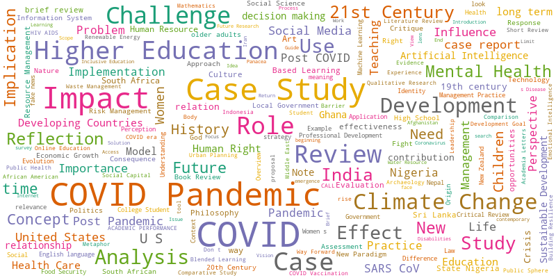
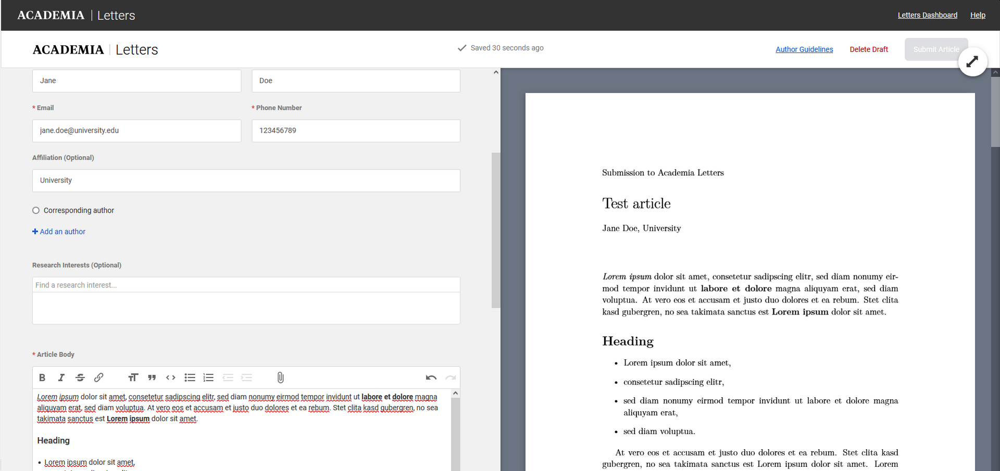
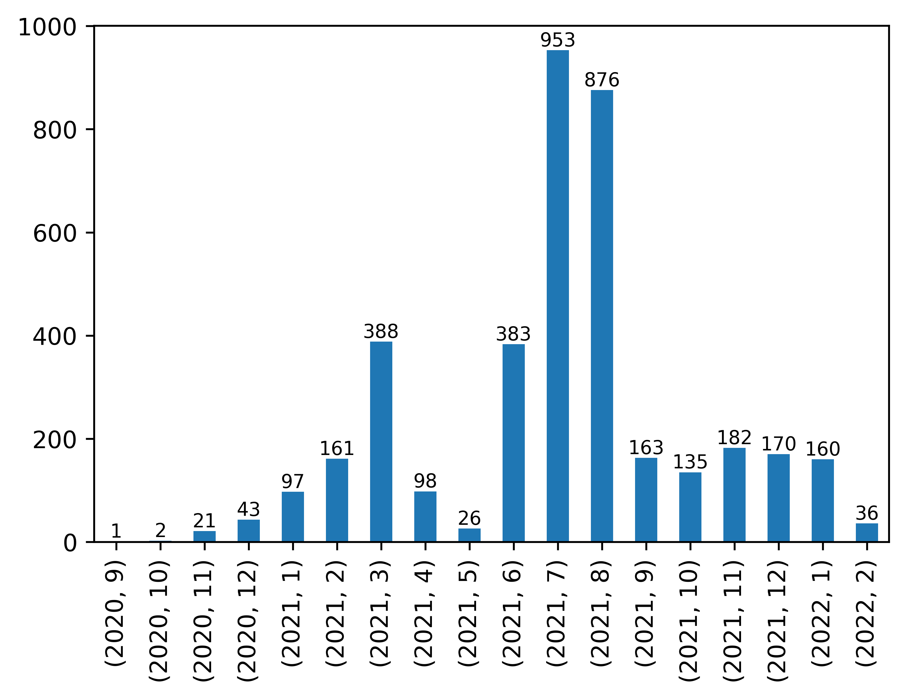
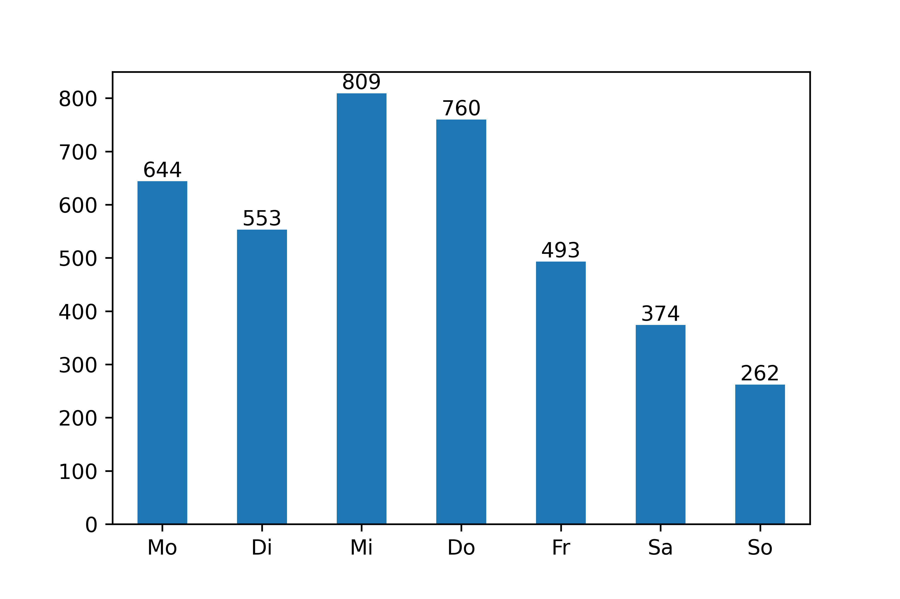

Academia
([https://www.academia.edu/](https://www.academia.edu/))
als soziales Netzwerk für Forschende ist ins Open-Access-Publizieren als
kommerzielles Geschäftsfeld eingestiegen und hat mit Academia Letters
([https://www.academia.edu/letters](https://www.academia.edu/letters))
ein neues Angebot gestartet. Der Aufbau weiterer
Open-Access-Zeitschriften ist von Academia Inc. geplant, auch mit dem
neuen Geld aus der aktuellen Finanzierungsrunde:

> "Chinese tech giant Tencent is among those backing Academia, which has raised \$22mn in fresh Series D financing. Chief executive Richard Price said the fundraising would help support a series of online journals free to read and paid for by the authors or backers which it plans to make available in the coming months" \[1\]

Die Geldgeber\*innen sehen daher in Academia und den neuen
Open-Access-Zeitschriften wie Academia Letters eine lohnende
Investitionsmöglichkeit. Wie ist Academia Letters aus einer
informationswissenschaftlichen und bibliothekarischen Perspektive zu
bewerten? Wie verhält es sich mit den Maßnahmen zur Qualitätssicherung,
insbesondere der Begutachtung bei Academia Letters? Haben wir es hier
mit einem seriösen und fairen Angebot oder eher einem Predatory
Publisher zu tun? Zur besseren Einordnung werden im Folgenden ein paar
Punkte ausgeführt.

### Was ist Academia Letters?

Mit Academia Letters sollen kurze Artikel (800--1.600 Wörter) schnell
Open Access veröffentlicht werden. Laut dem Geschäftsführer Richard
Price dauert der gesamte Prozess zehn Tage. \[1\] Ob dies als
Durchschnittswert oder als Maximalwert gemeint ist, wird nicht ganz klar
-- aber in jedem Fall ist dies blitzschnell. Insbesondere muss in der
Zeit auch eine Begutachtung durchgeführt und die Entscheidung zur
Annahme oder Ablehnung getroffen werden.

Bei der Suche nach Gutachter\*innen nutzt Academia das eigene soziale
Netzwerk von Millionen von Forschenden. Es scheint als ob passende
Gutachter\*innen automatisch ausgewählt und angeschrieben werden, was
dann zu einer Flut an solchen Anfragen für einzelne Nutzer\*innen des
Academia-Netzwerks führen kann, wie unterschiedliche Nutzer\*innen
berichten. \[2\] Es wird auch berichtet, dass die Gutachten auf 100--700
Wörter beschränkt sind. Zudem gibt es nach eigenen Angaben keinen
Prozess, um umfangreiche Überarbeitungen und eine Wiedereinreichung zu
ermöglichen. \[3\]

Eine solch kurze Begutachtungsfrist und das Fokussieren auf ein paar
kleine einfache Verbesserungsvorschläge halte ich nicht für
vertrauenswürdig. Zudem werden die potenziellen Gutachter\*innen unter
Zeitdruck gestellt, obwohl diese die Gutachten ohne eine Gegenleistung
vom Verlag als Community-Service erbringen.

Die Gutachter\*innen werden weder öffentlich genannt noch werden die
Gutachten öffentlich zugänglich gemacht (Open Peer Review), obwohl genau
dies versprochen wird. \[3\] Auf Publons (<https://publons.com/>) sieht
man einige Gutachter\*innen mit 30 oder mehr Gutachten in den letzten
zwölf Monaten. \[4\] Dies sind fast drei Gutachten pro Monat von einer
einzelnen Person, was mir nicht mehr sorgfältig machbar zu sein scheint.

Es gibt bei Academia Letters kein öffentlich genanntes
Herausgeber\*innengremium (Editorial Board), weswegen unklar ist, wer
die wissenschaftliche Leitung bei der Zeitschrift hat -- oder ob es so
etwas überhaupt gibt. Es erscheint mir realistischer davon auszugehen,
dass kein Herausgeber\*innengremium existiert. Dies ist schon sehr
ungewöhnlich. Bei der Abgrenzung zu Predatory Journals sind gerade die
Herausgeber\*innen und deren Bekanntheit ein wesentlicher Punkt. \[5\]
Bei Academia Letters wird aber nicht mal versucht den Anschein eines
anerkannten Herausgeber\*innengremiums zu wecken, sondern man verzichtet
komplett darauf. Damit steuert das kommerzielle Unternehmen,
beziehungsweise möglicherweise auch deren Algorithmen die finalen
Entscheidungen zu den Gutachten und entscheidet über die Ausrichtung der
Zeitschrift insgesamt. Dies ist nicht nur unseriös, sondern verleitet
potenziell auch zur Annahme von mehr Artikeln, da man damit ja Geld
verdienen kann.

Academia Letters besitzt die ISSN 2771-9359[^1] und kann damit formal
als Zeitschrift oder zeitschriftenartige Reihe angesehen werden. Es gibt
aber keine Bände oder Hefte, sondern nur einzelne Artikel. Jeder
einzelne Artikel erhält eine DOI und ist dadurch eindeutig
identifizierbar. Daher würde ich Academia Letters formal als
Mega-Journal[^2] einstufen.

Im Vergleich zu anderen Open-Access-Zeitschriften ist Academia Letters
nicht im DOAJ (Directory of Open Access Journals,
[https://doaj.org/](https://doaj.org/)) gelistet oder
Mitglied von COPE (Committee on Publication Ethics,
[https://publicationethics.org/](https://publicationethics.org/))
oder OASPA (Open Access Scholarly Publishing Association,
[https://oaspa.org/](https://oaspa.org/)). Andere
Open-Access-Zeitschriften, auch bekannte Mega-Journals, sind hier
normalerweise immer gelistet (vergleiche Tabelle 1). Solche
Zugehörigkeiten sind Indizien, dass die Zeitschrift beziehungsweise der
Verlag überzeugende Maßnahmen zur Qualitätssicherung (insbesondere
Begutachtung) und Publikationsethik ergreifen. Darum ist die Überprüfung
dieser Zugehörigkeit auch ein Punkt der ThinkCheckSubmit-Checkliste
\[5\], bei welcher Academia Letters wiederum negativ auffällt.

Tab. 1: Zugehörigkeit von einigen Mega-Journals zu DOAJ ("mit
Auszeichnung" meint hier konkret das DOAJ Seal,
[https://doaj.org/apply/seal/](https://doaj.org/apply/seal/)),
COPE und OASPA.

|                       | **DOAJ**                  | **COPE** | **OASPA**                          | **Links**                                                                                |
|------------------------|-----------------------|------|--------------------------------|--------------------------------------------------------------------------------------|
| **Academia Letters**       | nein                  | nein | nein                           |                                                                                      |
| **F1000 Research**         | ja, mit Auszeichnung  | ja   | ja                             | <https://doaj.org/toc/2046-1402>                                                       |
| **Open Research Europe**   | ja, mit Auszeichnung  | nein | nicht separat, aber vergleiche F1000 | <https://doaj.org/toc/2732-5121>                                                       |
| **PeerJ**                  | ja, mit Auszeichnung  | ja   | ja, PeerJ als Verlag           | <https://doaj.org/toc/2167-8359>, <https://oaspa.org/member/peerj/>                      |
| **PeerJ Computer Science** | ja, mit Auszeichnung  | nein | ja, PeerJ als Verlag           | <https://doaj.org/toc/2376-5992>, <https://oaspa.org/member/peerj/>                      |
| **PLOS One**               | ja, mit Auszeichnung  | ja   | ja, PLOS als Verlag            | <https://doaj.org/toc/1932-6203>, <https://oaspa.org/member/public-library-of-science/>  |
| **SAGE Open**              | ja, mit Auszeichnung  | ja   | ja, SAGE als Verlag            | <https://doaj.org/toc/2158-2440>, <https://oaspa.org/member/sage-publications/>          |

Fachlich gibt es keine Eingrenzung oder Fokussierung bei Academia
Letters, sondern Einreichungen über "any topic of academic study"
\[3\] sind möglich. Die Titel der bisher veröffentlichten Publikationen
zeigen auch ein sehr breites Spektrum (siehe Abbildung 1). Für mich
stellt sich dabei auch die Frage, ob man hier immer Expert\*innen für
jedes Nischenthema zum Begutachten finden kann. Zudem müssen alle
Einreichungen von der nicht näher spezifizierten
Herausgeber\*inneninstanz oder -algorithmus final freigegeben werden. Ob
dies seriös und fachlich immer angebracht zu bewerkstelligen ist,
bezweifle ich.

In den Autor\*innenrichtlinien findet man drei explizit genannte
akzeptierte Artikeltypen. Der erste Punkt "Thought-provoking hypotheses
that don\'t yet have the data to confirm or refute them" \[3\] springt
sofort ins Auge. Zum Nachdenken anregende Hypothesen ohne Daten oder
Argumente, welche die Selbigen stützen oder widerlegen, als begutachtete
Artikel zu verkaufen, hört sich für mich pseudowissenschaftlich an.

### Einreichungsworkflow

Sowohl auf der Zeitschriftenseite wie auch beim persönlichen
Academia-Profil können angemeldete Benutzer\*innen eine Einreichung für
Academia Letters starten. Neben den üblichen Angaben zu Titel und
Autor\*innen gibt man den Text des Artikels sowie die Referenzen direkt
in die Eingabemaske ein (siehe Abbildung 2). Einfache Formatierungen
(Auszeichnungen wie fett oder kursiv, Überschriften, Links, Blockzitat,
Aufzählungen oder nummerierte Listen) können dabei direkt vorgenommen
werden. Hinter dem Klammer-Symbol versteckt sich die Möglichkeit Bilder
einzufügen und mit Tricks kann man auch mathematische Formeln eingeben.
Es scheint aber nicht möglich zu sein, etwa eine Tabelle einzufügen.

Prinzipiell kann die direkte Eingabe des Textes im Einreichungsworkflow
einer Zeitschrift interessant sein. Man sieht dabei direkt das fertige
Ergebnis und spart auch auf Seiten der Zeitschrift weitere
Konvertierungsarbeiten. Hier, bei Academia Letters, scheint mir der
Fokus aber zu stark auf Text mit Auszeichnungen zu liegen und andere
Funktionalitäten wie Tabellen sind nicht möglich oder etwas versteckt
wie bei Bildern.[^3]

Mit dem Einreichungsworkflow setzen die Autor\*innen den Artikel selbst
in das Zeitschriftlayout und der Verlag wird von dieser Arbeit
entlastet. Nacharbeiten von Seiten der Zeitschriften sind normalerweise
häufig bei Bildern oder Tabellen erforderlich, aber diese Funktionen
fehlen bei Academia Letters entweder komplett oder werden mit
eingeschränkten Möglichkeiten ganz in die Hände der Autor\*innen gelegt.
Damit stellt sich dann aber auch die Frage, welche Aufwände der Verlag
bei Einreichungen überhaupt noch hat?

### Geschäftsmodell

Academia Letters erhebt von den Autor\*innen bei Annahme
Artikelbearbeitungsgebühren (APC). Prinzipiell ist es nicht unüblich,
dass kommerzielle Verlage für das Publizieren in
Open-Access-Zeitschriften Geld von den Autor\*innen erheben, da bei frei
verfügbaren Artikeln keine Abonnement-Gebühren die Aufwände des Verlags
abdecken können. Die Gebühren betragen laut Informationen im
Einreichungsworkflow 400 US-Dollar pro Artikel, aber im Bericht der
Financial Times werden noch 500 US-Dollar angegeben. In den oben
referenzierten Diskussionen wird teilweise auch erwähnt, dass einzelne
Artikel ohne Gebühren zu nehmen durchgewunken wurden.

Es ist essenziell, dass man Autor\*innen vor Einreichung klar auf die
Höhe der Gebühren hinweist, welche bei positiver Begutachtung anfallen.
Die Gebühren werden aber auf der Hauptseite der Zeitschrift Academia
Letters nicht erwähnt und in den Autor\*innenrichtlinien \[6\] nur,
falls man bereits eingeloggt ist oder mit einer Einreichung begonnen
hat. Ohne Anmeldung wird man auf der Webseite von Academia gar keine
Informationen zur Höhe der Gebühren finden. Solches Verhalten zur
Verschleierung der Kosten kennt man von Predatory Publishers.

Wie üblich bei Open-Access-Zeitschriften kann jede\*r die publizierten
Artikel ansehen und diese sind mit einer CC-BY 4.0 Lizenz versehen. Die
Möglichkeit, die Artikel auch als PDF herunterzuladen, bekommt man aber
erst, wenn man sich anmeldet und damit Academia kontinuierlich mit den
eigenen Nutzungsdaten auf der Plattform versorgt.[^4] Zudem bekommt man
als angemeldete\*r Nutzer\*in auch Empfehlungen und verwandte Artikel
angezeigt. Letzteres kann man ja vielleicht als Zusatzfunktionalitäten
der Plattform durchgehen lassen, aber die Möglichkeit, einen
Open-Access-Artikel auch herunterzuladen, ist eine fundamentale
Nachnutzung. Genau solche Nachnutzungen müssen bei Open-Access-Artikeln
bereits nach der Budapester Open Access Erklärung[^5] ohne solche
technische Schranken (und eine zwingende Anmeldung ist solch eine
Schranke) möglich sein.

Zudem bietet Academia einen Premium Access[^6] für 100 US-Dollar pro
Jahr an. Mit solch einem Premium Zugriff kann man weitere Funktionen auf
Academia freischalten -- wie die erweiterte Suche, das Herunterladen von
ganzen PDF-Paketen, Übersetzungen oder Such-Alerts. Die Verquickung von
verschiedenen Einnahmeströmen zur Finanzierung der gleichen
Zeitschriftenartikel ist kritisch zu betrachten. Dies ist der gleiche
Grund, warum die Forschungsförderung und viele Universitäten die
Finanzierung von einzelnen hybriden Open-Access-Artikeln ausschließen,
da hier die Gefahr des Double Dippings von Seiten des Verlags besteht.

### Publikationszahlen

Auf der Zeitschriftenseite gibt es keine Such- oder Browsingmöglichkeit
auf Zeitschriftenebene und daher sieht man nicht, wie viele Artikel
bereits veröffentlicht wurden. Laut eigenen Angaben sind bereits über
5.000 Artikel publiziert worden \[1\]. Mit Daten aus Crossref kann man
die genauen Publikationszahlen und Metadaten analysieren. Dort befinden
sich aktuell (Stand 13.03.2022) Daten zu 3.895 Artikeln von Academia
Letters.

Die Anzahl veröffentlichter Artikel ist in einigen Monaten extrem hoch,
aber variiert auch sehr stark zwischen den Monaten (siehe Abbildung 3).
Wahrscheinlich hat Academia aktiv Leute angesprochen beziehungsweise auf
der eigenen Plattform auf die neue Möglichkeit zum Publizieren
hingewiesen. Zumindest gibt es Berichte \[7\] von E-Mails, welche
massenweise verschickt wurden und Nutzer\*innen zum Schreiben eines
Artikels für Academia Letters eingeladen haben.

Die Anzahl veröffentlichter Artikel kann man auch tageweise betrachten.
Beispielsweise wurden in der Woche ab dem 12. Juli 2021 insgesamt 568
Artikel in der Zeitschrift und an einzelnen Tagen über 150 Artikel
veröffentlicht. Zudem lässt sich beobachten, dass Artikel an jedem
Wochentag inklusive Samstag und Sonntag veröffentlicht wurden (siehe
Abbildung 4). Daher liegt für mich der Schluss nahe, dass die
Veröffentlichungen weitestgehend automatisiert ablaufen und nur ein
minimales menschliches Steuern erfordern.

### Angaben zur Verfügbarkeit von Daten und Software

Die diesem Artikel zugrundeliegenden Daten und das Auswertungsskript
(Jupyter Notebook) sind über GitHub unter
[https://github.com/zuphilip/analyze-mega-journals/](https://github.com/zuphilip/analyze-mega-journals/)
als Open Source beziehungsweise Open Data verfügbar. Dort findet man
auch die Auswertungen der Abbildungen 1, 3 und 4 für Academia Letters
sowie für andere Mega-Journals zum Vergleich.

### Fazit

Academia versucht mit dem Einstieg in das Open-Access-Publizieren das
Potenzial seines aufgebauten sozialen Netzwerkes für Forschende weiter
kommerziell abzuschöpfen. Mit einem möglichst automatisierten
Publikationsworkflow und unter Ausnutzung der Wissenschaftler\*innen
soll der Aufwand auf Seiten des Verlags minimiert werden.

Das komplette Fehlen eines Herausgeber\*innengremiums, der Verzicht auf
einen Workflow auch für größere Überarbeitungen, die Verschleierung der
Kosten, die Anmeldeschranke beim PDF-Download und weitere Punkte lassen
für mich nur den Schluss zu, dass die Publikationsmöglichkeit bei
Academia Letters nicht seriös ist. Von einer Veröffentlichung in
Academia Letters rate ich klar ab und dafür Geld zu bezahlen umso mehr.

Möglicherweise helfen die Herangehensweise und Betrachtungen dieses
Artikels auch in Zukunft für Einschätzungen zu neuartigen
Publikationsprojekten von kommerziellen Akteur\*innen im Bereich des
wissenschaftlichen Publizierens, welche es bestimmt geben wird.

### Referenzen und Links

\[1\] Jack, A. (21. Februar 2022). Tencent-backed academic network to
launch 'open access' journals. Financial Times.
[https://www.ft.com/content/338e7d86-4a42-46cf-a0e9-9081b136bec7](https://www.ft.com/content/338e7d86-4a42-46cf-a0e9-9081b136bec7)

\[2\] Mcvittie, C. (26. März 2021). Is anyone else being flooded with
requests to review for Academia Letters? ResearchGate.
[https://www.researchgate.net/post/Is_anyone_else_being_flooded_with_requests_to_review_for_Academia_Letters](https://www.researchgate.net/post/Is_anyone_else_being_flooded_with_requests_to_review_for_Academia_Letters)

\[3\] Guidelines for Authors and Reviewers. Academia Letters. Abgerufen
17. März 2022, von
[https://www.academia.edu/letters/submission_faq](https://www.academia.edu/letters/submission_faq)

\[4\] Academia Letters page on Publons. Abgerufen 17. März 2022, von
[https://publons.com/journal/890365/academia-letters/](https://publons.com/journal/890365/academia-letters/)

\[5\] Think. Check. Submit. (Deutsch). Abgerufen 17. März 2022, von
[https://thinkchecksubmit.org/translations/german/](https://thinkchecksubmit.org/translations/german/)

\[6\] Guidelines for Authors and Reviewers. Academia Letters. Abgerufen
9. Mai 2022, von
[https://www.academia.edu/letters/submission_faq](https://www.academia.edu/letters/submission_faq)

\[7\] "Academia Letters" from academia.edu: Legit or not?. reddit.
Abgerufen 11. Februar 2021, von
[https://www.reddit.com/r/AskAcademia/comments/lhvh3r/academia_letters_from_academiaedu_legit_or_not/](https://www.reddit.com/r/AskAcademia/comments/lhvh3r/academia_letters_from_academiaedu_legit_or_not/)

[^1]: [https://portal.issn.org/resource/ISSN/2771-935](https://portal.issn.org/resource/ISSN/2771-9359)

[^2]: [https://en.wikipedia.org/wiki/Mega_journal](https://en.wikipedia.org/wiki/Mega_journal)

[^3]: Wesentlich ausgereifter ist da etwa des Tool Texture
    ([https://github.com/substance/texture)](https://github.com/substance/texture),
    welches die Eingaben dann auch gleich als maschinenlesbares und
    standardisiertes JATS-XML speichert.

[^4]: Man muss sich aber nicht mit einer genutzten E-Mail-Adresse
    anmelden, sondern kann für solche Zwecke auch eine temporäre
    E-Mail-Adresse verwenden (etwa über dropmail.me) und diese
    anschließend wieder löschen.

[^5]: <https://www.budapestopenaccessinitiative.org/read/>

[^6]: <https://www.academia.edu/upgrade?feature=default&from_navbar=true>
