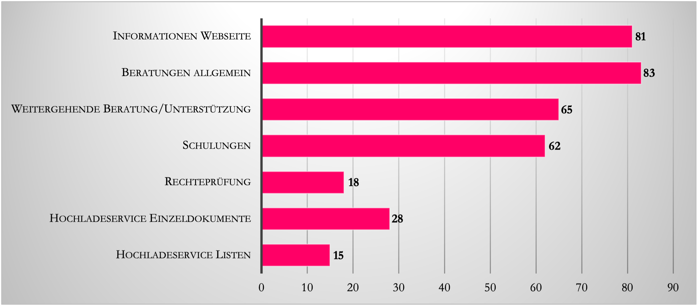
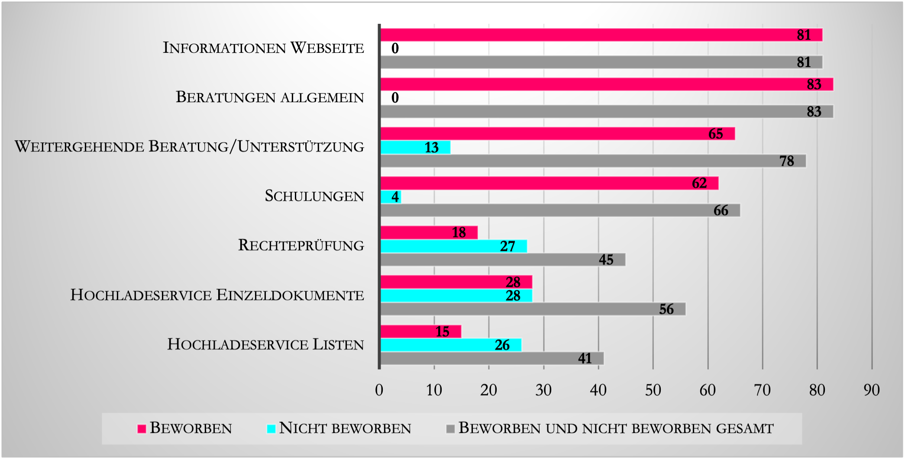
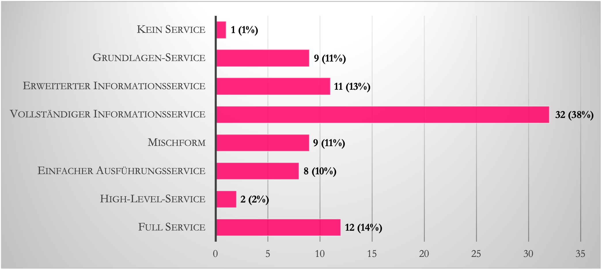
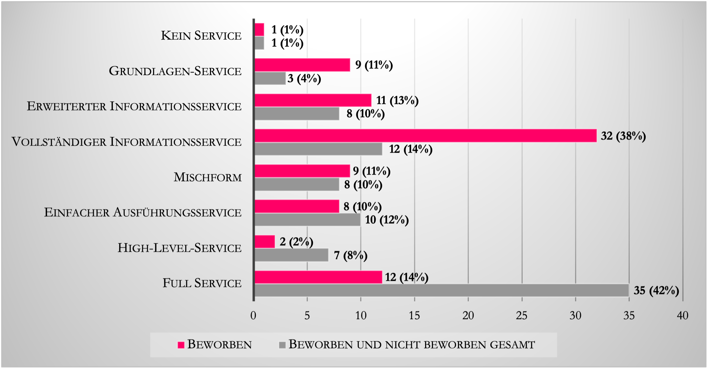
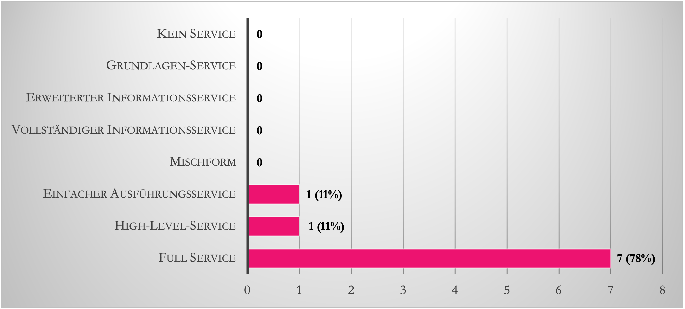
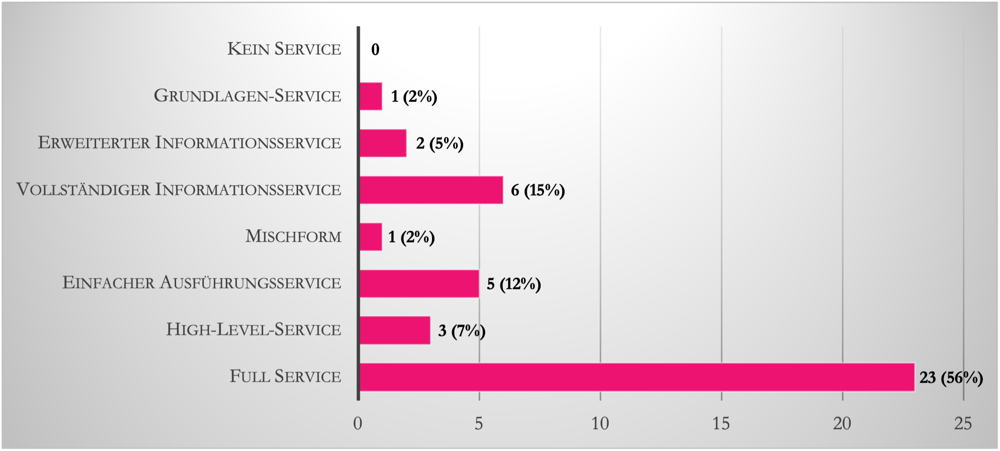
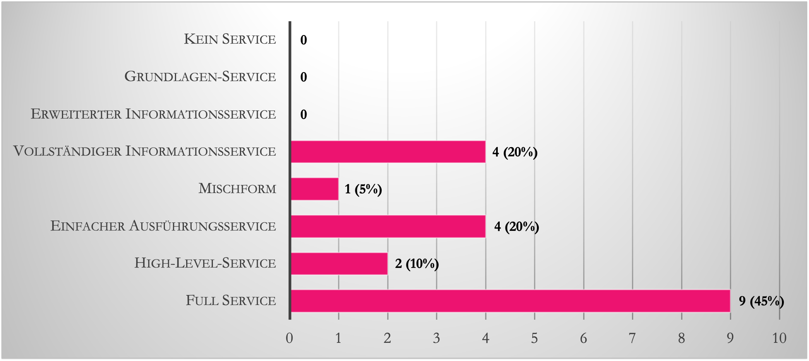
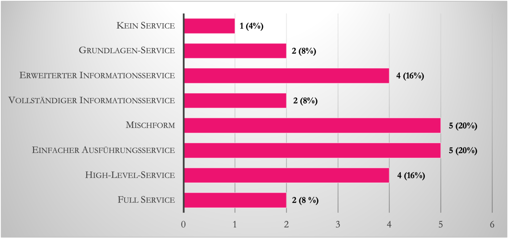
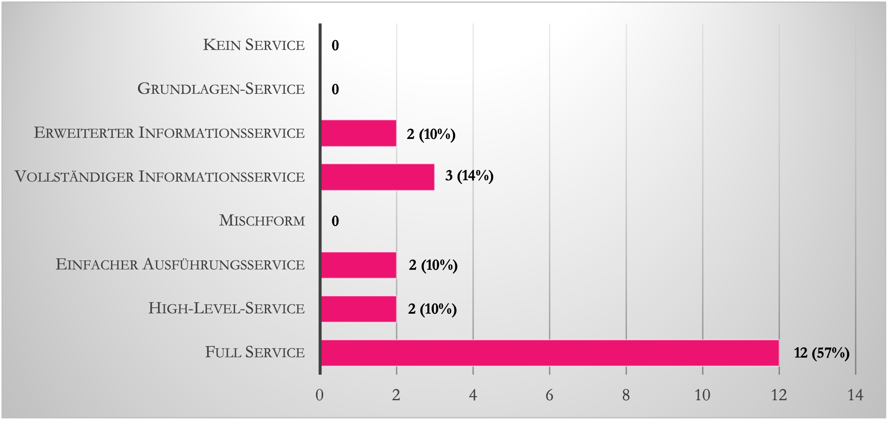
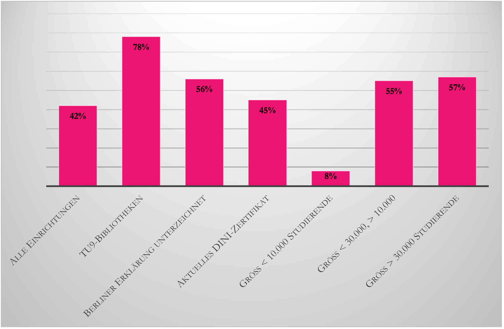

Dieser Beitrag ist aus einer Masterarbeit hervorgegangen, die am
Institut für Bibliotheks- und Informationswissenschaft der
Humboldt-Universität zu Berlin entstanden ist. Teile sind daraus
wörtlich übernommen.Vergleiche Hannah Böhlke, Verbreitung und
Ausbaustufen von Zweitveröffentlichungsservices an deutschen
Universitätsbibliotheken, in: Berliner Handreichungen zur Bibliotheks-
und Informationswissenschaft, Heft 491.\
DOI: [https://doi.org/10.18452/24698.2](https://doi.org/10.18452/24698.2)

### Einleitung

Open Access hat inzwischen an den meisten Wissenschaftlichen
Bibliotheken in Deutschland einen hohen Stellenwert erreicht. Eine der
Möglichkeiten, hier tätig zu werden, besteht darin, den Grünen Weg zu
fördern. Konkret bedeutet dies in vielen Einrichtungen unter anderem den
Aufbau vielfältiger Services im Bereich der Zweitveröffentlichungen.
Während die strukturellen Bedingungen sich grundsätzlich häufig ähneln,
zeigt sich bei eingehender Betrachtung, dass die Umsetzung der Services
viele Abstufungen haben und selbst ähnliche Dienstleistungen
unterschiedlich umgesetzt werden können.

Wird im übergeordneten Kontext von Zweitveröffentlichungsservice
gesprochen, ist damit häufig ein "Full Service"[^1] gemeint. Hierbei
handelt es sich um einen Service, der den Wissenschaftler:innen alle
notwendigen Handlungen zur Zweitveröffentlichung ihrer Artikel abnimmt.
In der Literatur wird davon ausgegangen, dass diese Full Services eher
eine Ausnahme sind.[^2] Zurecht wird aber darauf hingewiesen, dass es in
diesem Bereich vielfache Abstufungen geben kann. Auch innerhalb der
Einrichtungen wird von verschiedenen Dienstleistungen gesprochen, die
diesem Bereich zuzuordnen sind.[^3]

Da bisher keine systematische quantitative Erhebung zum Stand der
Zweitveröffentlichungsservices in Deutschland vorlag, wurde im Rahmen
der vorliegenden Studie angestrebt, die angebotenen Services an
deutschen staatlichen Universitätsbibliotheken möglichst umfassend zu
untersuchen und darzustellen. Außerdem war ein Ziel der Untersuchung,
die verschiedenen Abstufungen sichtbar zu machen und Kategorien sowie
Ausbaustufen zu erarbeiten, die den Serviceportfolios der Einrichtungen
jeweils zugeordnet werden können.

Der Fokus der Untersuchung liegt hierbei ausschließlich auf den
institutionellen Repositorien der Universitäten. Diese sind in der Regel
an den zugehörigen Bibliotheken angesiedelt und die Services im Bereich
Zweitveröffentlichung werden dort betrieben.[^4] Keine Berücksichtigung
fanden die möglicherweise vorhandenen Angebote bei disziplinären
Repositorien.[^5]

### Methodik

Als Sample für die Untersuchung wurden die 84 staatlichen
Universitätsbibliotheken in Deutschland[^6] ausgewählt.[^7] Dies sollte
einen möglichst hohen Grad an Vergleichbarkeit garantieren, da
anzunehmen ist, dass zumindest grundlegend ähnliche Strukturen und
Bedingungen innerhalb dieser Vergleichsgruppe gegeben sind.

In einem ersten Schritt wurden die Webseiten der
Universitätsbibliotheken im Rahmen einer Dokumentenanalyse untersucht.
Hieraus ergab sich eine Auflistung der verschiedenen Services, die
angeboten werden können. Diese Services wurden anschließend in zwei
übergeordnete Kategorien eingeordnet. In einem weiteren Schritt wurden
Ausbaustufen erarbeitet, die sich aus dem Vorhandensein bestimmter
Services in einer Einrichtung ergeben.

Zusätzlich wurden die Einrichtungen anschließend persönlich befragt,
inwieweit weitere Dienstleistungen, die nicht auf der Webseite genannt
sind, auf Anfrage angeboten werden. Der Rücklauf bei diesen Anfragen war
außergewöhnlich gut. Am Ende konnte von 81 Einrichtungen ein
vollständiges Bild gezeichnet werden.[^8]

Die Daten wurden alle einrichtungsbezogen in einer Excel-Tabelle
gesammelt, sodass ablesbar war, welche Einrichtung über welches
Serviceportfolio verfügt. Dadurch war es möglich, die Häufigkeit
bestimmter Services statistisch auszuwerten. Hierbei wurde zwischen den
‚beworbenen' und den ‚nicht beworbenen'[^9] Services unterschieden.
Anschließend wurde anhand dieser Unterscheidung untersucht, wie häufig
die einzelnen Ausbaustufen vorkommen.

### Auswertung der Daten

#### Die einzelnen Services und ihre Häufigkeit

Wie bereits erwähnt, ist im übergeordneten Kontext häufig ein "Full
Service" gemeint, wenn von Zweitveröffentlichungsservices gesprochen
wird, also einem Service, der Wissenschaftler:innen alle notwendigen
Handlungen zur Zweitveröffentlichung ihrer Artikel abnimmt. Innerhalb
der Institutionen ist allerdings klar, dass es Abstufungen im Angebot
gibt.

Aus der Durchsicht der Webseiten ergab sich folgende Liste:

-   **Bereitstellung von Informationen auf der Webseite**: Die
Einrichtung stellt auf ihrer Webseite allgemeine oder auch
konkrete Informationen zum Thema Grüner Weg zur Verfügung. Dies
kann bis zu detaillierten Informationen, wie zum Beispiel zur
Rechteklärung, reichen. Ebenfalls möglich sind die Verlinkung auf
entsprechende allgemeine[^10] oder speziellere[^11]
Informationsangebote, die Bereitstellung von Aufzeichnungen oder
Folien von Coffee Lectures sowie die Einbettung von selbst
erstellten Videos.

-   **Allgemeine Beratung**: Es gibt ein Kontaktangebot im Bereich Open
Access. Es wurde im Rahmen der Datenerhebung davon ausgegangen,
dass bei Angabe einer entsprechenden Kontaktadresse oder
Telefonnummer zumindest eine allgemeine Beratung auch zum Grünen
Weg stattfindet.

-   **Weitergehende Beratung/Unterstützung**: Die Einrichtung berät oder
unterstützt die Wissenschaftler:innen bei der Rechteklärung oder
der Konvertierung von Dokumenten und gegebenenfalls bei weiteren
Anliegen. Hierunter kann der Verweis im Rahmen einer Beratung auf
Tools wie Sherpa Romeo, Dissem.in oder Ähnliches fallen, aber auch
die Bereitstellung eines Vordruckes für Verlagsanfragen bezüglich
der Rechte zur Zweitveröffentlichung. Die Grenze zu Services, die
den Wissenschaftler:innen die Arbeit abnehmen, kann hier teilweise
leicht verschwimmen, der Fokus liegt aber auf ‚Hilfe zur
Selbsthilfe'. Wurde auf der Webseite eine Prüfung der Rechte
beworben, wird davon ausgegangen, dass auch eine entsprechende
Beratung stattfinden würde.

-   **Schulungen**: Die Einrichtung bietet Schulungen, Workshops oder
anderweitige Veranstaltungen (zum Beispiel Coffee Lectures) zum
Thema Open Access an, in denen der Grüne Weg zumindest teilweise
thematisiert wird. Das Spektrum reicht hier von allgemeinen
Open-Access-Schulungen, die auch Informationen zum Grünen Weg
beinhalten, über Schulungen für Nachwuchswissenschaftler:innen
oder zur Nutzung des Repositoriums, bis hin zu Schulungen, die
sich ausschließlich mit der Thematik von Zweitveröffentlichungen
beschäftigen.[^12]

-   **Prüfung der Rechte**: Die Einrichtung übernimmt für
Einzelpublikationen oder für Publikationslisten die Prüfung der
Rechte. Dies kann zum Beispiel anhand von Sherpa Romeo passieren
oder auch über eine Prüfung des Verlagsvertrages. Auch
Verhandlungen mit den Verlagen können, müssen aber nicht unter
diesen Punkt fallen. Weiterhin kann durch die Bibliothek geprüft
werden, ob die Rechte zur Online-Bereitstellung[^13] vorliegen.

-   **Hochladeservice Einzeldokumente**: Die Einrichtung übernimmt für
die Wissenschaftler:innen das Einstellen von einzelnen Dokumenten
in das institutionelle Repositorium, inklusive der Eintragung der
Metadaten. Die Übermittlung kann über eine Hochladefunktion, per
E-Mail oder mithilfe eines Datenträgers stattfinden. In einigen
Einrichtungen fällt unter diesen und den nächsten Punkt auch die
Herstellung eines Postprints, wenn das Hochladen der
Verlagsversion nicht gestattet ist und ein Postprint nicht zur
Verfügung steht. Weiterhin kann die Konvertierung von Dateien in
das PDF/A-Format vorgenommen werden oder das Einscannen[^14] von
nur gedruckt vorliegenden Artikeln. Außerdem kann das Hochladen
ohne vorherige Aufforderung durch die Autor:innen auf Grundlage
von Allianz- oder Nationallizenzen ausgeführt werden.[^15]
Anzumerken ist, dass das eigenständige Hochladen an manchen
Bibliotheken nicht vorgesehen ist.

-   **Hochladeservice Listen**: Die Einrichtung übernimmt von den
Wissenschaftler:innen strukturierte oder unstrukturierte
Publikationslisten, prüft für welche der Dokumente eine
Zweitveröffentlichung in welcher Version rechtlich möglich ist und
stellt diese anschließend in das Repositorium ein. Gegebenenfalls
müssen die Wissenschaftler:innen Postprints zur Verfügung stellen,
einige Einrichtungen stellen diese auch her. Weiterhin kann in
diesem Rahmen ebenfalls angeboten werden, ausschließlich gedruckt
vorliegende Publikationen einzuscannen. Online verfügbare
Dokumente werden, wenn die Verlagsversion genutzt werden darf, in
der Regel von den Bibliotheken selbst beschafft oder von den
Autor:innen zur Verfügung gestellt. Dieser Service kann entweder
so aufgebaut sein, dass Listen von den Wissenschaftler:innen
entgegengenommen werden oder dass eigeninitiativ die Webseiten der
Universitätsangehörigen nach Publikationslisten durchsucht werden
und diese dann geprüft werden. Der Regelfall bei einem
Hochladeservice für Listen ist, dass die Rechteprüfung übernommen
wird. Es gibt allerdings auch Ausnahmefälle, in denen die
Rechteprüfung durch die Autor:innen durchgeführt werden muss und
die Bibliothek nur die restlichen Aufgaben übernimmt.

Ausgehend von dieser Liste wurde ausgewertet, wie häufig die jeweiligen
Services an den Bibliotheken vorkommen (Abbildung 1).[^16]

Es wird deutlich, dass mit einer Anzahl von 81 (96 %) eine
überwältigende Mehrheit der 84 untersuchten Einrichtungen Informationen
auf ihrer Webseite zum Grünen Weg anbietet und bei 83 Bibliotheken
mindestens die Möglichkeit besteht, über eine Funktionsadresse für Open
Access Kontakt für eine allgemeine Beratung aufzunehmen (99 %). Eine
weitergehende Beratung/Unterstützung ist in 65 Bibliotheken (77 %)
möglich. Ein ähnlich hoher Wert findet sich im Bereich der Schulungen,
die in 62 Einrichtungen (74 %) ein fester Bestandteil des
Serviceportfolios sind.

Deutlich geringer fällt der Anteil derjenigen Einrichtungen aus, die
eine Prüfung der Rechte, einen Hochladeservice Einzeldokumente oder
einen Hochladeservice Listen anbieten. Am häufigsten findet sich hierbei
der Hochladeservice Einzeldokumente, der immerhin in 28 der
Einrichtungen (33 %) beworben wird, während es einen entsprechenden
beworbenen Service für Listen nur in 15 Bibliotheken (18 %) gibt. Die
Prüfung der Rechte übernehmen 18 der 84 untersuchten Institutionen
(21 %).

Vergleicht man diese Werte mit den Services, die Bibliotheken zwar auf
Anfrage oder in Einzelfällen anbieten, die sie aber nicht auf ihrer
Webseite bewerben, ändert sich der Eindruck deutlich (Abbildung 2).

Während sich die Werte für Informationen auf der Webseite nicht erhöhen
konnten und der Wert für Allgemeine Beratungen sich ebenfalls nicht
verändert hat, gaben nun 13 weitere Einrichtungen an, dass sie auf
Anfrage auch Weitergehende Beratung/Unterstützung anbieten, sodass
dieser Service von nun insgesamt 78 Bibliotheken (93 %) angeboten wird.
Nur viermal wurde angegeben, dass es auf Anfrage Schulungen zu der
Thematik gibt, sodass hier der nur leicht höhere Wert von
66 Einrichtungen (79 %) erreicht wurde.

Im Vergleich deutlich höher sind aber die Zahlen der Institutionen, die
sich im Bereich der Rechteprüfung und der Hochladeservices engagieren.
So gaben 27 der Bibliotheken an, dass auf Anfrage oder in Einzelfällen
die Prüfung der Rechte für die Wissenschaftler:innen übernommen wird,
womit dies insgesamt betrachtet 45-mal (und damit in 54 % der
Einrichtungen) angeboten wird. Eine ähnliche Steigerung zeigt sich beim
Hochladeservice Einzeldokumente, der statt 28-mal nun mit 56-mal (67 %)
doppelt so häufig zu finden ist. Fast die Hälfte der Bibliotheken,
nämlich 41 (49 %), bieten einen Hochladeservice Listen an, also 26 mehr
als bei den beworbenen Dienstleistungen.

Anzumerken ist, dass bei den nicht beworbenen Dienstleistungen, vor
allem im Bereich der Hochladeservices, in der Regel der Fokus darauf
liegt, dass die Wissenschaftler:innen dies nach Möglichkeit selbst
erledigen sollen. Dies kann aber ebenso für Dienste gelten, die auf der
Webseite zwar genannt werden, hier aber bereits dabeisteht, dass sie nur
auf besonderen Wunsch oder in Ausnahmen durchgeführt werden.

#### Servicekategorien und Ausbaustufen

Tabelle 1 zeigt, dass unterschieden werden kann zwischen Services, die
eher eine Hilfe zur Selbsthilfe darstellen, indem sie die
Wissenschaftler:innen über Möglichkeiten des Grünen Wegs informieren und
jenen, die den Autor:innen gezielt Arbeit im Bereich von
Zweitveröffentlichungen abnehmen und somit ausführender Art sind:

Table: Tabelle 1: Einordnung der Services in übergeordnete Kategorien.

| --------------------------------------------------------------------- |
| **Informationsservices**                                              |
| --------------------------------------------------------------------- |
| –   Bereitstellung von Informationen auf der Webseite                 |
| –   Schulungen                                                        |
| –   Allgemeine Beratung                                               |
| –   Weitergehende Beratung/Unterstützung                              |
| --------------------------------------------------------------------- |
| **Ausführungsservices**                                               |
| --------------------------------------------------------------------- |
| –   Prüfung der Rechte                                                |
| –   Hochladeservice Einzeldokumente                                   |
| –   Hochladeservice Listen                                            |

Diese Unterteilung bietet den ersten Schritt, um Ausbaustufen zu
erarbeiten und die Serviceportfolios der einzelnen Einrichtungen und
ihre verschieden zusammengesetzten Angebote darin einordnen zu können.
So kann auf einen Blick eine erste Einschätzung erfolgen, wie weit ein
Servicepaket an einer Einrichtung reicht und ob es sich um einen Service
mit wenigen oder vielen Angeboten handelt.[^17]

Table: Tabelle 2: Einordnung der einzelnen Services in Ausbaustufen.

|  **Servicekategorie**             | *Angebotene Dienstleistungen*                                                                                                                                                                                                                                                                                                                                              |
| --------------------------------- | -------------------------------------------------------------------------------------------------------------------------------------------------------------------------------------------------------------------------------------------------------------------------------------------------------------------------------------------------------------------------- |
| **Kein Service**                  | Es werden keine Services im Bereich Zweitveröffentlichungen angeboten.                                                                                                                                                                                                                                                                                                     |
| **Informationsservices**          |                                                                                                                                                                                                                                                                                                                                                                            |
| Grundlagen-Service                | Beinhaltet die Bereitstellung von Informationen auf der Webseite *und/oder* eine allgemeine Beratung.                                                                                                                                                                                                                                                                      |
| Erweiterter Informationsservice   | Beinhaltet neben der Bereitstellung von Informationen auf der Webseite und allgemeinen Beratungen entweder eine weitergehende Beratung/Unterstützung *oder* Schulungen.                                                                                                                                                                                                    |
| Vollständiger Informationsservice | Alle Services aus dem Bereich Informationsservice werden abgedeckt: Bereitstellung von Informationen auf der Webseite, eine allgemeine Beratung sowie eine weitergehende Beratung/Unterstützung und Schulungen.                                                                                                                                                            |
| **Ausführungsservices**           |                                                                                                                                                                                                                                                                                                                                                                            |
| Einfacher Ausführungsservice      | Beinhaltet alle Merkmale *eines* Vollständigen Informationsservices sowie einen Service aus dem Bereich der Ausführungsservices, also entweder die Prüfung der Rechte *oder* einen Hochladeservice Einzeldokumente *oder* einen Hochladeservice Listen.                                                                                                                    |
| High-Level-Service                | Beinhaltet alle Merkmale eines Vollständigen Informationsservices sowie *zwei* Services aus dem Bereich der Ausführungsservices, also beispielsweise die Prüfung der Rechte *und* einen Hochladeservice Einzeldokumente *ohne* einen Hochladeservice Listen oder einen Hochladeservice Einzeldokumente *und* einen Hochladeservice Listen *ohne* die Prüfung der Rechte.   |
| Full Service                      | Alle Services aus den Bereichen Informationsservice und Ausführungsservice werden abgedeckt: Bereitstellung von Informationen auf der Webseite, eine allgemeine Beratung sowie eine weitergehende Beratung/Unterstützung und Schulungen, die Prüfung der Rechte, ein Hochladeservice Einzeldokumente und ein Hochladeservice Listen.                                       |
| **Mischform**                     | Bietet Services aus beiden Bereichen an, deckt jedoch den Bereich der Informationsservices oder beide Bereiche nicht komplett ab. Denkbar ist beispielsweise ein Erweiterter Informationsservice mit einem oder zwei Ausführungselementen.                                                                                                                                 |

Mithilfe der Excel-Tabelle, in der vermerkt wurde, welche Einrichtung
welche Services anbietet, konnte nun auch die Häufigkeit der
Ausbaustufen statistisch aufbereitet werden (Abbildung 3).

Es wird bereits auf den ersten Blick deutlich, dass der vollständige
Informationsservice mit großem Abstand die häufigste Form eines
beworbenen Zweitveröffentlichungsservice darstellt. In 32 der
84 berücksichtigen Einrichtungen -- und somit mit 38 % in mehr als einem
Drittel -- werden auf alle hier untersuchten Arten Informationen für die
Wissenschaftler:innen bereitgestellt bzw. angeboten, während nur bei
einer Einrichtung keinerlei Angebot über die Webseite auffindbar war und
diese somit in keine der erstellten Ausbaustufen einzuordnen ist. Einen
Grundlagen-Service bieten neun Einrichtungen (11 %) und einen
erweiterten Informationsservice elf Einrichtungen (13 %) an. Insgesamt
machen damit Zweitveröffentlichungsservices, die sich auf die
Informationsweitergabe spezialisiert haben, mit 62 % eine deutliche
Mehrheit aus: 52 der 84 Universitätsbibliotheken sind so aufgestellt.

Beim Blick auf die Ausbaustufen im Bereich der beworbenen
Ausführungsservices wird klar, dass diese im Vergleich deutlich hinter
den Informationsservices zurückstehen. Insgesamt 22 Bibliotheken (27 %)
bewerben entsprechende Angebote auf ihrer Webseite, davon bieten acht
(10 %) einen einfachen Ausführungsservice an, zwei (2 %) einen
High-Level-Service und zwölf (14 %) einen beworbenen Full Service.
Inklusive der Mischformen bieten folglich 31 Bibliotheken (37 %)
Ausführungstätigkeiten an, von denen aber aufgrund der Mischform
neun Einrichtungen (11 %) keiner der hier erarbeiteten Ausbaustufen
eindeutig zuzuordnen sind.[^18]

Da bereits bei den Einzelservices klar wurde, dass viele Einrichtungen
auf Anfrage ein viel höheres Leistungsportfolio anbieten, war zu
erwarten, dass sich diese Beobachtung auch hier wiederholt.

Bereits beim ersten Blick auf Abbildung 4 bestätigt sich diese
Erwartung. Es lässt sich feststellen, dass die Zahlen aller Ausbaustufen
mit ihrem Schwerpunkt im Bereich der Informationsservices deutlich
abnehmen. Stattdessen verschiebt sich der Großteil in den Bereich der
Ausführungsservices. Zu beachten ist, dass sich die Zahlen sowohl von
einer Ausbaustufe weg, als auch zu eben dieser Ausbaustufe hin
verschieben können. Dies hat beispielsweise zur Folge, dass die Zahl der
beworbenen und der nicht beworbenen Ausbaustufen in der Addition nicht
die Zahl der beworbenen und nicht beworbenen Ausbaustufen gesamt ergibt
(Visualisierung der Verschiebungen siehe Abbildung 5).

Ein Grundlagen-Service ist nun nur noch in drei Einrichtungen zu finden.
Sechs der zuvor hier eingeordneten Bibliotheken bieten nun ein
erweitertes Servicespektrum an. Auch die Häufigkeit des Erweiterten
Informationsservice verringert sich um drei auf nunmehr acht. Da eine
Einrichtung sich zugunsten eines Erweiterten Informationsservice
verbesserte, ist hier eine Veränderung hinsichtlich einer Verbesserung
in Richtung eines Service mit Ausführungselementen bei vier
Einrichtungen zu beobachten. Am deutlichsten in diesem Bereich ist die
Veränderung der Vollständigen Informationsservices. Während dieser zuvor
mit 32 von allen Ausbaustufen am häufigsten vorkam, sind nun nur noch zwölf
Bibliotheken hier einzuordnen.

![Abbildung 5: Häufigkeiten der Veränderung der beworbenen Ausbaustufe hin zur nicht beworbenen Ausbaustufe in absoluten Zahlen.[^19]](img/abb5.png)

Während bei den beworbenen Zweitveröffentlichungsservices also der
Vollständige Informationsservice den höchsten Anteil ausmacht, ist es
bei den nicht beworbenen der Full Service. Fast die Hälfte der
Einrichtungen, nämlich 35 und somit 42 % der Bibliotheken, gab an, dass
sie ihren Wissenschaftler:innen auf Anfrage -- sofern Kapazitäten frei
sind -- das gesamte Leistungsspektrum eines Full Service anbieten. Hier
gab es also eine Steigerung um 23 Einrichtungen. Während der Anteil an
Einfachen Ausführungsservices sich insgesamt nur leicht auf zehn (12 %)
verändert, erhöht sich der von High-Level-Services um fünf Einrichtungen
auf nun sieben (8 %).

Insgesamt steigt damit der Anteil an Bibliotheken, die einen
vollständigen Informationsservice und zusätzlich Dienstleistungen aus
dem Bereich der Ausführungsservices anbieten auf 52 (62 %). Rechnet man
die Mischformen (8 bzw. 10 %) hinzu, bieten nun sogar 60 Einrichtungen
(72 %) Services aus dem Ausführungsspektrum an, im Gegensatz zu vorher
31 (37 %). Der Wert hat sich somit nahezu verdoppelt.

Die Verschiebung der Ausbaustufen von beworben zu nicht beworben
verdeutlicht Abbildung 5.

#### Weitere Einflussfaktoren auf den Ausbau des Serviceportfolios

Eine Frage, die sich im Laufe der Bearbeitung ergab, die aber in der
zugrundeliegenden Masterarbeit keine Beachtung mehr finden konnte,[^20]
war, inwiefern andere Faktoren Einfluss auf den Ausbau des
Serviceangebots haben könnten. Im Folgenden wurden nur die
Gesamtservices einschließlich der nicht auf der Webseite beworbenen
Angebote betrachtet.

Hier soll nun zunächst auf die TU9-Bibliotheken eingegangen werden,
anschließend auf die Einrichtungen, welche die Berliner Erklärung
unterzeichnet haben. Daraufhin werden die Bibliotheken betrachtet, deren
Repositorium zum Zeitpunkt der Datenerhebung im Frühjahr 2021 über ein
aktuelles DINI-Zertifikat verfügte. Abschließend wird der Einfluss der
Größe der Universitäten in den Blick genommen.

##### TU9-Bibliotheken

Bei den TU9-Bibliotheken wurden die entsprechenden neun Einrichtungen
untersucht.[^21] Es zeigt sich deutlich, dass diese Bibliotheken ihr
Serviceangebot im Bereich Zweitveröffentlichungsservices bereits sehr
weit ausgebaut haben (Abbildung 6). Während jeweils eine Bibliothek über
einen Einfachen Ausführungsservice beziehungsweise einen
High-Level-Service verfügt, sind sieben von neun Bibliotheken einem Full
Service zuzuordnen. Es ist also besonders hervorzuheben, dass die
Einrichtungen im Bereich der Ausführungsservices stark engagiert sind:
Der Anteil der Full Services liegt mit 78 % fast doppelt so hoch wie bei
der Betrachtung aller Einrichtungen (vergleiche Abbildung 4).

##### Berliner Erklärung

Differenzierter zeigt sich das Bild bei den insgesamt 41 Einrichtungen,
die die Berliner Erklärung über offenen Zugang zu wissenschaftlichem
Wissen unterzeichnet haben (Abbildung 7). Auch hier ist der Anteil der
Full Services mit 56 % höher als bei der Gesamtbetrachtung und die
Ausführungsservices machen insgesamt 75 % aus. Hier sind allerdings auch
andere Serviceportfolios vertreten: So gibt es je einen
Grundlagen-Service und eine Mischform, zwei Erweiterte
Informationsservices und sechs Informationsservices.

##### DINI-Zertifikat

Bei der Betrachtung der 20 Einrichtungen, deren Repositorium im Frühjahr
2021 über ein aktuelles DINI-Zertifikat verfügte, zeigt sich ebenfalls
ein Schwerpunkt im Bereich der Ausführungsservices (Abbildung 8).
Insgesamt entstammen 75 % der Ausbaustufen diesem Bereich, allein die
Full Services machen 45 % aus. Eine Einrichtung (5 %) verfügt über eine
Mischform und vier (20 %) weisen einen Vollständigen Informationsservice
auf. Auffällig ist hier, dass keine Einrichtung "nur" über einen
Erweiterten Informationsservice oder einen Grundlagen-Service verfügt.

##### Größe der Universität

Bei der Größe der Universität wurde in drei Abstufungen unterteilt:
Einrichtungen mit unter 10.000 Studierenden (25 Einrichtungen),
diejenigen mit mehr als 10.000 und weniger als 30.000 Studierenden
(38 Einrichtungen) und die mit über 30.000 Studierenden (21
Einrichtungen).

Bei den kleinen Einrichtungen fällt besonders auf, dass die vorhandenen
Serviceportfolios breit über alle Ausbaustufen verteilt sind (Abbildung
9). Von den 25 Bibliotheken verfügt eine über keinen Service, während
sich jeweils zwei als Grundlagen-Service, als Vollständiger
Informationsservice und als Full Service einordnen lassen. Jeweils
viermal gibt es einen Erweiterten Informationsservice und einen
High-Level-Service. Jeweils fünf Einrichtungen weisen eine Mischform
beziehungsweise einen Einfachen Ausführungsservice auf. Nur eine
Minderheit der kleinen Einrichtungen kann also einen
Zweitveröffentlichungsservice im vollen Umfang anbieten, etwas weniger
als die Hälfte ist dennoch im Bereich der Ausführungsservices
anzusiedeln.

Deutlich anders gestaltet sich das Bild hingegen bei den mittelgroßen
Einrichtungen (Abbildung 10) und auch bei den großen Einrichtungen
(Abbildung 11). Jeweils über die Hälfte weisen einen Full Service auf,
an zweiter Stelle steht jeweils der Vollständige Informationsservice.

##### Überblick Full Services gesamt

Abschließend kann noch ein expliziter Blick auf die Full Services
geworfen werden (Abbildung 12).

Im direkten Vergleich zeigt sich, dass der Anteil an Full Services bei
allen 84 Einrichtungen in etwa mit dem der Einrichtungen mit einem
aktuellen DINI-Zertifikat übereinstimmt. Deutlich unter diesem Anteil
liegen ansonsten ausschließlich die Bibliotheken, welche an kleinen
Universitäten mit weniger als 10.000 Studierenden angegliedert sind.
Alle übrigen Einflussfaktoren scheinen eine Erhöhung des Anteils von
Full Services zu bedingen. Besonders hervorsticht der hohe Anteil dieser
Ausbaustufe bei den TU9-Bibliotheken.

### Fazit

Es zeigt sich, dass es vielfältige Angebote auf dem Gebiet der
Zweitveröffentlichungsservices gibt und selbst innerhalb ‚gleich'
eingeordneter Services eine hohe Varianz des tatsächlichen
Leistungsspektrums auftreten kann. So wird es kaum zwei Services
beziehungweise Ausbaustufen geben, die einander komplett gleichen,
stattdessen ließe sich prinzipiell jeder Service noch in verschiedene
Ausbaustufen unterteilen. Eine stärkere Differenzierung und
Untergliederung der einzelnen Angebote könnte folglich noch vorgenommen
werden. Beispielsweise können Informationen auf Webseiten sehr allgemein
und kurz gehalten werden oder bei entsprechender Gestaltung bereits
einen hochqualitativen Service darstellen, der alle notwendigen
Informationen bereithält und eine allgemeine Beratung nahezu überflüssig
macht. Ähnlich verhält es sich im Bereich der Schulungen: Während es
teilweise explizite Schulungen zum Grünen Weg gibt, wird die Thematik in
anderen Einrichtungen nur am Rande, zum Beispiel in Schulungen für
Doktorand:innen, gestreift.

Die vorhandenen Dienstleistungen -- insbesondere die nicht beworbenen --
übersteigen die Erwartungen deutlich. Es wurde klar, dass ein hoher
Anteil der Einrichtungen einen beworbenen Vollständigen
Informationsservice betreibt und ein noch größerer Anteil alle
Dienstleistungen, die einen Full Service ausmachen, anbietet, ohne dies
zu bewerben.

Im gleichen Zuge ist somit hervorzuheben, wie deutlich der Unterschied
zwischen beworbenen und nicht beworbenen Services ausfällt. Über die
Hälfte der Bibliotheken bietet mehr Services an, als auf der Webseite
genannt werden. Auffällig ist hierbei insgesamt, dass es sich bei den
beworbenen Angeboten tendenziell eher um Dienste aus dem Spektrum der
Informationsservices handelt und bei den nicht beworbenen um
Ausführungsservices. Viele Einrichtungen sind mit der Bewerbung ihrer
Services -- insbesondere, wenn es sich um Ausführungsservices handelt --
offensichtlich zurückhaltend.

Die Auswertung der weiteren Einflussfaktoren legt nahe, dass
Universitäten einer bestimmten Größe und mit einer bestimmten
Ausrichtung scheinbar einen stärkeren Fokus auf den Ausbau ihrer
Zweitveröffentlichungsservices legen. Möglicherweise stehen ihnen
hierfür auch mehr entsprechende Mittel zur Verfügung.

Abschließend lässt sich festhalten, dass besonders Full Services in der
Landschaft der deutschen staatlichen Universitätsbibliotheken deutlich
stärker vertreten sind, als zu Beginn der Erhebung angenommen wurde und
auch, als es auf den ersten Blick ersichtlich ist.

### Literatur

Hannah Böhlke, Verbreitung und Ausbaustufen von
Zweitveröffentlichungsservices an deutschen Universitätsbibliotheken,
in: Berliner Handreichungen zur Bibliotheks- und
Informationswissenschaft, Heft 491. DOI:
<https://doi.org/10.18452/24698.2>

Blasetti et al., Smash the Paywalls = Alessandro Blasetti et al., Smash
the Paywalls. Workflows und Werkzeuge für den grünen Weg des Open
Access, 2019; Informationspraxis, Bd. 5, Nr. 1 (2019), DOI:
<https://doi.org/10.11588/ip.2019.1.52671>

Kaier, Vernetzung = Christian Kaier, Vernetzung von
publikationsunterstützenden Angeboten, in: Karin Lackner/Lisa
Schilhan/Christian Kaier (Hg.), Publikationsberatung an Universitäten.
Ein Praxisleitfaden zum Aufbau publikationsunterstützender Services,
Bielefeld 2020, S. 367--373. DOI:
<https://doi.org/10.14361/9783839450727>

Lackner, Publikationsberatung = Karin Lackner, Wichtige Themen in der
Publikationsberatung, in: Karin Lackner/Lisa Schilhan/Christian Kaier
(Hg.), Publikationsberatung an Universitäten. Ein Praxisleitfaden zum
Aufbau publikationsunterstützender Services, Bielefeld 2020,
S. 327--346. DOI: <https://doi.org/10.14361/9783839450727>

Schmeja/Tullney, Publikationsmonitoring = Stefan Schmeja/Marco Tullney,
Publikationsmonitoring, in: Karin Lackner/Lisa Schilhan/Christian Kaier
(Hg.), Publikationsberatung an Universitäten. Ein Praxisleitfaden zum
Aufbau publikationsunterstützender Services, Bielefeld 2020,
S. 203--215. DOI: <https://doi.org/10.14361/9783839450727>

### Anhang

Table: Tabelle 3: Liste der untersuchten Einrichtungen

|  Nr. | Universität                                                    | Zugehörige Universitätsbibliothek                                                                              |
| ---- | -------------------------------------------------------------- | -------------------------------------------------------------------------------------------------------------- |
| 1.   | Rheinisch-Westfälische Technische Hochschule Aachen            | Universitätsbibliothek RWTH Aachen                                                                             |
| 2.   | Universität Augsburg                                           | Universitätsbibliothek Augsburg                                                                                |
| 3.   | Filmuniversität Babelsberg                                     | Universitätsbibliothek Babelsberg                                                                              |
| 4.   | Otto-Friedrich-Universität Bamberg                             | Universitätsbibliothek Bamberg                                                                                 |
| 5.   | Universität Bayreuth                                           | Universitätsbibliothek Bayreuth                                                                                |
| 6.   | Charité Berlin                                                 | Medizinische Bibliothek Charité Berlin                                                                         |
| 7.   | Freie Universität Berlin                                       | Universitätsbibliothek Freie Universität Berlin                                                                |
| 8.   | Humboldt-Universität zu Berlin                                 | Universitätsbibliothek der Humboldt-Universität zu Berlin                                                      |
| 9.   | Technische Universität Berlin                                  | Universitätsbibliothek Technische Universität Berlin                                                           |
| 10.  | Universität Bielefeld                                          | Universitätsbibliothek Universität Bielefeld                                                                   |
| 11.  | Ruhr-Universität Bochum                                        | Universitätsbibliothek Bochum                                                                                  |
| 12.  | Rheinische Friedrich-Wilhelms-Universität Bonn                 | Universitäts- und Landesbibliothek Bonn                                                                        |
| 13.  | Technische Universität Carolo-Wilhelmina zu Braunschweig       | Universitätsbibliothek Braunschweig                                                                            |
| 14.  | Universität Bremen                                             | Staats- und Universitätsbibliothek Bremen                                                                      |
| 15.  | Technische Universität Chemnitz                                | Universitätsbibliothek Chemnitz                                                                                |
| 16.  | Technische Universität Clausthal                               | Universitätsbibliothek Clausthal                                                                               |
| 17.  | Brandenburgische Technische Universität Cottbus-Senftenberg    | Informations-, Kommunikations- und Medienzentrum Universitätsbibliothek Cottbus–Senftenberg                    |
| 18.  | Technische Universität Darmstadt                               | Universitäts- und Landesbibliothek Darmstadt                                                                   |
| 19.  | Technische Universität Dortmund                                | Universitätsbibliothek Dortmund                                                                                |
| 20.  | Technische Universität Dresden                                 | Sächsische Landesbibliothek – Staats- und Universitätsbibliothek                                               |
| 21.  | Universität Duisburg-Essen                                     | Universitätsbibliothek Duisburg-Essen                                                                          |
| 22.  | Heinrich-Heine-Universität Düsseldorf                          | Universitäts- und Landesbibliothek Düsseldorf                                                                  |
| 23.  | Universität Erfurt                                             | Universitätsbibliothek Erfurt                                                                                  |
| 24.  | Friedrich-Alexander-Universität Erlangen-Nürnberg              | Universitätsbibliothek Erlangen-Nürnberg                                                                       |
| 25.  | Europa-Universität Flensburg                                   | Zentrale Hochschulbibliothek Flensburg                                                                         |
| 26.  | Johann Wolfgang Goethe-Universität, Frankfurt am Main          | Universitätsbibliothek J.C. Senckenberg                                                                        |
| 27.  | Europa-Universität Viadrina Frankfurt (Oder)                   | Universitätsbibliothek Frankfurt (Oder)                                                                        |
| 28.  | Technische Universität Bergakademie Freiberg                   | Universitätsbibliothek Freiberg                                                                                |
| 29.  | Albert-Ludwigs-Universität Freiburg im Breisgau                | Universitätsbibliothek Freiburg                                                                                |
| 30.  | Justus-Liebig-Universität Gießen                               | Universitätsbibliothek Gießen                                                                                  |
| 31.  | Georg-August-Universität Göttingen                             | Niedersächsische Staats- und Universitätsbibliothek Göttingen                                                  |
| 32.  | Universität Greifswald                                         | Universitätsbibliothek Greifswald                                                                              |
| 33.  | FernUniversität in Hagen                                       | Universitätsbibliothek der FernUniversität Hagen                                                               |
| 34.  | Martin-Luther-Universität Halle-Wittenberg                     | Universitäts- und Landesbibliothek Sachsen-Anhalt                                                              |
| 35.  | HafenCity Universität Hamburg                                  | HafenCity Universität Hamburg Bibliothek                                                                       |
| 36.  | Helmut-Schmidt-Universität/Universität der Bundeswehr Hamburg  | Universitätsbibliothek der Helmut-Schmidt-Universität                                                          |
| 37.  | Universität Hamburg                                            | Staats- und Universitätsbibliothek Hamburg Carl von Ossietzky                                                  |
| 38.  | Technische Universität Hamburg                                 | Universitätsbibliothek der TUHH                                                                                |
| 39.  | Gottfried Wilhelm Leibniz Universität Hannover                 | Technische Informationsbibliothek, Universitätsbibliothek und Zentrale Fachbibliothek                          |
| 40.  | Medizinische Hochschule Hannover (MHH)                         | Bibliothek der Medizinischen Hochschule Hannover                                                               |
| 41.  | Stiftung Tierärztliche Hochschule Hannover                     | Bibliothek der Stiftung Tierärztliche Hochschule Hannover                                                      |
| 42.  | Ruprecht-Karls-Universität Heidelberg                          | Universitätsbibliothek Heidelberg                                                                              |
| 43.  | Universität Hildesheim                                         | Universitätsbibliothek Hildesheim                                                                              |
| 44.  | Universität Hohenheim                                          | Kommunikations-, Informations- und Medienzentrum (KIM)                                                         |
| 45.  | Technische Universität Ilmenau                                 | Universitätsbibliothek Ilmenau                                                                                 |
| 46.  | Friedrich-Schiller-Universität Jena                            | Thüringer Universitäts- und Landesbibliothek                                                                   |
| 47.  | Technische Universität Kaiserslautern                          | Universitätsbibliothek Kaiserslautern                                                                          |
| 48.  | Karlsruher Institut für Technologie                            | Bibliothek des Karlsruher Instituts für Technologie                                                            |
| 49.  | Universität Kassel                                             | Universitätsbibliothek Kassel – Landesbibliothek und Murhardsche Bibliothek                                    |
| 50.  | Christian-Albrechts-Universität zu Kiel                        | Universitätsbibliothek Kiel                                                                                    |
| 51.  | Universität Koblenz-Landau                                     | Universitätsbibliothek Koblenz-Landau                                                                          |
| 52.  | Universität zu Köln                                            | Universitäts- und Stadtbibliothek Köln                                                                         |
| 53.  | Deutsche Sporthochschule Köln                                  | Zentralbibliothek der Sportwissenschaften                                                                      |
| 54.  | Universität Konstanz                                           | Kommunikations-, Informations-, Medienzentrum (KIM) (Fusion von Bibliothek, Rechenzentrum und Verwaltungs-EDV) |
| 55.  | Universität Leipzig                                            | Universitätsbibliothek Leipzig                                                                                 |
| 56.  | Universität zu Lübeck                                          | Zentrale Hochschulbibliothek Lübeck                                                                            |
| 57.  | Leuphana Universität Lüneburg                                  | Medien- und Informationszentrum (MIZ): Bibliothek, IT, Campusmanagement und Medientechnik                      |
| 58.  | Otto-von-Guericke-Universität Magdeburg                        | Universitätsbibliothek Magdeburg                                                                               |
| 59.  | Johannes Gutenberg-Universität Mainz                           | Universitätsbibliothek Mainz                                                                                   |
| 60.  | Universität Mannheim                                           | Universitätsbibliothek Mannheim                                                                                |
| 61.  | Philipps-Universität Marburg                                   | Universitätsbibliothek Marburg                                                                                 |
| 62.  | Ludwig-Maximilians-Universität München                         | Universitätsbibliothek der LMU                                                                                 |
| 63.  | Universität der Bundeswehr München                             | Universitätsbibliothek der UniBwM                                                                              |
| 64.  | Technische Universität München                                 | Universitätsbibliothek der TUM                                                                                 |
| 65.  | Deutsche Hochschule der Polizei Münster                        | Hochschulbibliothek der DHP                                                                                    |
| 66.  | Westfälische Wilhelms-Universität Münster                      | Universitäts- und Landesbibliothek Münster                                                                     |
| 67.  | Carl von Ossietzky Universität Oldenburg                       | Universitätsbibliothek Oldenburg                                                                               |
| 68.  | Universität Osnabrück                                          | Universitätsbibliothek Osnabrück                                                                               |
| 69.  | Universität Paderborn                                          | Universitätsbibliothek Paderborn                                                                               |
| 70.  | Universität Passau                                             | Universitätsbibliothek Passau                                                                                  |
| 71.  | Universität Potsdam                                            | Universitätsbibliothek Potsdam                                                                                 |
| 72.  | Universität Regensburg                                         | Universitätsbibliothek Regensburg                                                                              |
| 73.  | Universität Rostock                                            | Universitätsbibliothek Rostock                                                                                 |
| 74.  | Universität des Saarlandes                                     | Saarländische Universitäts- und Landesbibliothek                                                               |
| 75.  | Universität Siegen                                             | Universitätsbibliothek Siegen                                                                                  |
| 76.  | Deutsche Universität für Verwaltungswissenschaften Speyer      | Universitätsbibliothek Speyer                                                                                  |
| 77.  | Universität Stuttgart                                          | Universitätsbibliothek Stuttgart                                                                               |
| 78.  | Universität Trier                                              | Universitätsbibliothek Trier                                                                                   |
| 79.  | Eberhard Karls Universität Tübingen                            | Universitätsbibliothek Tübingen                                                                                |
| 80.  | Universität Ulm                                                | Kommunikations- und Informationszentrum                                                                        |
| 81.  | Universität Vechta                                             | Universitätsbibliothek Vechta                                                                                  |
| 82.  | Bauhaus-Universität Weimar                                     | Universitätsbibliothek Weimar                                                                                  |
| 83.  | Bergische Universität Wuppertal                                | Universitätsbibliothek Wuppertal                                                                               |
| 84.  | Julius-Maximilians-Universität Würzburg                        | Universitätsbibliothek Würzburg                                                                                |

[^1]: Die Benennung von Blasetti et al., Smash the Paywalls, S. 4, wird
    hier übernommen.

[^2]: Vergleiche dazu Blasetti et al., Smash the Paywalls, S. 19: "Die
    Diskussionen während des Hands-on-Labs machten deutlich, dass die
    meisten Teilnehmenden mit dem gängigen OA-Vokabular vertraut sind
    und sich viele Einrichtungen im Bereich des grünen Wegs engagieren,
    auch wenn eher selten ein "Full Service" für Zweitveröffentlichungen
    angeboten wird." Ähnlich Schmeja/Tullney, Publikationsmonitoring,
    S. 207 f.: "Einige Einrichtungen \[...\] bieten ihren
    Wissenschaftlerinnen und Wissenschaftlern das Prüfen von
    Publikationslisten als Service an." Das Prüfen von
    Publikationslisten ist verhältnismäßig selten außerhalb von Full
    Services zu finden.

[^3]: Vergleiche Blasetti et al., Smash the Paywalls, S. 4.

[^4]: Vergleiche Kaier, Vernetzung, S. 372; Blasetti et al., Smash the
    Paywalls, S. 2 f.

[^5]: So ist es beispielsweise durchaus möglich, dass ein Repositorium,
    das an einer Universität oder einer Universitätsbibliothek durch
    einen Fachbereich oder einen Fachinformationsdienst (FID) betrieben
    wird, auch über einen weit ausgebauten Zweitveröffentlichungsservice
    verfügt, während dies bei dem institutionellen Repositorium der
    Bibliothek nicht der Fall ist. Vergleiche hierzu zum Beispiel die
    Hilfeseite des Repositoriums des FID Anglo-American Culture &
    History, The Stacks (<https://thestacks.libaac.de/help>) und das
    Projekt Zweitveröffentlichung im Rahmen des FID Theologie (Stand
    März 2020)
    (<https://www.ixtheo.de/docs/Zweitveroeffentlichung_Service.pdf>).
    Disziplinäre Repositorien stehen vor teilweise ganz anderen
    Problemen als institutionelle, sodass die gesonderte Betrachtung der
    institutionellen Repositorien auch vor diesem Hintergrund sinnvoll
    erscheint. (Alle hier genannten und folgenden Links wurden zuletzt
    am 16. September 2022 geprüft.)

[^6]: Nach
    <https://www.hrk.de/mitglieder/mitgliedshochschulen/universitaeten-technische-hochschulen/>.

[^7]: Vergleiche die Liste im Anhang.

[^8]: Bei den drei Bibliotheken, aus denen keine Rückmeldung kam,
    konnten im Rahmen der Untersuchung folglich nur die Informationen
    ausgewertet werden, die bereits über die Webseite aufzufinden waren.

[^9]: Meint in diesem Fall: auf der Webseite genannt und auf der
    Webseite nicht genannt.

[^10]: Wie etwa zu <https://open-access.network/startseite>.

[^11]: Wie etwa zu Sherpa Romeo.

[^12]: Wie bereits erwähnt, ist dieser Punkt aufgrund der
    Corona-Pandemie besonders schwer zu beurteilen gewesen. Im Folgenden
    und in der Datenauswertung wurde davon ausgegangen, dass Schulungen
    zum beworbenen Repertoire einer Einrichtung gehören, wenn in den
    Rückmeldungen beispielsweise von regelmäßigen Veranstaltungen
    gesprochen wurde oder die Situation außerhalb der Pandemie
    dargestellt wurde. Da teilweise auch ausgesagt wurde, dass
    Schulungen nur auf Anfrage durchgeführt werden, erscheint dieses
    Vorgehen berechtigt, um den Anteil der Bibliotheken, die Schulungen
    oder ähnliches zu diesem Thema durchführen, nicht unnötig nach unten
    zu verzerren.

[^13]: Lackner, Publikationsberatung, S. 335 führt aus, dass dies
    "relevant \[ist\], wenn ein Paper, das in einer gedruckten
    Zeitschrift erschienen ist, auf dem institutionellen Repositorium
    zweitveröffentlicht werden soll und urheberrechtlich geschütztes
    Material Dritter enthält. Hier gilt es zu überprüfen, ob sich die
    Erlaubnis zur Nutzung des Werkes nur auf den Druck bezieht."

[^14]: Blasetti et al., Smash the Paywalls, S. 15 folgend sollte dies
    mit möglichst guter Expertise und unter Einsatz einer OCR-Software
    geschehen.

[^15]: Dieser Vorgang wurde als nicht beworbener Service gewertet, da es
    hierzu in der Regel keine Informationen auf den Webseiten gibt. Er
    kann über Anbindung an DeepGreen erfolgen.

[^16]: Zu beachten ist, dass ein Service dann als vorhanden gewertet
    wurde, wenn nur ein oder auch mehrere Unterpunkte in der
    vorhergehenden Liste erfüllt wurden.

[^17]: Selbstverständlich ließe sich diese Einordnung noch deutlich
    verfeinern. Dies war bedauerlicherweise im Rahmen der vorliegenden
    Studie nicht möglich.

[^18]: Für eine genauere Unterteilung, welche Kombinationen an Services
    in den Einrichtungen vorliegen sowie Angaben zu Institutionen, die
    über kein eigenes oder ein in Kooperation betriebenes Repositorium
    verfügen, Vergleiche Böhlke, Verbreitung und Ausbaustufen von
    Zweitveröffentlichungsservices, S. 38 ff.

[^19]:
Das Diagramm wurde erstellt mit
[www.sankeyflowshow.com](http://www.sankeyflowshow.com).

[^20]:
Dieser Teil wurde in der zugrundeliegenden Masterarbeit nicht
behandelt, jedoch sind die Daten im Rahmen der Studie miterhoben
worden.

[^21]: Bei den TU9-Bibliotheken handelt es sich um die Bibliotheken der
    so genannten Allianz führender Technischer Universitäten in
    Deutschland, also RWTH Aachen, TU Berlin, TU Braunschweig, TU
    Darmstadt, TU Dresden, Leibniz Universität Hannover, Karlsruher
    Institut für Technologie, TU München sowie die Universität
    Stuttgart, siehe https://www.tu9.de.
