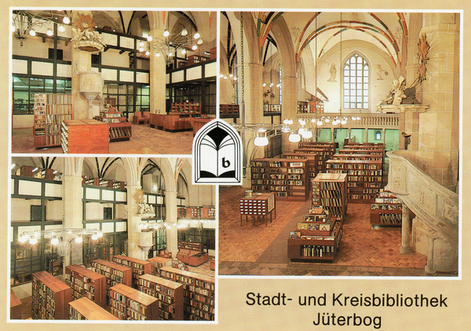

Nach einem Ansichtskartenausflug ins kanadische Oshawa
([https://doi.org/10.18452/23478](https://doi.org/10.18452/23478))
bleiben wir diesmal bibliophilokartistisch im Nahbereich, nämlich in
Jüterbog im Fläming. Das vorliegende Exemplar schickte mir mein
Redaktionskollege Karsten Schuldt im Juli, leider nicht aus Jüterbog
selbst, sondern aus Berlin-Neukölln. Meine Freude ist dadurch jedoch in
keiner Weise getrübt. Vielmehr freue ich mich, dass die Passion
Ansichtskarte auch innerhalb der Redaktion ein Echo findet und hoffe
insgeheim auf rege Nachahmung.

Es ist ja auch ein schönes Medium, wenngleich das gezeigte Exemplar die
Designpurist\*innen der Philokartie möglicherweise nicht in absolute
Verzückung versetzen wird. Die Mehrbildkarte aus dem Jahr 1989 ist
zugegeben auch weit entfernt von der kontraststarken Leistungsschau der
ostmodernen Architekturfotografie der 1960er Jahre. Sie steht für einen
Produktionstrend, der kennzeichnend für die Ansichtskartenherstellung
der DDR in den 1980er ist und einst in gewisser Weise als Schritt nach
vorn empfunden wurde. Denn lange waren Echt-Foto-Karten das Maß der
Dinge und zwar vor allem deshalb, weil sie günstiger und ohne den
Aufwand großer Druckmaschinerie hergestellt werden konnten. Ein
schlichtes Fotolabor war ausreichend. Später in der DDR kehrte sich das
mit den Fortschritten der Drucktechnologie und der Industrialisierung
der Bildproduktion um. Gerade für gewünschte größere Auflagen erwies
sich das Echt-Foto-Verfahren als unterlegen.

Der Fotograf Erasmus Schröter, in gewisser Weise der Begründer einer
spezifischen DDR-Philokartie, die er freilich nie so nannte, sammelte
und verarbeitete ausschließlich Echt-Fotos und zeigt dezidiert kein
Interesse an Farb- und Mehrbildkarten.[^1] Das ist auf den ersten,
zweiten und dritten Blick sehr nachvollziehbar, denn die zahllosen
Details, die eine raumerschließende Ansichtsfotografie so einsammelt --
ein Kind im Sprung, ein Hund im Springbrunnen, ein Mann am Fenster --,
zeigen sich auch besser auf echten Fotografien. Bei guten Abzügen kann
man die Details bis auf Hosenträgernähe heranzoomen und sich daran die
schönsten Geschichten über das Alltagsleben der DDR oder eines der
anderen Länder, die bis in die 1980er Jahre an der
Echt-Foto-Ansichtskartenkultur festhielten, ausdenken. Gerade die für
die Ansichtkartenfotografie der DDR typische Kombination aus
Inszenierungswillen und Prosaischem bereitet den aufmerksamen
Betrachter\*innen den Boden, um womöglich doch über das erstaunlichste
Detail zu stolpern.

Bei den Farbdrucken bringt der Griff zur Lupe in der Regel nur eine
Annäherung an die Drucktechnik selbst. Irgendwann schaut man nur noch
ins Buntraster. Das ist bei der Postkarte hier ein wenig schade, denn
gern würde man nachvollziehen, welche Bücher und Schallplatten in die
Aufstellung in der einstigen Mönchenkirche zu Jüterbog gelangt waren.
Wobei Menschen mit einer besonderen Spezialisierung in der
DDR-Schallplattengeschichte möglicherweise auch mit dem geringem
Informationsgehalt, den die Karte bietet, anhand der Cover die
eindeutigen AMIGA-Ausgaben identifizieren können. Die viel nachgefragten
Glanzstücke des Jahres 1989 (Die Ärzte, Kylie Minogue oder gar die EPs
der Electric Beat Crew und Die Skeptiker) sind es jedenfalls nicht. Das
Jahr 1989 wäre aber auch das falsche Bezugsjahr. Denn eine
Ansichtskarte, die im Druckhaus des Hauptverlags für Ansichtskarten in
der DDR, BILD UND HEIMAT im vogtländischen Reichenbach,1989 vom Band
läuft, basiert in der Regel auf Fotografien, die etwas früher entstanden
sind. Wann allerdings Heribert Darr, Großmeister der
DDR-Ansichtskartenfotografie, hier jedoch nicht unbedingt mit seiner
beeindruckendsten Arbeit, die Stadt- und Kreisbibliothek Jüterbog
ablichtete, ist erwartungsgemäß nicht genau datierbar.

Exakt überliefert ist dagegen die Eröffnung dieses eher späten
Bibliotheksbaus der DDR.[^2] Die einst Kirchen- und nun
Bibliothekspforte öffnete sich am 5. Oktober 1985, zwei Tage vor dem Tag
der Republik, vermutlich da sich ein Sonnabend immer besser zum
feierlichen Eröffnen anbietet als ein Montag. Beeindruckend war auf
jeden Fall bereits die Tatsache der Einrichtung einer neuen Bibliothek
im Baubestand und hier sogar in einer sehr schönen Klosterkirche aus dem
frühen 16. Jahrhundert.

Einmal mehr bewies sich Jüterbog als Ort der Bibliotheksinnovation. Denn
die erste öffentliche Bibliothek des Städtchens gab es ab 1876, was in
der Region Brandenburg ein erstaunlich frühes Datum darstellt.
Schallplatten, als neues Bibliotheksmedium, konnte man seit 1971
ausleihen. Das Problem war allerdings der Platz und je größer Bestand,
Nutzung und Nutzungsvielfalt wurde, desto enger wurde es auch. Vor dem
Umzug in die Franziskanerkirche stellte man die Bestände im Rathaus der
Stadt auf knapp 200 Quadratmetern der durchaus regen Nachfrage bereit,
was bei weitem nicht den Anforderungen entsprach.

Die Möglichkeit der Nutzung der Kirche war daher für die Bibliothek eine
glückliche Fügung. Und ebenso für das Gebäude, denn die funktionale
Neuausrichtung erwies sich als Rettungsanker, den die Arbeitsgruppe
Denkmalpflege der lokalen Vertretung des Kulturbunds der DDR nun endlich
erfolgreich auswerfen konnte. Die Kirche selbst war nämlich in den
1980ern schon länger keine als solche genutzte mehr, sondern ein Lager.
Bereits in den 1970ern entstand die Idee, sie als Bibliothek zu nutzen
-- ein entsprechendes Gutachten der Denkmalpflege erklärte sie 1980 für
geeignet. Kurz darauf beschlossen die beiden maßgeblichen Räte (Kreis
und Stadt), sich auf das Projekt einzulassen.

Für die Denkmalpflege der DDR, die es lange Zeit nicht besonders einfach
bei der Rettung historischer Bausubstanz hatte, war es ein willkommener
Anwendungsfall. Das Berliner Institut für Denkmalpflege und der
entsprechende sensibilisierte und engagierte Architekt Günter Köpping,
der sich bereits ab 1961 intensiv um das Kloster Zinna bemüht hatte,
entwickelten die Pläne für den Umbau, der von einer PGH (=
Produktionsgenossenschaft des Handwerks) "V. Parteitag" koordiniert
wurde. Diese entwickelten nicht nur ein Raumkonzept für eine Bibliothek
im Baubestand, sondern konnte so auch eine Reihe von kulturhistorisch
wichtigen Details wie Epitaphen oder Deckengemälden restaurieren.

![Abbildung 2: Ansichtskarte \[Detail\] Jüterbog Stadt und Kreisbibliothek. Reichenbach (Vogtland): BILD UND HEIMAT REICHENBACH (VOGTL). Farbfoto: Bild und Heimat (Darr), 1989. (A1/III/26/13 01 04 0844/05 K 300920/89)](img/Abb2.jpg)

Mit der auf der Karte gezeigten Phonothek wurden Ausleihe, Artothek und
Freihandbereich für die "Schöne Literatur" zentral in den Mittelraum des
Kirchengebäudes gesetzt.

Die Ansichtskartenperspektive auf die Schallplatten war aus Sicht derer,
die das Motiv in Auftrag gaben, anscheinend sogar würdig genug, um sie
parallel, also ebenfalls 1989, als Einzelbildkarte drucken zu lassen.
Beide Ausgaben erschienen unter derselben Motivdruckgenehmigungsnummer
(300920/89), was für diejenigen unter den Philokartist\*innen, die ihre
Sammlung über diese vermeintlich eindeutigen Identifikatoren
erschließen, eine kleine Herausforderung darstellt. Persönlich habe ich
diese dadurch gelöst, dass ich beide Exemplare in der selben
Klarsichthülle verwahre. Für diese Kolumne bedeutet der gesonderte
größere Abzug, dass ich noch etwas tiefer in die Auflösung hinein
mikroskopieren kann.

Zurück zur Bibliothek: Unter einer Galerie integrierte man die
Kinderbibliothek, auf der Galerie die Fachliteratur sowie in einem
zweiten Galeriegeschoss ein Magazin. Auf der Ansichtskarte wirkt es fast
so, als gäbe es auch einen schönen Lesebereich an der Balustrade. Für
einige Begeisterung sorgte die Tatsache, dass im Chor der Kirche ein
"Theater der Werktätigen" untergebracht werden konnte, das uns die
Ansichtskarte leider vorenthält. Dies und auch die Tatsache, dass mit
dem Jüterboger Backsteingewölbe meines Wissens erst- und einmalig in der
DDR eine Kirche zur öffentlichen Bibliothek wurde, macht das Haus zu
einem bis heute bibliotheksarchitekturgeschichtlichen einzigartigem
Objekt.

![Abbildung 3: Ansichtskarte \[Detail\] Jüterbog Stadt und Kreisbibliothek. Reichenbach (Vogtland): BILD UND HEIMAT REICHENBACH (VOGTL). Farbfoto: Bild und Heimat (Darr), 1989. (A1/III/26/13 01 04 0844/05 K 300920/89).](img/Abb3.jpg)

Nicht ganz einzigartig, aber durchaus besonders, ist die Ansichtskarte
auch in ihrer Motivwahl. Die Ansichtskartengeschichte der DDR markiert
in der Motivgeschichte der Philokartie einen Sonderweg, denn die vielen
kleinen, wenigen mittleren und der eine ganz große Ansichtskartenverlag
des Landes inventarisierten in gewisser Weise Dorf für Dorf und Stadt
für Stadt alles, was herzeigbar war und insbesondere dann, wenn es
repräsentierte, wie sich die sozialistische Gesellschaftsform Raum gab.
Umso mehr überrascht, wie vergleichsweise selten öffentliche
Bibliotheken eine Rolle spielten. Die Berliner Staatsbibliothek und die
Leipziger Deutsche Bücherei und ein paar historische Häuser mit
übergreifender kulturgeschichtlicher Bedeutung, zum Beispiel das
Goethe-Nationalmuseum, bereichern erwartbar den bibliophilokartistischen
Kosmos. Aber die zahllosen öffentlichen Bibliotheken brauchten
vermutlich schon eine besondere städtebauliche und künstlerische
Gestaltung, wie die Bibliothek des Erfurter Neubaugebiets an der
Vilniuser Straße, um als Motiv für Postkarten herzuhalten. Dies würde
sich mit der Einschätzung des Alltagshistorikers Alf Lüdtke decken, der
für die Fotografie der DDR, zu der auch die Ansichtskartenfotografie
gehört, unter anderem eine Motivpräferenz für "bildliche
Repräsentationen der öffentlichen Sphäre, des gebauten Raumes, von
Häusern und Städten und insbesondere symbolischen Bauten"
feststellt.[^3] Die großen Häuser in Berlin und Leipzig waren als
kulturgeschichtliche, teils aufgrund der Bestände westlicher Herkunft
sogar sehnsuchtsbeladenen, Leitsterne symbolisch aufgeladen und wurden
auch beispielsweise intensiv in der erzählenden Literatur gewürdigt. Die
musealen Bibliotheken gehörten zum normalen historisch-touristischen
Bildinventar wie Schlösser, Gärten und Burgen. In ähnlicher Weise mag
die eine oder andere Lesehalle eines Kurhauses oder die Ferienbibliothek
eines FDGB-Heimes zur Ehre einer Abbildung auf einer Ansichtskarte
gelangt sein. Auch der Neubau der Berliner Stadtbibliothek mit dem
berühmten A-Portal wurde auf Ansichtskarten gewürdigt. Aber von den
zahllosen kleinen Stadtbibliotheken findet sich nur eine geringe Menge
an Abbildungen auf Ansichtskarten, gefühlt beziehungsweise
sammlungsempirisch geringer noch als dies bei Kaufhallen, Freibädern
oder Polytechnischen Oberschulen der Fall ist.

Denkbar wäre noch, dass die Überlieferung und damit heutige
Verfügbarkeit für die Motivgruppe "Öffentliche Bibliotheken" der DDR
lückenhafter ist, weil die Auflagen klein und die Identifikation, die
einem bewussten Bewahren vorausgeht, mit der eigenen Schule möglicher
größer war, als die mit der eigenen Wohngebietsbibliothek. Dies könnte
auch erklären, weshalb aus den späten 1980er Jahren und bis 1990
verstärkt BILD UND HEIMAT-Ausgaben zu öffentlichen Bibliotheken zu
finden sind. Das neue alte Haus in Jüterbog passt aber so oder so ins
Schema. Es ist repräsentativ und spielt zugleich im erwachten Zeitgeist
einer neuen Wertschätzung auch alter Bausubstanz in der DDR.

[^1]: Vergleiche Schröter, Erasmus: Achtzig Prozent Sonne -- Regen nie!
    In: Erasmus Schröter: Bild der Heimat. Die Echt-Foto-Postkarten aus
    der DDR. Berlin: Schwarzkopf & Schwarzkopf, 2002.

[^2]: Stadt- und Kreisbibliothek Jüterbog (Hrsg.), Günter Köpping:
    Rekonstruktion und neue Nutzung der ehemaligen Mönchenkirche in
    Jüterbog. Jüterbog, 1985

[^3]: Lüdtke, Alf: Kein Entkommen. Bilder-Codes und eigen-sinniges
    Fotografien. In: Karin Hartewig, Alf Lüdtke (Hrsg.): Die DDR im
    Bild. Zum Gebrauch der Fotografie im anderen deutschen Staat.
    Göttingen: Wallstein, 2004. S. 227--236.
