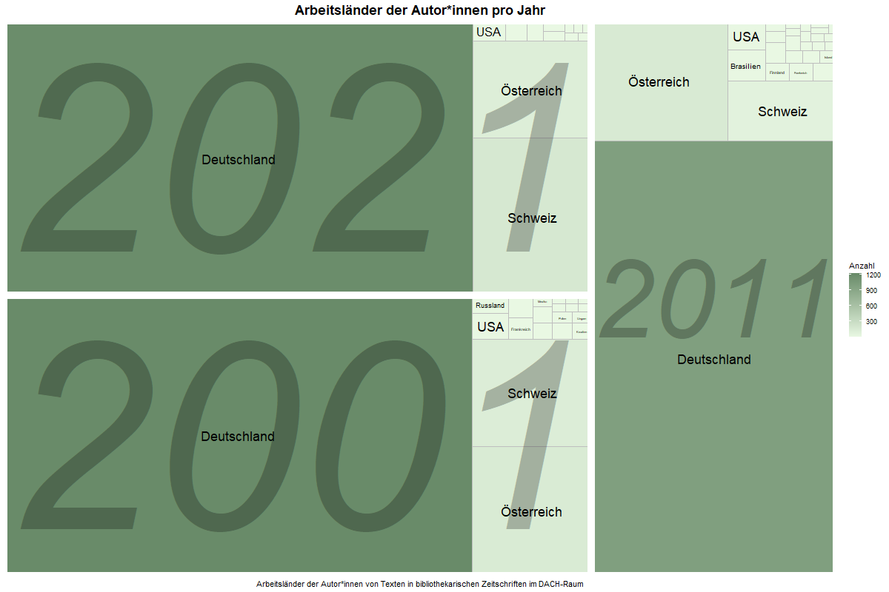
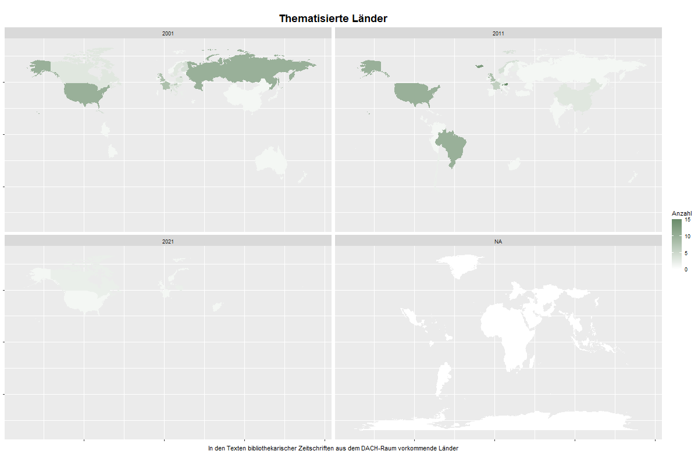

### 1. Einleitung

Fachpublikationen geben, neben anderen Funktionen, die sie haben, immer
auch einen Einblick in die jeweilige Profession, aus der sie stammen:
Was wird zu einem bestimmten Zeitpunkt in der Profession thematisiert?
Was nicht oder nicht mehr? Wie werden bestimmte Dinge genannt, welche
Sprache wird verwendet? Wer «spricht» in den Publikationen und wer
nicht? Sicherlich kann man Fachpublikationen und die jeweilige
Profession nicht in eins setzen: Was in ihnen publiziert wird, was zum
Thema wird und was nicht, ist immer das Ergebnis von Entscheidungen auf
verschiedenen Ebenen: Redaktionen, die Artikel zulassen oder nicht
zulassen, gar explizit zu ihnen einladen und inhaltliche Schwerpunkte
setzen. Autor\*innen, die bestimmte Themen aufgreifen und damit als
wichtig genug für eine Publikation bewerten. Einrichtungen, die ihre
Mitarbeitenden auffordern oder auch anweisen, über ein bestimmtes Thema
zu schreiben. Einrichtungen, die verhindern, dass über bestimmte Themen
geschrieben wird. Leser\*innen, die sich dazu äussern, ob sie bestimmte
Themen, Sprachformen, Textformen relevant oder nicht relevant finden.
Gleichzeitig prägen die Fachpublikationen immer, was überhaupt in der
Profession thematisiert wird und motivieren damit teilweise erst, dass
über ein Thema mehrfach publiziert wird. Kolleg\*innen lesen, was andere
geschrieben haben und reagieren (vielleicht) darauf. Leitungen nehmen
das, worüber geschrieben wird, als relevantes Thema wahr. Firmen
entwerfen Produkte auf der Basis dessen, was in der Literatur als zu
lösendes Problem beschrieben wird.

Dies war der gedankliche Hintergrund zu einer Studie, welche die
bibliothekarischen Fachzeitschriften des DACH-Raumes, die jeweils in den
Jahren 2001, 2011 und 2021 erschienen sind, miteinander verglich.[^1]
Die Daten und die Auswertung dieser Studie sind als Open Research Data
publiziert.[^2] Sie sind allerdings so umfangreich, dass die Darstellung
in mehreren Artikeln, die sich auf spezifische Fragen fokussieren,
erfolgt. In diesem Artikel hier wird es um Fragen der Internationalität
und Sprachenvielfalt in diesen Publikationen gehen. Diese Themenwahl
wird weiter unten begründet.

Aufgebaut ist der Text wie folgt. Im nächsten Kapitel (2.) werden die
konkreten Fragestellungen und Überlegungen hinter diesen dargestellt.
Darauf (3.) folgt eine kurze Darstellung der Methodik der Gesamtstudie
selbst, auf deren Basis die hier präsentierte Auswertung erfolgt.
Anschliessend (4.) werden im Hauptteil des Textes die betreffenden Daten
dargestellt und jeweils pro Frage ausgewertet sowie kommentiert. Im
letzten Kapitel (5.) wird eine übergreifende Bewertung der Ergebnisse
vorgenommen.

### 2. Fragestellungen

Diese Text fokussiert auf ein spezifisches Themenfeld, welches sich erst
während der eigentlichen Datenerstellung zur genannten Studie als
relevant herauskristallisierte, nämlich der Frage, wie sehr die
bibliothekarischen Publikationen im DACH-Raum -- und vermittelt damit
auch die nationalen Bibliothekswesen allgemein -- auf sich selber
bezogen oder aber gegenüber Themen und Beiträgen aus anderen Ländern und
Sprachen offen sind. Anders gesagt: Wie und wie sehr überhaupt die
Diskussionen und Entwicklungen aus anderen Bibliothekswesen und anderen
Sprachräumen in den Publikationen auftauchen. Und gleichzeitig, welche
Länder und Sprachräume[^3] die bibliothekarische Literatur abbildet. In
diesem Text wird dies auf verschiedenen Ebenen betrachtet: (1) Kurz, wie
multilingual die bibliothekarischen Publikationen sind. (2) Dann, wie
sehr sie innerhalb des DACH-Raumes miteinander vernetzt sind. (3) Und
schliesslich, wie sehr sie mit Bibliothekswesen aus anderen Sprachräumen
vernetzt sind und wie sehr sie über Entwicklungen in anderen
Sprachräumen berichten.

#### 2.1 Subjektive Faktoren bezüglich der Fragestellungen

Ich denke, mein Interesse an den Fragen, die ich in diesem Text
behandeln möchte, ist auch aufgrund meiner persönlichen Geschichte und
damit subjektiven Wahrnehmungen entstanden. Insoweit bin ich mir nicht
sicher, ob es einen Konsens darüber gibt, dass diese wichtig sind, auf
dem ich aufbauen kann oder ob ich zumindest meine Überlegungen hinter
den Fragen transparent darlegen muss. Deshalb weiche ich in diesem
Unterkapitel von dem sonst in wissenschaftlichen Texten geforderten
Anspruch der möglichst grossen Objektivität ab und schildere kurz mein
persönliches Interesse.

Seit einigen Jahren schreibe ich in die Kurzbiographien unter meinen
Texten, dass ich gleichzeitig in drei Städten lebe: Berlin, Chur und
Lausanne. Dahinter verbirgt sich, dass ich einerseits in Berlin gross
geworden bin und diese Stadt auch nicht wirklich verlassen habe, aber
gleichzeitig in die Schweiz gezogen bin. Ich bin aktuell sogar im
Prozess, die schweizerische Staatsbürgerschaft zu erwerben. In der
Schweiz lebe ich wechselnd zwischen dem Regionalzentrum Chur, in dem
mein Arbeitgeber angesiedelt ist und das unter anderem Hauptort des
einen Kantons ist, in welchem mit dem Rätoromanischen eine kleine, aber
lebendige eigene Sprachgemeinschaft -- die immerhin die vierte
Landessprache der Schweiz darstellt -- existiert, und der Grossstadt
Lausanne, in der grundsätzlich Französisch gesprochen wird. Zudem bin
ich in der DDR geboren und habe dort meine ersten Lebensjahre verbracht,
was mir weiterhin einen spezifischen Blick mit sich zu bringen scheint,
insbesondere darauf, wie schnell und umfassend (ungewollt) von anderen
über solche spezifischen Erfahrungen hinweggegangen und man
beispielsweise umstandslos zusammen mit Personen ohne diese Erfahrungen
zum «Deutschen» erklärt wird.

Was ich bei diesem Wechsel zwischen Ländern und Sprachregionen gelernt
habe, ist unter anderem, dass es tatsächlich kleine, aber relevante
Unterschiede gibt, in welchem der Länder und in welcher Sprachregion man
sich befindet und Teil welcher Sprachgemeinschaften man ist. Vieles ist
ähnlich, aber doch nicht gleich. Intellektuell ist dies gewiss auch so
klar, aber beim Leben in den drei Städten ist es spürbar, wie vieles
doch je ein wenig anders organisiert ist und anders verstanden werden
kann. Oder, wie bestimmte Probleme erst durch den lokalen Kontext
überhaupt als Problem erscheinen. Gleichzeitig wird so auch direkt
erlebbar, wie wenig man von diesen Unterschieden überhaupt weiss,
solange man sie nicht selber erlebt. Mir war zum Beispiel schon vor
meinem Zuzug in die Schweiz klar, dass das Leben in Berlin anders ist
als anderswo. Aber erst durch das Erleben, wie man anderswo tagtäglich
lebt, ist für mich auch in gewisser Weise «fühlbar» geworden, wie offen
und international das Leben in Berlin im Vergleich zu meinen anderen
Wohnorten ist. Dafür wurde mir aber auch klar, wie wenig man als «jemand
aus Berlin» über die Schweiz -- und dann wohl auch über andere Länder --
wirklich weiss. Das Gleiche gilt für Sprachen. Kultur, auch im gleichen
Land, ist immer auch an Sprache gebunden und daran, wie sehr eine
Sprache dominiert oder nicht dominiert. Das ist spürbarer, wenn man
selber einmal inmitten einer anderen Sprachgemeinschaft, in meinem Fall
der französischen und auch der Schweizerdeutschen (die wieder mehrere
Dialekte umfasst), gelebt hat oder versucht in einer der
nicht-dominanten Sprachgemeinschaften, in meinem Fall die
rätoromanische, «hineinzuschnuppern».

Durch meine Beschäftigung mit dem schweizerischen Bibliothekswesen,
nachdem ich für die Arbeit im deutschen Bibliothekswesen ausgebildet
wurde, ist mir auch klar geworden, wie national unterschiedlich diese
Bibliothekswesen -- und dann auch, in der Schweiz, nochmal
unterschiedlich in den verschiedenen Sprachregionen -- sind. Immer
ähnlich, aber nie gleich.

Mein Interesse an den Fragen in diesem Text scheint mir deshalb auch aus
meinen persönlichen Erfahrungen zu stammen. Intellektuell hätte ich sie
wohl auch stellen können, wäre ich immer in Berlin wohnen geblieben.
Aber vor dem Hintergrund meiner persönlichen Geschichte scheinen sie mir
noch relevanter. Für mich ist klar, dass es von Bedeutung ist, ob, wie
oft und wie Entwicklungen aus anderen Ländern in der bibliothekarischen
Fachliteratur diskutiert werden oder ob die Sprachenvielfalt einer
Region abgebildet wird. Daraus motivieren sich die im Folgenden
gestellten Fragen.

#### 2.2 Sprachen in der bibliothekarischen Fachliteratur

Die erste Frage, die in diesem Text angegangen wird, lautet: *In welchen
Sprachen wird in der bibliothekarischen Fachliteratur des DACH-Raumes
publiziert?*

Relevant ist diese Frage aus zwei Gründen. Einerseits ist keines der
drei Länder monosprachig. In der Schweiz gibt es bekanntlich vier
Landessprachen, in Deutschland und Österreich jeweils mehrere explizit
anerkannte und geförderte Minderheiten- und Regionalsprachen wie zum
Beispiel das Niederdeutsch oder das Burgenlandkroatisch. Gleichzeitig
werden in all diesen Ländern von einem Grossteil der Bevölkerung
zahlreiche weitere Sprachen gesprochen, auch im Alltag (beispielsweise
Englisch, aber auch, je nach Land unterschiedlich verteilt, Türkisch,
Arabisch, Tamilisch, Vietnamesisch, Spanisch und viele andere). Spiegelt
sich diese mehrsprachige Realität in der bibliothekarischen Literatur
eigentlich wieder?

Andererseits wird in anderen Ländern in anderen Sprachen kommuniziert.
Wie geht die bibliothekarische Fachpresse damit um? Übernimmt sie
Originaltexte? Lässt sie Autor\*innen in ihren Sprachen schreiben?

Gleichzeitig ist es im internationalen Bibliothekswesen wohl (so meine
Vermutung) auch so, dass Autor\*innen einfacher wahrgenommen werden,
wenn sie in Englisch publizieren. Spiegelt sich dies vielleicht auch
darin wieder, dass in den bibliothekarischen Zeitschriften des
DACH-Raumes relativ viel in Englisch publiziert wird? Oder sind dies
wohl eher zwei getrennte Publikationswesen, eines in Englisch und eines
in Deutsch (oder den anderen Sprachen, die im DACH-Raum gesprochen
werden)?

#### 2.3 Vernetzung über die Landesgrenzen hinaus

Die zweite Frage lautet: *Wird über die Landesgrenzen des DACH-Raumes
hinaus publiziert und wenn ja, in welchem Masse?*

Dass die Länder des DACH-Raumes eng miteinander verwoben sind, ist eine
implizite Annahme hinter der gesamten Studie, aus der die hier
ausgewerteten Daten stammen. Menschen wechseln mit relativer
Leichtigkeit zwischen diesen Ländern und können sich durch die
gemeinsame Sprache zum Beispiel auch gut miteinander verständigen.
Intuitiv würde man dies auch für die Bibliothekswesen und die
bibliothekarischen Publikationen erwarten. Aber: Stimmt das oder sind
bibliothekarische Fachpublikationen auch innerhalb des DACH-Raumes vor
allem an Themen aus dem eigenen Land interessiert? Wie hat sich dies
über die drei untersuchten Jahre (2001, 2011, 2021) hinweg entwickelt?

#### 2.4 Arbeitsländer der Autor\*innen

In der dritten Frage wird dann praktisch die zweite auf den
internationalen Raum ausgedehnt: *In welchen Ländern sind Autor\*innen
in den bibliothekarischen Fachpublikationen des DACH-Raumes beruflich
aktiv?*

Hier geht es darum herauszufinden, ob die bibliothekarischen
Publikationen im DACH-Raum auch auf das Wissen von Autor\*innen aus
anderen Ländern -- und dann welchen -- zurückgreifen. Wieder gibt es
dabei eine implizite Vermutung, nämlich dass Wissen über die
Besonderheiten, Probleme und Diskussionen eines Bibliothekswesens in
einem Land vor allem bei Personen vorhanden ist, die auch dort arbeiten
und leben. Es gibt immer auch, das führt dann zur vierten Frage, die
Möglichkeit, dass Personen andere Länder besuchen und über diese Besuche
berichten oder aber sich aus dem DACH-Raum heraus über das
Bibliothekswesen in anderen Ländern informieren. Aber dies führt
tendenziell wohl eher dazu, zusammenfassende Überblicke zu produzieren
oder Einzeldarstellungen, die weniger lokal kontextualisiert sind.

Sicherlich lassen sich immer Einzelfälle postulieren, welche diese
impliziten Annahmen aufheben. Kolleg\*innen können beispielsweise in
einer Bibliothek oder Hochschule nahe einer Landesgrenze arbeiten, aber
in einem anderen Land wohnen -- beispielsweise in Aachen tätig sein,
aber in Lüttich wohnen, dort oft mit belgischen Bibliothekar\*innen über
das belgische Bibliothekswesen kommunizieren und somit ein fundiertes
Wissen über dieses Bibliothekswesen haben. Aber das werden, wenn es
diese Personen tatsächlich gibt, Ausnahmen sein.

#### 2.5 Internationale Themen

Die vierte Frage geht auf den Inhalt der Publikationen ein: *Über welche
Länder wird in den bibliothekarischen Publikationen des DACH-Raumes
berichtet?*

Bei dieser Frage geht es darum, zu verstehen, wie international die
bibliothekarischen Fachpublikationen im DACH-Raum orientiert sind. Wird
in ihnen über Themen aus anderen Ländern berichtet? Wenn ja, wie viel
und über welche Länder -- oder auch, über welche Länder nicht? Gab es
dabei über die Zeit Veränderungen? Diese Fragestellung zielt also
darauf, ob in der bibliothekarischen Fachpresse Entwicklungen, Probleme
und Lösungen aus anderen Ländern wahrgenommen werden. Oder, um dies
umzudrehen, ob sich eher auf das jeweils eigene Land oder den DACH-Raum
konzentriert wird.

### 3. Methodik und Datenlage

Für die Studie, über deren Teilauswertung zu den im letzten Kapitel
genannten Fragen hier berichtet wird, wurden vom Autor dieses Textes
Daten erhoben zu allen Beiträgen aus bibliothekarischen Zeitschriften,
die jeweils in den Jahren 2001, 2011 und 2021 im DACH-Raum erschienen.
Dies geschah auf der Basis eines vor der Datensammlung erstellten
Schemas. Beispielsweise wurden die Namen, Funktionen und beruflichen
Aufgaben der Autor\*innen aufgenommen, ebenso deren Arbeitsorte, aber
auch die Publikationsorte und herausgebenden Körperschaften der
Zeitschriften. Der Inhalt der Texte wurde in frei vergebenen
Schlagworten, welche möglichst die in den Texten verwendeten Begriffe
verwendeten, beschrieben. Die Texte wurden alle nach Autopsie
aufgenommen, also direkt eingesehen. Bei den -- erstaunlich vielen --
Zeitschriften, die nur gedruckt vorliegen, musste der Autor dafür auf
Bibliotheksbestände in verschiedenen Städten zurückgreifen.[^4] Zudem
wurden, um die Arbeitslast einzuschränken, einige Grenzen gesetzt:

-   Es wurden nur Zeitschriften betrachtet, in denen sich direkt an
    Bibliothekar\*innen und Bibliotheken gerichtet wurde. Somit wurden
    zum Beispiel Zeitschriften, mit denen sich Bibliotheken an die
    breite Öffentlichkeit oder direkt an ihre Nutzer\*innen richten,
    ausgeschlossen.

-   Ebenso wurde als Grenze angelegt, dass in einer Zeitschrift im
    untersuchten Jahrgang mindestens 50% der Texte aus Bibliotheken
    stammen, sich mit Bibliotheken beschäftigen oder sich explizit an
    Bibliotheken richten müssen. Damit wurden leider gerade auch
    Zeitschriften ausgeschlossen, in denen Bibliotheken und andere
    Einrichtungen miteinander kommunizieren, wie etwa archivarische
    Zeitschriften oder -- für den Autor überraschend -- eine
    Fachzeitschrift wie die *Bausteine Forschungsdatenmanagement*.

-   Viele bibliothekarische Zeitschriften veröffentlichen auch kurze
    Meldungen, die manchmal nur wenige Zeilen lang sind. Auch diese in
    die Daten aufzunehmen, war wegen der dann noch höheren Arbeitslast
    unmöglich. Deshalb wurde die Grenze gesetzt, dass ein Beitrag
    mindestens eine Seite umfassen muss, um in den Daten verzeichnet
    zu werden. (Für rein elektronische Zeitschriften ohne Seitenzahlen
    wurde der Wert von mindestens 2000 Zeichen angesetzt.) Dies ist
    keine perfekte Grenzziehung, da die Formate der Zeitschriften zum
    Beispiel sehr unterschiedlich sind, aber eine handhabbare.

-   Daten zu den Autor\*innen wurden jeweils so gut wie möglich in den
    Datensatz aufgenommen. Aber insbesondere bei den beiden weiter
    zurückliegenden Jahrgängen 2001 und 2011 war es zum Beispiel nicht
    immer möglich, herauszufinden, in welcher Funktion ein\*e
    Autor\*in zum damaligen Zeitpunkt arbeitete. (Für 2021 war dies in
    den meisten Fällen noch recherchierbar.) Für die hiesige
    Auswertung relevant ist, dass auch jeweils das Land, in dem die
    Autor\*innen arbeiteten, aufgenommen wurde.

Basis für die Recherche danach, welche bibliothekarischen Zeitschriften
in den drei untersuchten Jahren im DACH-Raum existierten, waren zum
einen die Zeitschriftendatenbank (ZDB) sowie -- für die Bestände in den
schweizerischen Bibliotheken, die in dieser Datenbank nicht verzeichnet
sind -- der Gesamtkatalog der Wissenschaftlichen Bibliotheken der
Schweiz, Swisscovery. Zum anderen führt der Autor für ein privates,
bislang nicht veröffentlichtes, Projekt seit Jahren eine Liste aller
bibliothekarischen Zeitschriften (und anderen Medien) aus dem DACH-Raum
seit den 1880er Jahren, auf die er bei anderen Recherchen stösst. Diese
Quellen zusammengenommen ergaben eine, sich teilweise ergänzende,
Sammlung von betreffenden Zeitschriften, von denen einige nach Autopsie
nicht in die Daten der Studie aufgenommen wurden, weil sie den gerade
genannten Kriterien nicht entsprachen.[^5]

Die Daten wurden anschliessend auf verschiedene Fragen hin in der
Statistiksprache R ausgewertet. Zumeist ging es dabei darum, Anzahl und
Verteilung von Werten über die drei untersuchten Jahre miteinander zu
vergleichen. Die gesammelten Daten, R-Skripte sowie die in der
Auswertung erstellten Plots und Daten aus den Auswertungen wurden, wie
zuvor bereits gesagt, als Open Research Data veröffentlicht und lassen
sich somit sowohl nachnutzen als auch überprüfen und verbessern.[^6]

Begonnen wurde die Studie im März 2022 und beendet im September des
gleichen Jahres. Insgesamt wurden Daten zu 4459 Texten (2001: 1591,
2011: 1331, 2021: 1537) aus 90 Zeitschriftenjahrgängen (2001: 34, 2011:
28, 2021: 28) aufgenommen.

Selbstverständlich hat die Studie eine ganze Anzahl von Einschränkungen.

-   Sie war als Vollerhebung angelegt, aber es war dem Autor nicht
    möglich, alle betreffenden Zeitschriften einzusehen. Es fehlt
    weiterhin eine kleine Anzahl von -- nur gedruckt und
    höchstwahrscheinlich auch nur für einen kleinen Kreis von
    anvisierten Leser\*innen publizierten -- Zeitschriften.[^7]
    Allerdings sind die wichtigsten, also vor allem die jeweils auf
    das gesamte Bibliothekswesen gerichteten Zeitschriften sowie alle
    elektronisch zugänglichen Zeitschriften, im Datensatz enthalten.

-   Die Studie wurde von einer Person -- dem Autor -- durchgeführt,
    insoweit basiert zum Beispiel auch die Vergabe von
    Inhaltsschlagworten auf den Einschätzungen dieser Person. Auch ist
    zu erwarten, dass die Daten weiterhin kleine Fehler (Tippfehler,
    Verwechslungen und Ähnliches) enthalten. Sie sollten als jeweils
    möglichst objektive Annäherung verstanden werden. Dies ist nicht
    perfekt, war aber die einzige realistische Möglichkeit, die Studie
    überhaupt durchzuführen. Zudem ist zu vermuten, dass sich etwaige
    Fehler über die Daten hinweg streuen und sich nicht zum Beispiel
    in einem Jahrgang oder bei den Daten zu einer Zeitschrift
    konzentrieren.

-   Wichtiger aber ist die Einschränkung auf Zeitschriften.
    Bibliothekar\*innen publizieren und kommunizieren
    selbstverständlich auch in anderen Medien: Monographien, Weblogs,
    Facebook-Gruppen und so weiter. Insoweit wird hier in der
    Auswertung nur ein, wenn auch wichtiger Teil, aller Kommunikation
    zwischen Bibliothekar\*innen und Bibliotheken betrachtet.

Die konkreten ausgewerteten Fragen, die über die hier berichteten
hinausgehen, lassen sich selber in den R-Skripten sowie den Graphiken
und ausgewerteten Daten im schon genannten Datensatz nachvollziehen. Sie
werden, wie erwähnt, an anderen Stellen detaillierter ausgewertet.
Grundsätzlich sollten aber alle hier präsentierten Daten als möglichst
grosse Annäherung an die Realität verstanden werden.

### 4. Ergebnisse

In diesem Kapitel werden nun, orientiert an den in Kapitel 2 genannten
Fragen, die betreffenden Ergebnisse berichtet. Anschliessend wird über
einige Beobachtungen berichtet, die ebenfalls zum Themenfeld gehören und
bei der eigentlichen Datensammlung auffielen.

#### 4.1 Sprachen in der bibliothekarischen Fachliteratur

| **    Sprache   **  | **    Anzahl 2001   ** | **    Anzahl 2011   ** | **    Anzahl 2021   ** |
|---------------------|------------------------|------------------------|------------------------|
|     Deutsch         |     1.568              |     1.341              |     1.513              |
|     Französisch     |     42                 |     16                 |     35                 |
|     Englisch        |     21                 |     10                 |     12                 |
|     Italienisch     |     1                  |     1                  |     3                  |
|     Mehrsprachig    |     -                  |     -                  |     16                 |
|     Russisch        |     3                  |     -                  |     -                  |
*Tabelle 1: Anzahl der Artikel in der jeweiligen Sprache*

Für die Frage, in welchen Sprachen in der bibliothekarischen Literatur
im DACH-Raum publiziert wird, und für welche die Daten in der Tabelle
1[^8] berichtet werden, ist die Antwort sehr eindeutig: Fast durchgängig
wird in Deutsch publiziert, alles andere sind Ausnahmen. Nicht direkt in
dieser Tabelle sichtbar, aber bei der Datenaufnahme selber, war, dass es
sich hierbei auch fast ausnahmslos um das in der Schweiz sogenannte
«Schriftdeutsch» handelt, also um ein Deutsch, dass möglichst von
landesspezifischen oder lokalen Besonderheiten frei ist und auch nicht
einen Dialekt darstellt. Einige Helvetismen (beispielsweise, dass ß
nicht zu nutzen) oder österreichische Eigenheiten (beispielsweise Jänner
als Name des ersten Monats im Jahr) finden sich schon. In den Titeln
einiger Konferenzen, über die berichtet wurde, wurden auch Dialekte des
Deutschen verwendet. Aber ansonsten ist das verwendete Deutsch sehr
normiert.

Zudem fanden sich alle Texte, die in Französisch oder Italienisch
publiziert wurden, in schweizerischen Zeitschriften, also dem Land des
DACH-Raumes, in welchem diese Sprachen auch Landessprache sind. Ebenso
sind die in der Tabelle genannten 16 mehrsprachigen Texte immer Deutsch
/ Französisch oder Deutsch / Französisch / Italienisch. Diese finden
sich alle in einer Zeitschriften, der *bibliosuisse info*, die vom
schweizerischen Bibliotheksverband herausgegeben wird. Es sind, bis auf
einige Interviews, in denen Fragen und Antworten in jeweils
verschiedenen Sprachen publiziert sind, kurze Texte, die nebeneinander
in den zwei oder drei Sprachen dargeboten werden.[^9]

Die beiden anderen in der Tabelle sichtbaren Ausnahmen sind Englisch und
Russisch. Auch die russischen Texte finden sich nur in einer
spezifischen Zeitschrift, den *Mitteilungen der Arbeitsgemeinschaft der
Bibliotheken und Dokumentationsstellen der Ost-, Ostmittel- und
Südosteuropaforschung (ABDOS) e.V.*, die sich vor allem an Kolleg\*innen
richtete, bei denen zumindest passive Sprachkenntnisse des Russischen
als Arbeitsvoraussetzung gelten konnten.

Erstaunlich ist eher, wie wenige Texte in den bibliothekarischen
Zeitschriften im DACH-Raum in Englisch publiziert werden.
Bibliothekar\*innen aus dem DACH-Raum publizieren vermutlich in
Zeitschriften aus anderen Sprachräumen in dieser Sprache, aber das ist
nicht Fokus dieser Studie. Trotzdem könnte man im DACH-Raum auf weit
verbreitete, zumindest passive Kenntnisse des Englischen voraussetzen,
aber auf diese wird offenbar in den Zeitschriften kaum aufgebaut.

Grundsätzlich heisst dies, dass die bibliothekarische Kommunikation im
DACH-Raum praktisch in einer Sprache passiert. Die vierte schweizerische
Landessprache, die anerkannten und geförderten Minderheitensprache in
Deutschland und Österreich sowie all die sonstigen im Alltag
gesprochenen Sprachen werden dafür nicht genutzt. Warum das so ist, ist
aus den Daten alleine nicht zu bestimmen. Auffällig ist aber, dass es
dabei über die untersuchten 20 Jahre keine wirkliche Veränderung gab.
Festgehalten werden kann aber schon, dass für Menschen, für die Deutsch
nicht die erste Sprache ist, hier eine Hürde besteht, sowohl für die
passive Wahrnehmung als auch die aktive Teilnahme an der
Kommunikation.[^10] Mit einem Blick aus der Schweiz, in der eine
Unterscheidung zwischen Schriftsprache und gesprochenem Dialekt gemacht
wird, ist auch das Vorherrschen des «Standarddeutschen» auffällig.

Die sprachliche Vielfalt, die es im DACH-Raum gibt (und die sowohl mit
dem steigenden Bildungsstand der Bevölkerung als auch dem Status als
Migrationsgesellschaften wohl nur wächst), ist in der bibliothekarischen
Literatur nicht abgebildet.[^11]

Dies gilt dann auch für Personen, die vielleicht von ausserhalb des
deutschen Sprachraumes ein Interesse daran entwickeln könnten, in den
bibliothekarischen Zeitschriften des DACH-Raumes zu publizieren. Die
Daten zeigen, dass dies offenbar in Ausnahmefällen in Englisch möglich
ist. Aber auch das kann für solche Personen eine Fremdsprache sein. Dies
ist deshalb relevant, weil es damit schwierig wird, sich zum Beispiel
vorzustellen, dass ein\*e Bibliothekar\*in aus Kroatien oder Island sich
entschliesst, Fragen und Entwicklungen aus dem Bibliothekswesens des
Landes, in dem sie in Bibliotheken arbeitet, in diesen Zeitschriften
vorzustellen, um zu einem Austausch über diese einzuladen. Wenn, dann
wird dies wohl nur auf direkte Einladung aus den Redaktionen der
bibliothekarischen Zeitschriften oder anderer Bibliothekar\*innen hin
geschehen.

#### 4.2 Vernetzung über die Landesgrenzen hinaus

| **    Arbeitsland Autor*in   ** | **    Sitz (Land) der herausgebenden Körperschaft   ** | **    2001   ** | **    2011   ** | **    2021   ** |
|---------------------------------|--------------------------------------------------------|-----------------|-----------------|-----------------|
|     Deutschland                 |     Deutschland                                        |     1.225       |     985         |     1.204       |
|     Österreich                  |     Deutschland                                        |     26          |     15          |     24          |
|     Schweiz                     |     Deutschland                                        |     15          |     16          |     58          |
|     Deutschland                 |     Österreich                                         |     5           |     15          |     5           |
|     Österreich                  |     Österreich                                         |     119         |     138         |     84          |
|     Schweiz                     |     Österreich                                         |     1           |     1           |     1           |
|     Deutschland                 |     Schweiz                                            |     3           |     3           |     22          |
|     Österreich                  |     Schweiz                                            |     -           |     -           |     -           |
|     Schweiz                     |     Schweiz                                            |     104         |     45          |     117         |
*Tabelle 2: Vergleich Arbeitsländer und Sitz der Körperschaften*

Um die Stärke der Vernetzung -- oder, wie die Daten zeigen, eher
Schwäche -- im Bibliothekswesen innerhalb des DACH-Raumes zu
untersuchen, wurden die Arbeitsländer der Autor\*innen und die Länder,
in denen die herausgebenden Körperschaften der Zeitschriften sitzen,
miteinander verglichen. Die Arbeitsländer wurden gewählt, da diese
erstens einfacher zu eruieren sind als die Wohnorte der Autor\*innen und
zweitens eindeutigere Aussagen ermöglichen. Dass Menschen in mehr als
einem Land leben, zumal bei direkten Grenzen wie im DACH-Raum, ist
weniger ungewöhnlich, als dass sie in verschiedenen Ländern arbeiten.
Aber selbstverständlich gibt es auch hier Grenzfälle, wenn zum Beispiel
Bibliothekar\*innen auch Lehraufträge an Hochschulen eines Nachbarlandes
wahrnehmen. In diesen, sehr wenigen Fällen, wurde jeweils das Land
aufgenommen, in denen die Autor\*innen offenbar hauptsächlich aktiv
sind.

Zu vermerken ist -- dies gilt dann auch für die nächste Frage --, dass
eine ganze Anzahl von Personen in der bibliothekarischen Fachpresse auch
publiziert, ohne einen Arbeitsort anzugeben. Teilweise sind dies
Personen, die trotz Rentenalter weiterhin aktiv sind, insbesondere beim
Schreiben von Rezensionen. Teilweise sind es auch Personen, die gerade
ihre Ausbildung oder ihr Studium abgeschlossen haben und oft die
Ergebnisse ihrer Abschlussarbeiten vorstellen, aber wohl noch auf der
Suche nach dem Einstieg in den Arbeitsmarkt sind. In den meisten Fällen
ist aber auch bei Autopsie der Artikel nicht sichtbar, warum keine
Angaben zum Arbeitsort gemacht werden.[^12] Auch hier wurde bei der
Datenaufnahme so verfahren, dass Arbeitsländer aufgenommen wurden, wenn
diese mit einiger Sicherheit -- beispielsweise, weil den
Autor\*innennamen auch Privatadressen beigefügt wurden -- bestimmt
werden konnte. Ansonsten wurden keine Arbeitsländer aufgenommen (diese
Autor\*innen fehlen dann in der Teilauswertung, die in der obigen
Tabelle 2 dargestellt wird).

Beim Sitz der herausgebenden Körperschaft gab es nur eine Zeitschrift,
die von einer Körperschaft aus einem Land in Zusammenarbeit mit einer
Körperschaft aus einem anderen Land herausgeben wurde, die *Giraffe:
Bibliotheken für Kinder und Jugendliche im Blick*, herausgegeben von der
*Kommission des Ehemaligen Deutschen Bibliotheksinstituts für Kinder-
und Jugendbibliotheken* in Zusammenarbeit mit dem *Büchereiverband
Österreich (BVÖ)*. Die Zeitschrift erschien nur drei Jahre lang, davon
aber eines im hier ausgewerteten Jahr 2001. Hier wurde sich, mit Blick
auf die Beiträge, die dann in der Zeitschrift tatsächlich publiziert
wurden, dafür entschieden, nur Deutschland als Sitz der Körperschaft
aufzunehmen, da es nicht so scheint, als hätte der BVÖ einen grossen
Einfluss auf die Zeitschrift gehabt. Ansonsten war die Zuordnung immer
eindeutig.[^13]

Zu beachten ist zudem, dass hier jeweils nach individuellen Autor\*innen
gefragt wurde, unabhängig davon, wie viele Texte diese in einem Jahr
publiziert haben. Hätte man dies einbezogen, wären die Ergebnisse noch
eindeutiger: Mit drei Ausnahmen (Rafael Ball, Stephan Holländer, Karsten
Schuldt) haben alle Autor\*innen in anderen Ländern als ihren
Arbeitsländern höchstens ein oder zwei Artikel pro Jahr publiziert,
wovon ein Autor dies auch noch als Redakteur getan hat, der vor allem
Editorials publizierte. Die «Vielschreiber\*innen» publizierten alle in
dem Land, in dem sie selber arbeiteten.

Aber auch wenn man all diese Grenzfälle mit beachtet, sind die Daten,
welche in Tabelle 2 dargestellt werden, wieder eindeutig. Es gibt
zumindest bei den Texten, die in den bibliothekarischen Zeitschriften
publiziert werden, im DACH-Raum kaum eine Vernetzung über die
Landesgrenzen hinaus. Eine mögliche Tendenz deutet sich dabei an, dass
2021 mehr Autor\*innen aus der Schweiz in «deutschen» Zeitschriften
publizierten. Man muss aber die nächsten Jahre abwarten oder weitere
Jahrgänge bibliothekarischer Zeitschriften auswerten, um zu sehen, ob
dies eine allgemeine Entwicklung ist. Gleichzeitig ist offenbar der
Anteil der Autor\*innen aus Deutschland in schweizerischen Zeitschriften
gestiegen, aber nicht über den gesamten Zeitraum hinweg, sondern «nur»
im Jahr 2021.

Dessen ungeachtet ist sichtbar, dass Autor\*innen aus einem Land vor
allem in Zeitschriften aus eben diesem Land publizieren. Das heisst
auch, dass die Entwicklungen aus den zwei anderen Bibliothekswesen im
DACH-Raum in den jeweils anderen Ländern wohl kaum sichtbar sind.

Das hat Konsequenzen. Beispielsweise überwiegen Zeitschriften aus
Deutschland. Von den nicht lokal orientierten werden in Österreich nur
die *Mitteilungen der Vereinigung Österreichischer Bibliothekarinnen &
Bibliothekare* und in der Schweiz die *Informationspraxis* und *027.7 --
Zeitschrift für Bibliothekskultur* herausgegeben. Die restlichen --
beispielsweise, aber nicht erschöpfend, die *BuB: Forum Bibliothek und
Information*, der *Bibliotheksdienst*, die *ZfBB: Zeitschrift für
Bibliothekswesen und Bibliographie*, *o-bib. Das offene
Bibliotheksjournal* oder auch die *LIBREAS. Library Ideas* -- haben
ihren Sitz in Deutschland. In ihnen finden sich dann auch zumeist
Beiträge, die sich auf Entwicklungen, Diskussionen, Probleme und
Lösungen aus dem deutschen Bibliothekswesen fokussieren. Für
Kolleg\*innen in Österreich oder der Schweiz, sind diese Artikel
vermutlich oft weniger relevant, als für solche aus Deutschland.
Bedenklich wird dies wohl vor allem, wenn dieser Fokus auf ein Land
vergessen geht und die Inhalte als typisch für alle Bibliothekswesen
angesehen werden.

#### 4.3 Arbeitsländer der Autor\*innen

Die Frage nach den Arbeitsländern der Autor\*innen aus der zweiten Frage
wird für die dritte Frage auf die gesamte Welt ausgeweitet. Die
konkreten Daten dazu finden sich in der Tabelle 4 im Anhang.
Visualisiert sind sie in der Graphik 1, damit das grundsätzliche
Ergebnis noch besser zu sehen ist. Die Anzahl der Autor\*innen ist
jeweils in der Grösse der Kästchen als auch noch einmal im Farbton zu
sehen: Je grösser der Kasten und je dunkler das Grün, umso grösser die
Anzahl. (Zu sehen ist hier auch, dass die Zahl der individuellen
Autor\*innen über die drei untersuchten Zeiträume gewachsen ist, aber
dies ist nicht eine Frage der hier präsentierten spezifischen
Auswertung.)

Das Autor\*innen von Texten, die in bibliothekarischen Zeitschriften im
DACH-Raum publizierten, nicht im DACH-Raum selber arbeiten, stellt eine
Ausnahme dar. In der Treemap in der Graphik zeigt sich dies zum Beispiel
darin, dass die Namen der Arbeitsländer in vielen Fällen vom Platz her
gar nicht in die Kästchen, welche die Anzahl der Autor\*innen
repräsentieren, passen.

Die Ergebnisse sind sogar noch weiter einzugrenzen: Ein Grossteil der
Texte von Autor\*innen aus anderen Ländern als dem DACH-Raum erschienen
in Schwerpunkten. Beispielsweise publiziert die *BuB: Forum für
Bibliothek und Information* jährlich einen Schwerpunkt über das Land,
welches bei der Frankfurter Buchmesse als Gastland eingeladen wurde. In
diesem Schwerpunkt werden dann meist auch Autor\*innen aus diesem Land
gebeten, eine Übersicht über Literatur und Bibliothekswesen dieses
Landes zu geben. Es sind also nicht Einzelbeiträge, die sich mit
spezifischen Themen beschäftigen, sondern vor allem Texte, die einen
Überblick geben, der dann notwendigerweise oft skizzenhaft ist oder sich
auf sehr ausgesuchte Beispiele konzentriert. Oft sind diese Autor\*innen
dann die einzigen aus ihrem Land, welche im gesamten Jahr in den hier
untersuchten Zeitschriften publizieren. Dies gilt zum Beispiel auch für
alle Autor\*innen, die in der Graphik im Jahr 2011 unter dem Landesnamen
«Brasilien» angegeben werden und die auf einen Schwerpunkt zum
brasilianischen Bibliothekswesen in der zweiten Ausgabe der *Bibliothek
-- Forschung und Praxis* in diesem Jahr zurückgehen. Eine andere
Einschränkung ist, dass eine nicht geringe Anzahl von
Bibliothekar\*innen verschiedener Goethe-Institute in der
bibliothekarischen Fachpresse im DACH-Raum publizieren (auch, aber nicht
nur, vor allem jeweils Überblicke zu Bibliothekswesen des Landes, in dem
sie jeweils aktuell arbeiten). Sie arbeiten dann ausserhalb des
DACH-Raumes, aber für einen Verein mit Sitz in München und mit einem
Fokus auf Deutschland.

Doch selbst dann bewegt sich die Anzahl der Autor\*innen aus Ländern,
die in der Treemap immerhin sichtbar sind, jeweils im einstelligen oder
sehr niedrigen zweistelligen Bereich pro Jahr. Sie veröffentlichen dann
im untersuchten Zeitraum in den untersuchten Zeitschriften auch fast
immer genau diesen einen Artikel und nicht etwa mehrere.

Festgehalten werden kann also, dass die Bibliothekswesen im DACH-Raum
zumindest in ihren Zeitschriften vor allem von Autor\*innen aus dem
DACH-Raum selber informiert werden. Selbstverständlich können auch diese
über andere Länder schreiben -- was Thema der nächsten Frage ist --,
aber das würde wohl vor allem aus dem Blickwinkel ihrer Erfahrungen aus
dem DACH-Raum geschehen.[^14]

#### 4.4 Internationale Themen

Ein Blick in die Daten, welche für die Beantwortung der vierten Frage
genutzt werden, bestätigt die Tendenzen, die schon bei den Antworten auf
die anderen Fragen sichtbar wurden. Schaut man sich an, welche Länder
(und damit oft auch Bibliothekswesen) ausserhalb des DACH-Raumes in den
Texten bibliothekarischer Zeitschriften thematisiert werden, zeigt sich,
dass schon eine solche Thematisierung an sich eine Seltenheit darstellt.
Die jeweils konkrete Anzahl lässt sich in der Tabelle 5 im Anhang
finden, aber grundsätzlich werden Themen aus anderen Ländern nur in
Ausnahmefällen erwähnt. In den Daten ist die grösste Gruppe
Grossbritannien (mit je 16 Erwähnungen in den Jahren 2001 und 2011).
Ansonsten bewegt sich die Anzahl im einstelligen oder niedrigen
zweistelligen Bereich. Auch hier gelten die Verzerrungen, welche schon
weiter oben angesprochen wurden (vergleiche 4.3): Ein Grossteil dieser
Texte erscheint in Schwerpunkten zu einem Land. Ausserdem gibt es eine
Anzahl von Texten, die Bibliothekswesen aus mehreren Ländern ansprechen
und dabei notwendigerweise skizzenhaft bleiben.[^15] Eine
kontinuierliche Berichterstattung oder gar Diskussion zu Entwicklungen
in anderen Ländern existiert nicht.

In Graphik 2 sind diese Erwähnungen auf Weltkarten dargestellt. So wird
noch einiges anderes sichtbar. Eine kurze Erklärung zu dieser
Darstellung: Auf den drei mit Jahreszahlen bezeichneten Karten sind
jeweils die Länder, die in diesem Jahr erwähnt wurde, abgetragen. Je
dunkler das Grün, um so mehr Artikel wurden zu dem jeweiligen Land
veröffentlicht -- aber immer im Verhältnis zu den anderen Ländern.[^16]
Dies sind, wie beschrieben, immer geringe Zahlen.

In der mit «NA» betitelten vierten Karte sind die Länder dargestellt,
welche in der bibliothekarischen Literatur, die hier untersucht wurde,
in den untersuchten Jahren gar nicht erwähnt wurden. Hier wird sichtbar,
dass ein grosser Teil der Welt praktisch nie in den Blick gerät,
insbesondere fast der gesamte Kontinent Afrika. Auch die Erwähnungen
Ozeaniens oder Mittel- und Südamerikas sind fast immer Ausreisser.
Brasilien erscheint 2011 nur wegen des schon genannten Schwerpunktes in
der *Bibliothek Forschung und Praxis* dunkelgrün. Dass Russland 2001
relativ oft thematisiert wurde, ist erklärungsbedürftigt. Teilweise
scheint dies auf Kontakte und Interessen von Kolleg\*innen
zurückzugehen, welche in den 1990er Jahren, nach der politischen Wende
in den realsozialistischen Staaten, ein Interesse an der Zusammenarbeit
mit Bibliothekar\*innen in Russland hatten. Auffällig ist zumindest,
dass dieses Interesse 2011 fast nicht mehr vorhanden ist und
gleichzeitig auch ein Grossteil der Autor\*innen, welche 2001 die
betreffenden Artikel geschrieben hatten, dann nicht mehr
publizierte.[^17]

Auch der massive Einbruch internationaler Themen 2021 ist auffällig. Man
kann vermuten, dass die Covid-19 Pandemie, und damit einhergehend
vielleicht eine geringere Reisetätigkeiten oder persönliche Kontakte auf
Konferenzen, dabei eine Rolle spielten. Aber es setzt auch eine
Entwicklung fort, da 2011 schon weniger Texte zu internationalen Themen
publiziert wurden als 2001.

| **     Schlagwort    **           | **     Anzahl 2001    ** | **     Anzahl 2011    ** | **     Anzahl 2021    ** |
|-----------------------------------|--------------------------|--------------------------|--------------------------|
|     International                 |     10                   |     3                    |     -                    |
|     Europa / EU /   EU-Projekt    |     19                   |     3                    |     1                    |
|     IFLA /   IFLA-Kongress        |     18                   |     3                    |     3                    |
*Tabelle 3: Entwicklung der Anzahl thematisch passender Schlagworte*

Diese Feststellung wird auch durch die Verteilung von Schlagworten,
welche einen Bezug zu internationalen Themen haben und die für den
Inhalt der Texte vergeben wurden, unterstützt. Diese sind in Tabelle 3
dargestellt. Sichtbar ist, dass diese Begriffe oder die Erwähnung des
«Weltbibliotheksverbandes» IFLA schon von 2001 zu 2011 massiv
zurückgehen (teilweise wohl, weil der IFLA-Kongress 2003 in Berlin
stattfand und deshalb schon 2001 über ihn informiert wurde, aber nicht
nur). Gleichzeitig war die Anzahl dieser Artikel auch im Jahr 2001, im
Vergleich zu den 1.591, welche für dieses Jahr erfasst wurden, sehr
gering.

Zusammengefasst scheint es einen Trend dahin zu geben, dass in der
bibliothekarischen Literatur des DACH-Raumes immer weniger über Themen
aus anderen Ländern berichtet wird. Dies mag durch die Covid-19 Pandemie
im Jahr 2021 verstärkt worden sein, aber ist wohl nicht alleine durch
diese zu erklären.

#### 4.5 Weitere relevante Beobachtungen zum Themenfeld

Während des Sammelns der Daten fielen drei weitere Punkte auf, die zum
Themenfeld gehören.

Es war auffällig, dass ein Grossteil der Artikel, die sich mit dem
französischen und zum Teil dem britischen Bibliothekswesen
beschäftigten, von genau einem, äusserst produktiven Autor, Gernot U.
Gabel, stammen. Gabel war -- zumindest 2001 (14 Artikel) -- Bibliothekar
an der Universitäts- und Stadtbibliothek Köln, aber auch als
Literaturwissenschaftler und Sammler aktiv.[^18] Er publizierte auch
2011 (9 Artikel) und 2021 (3 Artikel), aber offenbar aus dem Ruhestand
heraus (sowie selbstverständlich auch zwischen den in dieser Studie
untersuchten Jahren) und mit erkennbar abnehmender Tendenz. 2001 und
2011 fand er sich jeweils unter den 10 Autor\*innen mit den meisten
Publikationen.[^19] In praktisch allen diesen Artikeln stellte er
entweder einzelne Bibliotheken und deren neuesten Angebote oder aber
bibliothekspolitische Entwicklungen vor. In gewisser Weise war er über
lange Zeit der Botschafter des französischen Bibliothekswesens im
DACH-Raum. Mit dem Rückgang seiner Publikationstätigkeit haben auch die
Informationen über Frankreich (und Grossbritannien) in den
deutschsprachigen bibliothekarischen Zeitschriften merklich abgenommen.
Bislang ist niemand aufgetreten, seine «Funktion» zu übernehmen. Es
stellt sich damit die Frage, ob es tatsächlich ein Interesse an diesen
Informationen gab oder ob sie auf Vorlieben von Gabel alleine
zurückgingen. Immerhin wurden seine Texte von einer grossen Anzahl von
Zeitschriften zur Publikation angenommen, können wohl also nicht
vollständig als Privatinteresse abgetan werden.

Was sich in den Daten auch zeigt, ist die Abwicklung des Deutschen
Bibliotheksinstituts (DBI), welche sich 2001 noch hinzog. Das Institut
war offiziell 2000 geschlossen worden, aber befand sich 2001 noch in
einer Übergangsphase, in der es als «Ehemaliges Deutsches
Bibliotheksinstitut (EDBI)» auftrat. Das Bibliothekswesen war 2001 noch
damit beschäftigt, Aufgaben, die das Institut übernommen hatte, auf
andere Strukturen zu verteilen.[^20] Das DBI hatte eine eigene
«Bibliothekarische Auslandsstelle» unterhalten, die sowohl die
internationale Zusammenarbeit förderte und Kontakte pflegte, als auch
über Entwicklungen im Ausland berichtete. Diese ging 2001 in die
Kommission Bibliothek Information International (BII) des Verbandes
Bibliothek & Information International über, welche weiterhin
besteht.[^21] Zumindest in Bezug auf die Publikationstätigkeiten kann
man aber feststellen, dass die gerade aufgelöste beziehungsweise in neue
Strukturen überführte Stelle des ehemaligen DBI -- sowohl als Struktur
als auch Einzelpersonen aus der Stelle -- deutlich aktiver war, als dann
2011 und 2021 das BII.[^22] Dies scheint sich sowohl auf die Zahl der
Erwähnungen internationaler Themen als auch deren Diversität ausgewirkt
zu haben.

Erstaunlicherweise finden sich in den Daten, die hier ausgewertet
wurden, gleich zwei Artikel, die sich -- entgegen dem Trend zu immer
weniger internationalen Themen in bibliothekarische Publikationen im
DACH-Raum -- mit dem Thema «Vergleichende Bibliothekswissenschaft»
auseinandersetzen. Einer von Jürgen Freitag, ehemaliger
Wissenschaftlicher Mitarbeiter am Institut für Bibliothekswissenschaft
der Humboldt-Universität zu Berlin und einer von Haike Meinhardt,
Professorin am Institut für Informationswissenschaft an der TH
Köln.[^23] Sie stammen also beide aus der Forschung und besprechen beide
notwendige Vorbedingungen für eine Bibliothekswissenschaft, die faire
und erkenntnisfördernde Vergleiche zwischen den Bibliothekswesen
verschiedener Länder durchführen soll. Erstaunlicherweise bezieht sich
Meinhard nicht auf Freytag, was allerdings auch daran liegen kann, dass
dieser -- er begann seine Karriere in der DDR und wurde, wie er in
seiner Vita explizit anmerkt, in den 1990er Jahren vor dem normalen Ende
dieser Karriere entlassen -- aus politischen Gründen für sie als Persona
Non Grata galt. Auffällig ist zumindest, dass an diese Arbeiten, soweit
ersichtlich ist, nicht weiter angeschlossen wurde. Eine «Vergleichende
Bibliothekswissenschaft» hat sich im DACH-Raum nicht etabliert, vielmehr
scheinen die Möglichkeiten dafür sogar weiter zurückgegangen zu sein.

### 5. Fazit

Die Daten, welche hier dargestellt wurden, zeigen, dass die
bibliothekarischen Fachzeitschriften im DACH-Raum zumindest in den
untersuchten Jahren -- und darüber vermittelt wohl auch grosse Teile des
Bibliothekswesens, aus welchem und für welches diese Zeitschriften
publiziert werden -- vor allem mit Themen des jeweils eigenen Landes
beschäftigt sind. Sie spiegeln auch nicht die gelebte sprachliche
Diversität im DACH-Raum wider, sondern sind fast durchgängig in Deutsch
(oder im geringen Masse in der Schweiz in zwei anderen Landessprachen)
verfasst. Es scheint zudem eine Tendenz zu immer weniger Interesse an
internationalen Themen zu existieren. Die wenigen Erwähnungen von
Entwicklungen in Bibliothekswesen aus anderen Ländern heisst auch, dass
Bibliothekar\*innen, wenn überhaupt, nur kurze Einblicke oder Überblicke
zu diesen erhalten. Sicherlich, dies wäre ein mögliches Thema für eine
weitere Studie, können sie sich auch auf anderen Wegen über andere
Bibliothekswesen informieren.[^24] Aber ausgehend von den
Fachzeitschriften kann man festhalten, dass die Bibliothekswesen im
DACH-Raum -- also sowohl die Bibliotheken, Bibliotheksverbände,
bibliothekarischen Infrastrukturen wie Verbünde und so weiter als
Institutionen, als auch die Bibliothekar\*innen,
Bibliotheksleiter\*innen, Forschenden an betreffenden Hochschulen und so
weiter als Einzelpersonen -- fast nur über Entwicklungen, Diskussionen,
Problemen und Lösungen im DACH-Raum selber informiert sind. Und auch
dort wohl vor allem über das eigene Land.

Dies soll nicht als Kritik verstanden werden, sondern als Feststellung
einer Situation.[^25] Die Bibliothekswesen im DACH-Raum sollten die
Situation diskutieren, anstatt zum Beispiel einfach eine Forderung nach
mehr Internationalisierung aufzustellen. Gefragt werden sollte eher: Was
sind ihre Auswirkungen? Was vergeben sich die Bibliothekswesen im
DACH-Raum, wenn sie sich nicht regelmässig mit anderen Ländern
beschäftigen und wenn sie fast nur in Deutsch publizieren?

Selbstverständlich wäre so eine Beschäftigung mit «anderen
Bibliothekswesen» an sich interessant, aber es müsste kein Selbstzweck
sein. Ein Vorteil, sich mit anderen Bibliothekswesen intensiv zu
beschäftigen -- und nicht nur im Überblick oder auf ausgewählte
Beispiele wie die jeweils neu gebauten «Vorzeigebibliotheken»
konzentriert -- wäre wohl, dass man auch einen anderen Blick auf die
eigene Situation, das eigene Denken und Handeln gewinnen würde.
Insbesondere den Einfluss des Kontextes ausserhalb von Bibliotheken auf
die Entwicklung des Bibliothekswesens anderswo wahrzunehmen, würde wohl
helfen, auch mehr über den Zusammenhang von Kontext und Bibliothekswesen
im eigenen Land zu verstehen. Es würde auch das Nachdenken über mögliche
andere Ansätze für bestimmte Entwicklungen und Probleme fördern, da es
wohl motivieren würde, gedanklich von eingespielten oder als praktisch
alternativlos angesehenen Pfaden abzugehen.

Zusätzlich wäre es, wenn regelmässiger über andere Bibliothekswesen
berichtet würde, auch schwieriger, ein ausgesuchtes Beispiel aus einem
Land ausserhalb des DACH-Raumes -- zumeist den Neubau einer Bibliothek
in einem skandinavischen Land -- einfach als anzustrebende Zukunft für
das deutsche, schweizerische oder österreichische Bibliothekswesen
darzustellen. Es wäre bei Kolleg\*innen dann wohl mehr Wissen darüber
vorhanden, dass solche Beispiele immer in einen grösseren Kontext
eingebunden sind.

Ein Argument für das Vorherrschen des Schriftdeutschen wird vermutlich
sein, dass dieses weithin im gesamten DACH-Raum verstanden wird. Man
kann es aber auch als Barriere interpretieren. Nicht nur Menschen, die
an sich in ihrem Alltag mit anderen Hauptsprachen als dem Deutschen
leben, sondern zum Beispiel auch solche, die eher andere Formen des
Deutschen -- regionale und länderspezifische Formen, Dialekte,
Soziolekte -- als Alltagssprache benutzen, können durch das Vorherrschen
des Schriftdeutschen davon abgehalten werden, sich in den
bibliothekarischen Publikationen zu äussern. Insbesondere, wenn man
möchte -- und das sollte ein Ziel sein -- dass nicht nur Personen mit
einer hohen Bildung und relativ hohen Positionen in den Leitungsebene
sich äussern, die den ständigen Wechsel zwischen Sprachebenen und
Sprachen durch ihre beruflichen Stellung eher gewohnt sind, sollte man
dies zumindest als Hindernis wahrnehmen.[^26]

Eine Frage, die auch wieder eine andere Studie benötigen würde, ist,
warum die Situation überhaupt so ist, wie sie ist. Grundsätzlich wird im
Bibliothekswesen im DACH-Raum seit einigen Jahren das Prinzip der
Diversität hochgehalten -- mehrere Zeitschriften haben ini den letzten
Jahren dazu sogar eigene Schwerpunkte veröffentlicht -- und sich zum
Beispiel aktiv gegen politische Entwicklung gewandt, die sich auf
nationale Rahmen zurückziehen und innerhalb von Nationen möglichst
normierte Gesellschaften formen wollen. Und gleichzeitig scheinen die
Fachzeitschriften selber thematisch immer weniger divers, zumindest
bezogen auf internationale Themen, und auch durch den Sprachgebrauch
erstaunlich wenig offen. Wird hier einfach der eigene politische
Anspruch nicht gelebt oder gibt es dafür andere Gründe? Dies lässt sich
mit der Auswertung der hier präsentierten Daten nicht klären, sondern
sollte Thema von Diskussionen in den Bibliothekswesen des DACH-Raumes
werden.

### Anhang

| **    Land   **                  | **    Anzahl 2001   ** | **    Anzahl 2011   ** | **    Anzahl 2021   ** |
|----------------------------------|------------------------|------------------------|------------------------|
|     Deutschland                  |     1233               |     1003               |     1209               |
|     Schweiz                      |     120                |     62                 |     175                |
|     Österreich                   |     145                |     153                |     108                |
|     USA                          |     9                  |     10                 |     6                  |
|     Niederlande                  |     3                  |     4                  |     4                  |
|     Grossbritannien              |     5                  |     4                  |     3                  |
|     Kanada                       |     -                  |     1                  |     2                  |
|     Dänemark                     |     3                  |     2                  |     2                  |
|     Tschechien                   |     -                  |     -                  |     1                  |
|     Norwegen                     |     -                  |     1                  |     1                  |
|     Finnland                     |     -                  |     4                  |     1                  |
|     Brasilien                    |     -                  |     11                 |     1                  |
|     Bosnien und   Herzegowina    |     -                  |     -                  |     1                  |
|     Venezuela                    |     -                  |     1                  |     -                  |
|     Ungarn                       |     2                  |     -                  |     -                  |
|     Türkei                       |     1                  |     -                  |     -                  |
|     Südafrika                    |     -                  |     1                  |     -                  |
|     Spanien                      |     -                  |     1                  |     -                  |
|     Schweden                     |     -                  |     1                  |     -                  |
|     Russland                     |     6                  |     -                  |     -                  |
|     Portugal                     |     1                  |     -                  |     -                  |
|     Polen                        |     2                  |     1                  |     -                  |
|     Mongolei                     |     -                  |     1                  |     -                  |
|     Mexiko                       |     2                  |     1                  |     -                  |
|     Luxemburg                    |     1                  |     -                  |     -                  |
|     Lettland                     |     1                  |     -                  |     -                  |
|     Kroatien                     |     3                  |     -                  |     -                  |
|     Kolumbien                    |     -                  |     1                  |     -                  |
|     Jordanien                    |     1                  |     -                  |     -                  |
|     Italien                      |     1                  |     2                  |     -                  |
|     Island                       |     -                  |     2                  |     -                  |
|     Iran                         |     -                  |     1                  |     -                  |
|     Indonesien                   |     -                  |     2                  |     -                  |
|     Frankreich                   |     5                  |     4                  |     -                  |
|     China                        |     -                  |     2                  |     -                  |
|     Chile                        |     -                  |     2                  |     -                  |
|     Belgien                      |     -                  |     1                  |     -                  |
*Tabelle 4: Arbeitsländer der Autor\*innen (geordnet nach der Anzahl 2021)*

| **    Land   **                  | **    Anzahl 2001   ** | **    Anzahl 2011   ** | **    Anzahl 2021   ** |
|----------------------------------|------------------------|------------------------|------------------------|
|     Afghanistan                  |     -                  |     -                  |     1                  |
|     Aotearoa   Neuseeland        |     1                  |     1                  |     -                  |
|     Australien                   |     1                  |     -                  |     -                  |
|     Belgien                      |     1                  |     2                  |     -                  |
|     Bolivien                     |     1                  |     -                  |     -                  |
|     Bosnien und   Herzegowina    |     -                  |     1                  |     -                  |
|     Brasilien                    |     -                  |     10                 |     -                  |
|     Chile                        |     -                  |     2                  |     -                  |
|     China                        |     1                  |     3                  |     -                  |
|     Dänemark                     |     3                  |     2                  |     1                  |
|     Dominikanische   Republik    |     -                  |     1                  |     -                  |
|     El Salvador                  |     -                  |     1                  |     -                  |
|     Estland                      |     1                  |     -                  |     -                  |
|     Fiji                         |     -                  |     1                  |     -                  |
|     Finnland                     |     4                  |     2                  |     -                  |
|     Frankreich                   |     8                  |     6                  |     1                  |
|     Griechenland                 |     2                  |     -                  |     -                  |
|     Grossbritannien              |     16                 |     16                 |     2                  |
|     Guatemala                    |     -                  |     1                  |     -                  |
|     Indien                       |     -                  |     1                  |     -                  |
|     Irland                       |     1                  |     1                  |     -                  |
|     Island                       |     -                  |     13                 |     -                  |
|     Israel                       |     1                  |     -                  |     -                  |
|     Italien                      |     3                  |     1                  |     -                  |
|     Japan                        |     1                  |     -                  |     -                  |
|     Jordanien                    |     1                  |     -                  |     -                  |
|     Kanada                       |     3                  |     -                  |     1                  |
|     Kolumbien                    |     1                  |     -                  |     -                  |
|     Kolumbien                    |     -                  |     1                  |     -                  |
|     Kroatien                     |     4                  |     -                  |     -                  |
|     Kuba                         |     4                  |     1                  |     -                  |
|     Luxemburg                    |     1                  |     1                  |     1                  |
|     Malaysia                     |     -                  |     1                  |     -                  |
|     Malta                        |     1                  |     -                  |     -                  |
|     Nicaragua                    |     -                  |     1                  |     -                  |
|     Niederlande                  |     2                  |     1                  |     -                  |
|     Norwegen                     |     1                  |     1                  |     1                  |
|     Panama                       |     -                  |     1                  |     -                  |
|     Peru                         |     -                  |     1                  |     -                  |
|     Polen                        |     3                  |     -                  |     1                  |
|     Portugal                     |     1                  |     -                  |     -                  |
|     Puerto Rico                  |     -                  |     1                  |     -                  |
|     Russland                     |     10                 |     1                  |     -                  |
|     Samoa                        |     -                  |     1                  |     -                  |
|     Schweden                     |     3                  |     1                  |     -                  |
|     Singapur                     |     1                  |     1                  |     1                  |
|     Slowakei                     |     1                  |     -                  |     -                  |
|     Spanien                      |     -                  |     1                  |     -                  |
|     Sri Lanka                    |     -                  |     1                  |     -                  |
|     Südafrika                    |     -                  |     1                  |     -                  |
|     Tschechien                   |     2                  |     -                  |     -                  |
|     Türkei                       |     -                  |     1                  |     -                  |
|     Ungarn                       |     3                  |     -                  |     -                  |
|     USA                          |     10                 |     10                 |     1                  |
|     Vatikanstadt                 |     -                  |     1                  |     -                  |
|     Venezuela                    |     -                  |     1                  |     -                  |
*Tabelle 5: Länder ausserhalb des DACH-Raumes, die in Artikeln thematisiert wurden*

[^1]: Einzuschränken ist, dass mit Liechtenstein das vierte Land des
    DACH-Raumes in den Daten vollständig fehlt. Es gab dort offenbar im
    untersuchten Zeitraum keine eigenen bibliothekarischen
    Zeitschriften, es kam aber auch als Thema oder Arbeitsort der
    Autor\*innen nicht in den Zeitschriften der anderen DACH-Länder vor.
    Ebenso fehlen als Publikationsort der untersuchten Zeitschriften
    Südtirol und die deutsche Gemeinschaft in Belgien, die teilweise zum
    DACH-Raum hinzugezählt werden.

[^2]: Schuldt, Karsten (2022). *Entwicklung bibliothekarischen
    Zeitschriften, DACH-Raum, 2001, 2011, 2021. (Datensatz)*.
    <https://doi.org/10.5281/zenodo.7092582>.

[^3]: Verstanden als Regionen, in denen, bei allen anderen kulturellen
    Unterschieden, die gleiche Sprache vorherrscht. Dies ist
    selbstverständlich ein vereinfachtes Verständnis von Sprachräumen,
    die zum Beispiel über Fragen der unterschiedlichen Entwicklungen der
    jeweiligen Sprache in unterschiedlichen Ländern und Regionen
    hinweggeht.

[^4]: Konkret waren dies die Bibliothek der Fachhochschule Graubünden
    (hinter der insbesondere für elektronische Zeitschriften auch das
    Konsortium der Schweizerischen Hochschulbibliotheken steht) sowie
    die Staatsbibliothek Preussischer Kulturbesitz -- Berlin, die
    Zentrale Landesbibliothek Berlin, die Bibliothek für
    Bildungsgeschichtliche Forschung (Berlin) sowie die Deutsche
    Nationalbibliothek (Leipzig). Ohne der dort von den
    Bibliothekar\*innen geleistete Arbeit wäre diese Studie nicht
    möglich gewesen.

[^5]: Während dieser Studie wurde erfahrbar, dass auch die Daten der ZDB
    oder in Swisscovery nicht vollständig oder perfekt sind. Sie waren
    eine unermessliche Hilfe, aber dennoch sind dem Autor auch mehrfach
    falsche Datensätze untergekommen, beispielsweise von Zeitschriften,
    die offenbar schon lange eingestellt sind, aber laut ZDB noch immer
    erscheinen; von Beständen, die in bestimmten Bibliotheken stehen
    sollten, aber dort leider unauffindbar sind (obwohl sich in allen
    diesen Bibliotheken zahlreiche Bibliothekar\*innen
    dankenswerterweise spontan auf die Suche nach ihnen machten), von
    Jahrgängen, die entgegen der Angaben in der ZDB einfach nie
    erschienen sind oder auch von Zeitschriften, die elektronisch
    vorliegen sollten, sich aber -- auch zum Beispiel im Internet
    Archive -- nicht mehr finden liessen.

[^6]: Vergleich Fussnote 2.

[^7]: Alle diese existieren nur gedruckt und liegen heute meist nur in
    einer Bibliothek im DACH-Raum vor. Aufgezählt werden sie in der
    «readme.txt»-Datei im oben genannten Datensatz (vergleiche Fussnote
    2).

[^8]: Die auffällige Entwicklung der Anzahl von Artikeln (Rückgang 2011,
    Anstieg 2021) wird Thema eines anderen Textes sein. Zurückzuführen
    ist sie aber hauptsächlich darauf, dass zwischen 2001 und 2011
    zahlreiche lokal orientierte oder auf Teilaspekte des
    Bibliothekswesen fokussierte Zeitschriften eingestellt und dass
    zwischen 2011 und 2021 eine ganze Anzahl von neuen Diamond Open
    Access Zeitschriften gegründet wurden.

[^9]: Dies entspricht grundsätzlich einer schweizerischen Eigenheit, die
    auch zum Beispiel für Texte von Bundesbehörden bekannt ist: Texte,
    die als sehr wichtig angesehen werden, werden gleichzeitig in
    Deutsch und mindestens einer weiteren Landessprache zugleich
    publiziert, andere tendenziell eher in nur einer.

[^10]: Wobei diese Barrieren unterschiedlich sind, je nachdem, ob das
    Deutsche eine erlernte Zweitsprache ist oder aber zu einer der
    normalerweise gesprochenen Sprachen gehört und selbstverständlich
    auch von subjektiven Sprachfähigkeiten abhängt.

[^11]: Hier soll kurz erwähnt werden, dass es in der Studie darum ging,
    überhaupt einmal die Situation zu untersuchen. Es wäre leicht
    möglich, die Bewertungen des Autors als Kritik an den Redaktionen
    der bibliothekarischen Zeitschriften zu deuten, aber das ist nicht
    das Ziel. Nicht zuletzt ist der Autor selber Teil einer solchen
    Redaktion einer Zeitschrift, die zum Beispiel in Sachen
    Sprachenvielfalt auch nicht anders abschneidet, als
    andereuntersuchte Zeitschriften.

[^12]: Dies kann zum Beispiel auch Ergebnis der Entscheidung von
    Redaktionen sein. Es war aber keine in dieser Studie untersuchte
    Frage. Relevant ist hier nur, dass einem grossen Teil der
    Autor\*innen kein Arbeitsland zugeordnet werden konnte.

[^13]: Dies gilt allerdings nicht für alle Redaktionsmitglieder. Es gibt
    mehrere Fälle, in denen Redaktionsmitglieder in einem anderen Land
    arbeiten als den Sitz der herausgebenden Körperschaft. (Der Autor
    dieses Artikels ist dafür nur ein Beispiel, aber schon in dem
    Institut, in dem er tätig ist, gibt und gab es mehr Personen, für
    die dies ebenso gilt.) Der Grad der Diversität dieser Redaktionen
    wäre eine mögliche Frage für eine weitergehende Studie.

[^14]: Auch hier liessen sich gegenteilige Beispiele konstruieren.
    Beispielsweise könnten Autor\*innen aus einem anderen Land in den
    DACH-Raum eingewandert und dann ihre Erfahrungen, vielleicht auch
    Kontakte, aus anderen Ländern mitgebracht haben. Oder sie könnten
    zum Beispiel aus dem DACH-Raum stammen, ihre Abschlussarbeiten in
    einem anderen Land über dortige bibliothekarische Themen erarbeitet
    haben und diese jetzt, wieder zurück im DACH-Raum, vorstellen. Das
    ist selbstverständlich schwer festzustellen. Man müsste dafür die
    Biographien aller Autor\*innen recherchieren. Aber zumindest von
    dem, was in den Publikationen selber sichtbar ist, scheint es in den
    Jahren 2001, 2011, 2021 solche Beispiele real praktisch nicht
    gegeben zu haben.

[^15]: Beispielsweise im Titel schon sichtbar bei: Schwarz, Helga
    (2011). *Unter dem Kreuz des Südens: Samoa, Fidschi, Neuseeland,
    Singapur, Malaysia: Ein bibliothekarischer Streifzug durch exotische
    Länder, Inseln und Städte*. In: BuB: Forum für Bibliothek und
    Information (2001) 5: 391-397.

[^16]: Integriert sind in diesen Karten auch Texte, die sich explizit
    auf nationale Bibliothekswesen im DACH-Raum bezogen.

[^17]: Eine mögliche Frage für eine weitere Studie wäre, warum
    Bibliothekar\*innen aufhören, zu publizieren. Es ist leicht möglich,
    sich eine Anzahl von Gründen -- beispielsweise den Renteneintritt,
    Stellenwechsel, ein Wechsel der Profession an sich, ein
    nachlassendes Interesse oder mangelnde Unterstützung von
    Arbeitsstellen oder Kolleg\*innen -- postulieren, aber nicht aus den
    hier vorliegenden Daten herauslesen.

[^18]: Es existiert heute eine «Sammlung Gernot Uwe Gabel» an dieser
    Bibliothek, die aus von ihm gespendeten, privaten Beständen besteht.
    <https://www.ub.uni-koeln.de/sammlungen/gabel/index_ger.html>

[^19]: Eine Liste mit der Anzahl von Texten pro Autor\*innen pro Jahr
    findet sich im oben genannten Datensatz zur Studie.

[^20]: Vgl. Flemming, Arend (2001). *Abwicklung und Neukonzeption der
    zentralen Koordinations- und Serviceaufgaben im deutschen
    Bibliothekswesen*. In: Bibliotheksdienst (2001) 9: 1107-1116. Anonym
    (2001). *(E)DBI-Publikationen: Vertrieb durch ZLB*. In
    Bibliotheksdienst (2001) 9: 203-204. Schwarz, Helga (2017). *Das
    Deutsche Bibliotheksinstitut: im Spannungsfeld zwischen Auftrag und
    politischen Interessen.* Berlin: BibSpider Verlag, 2017.

[^21]: <https://bi-international.de>

[^22]: Beispielsweise: Lang, Ulrike (2001). *Bericht der
    Bibliothekarischen Auslandsstelle*. In: Bibliotheksdienst (2001) 1:
    14–16.

[^23]: Freytag, Jürgen (2001). *Nachholbedarf für Deutschland:
    Überlegungen zu einer Vergleichenden Bibliotheks- und
    Informationswissenschaft (VBIW)*. In: BuB: Forum für Bibliothek und
    Information (2001) 9: 582–585. Meinhard, Haike (2011).
    *Vergleichende internationale Bibliothekswissenschaft: Eine
    Annäherung*. In: BuB: Forum für Bibliothek und Information (2011) 5:
    386-391.

[^24]: Vermutet werden könnte, dass dies heute sogar einfach möglich
    wäre, weil viele bibliothekarische Publikationen elektronisch und
    als Open Access veröffentlicht werden. Die hier benutzten Daten
    zeigen aber auch, dass dies im DACH-Raum erstaunlich oft nicht
    stimmt. Weiterhin werden viele Zeitschriften nur gedruckt
    publiziert, insbesondere lokal orientierte. Zudem werden auch
    bibliothekarische Zeitschriften nicht immer im Open Access oder nur
    auf dem Grünen Weg mit einer Embargofrist zugänglich gemacht. Wenn
    dies auch für die Bibliothekswesen in anderen Ländern gilt, dann
    würde dies heissen, das viele Zeitschriften, die sich mit lokalen
    Entwicklungen beispielsweise in Provinzen einzelner Länder
    beschäftigen, im DACH-Raum nur mit grösserem Aufwand verfügbar
    wären. (Dies gilt aber schon für den DACH-Raum selbst. Zum Beispiel
    ist die *bibliosuisse info* laut ZDB nur in zwei deutschen und
    keiner österreichischen Wissenschaftlichen Bibliothek überhaupt
    vorhanden. Für die elektronische Publikation hat sie ein Embargo von
    12 Monaten. Insoweit ist es schwer vorstellbar, dass zum Beispiel
    Kolleg\*innen in Graz zeitnah wahrnehmen werden, was in dieser
    besprochen wird.)

[^25]: Ansonsten wäre es zynisch, dass auch dieser Text in
    «Schriftdeutsch» verfasst wurde, obwohl der Autor auch einen Dialekt
    oder aber eine andere Sprache hätte wählen können.

[^26]: Wobei nicht verschwiegen werden sollte, dass zum Beispiel ein
    Grossteil der bibliothekarisch / bibliothekswissenschaftlichen Open
    Access Zeitschriften im DACH-Raum in den letzten Jahren explizit
    Beiträge in verschiedenen länderspezifischen Formen des Deutschen
    publiziert haben. Aber auch dies muss teilweise von den Redaktionen
    gefördert werden und wird nicht unbedingt von Reviewenden getragen.
    In der persönlicher Erfahrung des Autors ist es nicht ungewöhnlich,
    Reviews zu erhalten, die auf eine Anpassung von Helvetismen
    bestehen, und dazu eine Anmerkung der Redaktion, dass dies
    «selbstverständlich» nicht notwendig wäre.
