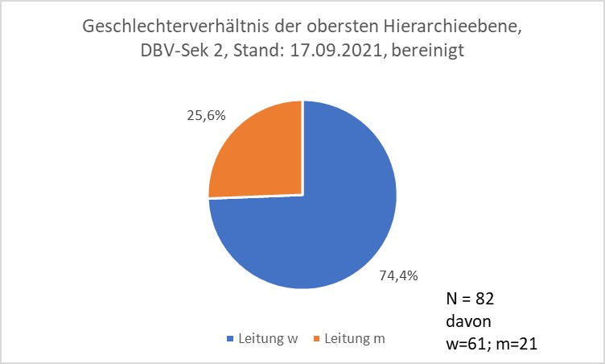
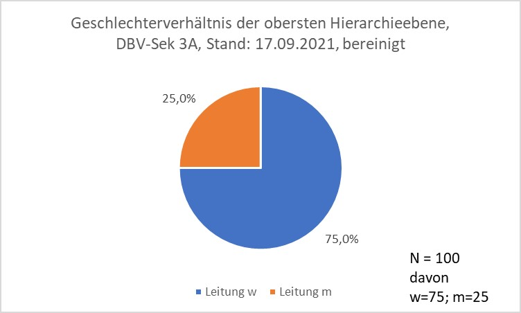
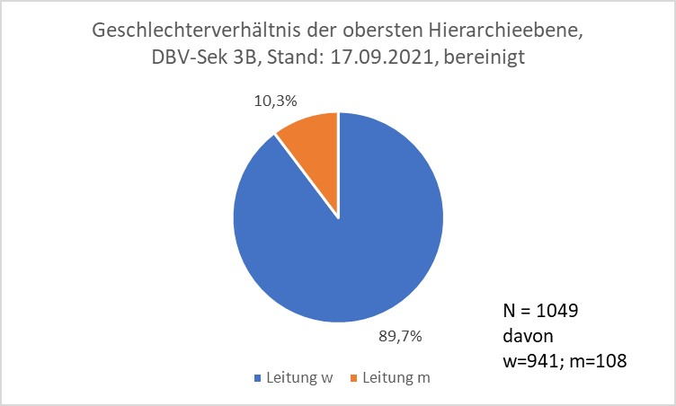

*Anmerkung zum Text: Die Untersuchung von Geschlechterverhältnissen und gesellschaftlich geprägten Geschlechterrollen ist Gegenstand zahlreicher wissenschaftlicher Fachdisziplinen. Die Betrachtung des sozialen Geschlechts ist veränderbar und unterliegt sowohl kulturellen als auch zeitlichen Dimensionen. Wie wir "Geschlecht" betrachten, unterliegt einem stetigen Wandel und gesamtgesellschaftlichen Prozess. \\
Dies bezieht sich auch auf die zweigeschlechtliche Betrachtung von geschlechtlicher Zuordnung, also die Unterteilung in Männer und Frauen. Mit dem "Gesetz zur Änderung der in das Geburtenregister einzutragenden Angaben" vom 18. Dezember 2018 und der Anerkennung des dritten Geschlechts "divers" wurde diesem Wandel in der Betrachtung auch auf rechtlicher Ebene erste Rechnung getragen und eine Abkehr vom binären Geschlechtsmodell unterstützt. Die Beschaffenheit der Quellen für die vorliegende Erhebung erlaubt jedoch nur eine Unterscheidung nach einem binären Geschlechtsmodell, sodass sich der Artikel auf diese beiden Geschlechterrollen von Frauen und Männern fokussiert. Die vorhandenen statistischen Daten in den Quellen ermöglichen leider keine weitere Ausdifferenzierung. Daher ist dieser Aufsatz auch nur als ein Schritt zu sehen, auf Grundlage dessen eine schärfere Granularität mit quantitativen Methoden erfolgen müsste.*

### 1. Einleitung

Die Teilhabe von Frauen am Erwerbsleben sowie Gleichstellungsthematiken
sind spätestens mit dem Zweiten Führungspositionen-Gesetz (FüPoG II) im
August 2021 wieder deutlich ins gesellschaftliche Bewusstsein gerückt
(BMFSFJ, 2021). Ziel ist, den Anteil von Frauen in Führungspositionen zu
erhöhen. Die Gleichstellung von Frau und Mann im Sinne einer
Nachhaltigkeitspolitik ist ein wichtiges gesamtgesellschaftliches Thema
und die Frage nach der Quote von Frauen in Leitungspositionen an
Bibliotheken ist in diesem Kontext relevant für den
bibliothekswissenschaftlichen Diskurs. Allerdings lag zum Zeitpunkt der
Erstellung dieser Untersuchung im Jahr 2021 keine Auswertung zu dieser
Frage vor. Insbesondere für ein Berufsfeld, das zu den sogenannten
"Frauenberufen" zählt, ist die fehlende Datenlage ein Desiderat, das
dieser Beitrag in einem ersten Schritt aufarbeitet. Vor dem Hintergrund
der Leitfrage, wie hoch der Anteil von Frauen in der obersten
Hierarchieebene an deutschen Bibliotheken ist, erfolgt eine quantitative
Erhebung anhand von Adressbüchern und Verzeichnissen. Als Quellen werden
dabei die Mitgliederliste des deutschen Bibliotheksverbands, das
Jahrbuch der deutschen Bibliotheken sowie das Jahrbuch der öffentlichen
Bibliotheken herangezogen. Aus der übergeordneten Leitfrage ergeben sich
noch weitere Fragen, die in die Auswertung mit einbezogen werden. Gibt
es Unterschiede in der Verteilung bei öffentlichen und
wissenschaftlichen Bibliotheken? Wie ist das Verhältnis in verschiedenen
Bibliotheksgrößen?

Charakteristisch für die deutsche Bibliothekslandschaft ist deren
Unterscheidung in zwei große Sparten, die der öffentlichen (ÖB) und der
wissenschaftlichen Bibliotheken (WB). Diese "ausnehmend deutsche
Geschichte der bibliothekarischen Spartentrennung" (HACKER 2002: S. 3)
hat sich seit Beginn des 20. Jahrhunderts manifestiert und
Ausbildungsstrukturen, Verbandsarbeiten und Berufsbilder über Jahre
geprägt. Auch wenn durch unterschiedliche bibliothekspolitische
Bemühungen -- als Beispiele zu nennen sind der "Bibliotheksplan \`73"
sowie das Strukturpapier "Bibliotheken \`93" -- und die Aufgabe
spartenspezifischer Studiengänge Schritte zur Aufhebung der
Spartentrennung unternommen wurden, ist das Unterscheidungsmerkmal in ÖB
und WB weiterhin ein strukturierendes Element im Fachdiskurs (Ebd.: S.
29). Für die Erhebung in diesem Beitrag wurde die Zweiteilung der
Bibliothekslandschaft in ÖB und WB daher beibehalten, da auch die
vorliegenden Quellen dieser folgen.

Die Ungleichstellung von Frauen und Männern auf dem Arbeitsmarkt ist
Untersuchungsgegenstand verschiedener wissenschaftlicher Disziplinen,
wie der Geschlechter- oder Organisationsforschung. Für eine
Kontextualisierung werden vor der Auswertung der Erhebung daher
verschiedene theoretische Konzepte und Definitionen sowie bisherigen
Studien, die sich dezidiert mit dem Thema Frauen in Führungspositionen
an Bibliotheken befassen, kurz vorgestellt und zusammengefasst.

### 2. Frauenberuf Bibliothekar:in

Wie eingangs benannt, gehört der Bibliotheksbereich zu den sogenannten
"Frauenberufen". Man unterscheidet generell zwischen Männerberufen,
Frauenberufen und Mischberufen. Für ein Verständnis dieser Bezeichnungen
muss man zunächst das Prinzip der beruflichen Geschlechtersegregation
thematisieren, eine Terminologie aus dem Bereich der
Arbeitsmarktforschung. Für die Definition der Termini "Frauen- und
Männerberuf" ist das Prinzip der horizontalen Segregation entscheidend.
Dies meint "die ausgeprägte Trennung von erwerbstätigen Frauen und
Männern in unterschiedlichen Berufen" (HAUSMANN/KLEINERT 2014: S. 1).
Demnach wählen Frauen häufiger Dienstleistungsberufe in Bereichen wie
Gesundheitswesen oder Soziales und Erziehung, wohingegen Männer sich
signifikant häufiger für technische Berufe entscheiden (Ebd.).

Die Unterscheidung zwischen Misch-, Frauen- und Männerberufen erfolgt
anhand des Frauenanteils in einem Beruf. Der vorliegende Beitrag folgt
dabei der Definition, die sich bei Anne Busch-Heizmann findet (2015: S.
572).[^1] Demnach findet sich in einem Männerberuf ein Frauenanteil von
bis zu 30&#8239;%. Bei einem Frauenanteil ab 70&#8239;% spricht man von einem
Frauenberuf. Im prozentualen Zwischenbereich liegen die geschlechtlich
gemischten Berufe.

Für die Entwicklung der Zahlen im Bibliothekswesen der letzten
Jahrzehnte lassen sich verschiedene Quellen heranziehen. Frank Heidtmann
hat 1974 eine Studie veröffentlicht, die auf eine Befragung von Personen
gründet, die im Jahre 1972 ihre Ausbildung als Diplombibliothekar:in
aufgenommen haben. Hierbei ermittelte er einen Frauenanteil von 81&#8239;%
(HEIDTMANN 1974: S. 89). Elf Jahre später erschien eine umfassende
Umfrage-Studie unter dem Titel "Berufsbild und Selbstverständnis der
Bibliothekare in Deutschland". Die Umfrage beschränkte sich auf
öffentliche Bibliotheken, für die in der Studie ein Frauenanteil von 86&#8239;%
nachgewiesen werden konnte (PAWLOWSKI-FLODELL 1995: S. 13f.). Die
zuletzt verfügbaren Zahlen zeichnen die Entwicklung des Frauenanteils im
Bibliotheksberuf für die Jahre 2013 bis 2017 nach (IAB 2021). Für den
genannten Zeitraum lag die Rate der erwerbstätigen Frauen zwischen 75&#8239;%
und 76&#8239;%. Die Zahlen sagen selbstverständlich noch nichts über die
hierarchische Verteilung der Mitarbeiter:innen innerhalb der einzelnen
Organisationen aus, doch zeigt sich ein konstant hoher Frauenanteil in
diesem Berufsfeld. Zwar lässt sich ein leichter Rückgang für die Jahre
2013 bis 2017 im Vergleich zu den vorher genannten Studien verzeichnen,
was jedoch nicht auf eine grundsätzliche Wende in der Verteilung
hindeutet. Die Werte sind dafür zu hoch und ihre Konstanz für diese
Periode lässt vermuten, dass die Werte der nachfolgenden Jahre in einem
ähnlichen Bereich liegen dürften, die nicht an einer gefestigten
Persistenz der horizontalen Geschlechtersegregation in diesem Berufsfeld
zweifeln lassen. Somit lässt sich der Bibliotheksberuf eindeutig als
"Frauenberuf" charakterisieren.

Das Feld der Frauenforschung ist integraler Bestandteil der heutigen
Wissenschaftswelt. Gleichstellung und Repräsentanz von Frauen in allen
Bereichen des Erwerbslebens ist Gegenstand zahlreicher Untersuchungen.
Aus historischer Perspektive wird verstärkt die Geschichte einzelner
Frauenberufe zum Gegenstand der Forschung. Dagmar Jank weist in diesem
Zusammenhang richtigerweise darauf hin, dass "Bibliothekarinnen kaum je
erwähnt werden" (JANK 2000: S. 303). Eine detaillierte Nachzeichnung der
historischen Entwicklung bis 1945 findet sich im Aufsatz "Zur
Entwicklung des bibliothekarischen Berufs als Frauenberuf" von Peter
Vodosek (1981). In Deutschland setzte der Prozess ab circa 1895 ein.
Insgesamt lässt sich festhalten, dass die Öffnung der Bibliotheksarbeit
für Frauen stark über geschlechtsspezifisch stereotype Eigenschaften
erfolgte. Frauen wurden im Bibliotheksdienst akzeptiert, da sie ihren
Wirkungskreis zunächst auf Tätigkeiten beschränken mussten, die mit
weiblich konnotierten Eigenschaften korrelierten. Assistierende und
repetierende Tätigkeiten zum einen, Arbeiten mit erzieherischem,
sozialem Anspruch im Sinne der Volksbüchereien zum anderen. Vodosek
konnte außerdem zeigen, dass die Entwicklung der Frauenarbeit in
Bibliotheken in den Sparten ÖB und WB nicht taktgleich verlief, was
durch die zugeschriebene geschlechtsspezifische Rollenverteilung der
Zeit begründet wird (1981: S. 235). Die Volksbüchereien mit ihrem
erzieherischen Charakter korrespondierten mit dem traditionellen
Rollenmuster der Frau von Fürsorglichkeit und Mütterlichkeit. Analog
wurden die wissenschaftlichen Bibliotheken mit männlichen Stereotypen
wie Rationalität und Leistungsorientierung gleichgesetzt. Diese
historischen Strukturen wirken immer noch nach, wenn Laura Stadler in
ihrer Studie für Schweizer Bibliotheken feststellt: "Die verbreitete
Ansicht, Frauen würden in allgemeinen öffentlichen Bibliotheken eher in
den Hierarchieebenen aufsteigen als in wissenschaftlichen Bibliotheken,
ist daher wenig verwunderlich" (2012: S. 43).

Auch wenn in der Fachliteratur zu den Themen geschlechtliche
Ungleichheiten und Frauen in Führungspositionen darauf verwiesen wird,
dass einer der Gründe für die weibliche Unterrepräsentanz auf
Leitungsebene bei den Frauen selbst zu suchen sei (Scheu vor
Wettbewerb), greift diese singuläre Sichtweise doch zu kurz (HENN 2009:
S. 54). Im Folgenden werden daher Prozesse und Verhaltensweisen
vorgestellt, die geschlechtliche Ungleichheiten reproduzieren.

### 3. Theorien zur geschlechtlichen Ungleichstellung auf dem Arbeitsmarkt

Das Institut für Arbeitsmarkt- und Berufsforschung (IAB) veröffentlicht
in regelmäßigen Abständen aktuelle Analysen und Trends in Form von
Kurzberichten. Ein Blick richtet sich dabei auch immer wieder auf den
Frauenanteil in Führungspositionen. Die beiden aktuellen Studien wurden
in den Jahren 2017 und 2019 von Susanne Kohaut und Iris Möller für die
Jahre 2016 und 2018 veröffentlicht. Der Fokus liegt dabei auf der
Privatwirtschaft, allerdings wird der öffentliche Sektor als
Vergleichsreferenz herangezogen.

Zusammenfassend stellen sie fest, dass Frauen in beiden Bereichen
weiterhin deutlich unterrepräsentiert sind, gemessen an ihrem Anteil der
Gesamtbeschäftigtenzahl (KOHAUT/MÖLLER 2019: S. 7). In der
Privatwirtschaft lag der Frauenanteil 2016 auf der ersten Führungsebene
bei 26&#8239;% und auf der zweiten Führungsebene bei 40&#8239;% (KOHAUT/MÖLLER 2017:
S. 1). Für das Jahr 2018 ließ sich keine Veränderung der Zahlen
beobachten (KOHAUT/MÖLLER 2019: S. 1). Im öffentlichen Sektor lagen die
Gesamtzahlen höher, sodass sich für die erste Führungsebene ein Anteil
von 34&#8239;% und für die zweite Führungseben ein Anteil von 44&#8239;% für das Jahr
2016 ergab (KOHAUT/MÖLLER 2017: S. 4). Für das Jahr 2018 ergaben sich
marginale Änderungen: auf der ersten Ebene ein Anstieg um 2
Prozentpunkte auf 36&#8239;% und auf der zweiten Ebene eine Verringerung auf
43&#8239;% (KOHAUT/MÖLLER 2019: S. 4). Doch da der Gesamtanteil von Frauen im
öffentlichen Sektor höher ist als in der Privatwirtschaft, muss man die
Zahlen relativieren. Daraus ergibt sich, dass Frauen dort in
Leitungspositionen nicht besser vertreten sind als in der
Privatwirtschaft. Insbesondere wird die Vorreiterrolle angeprangert, die
der öffentliche Sektor bezüglich Chancengleichheit und geschlechtlicher
Gleichstellung einnehmen sollte, was sich aufgrund der genannten Zahlen
jedoch nicht bestätigt (KOHAUT/MÖLLER 2017: S. 6). Zudem stellen sie
einen "relativ hohen Frauenanteil in den Betrieben mit unter 50
Beschäftigten" fest (KOHAUT/MÖLLER 2019: S. 5), was ihre These
unterstützt, dass Frauen in kleineren Betrieben leichter aufsteigen
können.

Die berufliche Geschlechtersegregation ist sehr persistent
(HAUSMANN/KLEINERT 2014: S. 2). Seit den 1990ern Jahren lässt sich nur
eine geringe Abnahme der horizontalen Segregation beobachten. Dies liegt
laut Ann-Christin Hausmann und Corinna Kleinert nicht daran, dass sich
die einzelnen Berufe stärker durchmischen, sondern an einem
"berufsstrukturellem Wandel" (HAUSMANN/KLEINERT 2014: S. 2).
Männerdominierte Sektoren, wie Handwerk, verlieren an Bedeutung bei
gleichzeitigem Ausbau geschlechtlich gemischter Berufe. Diese
horizontale Segregation wird genutzt, um Ungleichheiten auf dem
Arbeitsmarkt und Lohnunterschiede zu erläutern. Stark weiblich
segregierte Berufe leiden oftmals unter einem niedrigeren sozialen
Status, was zu einer geringeren Entlohnung führt.

Für den vorliegenden Beitrag ist das Konzept der vertikalen Segregation
aufschlussreicher, da sich diese Auswertung auf die Entwicklung des
Frauenanteils in Leitungspositionen im Hinblick auf ein spezifisches
Arbeitsfeld konzentriert. Die vertikale Segregation beschreibt die
geschlechtliche Ungleichverteilung auf unterschiedlichen
Hierarchieebenen, also, dass Männer häufiger auf der Führungsebene zu
finden sind als Frauen (BUSCH 2013: S. 27). Um eine
gleichstellungsbezogene Durchmischung zu erreichen, müsste die
prozentuale Verteilung der männlichen und weiblichen Führungskräfte dem
Gesamtanteil des jeweiligen Geschlechts im Berufsfeld entsprechen. In
seiner Auswertung zur Teilhabe von Frauen am Erwerbsleben legt das
statistische Bundesamt für 2019 dar, dass bei einem Frauen-Gesamtanteil
am Erwerbsleben von 47&#8239;% nur jede dritte Frau eine Führungskraft ist
(DESTATIS). In diesem Zusammenhang wird auch von einer sogenannten
"Gläsernen Decke" gesprochen, die "das Phänomen scheinbar unsichtbarer
Barrieren \[umschreibt\], die Frauen daran hindern, in die höchsten
Führungspositionen zu gelangen" (OHLENDIECK 2003: S. 183). In seinem
Aufsatz weitet Lutz Ohlendieck das Prinzip aus und spricht von einem
Glashaus mit "glass walls", welche den Zugang "zu den zentralen und
strategisch wichtigen Positionen" (2003: S. 189) hemmt. Periphere
Abteilungen seien demnach eher von Frauen besetzt und zentrale Bereiche,
wie Forschung und Produktion, männerdominiert. Im Zusammenhang der
vertikalen Segregation legt Juliane Achatz dar, dass "Frauenberufe
\[...\] für Männer wie ein glass escalator wirken" können, durch den
ihnen der Aufstieg in Führungspositionen eher gelingt als den weiblichen
Kolleginnen (ACHATZ 2018, S. 425).

Um Ungleichheiten zwischen den Geschlechtern zu erklären, werden
unterschiedliche theoretische Ansätze herangezogen. Die neoklassische
Humankapitaltheorie geht davon aus, dass "Produktivitätsunterschiede"
Lohnunterschiede nach sich ziehen (HINZ/GARTNER 2005: S. 23), den
sogenannten Gender Pay Gap. Man unterscheidet zwischen allgemeinem und
spezifischem Humankapital, also Fähigkeiten, die während schulischer
Bildung, Ausbildung und beruflicher Tätigkeit erworben wurden. Die
Theorie geht davon, dass aufgrund der Arbeitsteilung im Privaten Frauen
weniger in spezifisches Humankapital investieren und daher in Bereichen
tätig sind, die nicht so hoch entlohnt werden. "Empirische
Untersuchungen zeigen jedoch, dass der Lohnunterschied nicht vollständig
mit Unterschieden beim Humankapital erklärt werden kann." (HINZ/GARTNER
2005: S. 23)

Ein weiterer Punkt, der von der Nachfrageseite hineinspielt, also von
Seiten des potenziellen Arbeitgebers, liegt im Fehlen von Informationen
während des Auswahlprozesses. Da ein potenzieller Arbeitgeber nie
vollständige Informationen über Bewerber:innen hat und Fragen
beispielsweise nach der Familienplanung illegitim sind, "werden diese so
behandelt, als würden sie dem Durchschnitt ihrer sozialen Gruppe
entsprechen" (ebenda). Dieses Phänomen bezeichnet man als statistische
Diskriminierung. Diese beruht auf der Annahme, dass Frauen häufiger ihre
Erwerbstätigkeit unterbrechen als Männer. Gekoppelt mit der vermuteten
Doppelbelastung durch Familie und Beruf assoziiere man eine geringere
Produktivität bei Frauen, auch wenn sie die gleichen Qualifikationen
aufweisen wie ein männlicher Mitbewerber (BUSCH 2013: S. 99).

"Am deutlichsten ausgeprägt sind die Richtlinien zur Gleichstellung im
öffentlichen Dienst." (HINZ/GARTNER 2005: S. 37) Durch die
Eingruppierung in Lohnstufen ist eine ungleiche Bezahlung für dieselbe
Position zwischen den Geschlechtern ausgeschlossen. Das IAB informiert
mit seinen veröffentlichten Statistiken "über die
sozialversicherungspflichtige Beschäftigung und die registrierte
Arbeitslosigkeit in den Berufen in Deutschland" (IAB 2021). Wenn
verfügbar, werden auch die mittleren monatlichen Bruttoeinkommen
angegeben. Die jüngsten verfügbaren Zahlen für Erwerbstätige in der
Gruppe 733 "Medien-, Dokumentations- und Informationsdienste" stammen
aus dem Jahr 2016. Demnach lag das mittlere monatliche Bruttoeinkommen
der Männer bei EUR 3.765, das der Frauen im Vergleich bei EUR 3.304.
Diese Zahlen sind mit einigen Abstrichen zu bewerten, da Beamte
beispielsweise nicht aufgeführt werden und diese sich zumeist durch ein
Hochschulstudium für den gehobenen und höheren Dienst qualifizieren.
Allerdings lassen sie doch vermuten, dass nach wie vor eine vertikale
Segregation innerhalb des Berufsfeldes vorhanden ist. Zudem könnte dies
auch ein erster Hinweis auf einen Unterschied in der Verteilung zwischen
den Sparten sein. Während der Großteil der Stellen im ÖB-Bereich
besoldungstechnisch im Bereich des mittleren und gehobenen Dienstes
angesiedelt ist und die Entlohnungen im Bereich des höheren Dienstes
zumeist nur Leitungsstellen vorbehalten sind, ist das Angebot an Stellen
im höheren Dienst vielfältiger. Neben Stellen auf Führungsebene sind
wissenschaftliche Mitarbeiter:innen und Fachreferent:innen dem höheren
Bibliotheksdienst zugeordnet (SCHELLE-WOLFF 2014: S. 452).[^2]

So argumentieren auch Hinz und Gartner allgemein in ihrer Studie zum
Gender Pay Gap (2005, S. 37): "Ein Teil des verbliebenen
Lohnunterschieds dürfte auf die vertikale Segregation innerhalb der
Berufsgruppen zurückzuführen sein. Sie ergibt sich aus unterschiedlichen
Einstufungen in der gleichen Berufsgruppe bei Tätigkeitsbeginn und aus
unterschiedlichen Karriereentwicklungen für Angehörige ein und derselben
Berufsgruppe."

Nach diesen theoretischen Einordnungen werden in einem nächsten Schritt
die bisherigen Studien vorgestellt, die sich dezidiert mit dem Thema
Frauen in Führungspositionen an Bibliotheken befassen, bevor die
aktuelle Erhebung vorgestellt wird.

### 4. Frauen in Führungspositionen an Bibliotheken -- Studien und aktueller Forschungsstand

Nach diesen theoretischen Einordnungen werden jetzt die bisherigen
Studien vorgestellt, die sich dezidiert mit dem Thema Frauen in
Führungspositionen an Bibliotheken befassen, bevor die aktuelle Erhebung
vorgestellt wird.

Eine wegweisende Studie zu Frauen in Führungspositionen an Bibliotheken
stammt von Anita Schiller aus dem Jahr 1974. "Women in librarianship"
ist die erste systematische Untersuchung zu Geschlechtsungleichheiten im
Bibliothekswesen (MORAN ET AL. 2009: S. 216). Anhand einer umfangreichen
Diskursanalyse früherer Studien und Jahrbücher konnte sie ein "explicit
pattern of discrimination" (SCHILLER 1974: S.107) nachweisen, das sich
in einer Kontinuität von signifikanten Gehalts- und
Positionsunterschieden äußerte. Trotz der generellen Mehrheit der Frauen
im Bibliothekswesen wurden Männer schneller befördert. Insbesondere in
großen Bibliotheken waren die Aufstiegsmöglichkeiten für Frauen
schwierig (SCHILLER 1974: S. 114). Natürlich muss man den zeitlichen
Kontext bedenken. Gleichstellungsproblematiken waren noch nicht in dem
Maße im gesellschaftlichen Bewusstsein verankert wie heute. Zudem ist
der lokale Kontext zu bedenken. Hier werden die US-amerikanischen
Verhältnisse aufgezeigt, die nicht schablonenartig auf deutsche
Gegebenheiten übertragen werden können. Das geschlechtsspezifische
Lohngefälle bei gleicher Qualifikation und Stellenbeschreibung, das
Schiller aufzeigen konnte, ist durch die Mechanismen des öffentlichen
Dienstes in Deutschland so nicht gegeben.

Jüngere Studien aus dem nordamerikanischen Raum zeichnen ein positiveres
Bild, da sich der Frauenanteil über die Zeit nahezu auf allen Ebenen
erhöht hat. Zum Gender Pay Gap konnte eine Studie von 2009 aufzeigen,
dass dieser noch vorhanden ist, aber deutlich geringer worden ist (MORAN
ET AL. 2009).

Im Jahr 2012 untersuchte Laura Stadler den Frauenanteil an Schweizer
Bibliotheken. Dafür fragte sie 25 Bibliotheken an, Voraussetzung war
eine Angestelltenzahl von mindestens 50. Für die gesamte
Beschäftigtenzahl ergibt sich eine Verteilung von 65,9&#8239;% an Frauen
gegenüber 34,1&#8239;% männlicher Mitarbeiter (STADLER 2012: S. 39f.).
Aufgeschlüsselt nach ÖB und WB ergibt sich ein höherer Frauenanteil für
öffentliche Bibliotheken von 74,7&#8239;% im Vergleich zum WB-Bereich mit einem
Anteil von 62,4&#8239;%. Sie untersuchte drei Führungsebenen. In ÖBs sind auf
allen drei Führungsebenen fast 60&#8239;% Frauen zu finden, auf erster
Führungsebene hingegen nur 42,9&#8239;%. In WBs liegt der Anteil bei 35,1&#8239;%, auf
der ersten Führungsebene sogar nur bei 25&#8239;% (Ebd.: S. 44).
Spartenübergreifend ergibt sich ein Verhältnis von 55,2&#8239;% männlicher
Führungskräfte zu 44,8&#8239;% für die gesamte Führungsebene sowie 69,6&#8239;% zu
30,4&#8239;% für die oberste Stufe (Ebd.: S.40f.). Im Sinne der Gleichstellung
müsste der Frauenanteil auf Führungsebene dem Gesamtanteil an weiblichen
Mitarbeiterinnen entsprechen, doch ergibt sich eine deutliche
Diskrepanz. Sie setzt diese in Bezug zum Phänomen der "Gläsernen Decke".
Die Arbeit schließt mit einer qualitativen Interviewstudie mit
Bibliothekarinnen in Führungspositionen, um Einblick in die
Karriereverläufe aufzuzeigen. Mehrfach nannten die befragten Frauen
dabei aktive Karriereplanung, Networking und Mentoring als wichtige
Faktoren für ihr persönliches Weiterkommen (Ebd.: S. 49ff.).

Für Deutschland hat Carmen Passera die Entwicklung des Frauenanteils im
wissenschaftlichen Bibliotheksdienst nach 1945 anhand einer Auszählung
der VDB-Jahrbücher von 1950, 1959, 1969, 1985 und 1995 untersucht
(PASSERA 2000). So konnte sie zeigen, dass der Anteil der Frauen stetig
gestiegen ist, von 9,1&#8239;% (1950) auf 35,9&#8239;%. Für die Repräsentanz in
Führungspositionen ergibt sich eine andere Verteilung. Nur 14,8&#8239;% der im
wissenschaftlichen Bibliotheksdienst tätigen Frauen hatten 1995 eine
Führungsposition inne. Demgegenüber stehen 32,8&#8239;% der Männer.

Eine spätere Untersuchung von 2005 unternimmt einen Vergleich der Rolle
der Frau in ÖBs, WBs und Informationseinrichtungen (GERBER/RABE 2005)
vor. Dafür wurde eine Umfrage an 150 Institutionen verschickt (50 aus
jedem Bereich). Hier ergibt sich ein ähnliches Bild beim Frauenanteil in
Leitungspositionen (ÖB: 80&#8239;% zu WB: 38&#8239;%). Außerdem wurden offene Fragen
gestellt. Bei der Frage nach Kindern bei Frauen in Leitungspositionen
bejahten dies 63&#8239;% der Frauen in ÖBs, jedoch nur 22&#8239;% aus den WBs, was auf
eine bessere Vereinbarkeit von Beruf und Familien in ÖBs hindeutet.
Allerdings beantworteten diese Frage nur neun Teilnehmerinnen aus dem
WB-Bereich, daher ist hier die Aussagekraft doch anzuzweifeln. Auf die
Frage nach der Beurteilung der Rolle der Frau im Betrieb sahen sich in
den ÖBs die meisten Frauen als gleichgestellt. Auch in den WBs fühlen
sie sich gleichberechtigt, betonten aber gleichzeitig auch die
schwierigen Aufstiegschancen.

Im Jahr 2013 hat Christian Hauschke anhand des Mitgliedsverzeichnisses
des DBVs den Frauenanteil in Führungspositionen nach Sektionen
untersucht (HAUSCHKE 2013). Die Ergebnisse hat er in einer Grafik
aufbereitet. Leider ist diese nicht mehr abrufbar, sondern nur noch der
kurze erläuternde Text. Er nennt dort keine genauen Zahlen, sondern
fasst zusammen, dass der Frauenanteil in Sektion 3B (Öffentliche
Bibliothekssysteme und Bibliotheken für Versorgungsbereiche bis zu
50.000 Einwohner und Landkreise mit bibliothekarischen Einrichtungen) am
höchsten sei und die wenigsten Frauen in Sektion 4 (Wissenschaftlichen
Universalbibliotheken) zu finden seien.

Abschließend soll noch kurz die Untersuchung von Gabriele Schulz
vorgestellt werden, welche die neuesten Daten liefert (SCHULZ ET AL.
2016: S. 91ff.). Sie hat eine Auswertung der Leitungspositionen an
Staats-, Landes-, Zentral- und Universitätsbibliotheken für den Zeitraum
von 1994 bis 2014 anhand des "Handbuch des Öffentlichen Lebens" (des
"Oeckls") vorgenommen, die zeigt, dass der dortige Anteil von Frauen
über die Jahre stetig zugenommen hat. Allerdings liegt der Frauenanteil
mit 43&#8239;% für das Jahr 2014 deutlich unter dem Gesamtanteil der Frauen im
Bibliotheksdienst.

### 5. Datenerhebung

#### 5. 1 Methodik

Wie gezeigt werden konnte, sind aktuelle umfassende Daten zum
Frauenanteil in Führungspositionen an Bibliotheken in Deutschland nicht
verfügbar. Dies war der Ausgangspunkt für die Wahl der Methode. Es wurde
eine quantitative Erhebung anhand der Auszählung von (vermutlichen)
Frauen- und Männernamen anhand unterschiedlicher Adressverzeichnisse und
Jahrbücher gewählt. Die Daten wurden mit Excel ausgewertet und
visualisiert.

Die Mitgliederliste des DBV wurde als aktuelle Datengrundlage gewählt
und der Anteil von Frauen in Führungspositionen nach Sektionen
ausgewertet. Dabei beschränkte sich die Auswertung auf die Sektionen 1
bis 5 (Tabelle 1), da Fachstellen, Verbände etc. nicht mit in die
Erhebung einfließen sollten.

  ----------------------------------- -----------------------------------
  Sektion 1                           Öffentliche Bibliothekssysteme und
                                      Bibliotheken für
                                      Versorgungsbereiche von über
                                      400.000 Einwohnern

  Sektion 2                           Öffentliche Bibliothekssysteme und
                                      Bibliotheken für
                                      Versorgungsbereiche von 100.000 bis
                                      400.000 Einwohnern

  Sektion 3a                          Öffentliche Bibliothekssysteme und
                                      Bibliotheken für
                                      Versorgungsbereiche von 50.000 bis
                                      100.000 Einwohner und Landkreise
                                      mit bibliothekarischen
                                      Einrichtungen

  Sektion 3b                          Öffentliche Bibliothekssysteme und
                                      Bibliotheken für
                                      Versorgungsbereiche bis zu 50.000
                                      Einwohner und Landkreise mit
                                      bibliothekarischen Einrichtungen

  Sektion 4                           Wissenschaftliche
                                      Universalbibliotheken

  Sektion 5                           Wissenschaftliche
                                      Spezialbibliotheken
  ----------------------------------- -----------------------------------

Tabelle 1: Übersicht der Sektionen 1 bis 5 des dbv

Neben der Erhebung des aktuellen Frauenanteils in Leitungspositionen an
deutschen Bibliotheken möchte die vorliegende Untersuchung auch die
Entwicklung der geschlechtsspezifischen Anteile sichtbar machen, sodass
noch weitere Quellen für die Erhebung hinzugezogen wurden. Für den
ÖB-Bereich wurden die Jahrbücher der öffentlichen Bibliotheken (JÖB)
verwendet. Es wurden die Jahrgänge 1994 (erster Band nach der
Wiedervereinigung), 2002/03 und 2012/13 (letzter Band vor Einstellung)
ausgezählt. Für den WB-Bereich wurden die VDB-Jahrbücher der Jahrgänge
1991, 2001/02 und 2011/12 zur Auszählung genutzt. Für eine bessere
Vergleichbarkeit wurden nur die Bibliotheken ausgezählt, die zugleich
Mitglieder im DBV sind. Zudem wurden öffentliche Bibliotheken, wie
beispielsweise die Stadt- und Landesbibliothek Dortmund, ebenfalls nicht
mitgezählt, sofern sie im JÖB vertreten waren und durch einen Abgleich
mit der DBS-Statistik ebenfalls dem ÖB-Bereich zugeordnet werden konnten
(DBS 2021). Die Auszählung der DBV-Liste erfolgte über die Online-Seite
bis zum 17.09.2021. Durch ein Relaunch der Website ist diese so nicht
mehr verfügbar. Der DBV hat der Autorin freundlicherweise die Daten als
Excel-Liste zukommen lassen. Diese wurden für die abschließende Prüfung
der bereits erfassten Daten genutzt.

Die Gender-Feststellung erfolgt anhand der Vornamen beziehungsweise
anhand der Nutzung der weiblichen respektive männlichen Form "Leiterin"
-- "Leiter" / "Direktorin" --"Direktor" oder der Anrede "Frau" --
"Mann". Wurde keine Angabe zur Leitung gemacht, wurde dies ebenfalls mit
aufgenommen. In einigen wenigen Fällen war eine Doppelleitung vermerkt.
Diese wurde explizit verzeichnet, wenn es sich dabei um eine
Doppelleitung aus Frau und Mann handelte. Neben der (vermutlichen)
Gender-Feststellung der Bibliotheksleitung wurden weitere nachfolgende
Daten zu den Bibliotheken erhoben, um aussagekräftige Ergebnisse zu
erhalten.

Generelle Untersuchungen zu Frauen in Führungspositionen haben gezeigt,
dass deren Anteil mit Zunahme der Betriebsgröße sinkt. Dies lässt
vermuten, dass es auch Unterschiede zwischen kleinen und großen
Bibliotheken hinsichtlich der Leitungsposition geben könnte. Dazu wurden
mehrere Größenklassen anhand der angegebenen Personalstellen gebildet:

- Bis 1

- \>1 bis 5

- \>5 bis 10

- \>10 bis 20

- \>20 bis 50

- \>50 bis 100

- \> 100

Durch die Beschaffenheit der Daten war nur eine Bestimmung der obersten
Hierarchieebene möglich, mit dem Ziel, für diesen Bereich einen
möglichst umfassenden aktuellen Datensatz zu erarbeiten.

#### 5.2 Ergebnisse

##### 5.2.1 Geschlechterverhältnis der obersten Hierarchieebene anhand der Personalgröße

###### 5.2.1.1 Auswertung der DBV-Mitgliederliste, Stand 2021

Die Sektionen 1 bis 3b decken die Daten für öffentliche Bibliotheken ab.
Die Einrichtungen der Sektionen 4 und 5 zählen zu den wissenschaftlichen
Bibliotheken.

Für Sektion 1 wurden 20 Einrichtungen in die Erhebung einbezogen:

Die Auswertung (Abbildung 1) zeigt, dass der Anteil der Frauen zwar
insgesamt höher ist als jener der Männer, sich die Werte bei zunehmender
Bibliotheksgröße aber annähern.

In die Auswertung für Sektion 2 wurden 86 Bibliotheken einbezogen
(Abbildung 2). Die Einrichtungen mit \>20 bis 50 Personalstellen sind am
häufigsten in dieser Sektion vertreten. Der Frauenanteil ist in diesem
Bereich verhältnismäßig am größten und entspricht ungefähr dem
Gesamtanteil von Frauen im gesamten Berufsfeld. Man sieht allerdings
auch, dass das Verhältnis von Frauen und Männern in den Bibliotheken mit
über 50 Stellen annähernd ausgeglichen ist.

In Sektion 3A, in der zum Auszählungszeitpunkt 104 Einrichtungen
gelistet waren, finden sich, anhand der Personalstellen gemessen,
kleinere Bibliotheken im Vergleich zu den Sektionen 1 und 2 (Abbildung
3). Die Einrichtungen mit \>10 bis 20 Personalstellen sind am häufigsten
in dieser Sektion vertreten und weisen auch einen merklich höheren
Anteil an Frauen in Leitungspositionen auf als Männer.

Die Sektion 3B ist die zahlenmäßig größte Sektion unter den
DBV-Mitgliedern. Hier wurden Daten zu 1.169 Einrichtungen erhoben
(Abbildung 4). Die Einrichtungen mit \>1 bis 5 Personalstellen sind am
häufigsten in dieser Sektion vertreten. Im Vergleich zu Männern sind
Frauen dort um das 8,5fache häufiger in der obersten Hierarchieebene
vertreten. Unter allen Sektionen ist Sektion 3B jene mit dem geringsten
Männeranteil.

Für die öffentlichen Bibliotheken lässt sich insgesamt festhalten, dass
der Anteil von Frauen in Leitungspositionen größer ist als der Anteil
der männlichen Leiter. Insbesondere bei kleineren Bibliotheken ist er
deutlich höher als jener der Männer. Mit zunehmender Bibliotheksgröße
nähern sich diese Werte an, wobei der Anteil der Männer mit einer
Ausnahme (Sektion 3B, \>20 bis Personalstellen) nie höher ist als der
Frauenanteil.

Im Vergleich dazu ergibt sich für wissenschaftliche Bibliotheken ein
anderes Bild. Sektion 4 umfasst die wissenschaftlichen
Universalbibliotheken. Insgesamt wurden hierfür Daten von 292
Einrichtungen ausgewertet (Abbildung 5). Der Großteil dieser
Bibliotheken hat \>1 bis 20 Personalstellen. Der Anteil der Frauen in
Leitungspositionen ist hier höher und insbesondere in Bibliotheken mit
\>1 bis 5 Personalstellen signifikant größer. Allerdings zeigt die
Erhebung auch einen wesentlichen Unterschied zu den Daten für die
öffentlichen Bibliotheken. In Einrichtungen mit mehr als 20
Personalstellen ist der Anteil der Männer in Leitungspositionen größer
als jener der Frauen.[^3]

Die Mitglieder der Sektion 5 sind wissenschaftliche Spezialbibliotheken.
Von der Betriebsgröße lassen sich diese Einrichtungen mit denen aus
Sektion 3B aus dem ÖB-Bereich vergleichen. So haben von den 261
Bibliotheken der Sektion 5 nur acht Institutionen mehr als 20
Personalstellen (Abbildung 6). In Bibliotheken mit bis zu fünf
Personalstellen ist auch in diesem Fall der Frauenanteil um ein
Vielfaches höher als jener der Männer. Herauszustellen ist noch, dass in
Einrichtungen mit \> 5 bis 10 Personalstellen mehr Männer in
Leitungspositionen zu finden sind als Frauen.

Um eine Entwicklung über die Jahre nachzeichnen zu können, werden im
Folgenden kurz die Auszählungen anhand der Betriebsgröße der Jahrbücher
der öffentlichen Bibliotheken (JÖB) sowie der Jahrbücher der Deutschen
Bibliotheken (VDB-Jahrbücher) vorgestellt.

###### 5.2.1.2 Auswertung der Jahrbücher der öffentlichen Bibliotheken

Die Erhebung in den JÖB erfolgte jeweils anhand von Fragebögen, die an
hauptamtlich geleitete öffentliche Bibliotheken in Deutschland
verschickt wurden. Gerade für die Jahrgänge 2002/03 und 2012/13 muss man
festhalten, dass ein wesentlicher Teil der verzeichneten Bibliotheken
keine Angabe zu Leitung und Personalgröße beinhalten. Die Auszählung der
Jahrbücher für diesen Beitrag ergibt ein ähnliches Bild für öffentliche
Bibliotheken wie die Auszählung der DBV-Mitgliederstatistik (Abbildungen
7--9). Insbesondere in Betrieben mit bis zu zehn Personalstellen ist der
Frauenanteil um ein Vielfaches höher als jener der Männer. Mit
zunehmender Bibliotheksgröße sinkt der Frauenanteil im Verhältnis.

###### 5.2.1.3 Auswertung der VDB-Jahrbücher

Die Einträge in den VDB-Jahrbüchern beruhen auf Meldungen der
verzeichneten Bibliotheken. Die zeitliche Entwicklung zeigt, dass sich
der Frauenanteil in Leitungspositionen an wissenschaftlichen
Bibliotheken sukzessive erhöht hat. 1991 waren nur in Einrichtungen mit
bis zu fünf Personalstellen mehr Frauen als Männer in einer
Leitungsposition beschäftigt (Abbildung 10). In größeren Bibliotheken
überwog der Männeranteil, wobei der Frauenanteil mit Zunahme der
Betriebsgröße kontinuierlich abnahm. Für den Jahrgang 2001/02 kann man
bereits eine Verschiebung feststellen (Abbildung 11). Auch wenn der
Männeranteil noch überwiegt, sind hier auch in Bibliotheken mit \>10 bis
20 Personalstellen die Leitungspositionen nun mehrheitlich von Frauen
besetzt. 2011/12 ist das Verhältnis von Frauen und Männern in
Leitungspositionen nahezu ausgewogen (Abbildung 12). Allerdings zeigt
die Auswertung, dass Frauen vornehmlich in kleineren Bibliotheken in
Leitungspositionen sind. In Bibliotheken mit mehr als 20 Personalstellen
findet sich eine umgekehrte Ausgangslage. Männer in Leitungspositionen
sind in diesen Einrichtungen häufiger vertreten als Frauen.

##### 5.2.2 Auswertung in Gesamtzahlen

Nach der Verteilung von Frauen- und Männeranteilen in deutschen
Bibliotheken anhand der Einrichtungsgröße wurden die gesammelten Daten
in Gesamtzahlen nach Frauen- und Männeranteil ausgewertet, um die
vorausgegangenen Ausführungen überblicksartig zusammenzuführen. Da die
Verzeichnisse und Jahrbücher auf Angaben der verzeichneten Einrichtungen
beruhen und erwartungsgemäß nicht jede Institution, etwa aufgrund von
Zeit-/Personalmangel, Daten abliefert, hat sich in jeder Auszählung ein
gewisser Anteil an Bibliotheken ergeben, für den keine Informationen zu
der Leitung verfügbar ist. Insbesondere die JÖBs der Jahre 2002/03 und
2012/13 weisen einen sehr hohen Anteil an diesen Daten auf. Die
folgenden Darstellungen zeigen der Vollständigkeit halber daher zum
einen die Gesamtzahlen inklusive dieser unbekannten Variablen und zum
anderen eine "bereinigte" Version, in dem die Bibliotheken ohne Angabe
zur Leitung herausgerechnet wurden, auf die sich die folgenden
Ausführungen beziehen.

###### 5.2.2.1 Auswertung der DBV-Mitgliederliste, Stand: 2021

Die Auswertung der Gesamtzahlen zeigt für die öffentlichen Bibliotheken,
dass in allen Sektionen (1-3) die Mehrzahl der Leitungspositionen von
Frauen besetzt ist. Die durchschnittliche Bibliotheksgröße sinkt von
Sektion zu Sektion, sodass in Sektion 3B generell die kleinsten
Bibliotheken, gemessen anhand der Personalstellen, zu finden sind.
Betrachtet man die Verteilung des Frauenanteils auf diese Weise, so
stellt man fest, dass der Frauenanteil mit der Abnahme der
Bibliotheksgröße steigt. In den Bibliotheken der Sektion 1 liegt der
Anteil weiblicher Führungskräfte noch unterhalb dem Gesamtanteil der
weiblichen Beschäftigten (Abbildung 13). In den Sektionen 2 und 3A
stimmen die Werte annähernd überein (Abbildungen 15 und 17) und in
Sektion 3B liegt der Anteil weiblicher Führungskräfte sogar deutlich
über dem Gesamtdurchschnitt (Abbildung 19). Rechnet man die Werte aller
Sektionen zusammen, so ergibt sich zusammenfassend für die öffentlichen
Bibliotheken dennoch ein Anteil weiblicher Führungskräfte, der über dem
Prozentsatz weiblicher Mitarbeiterinnen im Allgemeinen liegt (Abbildung
21).

Die Auswertung der Gesamtzahlen zeigt für die wissenschaftlichen
Bibliotheken der DBV-Mitgliederliste ebenfalls, dass in den beiden
Sektionen 4 und 5 die Mehrzahl der Leitungspositionen von Frauen besetzt
ist (Abbildung 27). Allerdings ist die prozentuale Verteilung von
weiblicher zu männlicher Führungskraft nicht so deutlich wie in den
öffentlichen Bibliotheken. Denn sind dort nur etwa 12&#8239;% der
Führungskräfte männlich, liegt der Anteil der Männer in
Leitungspositionen für die wissenschaftlichen Bibliotheken bei etwa
einem Drittel.

###### 5.2.2.2 Auswertung der Jahrbücher der öffentlichen Bibliotheken

Wie eingangs dieses Unterkapitels bereits erläutert, gab es bei jeder
Quelle einen gewissen Prozentsatz in den Daten, der keine Angaben zur
Leitung der jeweiligen Einrichtung liefert. Insbesondere bei den beiden
jüngsten Jahrgängen des JÖB ist dieser Anteil mit über 20&#8239;%
beziehungsweise 30&#8239;% im Verhältnis zu den übrigen Jahrbüchern sehr hoch,
sodass sich in der Zeitreihe eine nicht nachvollziehbare Entwicklung des
Frauenanteils ergeben würde, von einem hohen Eingangswert mit über 75&#8239;%,
auf nur noch 58&#8239;% neun Jahre später. In den bereinigten Darstellungen
sind die Anteile konstant hoch und mit jeweils über 80&#8239;% höher als die
prozentuale Gesamtzahl weiblicher Beschäftigte in Bibliotheken
(Abbildungen 29, 31 und 33).

###### 5.2.2.3 Auswertung der VDB-Jahrbücher

Für die Entwicklung der Geschlechterverteilung auf der Führungsebene an
wissenschaftlichen Bibliotheken ist über die Zeit eine dynamischere
Entwicklung zu beobachten. Für 2021 liegt der Anteil weiblicher
Führungskräfte bei über 65&#8239;% (bereinigte Version). Die Auszählung des
frühesten Jahrbuchs, das in die Erhebung mit aufgenommen wurde, ist für
das Jahr 1991. Dort ergeben sich nach der Auszählung noch umgekehrte
Vorzeichen. Der Anteil der männlichen Führungskräfte ist mit drei
Vierteln der Gesamtanzahl an ausgezählten Daten so hoch wie zu keinem
anderen Zeitpunkt (Abbildung 35). In den Folgejahren nimmt der Anteil
der Frauen stetig zu (Abbildung 37) und die Daten aus 2011/12 zeigen
erstmals für den gesamten WB-Bereich einen höheren Anteil an weiblichen
als an männlichen Führungskräften (Abbildung 39).

### 6. Diskussion 

Das Ziel der vorliegenden Untersuchung war die Schaffung einer
umfassenden Datenauswertung zu den aktuellen statistischen Verteilungen
von Frauen in Führungspositionen an deutschen Bibliotheken. Der
Überblick bereits vorhandener Untersuchungen in Kapitel 4 hat gezeigt,
dass die jüngsten aufbereiteten Daten bereits aus dem Jahr 2014 stammen.
Zudem ist der Fokus der meisten Studien entweder ausschnitthaft gewählt
oder die Ergebnisse sind nicht nachnutzbar.

Die umfassende Auswertung der verfügbaren Quellen schließt somit,
zumindest teilweise, eine bestehende Lücke im
bibliothekswissenschaftlichen Diskurs und sollte idealerweise als
Ausgangspunkt für weitere Diskussionen dienen.

Für die Arbeit erfolgte eine quantitative Erhebung anhand der
Mitgliederliste des deutschen Bibliotheksverbands (DBV) für den
aktuellen Zeitraum sowie ausgewählter Jahrbücher der deutschen
Bibliotheken und der öffentlichen Bibliotheken für frühere Jahrgänge, um
die Entwicklung der letzten 20--30 Jahre sichtbar machen zu können.

Bewusst wurde bei der Erhebung die Unterscheidung zwischen öffentlichen
und wissenschaftlichen Bibliotheken beibehalten. Die historische
Entwicklung des Berufsfeldes, das in Kapitel 2 dargelegt wurde, konnte
zeigen, dass sich die Etablierung von Frauen in den beiden Sparten
unterschiedlich schnell entwickelt hat. In der Tat zeigen die
Gesamtzahlen in der bereinigten Darstellung der hier vorliegenden
Datenauswertung, dass der Anteil von Frauen auf der obersten
Hierarchieebene in öffentlichen Bibliotheken in allen untersuchten
Jahren bei einem nahezu konstant hohen Wert von über 80&#8239;% liegt und
deutlich größer ist als bei wissenschaftlichen Bibliotheken (Abbildung
41). Für wissenschaftliche Bibliotheken zeigt sich über die Jahre eine
deutliche Entwicklung in den Geschlechterverhältnissen (Abbildung 43).
Lag der Frauenanteil auf der obersten Hierarchieebene 1991 noch bei
knapp unter 25&#8239;%, zeigt die Auswertung für 2021 einen Wert von 65,4&#8239;%.
Allerdings liegt dieser damit noch deutlich unter dem Gesamtanteil von
Frauen im Berufsfeld, was darauf hindeutet, dass öffentliche
Bibliotheken in der Tat bessere Aufstiegsmöglichkeiten für Frauen
bieten. So sind Frauen nach wie vor auf der Führungsebene von WBs
unterrepräsentiert, auch wenn die aktuellen Zahlen und die dargelegte
Entwicklung vermuten lassen, dass sich der Anteil weiter erhöhen wird.
Dies zeigt jedoch auch, dass unterschiedliche Richtungen eines
Berufsfeldes in unterschiedlichem Maße segregiert sein können.
Vergleicht man Sektion 3B (ÖB-Bereich) und Sektion 5 (WB), die sich in
der Verteilung der Personalstellen-Klassen ähneln, zeigt sich in der
bereinigten Version eine deutliche Diskrepanz in der Verteilung. Während
in Sektion 3B 89,7&#8239;% der obersten Leitungspositionen von Frauen besetzt
sind, liegt der Anteil in Sektion 5 bei 69,5&#8239;%.

Allgemeine Untersuchungen der Arbeitsmarktforschung zeigen, dass Frauen
in kleineren Betrieben leichter aufsteigen können als in großen
Betrieben. Die aktuelle Auszählung kann dies insbesondere für
wissenschaftliche Bibliotheken bestätigen. Auch wenn der Gesamtanteil
der Frauen in Leitungspositionen in Bibliotheken im Vergleich zu anderen
Berufsfeldern erfreulich hoch ist, ergeben sich doch auffällige Punkte,
die weiterführender Untersuchungen bedürfen.

Für öffentliche Bibliotheken zeigt die Erhebung, dass sich die
Verteilung von Männern und Frauen bei zunehmender Bibliotheksgröße
annähern, wobei der Anteil der Frauen immer noch höher ist als jener der
Männer. Für wissenschaftliche Bibliotheken ergibt sich ein anderes Bild.
Ab einer Bibliotheksgröße mit mehr als 20 Personalstellen ist der Anteil
in Leitungsposition höher als jener der Frauen. Prozesse, wie der in
Kapitel 3 beschriebene "glass escalator"-Effekt, könnten hier greifen.

Die vorliegende Arbeit bietet eine umfassende Übersicht über die Anteile
von Frauen auf der obersten Hierarchieebene. Die Erfassung der
Verteilung der darunter gegliederten Segmente war durch die Methodenwahl
nicht möglich. In einem nächsten Schritt wäre die Untersuchung dieser
wünschenswert, um einen Überblick der dortigen Verteilung zu erhalten.

Abschließend lässt sich resümieren, dass die Entwicklung des Anteils von
Frauen auf der obersten Hierarchiestufe in wissenschaftlichen
Bibliotheken positiv verläuft und sich über die letzten 30 Jahre
kontinuierlich erhöht hat. Allerdings liegt er noch immer deutlich unter
jenem für öffentliche Bibliotheken, der über den gesamten
Untersuchungszeitraum konstant hoch war und sogar über dem Gesamtanteil
von Frauen in dem Berufsfeld liegt. Zudem konnte gezeigt werden, dass
Frauen insbesondere in kleineren Bibliotheken die Leitungsposition
innehaben. Die Ergebnisse dieser Studie liefern also eine umfassende
statistische Aufarbeitung der Geschlechterverhältnisse für die
Leitungspositionen an deutschen Bibliotheken, was der zugrundeliegenden
Leitfrage entspricht. Eine umfassend angelegte qualitative Studie könnte
offene Fragen nach potenziellen Gründen beleuchten. Generell ist also in
der weiteren Diskussion die Frage zu stellen, ob Frauen sich signifikant
häufiger für die Tätigkeit in öffentlichen Bibliotheken entscheiden oder
ob die Barrieren für Frauen in wissenschaftlichen Bibliotheken
aufzusteigen, tatsächlich höher sind, da die Diskrepanz in der
Verteilung der beiden Sparten anhand der statistischen Zahlen merklich
ist. Für eine gleichstellungsbezogene Durchmischung müsste die
prozentuale Verteilung der Bibliotheksleiter:innen dem Gesamtanteil des
jeweiligen Geschlechts im Berufsfeld entsprechen. Der Anteil von 65,4&#8239;%
(bereinigte Version) für wissenschaftliche Bibliotheken liegt somit
immer noch knapp zehn Prozentpunkte unterhalb des Gesamtanteils an
Frauen im Bibliotheksbereich. In den Arbeiten von Laura Stadler (STADLER
2012) sowie Birte Gerber, Bianca Mundt und Ines Rabe (GERBER/MUNDT/RABE
2005) klingen bereits kritische zu hinterfragende Punkte wie die
Vereinbarkeit von Familie und Beruf an.

### 7. Danksagung

Ich danke Frau Dr. Ulla Wimmer für ihre Unterstützung während des
gesamten Prozesses der Masterarbeit. Weiterhin gilt mein Dank den
Kolleg:innen des DBV für die Zusendung der Daten als Excel-Liste zur
abschließenden Prüfung der Erhebung.

### 8. Literaturverzeichnis

ACHATZ 2018: Achatz, Juliane (2018): Berufliche Geschlechtersegregation. In: Abraham,
Martin; Hinz, Thomas (Hg.): Arbeitsmarktsoziologie. Probleme, Theorien,
empirische Befunde. 3., überarbeitete und erweiterte Auflage. Wiesbaden:
Springer VS, S. 389--435.

BIBLIOTHEKEN 1993: Bundesvereinigung Deutscher Bibliotheksverbände (1994): Bibliotheken
'93: Strukturen - Aufgaben - Positionen. Berlin: Deutsches
Bibliotheksinstitut.

BIBLIOTHEKSPLAN 1973: Deutsche Bibliothekskonferenz (1973): Bibliotheksplan 73. Entwurf eines
umfassenden Bibliotheksnetzes für die Bundesrepublik Deutschland.
Berlin: Deutscher Büchereiverband, Arbeitsstelle für das Büchereiwesen.

BMFSFJ 2021: Bundesministerium für Familie, Senioren, Frauen und Jugend: Zweites
Führungs-positionen-Gesetz - FüPoG II. Stand: 12.08.2021. URL:
[https://www.bmfsfj.de/bmfsfj/service/gesetze/zweites-fuehrungspositionengesetz-fuepog-2-164226](https://www.bmfsfj.de/bmfsfj/service/gesetze/zweites-fuehrungspositionengesetz-fuepog-2-164226)
(letzter Zugriff am 14.05.2023).

BUSCH 2013: Busch, Anne (2013): Die berufliche Geschlechtersegregation in
Deutschland. Ursachen, Reproduktion, Folgen. Wiesbaden: Springer VS.

BUSCH-HEIZMANN 2015: Busch-Heizmann, Anne (2015): Frauenberufe, Männerberufe und die
"Drehtür" -- Ausmaß und Implikationen für West- und Ostdeutschland. In:
WSI-Mitteilungen. 2015 (8), S. 571 -- 582. URL:
[https://www.wsi.de/data/wsimit_2015_08_busch-heizmann.pdf](https://www.wsi.de/data/wsimit_2015_08_busch-heizmann.pdf)
(letzter Zugriff am14.05.2023).

DBS 2021: URL:
[https://service-wiki.hbz-nrw.de/pages/viewpage.action?pageId=78577673](https://service-wiki.hbz-nrw.de/pages/viewpage.action?pageId=78577673)

(letzter Zugriff am 14.05.2023).

DESTATIS: Statistisches Bundesamt (Destatis): Teilhabe von Frauen am Erwerbsleben.
Stand: 2019. URL:
[https://www.destatis.de/DE/Themen/Arbeit/Arbeitsmarkt/Qualitaet-Arbeit/Dimension-1/teilhabe-frauen-erwerbsleben.html](https://www.destatis.de/DE/Themen/Arbeit/Arbeitsmarkt/Qualitaet-Arbeit/Dimension-1/teilhabe-frauen-erwerbsleben.html)
(letzter Zugriff am 14.05.2023).

GERBER/MUNDT/RABE 2005: Gerber, Birte; Mundt, Bianca; Rabe, Ines (2005): Vergleich der Position
bzw. Rolle der Frau in Öffentlichen Bibliotheken, Wissenschaftlichen
Bibliotheken und Informationseinrichtungen. Auswertung einer Befragung.
In: Krauss-Leichert, Ute: Interkulturelles Online-Lernen. Die Rolle der
Frau in Bibliotheken und Informationseinrichtungen. Münster: Lit-Verlag,
S. 61-96.

HACKER 2002: Hacker, Gerhard (2002): "Deine Zauber binden wieder\..." - Zur
Überwindung der Spartentrennung in der Bibliotheks- und
Informationswissenschaft: Öffentliche Antrittsvorlesung anlässlich der
Berufung zum Professor, gehalten am 8. Mai 2002 am Fachbereich Buch und
Museum der HTWK Leipzig. Leipzig. URL:
[https://fim.htwk-leipzig.de/fileadmin/portal/f_m/Fakultaet_Medien/Personen/Professoren/07091.pdf](https://fim.htwk-leipzig.de/fileadmin/portal/f_m/Fakultaet_Medien/Personen/Professoren/07091.pdf)
(letzter Zugriff am 14.05.2023).

HAUSCHKE 2013: Hauschke, Christian (2013): Frauen in Führungspositionen bei
DBV-Mitgliedern. Stand: 18.03.2013. URL:
[https://infobib.de/2013/03/18/frauen-in-fuhrungspositionen-bei-dbv-mitgliedern/](https://infobib.de/2013/03/18/frauen-in-fuhrungspositionen-bei-dbv-mitgliedern/)
(letzter Zugriff am 14.05.2023).

HAUSMANN/KLEINERT 2014: Hausmann, Ann-Christin; Kleinert, Corinna (2014): Berufliche Segregation
auf dem Arbeitsmarkt. Männer- und Frauendomänen kaum verändert. In:
IAB-Kurzbericht. 2014 (9), S. 2--8. URL:
[https://doku.iab.de/kurzber/2014/kb0914.pdf](https://doku.iab.de/kurzber/2014/kb0914.pdf)
(letzter Zugriff am 14.05.2023).

HEIDTMANN 1974: Heidtmann, Frank (1974): Die bibliothekarische Berufswahl. Eine
empirische Untersuchung der Berufswahl des Bibliothekars des gehobenen
Dienstes an öffentlichen und wissenschaftlichen Bibliotheken. Pullach:
Verl. Dokumentation (Veröffentlichungen des Instituts für
Bibliothekarausbildung der Freien Universität Berlin, 3).

HENN 2009: Henn, Monika (2009): Die Kunst des Aufstiegs. Was Frauen in
Führungspositionen kennzeichnet. 2. Auflage. Frankfurt, New York:
Campus.

HINZ/GARTNER 2005: Hinz, Thomas; Gartner, Hermann (2005): Geschlechtsspezifische
Lohnunterschiede in Branchen, Berufen und Betrieben / The Gender Wage
Gap within Economic Sectors, Occupations, and Firms. In: Zeitschrift für
Soziologie 34 (1), S. 22-39. DOI:
[https://doi.org/10.1515/zfsoz-2005-0102](https://doi.org/10.1515/zfsoz-2005-0102)
(letzter Zugriff am14.05.2023).

IAB 2021: Institut für Arbeitsmarkt- und Berufsforschung: Berufe im Spiegel der
Statistik. URL:
[http://bisds.iab.de/Default.aspx?beruf=BG733&region=1&qualifikation=0](http://bisds.iab.de/Default.aspx?beruf=BG733&region=1&qualifikation=0)
(letzter Zugriff am 14.05.2023).

JANK 2000: Jank, Dagmar (2000): Frauen im Höheren Bibliotheksdienst vor dem Zweiten
Weltkrieg. In: Plassmann, Engelbert; Syré, Ludger (Hg.): Verein
Deutscher Bibliothekare 1900 - 2000. Festschrift. Wiesbaden:
Harrassowitz, S. 302--313.

KANTER 1977: Kanter, Rosabeth Moss (1977): Men and women of the corporation. New
York, NY: Basic Books.

KIRKLAND 1997: Kirkland, Janice J. (1997): The Missing Women Library Directors:
Deprivation versus Mentoring. In: CRL (College & Research Libraries) 58
(4), S. 375--383. DOI:
[https://doi.org/10.5860/crl.58.4.375](https://doi.org/10.5860/crl.58.4.375)
(letzter Zugriff am 14.05.2023).

KOHAUT/MÖLLER 2017: Kohaut, Susanne; Möller, Iris (2017): Führungspositionen in Betrieben
und Verwaltungen: Oberste Chefetage bleibt Männerdomäne. Nürnberg
(IAB-Kurzbericht, 24/2017). URL:
[http://doku.iab.de/kurzber/2019/kb2319.pdf](http://doku.iab.de/kurzber/2019/kb2319.pdf)
(letzter Zugriff am 14.05.2023).

KOHAUT/MÖLLER 2019: Kohaut, Susanne; Möller, Iris (2019): Frauen in leitenden Positionen:
Leider nichts Neues auf den Führungsetagen. Nürnberg (IAB-Kurzbericht,
23/2019). URL:
[http://doku.iab.de/kurzber/2019/kb2319.pdf](http://doku.iab.de/kurzber/2019/kb2319.pdf)
(letzter Zugriff am 14.05.2023).

MORAN ET AL. 2009: Moran, Barbara B.; Leonard, Elisabeth; Zellers, Jessica (2009): Women
administ-rators in academic libraries: Three decades of change. Library
Trends, Vol. 58 (Nr. 2), S. 215-228. DOI:
[http://doi.org/10.1353/lib.0.0088](http://doi.org/10.1353/lib.0.0088)
(letzter Zugriff am 14.05.2023).

OHLENDIECK 2003: Ohlendieck, Lutz (2003): Die Anatomie des Glashauses: Ein Beitrag zum
Verständnis des Glass-Ceiling-Phänomens. In: Pasero, Ursula (Hg.):
Gender - from Costs to Benefits. Wiesbaden: Westdt. Verl., S. 183--193.

PASSERA 2000: Passera, Carmen (2000): Frauen im wissenschaftlichen Bibliotheksdienst
nach 1945. In: Plassmann, Engelbert; Syré, Ludger (Hg.): Verein
Deutscher Bibliothekare 1900 - 2000. Festschrift. Wiesbaden:
Harrassowitz, S. 314--324.

PAWLOWSKI-FLODELL 1995: Pawlowski-Flodell, Charlotte (Hg.) (1995): Berufsbild und
Selbstverständnis der Bibliothekare in Deutschland 1994. Erarbeitet von
einer Arbeitsgruppe Berliner Bibliothekare. Berlin: Deutsches
Bibliotheksinstitut (dbi-materialien).

SCHELLE-WOLFF 2014: Schelle-Wolff, Carola: Mit dem Master in die Bibliothek. In: BuB --
Forum Bibliothek und Information 66. Jg. 2018 (6), S. 450-453.

SCHILLER 1974: Schiller, Anita (1974): Women in Librarianship. In: Advances in
Librarianship, 1974 (4), S. 103--147.

SCHULZ ET AL. 2016: Schulz, Gabriele; Ries, Carolin; Zimmermann, Olaf (2016): Frauen in
Kultur und Medien. Ein Überblick über aktuelle Tendenzen, Entwicklungen
und Lösungsvorschläge. Berlin: Deutscher Kulturrat.

STADLER 2012: Stadler, Laura (2012): Die Gläserne Decke in Schweizer Bibliotheken.
Chur: Schweizerisches Institut für Informationswissenschaft, HTW Chur
(Churer Schriften zur Informationswissenschaft 53). URL:
[https://www.fhgr.ch/fileadmin/fhgr/angewandte_zukunftstechnologien/SII/churer_schriften/sii-churer_schriften_53-Glaeserne_Decke_in_Schweizer_Bibliotheken.pdf](https://www.fhgr.ch/fileadmin/fhgr/angewandte_zukunftstechnologien/SII/churer_schriften/sii-churer_schriften_53-Glaeserne_Decke_in_Schweizer_Bibliotheken.pdf)
(letzter Zugriff am14.05.2023).

VODOSEK 1981: Vodosek, Peter (1981): Zur Entwicklung des bibliothekarischen Berufs als
Frauenberuf. In: BIBLIOTHEK Forschung und Praxis 5 (3), S. 231--244.

**8. Quellen**

DBV SEKTIONEN 2021: Deutscher Bibliotheksverband e.V.: Sektionen -- Übersicht. Stand:
17.09.2021, URL:
[https://www.bibliotheksverband.de/fachgruppen/sektionen.html](https://www.bibliotheksverband.de/fachgruppen/sektionen.html)
(letzter Zugriff am 14.05.2023).

JÖB 1994: Berufsverband Information Bibliothek e.V. (Hg.) (1994): Jahrbuch der
öffentlichen Bibliotheken, 1994. Bad Honnef: Bock + Herchen.

JÖB 2002/03: Berufsverband Information Bibliothek e.V. (Hg.) (2002/03): Jahrbuch der
öffentlichen Bibliotheken, 2002/03. Bad Honnef: Bock + Herchen.

JÖB 2012/13: Berufsverband Information Bibliothek e.V. (Hg.) (2012/13): Jahrbuch der
öffentlichen Bibliotheken, 2012/13. Bad Honnef: Bock + Herchen.

VDB 1991: Verein Deutscher Bibliothekarinnen und Bibliothekare (1991): Jahrbuch
der Deutschen Bibliotheken 54, 1991. Wiesbaden: Harrassowitz.

VDB 2001/02: Verein Deutscher Bibliothekarinnen und Bibliothekare (2001/02): Jahrbuch
der Deutschen Bibliotheken 59, 2001/02. Wiesbaden: Harrassowitz.

VDB 2011/12: Verein Deutscher Bibliothekarinnen und Bibliothekare (2011/12): Jahrbuch
der Deutschen Bibliotheken 64, 2011/12. Wiesbaden: Harrassowitz.

[^1]: In der Literatur werden teilweise unterschiedliche Grenzwerte
    genannt, jedoch nur mit geringfügigen Abweichungen (ein Vergleich
    dazu findet sich bei BUSCH 2013: S. 117). Ebenfalls folgen Hausmann
    und Kleinert dieser Definition in ihrer Studie von 2014 (S. 4).

[^2]: Zusätzlich muss man an dieser Stelle zu bedenken geben, dass durch
    die Zahlen nicht ablesbar ist, wie das Verhältnis von Teil- zu
    Vollzeitstellen ist und wie sich dieses geschlechtsspezifisch
    verteilt.

[^3]: Für die Staatsbibliothek zu Berlin war in der DBV-Mitgliederliste
    noch eine Frau als Direktorin vermerkt. Zum Zeitpunkt der Auszählung
    war jedoch bereits ein männlicher Nachfolger eingesetzt. Dies wurde
    in der Erhebung berücksichtigt.
