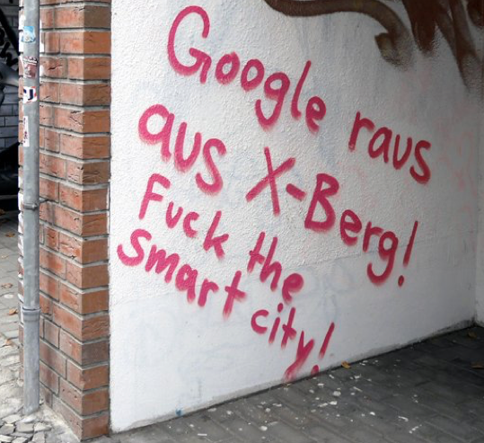

*Dieser Text basiert in Teilen auf:*

*Freyberg, Linda (2018): Smart Libraries -- buzz word or tautology? In:
Elephant in the Lab, 2. Juli 2018,
[https://doi.org/10.5281/zenodo.1302988](https://doi.org/10.5281/zenodo.1302988).*

### Einleitung

Der Begriff "Smart Library" wurde in den letzten Jahren als Teil eines
ganzheitlichen "Smart City"-Konzepts vermehrt verwendet, um eine
Vision der Bibliothek der Zukunft zu zeichnen. Dieses Konzept adressiert
die Integration digitaler Prozesse und informationeller Partizipation in
die urbane öffentliche Infrastruktur und entwirft einen erstrebenswerten
Zustand, in dem Städte "smarter", das heißt effizienter organisiert
und ressourcenschonender, flexibler, nachhaltiger, grüner, inklusiver
und sozialer werden. Bibliotheken sind als öffentliche Einrichtungen
Teil dieses Entwicklungs- und Optimierungsprozesses. Ob es sich dabei um
"glatte oder gekerbte Räume"[^1] handelt, sie sich also geordnet und
stabil manifestiert (bzw. "gekerbt") zeigen oder variabel sind und sich
stetig im Fluss befinden (bzw. "glatt"), ist zu diskutieren. Eine
gelungene technikphilosophische Lesart der beiden Raumkonzepte von
Deleuze und Guattari entwickelt Kaja Tulatz: "Im gekerbten Raum wird
\[\...\] auf Kontingenzreduktion gezielt, während im glatten Raum nach
Kontingenzerweiterung gestrebt wird."[^2] Speziell in Bezug auf smarte
Bibliotheken wäre die Frage, ob "smart" etwas Absolutes ist und
"keine Steigerungsform" besitzt, wie Moritz Mutter zunächst
feststellt, oder es darum geht, "Probleme in Gelegenheiten zu
transformieren"[^3] und damit immer im Fluss zu bleiben. Auch zu
hinterfragen ist, ob die Entwicklung von Bibliotheken einer Logik des
Fortschritts, im Sinne einer ständigen Weiterentwicklung und
Verbesserung vergleichbar mit Francis Bacons Konzept des "progressus
scientiarium"[^4] unterworfen ist oder sich gerade durch eine Konstanz
auszeichnet.

Festzuhalten ist, dass mit dem Zustand der ständigen Veränderung nicht
alle zufrieden sind und die Vision einer Smart City nicht unumstritten
ist (siehe das Graffito aus Berlin-Kreuzberg in Abb. 1).

Für Bibliotheken, ob smart oder nicht, stellt sich die Frage, was es
bedeutet, Teil dieser Entwicklung zu sein. Was ist ihre Rolle und wie
sollten sie handeln? Und was bedeutet es für eine Bibliothek, überhaupt
"smart" zu sein?

### Konzept Smart Library

Obwohl bereits internationale Pilotprojekte[^5] in Bibliotheken und
Konferenzen[^6] zu diesem Thema stattgefunden haben, gibt es keine
umfassende Definition einer "Smart Library".

Der Schwerpunkt von "smart" im aktuellen Sprachgebrauch liegt auf dem
sinnvollen Einsatz von Technologie (siehe "smart phone") und ragt
semantisch in den Bereich der Automatisierung (zum Beispiel "smart
home"), Alltagskoordination (zum Beispiel "smart mobility") und der
künstlichen Intelligenz (oft im Zusammenhang mit "smart data").

Es ist klar, dass Bibliotheken nicht nur durch den Einsatz von
Technologien smart werden, sondern sich Modernisierung auf viele Aspekte
wie den physischen Raum oder digitale Angebote bezieht und innerhalb der
Institutionen auf Personal- und Führungsebene und außerhalb der
Einrichtungen durch Kooperationen und partizipative Prozesse im
Idealfall durch ganzheitliche Konzepte verankert sind.

Eine aktuelle, die genannten Aspekte umfassende, Definition einer Smart
Library von Sabine Wolf lautet:

> "Eine Smart Library zeichnet sich durch einen hohen Anwendungsgrad moderner (Informations-)Technologien aus. Sie ist offen für
Kooperationen aller Art und unterstützt proaktiv eine Personalentwicklung im Sinn einer zukunftsfähigen Bibliothek. Diese drei Kennzeichen sind eingebettet in eine agile Bibliotheksentwicklung und werden ergänzt durch eine Partizipation von Nutzerinnen und Nutzern. Ausgestattet mit einer Informationsinfrastruktur und einer entsprechenden Möblierung bietet sie diesen einen Aufenthaltsqualität, die das Lernen unterstützt und die Bibliothek als Treffpunkt etabliert."[^7]

Auch wenn "Smart Library" oft als modisches Schlagwort verwendet wird,
stellt der Begriff offensichtlich mehr dar als nur ein Etikett oder eine
glatte, blinkende Oberfläche. Generell sollte der Einsatz von
Technologien und innovativen Veränderungen also in ein umfassendes
strategisches Gesamtkonzept eingebettet sein, das den lokalen
Anforderungen der Mitarbeiter\*innen und der Nutzenden entspricht.

Denn natürlich funktioniert nicht jede Strategie für jede Institution,
und daher ist einer der grundlegenden Ansätze in diesem Zusammenhang
eine gründliche Untersuchung und Bewertung der Entwicklungsziele. So ist
die Beobachtung von Trends, die beispielsweise im jährlichen Gartner\'s
Hype Cycle oder dem IFLA-Trendreport veröffentlicht werden, eine
wichtige Aufgabe für die Bibliotheken. Weitere Quellen sind der ALA
TechSource Blog und deren Website "Library of the Future" sowie
Konferenzen und Messen. Leider existiert der einzige periodische Bericht
mit Fokus auf Bibliotheken, der NMC-Report, nicht mehr, aber
Alternativen und Ideen für einen neuen Bibliothekstrendbericht wurden in
der Community bereits diskutiert[^8].

### Kontext Soziologie der Bibliothek

Ein wesentlicher Aspekt dieses Konzeptes und der damit verbundenen
Strategien ist, dass es sich um eine Art Antwort auf Herausforderungen
und scheinbar um eine Lösung für Probleme handelt. Das heißt, zunächst
einmal muss es eine Frage oder ein Infragestellen geben, zum Beispiel:
Ist die Idee einer Bibliothek noch zeitgemäß? Haben Bibliotheken in der
heutigen Informationsgesellschaft noch eine Daseinsberechtigung?
Bibliotheken auf der ganzen Welt sind mit diesen Fragen konfrontiert,
unter anderem auch, weil diese regelmäßig an sie herangetragen werden.
Der Erfolg der (meisten) Bibliotheken ist wirtschaftlich nicht messbar,
auch weil diese Einrichtungen nicht nach kapitalistischen Kriterien
konzipiert sind und sich somit dieser Logik entziehen. Bibliotheken sind
(für die Nutzenden mehr oder weniger) kostenlos und für jedermann und
jedefrau offen, was eher einem kommunistischen oder gemeinnützigen
Prinzip folgt. Universitäts- oder Forschungsbibliotheken sind Teil eines
akademischen Umfelds als Anbieterinnen von wissenschaftlicher Literatur
und Vermittlerinnen wissenschaftlicher Kommunikation. Daher sind sie von
größeren Wissenschaftsinstitutionen abhängig, aber auch durch diese
abgesichert und in ihrer Funktion legitimiert. Öffentliche Bibliotheken
hingegen sind von den Kommunen abhängig und mit lokaler Politik
konfrontiert. Ihre räumliche Einbindung in die unmittelbare
Nachbarschaft und somit die Produktion von Attraktivität als Ort bieten
die Grundlage strategischer Bemühungen. Das Etablieren als sogenannter
dritter Ort wurde in den letzten Jahren hinreichend und erschöpfend
diskutiert. Kurz gesagt geht es dabei., assoziativ angelehnt an Ray
Oldenburg[^9], um das Schaffen eines ergänzenden Lebensbereichs mit
hoher Aufenthaltsqualität neben dem zu Hause und dem Arbeitsplatz. In
der Praxis bedeutet dies oftmals, dass Sofas aufgestellt, Loungebereiche
eingerichtet und Cafés in Bibliotheken integriert werden.

Übergeordnet gewinnen auch Konzepte wie Bürgerbeteiligung bzw. Community
Engagement, Open Government oder Citizen Science zunehmend, vor allem
für Öffentliche Bibliotheken, an Relevanz.

Ein Grund, warum sowohl Öffentliche als auch Wissenschaftliche
Bibliotheken zunehmend in Frage gestellt werden, sind natürlich die
Möglichkeiten des World Wide Web, also die Wahrnehmung eines schier
endlosen Zugangs zu massenhaft digital "frei" verfügbaren
Informationen zu allen erdenklichen Themen in allen möglichen
Medienformen, scheinbar ohne von einer vermittelnden Institution
abhängig zu sein. Die Herausforderung für Bibliotheken liegt heute
darin, an dieser Entwicklung teilzuhaben und das Digitale zu integrieren
und mitzudenken, ohne ihre Grundfunktionen und ihre Gemeinnützigkeit
aufzugeben.

Zugleich lässt sich fragen, ob die Grundidee einer Bibliothek nicht an
sich schon ziemlich smart ist? Bibliotheken sind als Ort der Bildung,
als Sammlerinnen und Anbieterinnen von Informationen und Wissen
etabliert und genießen ein gewisses Vertrauen, wenn es darum geht,
gesicherte Informationen zu vermitteln. Und genau diese Funktionen
werden auch in Zukunft noch nötig, wenn nicht sogar existentiell, sein.
Gerade vor dem Hintergrund von Phänomenen wie der Informationsflut und
der Desinformationen, braucht es eine Institutionen ohne eigene
(kommerzielle) Interessen, die bei der Recherche und bei der
Identifikation relevanter und auch glaubwürdiger Informationen
unterstützt und im Idealfall die transparente, kritische und
reflektierte Einordnung von Quellen fördert. Bekanntlich sind einerseits
das Kuratieren, traditionell durch Bestandsaufbau, im Digitalen stärker
durch die Organisation von Zugang sowie anderseits die
Kompetenzvermittlung für die Nutzung der Inhalte und das Verständnis von
Informationsprozessen aktuelle Leitaufgaben der Bibliotheken.

Um nun auch explizit den Bogen zur Soziologie zu spannen: Der
tschechische Soziologe und Philosoph Radovan Richta beschäftigte sich in
den 1960er-Jahren mit technischen Umwälzungen und den gesellschaftlichen
Konsequenzen dieser. Sein bekanntestes Werk ist wohl der sogenannte
"Richta-Report"[^10], den er gemeinsam mit über 60 Autor\*innen
erarbeitete. Dabei berücksichtigte er bereits mathematische Maschinen
(Computer), die seiner Prognose nach stark an Relevanz zunehmen
werden.[^11]

Der Begriff "smart" bezieht sich vor allem auf die Effizienz durch den
Einsatz von Technologien und auf die Automatisierung von Prozessen zur
Erleichterung des Arbeits- und Alltagsumfeldes. Richta spricht in diesem
Kontext von einer Verdrängung der menschlichen Tätigkeit in
"vorproduktive Stufen" wie "die Vorbereitung der Technik"[^12]. So
wie "Smart Homes" versprechen, das Leben zu erleichtern und
freizumachen von der trivialen Bedienung von einzelnen Geräten, hält
auch in Bibliotheken die Automatisierung Einzug. So übernehmen
beispielsweise Bücherroboter weniger anspruchsvolle Aufgaben wie die
Rückgabe, die Lagerung oder auch die Bereitstellung von Medien. Während
sich viele Bibliothekar\*innen von diesen tristen Routinen entlastet
fühlen und froh sind, sich auf anspruchsvollere Tätigkeiten
konzentrieren zu können, evoziert dies auch die Angst im Zuge der
Automatisierung, überflüssig oder ersetzbar zu werden. Wenn die
Mitarbeitenden nicht mehr für Routinetätigkeit benötigt werden, ist die
betriebswirtschaftliche Schlussfolgerung nicht in jedem Fall, sie für
anspruchsvollere Tätigkeiten einzusetzen. Nicht selten spart man sie
einfach komplett ein. Dies ist eine der Entwicklungen, mit denen sich
Bibliotheken auseinandersetzen müssen. Wir wissen aktuell nicht,
inwieweit und wie schnell Künstliche Intelligenz (KI) in die
intellektuelle Arbeit hinein wirken wird. Die KI-fizierung als
Fortsetzung der Automatisierung wird aber mit Sicherheit früher oder
später auch die Arbeit in den Bibliotheken verändern.

Zusammenfassend lässt sich sagen, dass Bibliotheken als
nicht-kommerzielle Anbieterinnen und Sammlerinnen vielleicht schon immer
"smart" waren, denn neben der Bereitstellung von Informationen mussten
Bibliotheken stets den Fortschritt managen und sich in einem permanenten
Prozess erneuern, was den Begriff der "Smart Library" vielleicht sogar
etwas tautologisch macht. Die Hauptfunktionen von Bibliotheken bleiben
weitestgehend gleich. Aber durch die enorme Zunahme von digital
verfügbaren Informationen und deren Relevanz sowie durch neue
Präsentations- und Zugangsformen muss stetig über neue Wege der
Vermittlung, neue Dienstleistungen und neue Umgebungen nachgedacht
werden.

### Referenzen

Deleuze, Gilles; Guattari, Félix (1980): 1440 -- Das Glatte und das
Gekerbte. In: Dünne, Jörg; Günzel, Stephan (Hrsg.): Raumtheorie.
Grundlagentexte aus Philosophie und Kulturwissenschaften; Suhrkamp
Taschenbuch Verlag; Frankfurt am Main, 2006.

Mutter, Moritz (2019): Klug werden: Zur Semantik des Begriffs "smart".
In: Freyberg, Linda; Wolf, Sabine (Hrsg.): Smart Libraries. Konzepte,
Methoden und Strategien. Wiesbaden: b.i.t Verlag. S. 17--19.

Oldenburg, Ray (1999): The Great Good Place -- cafés, coffee shops.
bookstores, bars, hair salons and other hangouts at the heart of the
community. New York : Marlowe and Company.

Richta, Radovan und Kollektiv (Hrsg.) (1968): Richta-Report. Politische
Ökonomie des 20. Jahrhunderts. Die Auswirkungen der
technisch-wissenschaftlichen Revolution auf die Produktionsverhältnisse.
Marxistische Bibliothek, Text 10. Frankfurt a.M.: makol Verlag.

Renn, Jürgen (2022): Die Evolution des Wissens. Eine Neubestimmung der
Wissenschaft für das Anthropozän. Berlin: Suhrkamp Verlag.

Schuldt, Karsten (2018): Wie könnte ein besserer Zukunftsreport für
Bibliotheken aussehen?
[https://bildungundgutesleben.wordpress.com/2018/01/22/wie-koennte-ein-besserer-zukunftsreport-fuer-bibliotheken-aussehen/](https://bildungundgutesleben.wordpress.com/2018/01/22/wie-koennte-ein-besserer-zukunftsreport-fuer-bibliotheken-aussehen/).

Tulatz, Kaja (2011): Technikinduzierte Räume bei Deleuze und Guattari.
XXII. Deutscher Kongress für Philosophie, 11. - 15. September 2011.
[https://doi.org/10.5282/ubm/epub.12570](https://doi.org/10.5282/ubm/epub.12570).

Wolf, Sabine (2019): Definition einer Smart Library und Erläuterung der
Smart Map. Ein State-of-the-Art-Ansatz. In: Freyberg, Linda; Wolf,
Sabine (Hrsg.): Smart Libraries. Konzepte, Methoden und Strategien.
Wiesbaden: b.i.t Verlag, S. 21--26,
[https://www.b-i-t-online.de/daten/bit_Innovativ_76_Freyberg_Wolf_Leseprobe.pdf](https://www.b-i-t-online.de/daten/bit_Innovativ_76_Freyberg_Wolf_Leseprobe.pdf).

[^1]: Deleuze, Gilles; Guattari, Félix (1980): 1440 -- Das Glatte und
    das Gekerbte. In: Dünne, Jörg; Günzel, Stephan (Hrsg.): Raumtheorie.
    Grundlagentexte aus Philosophie und Kulturwissenschaften; Suhrkamp
    Taschenbuch Verlag; Frankfurt am Main, 2006; S. 434.

[^2]: Tulatz, Kaja: Technikinduzierte Räume bei Deleuze und Guattari.
    XXII. Deutscher Kongress für Philosophie, 11. - 15. September 2011.
    [https://doi.org/10.5282/ubm/epub.12570](https://doi.org/10.5282/ubm/epub.12570).
    S.1.

[^3]: Mutter, Moritz (2019): Klug werden: Zur Semantik des Begriffs
    "smart". In: Freyberg, Linda; Wolf, Sabine (Hrsg.): Smart
    Libraries. Konzepte, Methoden und Strategien. Wiesbaden: b.i.t
    Verlag, S. 18.

[^4]: Renn, Jürgen (2022): Die Evolution des Wissens. Eine Neubestimmung
    der Wissenschaft für das Anthropozän. Berlin: Suhrkamp Verlag. S. 50 f.

[^5]: Siehe zum Beispiel
    [https://www.aakb.dk/smartlibrary](https://www.aakb.dk/smartlibrary).

[^6]: Siehe Smart Libraries for Tomorrow (2016):
    [https://www.las.org.sg/wp/lft/](https://www.las.org.sg/wp/lft/).

[^7]: Wolf, Sabine (2019): Definition einer Smart Library und
    Erläuterung der Smart Map. Ein State-of-the-Art-Ansatz. In:
    Freyberg, Linda; Wolf, Sabine (Hrsg.): Smart Libraries. Konzepte,
    Methoden und Strategien. Wiesbaden: b.i.t Verlag. S. 21.

[^8]: Siehe Schuldt, Karsten (2018): Wie könnte ein besserer
    Zukunftsreport für Bibliotheken aussehen?
    [https://bildungundgutesleben.wordpress.com/2018/01/22/wie-koennte-ein-besserer-zukunftsreport-fuer-bibliotheken-aussehen/](https://bildungundgutesleben.wordpress.com/2018/01/22/wie-koennte-ein-besserer-zukunftsreport-fuer-bibliotheken-aussehen/).

[^9]: Siehe Oldenburg, Ray (1999): The Great Good Place -- cafés, coffee
    shops. bookstores, bars, hair salons and other hangouts at the heart
    of the community. New York : Marlowe and Company.

[^10]: Richter, Radovan und Kollektiv (Hrsg.) (1968): Richta-Report.
    Politische Ökonomie des 20. Jahrhunderts. Die Auswirkungen der
    technisch-wissenschaftlichen Revolution auf die
    Produktionsverhältnisse. Marxistische Bibliothek, Text 10. Frankfurt
    a.M.: makol Verlag.

[^11]: Richter, S. 34.

[^12]: Ebenda.
