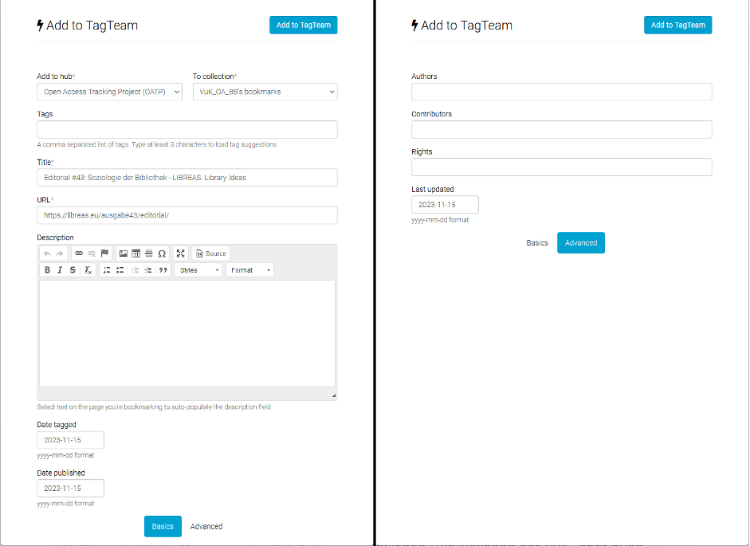

### Vernetzungs- und Kompetenzstelle Open Access Brandenburg

Mit der Verabschiedung der Open-Access-Strategie des Landes
Brandenburg[^1] am 8. August 2019 verpflichtete sich das Land
Brandenburg unter anderem zur Einrichtung einer Landesstelle zur
Unterstützung der acht durch das Ministerium für Wissenschaft, Forschung
und Kultur geförderten Hochschulen bei der Open-Access-Transformation.
Im Anschluss an zwei Vorprojekte zur Konzeption und zur
Bedarfsabschätzung zu Open-Access-spezifischen Kompetenzen an den
Hochschulbibliotheken nahm die *Vernetzungs- und Kompetenzstelle Open
Access Brandenburg (VuK)*[^2] zum 1. April 2021 die Arbeit auf. Die
Arbeitsaufgaben der VuK reichen von Strategieberatung über
Informationsvermittlung, Einrichtung und Betrieb eines landesweiten
Publikationsfonds für Open-Access-Monografien, Aufbau und Durchführung
eines Open-Access-Monitorings für Brandenburg bis zur Koordination und
Vernetzung der Community. Dafür stehen aktuell zwei Vollzeitstellen zur
Verfügung. Der Aufbau der VuK und ihrer Teilprojekte erfolgen agil und
unter Berücksichtigung der immer wieder spontan aufkommenden Bedarfe aus
den Einrichtungen und der Open-Access-Community. So ist es auch nur
folgerichtig, dass die VuK inzwischen auch als Anknüpfungspunkt für
weitere Spin-off-Projekte, wie das im September dieses Jahres gestartete
Projekt "Kulturwandel in der Rechtswissenschaft" (KidRewi),[^3]
fungiert. Momentan wird die VuK evaluiert und aktiv weiterentwickelt.

Im vorliegenden Beitrag wird eine besondere Facette des auf die
Open-Access-Community gerichteten Engagements der VuK beleuchtet: das
Einpflegen von Quellen und Publikationen zum Thema Open Access aus dem
Umfeld der VuK in das "Open Access Tracking Projekt".

### Open Access Tracking Projekt

Das "Open Access Tracking Projekt" (OATP) ist ein von Peter Suber[^4]
gegründetes Projekt zur Verschlagwortung von Webinhalten zum Themenfeld
Open Access. Besonderheiten des Projekts sind, dass es auf einem rein
Community-basierten Ansatz (*crowd-sourced*) aufbaut und die
verschlagwortenden Personen nicht speziell geschult oder ausgebildet
sein müssen (*social tagging*).[^5] Lediglich ein Set von grundlegenden
Konventionen[^6] sollte beim sogenannten *Taggen* eingehalten werden.
Technisch baut der Dienst auf der von der Harvard University
entwickelten (ebenfalls unter der Leitung von Peter Suber) und
betriebenen Social-Tagging-Plattform TagTeam[^7] auf. OATP ist auf
TagTeam ein sogenannter *Hub*. Team-Hubs sind abgegrenzte Bereiche, in
denen die jeweiligen Teams kollaborativ Tags für ihre Inhalte
zusammenstellen.[^8] Die Hubs sind grundsätzlich öffentlich.[^9]

Bezüglich der Inhalte gibt es neben dem Themenbezug zu Open Access und
der Anforderung, dass die Inhalte per URL auffindbar sein müssen, keine
weiteren Einschränkungen -- kreative Arbeiten, Stellenangebote,
Veranstaltungshinweise, aber natürlich auch Publikationen über Open
Access sowie alle weiteren denkbaren Inhalte sind ausdrücklich
gewünscht.[^10]

Der Nutzen von OATP ergibt sich aus der Präsentation der getaggten
Inhalte: Alle verschlagworteten Inhalte (*items*) werden chronologisch
im sogenannten *main feed* dargestellt, aber jedes *Tag* für sich wird
ebenfalls in einem getrennten Feed abgebildet. Die einzelnen Feeds
können so nach individuellen Vorlieben oder Anforderungen abonniert
(RSS, ATOM, JSON) werden -- analog eines klassischen Alertdienstes.
Einmal ins System aufgenommene Items sind aber nicht statisch, sondern
können jederzeit um weitere Tags ergänzt werden -- und dies von allen am
Projekt teilnehmenden Konten, wodurch das auf der Plattform kumulierte
Wissen fortwährend um weitere Informationen oder Zuordnungen
angereichert wird.

Der Weg zur aktiven Teilnahme an OATP ist dabei denkbar einfach und
erfordert lediglich vier Schritte:[^11]

1.  Erstellung eines TagTeam-Accounts,

2.  Freischaltung für OATP,

3.  Einrichtung eines Tagging-Bookmarks im Browser,

4.  Kenntnisnahme (und Einhaltung!) der Konventionen.[^12]

Die OATP-Schlagworte sind grundlegend nach dem Muster *oa.\[tag\]*
aufgebaut. Neben einigen vorgegebenen und vielen durch erstmalige
Verwendung angelegten Tags ist es auch möglich, eigene Tags zu kreieren
und dadurch eigene Communitys abzubilden -- so hat die VuK
beispielsweise den Tag oa.vuk eingeführt und durch kontinuierliche
Nutzung inhaltlich befüllt. Durch das Tagging-Bookmark wird die
Oberfläche zum Erfassen und Editieren aufgerufen, über die neben den
Tags eine Reihe weiterer Metadaten angegeben werden. Einige dieser
Felder werden automatisch aus den Informationen der jeweiligen Webseite
vorausgefüllt (zum Beispiel das Feld Titel und URL). Unabhängig von der
Sprache der jeweiligen Ressource soll bei jeder Verschlagwortung eine
kurze Beschreibung in englischer Sprache beigefügt werden, was dank
Übersetzungstools wie DeepL[^13] schnell erledigt ist.

### VuK x OATP

Die Vernetzungs- und Kompetenzstelle Open Access Brandenburg wirkt neben
ihren offiziellen Aufgaben aktiv auch an
Grassroots-Open-Access-Projekten wie OATP mit. So werden monatlich die
jeweils veröffentlichen Publikationen der VuK, aber auch
Veröffentlichungen zum Thema Open Access aus dem Land Brandenburg von
der VuK per OATP verschlagwortet. Diese Arbeit integriert sich in
bestehende Workflows zur Sicherung eigener Inhalte und wird durch eine
studentische Hilfskraft des Projekts durchgeführt. Der Umfang dieser
Tätigkeit beläuft sich pro Monat aktuell auf ungefähr zwei Stunden --
sie ist aber stark vom Aufkommen der zu verschlagwortenden Inhalte
abhängig und kann somit für andere Institutionen variieren.

Da sich die VuK selbst noch im Status der Erprobung des Dienstes
befindet, ist die Verschlagwortungstiefe bisher nicht sonderlich hoch.
Die durch die VuK meistgenutzten *tags* sind aktuell oa.vuk (unser
eigener Tag für Inhalte von uns), oa.new (für Inhalte, die in den
letzten sechs Monaten erschienen sind), oa.german (für Inhalte auf
Deutsch) und oa.germany (für Inhalte aus Deutschland).

### Macht mit!

Bibliotheken und andere Informationseinrichtungen verwalten nicht nur
Wissen und Informationen im Auftrag von oder für
Wissenschaftscommunitys, sondern sind immer auch Teil dieser Communitys.
Als den Prinzipien des Open Access verpflichtete Einrichtungen sollten
sie insbesondere auch Ansätze wahrnehmen, welche *community-driven*
sind, diese bewerben und sich aktiv im Rahmen ihrer Möglichkeiten
beteiligen. Die Open-Access-Bewegung als Ganzes ist immer nur so stark
wie das Engagement der sich einbringenden Anhänger\*innen zusammen
genommen. Neben rein idealistischen Beweggründen zur Teilnahme stellt
ein solches Engagement immer auch einen kommunikativen Mehrwert für die
jeweilige Institution und ein gelebtes Bekenntnis zu Open Access als
solches dar.

Jede weitere *taggende* Person oder Institution würde das Projekt und
die Open-Access-Community stärken und den Transformationsprozess ein
kleines Stück voranbringen. Zugleich schreibt sich eine teilnehmende
Institution selbst sichtbar und dadurch auch vorbildhaft in diesen
Gesamtkatalog der Open-Access-Aktivitäten ein.

*Die Anregung wurde auch in die Redaktion der LIBREAS eingebracht und
dort gerne aufgenommen.*

[^1]: [https://doi.org/10.5281/zenodo.3757920](https://doi.org/10.5281/zenodo.3757920)

[^2]: [https://open-access-brandenburg.de/](https://open-access-brandenburg.de/)

[^3]: [https://kidrewi.de](https://kidrewi.de), siehe auch
    Hantow, Jonas: Projektstart: KidRewi öffnet Türen für mehr Open
    Access in der Rechtswissenschaft. In: open-access-brandenburg.de /
    Newsblog.
    [https://open-access-brandenburg.de/projektstart-kidrewi-oeffnet-tueren-fuer-mehr-open-access-in-der-rechtswissenschaft/](https://open-access-brandenburg.de/projektstart-kidrewi-oeffnet-tueren-fuer-mehr-open-access-in-der-rechtswissenschaft/)

[^4]: [https://de.wikipedia.org/wiki/Peter_Suber](https://de.wikipedia.org/wiki/Peter_Suber)

[^5]: Suber, Peter: The open access tracking project (OATP). In: SPARC
    Open Access Newsletter, issue #133. May 02, 2009.
    [http://nrs.harvard.edu/urn-3:HUL.InstRepos:4322586](http://nrs.harvard.edu/urn-3:HUL.InstRepos:4322586)

[^6]: Diese und weitere Informationen wie FAQ sind im Wiki des Projekts
    nachzulesen:
    [https://cyber.harvard.edu/hoap/Open_Access_Tracking_Project](https://cyber.harvard.edu/hoap/Open_Access_Tracking_Project)

[^7]: [https://cyber.harvard.edu/research/tagteam](https://cyber.harvard.edu/research/tagteam)

[^8]: [https://cyber.harvard.edu/hoap/TagTeam_FAQ#How_do_I\_create_a\_TagTeam_hub.3F](https://cyber.harvard.edu/hoap/TagTeam_FAQ#How_do_I_create_a_TagTeam_hub.3F)

[^9]: [https://cyber.harvard.edu/hoap/TagTeam_FAQ#How_do_I\_create_a\_private_hub_or_use_private_tags.3F](https://cyber.harvard.edu/hoap/TagTeam_FAQ#How_do_I_create_a_private_hub_or_use_private_tags.3F)

[^10]: Suber, Peter: The open access tracking project (OATP). In: SPARC
    Open Access Newsletter, issue #133. May 02, 2009.
    [http://nrs.harvard.edu/urn-3:HUL.InstRepos:4322586](http://nrs.harvard.edu/urn-3:HUL.InstRepos:4322586)

[^11]: Ausführliche Anleitung mit Links unter:
    [https://cyber.harvard.edu/hoap/Get_started_as_a\_tagger](https://cyber.harvard.edu/hoap/Get_started_as_a_tagger)

[^12]: [https://cyber.harvard.edu/hoap/OATP_conventions](https://cyber.harvard.edu/hoap/OATP_conventions)

[^13]: [https://www.deepl.com/de/translator](https://www.deepl.com/de/translator)
