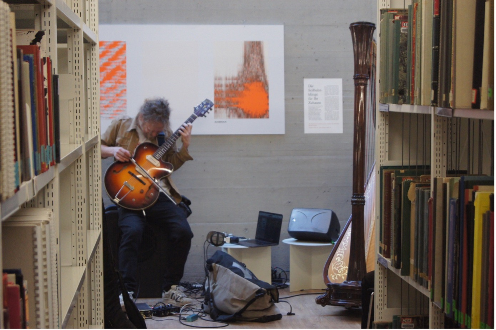
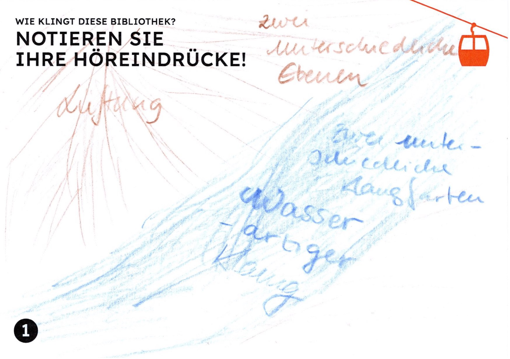
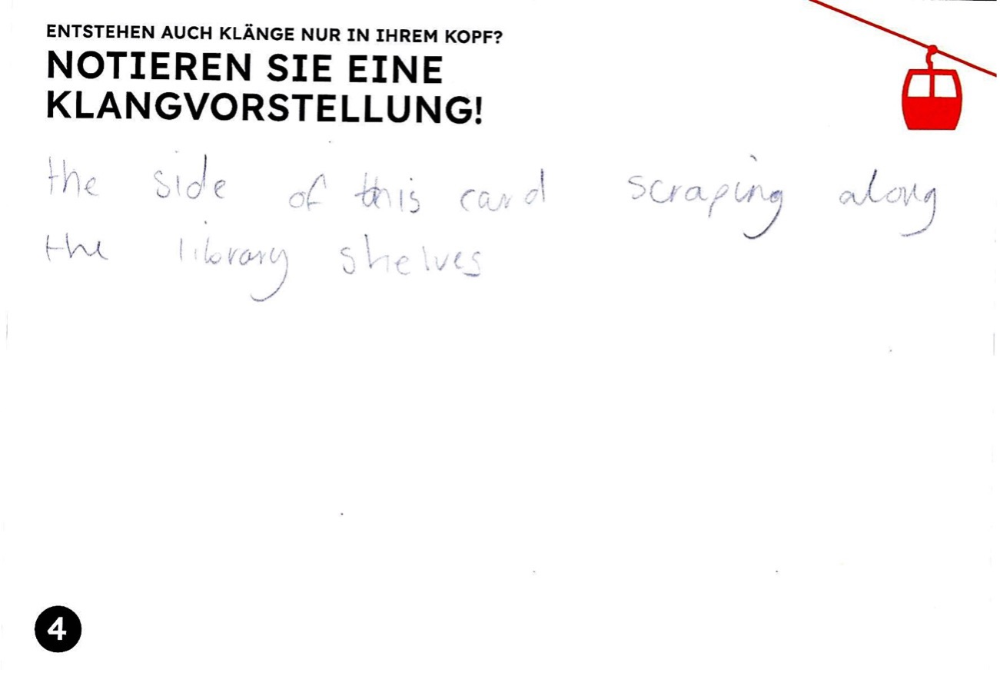
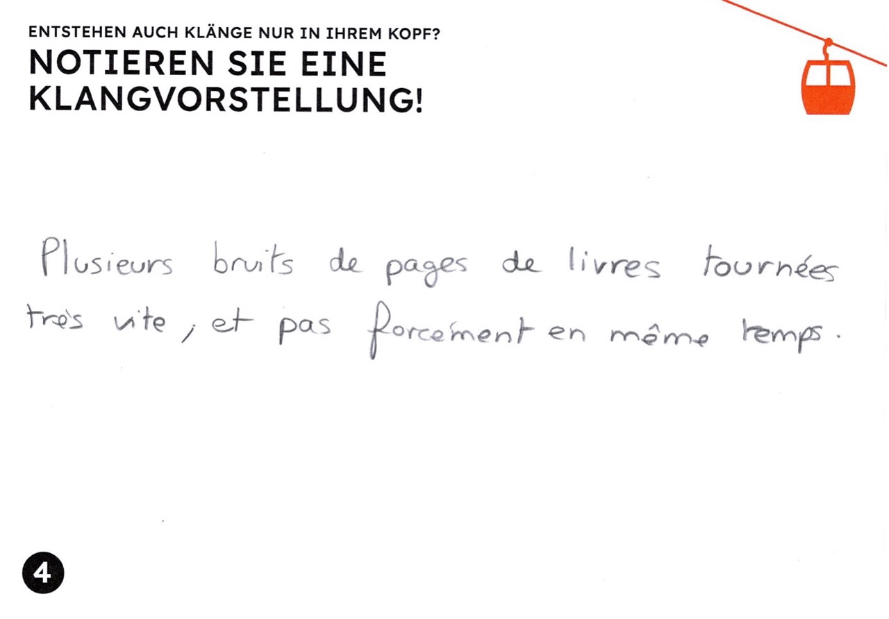
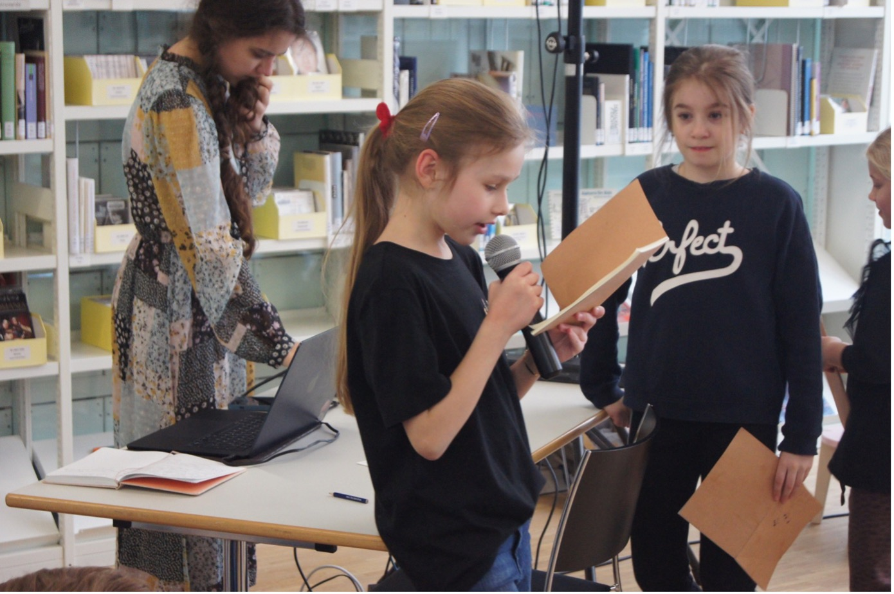

Die Bibliothek von Babel, beschrieben von Jorge Luis Borges, ist ein
stiller Ort. Jedenfalls widmet sich die gleichnamige Erzählung nur ihrer
visuellen Erscheinung: Selbst Bücherverbrennungen und
Selbstmordndcloude, die sich laut Borges in diesem papierenen Universum
ereignen, scheinen lautlos zu geschehen. Zwar wird behauptet, dass diese
unendliche Bibliothek alle kombinatorisch möglichen Bücher enthalte,
doch die Erzählung verweist vor allem auf sich selbst, auf fiktionale
Literatur und Literaturwissenschaft. Bücher über Musik finden z. B.
keine Erwähnung -- vielleicht weil sie sich nicht einfach einreihen
lassen als weitere fantastische Konstellation von 25 Schriftzeichen,
sondern ebenso Notenbeispiele, ergänzende Tonträger und Porträts von
ernst blickenden Komponisten erfordern.

Die Bibliothek von Basel, die Vera Oeri Bibliothek der Musik-Akademie
Basel[^1], stellt als grösste Musikaliensammlung der Schweiz also
Borges' Bibliothek spielend in den Schatten: Dieses Universum ist
wirklich unendlich, nicht als Magazin oder Bibliothekskatalog, sondern
in den unendlichen Möglichkeiten, diese Noten, Tonträger, Datenbanken
und Media-Kits zu nutzen, zu interpretieren und mit anderen zu teilen.
Mitten in der Stadt Basel ist die Bibliothek zwar ein Raum der Stille,
doch gefüllt mit Musik und nicht ruhig: In der "Musikbox" spielen Kinder
Musikspiele, im Co-Working-Space werden Musikvermittlungsprojekte
diskutiert oder Eigenkompositionen in eine Notationssoftware getippt und
Musik aus allen Zeiten wird im Kopierraum geräuschvoll durch die
Maschine gezogen, um sie an einem anderen Ort zu spielen, aber auch im
Lesesaal zu studieren, also sich innerlich vorzustellen.

### Luftige Ohrwürmer

Wenn man alle Klänge und Ohrwürmer, die die Nutzer:innen der Vera Oeri
Bibliothek im Kopf mit sich tragen, hörbar machen könnte, das ergäbe
nicht was Borges in seiner Bibliothek als "Meilen sinnloser Kakophonien"
beschreibt, sondern eine polyphone, klangräumlich differenzierte
Mehrchörigkeit, wie sie Wim Wenders in der berühmten Bibliotheksszene
von *Der Himmel über Berlin* (1987)[^2] als *Soundwalk* inszeniert: In
der spektakulären Architektur der Berliner Stabi präsentiert sich der
Klang zwar als ephemer und flüchtig, doch gerade deshalb formbar in Zeit
und Raum, performativ und metamorph.

Nun ist die Hochschule für Musik Basel, unter dem selben Dach wie die
Vera Oeri Bibliothek, tatsächlich im Besitz einer potenziell unendlichen
Klangbibliothek: Seit 2020 zeichnet der Schweizer Komponist und
Musikforscher Michel Roth Eigenschwingungen von Seilbahnseilen in den
Urner Alpen auf. Diese so genannten "Singenden Seile" treten vor allem
auf, wenn die Bahn nicht fährt; die Einheimischen beobachten das
Phänomen über Stunden und Tage, nachts stört es sie manchmal, doch es
bedeutet auch etwas Vertrautes und Heimatliches und begleitet sie durch
die Jahreszeiten. Bergbauern nutzen das Singen zur lokalen
Wettervorhersage. Roths Tonarchiv[^roth] umfasst bereits
Hunderte von Aufnahmen, wobei er ein Gerät entwickelt hat, das
Seilklänge auch live streamen und damit endlos aufzeichnen lässt[^seil].

### Von der Klangbibliothek zum Klang der Bibliothek

Dieser Klangbibliothek und dem zugehörigen Forschungsprojekt hat die
Vera Oeri Bibliothek im März 2024 eine Ausstellung mit
Begleitprogramm[^3] gewidmet, die unter dem Titel *Singende Seile.
Klingende Stadt* auch den Transfer in die akustische Ökologie des
urbanen Raums thematisiert: Welche Klänge prägen unseren Alltag in der
Stadt, welche beobachten wir, geben uns Identität und Orientierung oder
deuten auf Veränderungen unserer Umwelt hin beziehungsweise werden als
störend empfunden?

Nebst live gestreamten Klängen aus den Alpen und Zugriff auf Michel
Roths digitale Klangbibliothek verwandelte sich die Vera Oeri Bibliothek
in eine Klangseilbahn: Szenografisch geführt von im Raum verspannten
orangen Seilen konnte man über vier Stationen und Etagen (entlang der
vier Hörachsen der amerikanischen Komponistin Pauline Oliveros) den
Klangraum der Bibliothek erkunden.

#### 1. Hörachse

Das Publikum wurde mit Postkarten zu eigenen Hörexperimenten angeleitet,
zum Beispiel:

#### 2. Hörachse

Die Besuchenden wurden gebeten, den Klang der Bibliothek auf
bereitgelegten Postkarten zu beschreiben:

 

#### 3. Hörachse

Das Publikum konnte auf diesen Postkarten auch eigene Hörerinnerungen
festhalten, wobei einige Beiträge ebenfalls die Musikbibliothek
thematisierten:

 

 

Die mehrfach erwähnte Lüftung der Bibliothek, die sowohl positiv
("Wasserfall") als auch negativ ("nervig") konnotiert wurde, wurde mit
Roths Forschungsmethode in die Ausstellung integriert, indem nebst dem
"Singen" von zwei Seilbahnen auch das Rauschen eines Lüftungsrohrs der
Bibliothek über Hunderte von Stunden live gestreamt wurde.

#### 4. Hörachse

Und schliesslich durften innere Klangvorstellungen oder kreative
Klangideen auf Postkarten festgehalten werden -- was wiederum einige
Besuchende direkt auf die Bibliothek und ihre Infrastruktur bezogen
haben:

Über die Ausstellungsdauer akkumulierten sich so auf den Magnettafeln
etwa 90 Beiträge von Besucher:innen der Ausstellung oder zufällig
anwesenden Nutzer:innen der Bibliothek.

Ein wichtiger Bestandteil des Projekts waren konzentrierte akustische
Interventionen in die akustische Ökologie der Bibliothek: Eine immersive
Klanginstallation übertrug fühl- und hörbar Seilbahnschwingungen auf die
Metallstreben des Bibliotheksfoyers, der Ruheraum der Bibliothek wurde
an einem Tag mit wellenartigen Schwingungen des Seils einer Basler
Rheinfähre geflutet, in den Rollschränken wurden kleine Lautsprecher mit
kaum hörbaren elektronischen Summtönen versteckt, im Ausstellungsverlauf
wurden mehrere Performances oder performative Führungen in der
Bibliothek veranstaltet (siehe oben die erste Abbildung dieses
Beitrags).

#### Hör-Spiele

Und wie klingt eine Bibliothek mit 18 lebhaften Kindern? Wie kann man
diesen Kindern zwischen neun und zwölf Jahren vermitteln, dass nicht nur
Melodie und Rhythmus schöne Klänge sind, sondern auch alltägliche
Geräusche, die wir vielleicht gar nicht beachten, zu Musik werden
können? Als Teil der Ausstellung *Singende Seile. Klingende Stadt* fand
ein mehrteiliger Workshop mit einer ukrainischen Schulklasse statt,
geleitet von der Sängerin und Musikvermittlerin Felicitas Erb zusammen
mit den Musikstudentinnen Oleksandra Katsalap und Anna Alexay und der
ukrainisch-schweizerischen Lehrerin Yelizaveta Kozlova.

Die Schüler:innen, die teilweise erst seit Kriegsausbruch in der Schweiz
wohnen, wurden zunächst durch "Hör-Spiele" sensibilisiert für die
alltäglichen Klänge ihrer Umgebung. Viele Experimente entstammten
didaktischen Medien aus dem Bestand der Vera Oeri Bibliothek. Dann haben
die Kinder ein Hörtagebuch geführt, in dem sie einen Tag lang alles
Gehörte aufgeschrieben haben. Ein Kind schrieb: "Das höre ich am Morgen:
Stille. Dann ruft meine Mutter: "Steh auf!" Dann höre ich das leise
Knistern meines Hochbettes, wenn ich herunterstieg. Den Wasserhahn. Die
Schritte von meinen Füssen... und so weiter..."

### Eigene Klangräume komponieren

Auch die Bibliothek und die Ausstellung *Singende Seile. Klingende
Stadt* wurde von den Kindern klanglich erkundet. Dazu brachte Michel
Roth spezielle Flummibälle mit, mit denen er gelegentlich Seilbahnen
künstlich zum "Singen" bringen kann. Als Klangobjekte dienten den
Kindern aber nun die Metallregale, Fensterscheiben und Holzoberflächen
der Bibliothek -- der ganze Raum wurde zum vibrierenden Resonanzkörper.
Doch selbst als die Kinder ruhig waren, bemerkten sie, dass es in der
Musikbibliothek keineswegs so leise ist, wie man vermuten könnte: Die
Lüftung tönte für viele wie ein rauschender Wasserfall.

Schliesslich konnten die Kinder eigene Kompositionserfahrungen sammeln.
In kleinen Gruppen haben sie Hörausflüge rund um die Musik-Akademie und
die Bibliothek gemacht und Klänge mit Mikrophonen aufgezeichnet:
Türenschlagen, Vogelzwitschern, Wasserrauschen, jemand übt in einem
Zimmer Klavier, Atmen, Kichern. Dabei haben die Kinder sehr verschieden
mit ihrer Klangumgebung interagiert. Die meisten waren zum ersten Mal
auf dem Campus und haben einfach die *Soundscape* erforscht und
beobachtet. Andere haben aktiv etwas geändert, haben gesprochen und
sogar Rhythmen auf Objekten gespielt. Daraus sind am Computer
faszinierende Hörstücke entstanden, wie das folgende Beispiel zeigt:
<https://soundcloud.com/user-975110633/bohdan>

### Klang als Heimat

In der Abschlusspräsentation am 24. März 2024 in der Vera Oeri
Bibliothek haben die Schüler:innen vor den Eltern und interessierten
Zuhörer:innen aus ihren Hörtagebüchern vorgelesen und ihre Kompositionen
präsentiert.

Es wurde deutlich, welche weitreichenden Auswirkungen eine verstärkte
Aufmerksamkeit gegenüber alltäglichen Klängen haben kann: Eine
ukrainische Lehrerin und Mutter, die die Workshops begleitete, gab nach
der Aufführung die berührende Rückmeldung, dass ihr durch das Projekt
aufgefallen sei, dass man auch mitten in der Stadt Basel die Vögel
singen höre -- wie sie es von ihrem ukrainischen Heimatort kennt.

**Dank**

Wir bedanken uns herzlich beim Team der Vera Oeri Bibliothek, namentlich
beim Leiter Thomas Nierlin, für die engagierte Unterstützung und
fachkundige Mitgestaltung dieses Projekts.

[^1]: <https://www.musik-akademie.ch/bibliothek/de.html>

[^2]: <https://www.youtube.com/watch?v=3LsUFzuTeS4>

[^3]: <https://www.fhnw.ch/de/forschung-und-dienstleistungen/musik/hochschule-fuer-musik-klassik/veranstaltungen/2023-24/singende-seile-klingende-stadt>

[^roth]: <http://www.ropesinging.ch>

[^seil]: <http://www.seilsender.ch>