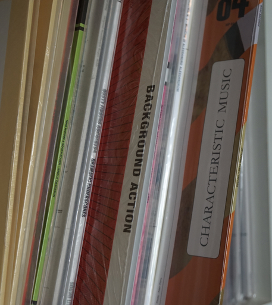
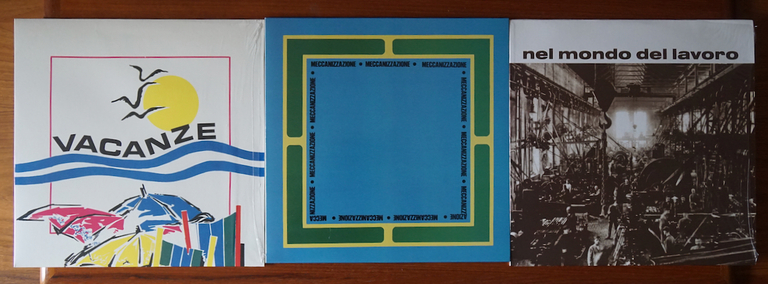

### Introduction

This article covers a niche of music (production) that spans genres and which was created during the past 100 years. We present examples mostly from the 1960s and 1970s due to the author’s collecting focus. You may not have heard of the term but you have listened to library music. Think of the theme of your favorite news/sports/crime show or movie[^1] and there is a probability someone produced a moody piece in the hope that a sound(track) editor may pick it up. Although not really commercially available – at least not in record stores – it found its way into record crates for DJs and producers to rediscover it. Some artists sampled this music because it often provided minimalistic drum tracks with bass lines and particular moods.

### Definition Work

Library Music is described as

> "utilitarian music, created for films that did not yet exist, and listened to carefully only by those who select and edit music into films, television, and radio." (Hollander[^2] p. 7)

The difference to soundtracks is mainly that library music is created
independently of film scenes:

> "Film music you write \[based on\] images already existing, but with library music, you are blind. You just work with your imagination." (di Bari as quoted in Hollander p. 230)

It was usually not released as commercial record:

> "Library Music, also known as source or mood music, was made exclusively for use in animations, commercials, film and TV programmes. Never commercially available and only manufactured in limited numbers, these LPs are now highly collectible." (description on back cover of Trunk[^3])

Other synonyms we came across during our investigation are Background
Music, Cue Music, Production Music, Sync(hronization) Music, Stock
Music, Industry Music, Incidental Music, Off-the-shelf Music and
Royalty-Free Music. These terms give some of the function away.

Selected LPs list use cases along the lines of: *Music especially
created for Films, Television, Radio, Publicity and Industrial Use*[^4]
... or *Advertising*. Other labels marketed their recordings as *Music
for Radio and T.V., Musical illustrators, Film Music, Clubs*.[^5]

The records were sent to prospective customers

> "either for a fee, or in the hope that someone somewhere would choose their track as a soundtrack for a TV drama, science programme, radio play, B-movie or porn film." (Dammers in foreword to Trunk p. 8)

In the 1960s and 70s some musicians used their chance to experiment with
new sounds, large orchestras and to become composers:

> "They can probably be counted among the pioneers of that particular electronic European beat music which later crossed the Atlantic and became electro and techno." (Dammers in foreword to Trunk p. 8)

#### TV

Attention seeking music is also needed and utilized in TV programs and
commercials.

> "Music written for Television is a particular art form. It needs to grab you, be immediate, stop you from switching over or switching off." (Brand in *BBC The Sound of TV* -- Theme Tunes[^6])

TV series had their signature tunes to call everyone to the TV once the
show started. It was meant to captivate the audience and keep them on
the channel, away from the remote. Some tunes were used for decades as
themes.

Commercial ads also needed persuasive music which were

> "catchy short clips of music, a bit like idents, known in the trade as stings" (Brand in *BBC The Sound of TV* -- Advertising and Jingles[^7])

After their regular program, some TV stations also used "testcard music"
when they displayed the calibration image late at night, which may have
had its origin in a music library.

#### Usage Examples

A studio soundtrack editor would collect a 'library' of music LPs that
s/he could reuse if tasked to produce a soundtrack for a movie or TV
show because not every movie production allocated a budget for a
composer but still needed atmospheric sounds or music. For example, the
James Bond franchise utilized production music (Hollander p. 119). The
soundtrack of "Night of the living dead" (1968) is completely made of
library music:

> "The music used in the film was in the public domain from a Capitol/EMI Records Hi-Q stock music library. It originally was used in Teenagers from Outer Space (1959) and cost the filmmakers \$ 1,500."[^8]

Similar situations happen for TV productions, like "Stranger Things"
where previously unused library music was chosen as the series' theme.

These examples illustrate the use of library music in the past and to
these days. Composers discard control over their work which may result
in possibly unexpected utilization as background music in politicians'
public speeches, soft porn or coffee commercials with famous actors (see
foreword by Dammers in Trunk p. 9, Hollander p. 50).

We also know of other purpose music, produced for dedicated situations
such as dance instructions[^9], or club music like "X-102 discovers the
Rings of Saturn" where additional loops are cut into the vinyl lacquer
to allow the DJ to prolong a track.[^10]  (While the loops are not
documented in text on the cover, they are indicated in vinyl by the
infinity symbol.)

#### Diversity

Every kind of music is represented in music libraries (Hollander p. 20).
At the same time, library albums were somehow expected to follow a
common theme or mood (di Bari as quoted in Hollander p. 224). One ad for
a de Wolfe record reads "Prehistoric, Ancient and Period: Colorful
impressions of all periods from pre-history to recent times", as found
on the back cover of *Industry--Go--Go* by The Hawksworth Studio Sound,
published by de Wolfe DW/LP 3162.[^11] Moods are sometimes illustrated
by the cover design, or described in text; more examples for such
diversity can be seen in the record titles (or covers) on this
commercial library music website
<https://www.apmmusic.com/libraries/kpm-kpm>.

The composer had to create a wide and diverse array of mood music to
pre-emptively strike the sound(track) editors' taste for any kind of
situation that may happen. This is a demanding task but at the same time
offers the composers a wide musical spectrum to be creative in
(Mansfield as quoted in Hollander p. 75).

<!-- The image shows parts of the back cover of a tape recording. In a table, every track (not displayed) is augmented by timing information and whether or not it can be classified as, for example, music for children, comedy, documentary, dramatic/tragic, fashion or industry. -->

While composers aimed for musical diversity, the gender representation
was rather less diverse. Creators were often white men -- with few
exceptions. While library music is usually instrumental only, Barbara
Moore[^12] is known for her recording "Vocal Shades and Tones" on de
Wolfe. Delia Derbishire experimented with recorded sounds, this approach
to composition is also known as "Musique concrète".[^13] She was
employed by a library music publisher and later by the BBC for their
"Radiophonic Workshop".[^14] There, she and others provided the BBC with
themes, jingles and sound designs. In 1963 they created, for example,
the memorable theme of the long-running TV series "Dr. Who". Derbyshire
is an acknowledged sound pioneer and fulfilled "the industry's desire to
incorporate sounds from the furthest vanguard of musical
experimentation" (Hollander p. 100).

It's not fully known how many female composers created library music
because of the use of non-female pseudonyms.[^15] These were used for
reasons such as xenophilia[^16] or marketing (see section below).

Walter Carlos -- who later became Wendy Carlos -- was an early
electronic music pioneer who helped improve the Moog synthesizer and
composed some work for TV ads. She is best known for her commercially
successful electronic interpretation of Bach music *(Switched on Bach)*,
and her work as an soundtrack editor or composer for films such as
"Clockwork Orange", "Shining", and "TRON" (1982).[^17]

Library music is known from Western Europe and the USA. More research
would be needed to document production and usage of such music from/in
other parts of the world.

### Metadata

Some library recordings were initiated by a *brief* -- a wishlist by a
label representative which usually had bullet-points of moods that
should be achieved. At other times there was no brief and the producer
was free to guess or experiment what would be appreciated by a future
audience.

The recordings were then enriched with metadata that should help
potential users select the appropriate track right away. The genre,
intended mood, tonality, instruments, tempo were at times presented more
prominently than the artist.

Metadata like tempo is also popular in dance music with bpm (beats per
minute); instruments mentioned (associated with certain moods) also
appear on jazz or rock records. Other metadata like tonality is known
from classic recordings. Rather unique to library music are the mood
descriptions. These were sometimes translated/printed in several
languages to reach an even greater audience. The LP *Selected Sound
9015* included English, German, French, Italian and Spanish and we
reproduce an example description for one of the numbered tracks:

> "SL 585 Action Shuffle (Berry Lipman / Selected Sound) Beat Shuffle; dance orchestra with girl's voice; Drive, happy, swinging. Sports, Journey, young people gathering, airport, big city. 2'47"[^18]

<!-- The image shows the golden back cover of the vinyl record Selected Sound 9015. The whole backside is covered in metadata for each of the numbered tracks, in particular dance type, mood and length. Each description is translated to four other languages. -->

Some labels even allowed customers to scribble down their own notes in a
dedicated column -- 'your notes' on 'MP2000' records or next to the
'tempo' descriptions on 'Tele Music' productions as shown in Figure 3.

<!-- The image shows the back cover of a library music record where the French and English metadata was replaced by a typewriter printout augmented with mood classification and use case. The column for taking notes is still visible and untouched. At the bottom and top right, mood classification in color code is visible for faster retrieval. -->

Other metadata is provided to increase production value, for example
information on possible cuts or edits as found on James Clarke *Mystery
Movie*[^19]:

-   "Heavy driving movement. Good cutaway points."
-   "Fast shaker rhythm with electric piano effects. Shock entry of guitar at 1.10, builds up to climax and let down to end. Possible edit 1.10 to 1.46."

Some labels characterize the whole recording with a set of keywords.
That is sometimes accompanied by track mood descriptions. In other
cases, descriptive titles must suffice. One example for LP and track
mood descriptions can be found on the recording *The Big Beat* by the
label KPM[^20]:

-   "Pounding -- Thumping -- Rocking -- Pulsating"

This helps the user to narrow down a search for the right mood. But not
all labels take advantage of elaborate metadata. Some labels only used
record and/or track titles.

The KPM 1157 LP "The Hunter (Drama Suite) / Adventure Story" is an
example for extensive metadata, as it provides descriptive track names,
length and also remarks for the potential sound(track) editor[^21]:

-   "Heavy Lead (1:43) Menacing underlying movement."
-   "Uneasy Silence (2:05) Static underlying tension--solo bass flute"
-   "Battle (1:00)"

On this LP, some tracks are produced to be combined or used as
alternatives for different effects. Certain remarks represent additional
value for the editor making this record more useful in soundtrack
production:

-   "Hideout (2:55) *Suspended tension. Build to tail end.*"
-   "Hideout---shock (0:05) *Shock chord (as alternative to end).*"
-   "Hideout---let down (0:12) *Build to let down (as alternative end).*"

The Austrian library music composer Gerhard Narholz remembers that such
metadata can be challenging to create:

> "I'm really running out of titles sometimes. Because in Germany, we have over 300,000 tracks in the library. And the number of suitable words to describe music is limited. So it's not easy sometimes." (Narholz as quoted in Hollander p. 151)

On the record *Slow*[^22] he chose to differentiate similar compositions
by numbers, for example:

-   "Deja Vu 1"
-   "Deja Vu 2"

Classifying such music is futile as it is produced to cover all genres.
Unsurprisingly, the few records that appear in record shops lack their
own category and are at times filed under *Soundtracks*, or *Easy
Listening*.

Certain production music labels attempted to provide classification
information on the front cover that could be beneficial for filing away
the media or maybe finding it faster when browsing through the library.
This is exemplified in Figure 4.

<!-- The image shows record covers on a shelf with classification information printed in large font prominently on the side of the cover. -->

Assigning metadata like keywords is non-trivial. A movie producer
searching for library music mentioned in a private conversation with us
that certain online platforms suffer from keyword spamming and that
user-provided keywords were not always helpful, lacking specificity. But
some stock music platforms provide waveform visualization which helps
him in selecting tracks for further investigation.

Other visual information from recordings include the differently shaped
sections of the groove pressed into the vinyl, depending on actual music
dynamics. On master tapes, library producers left pauses in between
tracks to ease editing the tape.

> "And if you didn't do this, the editor might love your music, but just doesn't got time to work out an ending, so he's going to go for something else" (Mansfield as quoted in Hollander p. 41)

#### Covers

Some record covers were produced by the artists themselves, others by
labels. They exhibit a variety in designs owed to the restricted
resources, sometimes resulting in wildly artistic endeavors:

> "The same brief seems to have been given to the sleeve designers as to the musicians -- 'zero budget and complete and utter artistic freedom to indulge in your most disturbed inner fantasies'." (Dammers in foreword to Trunk p. 9)

Some library music covers exhibit a recognizable minimalistic design.
The green KPM 1000 series lacks additional metadata on the front cover.
For some issues, the de Wolfe label chose red covers with minimalistic
black logo and typography. The 'Library Music' edition 'April Orchestra'
uses a particular typography with a different color for each recording.
Cataloging recording series is sometimes challenging.[^23] While the
'April Orchestra' series only mentions the composer, the 'Tele Music'
cover just shows the title.

<!-- The image shows four record covers in different colors with minimalistic typography -->

While we can only provide few examples of cover art here, publications
like Trunk[^24] and Hollander[^25] are dedicated to the various cover
artwork of library music releases. Jonny Trunk also discusses a small
selection of such covers online.[^26] Unfortunately, artistic effort
decreased during the advent of the CD due to its smaller size (Narholz
in Hollander p. 153 f).

### Economics

#### History

Early silent movies were sometimes underscored live by a piano or organ
player. One of the earliest labels producing music for such cinematic
events was "Music de Wolfe" which started releasing music for
'synchronizing' films in 1927. Over the decades, several media types
were utilized: Early recordings were pressed as 10" records -- played at
78 rpm (rounds per minute). Later, 33 rpm 12" vinyl was used for LPs and
a few smaller 45 rpm 7" records were pressed as well, likely for
promotion. Both formats are still playable on modern record players. The
development continued to CDs and, nowadays, digital online media.

The increasing production of films and TV programs starting in the 1950s
and 60s required far more music and *cues*, which could be characterized
as short sounds. Not every production could hire a dedicated composer
and welcomed pre-existing productions:

> "With any new programme, producers on a budget have limited options. To commission a new theme is expensive, so it makes economic sense to use the mood music library and instantly access a wealth of well played, potentially suitable music." (Trunk p. 7)

Cover versions of popular songs were produced and made hit melodies
cheaply available for (re)use. A scene of competing music producers
developed that recorded such productions. The music was sent
speculatively to potential users in film, TV and radio. (Neil Brand in
*BBC The Sound of TV* -- Theme Tunes)[^27]

Production value characterizes library music. It has to deliver a mood
to the point in seconds. Such a production style made it useful for a TV
ad, jingle or similar. And the sound had to be right on the first take,
because there were so many recordings to make and so many other
musicians willing to play.

#### Marketing

From a librarian's point of view, library music could in parts be
compared with 'grey literature': Not available on the open market but
retrievable by or offered to interested parties like creators of sound
tracks, news programs and so on.

Selected recordings were made available to sound editors as a vocal and
instrumental record, which allows cutting between the two versions, for
example, "The Voice of Soul" and "The Sound of Soul" (Hollander
p. 103).[^28] A few records were also released as library and commercial
versions. For example, Tony Newman's "Soul Thing" is very similar to
Keith Mansfield's "Funky Fanfare".[^29] The latter tune has also been
used as background music for a visual snippet which decades later has
been reused by Quentin Tarantino and Robert Rodriguez as part of the
intro sequence of some movies.[^30]

Marketing considerations are also apparent on some record covers, see
the example for Oronzo de Filippi. The artists are less important than
the usability for the target audience -- the sound editor -- which are
reflected in visual art that at best transports certain moods.

> "There are no pictures of \[the musicians\] on the record sleeves, no personality cult, no fashion, no looks or age to confuse things. Another plus is that not a note of this music was ever played live, or sold directly to the public, so irrelevant irritations like audience reaction or 'commercial viability' weren't really a consideration." (Dammers in foreword to Trunk p. 8)

<!-- The image shows three record covers for the artist Oronzo de Filippi. The left is titled 'Vacanze' and shows a stylized beach scene on a white background. The record in the middle is titled 'Meccanizzazione' inside a large square on a blue background. The cover to the right shows a black and white scene from a factory floor and the title 'Nel Mondo Del Lavoro'. -->

Marketing included playing music for clients in person, because vinyl
records exposed some crackles and noise -- not helpful in selling rights
to certain music. Listening to (master) tapes was offered as well
(Narholz in Hollander p. 151).

Some marketing strategies are common in the music business. A record
distributor would describe the media briefly in a catalog, a fellow
artist may have been tasked to write a commentary printed as liner notes
on the back. The musicians/producers/composers would give each track a
remarkable (or descriptive) name and add notes about, for example, tempo
and instruments. In addition to that, library music also received
information about the atmosphere or mood. Today, library music is at
times also marketed by who sampled the records or catalog.[^31] The
label KPM was also rebranded to revive its old household name.[^32]

The music itself also works as a marketing tool and helped composers to
get into movie or TV music business -- as an example (and mentioned
before), the theme music for the Netflix series "Stranger Things" was
born as a library recording.[^33]

Library music labels encouraged their composers/musicians to take on
pseudonyms/aliases. Otherwise a single composer would have been
mentioned on 20--30 records which was assumed to deter potential buyers.
Most producers are secretive about it as it allowed them to get more
music into the market (to be reused). Some composers are said to have
tens of thousands of records under several names (Hollander p. 27).
Others used pseudonyms to bend rules as their artist names were likely
contracted to a publisher. Some composers used different names because
the audience was assumed to be biased to believe that if some composer
could write classical music, they could not write a jazz piece or dark
tune (Narholz in Hollander p. 151).

#### Rights and Licensing

The Music Union in the UK required each and every track recorded to be
enriched with metadata like who and when it was recorded in order to get
royalties whenever it was (re)used (Kerridge in Hollander p. 34). This
at times conflicted with the hire-for-money approach to such music
productions and the intended rights ownership. As a consequence, London
based labels like "Themes" had most of their sessions recorded in
Germany (Trunk p. 226). (In parts, because German recording engineers
had the reputation to be "very correct" (Kerridge in Hollander p. 37).)

The story goes that one of the Beatles convinced Michael Jackson to buy
music rights, who then decided to buy the rights to the Beatles music.
Michael Jackson is also said to have bought the rights for the library
label Bruton music (and probably others). Handling music rights
continues to be a lucrative business.[^34]

Some labels disposed of their old stock of library music when its
perceived usefulness decreased. That's how some of the vinyl became
available to the general public -- an opportunity some record collectors
jumped on. At the same time, recordings -- made available to prospective
users and/or later discarded -- must not be re-sold. So, discarded dead
stock appearing on online auction platforms is only currently tolerated
(Hollander p. 30).

Once digitization is done, it becomes easier to "request a
synchronization license", see for example the platform
<https://secondhandsongs.com> where the concept is explained as:

> "A synchronization license allows you to use the work with some kind of visual media output (film, television shows, advertisements, video games, accompanying website music, movie trailers, etc.)."[^35]

#### Experiments

Some argue that due to the economic situation, composers were asked to
produce a lot of music. They were given freedom to experiment, and they
did so (Parker in Hollander p. 49).

> "The \[coloursound\] label's catalog \[...\] now stands as a tribute to the unfettered creative license that libraries were able to provide to their forward-thinking musicians who, frustrated by the whims and constraints of the commercial scene, found complete freedom in the world of production music." (Hollander p. 156)

These were talented composers, often building their own studio or maybe
being invited to some label's studio. Some of the composers experimented
heavily with unusual instruments like the harpsichord or later analog
synthesizers which is reflected in the relationship to "Musique
Concrète".

TV testcards -- originally not meant to be seen by the general public
but displayed throughout the program at certain times -- received their
own musical treatment and library music labels issued something as
background. It may have been Easy Listening or Jazz if it was not the 10
min sinus tone. Technically not library music, testcard music also
attempted to create moody atmospheres on a channel that had nothing else
to show.

#### Session Musicians

Writers and producers shared most of the rights and profits. The actual
musicians were hardly credited, as they were mostly thought to be
replaceable. They were paid after the session (Narholz in Hollander
p. 151) and usually saw no royalties from the recordings. Session
musicians were used in many other genres and recordings to the same
effect. Some groupings became well-known and were in-demand in the
recording industry.[^36]

### Recommendations for Further Reading/Watching

Articles and Books:

-   Nate Patrin (2014) "The Strange World of Library Music", <https://pitchfork.com/features/starter/9410-library-music/>
-   Jonny Trunk (2019) "The What, How and Why of Library Music", <https://daily.redbullmusicacademy.com/2019/08/the-what-how-and-why-of-library-music>
-   Adrian Kerridge (2016) "Tape's rolling, take one!", \[Hertford\] : M-Y Books, digitized book via <https://archive.org/details/tapesrollingtake0000kerr>

Documentaries (video or audio):

-   "Library Music Film": 2018 documentary by Paul Elliott and Sean Lamberth (113 min), <https://www.imdb.com/title/tt24510110/>; extended teaser (5:08 min) <https://www.youtube.com/watch?v=RgOMibjOJcw>
-   Trailer (6:40 min) marketing the "Unusual Sounds" publication: <https://www.youtube.com/watch?v=-2CgmA0-X-U>
-   Jonny Trunk (2011) "Into the Library", BBC radio program, <https://www.bbc.co.uk/programmes/b01061hr>
-   "Sisters with Transistors": 2020 documentary (126 min) by Lisa Rovner, <https://www.imdb.com/title/tt6744250>

Audio Mix of different library music recordings:

-   Library Music Mix (54 min) <https://soundcloud.com/djslingshot/walking-in-the-dark-library-music-45s-vol-1>

### References

"Neil Brand's Sound of TV" (TV documentary series, BBC, 2020), episode "Theme Tunes" <https://www.imdb.com/title/tt13612792>

"Neil Brand's Sound of TV" (TV documentary series, BBC, 2020), episode "Advertising and Jingles" <https://www.imdb.com/title/tt13630856>

Hollander, David (2018): Unusual Sounds. New York: Anthology Editions. (ISBN: 978-1-944860-12-7)

Trunk, Jonny (2016): The Music Library. London: Fuel design \& Publishing, Revised and expanded edition. (ISBN: 978-0-9931911-3-8)

[^1]: One example would be Nora Orlandi's composition "Dies Irae" that was used in Tarantino's Kill Bill movies.

[^2]: Hollander, David (2018): Unusual Sounds. New York: Anthology Editions. (ISBN: 978-1-944860-12-7)

[^3]: Trunk, Jonny (2016): The Music Library. London: Fuel design \& Publishing, Revised and expanded edition. (ISBN: 978-0-9931911-3-8)

[^4]: See description on record back cover (top right) of Lesiman "High Tension Vol. 1" <https://www.discogs.com/master/3067421-Lesiman-High-Tension-Vol-1/>.

[^5]: See description on record back cover of Janko Nilovic "Soul Impressions" [https://www.discogs.com/master/173647](https://www.discogs.com/master/173647).

[^6]: "Neil Brand's Sound of TV" (TV documentary series, BBC, 2020), episode "Theme Tunes" <https://www.imdb.com/title/tt13612792>.

[^7]: "Neil Brand's Sound of TV" (TV documentary series, BBC, 2020), episode "Advertising and Jingles" <https://www.imdb.com/title/tt13630856>.

[^8]: See the trivia section in IMDB for the 1968 film "Night of the living dead", directed by George A. Romero, <https://www.imdb.com/title/tt0063350/trivia/?item=tr0628553>.

[^9]: While the use for dance instructions is not made explicit on the record itself, that was the description provided for this record by the second hand vendor. The vinyl labels notes "Educational record" and information on the record's beat, see images at <https://www.discogs.com/release/5964268-Unknown-Artist-Take-Me-Along>.

[^10]: See images at <https://www.discogs.com/release/12764-X-102-Discovers-The-Rings-Of-Saturn>.

[^11]: See images at <https://www.discogs.com/release/14192563-The-Hawksworth-Studio-Sound-Industria-Go-Go>.

[^12]: The musicians Lorraine Bowen and Sarah Angliss gathered material (including a discography) on Barbara Moore -- "a composer, arranger and vocalist who worked in film, television and radio", see <https://www.barbaramoore.co.uk/>.

[^13]: The charitable organization "Delia Derbyshire Day" provides detailed information on the musician, see
    <https://deliaderbyshireday.com/>. For more information on "Musique concrète" see <https://en.wikipedia.org/wiki/Musique_concr%C3%A8te>.

[^14]: The Radiophonic Workshop was initiated to provide the BBC with electronic sounds for their diverse broadcasting needs. For more information see the blog <https://www.soundonsound.com/people/story-bbc-radiophonic-workshop> or entry in the "History of the BBC" <https://www.bbc.com/historyofthebbc/100-voices/pioneering-women/women-of-the-workshop>.

[^15]: See the article "'Madri Dell'Invenzione' Meets 'La Donna Invisibile:' Ten Unsung Italian Library Music Composers. A breakdown of the female forerunners of the experimental library music
    metropolis" by Andy Votel, <https://daily.redbullmusicacademy.com/2019/08/italian-female-library-music-composers>.

[^16]: In one of Orlandi's soundtrack compositions she was "credited with the pseudonym Joan Christian. That was a judgement call, because producers were infected with xenophilia at that time" (as documented on the back cover of her record "A Doppia Faccia", <https://www.discogs.com/release/14869649-Nora-Orlandi-A-Doppia-Faccia/>).

[^17]: Villalba, Juanjo (2022): "Wendy Carlos: The brilliant but lonely life of an electronic music pioneer", <https://english.elpais.com/culture/2022-12-12/wendy-carlos-the-brilliant-but-lonely-life-of-an-electronic-music-pioneer.html>. For information on "Switched on Bach" see <https://www.discogs.com/master/76226-Walter-Carlos-Switched-On-Bach>.

[^18]: See images of the record cover at <https://www.discogs.com/release/2728337-The-Sound-Of-Berry-Lipman-Band-Lets-Talk-About-Music>.

[^19]: James Clarke's "Mystery Movie" was published by Themes International (TIM 1015), see <https://www.discogs.com/release/12577800-James-Clarke-Mystery-Movie/>.

[^20]: *The Big Beat* by composers Keith Mansfield and Alan Hawkshaw (published 1969 by KPM), see <https://www.discogs.com/master/80755-Keith-Mansfield-Alan-Hawkshaw-The-Big-Beat/>.

[^21]: *The Hunter (Drama Suite) / Adventure Story* was published in 1975 by KPM and compiles works by different composers, see <https://www.discogs.com/master/1653869-Various-The-Hunter-Drama-Suite-Adventure-Story>.

[^22]: See image of the back cover for *Slow* at <https://www.discogs.com/master/3294286-Various-Slow-Motion-And-Movement>.

[^23]: As an example, see the entry in the "profile" field of the following database entry, pointing out that 'April Orchestra' is not the artist, see <https://www.discogs.com/label/52749-April-Orchestra?page=1>.

[^24]: Trunk, Jonny (2016): The Music Library. London: Fuel design \& Publishing, Revised and expanded edition. (ISBN: 978-0-9931911-3-8)

[^25]: Hollander, David (2018): Unusual Sounds. New York: Anthology Editions. (ISBN: 978-1-944860-12-7)

[^26]: Selection of ten of Jonny Trunk's favorite library music albums, see <https://www.thewire.co.uk/galleries/gallery_the-music-library>.

[^27]: "Neil Brand's Sound of TV" (TV documentary series, BBC, 2020), episode. "Theme Tunes" <https://www.imdb.com/title/tt13612792>

[^28]: "The Voice Of Soul" by Alan Parker and Madeline Bell, see <https://www.discogs.com/master/1429214-Alan-Parker-Madeline-Bell-The-Voice-Of-Soul>. "The Sound Of Soul" by various artists, see <https://www.discogs.com/master/1429531-Various-The-Sound-Of-Soul>.

[^29]: "Soul Thing" by Tony Newman (1968), see <https://www.discogs.com/master/585423-Tony-Newman-Soul-Thing>. The
    track "Funky Fanfare" was released on the compilation "Beat Incidental" (by Alan Hawkshaw and Keith Mansfield, released 1969), see <https://www.discogs.com/master/1441172-Alan-Hawkshaw-Keith-Mansfield-Beat-Incidental>.

[^30]: See the visual snippet <https://www.youtube.com/watch?v=MOwGBzbXb8k> (created by the "National Screen Service" in 1968) and read more about the origin and different use cases at <https://company-bumpers.fandom.com/wiki/Astro_Daters/Grindhouse_Bumpers>.

[^31]: Daniel Sanchez mentions some popular music artists who sampled library music distributed by the label KPM, see <https://www.digitalmusicnews.com/2019/01/16/sony-atv-emi-kpm-music-library>.

[^32]: KPM was founded in 1960 as an independent label, acquired by the major label EMI in 1969, and rebranded to EMI Production Music in 2011. In 2021, EMI (since 2018 subsidiary of Sony Music) announced "EMI Production Music has returned to its flagship brand name KPM Music", see <https://www.sonymusicpub.com/en/news/3331/emi-production-music-rebrands-to-kpm-music>.

[^33]: See the interview with the Band "Survive" whose career was boosted exceptionally after having contributed the score, <https://www.billboard.com/music/rock/survive-stranger-things-soundtrack-interview-7488050/>.

[^34]: For example, the major music label BMG and the streaming platform Netflix have entered a long term agreement for the (exclusive) management and administration of Netflix's music publishing rights,
    see <https://www.bmg.com/de/news/Netflix-BMG-new-exclusive-music-deal.html>.

[^35]: See for example The Charmels' song "As long as I've got you": mouse-over the question mark for entry "Request a synchronization license" at <https://secondhandsongs.com/performance/145209/all>

[^36]: Popular session musician groups were for example "The Wrecking Crew"(<https://www.imdb.com/title/tt1185418/>) or "The Funk Brothers" (<https://www.imdb.com/title/tt0314725>). Others are discussed in the "Library Music Film", <https://www.imdb.com/title/tt24510110/>.
