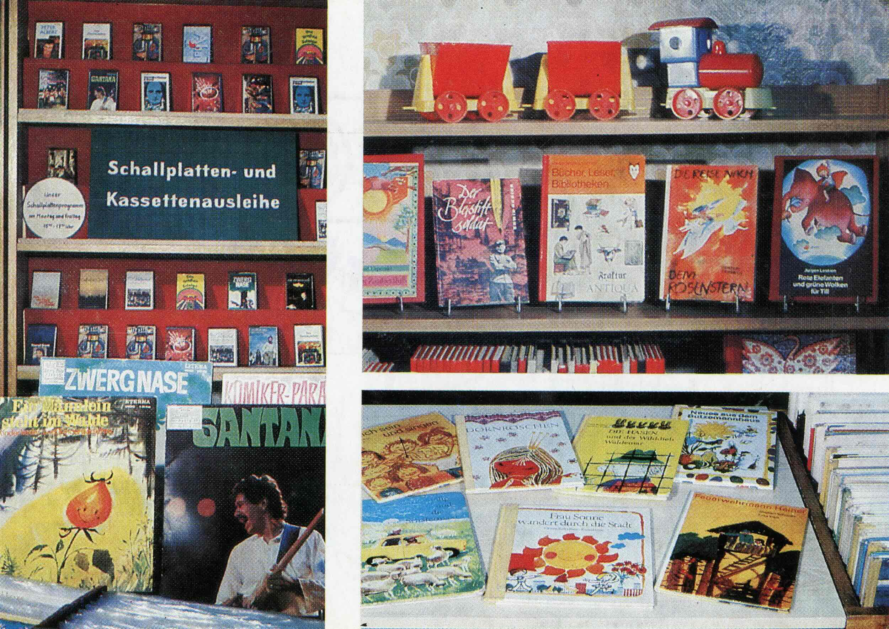
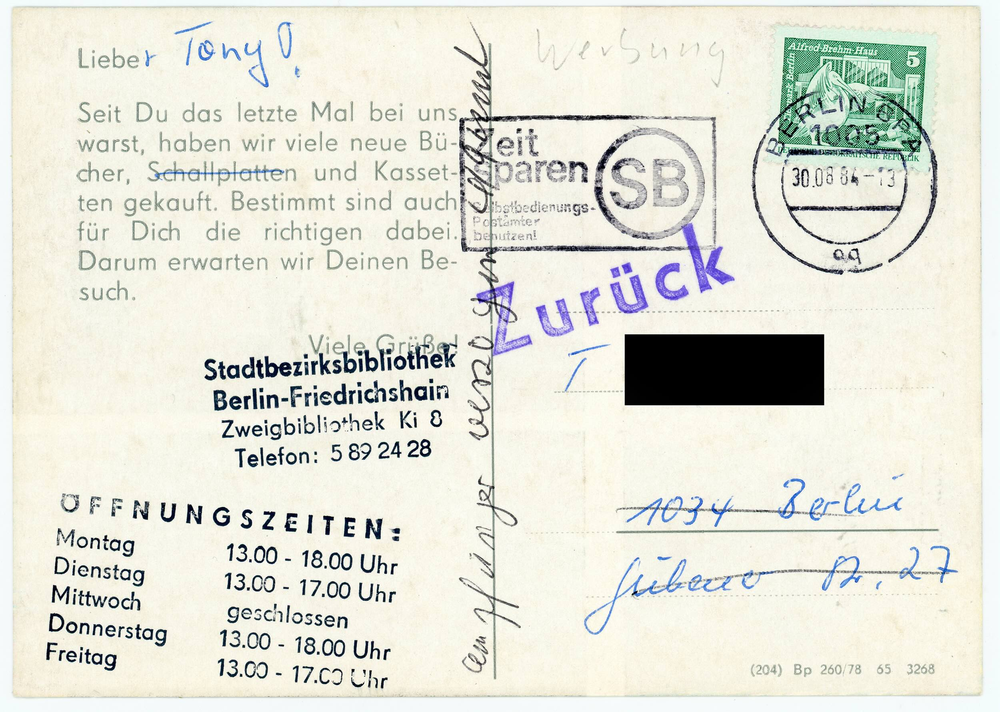
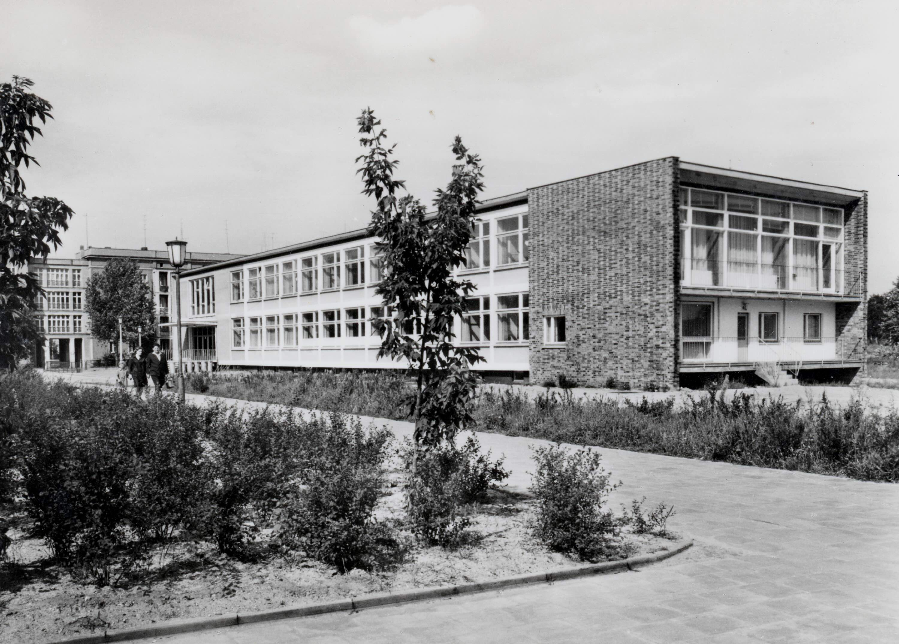

Im Jahr 1984 gab es in Berlin-Friedrichshain ein Dutzend öffentliche
Bibliotheken. So lautet jedenfalls die gedruckte Auskunft des
Telefonbuchs für Ost-Berlin aus diesem Jahr. Neben der zentral
zuständigen Pablo-Neruda-Bibliothek in der Mollstraße / Ecke
Hans-Beimler-Straße, die sogar eine Linguathek mit zum Beispiel
arabischen oder japanischen Selbstlernkursen vorhielt[^1], waren es
sechs "Erwachsenenbibliotheken" und fünf Kinderbibliotheken zur
Versorgung der um die 120.000 Einwohner des Stadtbezirks. Eine dieser
Bibliotheken befand sich in der Wedekindstraße 24 und zwar ziemlich
direkt gegenüber des Hauses, das 20 Jahre später Drehort für die Wohnung
Georg Dreymans, der observierten Hauptfigur in Florian Henckel von
Donnersmarcks "Das Leben der Anderen" werden sollte. Um die Ecke und
Stück weiter die Gubener Straße Richtung Comeniusplatz und dann noch ein
paar Meter weiter wohnte ein Tony. Und pünktlich zum Schuljahresbeginn,
nämlich mit Poststempel vom 30. August 1984, versuchte ein Briefträger
oder eine Briefträgerin eine Erinnerungspostkarte zuzustellen, die
diesen Sommer, also vierzig Jahre später zufällig in meine Sammlung
geriet. Wo sie die Zwischenzeit verbrachte, lässt sich, wie bei
Flohmarktentdeckungen üblich, nicht rekonstruieren.

Rekonstruieren lässt sich allerdings zumindest die interessante
Tatsache, dass Stadtbibliotheken in der DDR mittels eigens dafür
hergestellten Ansichtskarten Öffentlichkeitsarbeit oder besser noch
Beziehungspflege mit den bei ihnen registrierten Nutzenden betrieben.
Für die Kinderbibliothek in der Wedekindstraße waren es immerhin um die
2.000 Personen, sofern man der zeitgenössischen Presse glauben mag.[^2]

Die Ansprache der Zielperson war entsprechend persönlich gehalten,
wenngleich vorgedruckt. Um sich Optionen offen zu halten, begann sie mit
einem "Liebe", das von der versenden Personen je nach gelesener
Geschlechtsspezifik der Adressierten noch ergänzt werden konnte. Im
Gegensatz zu Toni Erdmann, Toni Braxton oder Toni Morrison war Tony in
diesem Fall also ein Junge, eventuell so bereits durch das "y" markiert.
Und dieser Junge wurde von seiner Bibliothek vermisst: "Seit Du das
letzte Mal bei uns warst" -- ist etwas passiert. Nichts Spektakuläres.
Bibliothekstypisch wurde einfach der Bestand aktualisiert.

Auffällig ist an der Nachricht, dass das Medium Schallplatte gestrichen
wurde. Neu waren also nur "viele Bücher und Kassetten". Aus der
Antizipation, dass auch für Tony die richtigen Neuerscheinungen dabei
sein dürften, erfolgte schließlich verbalisiert die Erwartung eines
ebenfalls neuerlichen Besuchs der Bibliothek. Die Botschaft folgt einem
denkbar einfachen appellativen Dreischritt des Marketings: (1) Du, in
diesem Fall als Nutzer und nicht als Kunde, bist uns wichtig. (2) Wir
haben etwas Neues im Angebot. (3) Schau es Dir an. Dazu viele Grüße,
aber leider nicht per Hand unterzeichnet, sondern nur mit dem
Kontaktstempel. Das schwächt das Ansprachesignal wiederum ab. Was genau
soll Tony mit der im Stempelbild gelieferten Telefonnummer anfangen?
Anrufen und erfragen, was es denn genau Neues gibt und ob sich der Gang
wirklich lohnt? Angesichts der überschaubaren Telefonausstattung von
Haushalten in der DDR war nicht einmal gesetzt, dass dies zum
Ortsgespräch aus dem Wohnungsflur möglich gewesen wäre. Am
Comenius-Platz hätte es einen öffentlichen Münzfernsprecher gegeben.
Aber da wäre man schon fast bei der Bibliothek und könnte sich die
zwanzig Pfennig sparen.

Die auf der Karte angegebenen Öffnungszeiten verweisen auf einen
Abgleich mit dem Schulbetrieb. Da die Kinderbibliothek in der
Wedekindstraße auch die umliegenden Schulen versorgte[^3], ist davon
auszugehen, dass man vormittags auch mal in die Einrichtungen ging. Der
Mittwoch fiel aus, denn an diesem fand der Pioniernachmittag statt und
machte die Kinder in Friedrichshain mit den Zielen, Rollen und
Möglichkeiten der sozialistischen Gesellschaft vertraut. Beispielsweise
durch das Sammeln von Altpapier, was an guten Tagen durchaus mal eine
Ausgabe des "Neuen Leben" oder der "NBI" und an noch besseren sogar eine
Ausgabe der Zeitschrift "Das Magazin" in die kleinen Hände der die
Treppenhäuser durchsteigenden Altstoffsammler\*innen brachte. Diese
besonderen Drucke verließen die sorgsam verschnürten Zeitungspakete oft
wie von selbst auf dem Weg zur nächsten Sekundärrohstoffannahmestelle,
von der es eine auf halbem Weg zwischen Tonys Adresse und der
Kinderbibliothek gab, und wurden anschließend zur mehr oder weniger
heimlichen Lektüre der jungen Pioniere und / oder ihrer älteren
Geschwister.

Eine Besonderheit der kulturellen Übersichtlichkeit, wie sie die DDR
kennzeichnete, war, dass sich die meisten jungen Menschen tatsächlich
sehr offen und intensiv mit dem konfrontierten, was zufällig greifbar
wurde. So besprach der Jugendjournalismus nicht nur die neuesten Pop-
und Schlagerveröffentlichungen, sondern auch neue Pressungen bei ETERNA,
dem Label für klassische Musik. Wer darüber gelesen hatte, fand dann
auch diese Tonträger in den sperrholzigen Schallplattenstellboxen
mancher Kinderbibliothek.

Auch die auf der Bildseite der Erinnerungskarte erkennbaren Titel
spiegeln den eklektischen Mix der medialen Bildungsreise junger Menschen
in der DDR. Hier treffen die hellen Stimmen des Kleinen Kinderchors des
Deutschlandsenders ("Ein Männlein steht im Walde") auf Samba Pa Ti
(Santana). Dahinter warten in der "Komiker-Parade" Aufnahmen von Lutz
Jahoda, Lotte Werckmeister und natürlich Rolf Herricht und Hans-Joachim
Preil für alle, die "Zwerg Nase" in der Hörspielfassung mit niemand
Geringerem als dem DEFA-Star Angelica Domröse in der Stimmrolle der Gans
bereits durchgehört haben.

Das Buchangebot bildet die Kinderbücher der DDR-Gegenwart ab: Da wären
Erwin Bekiers Geschichte des sowjetischen Frontzeichners Wladimir
Bogatkin und Herbert Friedrichs vielfach aufgelegtes Sci-Fi-Märchen "Die
Reise nach dem Rosenstern". Zwischen beiden wiederum leuchtet das
Leitbuch aller DDR-Kinder, die die Bibliothek nicht nutzen, sondern
irgendwann auch einmal als Arbeitsort haben wollten: das von Hansgeorg
Meyer verfasste und von Gisela Wongel illustrierte Kinderlexikon
"Bücher, Leser, Bibliotheken". "Unterhaltsam werden junge Leser mit den
Möglichkeiten der Bibliotheksbenutzung, mit der Anfertigung einer
eigenen Bücherkartei, mit einigen früher und heute gebräuchlichen
Schriften usw. bekannt gemacht." schrieb Helmut Casper 1977 in seiner
Rezension zur ersten der mindestens sechs Auflagen.[^4]

Wer sich jetzt wundert, warum eine Karte, die neue Bücher verspricht,
Bücher zeigt, die zum Sendezeitpunkt sieben und mehr Jahre alt waren,
kann sich anhand der Druckgenehmigungsnummer am unteren Rand der
Mitteilungsseite aufklären. Die datiert für diese Ansichtskarte auf das
Jahr 1978 und zeigt damit, dass die Karten entweder doch nicht so oft
verschickt oder in einer mehr als ein halbes Jahrzehnt füllenden
Vorratsauflage angefertigt wurden.

Mir selbst kam das Motiv bislang eher selten unter, was für die erste
Deutung spricht. Oder auch dafür, dass solche Postsendungen kaum von
jemandem aufgehoben wurden. Ich bewahre sie selbstverständlich in meiner
kleinen Ansichtskartensammlung, denn als jemand aus der Generation, die
1986 selbst in Kinderbibliotheken der DDR unterwegs war, ist der reiche
"Text" dieses Exemplars zugleich ein weitschwingendes Zugangsportal zu
meiner eigenen Mediensozialisation.

Da zu meiner kleinen Heimatstadtbibliothek keine expliziten Karten
dieser Art im schmalen Materialbestand zu meiner eigenen Kindheit
überliefert sind, kann ich als Ergänzung nur eine Außenansicht auf einen
Ort mit einer frühen Bibliotheksprägung einschieben: das Pionierhaus im
Pionierweg in Eisenhüttenstadt vom gegenüberliegenden Kindergarten aus
gesehen. Die Bibliothekszimmer lagen, wenn ich mich richtig erinnere, im
Gebäude zur Hofseite. Und ich erinnere mich vermutlich richtig, denn zur
Straßenseite lagen unter anderem die Übungszimmer der Musikschule und
die Klangkulisse, die die zur Bibliothek eilenden Kinder schon außerhalb
des Bildrandes empfing, hallt bis heute nach.

Wieso ausgerechnet das mir vorliegende Exemplar der Friedrichshainer
Bibliothekskarte überlebte, wird vermutlich für immer ein Rätsel
bleiben. Aus Tonys eigener Sammlung wird sie aller Wahrscheinlichkeit
nach nicht stammen und zwar nicht deshalb, weil ich den Berliner
Innenring-Kids der späteren Generation Ostgut nicht zutraue, sich auch
der philokartistischen Nostalgie hinzugeben. Sondern, weil diese Karte
ihren Adressaten nie erreichte. "Empfänger verzogen" zieht sich in
eiliger Zusteller\*innenschrift an der Trennlinie der Karte entlang. Und
im zeittypischen immergrünen Stempellila prangt dazu ein Wort, das
zugleich das Motto meiner Blicke auf derartige Ansichtskarten sein
könnte: "Zurück".

[^1]: Neues Deutschland, 14.08.1984, S.8

[^2]: Neues Deutschland, 25.02.1975, S.8

[^3]: Ebenda

[^4]: Helmut Casper: Unterhaltsames Lexikon für Bücherfreunde. In: Neues
    Deutschland, 19./20. Februar 1977, S. 14
