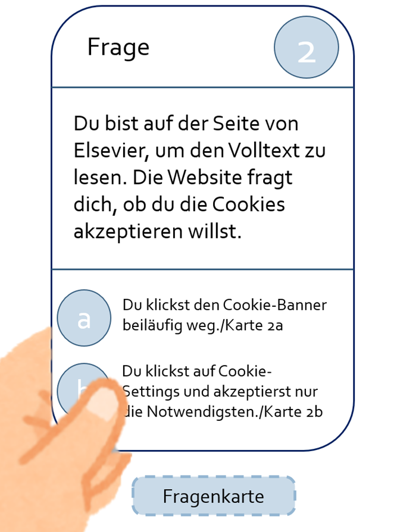
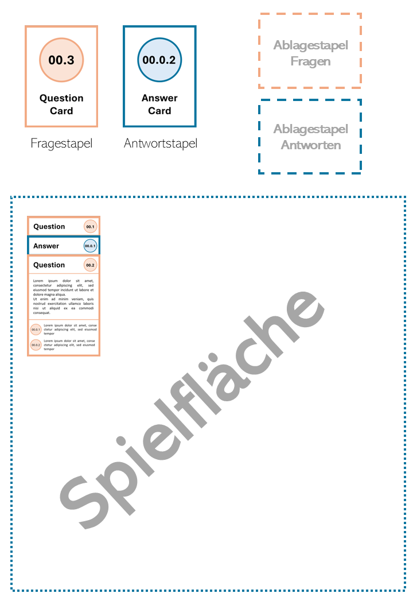

### 1 Einleitung und Hintergrund

Publizieren ist für Wissenschaftler\*innen essentiell. Ohne
Publikationen ist es schwierig, Reputation aufzubauen, die wiederum ein
Grundbaustein für die weitere Anstellung an Institutionen ist.

Nur wenigen Wissenschaftler\*innen ist bewusst, dass bei der für das
Publizieren notwendigen Nutzung von digitalen Verlagsangeboten
persönliche Daten getrackt werden. Persönliche Daten sind allerdings
unter dem Recht auf informationelle Selbstbestimmung geschützt (in
Deutschland GG, 2022, § 2, Abs. 1 in Verbindung mit GG, 2022, § 1
Abs. 1, in anderen europäischen Ländern in Gesetzen mit ähnlichem Ziel).
Dabei handelt es sich um ein Recht, das im Datenschutz verankert ist.

Dennoch legen kommerzielle Firmen, wozu auch einige wissenschaftliche
Verlage gehören, dieses Recht immer wieder möglichst weit aus. Die
getrackten persönlichen Daten können im schlimmsten Fall missbraucht
werden.[^1] Dies kann zum Beispiel zu Deportationen von immigrierten
Wissenschaftler\*innen führen.[^2]

Auf wissenschaftlichen Verlagsseiten werden u.a. Profile, Nutzungsdaten,
Seitenbesuche etc. gespeichert.[^3] Diese können an Data Broker
gelangen, welche diese wiederum an bspw. in den USA an eine
Deportationsbehörde verkauft werden könnten, wodurch eine Gefahr für
Wissenschaftler\*innen entstehen kann.[^4] Ein weiteres Beispiel kommt
aus der Rechtsberatung, das im folgenden Beispiel[^5] nachgelesen werden
kann.

Ein Auftrag von Bibliotheken ist es, Forschende zu unterstützen und
Informationskompetenz zu stärken.[^6] Dabei fällt ein Bewusstsein für
Data Tracking in wissenschaftlichen Verlagen unter ihr Aufgabengebiet.
Diese Vermittlung kann u.a. durch Workshops passieren. Aus diesem Grund
haben wir uns entschieden, einen Workshop für Early Career Researchers
zu gestalten, der gerade für diese Thematik sensibilisiert. Unsere Frage
hierbei ist, wie Wissenschaftler\*innen in den Naturwissenschaften Data
Tracking in wissenschaftlichen Verlagen, sowie deren negative
Auswirkungen und Abwehrmöglichkeiten gegen Data Tracking vermittelt
werden kann.

Im Rahmen des an der Fachhochschule Potsdam durchgeführten Kurses "B 12:
Informationsdidaktik und Informationskompetenz" unter der Leitung von
Prof. Dr. Ulrike Wuttke und dem Praxispartner Dr. Timo Steyer wurde zum
Thema Data Tracking in der Wissenschaft ein Workshop-Konzept entwickelt,
das auf naturwissenschaftliche Early Career Researcher an Institutionen
ausgerichtet ist. Ein Teil dieses Konzepts ist ein Kartenspiel mit
Rollenspiel-ähnlichen Merkmalen.

Wir, die Autor\*innen, haben uns aufgrund bereits erworbener Erfahrungen
im Schulungsbereich sowie in der Arbeit mit naturwissenschaftlichen
Instituten für diese Methode entschieden, um ein möglichst praxisnahes
Konzept zu entwickeln.

Als Ziel wurde eine erhöhte Sensibilisierung der Teilnehmer\*innen für
das Thema Data Tracking wissenschaftlicher Verlage festgesetzt. Zudem
wurde durch die Wahl eines spielerischen Ansatzes eine erhöhte
Wissensfestigung und Beteiligung am Workshop angestrebt.[^7]

Dieses Konzept wurde in einem Pre-ISI-Workshop (ISI = Internationales
Symposium für Informationswissenschaft) am 17. März 2025 vorgestellt und
durchgeführt. Das prototypische Kartenspiel wurde getestet und Feedback
eingeholt.

### 2 Konzept des Spiels 

Der Workshop richtet sich explizit an die Zielgruppe Early Career
Researchers, die in naturwissenschaftlichen Institutionen tätig sind.

Zudem beschränken wir uns auf das Forschungsfeld der
Naturwissenschaften. Wir haben uns für diese Gruppe entschieden, da wir
sowohl im akademischen, beruflichen als auch im persönlichen Umfeld oft
mit dieser Gruppe zu tun haben.

Um die Relevanz des Themas Data Tracking in wissenschaftlichen Verlagen
auch der definierten Zielgruppe näher zu bringen, wurde zuerst ein
Lernziel gebildet. Dieses lautet:

> *Die Lernenden sind sich des Data Tracking durch wissenschaftliche Verlage und dessen negativen Auswirkungen sowie der Abwehrmöglichkeiten gegen Data Tracking bewusst.*

#### 2.1 Idee 

Das Konzept des Kartenspiels orientiert sich an dem
"Du-entscheidest-selbst-Prinzip" beziehungsweise "Choose Your Own
Adventure"-Prinzip,[^8] das unter anderem in der Buchreihe "1000
Gefahren" genutzt wird. In diesen werden kurze Textabschnitte gelesen,
an dessen Ende Entscheidungen gefällt werden können. Abhängig von der
Entscheidung ändert sich der Verlauf der Geschichte.

Auch in unserem Kartenspiel entscheiden die Spielenden, in welche
Richtung die "Geschichte" gehen soll. Bei der "Geschichte" des
Kartenspiels begleiten die Spielenden eine\*n Wissenschaftler\*in,
der\*die eine Doktorarbeit schreiben möchte. Es fängt mit der Auswahl
des Forschungsthemas an und endet mit einer fertig geschriebenen Arbeit.

Teilnehmende werden in Gruppen von zwei bis vier Personen eingeteilt.
Einerseits soll dadurch der Austausch zwischen den Teilnehmenden
unterstützt und ein Ausgleich von unterschiedlichen Wissensständen
ermöglicht werden. Dadurch, dass die Entscheidungen in einer Gruppe
getroffen werden, kann die Scheu eliminiert werden, die "falschen"
Entscheidungen zu treffen und somit "schlechtere Ergebnisse" bei der
Gruppendiskussion vorstellen zu müssen.

Im Laufe des Spiels werden an verschiedenen Punkten Daten getrackt, die
in einem Arbeitsblatt vermerkt werden, und somit den Spielenden
verdeutlichen, welche Daten bei einem digitalen Rechercheprozess
möglicherweise preisgegeben werden.

Im Anschluss an das Spiel findet ein Austausch über die Spielergebnisse
statt, bei dem das neu erworbene Wissen und die gewonnenen Erkenntnisse
aus dem Spiel diskutiert werden.

Das Spiel, eine simulationsbasierte Aufgabe[^9] mit
Rollenspiel[^10]-ähnlichen Merkmalen, basiert auf einem
"entdecken-lassenden-Ansatz"[^11], der es den Teilnehmenden ermöglicht,
eigenständig in Gruppen[^12] mit den von den Teamer\*innen
bereitgestellten Materialien zu arbeiten und so die Anwendung von Data
Tracking im wissenschaftlichen Kontext zu entdecken. Dieses
antizipatorische Lernen[^13] ermöglicht es den Teilnehmenden, ihr
Vorwissen zu aktivieren. Da das Spiel die Teilnehmenden in einer
authentischen Situation agieren lässt, eine aktive Beteiligung anregt
und keinen festen Lösungsweg vorsieht, wodurch es am Ende weder Gewinner
noch Verlierer gibt, ist dieser Ansatz sinnvoll.

#### 2.2 Prozess 

Bei der Konzipierung des Spiels gab es einige Ideen, die nicht alle
verwendet wurden.

Eine davon war es, den Spielenden verschiedene Personas beziehungsweise
"Spielcharaktere" zu geben. Dies würde aber das Spiel komplizierter
gestalten und eventuell die Spielenden dazu verleiten, nicht "sich
selbst" zu spielen, sondern den Charakter und somit andere
Entscheidungen zu treffen. Deswegen wurde dieses Konzept nicht weiter
ausgearbeitet.

Eine weitere Idee war es, auf der Rückseite der Karten weiterführende
Quellen dazu anzugeben, wieso bei dieser Entscheidung diese persönlichen
Daten getrackt werden. Jedoch würden diese Quellenangaben den Spielfluss
unterbrechen und die Karte zu sehr mit Informationen überladen.

Die Sprache des Spiels war auch ein Diskussionspunkt. Die Entscheidung
lag zwischen Deutsch und Englisch. Schlussendlich hatten wir uns für
Englisch entschieden, weil die Naturwissenschaften ein internationales
Feld sind, in dem Englisch die Hauptkommunikationssprache darstellt.

Das endgültige Konzept des Spiels beinhaltet eine Spielanleitung,
(leere) Worksheets, in denen die getrackten Daten vermerkt werden
können, ein ausgefülltes Worksheet für die Teamer\*innen zur Kontrolle,
ein beispielhafter Aufbau des Spiels, und die Karten, die jeweils aus
einem Stapel von Frage- und Antwortkarten bestehen.

Unser erstes Konzept der Karten sah wie folgt aus.

Abbildung 1 zeigt die Fragekarte. Sowohl die Farbe als auch der Text
oben links verdeutlicht, dass dies die Fragekarte ist. Mittig wird die
"Story" gezeigt, und unter dieser werden je zwei Antwortmöglichkeiten
und dessen Nummerierung abgebildet.

In Abbildung 2 ist das erste Konzept der Antwortkarte. Bei dieser ist
oben sowohl die Kartennummer als auch die getroffene Entscheidung zu
sehen. Unter diesen ist die Konsequenz in Textform zusammen mit den
getrackten Daten dargestellt. Im unteren Abschnitt der Karte wird auf
die nächste Karte, die gezogen werden soll, hingewiesen.

Beim Endprodukt (siehe Abbildungen 3 und 4) wurden pragmatische
Entscheidungen hinsichtlich des Designs getroffen. Beispielsweise wurden
die abgerundeten Ecken, die wir ästhetischer finden, gestrichen. Der
Grund hierbei ist, dass das Kartenspiel selbst druckbar sein sollte.
Abgerundete Ecken würden hierbei ein Mehraufwand beim Schneideprozess
sein. Dazu wurden die Farben so ausgewählt, dass die Frage- und
Antwortkarten auch für farbblinde Menschen gut erkennbar beziehungsweise
wenn die Karten in Graustufen gedruckt werden, diese trotzdem
unterscheidbar sind. Auf einem A4-Blatt können acht Karten gedruckt
werden.

Die Storyline, der Text der Karten, zusammen mit den getrackten Daten
und die Entscheidungspfade wurden in einem Baumdiagramm erfasst.

Vor dem Spiel wird dieses aufgebaut.

Links oben wird je ein Stapel von Frage- und Antwortkarten gebildet. Bei
diesen sollte die Rückseite, auf der die Nummer groß zu sehen ist,
sichtbar sein. Rechts oben, neben den Frage- und Antwortkarten, wird
sich im Laufe des Spiels je ein Ablagestapel bilden. Unter diesen vier
Stapeln befindet sich die Spielfläche, auf welcher die Karten, der
Reihenfolge nach, gelegt werden.

#### 2.3 Erste Durchführung des Spiels

Im Zuge einer Movetia-Partnerschaft von der FH Potsdam mit der FH
Graubünden wurde am 17. März 2025 ein Pre-ISI-Workshop (ISI =
Internationales Symposium für Informationswissenschaft) veranstaltet, in
dem das Kartenspiel getestet wurde. Näheres hierzu kann in dieser
LIBREAS-Ausgabe bei Wuttke nachgelesen werden
(<https://libreas.eu/ausgabe47/wuttke>).

Hierbei haben sich zwei Gruppen gebildet. In einer Gruppe waren vier
Studierende aus der FH Potsdam und in der zweiten Gruppe waren insgesamt
sechs Personen plus ein Online-Teilnehmender, die Lehrende oder andere
Personen aus der informationswissenschaftlichen Praxis waren. Somit
waren die Teilnehmenden nicht die Zielgruppe, sodass die Ergebnisse
nicht 1-zu-1 übertragbar sind. Jedoch konnte so eine weitere Sichtweise
auf das Spiel ermittelt werden.

Um eine möglichst realitätsnahe Erfahrung zu schaffen, wurden die Regeln
im Vorhinein nicht explizit von uns erklärt. Stattdessen haben die
Teilnehmer\*innen eigenständig die Spielanleitung gelesen, um mögliche
Verständnisschwierigkeiten zu ermitteln. Bei Fragen und Unklarheiten
standen wir zur Verfügung.

Die Stimmung während des Spiels war positiv. Einige Stellen wurden
humorvoll kommentiert. Beispiele für Reaktionen sind (sinngemäß): "Wir
nehmen LaTeX, wir sind Profis." oder "Online. Ich geh doch nicht extra
in eine Library." Ein weiterer Ausruf war: "Ich geh zum
Koordination-Office, vielleicht gibt es da Geld." Die Interaktion
zwischen den Teilnehmenden führte zu Diskussionen, die unter anderem mit
Abstimmungen und Kommentaren wie "Verräter" auf eine heitere Atmosphäre
hindeuteten. Manche Entscheidungen haben emotionale Reaktionen
ausgelöst. So wurde bei der Frage "You go to the website and the cookie
banner appears. What do you do?" die trockene Antwort "Scream." gegeben.

Konzeptuell wurde das Spiel auf 45 min angesetzt. Die eigentliche
Spielzeit war zwischen 47 Minuten bis zu einer Stunde, jedoch war die
zweite Gruppe auch größer und somit diskussionsfreudiger als im Konzept
vorgesehen war.

Während des Spiels gab es kleinere Verständnisfragen, die mit einer
Überarbeitung des Textes eliminiert werden können.

Beim Feedback wurde zurückgemeldet, dass das Spiel Spaß gemacht und
insgesamt einen positiven Eindruck hinterlassen hatte. Ein
Diskussionspunkt war, dass im Spiel konkrete Software, Webseiten und
ähnliches genannt wurde. Dies ist zwar einerseits realitätsnah,
andererseits sind diese den Teilnehmenden eventuell unbekannt. Die
Lösung hierfür war, den Namen kurze Erläuterungen hinzuzufügen.

Auch die kontinuierliche Aktualisierung des Spiels wurde thematisiert,
da sich vor allem digitale Tools und Produkte mit der Zeit ändern. Dies
sollte bei der Aktualisierung des Gesamtkonzepts des Workshops beachtet
werden, die bestenfalls alle zwei Jahre stattfinden sollte.

Eine Frage unsererseits an die Teilnehmenden war, ob und in welcher Form
wir eine Quellenangabe zu den getrackten Daten erstellen sollten. Der
Vorschlag, dies in Form einer Zusatzkarte beziehungsweise eines
Handbuchs anzufertigen, wurde positiv angenommen. Ein genannter Grund
war, dass der Spielfluss somit nicht durch eine Überladung von
Informationen unterbrochen wird. Dazu werden die Teilnehmenden angeregt,
selbst weiter zu recherchieren.

### 3 Learnings

Eine Herausforderung bei der Konzipierung war es, die Kontinuität der
Informationen und Daten sicherzustellen, sodass zum Beispiel nicht
mitten in der "Geschichte" der Browser wechselt. Zudem sollte auf die
Sprache geachtet werden. Begriffe wie "googeln" werden in einer
Generation beispielsweise als Synonym für "recherchieren" genutzt,
während eine andere Generation dies eher mit einer Sucheingabe in Google
verbindet.

Der Aufwand, das Spiel zu erarbeiten, war hoch. Einerseits mussten die
getrackten Daten, welche von Verlagen getrackt werden (können),
recherchiert und dies mit fundierten Quellen belegt werden. Andererseits
musste eine Storyline mit einem roten Faden entwickelt werden. Diese
Informationen mussten sinnvoll kombiniert werden, um eine realitätsnahe
Spielerfahrung zu ermöglichen. Gleichzeitig musste beachtet werden, dass
die Inhalte des Spiels verständlich aufbereitet werden und bei den
Spielenden ein Lerneffekt entsteht, während das Spiel unterhaltsam
bleibt.

Wir hatten uns auch zum Ziel gesetzt, dass wir das Spiel als eine
Vorlage bereitstellen und diese von Institutionen angepasst und
weiterverwendet werden können. Dabei wurden unter anderem Vorlagen für
die Karten erstellt. Hierbei mussten die Vorder- und Hinterseiten so
positioniert werden, dass sie übereinstimmen. Je nach Drucker kann dies
unterschiedlich schwer sein. Es ist ratsam, die Karten professionell
drucken zu lassen. Zudem bietet sich stabiles Papier oder eine
Laminierung an, um die Karten wiederholt nutzen zu können.

Die analoge Form des Spiels wurde positiv aufgenommen und bestätigt
somit die Wahl dieses Formats. In der Diskussion wurde angerissen, ob
eine digitale Version entwickelt werden sollte. Da aber unsere
Zielgruppe viel digital arbeitet, kann das physische Spielen eine schöne
Abwechslung zum Arbeitsalltag darstellen.

### 4 Ausblick

Während der Diskussion kamen Vorschläge für die Professionalisierung
auf. Einer dieser war die Verbindung von Storyline-Diagramm mit den
Karten, sodass Änderungen im Diagramm gleich im Kartentext übernommen
werden. Ein weiterer Vorschlag war es, das Kartenspiel durch einen
Spieleverlag professionell verlegen zu lassen.

Inhaltlich kann das Kartenspiel auch eine Erweiterungsstufe für
Fortgeschrittene bekommen. Ein andere Nachnutzungsmöglichkeit wäre,
weitere Storylines zu entwickeln. Ein Beispiel ist, das Kartenspiel zu
nutzen, um Studienanfänger\*innen den wissenschaftlichen Schreibprozess
bei Hausarbeiten näherzubringen oder einer jüngeren Zielgruppe einen
Einstieg in Informationskompetenz im Web zu geben.

### Quellen

Biddle, Sam. "LexisNexis to Provide Giant Database of Personal
Information to ICE". The Intercept, 2. April 2021.
[https://theintercept.com/2021/04/02/ice-database-surveillance-lexisnexis/](https://theintercept.com/2021/04/02/ice-database-surveillance-lexisnexis/).

Brauer, Markus. "Erfolgreiche Lehrmethoden im Seminar". In *An der
Hochschule lehren*, 69--86. Springer, Berlin, Heidelberg, 2014.
[https://doi.org/10.1007/978-3-642-42006-1_6](https://doi.org/10.1007/978-3-642-42006-1_6).

Cook, Eli. "Rearing Children of the Market in the "You" Decade: Choose
Your Own Adventure Books and the Ascent of Free Choice in 1980s
America". *Journal of American Studies* 55, Nr. 2 (Mai 2021): 418--45.
[https://doi.org/10.1017/S0021875819001476](https://doi.org/10.1017/S0021875819001476).

dbv. "Wissenschaftliche Bibliotheken 2025 - Strategiepapier zur
Gestaltung von Zukunftsaufgaben im wissenschaftlichen Bibliothekswesen".
Deutscher Bibliotheksverband, 7. Februar 2022.
[https://www.bibliotheksverband.de/sites/default/files/2022-02/Strategiepapier_Wissenschaftliche%20Bibliotheken%202025%20-%20FINAL.pdf](https://www.bibliotheksverband.de/sites/default/files/2022-02/Strategiepapier_Wissenschaftliche%20Bibliotheken%202025%20-%20FINAL.pdf).

DFG-Ausschuss für Wissenschaftliche Bibliotheken und
Informationssysteme. "Datentracking in der Wissenschaft: Aggregation und
Verwendung bzw. Verkauf von Nutzungsdaten durch Wissenschaftsverlage.
Ein Informationspapier des Ausschusses für Wissenschaftliche
Bibliotheken und Informationssysteme der Deutschen
Forschungsgemeinschaft", 28. Juli 2021.
[https://doi.org/10.5281/zenodo.5900759](https://doi.org/10.5281/zenodo.5900759).

Hanke, Ulrike, Martina Straub, und Wilfried Sühl-Strohmenger. "6
Lehrmethoden für die Realisierung von Lehrszenarien an der Teaching
Library". In *Informationskompetenz professionell fördern*, 26--54. DE
GRUYTER SAUR, 2012.
[https://doi.org/10.1515/9783110274387.26](https://doi.org/10.1515/9783110274387.26).

Hanke, Ulrike, und Wilfried Sühl-Strohmenger. "9. Planen und Konzipieren
von Bildungsangeboten". In *9. Planen und Konzipieren von
Bildungsangeboten*, 166--82. De Gruyter Saur, 2015.
[https://doi.org/10.1515/9783110352559-011](https://doi.org/10.1515/9783110352559-011).

Seidl, Tobias. "Didaktische Grundlagen". In *Handbuch
Bibliothekspädagogik*, 119--28. De Gruyter Saur, 2024.
[https://doi.org/10.1515/9783111032030-011](https://doi.org/10.1515/9783111032030-011).

"Volkshochschule Saale-Orla-Kreis: Qualität". Zugegriffen am 23.
September 2025.
[https://www.vhs-sok.de/ihre-vhs/qualitaet](https://www.vhs-sok.de/ihre-vhs/qualitaet).

[^1]: DFG-Ausschuss für Wissenschaftliche Bibliotheken und
    Informationssysteme, "Datentracking in der Wissenschaft: Aggregation
    und Verwendung bzw. Verkauf von Nutzungsdaten durch
    Wissenschaftsverlage. Ein Informationspapier des Ausschusses für
    Wissenschaftliche Bibliotheken und Informationssysteme der Deutschen
    Forschungsgemeinschaft", 28. Juli 2021,
    [https://doi.org/10.5281/zenodo.5900759](https://doi.org/10.5281/zenodo.5900759),
    S. 5.

[^2]: Sam Biddle, "LexisNexis to Provide Giant Database of Personal
    Information to ICE", The Intercept, 2. April 2021,
    [https://theintercept.com/2021/04/02/ice-database-surveillance-lexisnexis/](https://theintercept.com/2021/04/02/ice-database-surveillance-lexisnexis/).

[^3]: DFG-Ausschuss Für Wissenschaftliche Bibliotheken Und
    Informationssysteme, "Datentracking in der Wissenschaft". S. 3 f.

[^4]: Biddle, "LexisNexis to Provide Giant Database of Personal
    Information to ICE".

[^5]: Lamdan, "When Westlaw Fuels ICE Surveillance: Legal Ethics in the
    Era of Big Data Policing".

[^6]: dbv, "Wissenschaftliche Bibliotheken 2025 - Strategiepapier zur
    Gestaltung von Zukunftsaufgaben im wissenschaftlichen
    Bibliothekswesen" (Deutscher Bibliotheksverband, 7. Februar 2022),
    [https://www.bibliotheksverband.de/sites/default/files/2022-02/Strategiepapier_Wissenschaftliche%20Bibliotheken%202025%20-%20FINAL.pdf](https://www.bibliotheksverband.de/sites/default/files/2022-02/Strategiepapier_Wissenschaftliche%20Bibliotheken%202025%20-%20FINAL.pdf),
    S. 9.

[^7]: Tobias Seidl, "Didaktische Grundlagen", in *Handbuch
    Bibliothekspädagogik* (De Gruyter Saur, 2024), 119--28,
    [https://doi.org/10.1515/9783111032030-011](https://doi.org/10.1515/9783111032030-011).

[^8]: Eli Cook, "Rearing Children of the Market in the "You" Decade:
    Choose Your Own Adventure Books and the Ascent of Free Choice in
    1980s America", *Journal of American Studies* 55, Nr. 2 (Mai 2021):
    418--45,
    [https://doi.org/10.1017/S0021875819001476](https://doi.org/10.1017/S0021875819001476).

[^9]: Ulrike Hanke, Martina Straub, und Wilfried Sühl-Strohmenger, "6
    Lehrmethoden für die Realisierung von Lehrszenarien an der Teaching
    Library", in *Informationskompetenz professionell fördern* (DE
    GRUYTER SAUR, 2012), 26--54,
    [https://doi.org/10.1515/9783110274387.26](https://doi.org/10.1515/9783110274387.26).

[^10]: Hanke, Straub, und Sühl-Strohmenger.

[^11]: Ulrike Hanke und Wilfried Sühl-Strohmenger, "9. Planen und
    Konzipieren von Bildungsangeboten", in *9. Planen und Konzipieren
    von Bildungsangeboten* (De Gruyter Saur, 2015), 166--82,
    [https://doi.org/10.1515/9783110352559-011](https://doi.org/10.1515/9783110352559-011).

[^12]: Markus Brauer, "Erfolgreiche Lehrmethoden im Seminar", in *An der
    Hochschule lehren* (Springer, Berlin, Heidelberg, 2014), 69--86,
    [https://doi.org/10.1007/978-3-642-42006-1_6](https://doi.org/10.1007/978-3-642-42006-1_6).

[^13]: "Volkshochschule Saale-Orla-Kreis: Qualität", zugegriffen 8.
    August 2024,
    [https://www.vhs-sok.de/ihre-vhs/qualitaet](https://www.vhs-sok.de/ihre-vhs/qualitaet).
