### Was ist der oa.atlas?

Der oa.atlas ist eine laufend aktualisierte Datensammlung, die derzeit
im Rahmen des BMBF-geförderten Projekts open-access.network
bereitgestellt wird.[^1] Das Open Research Office Berlin (OROB) hat
bereits im Jahr 2020 mit der Konzeptionierung und Erfassung von Daten im
Rahmen des oa.atlas begonnen, um Strategien, Services und Maßnahmen rund
um die Open-Access-Transformation auf Ebene der Bundesländer[^2] und der
wissenschaftlichen Institutionen in Deutschland zu erfassen. Seit 2023
unterstützt der Projektpartner Helmholtz Open Science Office bei der
Kuratierung der Daten zu den Institutionen. Der Status quo Open-Access-
und Open-Science-bezogener Aktivitäten auf Ebene der Institutionen in
Deutschland wird im oa.atlas als Karten-, Listen- und Detailansicht über
das Portal open-access.network abgebildet.[^3] Weitere Informationen zum
oa.atlas finden sich unter anderem in einem Konzeptpapier (Kindling et
al. 2024). Die Datensammlung des oa.atlas kann zur freien Nutzung
abgerufen werden[^4]. Derzeit wird eine Schnittstelle zur
automatisierten Datenabfrage vorbereitet.

Die Daten des oa.atlas können verwendet werden, um beispielsweise die
Verbreitung von Strategien und Maßnahmen auf der Ebene von einzelnen
Organisationen, Organisationstypen oder Bundesländern zu analysieren. In
diesem Beitrag wird das exemplarisch anhand einiger ausgewählter
Open-Access-bezogener Variablen demonstriert. Diese umfassen sowohl
(hochschul-)politische Strategien und Maßnahmen, zu denen die
Unterzeichnung der *Berliner Erklärung über den offenen Zugang zu
wissenschaftlichem Wissen*, die Verabschiedung von Open Access Policies
und die Benennung von Open-Access-Beauftragten gehören, als auch
Infrastrukturangebote wie Repositorien, Open-Access-Verlage und
-Hostingdienste. Am Beispiel eines Datenabzugs von Dezember 2024 zeigt
dieser Beitrag Auswertungs- und Anknüpfungsmöglichkeiten für
weiterführende Fragestellungen.

### Welche wissenschaftlichen Institutionen werden hier betrachtet?

Die nachfolgenden Analysen beziehen sich auf öffentliche Universitäten
und Hochschulen in Deutschland. Mit Stand 13. Dezember 2024 waren 101
Universitäten und 212 Hochschulen in öffentlich-rechtlicher oder
staatlich anerkannter kirchlicher Trägerschaft erfasst. Die
Kategorisierung der hier betrachteten Institutionen und ihrer
Trägerschaft basiert auf dem Hochschulkompass der
Hochschulrektorenkonferenz (HRK).[^5] Unter Hochschulen werden
(Fach-)Hochschulen für Angewandte Wissenschaften (HAW), künstlerische
Hochschulen, Hochschulen eigenen Typs sowie Verwaltungshochschulen
zusammengefasst. Zudem werden neben Universitäten auch
Universitätskliniken aufgenommen, die der Hochschulkompass nicht separat
erfasst. Sie wurden deshalb in dieser Analyse nicht mit ausgewertet.

### Wie viele Universitäten und Hochschulen haben die *Berliner Erklärung über den offenen Zugang zu wissenschaftlichem Wissen* unterzeichnet?

Die *Berliner Erklärung über den offenen Zugang zu wissenschaftlichem
Wissen* (kurz: *Berliner Erklärung*) vom 22. Oktober 2003[^6] gilt als
einer der Meilensteine der Open-Access-Bewegung und wurde inzwischen von
über 800 Forschungsorganisationen und -institutionen weltweit
unterzeichnet. Diese verpflichten sich, die Umsetzung des
Open-Access-Gedankens zu unterstützen. Eine Auswertung des prozentualen
Anteils der Universitäten und Hochschulen in Deutschland zeigt, dass die
*Berliner Erklärung* von weniger als der Hälfte der Einrichtungen
(43,6 %) unterzeichnet wurde. Es sind vor allem Universitäten, die mit
über 43 Prozent am häufigsten vertreten sind, während Hochschulen mit
etwas über 13 Prozent bisher nur in geringer Zahl dabei sind.

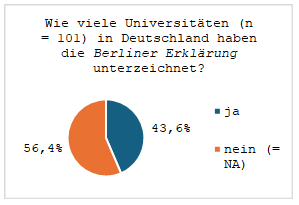

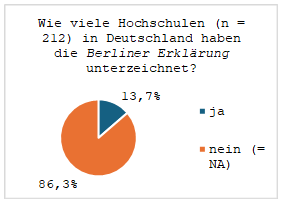

Die Universität Kassel war 2004 die erste, welche die *Berliner
Erklärung* unterschrieb. Eine Längsschnittanalyse in Abbildung 3 zeigt,
dass die Anzahl der unterzeichnenden Universitäten ab 2012 weiter
zunimmt (n=5), was auf die nach wie vor anhaltende Bedeutung der
*Berliner Erklärung* hindeutet. Die meisten Universitäten
unterzeichneten in den Jahren 2015 und 2016 (jeweils n=8). Mit einigen
Jahren Verzögerung zogen auch die Hochschulen nach. Während die
Technische Hochschule (TH) Wildau 2007 Vorreiterin war, kamen erst ab
2021 (n=6) und 2022 (n=10) vergleichsweise viele Hochschulen hinzu.
Sowohl für Universitäten als auch für Hochschulen lässt sich nach wie
vor ein leicht steigender Trend beobachten, welcher die Langzeitwirkung
und bleibende Bedeutung der *Berliner Erklärung* auch nach 20 Jahren
noch unterstreicht.

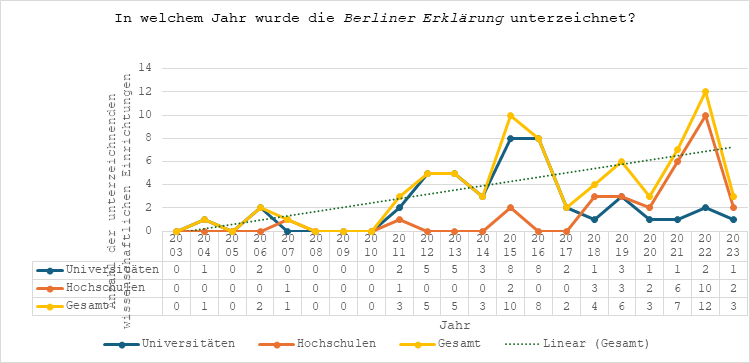

### Wie viele Universitäten und Hochschulen verfügen über eine Open Access Policy?

Als Open Access Policy definiert der oa.atlas eine von Gremien oder
Leitungsebenen verabschiedete Richtlinie, welche Rollen, Rechte und
Verantwortlichkeiten verschiedener Akteur\*innen einer Institution für
die Umsetzung von Open Access empfiehlt.[^7] Sie legt häufig einen
Schwerpunkt auf den freien Zugang zu wissenschaftlichen
Textpublikationen. Während rund 20 Prozent der Hochschulen eine Open
Access Policy haben, sind es bei den Universitäten fast 68 Prozent.

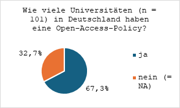

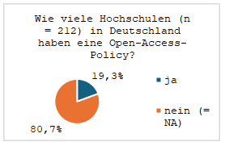

Die in Abbildung 6 gezeigte Längsschnittanalyse unterstreicht, dass vor
allem ab 2011 die Zahl der verabschiedeten Open Access Policies an den
Universitäten sprunghaft ansteigt (n=8) und ab 2019 (n=3) abfällt. Dies
belegt, dass ab diesem Zeitpunkt verstärkt strukturbildende Maßnahmen an
den Einrichtungen umgesetzt wurden; hier besteht vermutlich unter
anderem ein Zusammenhang mit dem Programm "Open Access Publizieren" der
Deutschen Forschungsgemeinschaft (DFG), das den Aufbau von
Open-Access-Publikationsfonds an 45 deutschen Hochschulen zwischen 2010
und 2016 förderte. (Ploder 2024) An den Hochschulen nimmt die Zahl der
verabschiedeten Policies in den Jahren 2018 (n=10), 2020 (n=7) und 2021
(n=8) jeweils im Vergleich zu den Vorjahren zu. Seit 2021 fällt die
Kurve leicht ab. Im Jahr 2018 wurden sowohl bei den Universitäten als
auch bei den Hochschulen relativ viele Open Access Policies beschlossen
(insgesamt n=19). In diesem Jahr hatten auch erstmals mehr Hochschulen
(n=10) eine Open Access Policy als Universitäten (n=9). So lässt sich
übergreifend für beide Institutionstypen ein leicht steigender Trend
erkennen. Während 2011, zwischen 2016 und 2018 sowie zwischen 2020 und
2022 die meisten Policies an Universitäten und Hochschulen verabschiedet
wurden, unterzeichneten Universitäten und Hochschulen die *Berliner
Erklärung* 2015, 2016 und 2022 am häufigsten.

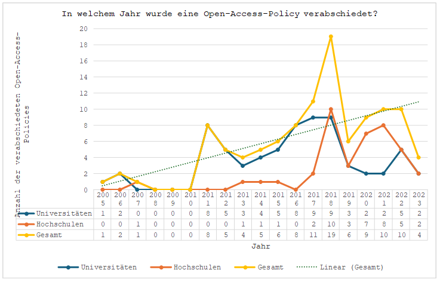

### Wie viele Universitäten und Hochschulen haben Open-Access-Beauftragte benannt?

Open-Access-Beauftragte repräsentieren laut Definition des oa.atlas das
Thema Open Access inner- und außerhalb ihrer Institution beispielsweise
durch das Voranbringen strategischer Fragen. Von den Hochschulen haben
mit rund sieben Prozent relativ wenige solche Open-Access-Beauftragte.
Auch die Universitäten haben nur zu knapp einem Drittel
Open-Access-Beauftragte benannt (36,6 %); die überwiegende Mehrheit von
89 Universitäten hat aber eine Ansprechperson für Open Access, die auf
der Website der Institution genannt wird. In einer tiefergehenden
Analyse könnte der Frage nachgegangen werden, ob es einen Zusammenhang
zwischen Open-Access-Beauftragen und Open Access Policies gibt. In jedem
Fall deutet sich eine Lücke an. Auf der einen Seite stehen die Policies
und die Unterzeichnung von Erklärungen, die zur Konsens- und
Community-Bildung beitragen sowie als Absichtserklärungen zum Teil auch
performativen Charakter haben. Auf der anderen Seite findet sich eine im
Vergleich eher zurückhaltende konkrete Implementierung und Umsetzung von
Maßnahmen in der Praxis durch offizielle Mandatsträger\*innen wie
Open-Access-Beauftragte. Dabei gibt es regionale Unterschiede. So zeigt
der aktuelle Open-Access-Bericht für das Land Berlin, dass gemäß der
Vorgabe der Berliner Open-Access-Strategie von 2015 fast alle Berliner
Universitäten und Hochschulen Open-Access-Beauftragte benannt haben
(Kindling et al. 2024a).

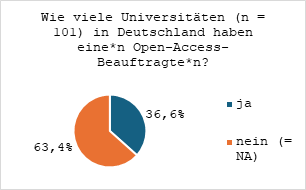

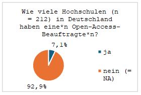

### Wie viele Universitäten und Hochschulen bieten ihren Angehörigen Repositorien für die Veröffentlichung und Archivierung von Publikationen?

Repositorien sind Dokumentenserver, die an Universitäten und
Forschungseinrichtungen betrieben werden und auf denen wissenschaftliche
Materialien archiviert sowie weltweit offen und langfristig zugänglich
gemacht werden. Publikationsinfrastrukturen in Form von Repositorien
sind Teil der wissenschaftseigenen, nicht-kommerziell ausgerichteten
Infrastruktur und tragen dazu bei, die Souveränität über Daten zu
behalten und das Tracken von Forschenden durch kommerzielle *Data
Analytics Business* zu unterbinden (Siems 2022).

Es zeigt sich, dass das Angebot von Repositorien insbesondere bei
Universitäten mit über 93 Prozent sehr weit verbreitet ist. Bei den
Hochschulen bieten etwas weniger als die Hälfte solche Services an
(48,6 %). Unter diesen sind auch kooperativ genutzte Angebote wie
beispielsweise ein durch die drei künstlerischen Hochschulen in Berlin
(Hochschule für Musik Hanns Eisler Berlin, Weißensee Kunsthochschule
Berlin, Hochschule für Schauspielkunst Ernst Busch) gemeinsam genutztes
Repositorium. In der Umsetzung von Open Access haben Repositorien als
institutionelle Infrastruktur, insbesondere für Zweitveröffentlichungen,
eine zentrale Funktion (Martin et al., 2023). Im besten Fall sind sie
DINI-zertifiziert (Oberländer 2017). Die im oa.atlas erfassten Daten
verdeutlichen, dass dies nur bei 52 der insgesamt 197 Repositorien der
Fall ist -- davon haben allerdings inzwischen 22 Zertifikate ihre
Gültigkeit verloren.[^8] Mit der Veröffentlichung einer neuen Version
des Zertifikats im September 2025 werden voraussichtlich 18 weitere
nicht mehr über ein gültiges Zertifikat verfügen. Die zwölf noch gültig
zertifizierten Repositorien verteilen sich auf die TH Wildau und elf
Universitäten. Mit Blick auf das Gesamtangebot an Repositorien zur
Unterstützung des Open-Access-Publizierens sollte die Bedeutung von
Publikationsinfrastrukturen über institutionelle Angebote hinaus nicht
außer Acht gelassen werden: So publizieren Forschende aus vielen
Bereichen der Natur- und Lebenswissenschaften auf Angeboten wie arXiv,
ChemRxiv, bioRxiv, medRxiv oder PubMed Central (PMC). Auch bestehen
disziplinübergreifende Ansätze wie beispielsweise das nationale
Repositorium HAL in Frankreich[^9], das eine zentrale Komponente der
Umsetzung der Open Science Policy Frankreichs (*National Plan for Open
Science*) darstellt und unter anderem von der französischen Regierung
finanziert wird (Schöpfel et al., 2024, S. 174). Ein solche Policy und
damit verbundenes nationales Angebot besteht hingegen in Deutschland
nicht. Weiter untersuchenswert wäre, ob eine stärkere Konsolidierung zu
einer Entlastung personeller und finanzieller Ressourcen führen kann
(Brembs et al. 2021, <https://doi.org/10.5446/55690>,
01:24:34--01:25:06) und inwieweit eine verteilte und gut vernetzte
Infrastruktur eine nachhaltig ausgerichtete Landschaft an offenen
Infrastrukturen stärken kann -- dazu hat jüngst etwa die DFG ein
Diskussionspapier veröffentlicht (DFG 2025).

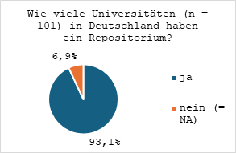

### Wie viele Universitäten und Hochschulen betreiben Open-Access-Verlage und/oder Hostingdienste für Zeitschriften?

Open-Access-Verlage und Hostingdienste für Zeitschriften, die im
oa.atlas erfasst werden, werden durch die Universitäten und die
Hochschulen selbst betrieben. Die Daten im oa.atlas zeigen, dass bereits
mehr als ein Viertel aller Universitäten (25,7 %) über einen
Open-Access-Verlag und/oder Hostingdienste (37,6 %) verfügen. Dem
oa.atlas ist ebenso zu entnehmen, dass 18 Universitäten sowohl einen
Verlag als auch einen Hostingdienst betreiben. Im Fall von Berlin
Universities Publishing (BerlinUP), getragen von den Bibliotheken der
Freien Universität Berlin, der Humboldt-Universität zu Berlin, der
Technischen Universität Berlin und der Charité -- Universitätsmedizin
Berlin, erfolgt der Betrieb kooperativ.[^10] An Hochschulen sind
Open-Access-Verlage (0,9 %) und Hostingdienste (1,4 %) dagegen wohl
unter anderem aufgrund des geringeren Publikationsaufkommens und
fehlenden Open-Access-Strukturen kaum vorhanden. Lediglich die
Hochschule für Technik, Wirtschaft und Kultur Leipzig (HTWK) hat einen
eigenen Verlag, während die Hochschule für Politik München (HfP) eine
gemeinsame Infrastruktur mit dem Verlag der Technischen Universität
München (TUM) nutzt. Nur die Hochschule Hannover, die Fachhochschule
Münster und die Technische Hochschule Würzburg-Schweinfurt (THWS) haben
Instanzen zum Hosten von Journals.

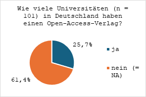

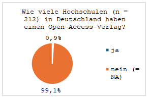

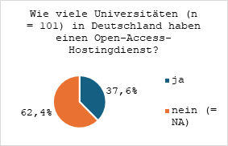

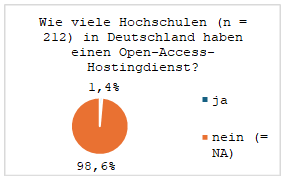

Im Zuge des Ausbaus von Diamond-Open-Access-Angeboten an deutschen
Wissenschaftsinstitutionen ist zu erwarten, dass dem institutionellen
und durch die Wissenschaft getragenen Angebot von
Publikationsinfrastrukturen künftig eine noch größere Bedeutung zukommt.
Der weitere Ausbau wird sich auch anhand des oa.atlas nachzeichnen
lassen. Darüber hinaus zeigen die in diesem Beitrag betrachteten
Variablen nur einen Teil der über den oa.atlas möglichen Analysen.
Änderungswünsche zu den erfassten Informationen können über das
Review-Formular[^11] übermittelt werden. Allgemeines Feedback nimmt die
Redaktion des oa.atlas gerne entgegen.[^12]

### Anmerkung

Bei diesem Beitrag handelt es sich um eine leicht überarbeitete Fassung
des Blogbeitrags der Autorinnen im Open Research Blog Berlin: Franz,
Simone & Kindling, Maxi (2025) Offene Wissenschaft kartieren. Status quo
von Open-Access-Strategien und Infrastrukturangeboten an Universitäten
und Hochschulen im oa.atlas. DOI:
<https://doi.org/10.59350/6bhhc-f8j85>

### Referenzen

Brembs, Björn; Degkwitz, Andreas; Holzer, Angela; Reda, Felix; Wiarda,
Jan-Martin (2021): Wenn du nicht für das Produkt bezahlst, bist du
selbst das Produkt? Eine Podiumsdiskussion zur Kommerzialisierung von
Offener Wissenschaft. TIB AV-Portal. DOI:
<https://doi.org/10.5446/55690>

Deutsche Forschungsgemeinschaft (2025) Digitale Forschungspraxis und
kooperative Informationsinfrastrukturen. Ein Diskussionspapier der
Deutschen Forschungsgemeinschaft (DFG) zu Förderung und Finanzierung
wissenschaftlicher Informationsinfrastrukturen. DOI:
<https://doi.org/10.5281/zenodo.14621979>

Martin, Linda; Kindling, Maxi, & Rücknagel, Jesko (2023)
Zweitveröffentlichungsservices an Hochschulen. Bericht zur Erhebung
(1.0) DOI: <https://doi.org/10.5281/zenodo.7990619>

Kindling, Maxi; Neufend, Maike & Fischer, Georg (2024a)
Organisationsentwicklung und Kompetenzvermittlung. In: Open-Access-Büro
Berlin et al. (2024) Open-Access-Bericht Berlin. DOI: <https://doi.org/10.21428/986c5d43.3ba47a23>

Kindling, Maxi; Martin, Linda & Neufend, Maike (2024) oa.atlas: Konzept.
*Open Research Office Berlin*. DOI: <https://doi.org/10.21428/986c5d43.54fbd167>

Oberländer, Anja (2017) Förderung von Open Access über institutionelle
Infrastrukturen, insbesondere Repositorien. In: Söllner, Konstanze &
Mittermaier, Bernhard. \[Hrsg.\] (2027) Praxishandbuch Open Access. De
Gruyter Saur, 2017. S.137--145. DOI: <https://doi.org/10.1515/9783110494068-016>

Ploder, Michael et al. (2020) Das DFG-Förderprogramm Open Access
Publizieren -- Bericht über die Förderung. Zenodo. DOI: <https://doi.org/10.5281/zenodo.4486411>

Schöpfel, Joachim; Azeroual, Otmane; Chaudiron, Stéphane; Jacquemin,
Bernard; Kergosien, Eric; Prost, Hélène; Thiault, Florence (2024) From
Open Repositories to CRIS - A Case Study. In: Procedia Computer Science
(249). DOI: <https://doi.org/10.1016/j.procs.2024.11.061>

Siems, Renke (2022) Das Lesen der Anderen: Die Auswirkungen von User
Tracking auf Bibliotheken. O-Bib. Das offene Bibliotheksjournal, 9(1),
1--25. DOI: <https://doi.org/10.5282/o-bib/5797>

[^1]: <https://open-access.network/startseite>;
    künftig werden die Services des Projekts durch den Verein
    open-access.netwok e. V. in ein community-betriebenes Angebot
    überführt:
    <https://open-access.network/ueber-uns/verein>.

[^2]: Übersicht nach deutschen Bundesländern siehe
    <https://oabb.pubpub.org/dash/collection/oa-atlas/overview>

[^3]: <https://open-access.network/services/oaatlas>

[^4]: <https://open-access.network/services/oaatlas/oaatlas-review>

[^5]: <https://www.hochschulkompass.de/home.html>

[^6]: <https://openaccess.mpg.de/Berliner-Erklaerung>

[^7]: Kurzbeschreibung der im oa.atlas erfassten Daten siehe
    <https://open-access.network/services/oaatlas/ueber-den-oaatlas>

[^8]: Definition des oa.atlas: "Ein einmal ausgestelltes Zertifikat
    verliert mit der Veröffentlichung der dritten Nachfolgeversion des
    Kriterienkatalogs seine Gültigkeit. Derzeit gültige Versionen: 2016,
    2019, 2022."
    <https://open-access.network/services/oaatlas/ueber-den-oaatlas>.

[^9]: <https://hal.science/>

[^10]: <https://www.berlin-universities-publishing.de/>

[^11]: <https://open-access.network/services/oaatlas/oaatlas-review>

[^12]: <https://open-access.network/services/oaatlas>
