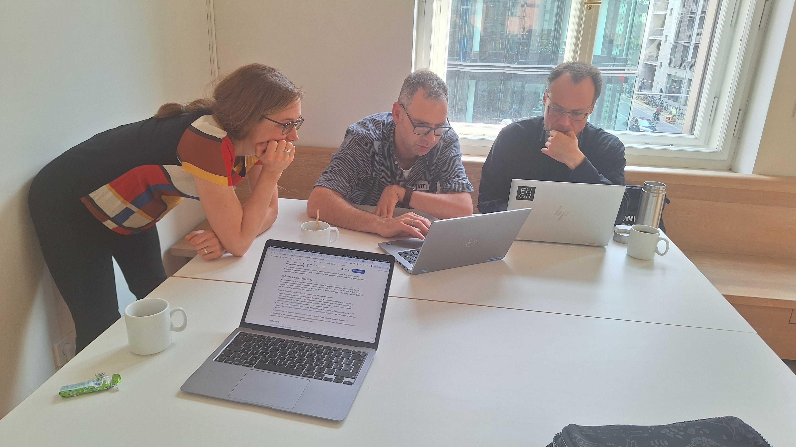
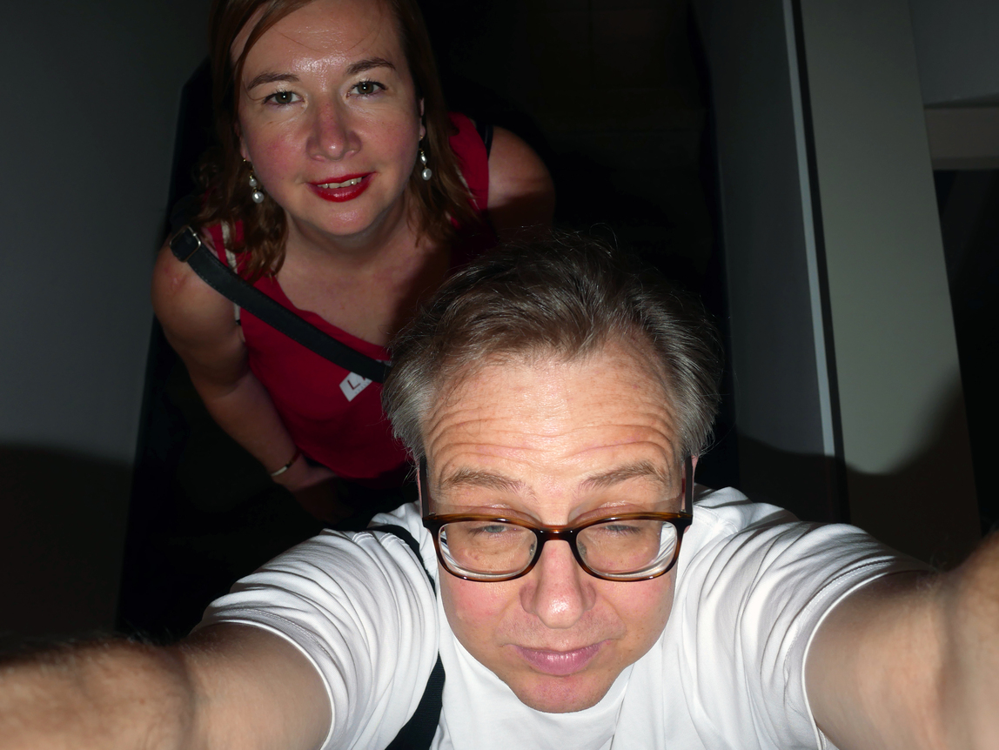

### Ach ja, 20.

Wenn die Zeitschrift LIBREAS dieses Jahr ihre zwanzigste Jahreskerbe in
die Borke der Zeit schnitzt, wie wir es im verspielten Sound unserer
frühen Jahre formuliert hätten, dann ist es für diejenigen, die von
Beginn an dabei sind, nichts weniger als unglaublich. Zwanzig Jahre
Zeitschrift heißt auch zwanzig Jahre Leben. Da mag man noch so
professionell und abgeklärt auf die Sache blicken wollen: Es ist etwas
Persönliches. Mit LIBREAS haben wir uns in unsere kleine Domäne, nämlich
in den Bibliotheksdiskurs und seine angrenzenden Felder, eingeschrieben
beziehungsweise hineinpubliziert und all die Texte, Bilder und
Kommunikationen wirkten in gleicher Weise zurück auf uns selbst.
Erwartbar sind wir heute im Vergleich zur Gründungsphase jeweils andere
Menschen und es wäre gelogen, würde man nicht anerkennen, dass
unterschiedliche berufliche und private Lebenswege auch bedeuten, dass
die Schnittmengen in Einstellungen, Möglichkeiten und Perspektiven auf
LIBREAS und das Bibliothekswesen mit der Zeit schrumpfen. Wir sind nicht
mehr, wie 2005, bereits durch einen gemeinsamen Ort -- das Institut für
Bibliotheks- und Informationswissenschaft der HU Berlin -- verbunden, an
dem wir große Teile unserer Tage so oder so miteinander verbrachten. Wir
sind verstreut über Institutionen, Regionen und Lebensstilmodelle, was
dem erstaunlicherweise nach wie vor existenten Idealismus praktische
Grenzen setzt und ein pragmatischeres, effizienteres, zugleich
spontaneres und improvisiertes Vorgehen einfordert.

### Schreiben, wie es früher war

Das Format, mit dem wir nun unser Jubiläum begingen, entsprach dieser
Wirklichkeit. In gewisser Weise simulierten wir mit dem *Editathon* vom
6. Juni 2025 die Stimmung der Anfangsjahre: Gemeinsam in einem Raum ein
paar Stunden verbringen und schauen, was dabei herauskommt. Mit diesem
denkbar simplen Ansatz entstand LIBREAS vor über 20 Jahren als die Idee
zu dieser Zeitschrift heranreifte. Im März 2005 präsentierten wir unsere
erste Ausgabe, eher nebenbei, auf dem Bibliothekartag (der heute anders
heißt) in Düsseldorf, dessen Heinrich Heine entlehntes Motto \'Geld ist
rund und rollt weg, aber Bildung bleibt\' aus heutiger Sicht so korrekt
wie naiv wirkt. Bildung war das Schlagwort dieser Zeit.

Um die Bibliothekswissenschaft als Fach in Deutschland stand es damals
dagegen ärger als heute. In Düsseldorf präsentierte das damals noch
Institut für Bibliothekswissenschaft -- darunter auch das
LIBREAS-Gründungsgrüppchen -- in einem Vortrag das "Imageproblem der
deutschen Bibliothekswissenschaft". Die Präsentation kumulierte in einer
denkbar umfassenden These: "Aufgabe der Bibliothekswissenschaft ist die
wissenschaftliche Fundierung der Wissensversorgung in allen Bereichen
der Gesellschaft."[^1] Dazu warfen wir einige Forschungsfelder für das
Fach an die Wand des Hörsaals: "Benutzungsforschung, Statistik und
Evaluation, Bestandserhaltung und Katastrophenschutz, Formale und
inhaltliche Erschließungssysteme, Entwicklungen der
Informationstechnologie (beispielsweise Semantic Web, Ontologien),
Konvergenz konventioneller und elektronischer Informationsquellen,
Informationskompetenz, Informationsethik, Bibliotheksbetriebswirtschaft,
Internationaler Vergleich, Bibliotheksbau ..."

### Transformation!

*Transformation*, Leitbegriff eigentlich jeder Gegenwart, aber umso mehr
natürlich jeder Gegenwart, die man selbst erlebt, galt als Prozess der
Stunde und das skizzierte Forschungsprogramm unterstreicht noch einmal,
wie Bibliotheken und Bibliothekswissenschaft um 2005 mit einem Bein im
Analogen und mit dem anderen im Digitalen standen. Zwanzig Jahre später
hat sich das Fach klugerweise nicht in einen schwer auszuhaltenden
Spagat zwingen lassen, sondern ist mit beiden Beinen weitgehend digital,
zumindest als Ausgangspunkt. Wo ein halbes Fußbreit unter Ideen wie der
*Bibliothek als Ort* oder (Digital!) *Makerspaces* der Schritt in den
Raum angedeutet wird, bleibt es beim "digital zuerst". Es ist schwer zu
glauben, dass das vor einem in dieser Hinsicht kurz erscheinenden
Doppeljahrzehnt noch anders war.

Aber es war. Ein Teil von uns las die Zeitschriften *n+1* und *Cabinet*,
von denen wir uns gern hätten inspirieren lassen, gedruckt, was gar
nicht leicht und vermutlich nur in Städten wie Berlin möglich war, denn
auch die damals sehr üppig bestückten Regale der noch umsatzstarken
Bahnhofsbuchhandlungen hatten diese Publikationen nicht im Bestand.
Nischenbuchläden in Berlin hatten sie. In Sachen Inspiration ist eine
lebendige Metropole dann doch unschlagbar. Das Scheunenviertel ab der
2000er Jahre war ein Treibhaus der Kulturavantgarde mit Galerien,
Tacheles, C/O und einer Buchhandlung namens "pro qm", die, obwohl auf
Architektur und Städtebau spezialisiert, als Beifang auch eine ganze
neue Kultur von Debatte, Diskurs und Print in die Stadt brachte. Das
Institut für Bibliothekswissenschaft lag räumlich nur eine Behelfsbrücke
entfernt von dieser Welt und wenn man wollte, konnte man zur
Mittagspause durch den Skulpturenhof des Tacheles spazieren, an dessen
Stelle nun eine Rolltreppe zu einer austauschbaren Filiale einer
Supermarktkette führt.

Ein in der Ellipse der Liste der Forschungsthemen 2005 verstecktes
Desiderat war das junge Phänomen des Open Access. Ein wenig wundert man
sich doch beim Blick auf die Zeitlinie, denn die Berliner Erklärung
hatte ihr Ausrufezeichen bereits gesetzt und angeregt, die
"Wissensversorgung in allen Bereichen der Gesellschaft" gründlich
umzupflügen. Open Access war auch ein Thema am Berliner Institut, was
sich bereits darin zeigt, dass wir LIBREAS ausdrücklich und
ausschließlich als Open-Access-Zeitschrift angedacht hatten. Die Idee
stand im Raum, das konkrete Vorgehen jedoch weniger. Es waren in
mehrfacher Hinsicht digitale Findungsjahre und zu diesem Sich-Finden
gehörte auch ein globales Projekt der Wissensakkumulation und
Zugänglichmachung, das verstreut Ansätze frühdigitaler
Kommunikationskulturen in einem bewusst niedrigschwelligen Ansatz
bündelte und sich *Wikipedia* nannte.

### Wiki jetzt!

Zur gleichen Zeit, zu der Jimmy Wales und andere realisierten, dass sich
aus der "Nupedia" ein Projekt größeren Anspruchs machen ließe, fuhr ich
einmal im Monat zum Alexanderplatz, unterquerte die
Karl-Liebknecht-Straße, um in der Filiale des Bertelsmann-Buchclubs mit
der Mitgliedskarte meines Vaters jeweils einen Band eines Lexikons zu
kaufen, das in meiner Berliner Wohnung bis heute über fünfzehn Bände
gestreckt einen enzyklopädischen Überblick über alles von vermeintlicher
Relevanz von A bis Z ins Regal reiht. Die einzelnen Einträge der
"ungekürzten Buchgemeinschafts-Lizenzausgabe" des BROCKHAUS' umfassten
je nach Bedeutung des Themas zwischen einem und vielleicht dreißig
Sätzen Text. Wo es passte und besonders wichtig war, gab es
briefmarkengroße Illustrationen. Was sich zunächst als Auftakt der
Wiederholung des Buchbestands im elterlichen Arbeitszimmer mit seinen
fünf x-bändigen Nachschlagewerken aus zwei Jahrhunderten andeutete,
erwies sich im Ergebnis als Endling einer Traditionslinie der
Wissenssammlung und -repräsentation. Weitere Lexika stehen bei mir nicht
im Regal.

Denn zeitgleich wuchs und wucherte irgendwo auf einem Server die
Wikipedia Edit für Edit. Sie schnitt nicht nur den Docht des einst
bildungsbürgerlichen Aushängeschilds namens Universallexikon ab. Sie
formte auch ein datafiziertes Abbild der Welt, auf dem zwei Jahrzehnte
später LLMs trainieren und den Rahmen für die frühen
Publikumsanwendungen Künstlicher Intelligenz vorgeben sollten. Im
September 2002 hatte die englische Fassung der Wikipedia die Microsoft
Encarta hinsichtlich der Zahl der Einträge überholt. Im Sommer 2004
hatte sie mehr Einträge als die dreißigbändige 21. und letzte Auflage
des Brockhaus Universallexikons, mit dem sie sich in Deutschland ein
Scheinwettrennen lieferte. Die gedruckte *Encyclopedia Britannica* gab
sich 2010 geschlagen. Verschwunden sind die Inhalte der Bände nicht
unbedingt. In vielen Fällen wurden sie zur, häufig leider nicht so
zitierten, Grundlage der Beiträge, die die Freiwilligen in der Wikipedia
anlegten.

Entsprechend ist es in den Zeitlinien durchaus stimmig, dass sich
LIBREAS zur Feier seines 20. Jahres in die Wikipedia begab und in einem
Edit-a-thon mit dem, was die Plattform im Guten wie im Schlechten
auszeichnet, aktiv befasste.

Zu den Nachteilen der Wikipedia gehört, dass in ihr wie in allen von
Enthusiasmus getragenen Projekten das Beginnen und Anskizzieren deutlich
einfacher und attraktiver ist als das Abrunden oder in diesem Fall
fortlaufende Pflegen. Aus Sicht der Bibliothekswissenschaft zeigt sich
das besonders griffig am *Wikipedia-Portal:Bibliothek, Information,
Dokumentation*.[^2] Die Versionsgeschichte dokumentiert den Start auf
den ersten April 2004 und für die Eingangsseite rege 147 Edits im Jahr
2004. Im Jahr 2005 waren es 285, 2006 noch 113. Im Jahr 2007 wurde es
zweistellig, 2009 einstellig. Es folgten Jahre ohne Aktivität. Im Juli
2022 wurde die Verknüpfung zu einem Portal namens "Digitale Welt"
ergänzt.[^3] Das Versprechen auf der Startseite des Portals, nämlich
"Dieses Portal und seine Artikel wachsen seit der Entstehung im Jahr
2004 kontinuierlich weiter." legt zumindest eine sehr großzügige
Interpretation des Konzepts der Kontinuität nahe. Wir als LIBREAS-Team
sind natürlich ebenso ursächlich betroffen und ermahnt. Denn wer, wenn
nicht -- auch -- wir, könnte für die fortlaufende Aktualisierung sorgen?
Nur hatten wir das Portal erstaunlicherweise über fast zwei Jahrzehnte
so und so nicht auf dem Schirm.

Der Editathon wollte das in dem Umfang ändern, den ein Nachmittag
zulässt. Wir trafen uns im Einstein Center Digital Future (ECDF) an der
Berliner Wilhelmstraße, um "in einer Art Editiersprint das BID-Portal
kollaborativ zu erweitern, zu ergänzen und zu aktualisieren".[^4] Gelang
es uns? Zum Teil. Einige neue Artikel entstanden, andere wurden
aktualisiert. Wichtiger waren aber zwei Dinge. Einerseits das Soziale:
Wir saßen seit langem wieder einmal im größeren Kreis und gemeinsam mit
Peers, die nicht bei LIBREAS aktiv sind, fast im Zeitgeist der 2000er
Jahre an einem physischen Ort zusammen und editierten. Andererseits: Das
Gelernte. Unter Anleitung des wikipedianischen Urgesteins Nina
Gerlach[^5] tauchten wir reflexiv in die Praxis der
folks-enzyklopädischen Arbeit ein und mit einigen Einsichten und Ideen
wieder auf.

### Belege und Bescheidenheit: Lektionen aus dem Editathon 

Zu diesen Erkenntnissen gehört die unterschätzte Herausforderung der
Belegpflicht. Die Wikipedia ist keine wissenschaftliche
Kommunikationsplattform, besitzt also kein dahingehend grundiertes
Zitiergebot. Sie besteht aber mehr oder weniger darauf, dass die
eingepflegten Angaben, Fakten und Aussagen über Quellen belegt werden.
Aus wissenschaftlicher Sicht ist das Vorgehen jedoch etwas unscharf,
denn die eigentliche Qualität der Quellen bleibt jeweils offen. Zugleich
treibt der Belegzwang mitunter sonderbare Blüten. So wollte die
Schriftstellerin Emily St. John Mandel im Jahr 2022 den Eintrag zu ihrer
Person aktualisieren und ihren Status als geschieden eintragen. Dies
wurde ihr aber vor dem Hintergrund der Belegrichtlinien verwehrt. Sie
sah sich daher gezwungen, den Umweg über ein speziell für den Zweck der
Vorbereitung eines Wikipedia-Edits lanciertes Interview zu nehmen.[^6]

Es ist demzufolge mitunter äußerst schwierig, die Wikipedia zu Themen
auszubauen, über die man am besten Bescheid weiß: sich selbst. So
diskutierten wir ohne befriedigendes Ergebnis, ob die LIBREAS-Redaktion
die Wikipedia-Seite zu LIBREAS[^7] selbst aktualisieren dürfte.

Dieses Gebot der Selbstzurückhaltung führte auch zur sofortigen
Einhegung einer spontanen Idee, die für die fortlaufende Aktualisierung
des BID-Portals im Raum aufkam. Wir fragten uns, ob wir nicht die
Aktualisierung von Wikipedia-Beiträgen, zu denen LIBREAS Inhalte
publiziert, direkt in unseren Redaktionsworkflow aufnehmen sollten. Gäbe
es einen Aufsatz zu KI-Systemen und Zettelkatalogen in Bibliotheken,
würden wir diese neuen Informationen mitsamt Beleg direkt in den
entsprechenden Wikipedia-Artikel ergänzen. Das Problem liegt hier in der
Frage: Wer schreibt? Schreiben wir selbst, bestände die Gefahr, dass die
qualitätssichernden Akteure der Wikipedia-Community hinter der Ergänzung
nicht inhaltliche Erweiterung, sondern Eigenwerbung oder Link-Spamming
vermuteten und einen eventuellen Account der Redaktion einer Sperrung
zuführten. Die Alternative, die nur halb eine ist, wäre, inhaltliche
Ergänzungen auf der jeweiligen Diskussionsseite als Vorschlag zu
vermerken und darauf zu hoffen, dass eine neutrale Person den Edit
vornimmt. Eine solche Person müsste jedoch erst einmal auf den Vorschlag
stoßen und ihn umsetzen wollen.

Nach dieser Abkühlung der Ausgangsbegeisterung eröffneten sich aber doch
aktive Teilhabemöglichkeiten. So könnte die LIBREAS-Redaktion problemlos
die Wikipedia-Seiten anderer Bibliothekszeitschriften aktualisieren, was
während des Editathons auch begonnen wurde. Die Logik hinter dem Tabu
der Selbstaktualisierung stieß dennoch auf eine fortwährende Skepsis,
die sich wohl nicht auflösen lassen wird. Möglicherweise motiviert sie
aber den Ausbau einer Kooperation zwischen Redaktionen, deren Gegenstand
ein Wechselseitigkeitsprinzip bei der Aktualisierung der jeweiligen
Einträge ist.

Eine zweite Problemstelle der Belegpraxis ist die Absicherung der
Zugänglichkeit, also der digitalen Langzeitverfügbarhaltung der Quellen.
Viele sind, wie sich zeigte, nicht dauerhaft verfügbar und überprüfbar.
Einige sind, wenn man Glück hat, in der Wayback Machine des Internet
Archive hinterlegt[^8], das jedoch, wenn man Pech hat, aus technischen
Gründen gerade nicht verfügbar ist -- so zumindest temporär auch am
Editathons-Nachmittag. Aus Sicht der digitalen Archivierung ist das eine
äußerst fragile und unbefriedigende Situation. Schöner wäre es sicher,
wenn sich die Wikipedia vielleicht in Zusammenarbeit mit nationalen
zentralen Gedächtnisorganisationen automatisch eine Version jeder Seite
spiegelte, die als Beleg verknüpft wird. Wie öffentlich zugänglich diese
Quellen dann sind, wäre vermutlich eine urheberrechtliche Diskussion.
Aber selbst wenn man nur eine Zugriffschance im Lesesaal einer
Nationalbibliothek hätte, wäre das besser als eine generelle
Nicht-Verfügbarkeit einer Quelle.

Auch unabhängig von diesem Problem bleibt das Recherchieren, Einordnen,
Aktualisieren und bloße Erfassen von Referenzen mühsam und
zeitaufwändiger, als man gemeinhin annimmt. Bei der Zeitplanung von
Editathons ist das ein wichtiger Faktor, denn gerade dann, wenn man
Quellen nicht arbiträr in die Einträge würfelt, sondern systematisch
einarbeiten möchte, kann es sein, dass man nur zwei oder drei von diesen
in einer Stunde bewältigt.

Das wiederum führte zur Frage, ob so viel Hingabe ins Detail überhaupt
gewünscht ist. Auf der einen Seite rast man schnell und sicher in eine
Löschdiskussion, wenn man auf Quellen verzichtet. Auf der anderen Seite
wird bisweilen in Revert-Schleifen hinterfragt, ob das eine oder andere
Supplement, für dessen Verifizierung man gerade vier Fachaufsätze
durchgearbeitet hat, nicht die Relevanzgrenzen einer Online-Enzyklopädie
übertritt. Die Diskussion, ob die Wikipedia inklusiv oder exklusiv sein
möchte, ist so alt wie die Seite selbst. Für Gelegenheitsbeitragende,
die nicht permanent in den entsprechenden Diskussionen unterwegs sind,
kann es mitunter schwierig und im Resultat frustrierend sein, den
entsprechenden Sweet-Spot zu treffen.

### Teilhabesteuerung im Zeitalter der LLM

Entsprechend ergab sich die Idee oder sogar der Bedarf einer stärkeren
soziologischen und vielleicht auch sozialpsychologischen Erforschung der
Communitys der Wikipedia-Beitragenden. Die Editier-Empirie läuft auf
Hypothesen zu, die andeuten, dass sich Steuerungs- und Machtstrukturen
entwickeln, welche bestimmte Kohorten enorm begünstigen und andere eher
von Beginn an marginalisieren. Wer lange dabei ist, viel Zeit und
Kommunikation investiert, hat vermutlich einen besseren Stand, seine
Themen abzubilden, als Personen, die nur hin und wieder eine Zeile
ergänzen oder eine Angabe korrigieren wollen.

Einer Diversifizierung und Verjüngung des Pools an Editierenden käme
eine solche Situation natürlich ebenso wenig entgegen wie eine sich
immer weiter verästelnde Ausarbeitung eines Beitragsregelwerks. Für
viele derer, die nur gelegentlich editieren, ist nicht unbedingt der
Wille, sondern die Ressource Zeit eine Beschränkung. Diesen
Interessierten einige Dutzend Seiten Regelwerk in nicht immer intuitiver
Struktur und ein umfassendes Sandboxing aufzuerlegen, bevor sie
beispielsweise das Datum des Ablebens oder der Geburt einer prominenten
Persönlichkeit nachtragen dürfen, lässt sich vor allem als explizite
Einladung zur Passivität verstehen. Dies jedoch stände der Grundidee
einer partizipativen Wissensressource grundsätzlich entgegen.

Die Vorsicht und Regularien sind gleichzeitig nachvollziehbar, denn in
dem Maß, in dem die Wikipedia zur zentralen Wissensdatenbank avancierte,
wuchs auch das Aufkommen von Manipulationsversuchen. Es gibt
spezialisierte PR-Unternehmen und zunehmend auch KI-generierte Inhalte,
die das händische Sichten und Beurteilen von Edits de facto überfordern.
Welche Strategien eines solchen Flutens der Wikipedia wirklich wirksam
entgegenstehen könnten, ohne die Idee der offenen Teilhabe massiv zu
beschneiden, scheint derzeit unklar. Die Entwicklung neuer Formen der
Qualitätssicherung ist aber unverzichtbar, so die abschließende
Perspektive. Denn wenn Large Language Models (LLMs) auf den Inhalten der
Wikipedia aufsetzen und zugleich KI-generierte Inhalte und damit oft
auch "halluzinierte" Belege und Aussagen in die Wikipedia einfließen,
drohen zirkuläre Effekte, die die Verlässlichkeit und damit auch den
Nutzen des gesamten Angebots grundsätzlich unterlaufen. In einer
ironischen Wendung könnte sich also die *Moral Panic*, die die frühen
Jahre der Wikipedia begleitete und ein paar Generationen von
Schüler\*innen und Studierenden mit dem Mantra überschüttete, dass die
Wikipedia auf keinen Fall eine verlässliche Quelle sei, 25 Jahre später
in wachsendem Maße als berechtigt erweisen.

### Das Ballhaus in der Auguststraße

Mit diesem offenen Ende und der Motivation, das Phänomen Wikipedia noch
fokussierter zu durchdenken, gingen wir aus dem Editathon ins
frühsommerliche Berlin mit seiner Vielfalt von Menschen, die eine
Vielzahl von Gedanken jonglieren und auch mal fallen lassen, von denen
die wenigsten in diesem Augenblick mit der Wikipedia oder LIBREAS zu tun
haben dürften. Wir klebten uns dennoch per Sticker auf eine Laterne und
wanderten dann ins Scheunenviertel. Dort wartete ein Tisch in einer
zentralen und aufpolierten Traditionsinstitution der Berliner Mitte:
Clärchens Ballhaus[^9], dessen Restaurant derzeit Luna D'Oro heißt.
Entsprechend golden in der Stimmung vermischten sich die
Editathor\*innen und LIBREAS-Redakteur\*innen mit Freund\*innen und
Bekannten und flaxten und diskutierten und plauderten zu frittierten
Gürkchen und Waldmeister-Wackelpudding darüber, wie zwanzig Jahre Zeit
vergehen und wie schön sich dieser Moment in eine zukünftige
LIBREAS-Rückschau einfügen wird. Für unsere eigene Erinnerung wurde die
Relevanzhürde auf jeden Fall genommen. Und zur Not haben wir ein paar
Schnappschüsse als Belegquellen.

[^1]: Petra Hauke, Jana Grünewald, Ben Kaden, Andrea Kaufmann, Maxi
    Kindling, Jakob Voß: Das Imageproblem der deutschen
    Bibliothekswissenschaft. Düsseldorf: 94. Deutscher Bibliothekartag.
    <https://nbn-resolving.org/urn:nbn:de:0290-opus-937>

[^2]: <https://de.wikipedia.org/wiki/Portal:Bibliothek,_Information,_Dokumentation>

[^3]: <https://de.wikipedia.org/w/index.php?title=Portal%3ABibliothek%2C_Information%2C_Dokumentation&diff=224947524&oldid=145447641>

[^4]: <https://de.wikipedia.org/wiki/Portal:BID/LIBREAS_Edit-a-thon>

[^5]: <https://de.wikipedia.org/wiki/Benutzer:Nina>

[^6]: Dan Kois: A Totally Normal Interview With Author Emily St. John
    Mandel. In: [Slate.com](http://slate.com), 17.12.2022.
    <https://slate.com/culture/2022/12/emily-st-john-mandel-divorced-wikipedia.html>

[^7]: <https://de.wikipedia.org/wiki/LIBREAS>

[^8]: <https://web.archive.org/web/20250000000000*/libreas.eu>

[^9]: <https://de.wikipedia.org/wiki/Cl%C3%A4rchens_Ballhaus>
